# 从JFinal4.5 CMS 接触JAVA代码审计-先知社区

> **来源**: https://xz.aliyun.com/news/19083  
> **文章ID**: 19083

---

#### web.xml与pom.xml

##### web.xml 文件的作用

1、配置 Web 应用的基本信息

* **定义应用名称和上下文路径**：通过`<display - name>`标签可以为 Web 应用定义一个在服务器管理界面显示的名称。同时，Web 应用的上下文路径（Context Path）也与 web.xml 相关，虽然它不是直接在 web.xml 中配置，但在部署时，服务器会根据 web.xml 中的配置以及应用的名称等因素来确定上下文路径，方便用户访问应用。例如，在一个简单的 Java Web 应用中，应用名称可以是 “MyWebApp”，用户通过类似于 “<http://localhost:8080/MyWebApp>” 的 URL 来访问应用。

比如：

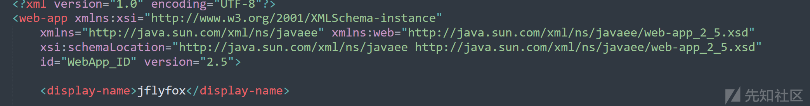

* **设置欢迎页面**：使用`<welcome - file - list>`标签来指定当用户访问应用的根目录时，自动加载的页面。例如：

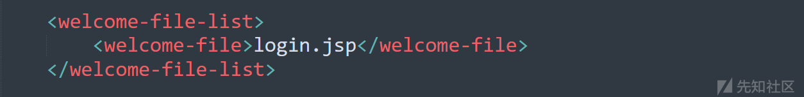

**Servlet信息**

* 这表示当用户在浏览器中输入应用的根URL时，服务器会首先尝试加载并显示`index.jsp`页面。
* **配置Servlet和JSP相关内容**

* **Servlet配置**：在Java Web应用中，Servlet是处理客户端请求的核心组件。web.xml用于定义Servlet的详细信息，包括Servlet名称、实现类以及URL映射。例如：

```
<servlet>
    <servlet - name>MyServlet</servlet - name>

    <servlet - class>com.example.MyServletClass</servlet - class>

</servlet>

<servlet - mapping>
    <servlet - name>MyServlet</servlet - name>

    <url - pattern>/myServletPath</url - pattern>

</servlet - mapping>
```

2、**配置过滤器（Filter）**

过滤器可以在请求到达 Servlet 之前或者响应返回给客户端之前，对请求和响应进行预处理和后处理。web.xml 用于定义过滤器的名称、实现类以及过滤的 URL 模式。

例如：

* 这里定义了一个名为`EncodingFilter`的过滤器，其实现类是`com.example.EncodingFilterClass`，并且通过`<init - param>`标签设置了一个初始化参数`encoding`为`UTF - 8`。`<filter - mapping>`将这个过滤器映射到所有的URL（`/*`），这样每个请求都会先经过这个过滤器，在请求处理前将字符编码设置为`UTF - 8`。
* **配置监听器（Listener）**

* 监听器用于监听Web应用的生命周期事件或者会话（Session）事件等。web.xml可以用于注册监听器，例如，一个用于监听Web应用上下文初始化和销毁的监听器配置如下：

```
<listener>
    <listener - class>com.example.MyContextListenerClass</listener - class>

</listener>
```

```
<filter>
    <filter - name>EncodingFilter</filter - name>
    <filter - class>com.example.EncodingFilterClass</filter - class>
    <init - param>
        <param - name>encoding</param - name>
        <param - value>UTF - 8</param - value>
    </init - param>
</filter>
<filter - mapping>
    <filter - name>EncodingFilter</filter - name>
    <url - pattern>/*</url - pattern>
</filter - mapping>
```

查看一下JFinal当中的web.xml文件。

关注一下 <filter-mapping>当中<url-pattern>/\*</url-pattern>，这意味着该过滤器将应用于所有的 URL 路径，即无论用户访问该 Web 应用中的哪个页面或资源，都会先经过这个 `jfinal` 过滤器进行处理。

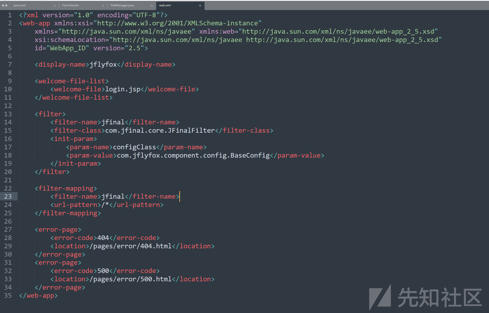

具体注释如下：

```
<?xml version="1.0" encoding="UTF-8"?>
<!-- 这是XML文件的声明部分，表明此文件遵循XML 1.0版本规范，并且采用UTF-8编码方式，
     这样能确保文件内容在不同系统和环境中被正确解析和显示 -->
<web-app xmlns:xsi="http://www.w3.org/2001/XMLSchema-instance"
          xmlns="http://java.sun.com/xml/ns/javaee" xmlns:web="http://java.sun.com/xml/ns/javaee/web-app_2_5.xsd"
          xsi:schemaLocation="http://java.sun.com/xml/ns/javaee http://java.sun.com/xml/ns/javaee/web-app_2_5.xsd"
          id="WebApp_ID" version="2.5">

    <!-- 定义该Web应用在服务器管理界面等地方显示的名称，这里设置为"jflyfox"，主要用于方便识别和管理此应用 -->
    <display-name>jflyfox</display-name>

    <!-- 欢迎页面列表设置，用于指定当用户访问该Web应用的根目录（例如http://example.com/）时，默认显示的页面 -->
    <welcome-file-list>
        <!-- 明确指定欢迎页面为login.jsp文件，即当用户直接访问应用根目录时，服务器会尝试查找并返回此页面 -->
        <welcome-file>login.jsp</welcome-file>
    </welcome-file-list>

    <!-- 过滤器配置部分，用于定义一个名为"jfinal"的过滤器 -->
    <filter>
        <!-- 给过滤器起的名字，后续在过滤器映射等操作中会通过此名字来引用该过滤器 -->
        <filter-name>jfinal</filter-name>
        <!-- 指明该过滤器的实现类，当需要执行过滤操作时，会调用这个类中的相关方法 -->
        <filter-class>com.jfinal.core.JFinalFilter</filter-class>
        <!-- 过滤器初始化参数设置，用于在过滤器初始化时传入特定的配置信息 -->
        <init-param>
            <!-- 定义初始化参数的名称 -->
            <param-name>configClass</param-name>
            <!-- 给出初始化参数的值，这里将com.jflyfox.component.config.BaseConfig这个类的相关信息作为配置参数传入过滤器初始化过程 -->
            <param-value>com.jflyfox.component.config.BaseConfig</param-value>
        </init-param>
    </filter>

    <!-- 过滤器映射部分，用于将之前定义的名为"jfinal"的过滤器与具体的URL模式进行映射 -->
    <filter-mapping>
        <!-- 再次引用之前定义的过滤器名称，以确定是对哪个过滤器进行映射 -->
        <filter-name>jfinal</filter-name>
        <!-- 表示该过滤器将应用于所有的URL路径，即无论用户访问该Web应用中的哪个页面或资源，都会先经过这个"jfinal"过滤器进行处理 -->
        <url-pattern>/*</url-pattern>
    </filter-mapping>

    <!-- 错误页面设置部分，用于定义处理不同错误代码的错误页面 -->
    <error-page>
        <!-- 明确此错误页面是用于处理404错误（页面未找到错误） -->
        <error-code>404</error-code>
        <!-- 指明当发生404错误时，服务器应该返回的页面为/pages/error/404.html，以便用户查看404错误相关提示信息 -->
        <location>/pages/error/404.html</location>
    </error-page>
    <error-page>
        <!-- 明确此错误页面是用于处理500错误（服务器内部错误） -->
        <error-code>500</error-code>
        <!-- 指明当发生500错误时，服务器要返回的页面为/pages/error/500.html，以便用户在遇到服务器内部错误时能得到相应提示信息 -->
        <location>/pages/error/500.html</location>
    </error-page>
</web-app>
```

##### pom.xml文件的作用

pom.xml文件主要在Maven项目中用于引入依赖库

例如：

这段代码的主要作用是在一个 Maven 项目中声明对`log4j`库的依赖。Maven 会根据这里提供的信息从相应的仓库（如 Maven 中央仓库）下载指定版本的`log4j`库及其相关依赖，并将它们添加到项目的类路径中，以便项目在开发和运行过程中能够使用`log4j`库提供的日志功能。

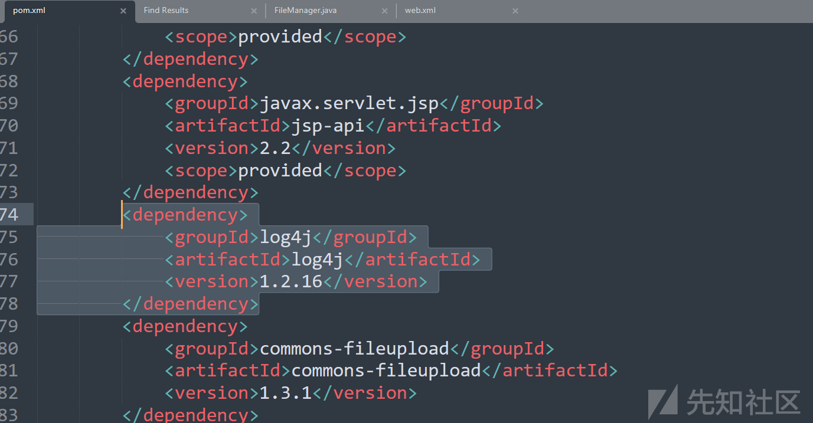

具体元素分析如下：

1. `<dependency>`**元素**：

* 这是用于定义项目所依赖的外部库的根元素。在一个 Maven 项目的`pom.xml`文件中，所有的依赖声明都包含在一系列的`<dependency>`元素内。

2. `<groupId>`**元素**：

* 在这里，`<groupId>`的值为`log4j`。`groupId`通常用于标识库所属的组织、项目组或开发者。对于`log4j`来说，它就是代表`log4j`库自身的一个标识，类似于一种命名空间的作用，帮助 Maven 在仓库中准确找到属于该组织或项目的相关库资源。

3. `<artifactId>`**元素**：

* 其值为`log4j`。`artifactId`用于具体指定要依赖的项目或库的名称。在这个例子中，由于`log4j`库本身的名称就是`log4j`，所以这里的`artifactId`也是`log4j`。它与`groupId`一起，在 Maven 仓库中构成了一个唯一的标识，以便准确获取到特定版本的库。

4. `<version>`**元素**：

* 这里指定的版本是`1.2.16`。`version`元素明确了项目所需要的`log4j`库的具体版本。Maven 会严格按照这个版本号去查找和下载对应的库文件，确保项目使用的是预期的、经过测试且与项目其他部分兼容的`log4j`版本。

#### 1、SQL注入

关键字如下：

```
Select 、Dao  、from  、delete  、update 、insert
Statement
createStatement
PrepareStatement
like '%${
in(${
in (${
select
update
insert
delete
${
setObject(
setInt(
setString(
setSQLXML(
createQuery(
createSQLQuery(
createNativeQuery(
```

##### 1.1、like注入

IDEA打开源码文件，搜索Dao关键，进入FriendlylinkController.java文件

路径：src/main/java/com/jflyfox/modules/admin/friendlylink/FriendlylinkController.java

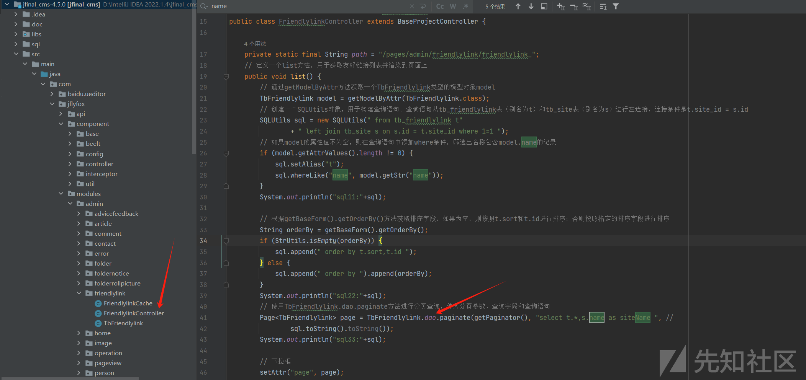

跟进文件当中的whereLike()方法，按住ctrl键，鼠标点击即可进入

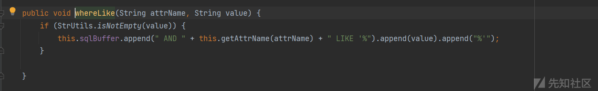

写入注释如下：

从其中可以知道whereLike方法用于接受attrNamename与value的值，拼接到sqlBuffer。

当中使用的%符号疑似不安全写法

```
// 定义一个名为whereLike的方法，接收两个字符串参数：attrName和value
public void whereLike(String attrName, String value) {
    // 判断传入的value是否非空
    if (StrUtils.isNotEmpty(value)) {
        // 如果value非空，将拼接后的SQL条件语句添加到sqlBuffer中
        this.sqlBuffer.append(" AND " + this.getAttrName(attrName) + " LIKE '%").append(value).append("%'");
    }
}

```

结合FriendlylinkController.java文件当中的SQLUtils对象中的语句完整的sql语句如下：

由于本人第一次审计，为了方便在每个拼接的代码后都添加了System.out.println()函数用于查看执行的sql语句

```
from tb_friendlylink t left join tb_site s on s.id = t.site_id where 1=1  AND t.name LIKE '%66%'
```

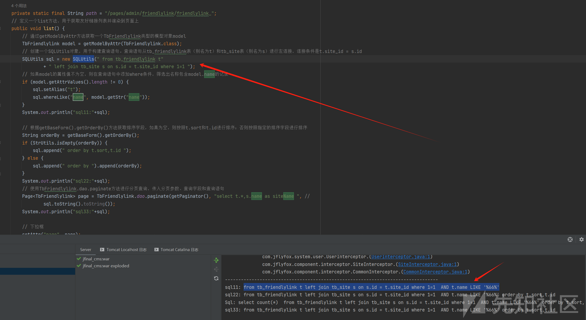

用sqlmap验证码name参数注入存在：

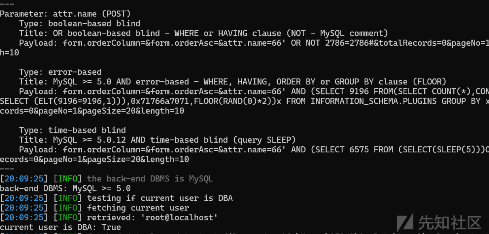

​

##### 1.2、order by注入

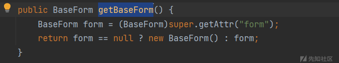

```
// 定义一个名为getBaseForm的公共方法，返回类型为BaseForm
public BaseForm getBaseForm() {
    // 从父类中获取名为"form"的属性，并将其强制转换为BaseForm类型
    BaseForm form = (BaseForm)super.getAttr("form");
    // 如果form为null，则创建一个新的BaseForm对象并返回；否则直接返回form
    return form == null ? new BaseForm() : form;
}

```

#### 2、XSS

关键字如下：

```
getParamter 、<%=、param.、request.setAttribute、Comment、getStr
```

##### 2.1、存储型XSS

搜索comment，在CommentController.java文件中发现saveComment()方法

```
// 调用 CommentService 的 saveComment 方法保存评论，传入当前用户和评论对象
```

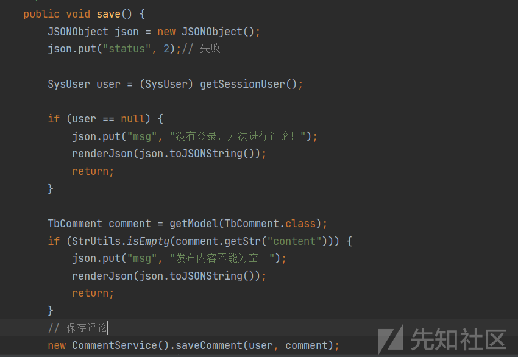

其他内容注释如下：

```
public void save() {
    // 创建一个 JSON 对象
    JSONObject json = new JSONObject();
    // 在 JSON 对象中放入一个键值对，表示状态为失败（2 通常代表失败状态）
    json.put("status", 2);// 失败

    // 从当前会话中获取 SysUser 对象，通常代表当前登录的用户
    SysUser user = (SysUser) getSessionUser();

    // 如果用户为空，即未登录
    if (user == null) {
        // 在 JSON 对象中放入一个键值对，表示提示信息
        json.put("msg", "没有登录，无法进行评论！");
        // 将 JSON 对象转换为 JSON 字符串并返回给客户端
        renderJson(json.toJSONString());
        return;
    }

    // 获取一个 TbComment 类型的模型对象，通常代表评论数据
    TbComment comment = getModel(TbComment.class);
    // 如果评论内容为空字符串
    if (StrUtils.isEmpty(comment.getStr("content"))) {
        // 在 JSON 对象中放入一个键值对，表示提示信息
        json.put("msg", "发布内容不能为空！");
        // 将 JSON 对象转换为 JSON 字符串并返回给客户端
        renderJson(json.toJSONString());
        return;
    }
    // 调用 CommentService 的 saveComment 方法保存评论，传入当前用户和评论对象
    new CommentService().saveComment(user, comment);

    // 设置返回的 JSON 对象的各个键值对
    json.put("comment_id", comment.getInt("id"));
    json.put("content", comment.getStr("content"));
    json.put("title_url", user.getStr("title_url"));
    json.put("reply_userid", comment.getInt("reply_userid"));
    // 根据回复用户的 ID 获取用户信息，并获取用户名放入 JSON 对象中
    json.put("reply_username", UserCache.getUser(comment.getInt("reply_userid")).getUserName());
    json.put("create_id", user.getUserID());
    json.put("create_name", user.getUserName());
    json.put("create_time", comment.getStr("create_time"));
    // 将状态改为成功（1 通常代表成功状态）
    json.put("status", 1);// 成功

    // 将 JSON 对象转换为 JSON 字符串并返回给客户端
    renderJson(json.toJSONString());
}
```

跟进saveComment()方法，存在JFlyFoxUtils.delScriptTag()方法对传入的content内容进行处理

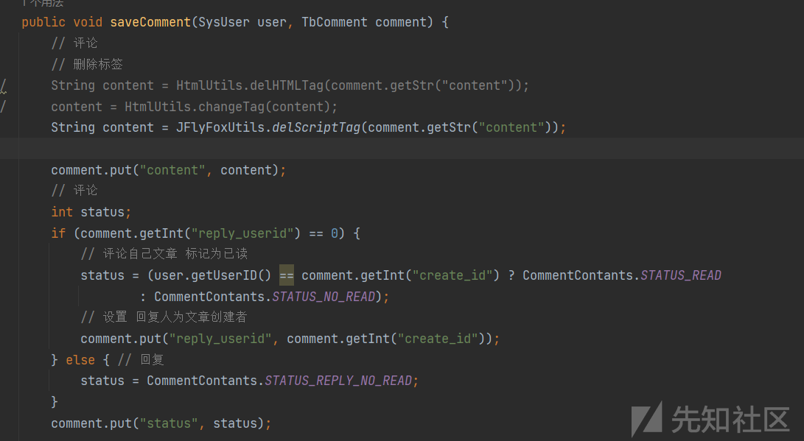

跟进delScriptTag()方法，通过正则匹配<script>以及<style>关键字并删除。由此判断此处存在XSS

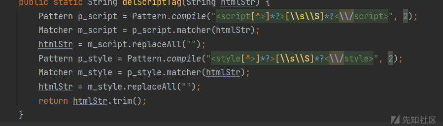

具体注释如下：

```
public static String delScriptTag(String htmlStr) {
    // 创建一个正则表达式模式，用于匹配 HTML 中的 `<script>` 标签及其中的内容
    Pattern p_script = Pattern.compile("<script[^>]*?>[\s\S]*?<\/script>", 2);
    // 创建一个匹配器对象，用于在给定的字符串（htmlStr）中查找与上述模式匹配的部分
    Matcher m_script = p_script.matcher(htmlStr);
    // 将匹配到的 `<script>` 标签及内容替换为空字符串，从而实现删除脚本标签的效果
    htmlStr = m_script.replaceAll("");

    // 创建一个正则表达式模式，用于匹配 HTML 中的 `<style>` 标签及其中的内容
    Pattern p_style = Pattern.compile("<style[^>]*?>[\s\S]*?<\/style>", 2);
    // 创建一个匹配器对象，用于在处理后的字符串中继续查找与 `<style>` 标签模式匹配的部分
    Matcher m_style = p_style.matcher(htmlStr);
    // 将匹配到的 `<style>` 标签及内容替换为空字符串，从而实现删除样式标签的效果
    htmlStr = m_style.replaceAll("");

    // 返回去除了脚本标签和样式标签后，并经过去除首尾空白字符处理的字符串
    return htmlStr.trim();
}
```

进行评论，发现存在前端实体编码

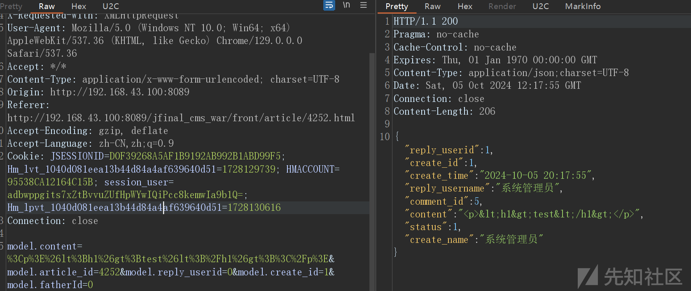

在接口直接修改绕过即可

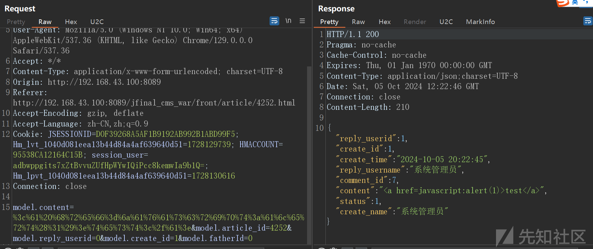

触发xss

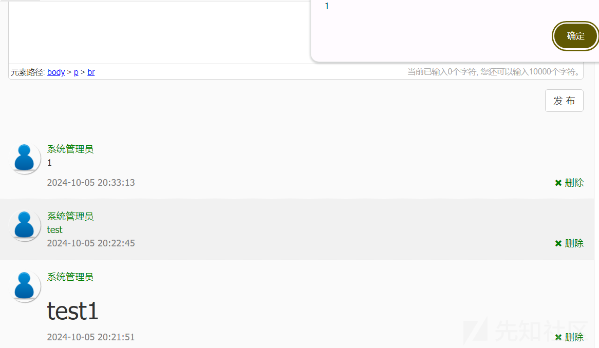
