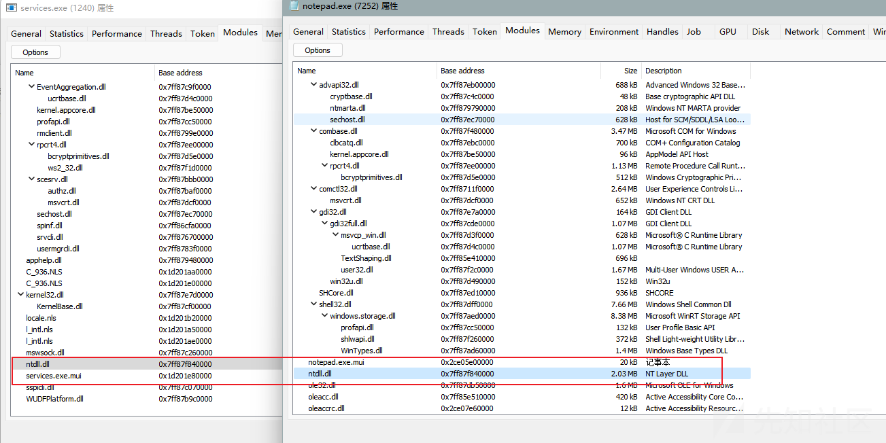
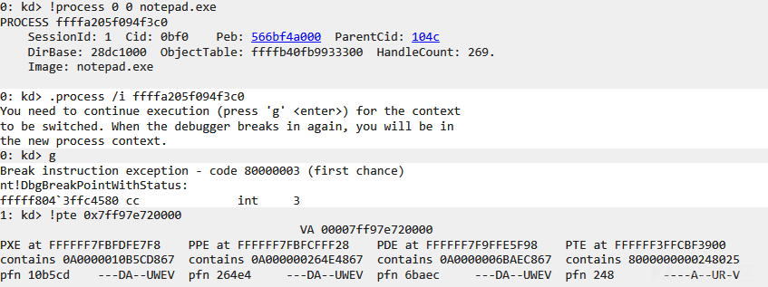
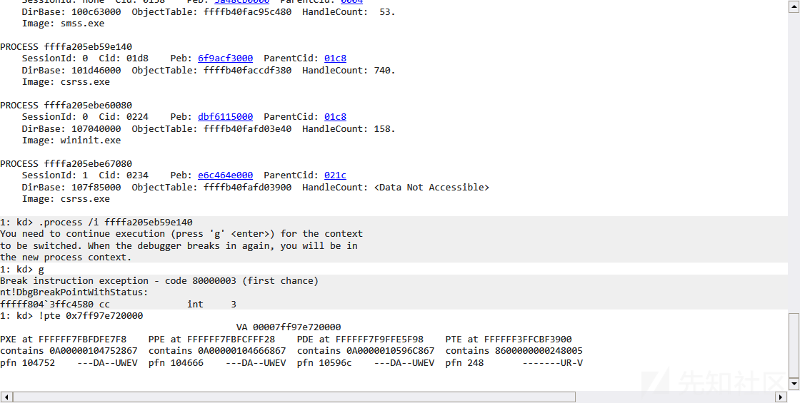
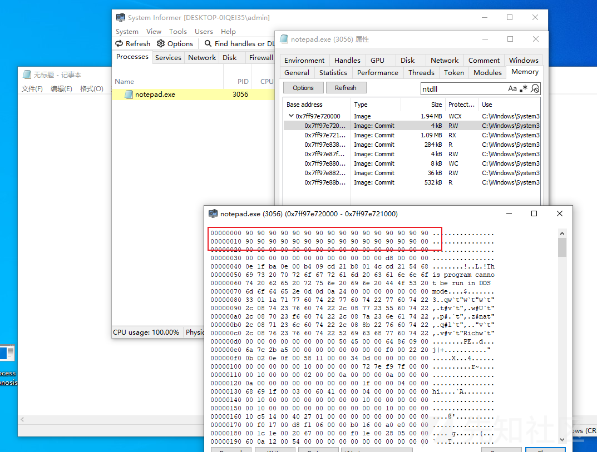
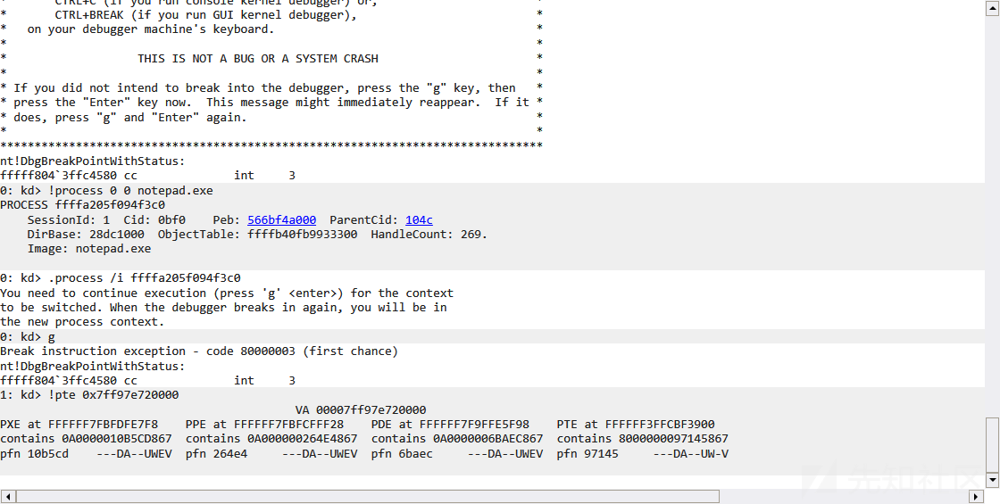
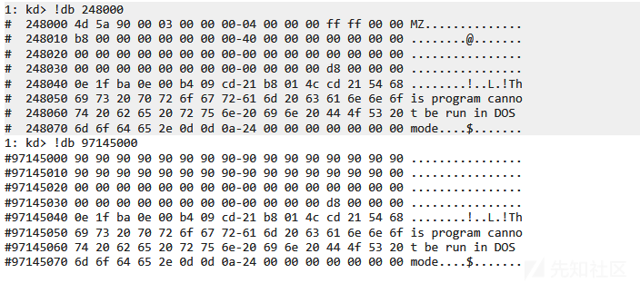
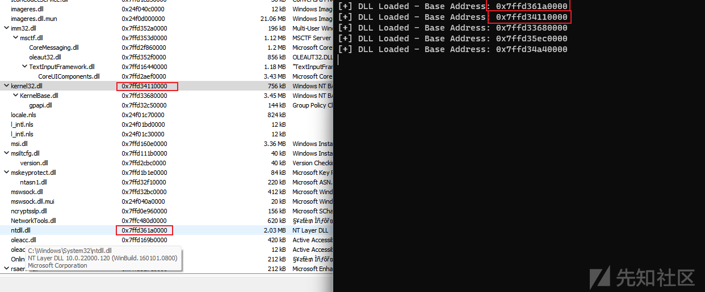
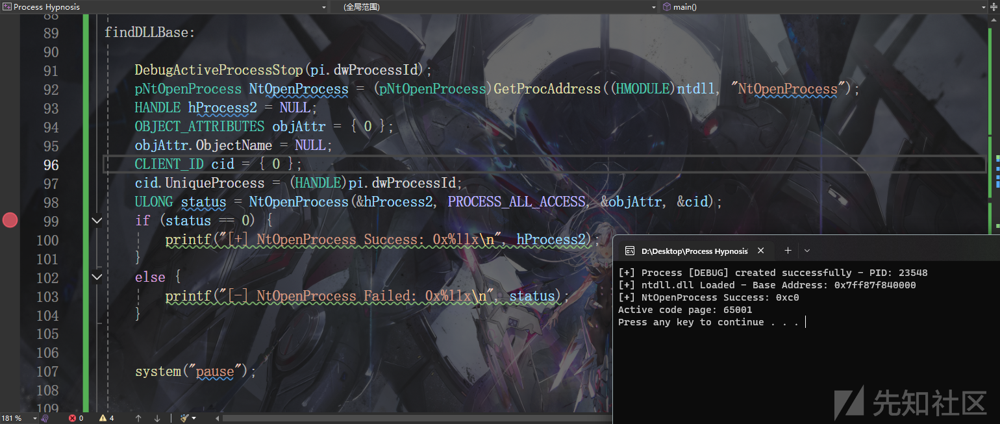
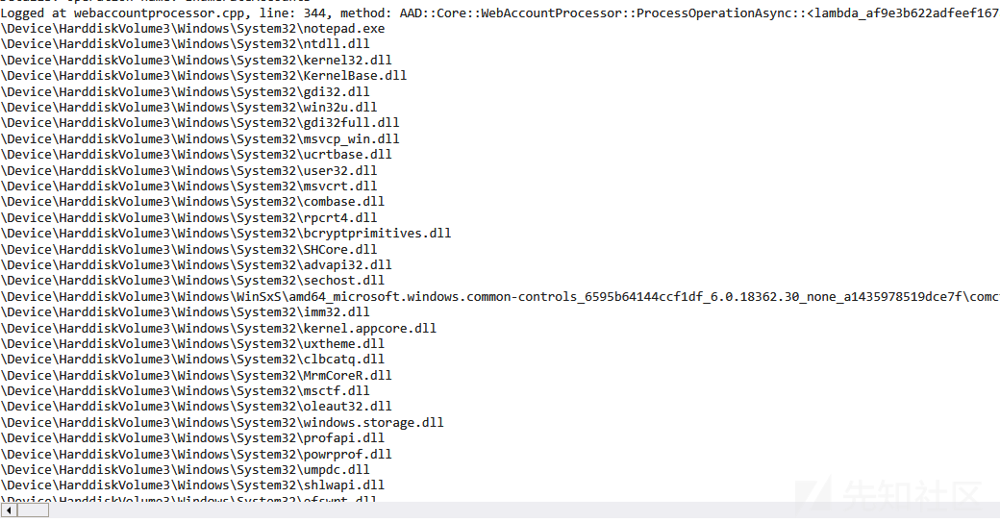

# ntdll kernel32 模块基址获取新思路-先知社区

> **来源**: https://xz.aliyun.com/news/19084  
> **文章ID**: 19084

---

没那么新( 但是没咋看见别人这么搞

目前网上看见的思路主要是以下几种

> 1. 从\_PEB\_LDR\_DATA遍历三个链表之一
> 2. 获取teb 从StackBase向上搜索

获取ntdll和kernel32的用途主要是自实现loadlibrary和getProcAddress

接下来讲讲思路

创建一个被调试的进程(`DEBUG_ONLY_THIS_PROCESS 或 DEBUG_PROCESS`),

众所周知windwos中一个进程的创建首先会加载`ntdll.dll` 接着是`kernel32.dll` (直观来说直接看InLoadOrderModuleList就可以证明了 ntdll的加载是在内核做的 出于水字数考虑我将这块的证明放在文末)

我们通过调试该进程 捕获`dwDebugEventCode`为`LOAD_DLL_DEBUG_EVENT`的调试事件

其中LOAD\_DLL\_DEBUG\_INFO.lpBaseOfDll 记录了基址

```
typedef struct _LOAD_DLL_DEBUG_INFO {
  HANDLE hFile;
  LPVOID lpBaseOfDll;
  DWORD  dwDebugInfoFileOffset;
  DWORD  nDebugInfoSize;
  LPVOID lpImageName;
  WORD   fUnicode;
} LOAD_DLL_DEBUG_INFO, *LPLOAD_DLL_DEBUG_INFO;
```

由于COW机制 获取的基址是全进程统一的

处于篇幅长度考虑 这里补充一下windows的COW机制 水一下字数

## COW (copy on write)

COW（Copy-On-Write）是一种内存管理机制

核心思想是 在拷贝内存页时，并不立即复制实际数据，而是等到有写操作发生时才真正复制

windwos的大部分dll是基于COW的 也就是说用的同一块内存 修改了对应的物理页会全局生效



而如果是直接尝试修改修改内存

我们创建一个notepad 看看加载的ntdll对应的物理页





可以发现都是同一个

此时我们修改notepad中ntdll的任意字节





可以看见是完全不同的物理页



## 获取基址

我们可以写出如下代码

```
DEBUG_EVENT dbgEvent = { 0 };
    
    while (WaitForDebugEvent(&dbgEvent, -1)) {


        switch (dbgEvent.dwDebugEventCode) {
            case LOAD_DLL_DEBUG_EVENT: {
                printf("[+] DLL Loaded - Base Address: 0x%llx
", dbgEvent.u.LoadDll.lpBaseOfDll);
                break;
            }
        }
        ContinueDebugEvent(pi.dwProcessId, pi.dwThreadId, DBG_CONTINUE);
    }
```



加载的依次就是ntdll.dll kernel32.dll

随便写点东西验证一下

```
int main() {


    STARTUPINFO si = { 0 };
    PROCESS_INFORMATION pi = { 0 };
    si.cb = sizeof(STARTUPINFO);

    if (CreateProcessW(NULL, _wcsdup(L"C:\Windows\System32\
otepad.exe"), NULL, NULL, FALSE, DEBUG_ONLY_THIS_PROCESS, NULL, NULL, &si, &pi)) {
        printf("[+] Process [DEBUG] created successfully - PID: %d
", pi.dwProcessId);
    }
    else {
        printf("[-] CreateProcessW failed. Error: %d
", GetLastError());
        return -1;
    }
    HANDLE hProcess = pi.hProcess;

    DEBUG_EVENT dbgEvent = { 0 };
    LPVOID ntdll = NULL;

    for (SIZE_T i = 0; i < 5; i++) {
        if (WaitForDebugEvent(&dbgEvent, -1)) {


            switch (dbgEvent.dwDebugEventCode) {

            case CREATE_PROCESS_DEBUG_EVENT: {
                break;
            }

            case LOAD_DLL_DEBUG_EVENT: {
                printf("[+] ntdll.dll Loaded - Base Address: 0x%llx
", dbgEvent.u.LoadDll.lpBaseOfDll);
                ntdll = dbgEvent.u.LoadDll.lpBaseOfDll;
                goto findDLLBase;
            }

            case CREATE_THREAD_DEBUG_EVENT: {
                break;
            }

            case EXCEPTION_DEBUG_EVENT: {
                break;
            }

            }
            ContinueDebugEvent(pi.dwProcessId, pi.dwThreadId, DBG_CONTINUE);
        }
    }

findDLLBase:

    DebugActiveProcessStop(pi.dwProcessId);
    pNtOpenProcess NtOpenProcess = (pNtOpenProcess)GetProcAddress((HMODULE)ntdll, "NtOpenProcess");
    HANDLE hProcess2 = NULL;
    OBJECT_ATTRIBUTES objAttr = { 0 };
    objAttr.ObjectName = NULL;
    CLIENT_ID cid = { 0 };
    cid.UniqueProcess = (HANDLE)pi.dwProcessId;
    ULONG status = NtOpenProcess(&hProcess, PROCESS_ALL_ACCESS, &objAttr, &cid);
    if (status == 0) {
        printf("[+] NtOpenProcess Success: 0x%llx
", hProcess2);
    }
    else {
        printf("[-] NtOpenProcess Failed: 0x%llx
", status);
    }


    system("pause");


}
```



## dll加载顺序证明

内核挂个回调

```
#include <ntifs.h>    

#define DebugPrint(...) \
    DbgPrintEx(77, 0, __VA_ARGS__)

#define CHECK_STATUS_AND_BREAK(s)                                      \
    if (!NT_SUCCESS(s)) {                                              \
        DbgPrintEx(77, 0, "[%s:%d] status: 0x%x
",                   \
                   __FUNCTION__, __LINE__, (ULONGLONG)(s));            \
        break;                                                         \
    }

ULONG imageFileNameOffset = 0x450;

VOID TestRoutine(
    _In_opt_ PUNICODE_STRING FullImageName,
    _In_ HANDLE ProcessId,                
    _In_ PIMAGE_INFO ImageInfo
) {
    PEPROCESS pEprocess = NULL;
    NTSTATUS status = STATUS_UNSUCCESSFUL;

    do {
        status = PsLookupProcessByProcessId(ProcessId, &pEprocess);
        CHECK_STATUS_AND_BREAK(status);
        PUCHAR imageFileName = (PUCHAR)((ULONG64)pEprocess + imageFileNameOffset);
        if (_stricmp((const char*)imageFileName, "notepad.exe") == 0) {
            DebugPrint("%wZ
", FullImageName);
        }

    } while (false);


}


NTSTATUS UnloadDriver(PDRIVER_OBJECT DriverObject){
    NTSTATUS status = STATUS_UNSUCCESSFUL;
    do {
        status = PsRemoveLoadImageNotifyRoutine(TestRoutine);
        CHECK_STATUS_AND_BREAK(status);

    } while (false);
    DebugPrint("unload");
    return status;
}

EXTERN_C NTSTATUS DriverEntry(PDRIVER_OBJECT DriverObject, PUNICODE_STRING RegistryPath){


    PsSetLoadImageNotifyRoutine(TestRoutine);
    DriverObject->DriverUnload = (PDRIVER_UNLOAD)UnloadDriver;

    return STATUS_SUCCESS;
}
```


