# 深入解析LLVM代码混淆技术：从基本块分割到控制流混淆的实现原理-先知社区

> **来源**: https://xz.aliyun.com/news/19089  
> **文章ID**: 19089

---

# 基本块分割

## 什么是基本块分割？

基本块分割即将一个基本块分割为等价的若干个基本块，在分割后的基本块之间加上无条件跳转。（通俗理解为，本来一句话解释清的事情，非要添油加醋废话连篇。类比营销号。）

**注意：基本块分割不能算是混淆，但是可以提高某些代码混淆的混淆效果。**

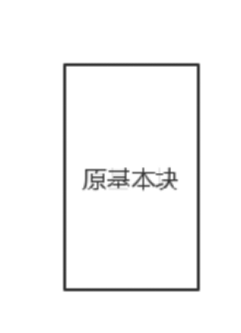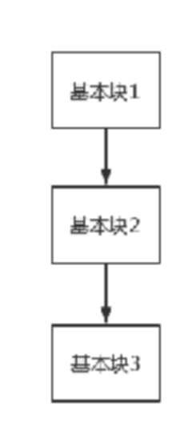

## 为何要使用基本块分割？

在许多基于基本块的代码混淆中，基本块数量越多，代码混淆后的复杂度越大。通过增加基本块的数量，可以到达提高混淆效果的目的。

**未经过基本块分割的虚假控制流：**

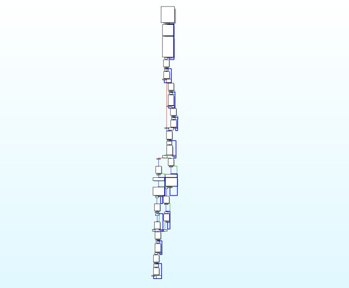

**经过基本块分割的虚假控制流：**

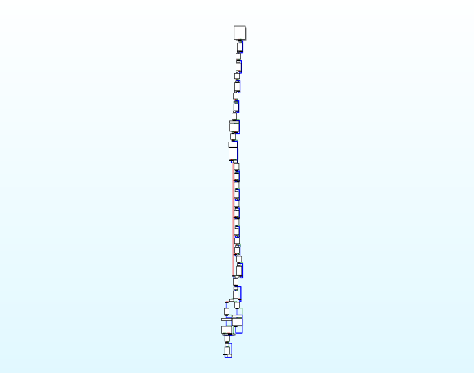

## 如何实现基本块分割？

遍历每个函数中的每个基本块，对每个基本块进行分割。注意，有 PHI 指令的基本块我们选择暂时跳过。如之前LLVM文章所说，PHI指令计算结果是根据PHI指令所在代码块的前驱块所决定的。如下两图所示，代码块经过分割后phi指令将无法识别前驱块。

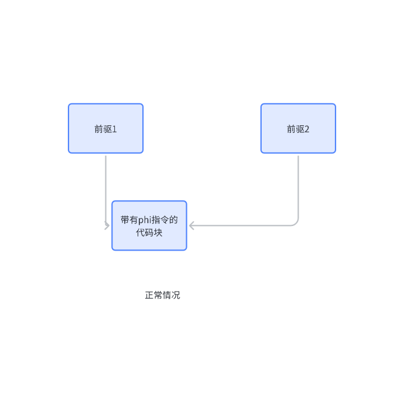

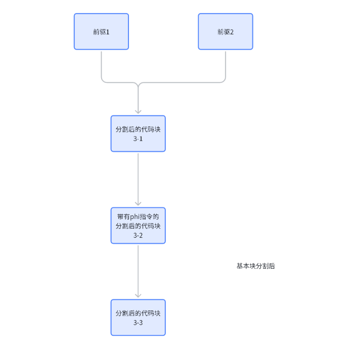

当然，如何操作PHI指令的代码块分割，将在后续慢慢讲解。

# 基本块分割API

## 额外参数指定

在 LLVM 中，可以通过 cl::opt 模板类获取指令中的参数，这里的 cl是clang的意思，opt 是选项 option 的缩写，不是优化器的意思。

```
#include "llvm/Support/CommandLine.h"
// 可选的参数，指定一个基本块会被分裂成几个基本块，默认值为 2
static cl::opt<int> splitNum("split_num", cl::init(2), cl::desc("Split <split_num> time(s) each BB"));
```

# splitBasicBlock 函数

splitBasicBlock 函数是 BasicBlock 类的一个成员函数。在BasicBlock.h 头文件里可以看到这个函数的两种用法。

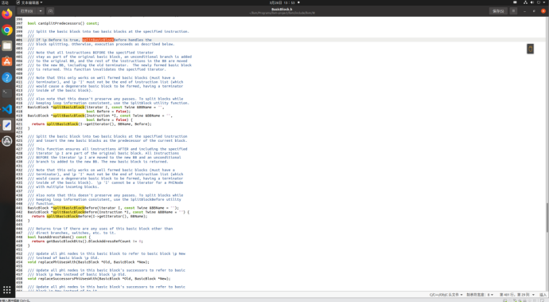

# isa<> 函数

isa<> 是一个模板函数，用于判断一个指针指向的数据的类型是不是给定的类型，类似于 Java 中的 instanceof。可以用来判断是否属于PHI类型的指令。

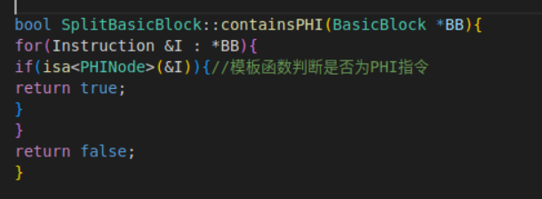

# 理论成立，实践开始

沿用上一章的vscode文件夹，在src目录下新建SplitBasicBlock.cpp,并且为了雅观，在Test目录下新建IR和BIN两个文件夹。代码如下，我都添加了注释，方便理解：

```
#include "llvm/Pass.h"
#include "llvm/IR/Function.h"
#include "llvm/Support/raw_ostream.h"
#include "llvm/Support/CommandLine.h"
#include "llvm/IR/Instructions.h"
#include <vector>
#include "SplitBasicBlock.h"
using std::vector;
using namespace llvm;
// 可选的参数，指定一个基本块会被分裂成几个基本块，默认值为 2，使用前需要引用 #include "llvm/Support/CommandLine.h"
static cl::opt<int> splitNum("split_num", cl::init(2), cl::desc("Split <split_num> time(s) each BB"));
namespace{
    class SplitBasicBlock : public FunctionPass{
        public:
            static char ID;
            SplitBasicBlock() : FunctionPass(ID){};
            bool runOnFunction(Function & F); 
            // 对单个基本块执行分裂操作
            void split(BasicBlock *BB);
            //判断一个基本块中是否包含 PHI指令(PHINode)
            bool containsPHI(BasicBlock *BB);
    };
}


//todo
bool SplitBasicBlock::runOnFunction(Function & F){
// 第一步：保存原先的所有基本块
//使用vector前需要引用
vector<BasicBlock*> origBB;//对函数中的基本块进行分割操作，会导致遍历的基本块数量增加，为防止出现报错，先缓存到vector容器中，再进行遍历。
for(BasicBlock &BB : F){
origBB.push_back(&BB);
}
// 第二步：对每个不包含 PHI 指令的基本块执行分裂操作
for(BasicBlock *BB : origBB){
if(!containsPHI(BB)){//判断是否含有PHI指令
split(BB);
}
}
return true;

}

bool SplitBasicBlock::containsPHI(BasicBlock *BB){
for(Instruction &I : *BB){
if(isa<PHINode>(&I)){//模板函数判断是否为PHI指令
return true;
}
} 
return false;
}

void SplitBasicBlock::split(BasicBlock *BB){
// 计算分裂后每个基本块的大小
// 原基本块的大小 / 分裂数目（向上取整）
int splitSize = (BB->size() + splitNum - 1) / splitNum;//比如，7条指令，分裂3次，则每个分裂块长度为3
BasicBlock *curBB = BB;//存储当前操作的基本块位置
for(int i = 1;i < splitNum;i ++){
int cnt = 0;//计数变量
for(Instruction &I : *curBB){
if(cnt++ == splitSize){//cnt = 3
// 在 I 指令处对基本块进行分割
curBB = curBB->splitBasicBlock(&I);
break;
}
}
}
}

FunctionPass* llvm::createSplitBasicBlockPass(){
return new SplitBasicBlock();
}
//初始化ID并注册
char SplitBasicBlock::ID = 0;
static RegisterPass<SplitBasicBlock> X("split","Split Basic Blcok is OK.");
```

**解释一下SplitBasicBlock.h。**

我们在 llvm 命名空间里添加一个函数 FunctionPass\* createSplitBasicBlockPass(); 。

这个函数将在 SplitBasicBlock.cpp 里实现。

这样的话其他 LLVM Pass 就可以通过引入头文件 SplitBasicBlock.h ，调用。

createSplitBasicBlockPass 函数来创建一个 SplitBasicBlock Pass，完成基本块的分割。

```
//SplitBasicBlock.h
#ifndef _SPlit_Basic_Block_//防止头文件被重复使用
#define _SPlit_Basic_Block_//防止头文件被重复使用
#include "llvm/IR/Function.h"
#include "llvm/Pass.h"
namespace llvm{
FunctionPass* createSplitBasicBlockPass();
}
#endif//防止头文件被重复使用
```

```
// SplitBasicBlock.cpp实现
FunctionPass* llvm::createSplitBasicBlockPass(){ 
return new SplitBasicBlock(); 
}
```

之后在**CMakeLists.txt**声明Pass源代码src/SplitBasicBlock.cpp

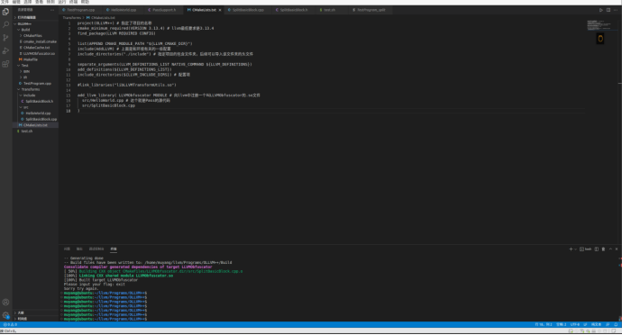

最后在test.sh添加需要使用的命令，上一章详细讲过，这里便不再赘述：

```
cd ./Build
cmake ../Transforms
make
cd ../Test
clang -S -emit-llvm TestProgram.cpp -o IR/TestProgram.ll
opt  -load ../Build/LLVMObfuscator.so -split -S IR/TestProgram.ll -o IR/TestProgram_split.ll
clang IR/TestProgram_split.ll -o BIN/TestProgram_split
./BIN/TestProgram_split
```

效果如下：

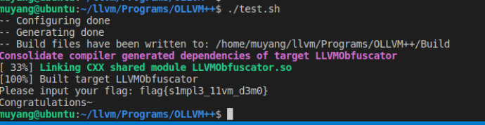

值得一提的是，如果你单纯把基本块进行分割，IDA在识别的时候，会自动清理，这也是为什么说基本块分割只是用来辅助代码混淆的。

# 代码混淆

代码混淆是将计算机程序的代码，转换成一种功能上等价，但是难以阅读和理解的形式的行为。

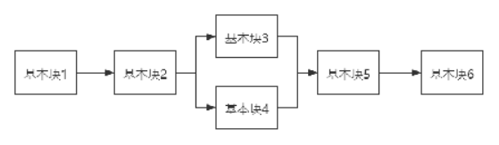

混淆前

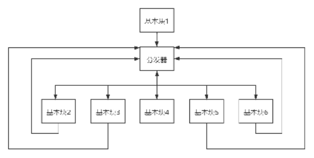

混淆后

代码混淆设计很多前置知识，我们先对于基本概念进行查缺补漏。

## 函数

函数是代码混淆的基本单位，一个函数由若干个基本块组成，有且仅有一个入口块，可能有多个出口块。

一个函数可以用一个控制流图（Control Flow Graph, CFG）表示。

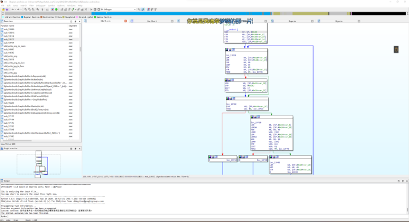

## 基本块

基本块由一组线性指令组成，每一个基本块都有一个入口点（第一条执行的指令）和一个出口点（最后一条执行的指令，亦即终结指令）。

**终结指令要么跳转到另一个基本块(br, switch)，要么从函数返回(ret)。**

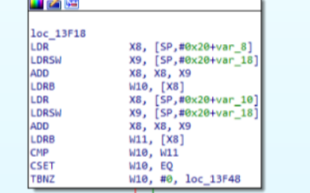

## 控制流

控制流代表了一个程序在执行过程中可能遍历到的所有路径。 通常情况下，程序的控制流很清晰地反映了程序的逻辑，但经过混淆的控制流会使得人们难以分辨正常逻辑。

可以用小时候做过的数学题来辅助理解。

小明到学校的一条路线即为一条控制流，混淆前逻辑清楚，混淆后则不好分辨。

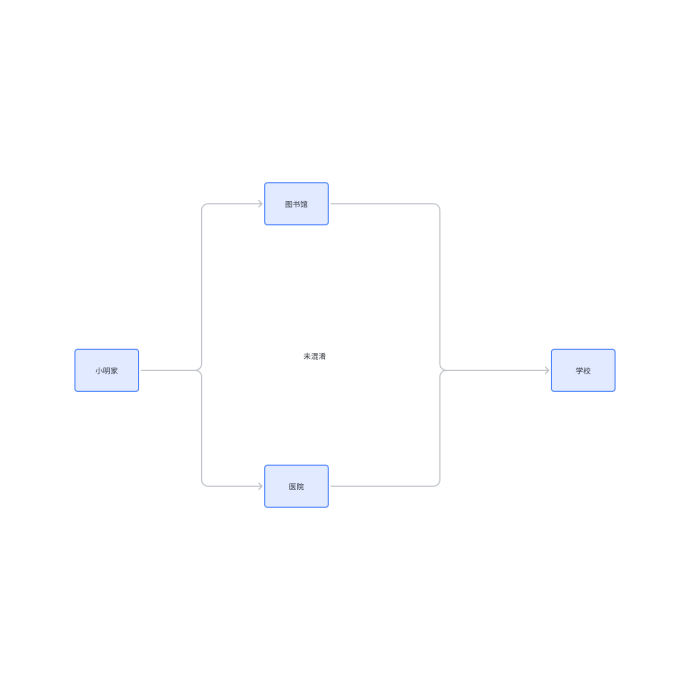

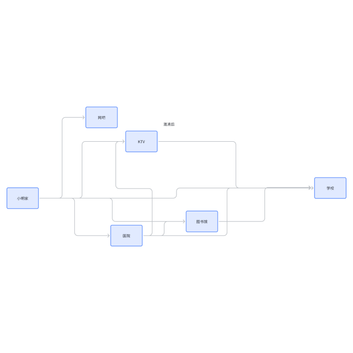

## 不透明谓词

**不透明谓词指的是其值为混淆者明确知晓，而反混淆者却难以推断的变量。谓词简单来说就是在原程序中某个位置插入一个if分支。**

分类：


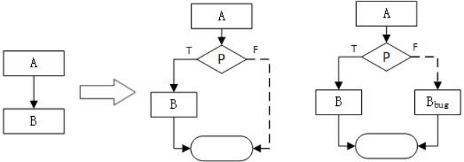

永远为真或者永远为假

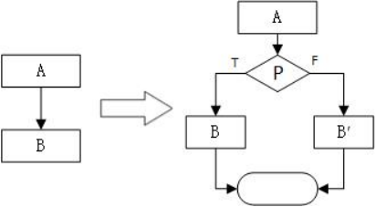

可以为真或假

例子：

```
#include <cstdio>

int x=0;

int main(){
    if(x<0){
        printf("yeah!yeah!yeah!
");
    }else{printf("NB666!
");
    }

}
```

转换成二进制文件使用IDA进行反编译，则IDA无法识别出来x变量的值，那么x对于IDA来说便是个不透明谓词。

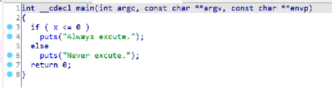

例如y > 10 || x \* (x + 1) % 2 == 0这个不等式，大家都知道x \* (x + 1) % 2 == 0这个式子是恒成立的，因此刚才这个不等式是恒成立的，当然这是我们知道，而IDA就不知道了，IDA不确定x，y的值，因此无法识别出来，因此就可以增加虚假控制流。

# 常见混淆思路

## 符号混淆

将函数的符号，如函数名、全局变量名去除或者混淆。对于 ELF 文件可以通过 strip 指令去除符号表完成。

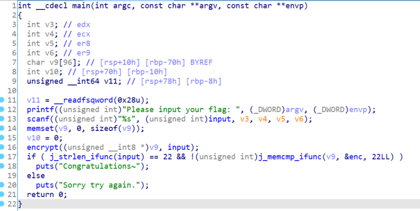

混淆前

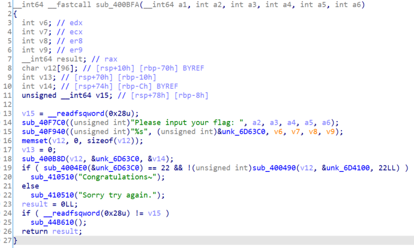

混淆后

## 控制流混淆

控制流混淆指的是混淆程序正常的控制流，使其在功能保持不变的情况下不能清晰地反映原程序的正常逻辑。

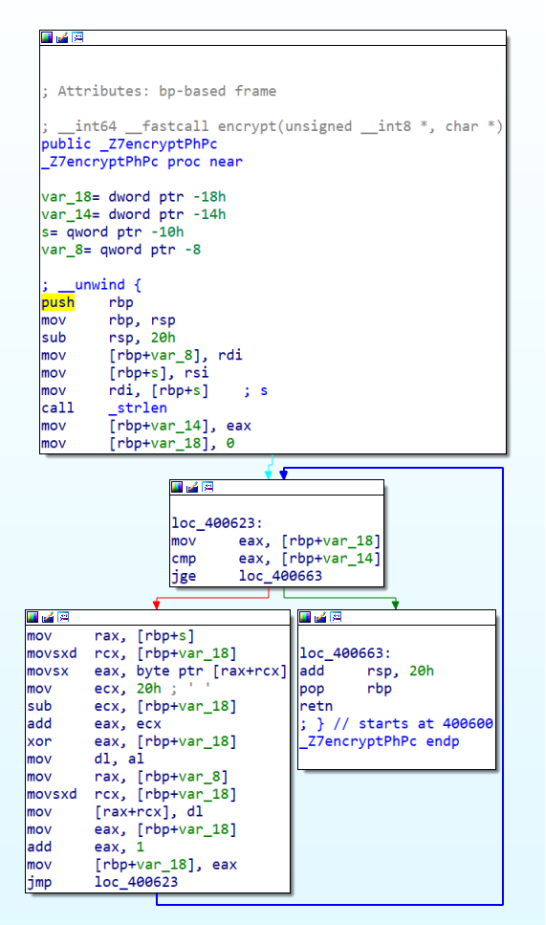

混淆前

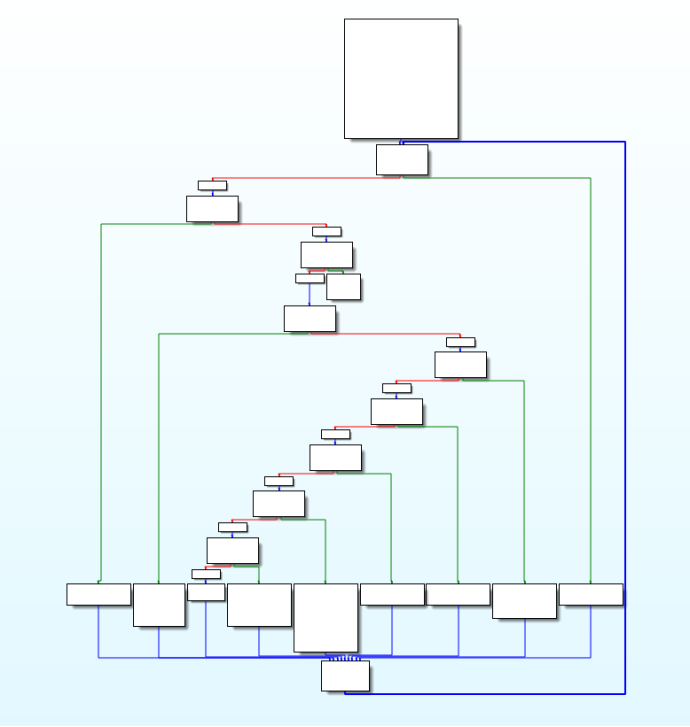

混淆后

## 计算混淆

计算混淆指的是混淆程序的计算流程，或计算流程中使用的数据，使分析者难以分辨某一段代码所执行的具体计算。

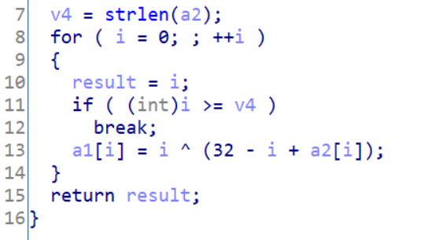

混淆前

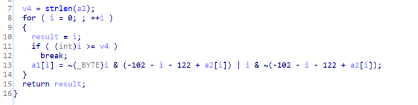

混淆后

## 虚拟机混淆

虚拟机混淆的思想是将一组指令集合（如一组 x86 指令），转化为一组攻击者未知的自定义指令集。并用与程序绑定的解释器解释执行。虚拟机混淆代表：VMProtect。 虚拟机混淆是目前最强力的混淆，但也有许多缺点：如性能损耗大、容易被杀毒软件报毒等。所以一般不会使用。

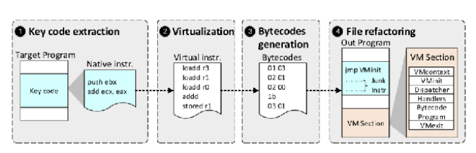

# **OLLVM 环境搭建**

Obfuscator-LLVM（简称OLLVM）是2010年6月由瑞士西部应用科学大学(HEIG-VD)的信息安全小组发

起的一个项目。 这个项目的目的是提供一个 LLVM 编译套件的开源分支，能够通过代码混淆和防篡改提

供更高的软件安全性。

OLLVM 在国内移动安全的使用非常广泛，虽然 OLLVM 已于2017年停止更新，并且到目前为止，三种

代码混淆方式均已有成熟的反混淆手段 。但是 OLLVM 的各种变体仍然在被开发和使用（如王者荣耀的 某个so文件），OLLVM 至今仍有很大的学习价值。

前辈说过，在Ubuntu上直接配置OLLVM环境，你会报错到想上吊，于是乎前辈推荐使用Docker容器进行OLLVM源代码的编译。

## **gcc8 g++8 camke 安装**

### **安装camke**

```
sudo apt-get install cmake -y
```

### 安装gcc-8 g++8

```
sudo apt-get install gcc-8 g++-8 -y
```

## **git** **LLVM****源码**

```
git clone -b llvm-4.0  https://github.com/obfuscator-llvm/obfuscator.git
```

### ollvm目录/include/llvm/ExecutionEngine/Orc/OrcRemoteTargetClient.h进行源码修改，把char修改为**uint8\_t，在此前请给该文件chmod 777权限**

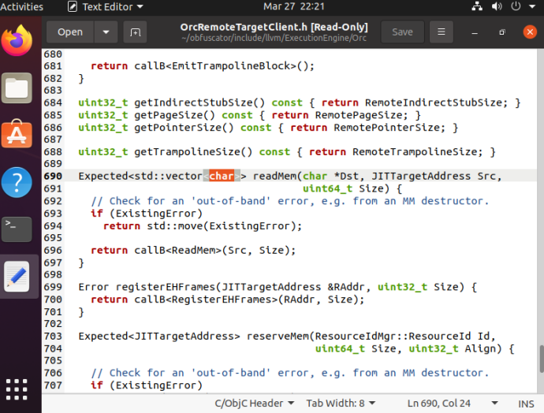

## **编译安装**

```
//在源码同级目录中
mkdir build
cd build
cmake -DCMAKE_BUILD_TYPE=Release -DLLVM_INCLUDE_TESTS=OFF ../obfuscator/
make -j8
sudo make install
```

### 检验

```
//检验llvm和clang是否安装成功
clang --version
```

## 检验OLLVM使用

在桌面建立test文件夹，在文件夹中新建test.cpp,其中代码自定义即可，如下代码来自网络：

```
#include <stdio.h>
#include <stdlib.h>

int encryptFunc(int inputNum_1,int inputNum_2){
    
    int tmpNum_1 = 666, tmpNum_2 = 888, tmpNum_3 = 777;
    return tmpNum_1 ^ tmpNum_2 + tmpNum_3 * inputNum_1 - inputNum_2;
}

int main(int argc,char *argv[]){
    

    int printNum = 55;
    if (argc > 1)
    {
    
        printNum = encryptFunc(printNum, atoi(argv[1]));
    }else{
    
        printNum = encryptFunc(printNum, argc);
    }
    
    printf("Hello OLLVM %d\r
", printNum);

    return 0;
}
```

# **OLLVM 基本用法**

## **控制流平坦化(Control Flow Flattening)**

```
clang -mllvm -fla -mllvm -split -mllvm -split_num=3 test.cpp -o test_fla
```

-mllvm -fla : 激活控制流平坦化

-mllvm -split : 激活基本块分割

-mllvm -split\_num=3 : 指定基本块分割的数目，这里一个基本款会被分割成3个基本块后再进行

控制流平坦化混淆

注意在编译时可能出现 stddef.h 和 stdarg.h 头文件不存在的错误，可以使用 locate stddef.h 和 locate stdarg.h 指令找到这两个头文件的位置，然后复制到 /usr/include

或 /usr/local/include 目录下。

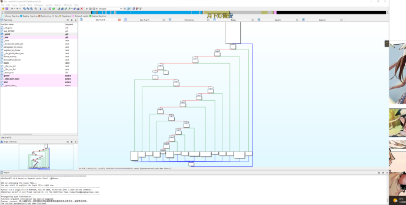

## **虚假控制流(Bogus Control Flow)**

```
clang -mllvm -bcf -mllvm -bcf_loop=3 -mllvm -bcf_prob=40 test.cpp -o test_bcf
```

-mllvm -bcf : 激活虚假控制流

-mllvm -bcf\_loop=3 : 混淆次数，这里一个函数会被混淆3次，默认为 1

-mllvm -bcf\_prob=40 : 每个基本块被混淆的概率，这里每个基本块被混淆的概率为40%，默认为 30

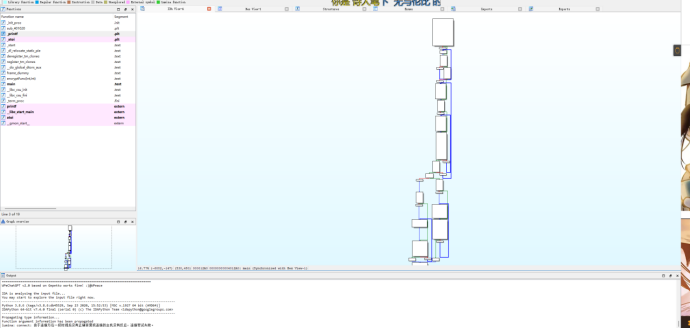

## **指令替换(Instruction Substitution)**

```
clang -mllvm -sub -mllvm -sub_loop=3 test.cpp -o test_sub
```

-mllvm -sub : 激活指令替代

-mllvm -sub\_loop=3 : 混淆次数，这里一个函数会被混淆3次，默认为 1

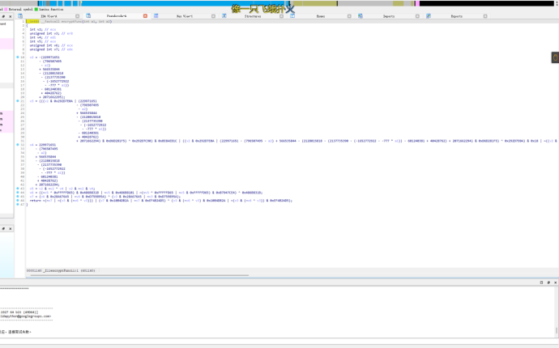

# 控制流平坦化

控制流平坦化指的是将正常控制流中基本块之间的跳转关系删除，用一个集中的分发块来调度基本块的执行顺序。

* **入口块：进入函数第一个执行的基本块。**
* **主分发块与子分发块：负责跳转到下一个要执行的原基本块。**
* **原基本块：混淆之前的基本块，真正完成程序工作的基本块。**
* **返回块：返回到主分发块。**

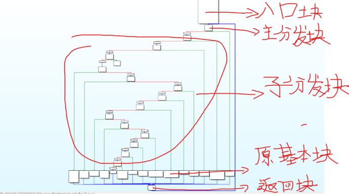

控制流平坦化混淆后的伪代码，while + switch 结构对应平坦化后的控制流结构。 如果是if...else也有可能。

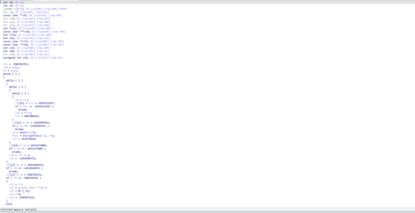

# 控制流平坦化的代码实现思路

## 保存原基本块

将除入口块以外的以外的基本块保存到 vector 容器中，方便后续处理。

如果入口块的终结指令是条件分支指令，则将该指令单独分离出来作为一个基本块，加入到 vector 容器的最前面。

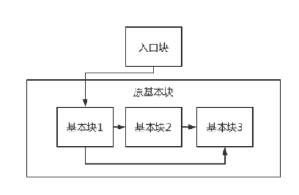

实现后效果

```
//将除入口块以外的基本块保存到 vector 容器中，方便后续处理
// 首先保存所有基本块
vector<BasicBlock*> origBB;
for(BasicBlock &BB : F){
    origBB.push_back(&BB);
}
// 从 vector 中去除第一个基本块
// 因为第一个基本块一定是入口块
origBB.erase(origBB.begin());
BasicBlock &entryBB = F.getEntryBlock();
// 判断：如果第一个基本块的末尾是条件跳转 -> 单独分离
// dyn_cast：用来类型判断和类型转换，如果给定参数（entryBB.getTerminator()）符合想要类型（BranchInst），进行转换，转换成（BranchInst *br），如果不符合类型，返回一个 nullptr 空指针
if(BranchInst *br = dyn_cast<BranchInst>(entryBB.getTerminator())){
    if(br->isConditional()){//isConditional函数：判断是否是条件跳转指令。
        // 分离跳转指令作为新基本快，插入到 vector 容器最前端
        BasicBlock *newBB = entryBB.splitBasicBlock(br, "newBB");
        origBB.insert(origBB.begin(), newBB);
    }
}
```

## 创建分发块和返回块

除了原基本块之外，我们还要续创建一个分发块来调度基本块的执行顺序。并建立入口块到分发块的绝对跳转。

再创建一个返回块，原基本块执行完后都需要跳转到这个返回块，返回块会直接跳转到分发块。

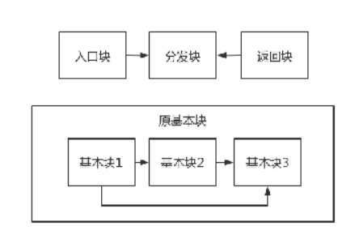

```
// 创建分发块和返回块
// BasicBlock::Create创建基本块函数，第一个参数是 LLVM Context（上下文） 类型，可用getContext方法获取；
//第二个参数是新建块的名称（dispatchBB）；
//第三个参数是函数指针，即在哪个函数（F）里面创建基本块；
//第四个参数指定创建的基本块被移动到哪个基本块（entryBB）的前面。
BasicBlock *dispatchBB = BasicBlock::Create(F.getContext(), "dispatchBB", &F, &entryBB);
BasicBlock *returnBB = BasicBlock::Create(F.getContext(), "returnBB", &F, &entryBB);
// 此时的块顺序如下
/*-----------------------
    分发块
    返回块
    入口块
-----------------------*/
// 建立分发块和返回块的链接
//BranchInst::Create(dispatchBB, returnBB)无条件函数：
//在基本块returnBB的末尾添加一条br指令（无条件跳转）。即直接从基本块returnBB跳转到另一个基本块dispatchBB。
BranchInst::Create(dispatchBB, returnBB);
// 把入口块移到最前面，分发块前面
//moveBefore方法：移动一个基本块（entryBB）到另一个基本块（dispatchBB）前面。
entryBB.moveBefore(dispatchBB);
// 此时的块顺序如下
/*-----------------------
    入口块
    分发块
    返回块
-----------------------*/
// 去除入口块末尾的跳转
//getTerminator方法：获取基本块最后一条指令
//eraseFromParent方法：删除指令
entryBB.getTerminator()->eraseFromParent();
// 使入口块跳转到 dispatchBB，brDispatchBB 也就是入口块的终结指令
BranchInst *brDispatchBB = BranchInst::Create(dispatchBB, &entryBB);
```

## 实现分发块调度

在入口块中创建并初始化 switch 变量，在调度块中插入switch 指令实现分发功能。

将原基本块移动到返回块之前，并分配随机的 case 值，并将其添加到 switch 指令的分支中。

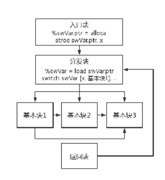

```
// 在入口块插入 alloca 和 store 指令创建并初始化 switch 变量，初始值为随机值
int randNumCase = rand();
// 在入口块跳转分发块指令（brDispatchBB）之前插入一条申请分配内存的指令，使用 AllocaInst 的构造函数
AllocaInst *swVarPtr = new AllocaInst(TYPE_I32, 0, "swVar.ptr", brDispatchBB);
// 在入口块跳转分发块指令（brDispatchBB）之前插入一条内存存储的指令
new StoreInst(CONST_I32(randNumCase), swVarPtr, brDispatchBB);
// 在分发块插入 load 指令读取 switch 变量
LoadInst *swVar = new LoadInst(TYPE_I32, swVarPtr, "swVar", false, dispatchBB);
// 在返回块前创建 switch 默认跳转的基本块
BasicBlock *swDefault = BasicBlock::Create(F.getContext(), "seDefault", &F, returnBB);
// switch 默认跳转的基本块默认跳转到返回块
BranchInst::Create(returnBB, swDefault);
// 在分发块末尾的 switch 块中添加 switch 指令
SwitchInst *swInst = SwitchInst::Create(swVar, swDefault, 0, dispatchBB);
// 将原基本块插入到返回块之前，并分配 case 值
for(BasicBlock *BB : origBB){
    BB->moveBefore(returnBB);
    //addCase方法，在基本块中添加对应 switch 指令的 case 值。
    swInst->addCase(CONST_I32(randNumCase), BB);
    randNumCase = rand();
}
```

## 实现调度变量自动调整

在每个原基本块最后添加修改 switch 变量值的指令，以便返回分发块之后，能够正确执行到下一个基本块。

删除原基本块末尾的跳转，使其结束执行后跳转到返回块。

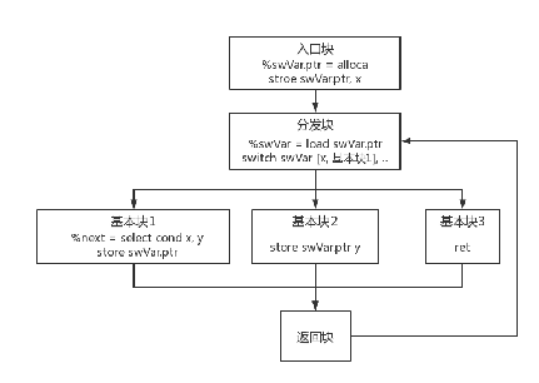

```
// 在每个基本块最后添加修改 switch 变量的指令和跳转到返回块的指令
for(BasicBlock *BB : origBB){
    // retn BB
    //getNumSuccessors方法：获取后继块的数量。为 0 表示后续只有一条 return 指令；为 1 表示为非条件跳转，后续有一个后继块；为 2 表示为条件跳转，后续有两个后继块。
    if(BB->getTerminator()->getNumSuccessors() == 0){
        continue;
    }
    // 非条件跳转
    else if(BB->getTerminator()->getNumSuccessors() == 1){
        // 获取后继块
        BasicBlock *sucBB = BB->getTerminator()->getSuccessor(0);
        // 删除基本块最后一条跳转到后继块的指令
        BB->getTerminator()->eraseFromParent();
        // 获取后继块的 case 值，（常量类型）
        //findCaseDest方法：寻找基本块中 switch case 值，返回值为 ConstantInt 类型。
        ConstantInt *numCase = swInst->findCaseDest(sucBB);
        // 把 switch 变量修改成它的后继块的 case 值，下一轮进入分发块就根据这个值跳转到后继块
        new StoreInst(numCase, swVarPtr, BB);
        // 基本块跳转到返回块
        BranchInst::Create(returnBB, BB);
    }
    // 条件跳转
    else if(BB->getTerminator()->getNumSuccessors() == 2){
        ConstantInt *numCaseTrue = swInst->findCaseDest(BB->getTerminator()->getSuccessor(0));
        ConstantInt *numCaseFalse = swInst->findCaseDest(BB->getTerminator()->getSuccessor(1));
        BranchInst *br = cast<BranchInst>(BB->getTerminator());
        // 创建 select 指令判断需要修改哪一个 case 值
        //getCondition方法：获取跳转条件。
        SelectInst *sel = SelectInst::Create(br->getCondition(), numCaseTrue, numCaseFalse, "", BB->getTerminator());
                // 删除基本块最后一条跳转到后继块的指令
        BB->getTerminator()->eraseFromParent();
                // 把 switch 变量修改成它的后继块的 case 值，下一轮进入分发块就根据这个值跳转到后继块
        new StoreInst(sel, swVarPtr, BB);
        // 基本块跳转到返回块
        BranchInst::Create(returnBB, BB);
    }
}
```

## 修复 PHI 指令和逃逸变量

[PHI 指令](https://ncra-sdpc.feishu.cn/docx/KwEpdaE1MoMKF4xYXaGcYyqDn1a#part-GcLwd9MoKoauDAx10CUcXOgonXc)的值由前驱块决定，平坦化后所有原基本块的前驱块都变成了分发块，因此 PHI 指令发生了损坏。

逃逸变量指在一个基本块中定义，并且在另一个基本块被引用的变量。在原程序中某些基本块可能引用之前某个基本块中的变量，平坦化后原基本块之间不存在确定的前后关系（由分发块决定），因此某些变量的引用可能会损坏，在编译时会出现分不清定义和引用顺序的问题。

修复的方法是，**调用****DemotePHIToStack****、****DemotePHIToStack****这两个函数将 PHI 指令和逃逸变量都转化为内存存取指令（alloca、store、load）**。Demote 是降级的意思，DemoteToStack就是用 alloca, store, load 三类内存访问指令来代替之前的 PHI 指令。 LLVM IR 中的 alloca 指令是在栈中进行分配的，这点不同于C语言中的 malloc 函数。将所有 PHI 指令用三类内存访问指令表示，并将所有 alloca 指令都放在入口块，PHI 指令的错误就被修复了。

```
void Flattening::fixStack(Function &F){
    vector<PHINode*> origPHI;
    vector<Instruction*> origReg;
    BasicBlock &entryBB = F.getEntryBlock();
    for(BasicBlock &BB : F){
        for(Instruction &I : BB){
            if(!PHINode *PN = dyn_cast<PHINode>(&I)){
                origPHI.push_back(PN);
            }else if(!(isa<AllocaInst>(&I) && I.getParent() == &entryBB) && I.isUsedOutsideOfBlock(&BB)){
                origReg.push_back(&I);
            }
        }
    }
    for(PHINode *PN : origPHI){
        DemotePHIToStack(PN, entryBB.getTerminator());
    }
    for(Instruction *I : origReg){
        DemoteRegToStack(*I, entryBB.getTerminator());
    }
}
```

指令 I 判断为逃逸变量需要同时满足两个条件：

* 不能是内存申请指令且不在入口块内
* isUseOutsideOfBlock函数判断为真，这个函数用于判断指令 I 是否在其他基本块中被使用

# 虚假控制流

虚假控制流指，通过向正常控制流中插入若干不可达基本块（永远不会被执行的基本块）和由不透明谓词造成的虚假跳转，以产生大量垃圾代码干扰攻击者分析的混淆。

与控制流平坦化不同，经过虚假控制流混淆的控制流图呈长条状。

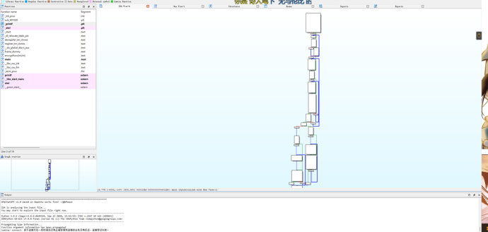

虚假控制流是以基本块为单位进行混淆的，每个基本块要经过分裂、克隆、构建虚假跳转等操作。

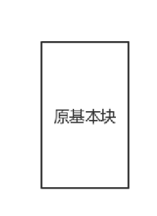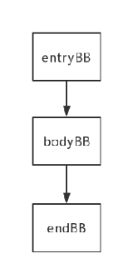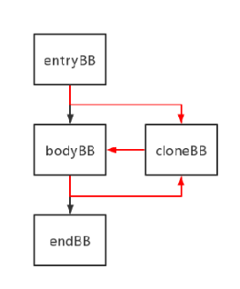

## 基本块拆分

将基本块拆分成头部、中部和尾部三个基本块。

通过 getFirstNonPHI 函数获取第一个不是 PHINode 的指令，以该指令为界限进行分割，得到 entryBB 和 bodyBB。 以 bodyBB 的终结指令为界限进行分割，最终得到头部、中部和尾部三个基本块，也就是 entryBB, bodyBB 和 endBB。

```
void BogusControlFlow::bogus(BasicBlock *entryBB){
    // 第一步，拆分得到 entryBB,bodyBB,endBB
    // 其中所有的 PHI 指令都在 entryBB(如果有的话)
    // endBB 只包含一条终结指令
    BasicBlock *bodyBB = entryBB->splitBasicBlock(entryBB--getFirstNonPHI(), "bodyBB");
    BasicBlock *endBB = bodyBB->splitBasicBlock(bodyBB->getTerminator(), "endBB");
```

## 基本块克隆

克隆中间的 bodyBB，得到克隆块 cloneBB。

LLVM 自带 CloneBasicBlock 函数，但该函数为不完全克隆，还需要做一些补充处理。 我们把基本块的克隆操作写到 createCloneBasicBlock 函数中：

```
BasicBlock *cloneBB = createCloneBasicBlock(bodyBB);
```

在克隆的基本块中，仍然引用了原基本块中的 %a 变量，该引用是非法的，故需要将 %a 映射为 %a.clone：

```
orig:
  %a = ...
  %b = fadd %a, ...
  
clone:
  %a.clone = ...
  %b.clone = fadd %a, ... ; Note that this references the old %a and not %a.clone!
```

根据 VMap 对克隆基本块中的变量进行修复：

```
BasicBlock* llvm::createCloneBasicBlock(BasicBlock *BB){//cloneBasicBlock函数：自带的克隆基本块函数，第一个参数为要克隆的基本块，第二个参数是映射表，第三个参数为克隆后基本块的名称，第四个为克隆基本块所属函数。
    // 创建一个映射表类型变量
    ValueToValueMapTy VMap;
    BasicBlock *cloneBB = cloneBasicBlock(BB, VMap, BB->getName() + "cloneBB", BB->getParent());//getParent方法：返回基本块所属函数。
    // 对克隆基本块的引用进行修复
    for(Instruction &I : *cloneBB){
        for(int i = 0;i < I.getNumOperands();i ++){//getNumOperands方法：获取给定下标的指令的操作数的数量。
            value *V = MapValue(I.getOperand(i), VMap);//MapValue函数：映射变量。//getOperand方法：获取操作数。
            // 如果映射出来不为空，（成功）
            if(V){
                I.setOperand(i, V);//setOperand方法：替换操作数。
            }
        }
    }
    return cloneBB;
}
```

## 构造虚假跳转

将 entryBB 到 bodyBB 的绝对跳转改为条件跳转， 将 bodyBB 到 endBB 的绝对跳转改为条件跳转，

添加 cloneBB 到 bodyBB 的绝对跳转。

```
// 1. 将 entryBB, bodyBB, cloneBB 末尾的绝对跳转移除
entryBB->getTerminator()->eraseFromParent();
bodyBB->getTerminator()->eraseFromParent();
cloneBB->getTerminator()->eraseFromParent();
// 2. 在 entryBB 和 bodyBB 的末尾插入条件 恒为真 的虚假比较指令
Value *cond1 = createBogusCmp(entryBB); 
Value *cond2 = createBogusCmp(bodyBB); 
// 3. 将 entryBB 到 bodyBB 的绝对跳转改为条件跳转，条件为 cond1，为真跳转 bodyBB，为假跳转 cloneBB
BranchInst::Create(bodyBB, cloneBB, cond1, entryBB);
// 4. 将 bodyBB 到 endBB的绝对跳转改为条件跳转，条件为 cond2，为真跳转 endBB，为假跳转 cloneBB
BranchInst::Create(endBB, cloneBB, cond2, bodyBB);
// 5. 添加 bodyBB.clone 到 bodyBB 的绝对跳转
BranchInst::Create(bodyBB, cloneBB);
```

该比较指令等价于 if(y < 10 || x \* (x + 1) % 2 == 0)：

```
//虚假跳转指令
Value* BogusControlFlow::createBogusCmp(BasicBlock *insertAfter){
    // if((y < 10 || x * (x + 1) % 2 == 0))
    // 等价于 if(true)
    Module *M = insertAfter->getModule();
    // 创建两个全局变量 x、y
    //GlobalVariable：全局变量类型，其析构函数可以用于创建一个全局变量，第一个参数是模块，第二个参数是全局变量类型，第三个参数选择是否为常量，第四个参数选择链接方式（CommonLinkage），第五个参数是初始值（为0），第六个参数为创建出来的参数名字。
    GlobalVariable *xptr = new GlobalVariable(*M, TYPE_I32, false, GlobalValue::CommonLinkage, CONST_I32(0), "x");
    GlobalVariable *yptr = new GlobalVariable(*M, TYPE_I32, false, GlobalValue::CommonLinkage, CONST_I32(0), "y");
    // 加载两个全局变量
    //LoadInst：读取指令，其析构函数可以创建一条读取指令，第一个参数是全局变量类型，第二个参数是全局变量指针，第三个参数是名称，第四个参数指定插入到哪个基本块（insertAfter
    LoadInst *x = new LoadInst(TYPE_I32, xptr, "", insertAfter);
    LoadInst *y = new LoadInst(TYPE_I32, yptr, "", insertAfter);
    // 创建 y < 10 和 x * (x + 1) % 2 两个式子
    // 创建 y < 10
    //ICmpInst：比较指令，其析构函数可以创建一条比较指令，第一个参数是指定插入到哪个基本块后面，第二个参数是谓词，指定为大于、小于、或等于（CmpInst::ICMP_SLT），第三个参数和第四个参数分别指定左边和右边的参数。
    ICmpInst *cond1 = new ICmpInst(*insertAfter, CmpInst::ICMP_SLT, y, CONST_I32(10));
    // 创建 x * (x + 1) % 2
    BinaryOperator *op1 = BinaryOperator::CreateAdd(x, CONST_I32(1), "", insertAfter);
    BinaryOperator *op2 = BinaryOperator::CreateMul(op1, x, "", insertAfter);
    BinaryOperator *op3 = BinaryOperator::CreateURem(op2, CONST_I32(2), "", insertAfter);
    ICmpInst *cond2 = new ICmpInst(*insertAfter, CmpInst::ICMP_EQ, op3, CONST_I32(0));
    //BinaryOperator：二元运算指令，可以创建加减乘除和与或非等指令
    return BinaryOperator::CreateOr(cond1, cond2, "", insertAfter);
}
```

# 指令替代

指令替代指将正常的二元运算指令（如加法、减法、异或等等），替换为等效而更复杂的指令序列，以达到混淆计算过程的目的。

例如将 a+b 替换为 a - (-b) ，将 a ^ b 替换为 (~a & b) | (a & ~b) 等等。

仅支持整数运算的替换，因为替换浮点指令会造成舍入的错误和误差。

## 扫描所有指令，对目标指令（加法、减法、与或非、异或）进行替换：

```
bool Substitution::runOnFunction(Function &F){
    for(int i = 0;i < ObfuTime;i ++){
        for(BasicBlock &BB : F){
            vector<Instruction*> origInst;
            for(Instruction &I : BB){
                origInst.push_back(&I);
            }
            for(Instruction *I : origInst){
                if(isa<BinaryOperator>(I)){
                    BinaryOperator *BI = cast<BinaryOperator>(I);
                    substitute(BI);
                }
            }
        }
    }
}
```

### 加法替换

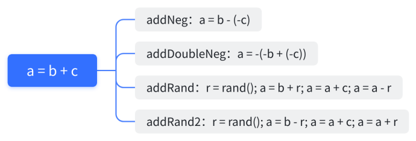

### 减法替换

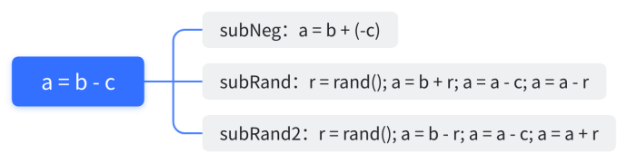

### 与替换

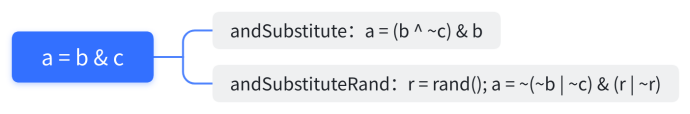

### 或替换

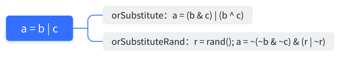

### 异或替换

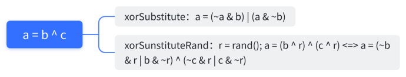

# 随机控制流

随机控制流是虚假控制流的一种变体，随机控制流通过克隆基本块，以及添加随机跳转（随机跳转到两个功能相同的基本块中的一个）来混淆控制流。

与虚假控制流不同，随机控制流中不存在不可达基本块和不透明谓词，因此用于去除虚假控制流的手段（消除不透明谓词、符号执行获得不可达基本块后去除）失效。

随机控制流同样是以基本块为单位进行混淆的，每个基本块要经过分裂、克隆、构造随机跳转和构造虚假随机跳转四个操作。

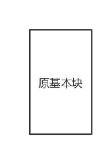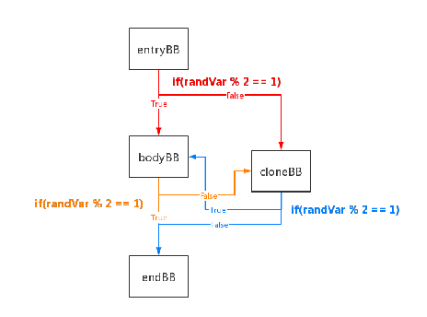

## 基本块拆分

通过 getFirstNonPHI 函数获取第一个不是 PHINode 的指令，以该指令为界限进行分割，得到 entryBB 和 bodyBB。 以 bodyBB 的终结指令为界限进行分割，最终得到头部、中部和尾部三个基本块，也就是 entryBB, bodyBB 和 endBB。（去，跟控制流平坦化真像哈）

```
// 第一步，拆分得到 entryBB,bodyBB,endBB
// 其中所有的 PHI 指令都在 entryBB(如果有的话)
// endBB 只包含一条终结指令
BasicBlock *entryBB = BB;
BasicBlock *bodyBB = entryBB->splitBasicBlock(entryBB--getFirstNonPHIOrDbgOrLifetime(), "bodyBB");
BasicBlock *endBB = bodyBB->splitBasicBlock(bodyBB->getTerminator(), "endBB");
```

## 基本块克隆

将中间的基本块进行克隆，这里可以选择对基本块进行变异，但不能改变基本块的功能。（不同点来了）

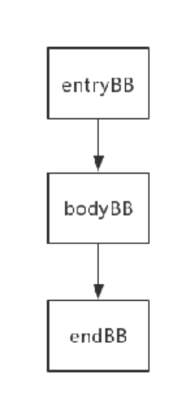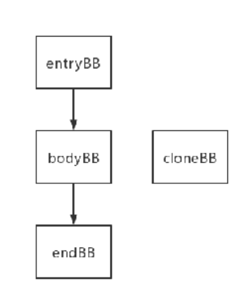

与虚假控制流不同，随机控制流在克隆时还需要修复逃逸变量

```
BasicBlock *cloneBB = createCloneBasicBlock(bodyBB);
```

在一个基本块中定义的变量，如果在另一个基本块中被引用，那么该变量称为逃逸变量：

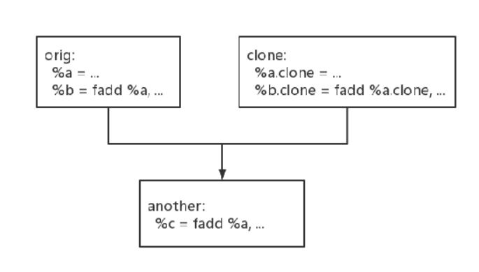

```
BasicBlock* llvm::createCloneBasicBlock(BasicBlock *BB){
    // 克隆之前先修复所有逃逸变量
    vector<Instruction*> origReg;
    BasicBlock &entryBB = BB->getParent()->getEntryBlock();
    for(Instruction &I : *BB){
        if(!(isa<AllocaInst>(&I) && I.getParent() == &entryBB) 
            && I.isUsedOutsideOfBlock(BB)){
            origReg.push_back(&I);
        }
    }
    for(Instruction *I : origReg){
        DemoteRegToStack(*I, entryBB.getTerminator());
    }
    // 创建一个映射表类型变量
    ValueToValueMapTy VMap;
    BasicBlock *cloneBB = CloneBasicBlock(BB, VMap, "cloneBB", BB->getParent());
    // 对克隆基本块的引用进行修复
    for(Instruction &I : *cloneBB){
        for(int i = 0;i < I.getNumOperands();i ++){
            Value *V = MapValue(I.getOperand(i), VMap);
            // 如果映射出来不为空，（成功）
            if(V){
                I.setOperand(i, V);
            }
        }
    }
    return cloneBB;
}
```

## 构造随机跳转

将生成随机数的指令插入到 entryBB ，将生成的随机数命名为 randVar，并在 entryBB 后插入基于 randVar 的随机跳转指令。

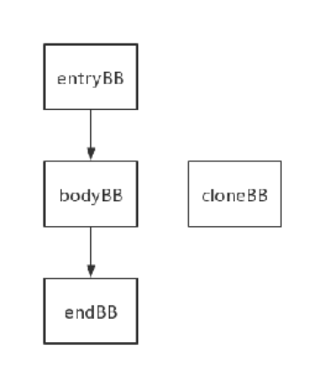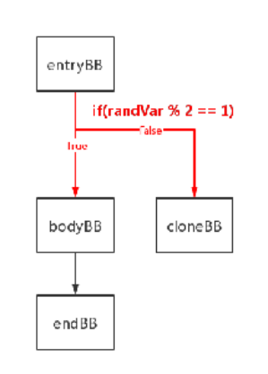

## 插入生成随机数指令

向 entryBB 中插入生成随机数的指令和随机跳转，使其能够随机跳转到 bodyBB 或者 bodyBB 的克隆块。

其中随机数指令我们可以使用 LLVM 的内置函数 rdrand：

```
// 在 entryBB 后插入随机跳转，使其能够随机跳转到第 bodyBB 或其克隆基本块 cloneBB
entryBB->getTerminator()->eraseFromParent();
// 获取 rdrand 函数
Function *rdrand = Intrinsic::getDeclaration(entryBB->getModule(), Intrinsic::x86_rdrand_32);//Intrinsic::getDeclaration(id)方法：获取并且创建一个 LLVM 内置函数，这个 id 可以在 intrinsics.gen 中找到。这里调用 LLVM 内置的 rdrand 生成随机数的函数。
// 新建 call 指令调用 rdrand 函数，返回结果是一个结构体，第一个成员是生成的随机数，第二个参数表示该函数是否调用成功
CallInst *randVarStruct = CallInst::Create(rdrand->getFunctionType(), rdrand, "", entryBB);
// 通过 rdrand 内置函数获取随机数
Value *randVar = ExtractValueInst::Create(randVarStruct, 0, "", entryBB);
//插入随机跳转
insertRandomBranch(randVar, bodyBB, cloneBB, entryBB);
```

```
//insertRandomBranch
void RandomControlFlow::insertRandomBranch(Value *randVar, BasicBlock *ifTrue, BasicBlock *ifFalse, BasicBlock *insertAfter){
    // 对随机数进行等价变换
    Value *alteredRandVar = alterVal(randVar, insertAfter);
    // and 1 == % 2
    Value *randMod2 = BinaryOperator::Create(Instruction::And, alteredRandVar, CONST_I32(1), "", insertAfter);
    ICmpInst *condition = new ICmpInst(*insertAfter, ICmpInst::ICMP_EQ, randMod2, CONST_I32(1));
    // 跳转到不同基本块
    BranchInst::Create(ifTrue, ifFalse, condition, insertAfter);
}
```

如果使用了内置函数rdrand，在生成了.ll文件后，需要用llc工具静态编译生成二进制文件，此时需要添加-mattr=rdrnd的属性:

```
llc -filetype=obj -mattr=+rdrnd IR/TestProgram_rcf.ll -o Bin/TestProgram_rcf.o
```

## 对随机变量的恒等变换

```
Value* RandomControlFlow::alterVal(Value *startVar,BasicBlock *insertAfter){
    uint32_t code = rand() % 3;
    Value *result;
    if(code == 0){
        // x = x * (x + 1) - x^2
        BinaryOperator *op1 = BinaryOperator::Create(Instruction::Add, startVar, CONST_I32(1), "", insertAfter);
        BinaryOperator *op2 = BinaryOperator::Create(Instruction::Mul, startVar, op1, "", insertAfter);
        BinaryOperator *op3 = BinaryOperator::Create(Instruction::Mul, startVar, startVar, "", insertAfter);
        BinaryOperator *op4 = BinaryOperator::Create(Instruction::Sub, op2, op3, "", insertAfter);
        result = op4;
    }else if(code == 1){
        // x = 3 * x * (x - 2) - 3 * x^2 + 7 * x
        BinaryOperator *op1 = BinaryOperator::Create(Instruction::Mul, startVar, CONST_I32(3), "", insertAfter);
        BinaryOperator *op2 = BinaryOperator::Create(Instruction::Sub, startVar, CONST_I32(2), "", insertAfter);
        BinaryOperator *op3 = BinaryOperator::Create(Instruction::Mul, op1, op2, "", insertAfter);
        BinaryOperator *op4 = BinaryOperator::Create(Instruction::Mul, startVar, startVar, "", insertAfter);
        BinaryOperator *op5 = BinaryOperator::Create(Instruction::Mul, op4, CONST_I32(3), "", insertAfter);
        BinaryOperator *op6 = BinaryOperator::Create(Instruction::Mul, startVar, CONST_I32(7), "", insertAfter);
        BinaryOperator *op7 = BinaryOperator::Create(Instruction::Sub, op3, op5, "", insertAfter);
        BinaryOperator *op8 = BinaryOperator::Create(Instruction::Add, op6, op7, "", insertAfter);
        result = op8;
    }else if(code == 2){
        // x = (x - 1) * (x + 3) - (x + 4) * (x - 3) - 9
        BinaryOperator *op1 = BinaryOperator::Create(Instruction::Sub, startVar, CONST_I32(1), "", insertAfter);
        BinaryOperator *op2 = BinaryOperator::Create(Instruction::Add, startVar, CONST_I32(3), "", insertAfter);
        BinaryOperator *op3 = BinaryOperator::Create(Instruction::Add, startVar, CONST_I32(4), "", insertAfter);
        BinaryOperator *op4 = BinaryOperator::Create(Instruction::Sub, startVar, CONST_I32(3), "", insertAfter);
        BinaryOperator *op5 = BinaryOperator::Create(Instruction::Mul, op1, op2, "", insertAfter);
        BinaryOperator *op6 = BinaryOperator::Create(Instruction::Mul, op3, op4, "", insertAfter);
        BinaryOperator *op7 = BinaryOperator::Create(Instruction::Sub, op5, op6, "", insertAfter);
        BinaryOperator *op8 = BinaryOperator::Create(Instruction::Sub, op7, CONST_I32(9), "", insertAfter);
        result = op8;
    }
    return result;
}
```

## 构造虚假随机跳转

在 bodyBB 和 cloneBB 后插入虚假随机跳转指令（实际上仍会直接跳转到 endBB）：

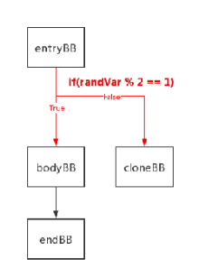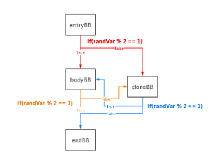

```
// 添加 bodyBB 到 bodyBB.clone 的虚假随机跳转
bodyBB->getTerminator()->eraseFromParent();
insertRandomBranch(randVar, endBB, cloneBB, bodyBB);
// 添加 bodyBB.clone 到 bodyBB 的虚假随机跳转
cloneBB->getTerminator()->eraseFromParent();
insertRandomBranch(randVar, bodyBB, endBB, cloneBB);
```

# 常量替代

常量替代指将二元运算指令（如加法、减法、异或等等）中使用的常数，替换为等效而更复杂的表达式，以达到混淆计算过程或某些特殊常量的目的。

例如将 TEA 加密中使用的常量 0x9e3779b 替换为 12167\*16715+18858\*32146-643678438。

同指令替代，目前仅支持整数常量的替换，因为替换浮点数会造成舍入的错误和误差。且仅支持32位整数的替换。

常量替代可进一步拓展为常量数组的替代和字符串替代。

常量数组替代可以抹去 AES, DES 等加密算法中特征数组，字符串替代可以防止攻击者通过字符串定位关键代码。

# 扫描所有指令，对目标指令（操作数类型为32位整数）进行替换

```
for(Instruction *I : origInst){
    // 只对二元运算指令中的常量进行替换
    if(BinaryOperator *BI = dyn_cast<BinaryOperator>(I)){
        // 仅对整数进行替换
        if(BI->getType()->isIntegerTy(32)){
            substitute(BI);
        }
    }
}
```

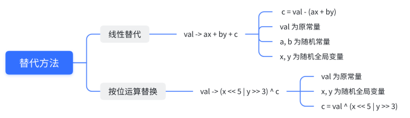
