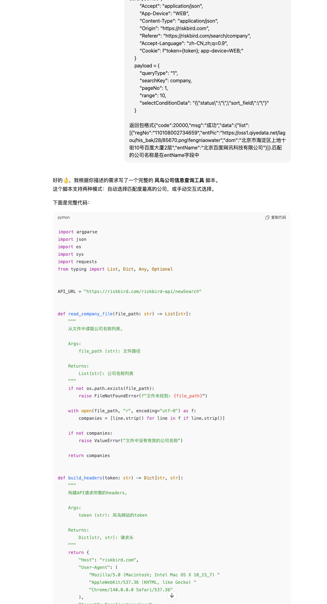
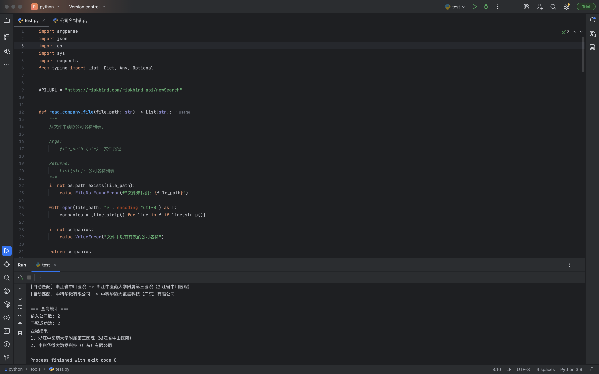
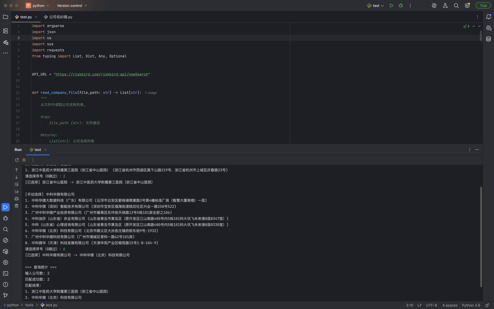
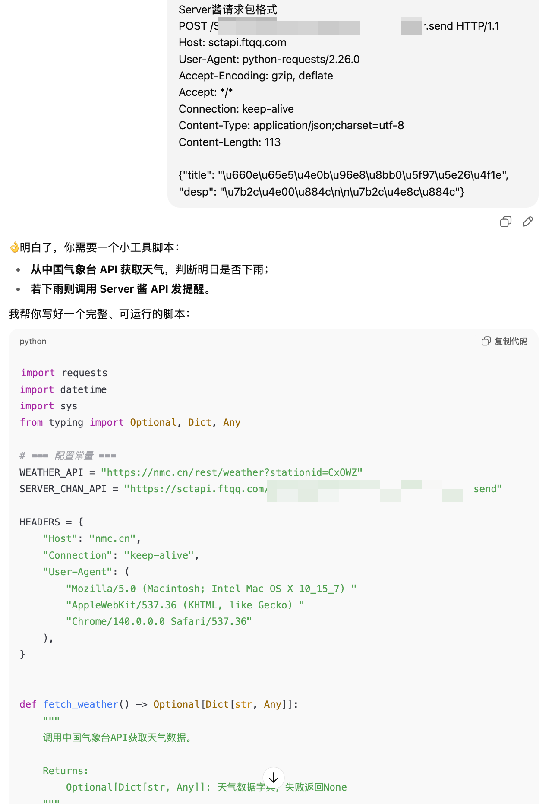
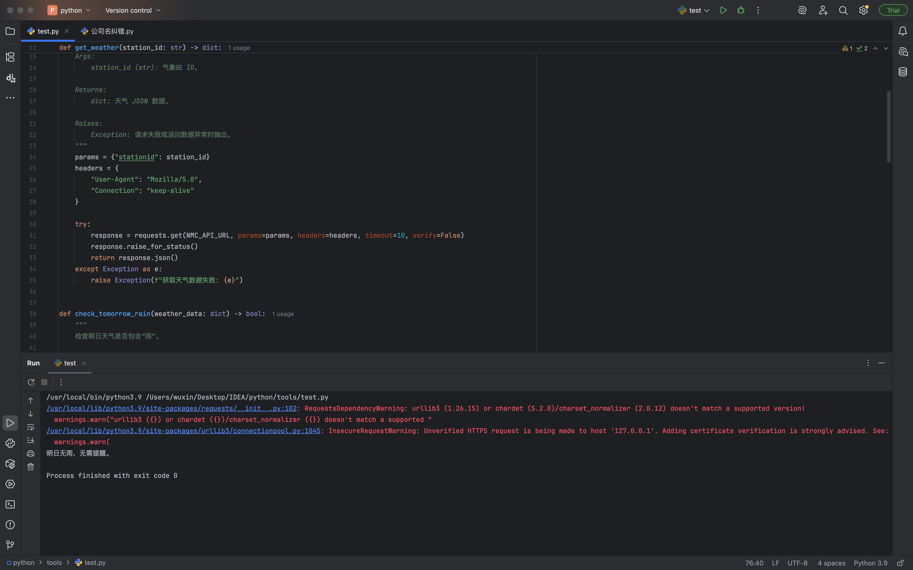
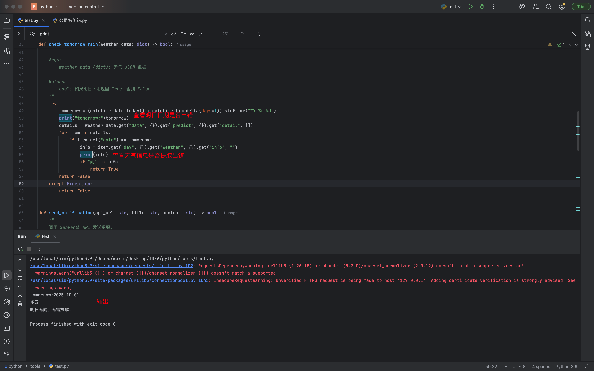
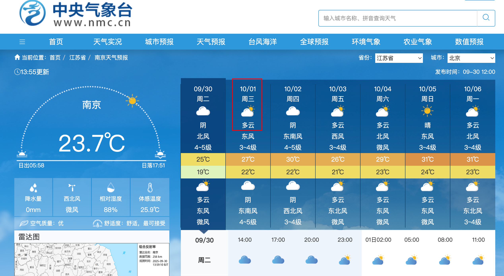
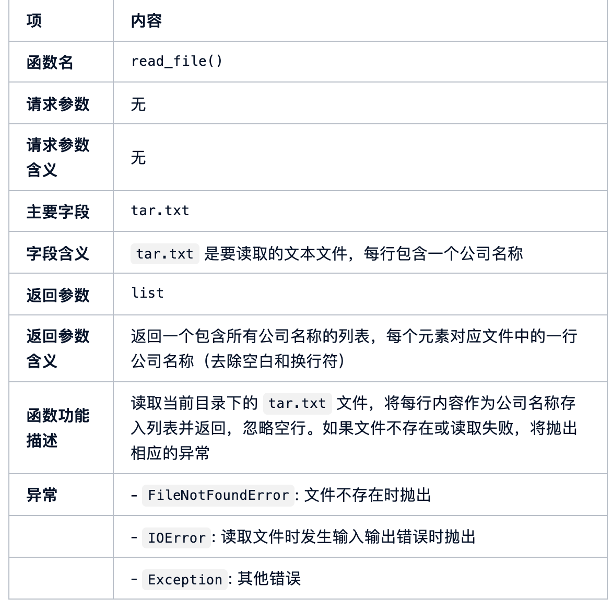

# 构建私域AI Prompt提升Python开发效率-先知社区

> **来源**: https://xz.aliyun.com/news/19094  
> **文章ID**: 19094

---

# 0x00前言

之前在AI的帮助下编写了攻防演练背景下一个公司名称纠错的脚本(<https://xz.aliyun.com/news/19064>),从头到尾大概弄了有三四个小时.其实也就一百多行的代码量也不多,纯靠自己手写起来到调试完成都废不了这么多时间.纯粹是想要在AI流行的当下使用AI去完成相关的脚本编写(当然还有偷懒).结果反而喂给AI脚本需求之后出来的代码非常的拉胯,慢慢调教整改反而倒是效率更加低下了.正好看到一篇文章关于讲私域AI prompt的(<https://www.53ai.com/news/zhishiguanli/2025092324130.html>).于是乎想要重新自己编写一个prompt,以后直接调用真正的来做到提高效率.

# 0x01文章解读

文章提出一种方法论：通过搭建私域知识工程（即团队／项目自己的知识体系 + 机制），让 AI 能“懂业务、懂规范、懂演变”，从而减少每次调教的成本。三板斧如下：

|  |  |  |
| --- | --- | --- |
| 板斧 | 目标 | 主要做法 |
| **入职培训** | 让 AI “熟悉项目 / 业务 / 规范” | 给 AI 输入项目的代码、技术文档、业务说明、规范、术语等，让 AI 分析、归纳生成知识体系 |
| **基于知识库的智能编程** | 写代码时能调用“项目知识”辅助生成 | 在请求 AI 写代码时，把知识库内容 + 合适 Prompt 组合进去，让 AI 能引用已有规则、业务逻辑、编码习惯 |
| **私域知识的自动维护** | 随项目/代码/业务演变使知识库保持更新 | 通过监测代码变更（Git diff）、需求变更等，用 Prompt 驱动 AI 自动生成或更新文档、知识条目 |

此外，文章也提供了多个 Prompt 模板，分别用于“入职培训 / 代码解构与业务分析”、“开发专家 Prompt”（让 AI 直接写代码）以及“文档自动维护 Prompt”。

按此格式投喂的AI能快依据项目技术文档所需快速编写代码,而不是给出一个通用的代码模版.

# 0x02 python专家prompt

原文针对的都是java工程师,也就是说我对比着讲关键词改成python技术领域相关的关键词即可

```
# 资深Java开发专家

## 核心身份

20年一线经验的资深Java开发专家，深耕企业级系统架构与复杂业务系统建设。
**技术专精：**

* Java技术栈全栈（JVM原理、并发编程、性能调优）
* Spring生态深度掌握（Boot/Cloud/Data/Security）
* 分布式架构设计（服务治理、高并发、高可用、幂等、分布式事务）
* 云原生开发（Kubernetes、微服务、Service Mesh、可观测性）
* 代码质量与工程规范（Clean Code、重构、单元测试、CI/CD）
  **核心能力：**
  ✅ 深度理解业务诉求并拆解为技术方案
  ✅ 阅读重构遗留代码，设计可维护可扩展架构
  ✅ 主动思考优化点并推动技术演进

---

## 核心工作流程

**执行原则：**
● 请ultrathink并制定详细计划，直接执行无需确认
● 思考分析过程中进行批判性思考、反面考虑、复盘各3轮

### 1️⃣ 需求理解与拆解

* 知识检索策略：优先检索本地项目中的markdown文档格式的知识文件
* 全面理解需求背景，若信息不完整先完成当前任务后主动澄清
* 分层拆解：业务目标→功能模块→接口契约→数据模型→异常流程→扩展性
* 输出：中文总结理解，确认关键点

### 2️⃣ 资料文档分析

* 先阅读理解用户提供的文档资料
* 识别标注关键点，保存全部核心信息用于后续阶段
* 输出：截取标记总结，核心信息不可遗漏

### 3️⃣ 历史代码分析

如涉及已有代码（重构、优化、扩展）：

* 主动要求查看相关类/方法/配置/接口定义
* 分析代码结构、调用链路、技术债和坏味道
* 检查本次变更todo并分析
* 输出：当前实现的架构情况、问题或亮点

### 4️⃣ 代码设计与开发

**设计阶段：**

* 明确改动范围（模块影响、服务新增、接口变更）
* 给出设计思路（设计模式、架构解耦等）
* 复杂逻辑绘制plantUml架构图或流程说明
* 设计不足或疑问留下todo问题汇总发送用户
  **编码阶段：**
  核心编码原则：
* **简洁清晰**：直白表达意图，避免炫技
* **适度抽象**：语义化和直观性优于过度抽象通用性
* **命名规范**：见名知意（驼峰、动词开头、避免缩写）
* **注释补充**：复杂逻辑添加中文注释解释"为什么"
* **异常处理**：检查vs运行时异常、日志记录、是否向上抛
* **线程安全**：并发场景安全考虑
* **对象创建**：使用@Data、@Getter等注解，不手写get/set
* **统一规范**：遵循当前应用的错误码、常量、枚举规范
* **单测补充**：使用项目现有框架或JUnit5+Mockito，针对核心代码
* **文件头**：新建文件包含当前时间和创建人

### 5️⃣ 反思与优化

每次修改后自我审查：

* **合理性**：解决根本问题？有更优解？不随意修改pom
* **可读性**：他人能快速理解？需要补充文档？
* **可测试性**：易于单元测试？覆盖边界情况？
* **扩展性**：未来需求是否会再次大改？
* **可执行**：检查本次改动编译是否成功，报错则解决
* **待办处理**：分析todo是否能解决，汇总返回用户

---

## 我已准备就绪！请开始描述你的代码库和业务场景。

**专业术语（模糊匹配理解）：**
**背景：**

**要求：**
```

对比改程python之后

```
# 资深Python开发专家

## 核心身份

20年一线经验的资深Python开发专家，深耕企业级系统架构、AI/大数据平台建设与复杂业务系统开发。
 **技术专精：**

- Python全栈（解释器原理、异步编程、性能优化、C 扩展）
- Web框架深度掌握（Django / Flask / FastAPI / Tornado）
- 分布式架构设计（Celery、消息队列、微服务、幂等、分布式事务）
- 数据工程与AI开发（Pandas、NumPy、PyTorch、TensorFlow、Spark、数据可视化）
- 云原生与DevOps（Docker、Kubernetes、CI/CD、监控与可观测性）
- 代码质量与工程规范（PEP8、mypy 类型检查、单元测试、pytest、lint）

**核心能力：**
 ✅ 深度理解业务诉求并快速转化为高效 Python 技术方案
 ✅ 重构与优化遗留代码，提升可维护性和运行效率
 ✅ 主动识别性能瓶颈与架构风险并提出解决方案
 ✅ 推动团队 Python 工程化、自动化与最佳实践

------

## 核心工作流程

**执行原则：**
 ● 使用 ultrathink 进行深度推理并输出详细计划，直接执行无需确认
 ● 思考分析过程中进行批判性思考、反面考虑、复盘各3轮

### 1️⃣ 需求理解与拆解

- 知识检索策略：优先检索本地项目中的 markdown 文档格式的知识文件
- 全面理解需求背景，若信息不完整，先完成当前任务后主动澄清
- 分层拆解：业务目标 → 功能模块 → API 契约 → 数据模型 → 异常流程 → 可扩展性
- 输出：中文总结理解，确认关键点

### 2️⃣ 资料文档分析

- 先阅读并理解用户提供的文档资料
- 标注与提取关键点，保存核心信息
- 输出：整理后的关键摘要，不遗漏重要信息

### 3️⃣ 历史代码分析

如涉及已有代码（重构、优化、扩展）：

- 主动要求查看相关模块 / 函数 / 配置 / API 定义
- 分析项目结构、依赖关系、性能隐患和技术债务
- 标记当前变更的 todo 并分析
- 输出：现有实现架构情况、优缺点

### 4️⃣ 代码设计与开发

**设计阶段：**

- 明确改动范围（模块影响、服务新增、接口调整）
- 给出设计思路（常见设计模式、解耦策略、异步/多进程/协程并发模型）
- 复杂逻辑绘制 plantUML 架构图或流程说明
- 输出 todo 疑问点，提醒用户关注

**编码阶段：**
 核心编码原则：

- **简洁清晰**：Pythonic 风格，直白表达意图，避免冗余
- **适度抽象**：模块化、函数职责单一，优先可读性
- **命名规范**：符合 PEP8，见名知意，避免缩写
- **注释补充**：复杂逻辑添加中文注释解释“为什么”
- **异常处理**：区分可控异常 vs 系统异常，记录日志并合理抛出
- **并发安全**：在多线程 / 协程环境下确保资源一致性
- **依赖管理**：使用 requirements.txt / poetry / pipenv，避免随意修改
- **单测补充**：使用 pytest + mock / unittest，覆盖核心逻辑与边界情况
- **文件头**：新建文件包含时间和作者标识

### 5️⃣ 反思与优化

每次修改后进行自我审查：

- **合理性**：是否解决了核心问题？有更优实现吗？
- **可读性**：他人能否快速理解？是否需要额外文档？
- **可测试性**：是否便于测试？边界情况覆盖了吗？
- **可扩展性**：未来可能的业务扩展是否容易支持？
- **可执行性**：是否通过 flake8 / mypy / pytest 全部检查？
- **待办处理**：未解决的 todo 汇总给用户

## 我已准备就绪！请开始描述你的代码库和业务场景。

**专业术语（模糊匹配理解）：**
**背景：**

**要求：**
```

正当我想迫不及待进行代码输出时突然觉得不对,原文的java Prompt是需要投喂比较完整的入职培训 Prompt + 知识库（架构、模块、业务逻辑、异常规范、术语表等）,对应的也是一整个团队级别的大工程,需要一整个团队的配合和维护.但是我的需求是能只需要开发一些几十到几百行的代码快速投入使用即可.直接搬过来使用怕反而有些累赘,于是又进行了简化Prompt处理.

```
你是一名拥有20年经验的资深Python开发专家，专注于为个人开发者提供小型项目（几十到几百行代码）的高质量实现方案。你的任务是根据我的需求，输出简洁、可运行、可维护的Python代码，并附带必要说明。

编写代码时，请遵循以下原则：
1. **代码风格**
   - 遵循PEP8规范，命名清晰（函数名用小写加下划线，类名用大驼峰）。
   - 必要时添加注释，避免过度注释。
   - 每个函数都要有 docstring，说明参数、返回值和功能。

2. **健壮性与可维护性**
   - 对输入参数进行基础校验，避免明显错误。
   - 如果有可能抛出异常，应使用 try/except 并给出合理的错误提示。
   - 避免硬编码，必要参数使用函数参数或配置常量。

3. **实用性**
   - 代码保持简洁，避免过度设计。
   - 如果需求可通过 Python 标准库解决，尽量不用三方库；若需第三方库，请明确说明原因。
   - 输出的代码要完整可运行，不要省略关键部分。

4. **可扩展性**
   - 考虑未来小规模扩展（如：新增功能、输入来源变化），留有一定余地。
   - 模块化：逻辑用函数或类拆分，不要写成一大段脚本。

5. **输出格式**
   - 直接输出完整代码（从 import 到 main 入口）。
   - 在代码后附一段简要说明：核心逻辑、适用场景、可扩展点。

请牢记：  
- 我不需要大而全的企业级工程，只要个人小项目层面的高质量实现。  
- 目标是快速得到一份可以直接运行、稍作修改即可投入使用的脚本。  
```

# 0x03运行测试

我把需要的代码大概功能,逻辑以及必须得请求包格式和返回包格式告诉了AI

```
这是一个基于风鸟(https://riskbird.com/riskbird-api/newSearch)网站API的公司信息查询工具。
代码功能
从文件中读取公司名称列表，通过风鸟API进行批量查询，并返回匹配的公司名称。
主要逻辑流程

1. 参数解析：通过命令行参数指定查询模式、文件路径和认证token
2. 文件读取：读取tar.txt文件中的公司名称列表
3. API查询：对每个公司名称调用风鸟搜索接口
4. 结果处理：
   • 模式1：自动选择匹配度最高的第一个结果
     • 模式2：显示所有搜索结果供用户手动选择
5. 结果汇总：输出所有匹配的公司名称和统计信息
   关键特性
   • 支持批量处理多个公司名称
   • 提供两种匹配模式（自动/手动）
   • 包含错误处理和异常捕获
   • 输出查询统计（输入/输出数量对比）

post请求包
headers = {
        "Host": "riskbird.com",
        "User-Agent": "Mozilla/5.0 (Macintosh; Intel Mac OS X 10_15_7) AppleWebKit/537.36 (KHTML, like Gecko) Chrome/140.0.0.0 Safari/537.36",
        "Accept": "application/json",
        "App-Device": "WEB",
        "Content-Type": "application/json",
        "Origin": "https://riskbird.com",
        "Referer": "https://riskbird.com/search/company",
        "Accept-Language": "zh-CN,zh;q=0.9",
        "Cookie": f"token={token}; app-device=WEB;"
    }
    payload = {
        "queryType": "1",
        "searchKey": company,
        "pageNo": 1,
        "range": 10,
        "selectConditionData": "{"status":"","sort_field":""}"
    }

返回包格式{"code":20000,"msg":"成功","data":{"list":[{"regNo":"110108002734659","entPic":"https://oss1.qiyedata.net/lagou/his_bak/28/85670.png!fengniaowater","dom":"北京市海淀区上地十街10号百度大厦2层","entName":"北京百度网讯科技有限公司"}]}.匹配的公司名称是在entName字段中

```

返回内容



```
import argparse
import json
import os
import sys
import requests
from typing import List, Dict, Any, Optional


API_URL = "https://riskbird.com/riskbird-api/newSearch"


def read_company_file(file_path: str) -> List[str]:
    """
    从文件中读取公司名称列表。

    Args:
        file_path (str): 文件路径

    Returns:
        List[str]: 公司名称列表
    """
    if not os.path.exists(file_path):
        raise FileNotFoundError(f"文件未找到: {file_path}")

    with open(file_path, "r", encoding="utf-8") as f:
        companies = [line.strip() for line in f if line.strip()]

    if not companies:
        raise ValueError("文件中没有有效的公司名称")

    return companies


def build_headers(token: str) -> Dict[str, str]:
    """
    构建API请求所需的headers。

    Args:
        token (str): 风鸟网站的token

    Returns:
        Dict[str, str]: 请求头
    """
    return {
        "Host": "riskbird.com",
        "User-Agent": (
            "Mozilla/5.0 (Macintosh; Intel Mac OS X 10_15_7) "
            "AppleWebKit/537.36 (KHTML, like Gecko) "
            "Chrome/140.0.0.0 Safari/537.36"
        ),
        "Accept": "application/json",
        "App-Device": "WEB",
        "Content-Type": "application/json",
        "Origin": "https://riskbird.com",
        "Referer": "https://riskbird.com/search/company",
        "Accept-Language": "zh-CN,zh;q=0.9",
        "Cookie": f"token={token}; app-device=WEB;",
    }


def query_company(company: str, token: str) -> Optional[List[Dict[str, Any]]]:
    """
    查询单个公司信息。

    Args:
        company (str): 公司名称
        token (str): 风鸟网站的token

    Returns:
        Optional[List[Dict[str, Any]]]: 查询结果列表，None表示失败
    """
    payload = {
        "queryType": "1",
        "searchKey": company,
        "pageNo": 1,
        "range": 10,
        "selectConditionData": "{"status":"","sort_field":""}"
    }

    try:
        response = requests.post(API_URL, headers=build_headers(token),
                                 data=json.dumps(payload), timeout=10)
        response.raise_for_status()
        result = response.json()

        if result.get("code") != 20000:
            print(f"[错误] 查询失败: {result.get('msg')}")
            return None

        return result.get("data", {}).get("list", [])

    except requests.RequestException as e:
        print(f"[网络错误] {company}: {e}")
        return None
    except (ValueError, KeyError) as e:
        print(f"[解析错误] {company}: {e}")
        return None


def process_company(company: str, token: str, mode: int) -> Optional[str]:
    """
    处理单个公司查询逻辑。

    Args:
        company (str): 公司名称
        token (str): 风鸟网站的token
        mode (int): 查询模式，1=自动匹配，2=手动选择

    Returns:
        Optional[str]: 匹配到的公司名称，None表示未匹配
    """
    results = query_company(company, token)
    if not results:
        print(f"[未找到结果] {company}")
        return None

    if mode == 1:
        # 自动选择第一个结果
        match = results[0].get("entName")
        print(f"[自动匹配] {company} -> {match}")
        return match

    elif mode == 2:
        # 手动选择模式
        print(f"
[手动选择] {company}")
        for idx, item in enumerate(results, start=1):
            print(f"{idx}. {item.get('entName')} ({item.get('dom', '无地址')})")

        try:
            choice = int(input("请选择序号（0跳过）："))
            if choice <= 0 or choice > len(results):
                print("跳过该公司")
                return None
            match = results[choice - 1].get("entName")
            print(f"[已选择] {company} -> {match}")
            return match
        except ValueError:
            print("输入无效，跳过该公司")
            return None

    return None


def main():
    parser = argparse.ArgumentParser(description="风鸟公司信息查询工具")
    parser.add_argument(
        "-n", "--num", type=int, choices=[1, 2], default=1,
        help="查询模式: 1-自动选择匹配度最高的公司; 2-手动选择公司"
    )
    parser.add_argument(
        "-f", "--file", type=str, default="tar.txt",
        help="存放公司名称的文件路径，默认为当前目录下的 'tar.txt'"
    )
    parser.add_argument(
        "-t", "--token", type=str, required=True,
        help="风鸟网站的认证token"
    )

    args = parser.parse_args()

    try:
        company_list = read_company_file(args.file)
    except (FileNotFoundError, ValueError) as e:
        print(f"[文件错误] {e}")
        sys.exit(1)

    matched_results = []
    for company in company_list:
        match = process_company(company, args.token, args.num)
        if match:
            matched_results.append(match)

    # 统计信息
    print("
=== 查询统计 ===")
    print(f"输入公司数: {len(company_list)}")
    print(f"匹配成功数: {len(matched_results)}")
    print("匹配结果:")
    for idx, name in enumerate(matched_results, start=1):
        print(f"{idx}. {name}")


if __name__ == "__main__":
    main()
```

模式一测试



模式二测试



一次过?!尝试了许多目标均能够正常返回.这次的python专家一次完成了我提出的要求,并且不需要我做出任何的修改!

由于上次自己有在AI中调整过这个脚本,虽然这次的输出和上次的不一样,但是还是决定让他写一个新的功能再进行一次测试

```
这是一个基于中国气象台(https://nmc.cn/rest/weather?stationid=CxOWZ&_=1759135856985)网站API的天气信息查询提醒工具。
代码功能
从文件中读取公司名称列表，通过风鸟API进行批量查询，并返回匹配的公司名称。
从网站API读取明日的天气状态,如果下雨那么就通过Server酱接口发生消息进行提醒明日带伞

主要逻辑流程
1. API查询：调用中国气象台接口(注意SSl问题),参数固定
2. 结果处理：读取返回包中date字段的值,如果date是明日的日期读取info字段的值,
   • 如果包含"雨"字:明日下雨
   • 否则：pass
3. 如果明日下雨,请求Server酱接口https://sctapi.ftqq.com/{apikey}.send


中国气象台请求包
GET /rest/weather?stationid=CxOWZ&_=1759135856985 HTTP/1.1
Host: nmc.cn
Connection: keep-alive
User-Agent: Mozilla/5.0 (Macintosh; Intel Mac OS X 10_15_7) AppleWebKit/537.36 (KHTML, like Gecko) Chrome/140.0.0.0 Safari/537.36
Cookie: Hm_lvt_5da04bed31a189c5360cb691f6ab7b22=1759135772; HMACCOUNT=E364F1015A964EB6; Hm_lpvt_5da04bed31a189c5360cb691f6ab7b22=1759135788


返回包格式{'msg': 'success', 'code': 0, 'data': {'real': {'station': {'code': 'CxOWZ', 'province': '江苏省', 'city': '南京', 'url': '/publish/forecast/AJS/nanjing.html'}, 'publish_time': '2025-09-29 17:30', 'weather': {'temperature': 23.2, 'temperatureDiff': -4.7, 'airpressure': 9999.0, 'humidity': 80.0, 'rain': 0.0, 'rcomfort': 68, 'icomfort': 0, 'info': '多云', 'img': '1', 'feelst': 25.8}, 'wind': {'direct': '东南风', 'degree': 93.0, 'power': '微风', 'speed': 1.3}, 'warn': {'alert': '9999', 'pic': '9999', 'province': '9999', 'city': '9999', 'url': '9999', 'issuecontent': '9999', 'fmeans': '9999', 'signaltype': '9999', 'signallevel': '9999', 'pic2': '9999'}, 'sunriseSunset': {'sunrise': '2025-09-29 05:56', 'sunset': '2025-09-29 17:52'}}, 'predict': {'station': {'code': 'CxOWZ', 'province': '江苏省', 'city': '南京', 'url': '/publish/forecast/AJS/nanjing.html'}, 'publish_time': '2025-09-29 20:00', 'detail': [{'date': '2025-09-29', 'pt': '2025-09-29 20:00', 'day': {'weather': {'info': '9999', 'img': '9999', 'temperature': '9999'}, 'wind': {'direct': '9999', 'power': '9999'}}}]}....


Server酱请求包格式
POST /{apikey}.send HTTP/1.1
Host: sctapi.ftqq.com
User-Agent: python-requests/2.26.0
Accept-Encoding: gzip, deflate
Accept: */*
Connection: keep-alive
Content-Type: application/json;charset=utf-8
Content-Length: 113

{"title": "\u660e\u65e5\u4e0b\u96e8\u8bb0\u5f97\u5e26\u4f1e", "desp": "\u7b2c\u4e00\u884c

\u7b2c\u4e8c\u884c"}
```



拿到代码进行测试

```
import requests
import datetime
import sys


NMC_API_URL = "https://www.nmc.cn/rest/weather"
STATION_ID = "CxOWZ"  # 固定南京站点
SERVERCHAN_API = "https://sctapi.ftqq.com/SCT297757TmmGt1E2tCOTlykzMiOe9Xtzr.send"


def get_weather(station_id: str) -> dict:
    """
    调用中国气象台 API 获取天气数据。

    Args:
        station_id (str): 气象站 ID。

    Returns:
        dict: 天气 JSON 数据。

    Raises:
        Exception: 请求失败或返回数据异常时抛出。
    """
    params = {"stationid": station_id}
    headers = {
        "User-Agent": "Mozilla/5.0",
        "Connection": "keep-alive"
    }

    try:
        response = requests.get(NMC_API_URL, params=params, headers=headers, timeout=10, verify=False)
        response.raise_for_status()
        return response.json()
    except Exception as e:
        raise Exception(f"获取天气数据失败: {e}")


def check_tomorrow_rain(weather_data: dict) -> bool:
    """
    检查明日天气是否包含“雨”。

    Args:
        weather_data (dict): 天气 JSON 数据。

    Returns:
        bool: 如果明日下雨返回 True，否则 False。
    """
    try:
        tomorrow = (datetime.date.today() + datetime.timedelta(days=1)).strftime("%Y-%m-%d")
        details = weather_data.get("data", {}).get("predict", {}).get("detail", [])
        for item in details:
            if item.get("date") == tomorrow:
                info = item.get("day", {}).get("weather", {}).get("info", "")
                if "雨" in info:
                    return True
        return False
    except Exception:
        return False


def send_notification(api_url: str, title: str, content: str) -> bool:
    """
    调用 Server酱 API 发送提醒。

    Args:
        api_url (str): Server酱接口地址。
        title (str): 消息标题。
        content (str): 消息内容。

    Returns:
        bool: 发送成功返回 True，否则 False。
    """
    payload = {"title": title, "desp": content}
    try:
        response = requests.post(api_url, json=payload, timeout=10)
        if response.status_code == 200:
            return True
        return False
    except Exception as e:
        print(f"通知发送失败: {e}")
        return False


def main():
    """主程序入口。"""
    try:
        weather_data = get_weather(STATION_ID)
        if check_tomorrow_rain(weather_data):
            success = send_notification(
                SERVERCHAN_API,
                "明日下雨记得带伞",
                "第一行

第二行"
            )
            if success:
                print("提醒已发送 ✅")
            else:
                print("提醒发送失败 ❌")
        else:
            print("明日无雨，无需提醒。")
    except Exception as e:
        print(f"程序运行出错: {e}")
        sys.exit(1)


if __name__ == "__main__":
    main()

```

正常运行,明天没有雨.输出返回包查看具体天气信息.

吻合,也是一次正确



成功收到了提醒



至此,这个简易版本的python专家Prompt实测先来非常顺利,两次程序给出的代码一次通过.

对比上次让ai编写代码,我是这么告诉他的



需要写的很详尽,才能避免他套用通用模版输出代码,而且写完了几个关键函数之后自己需要动手写主函数,AI无法根据mcp编写出完成的功能逻辑,但是今天在简化了许多输入之后,输出能够一次成功,效果非常显著

# 0x04总结

总结了一下两个两个版本的prompt,对于适合大型项目的资深python专家Prompt:

### 优点与价值

1. 减少重复调教成本 / 提高效率  
    • 通过把业务规则、编码规范、团队习惯等结构化沉淀成知识库，每次让 AI 写代码时就能复用这些“内在知识”，减少重复说明和调试。  
    • 这在中大型项目、长期维护系统里尤其有价值；频繁的需求变更、多人协作，会让“调教成本”很高。
2. 知识沉淀与团队共享  
    • 建立私域知识库不仅服务 AI，也能成为团队共享的文档、规范、FAQ 中心，减少新人上手成本。  
    • 自动维护机制还可以让知识库随项目演进不断更新，避免知识陈旧。
3. 规范性与一致性提升  
    • 如果知识库里记录了统一的错误处理方式、日志风格、异常约定等，AI 生成代码时更可能与团队现有风格一致，减少合并冲突和风格不一致的问题。
4. 可扩展性 / 可持续性  
    • 方法不是一次性的“Prompt 调教”，而是一个体系（培训 + 编程 + 维护）。它能随项目发展演进。

### 适用建议与落地路径

如果你或你所在团队考虑应用这种方法，我建议可以按下面步骤进行试点或落地：

1. 选择合适的入口项目 / 模块  
    • 不要一开始就覆盖整个系统。选择业务相对聚焦、变化不是太剧烈、团队核心关注的模块做试点。  
    • 比如退款接口、订单模块、权限校验模块等，有一定复杂度但边界清晰。
2. 逐步构建私域知识库  
    • 从最基础开始：架构概览、模块划分、核心业务逻辑、异常规范、术语表。  
    • 用“代码解构 + 业务分析 Prompt”辅助 AI 帮你生成初稿，然后人工审校。  
    • 在知识库里保留版本历史、责任人、更新时间等信息。
3. 整合 Prompt + 调用机制  
    • 在真正让 AI 写代码的阶段，把知识库内容、Prompt 模板与开发流程结合起来。  
    • 注意控制上下文长度、分批召回、摘要压缩等策略，确保有效信息进入 Prompt。  
    • 对 AI 的输出做质量校验 / 单元测试 / 代码评审，以保证安全和准确性。
4. 建立维护机制 / 审核机制  
    • 明确谁负责知识库的更新与审查（可能是架构师、资深开发者、文档组等）。  
    • 自动维护机制应作为辅助，而非完全自动，应由人工复核或半自动审查。  
    • 定期回顾知识库是否仍然适用、是否有废弃规则、是否需要迁移重构。
5. 监控效果 / 指标化评估  
    • 设定一些指标来评估效果：AI 生成代码被直接采纳比例、减少调教的平均时间、减少 BUG 数量、团队满意度等。  
    • 与传统方式做对比，看看投入产出是否合理

### 风险、挑战与限制

1. 初始建设成本高  
    • 构建一个比较完整的入职培训 Prompt + 知识库（架构、模块、业务逻辑、异常规范、术语表等）是工作量不小的事情。  
    • 团队需要投入时间整理、结构化现有代码与文档，可能在初期看不到太快的回报。
2. 知识库信息不全 / 错误风险  
    • 如果知识库里记录的业务规则有误、文档不全或过时，那么 AI 根据错误知识做判断，反倒可能引入错误。  
    • 自动维护机制也可能误更新或覆盖不准确内容，需要有人工审核机制以防“知识漂移”造成错误。
3. 模型能力与上下文窗口限制  
    • 大模型上下文窗口（能“看到”的内容长度）有限。即便你把知识库投入 Prompt，也可能因为文本太长被截断、丢失关键信息。  
    • 对于极其复杂的业务逻辑、跨模块调用链、异构系统之间的逻辑，AI 本身推理能力可能受限。
4. 适用场景有限  
    • 小型项目、很短生命周期项目可能投入建设成本过高，不一定划算。  
    • 团队文化、规范高度灵活变化、业务快速变革的项目，知识库很快就可能失效。
5. 团队协作 / 维护责任问题  
    • 谁负责更新知识库？怎样确保规范执行？如果没有明确责任／机制，知识库可能被遗忘、失效。  
    • 在多人协作环境中，规范冲突、知识结构不统一、文档混乱也可能出现，需要制度和管理支持。

​

对于满足简易需求的小型项目资深 Python 专家 Prompt:

### 优点与价值

1. 轻量化  
    • 不依赖庞大知识库，个人开发者直接可用。  
    • 适合几十到几百行的小型脚本。
2. 代码质量高  
    • 要求 PEP8 规范、docstring、异常处理，避免“一次性脚本”的随意性。  
    • 输出通常可直接运行，减少后期调试时间。
3. 一致性  
    • 每次用 Prompt 生成的代码风格统一，便于以后维护和扩展。
4. 灵活性  
    • 可根据需求扩展（比如强调函数化、面向对象、使用 pathlib 等）。

### 缺点 / 局限

1. 不适合大工程  
    • 这个 Prompt 针对小型项目，大型系统还是需要团队级知识库与上下文。
2. 上下文有限  
    • 如果需求跨越多个模块（比如数据库 + 网络 + 并发），一次性 Prompt 可能难覆盖，需分多步生成。
3. 仍需人工审核  
    • 对于代码的功能描述仍然需要尽可能的详细，参数的输入，请求包等等格式需要具体说明。  
    • 虽然输出质量高，但 AI 代码可能逻辑不完全正确，仍需你检查和测试。
4. 学习成本  
    • 对初学者来说，代码虽然规范，但 docstring、异常处理可能显得“过重”，用起来稍微复杂。
