# 从用友U8Cloud-FileManageServlet反序列化漏洞开始的0day挖掘之旅-先知社区

> **来源**: https://xz.aliyun.com/news/19096  
> **文章ID**: 19096

---

# 前言

就俩三天没看用友，今天一看结果day没了，不是哥们~，我还等着明年面试用和补天漏洞普查呢，伤心炸了。。。。那没招了，都爆出来了，直接来分享挖掘过程吧，然后希望大家多多出0day，本人小菜，如有不对的地方望大佬指正。

# 漏洞挖掘

## 简单分析历史漏洞

这个洞是在复现之前的漏洞的时候发现的，发现时间差不多有快半年了，感觉复现的时候，瞎看看代码还是挺有用的。

这里主要看这俩个漏洞，首先是这个很老很老的反序列化漏洞，是23年的，链接如下：

<https://security.yonyou.com/#/noticeInfo?id=400>

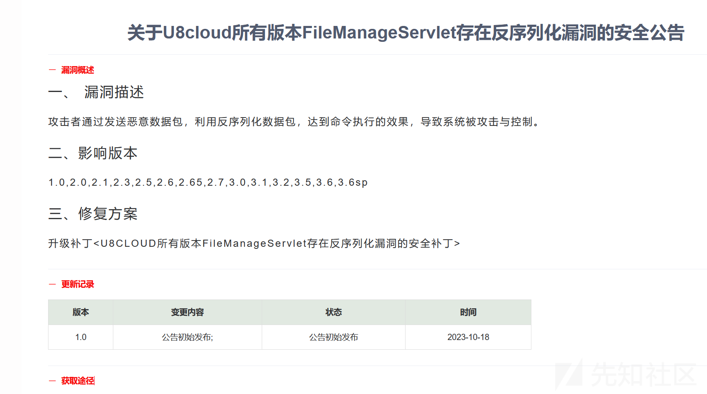

​

然后就是这个比较新的文件上传漏洞，今年4月份的，链接如下：

<https://security.yonyou.com/#/patchInfo?identifier=fac37cb5188a4c93bcf5abd0de1336e4>。

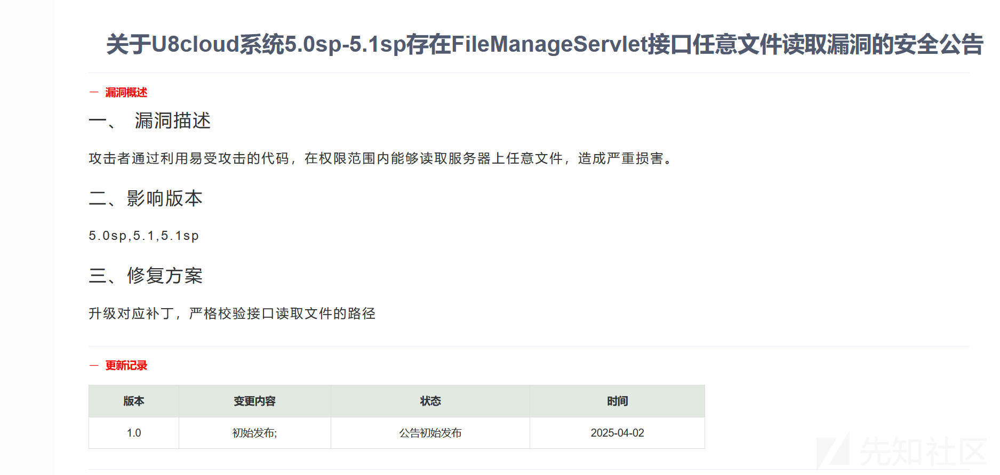

### 23年漏洞补丁分析(历史遗留的漏洞根源)

咱先来看一下这个23年的反序列化补丁吧，为啥直接看补丁呢，因为打了感觉和没打差不多呀。

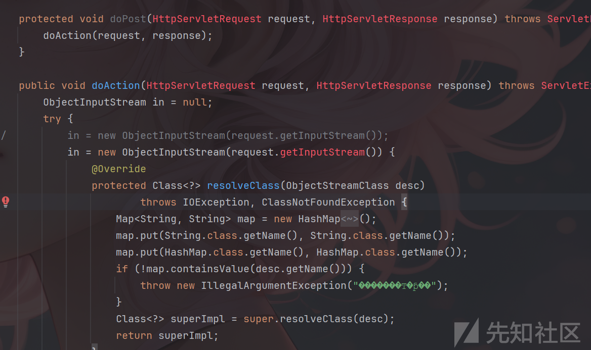

咱先看看他代码。

```
	protected void doPost(HttpServletRequest request, HttpServletResponse response) throws ServletException, IOException {
		doAction(request, response);
	}

	public void doAction(HttpServletRequest request, HttpServletResponse response) throws ServletException, IOException {
		ObjectInputStream in = null;
		try {
//			in = new ObjectInputStream(request.getInputStream());
			in = new ObjectInputStream(request.getInputStream()) {
				@Override
				protected Class<?> resolveClass(ObjectStreamClass desc)
						throws IOException, ClassNotFoundException {
					Map<String, String> map = new HashMap<String, String>();
					map.put(String.class.getName(), String.class.getName());
					map.put(HashMap.class.getName(), HashMap.class.getName());
					if (!map.containsValue(desc.getName())) {
						throw new IllegalArgumentException("�������Ͳ�ƥ��");
			        }
					Class<?> superImpl = super.resolveClass(desc);
					return superImpl;
				}
			};

			HashMap<String, String> headInfo  = (HashMap<String, String>)in.readObject();
			String dsName = headInfo.get("dsName");
			InvocationInfoProxy.getInstance().setUserDataSource(dsName);
			String oper = headInfo.get("operType");
			if ("upload".equals(oper)) {
				doUploadFile(headInfo,in,response);
			} else if ("download".equals(oper)) {
				doDownLoadFile(headInfo, response);
			}
		} catch (Exception e) {
			e.printStackTrace();
		}finally{
			if(in != null){
				in.close();
			}
		}
		

	}
```

这里漏洞点其实很明显，就是这段代码种只对传入的第一个对象进行了校验，当校验通过后就会调用`.readObject`，当然后续的版本也继承了这个校验，也就是只对序列化传入的第一个类进行校验，下文会有详细的分析，这其实也是造成这个漏洞的根本原因。

当然在复现这个漏洞的时候我并没有详细看这个漏洞的补丁，并且由于一年前刚接触代码审计水平十分有限也看不出啥东西（虽然现在也挺菜的哈哈），不过由于这里在修复后还有反序列化的点，所以当时就在想这个地方是不是可以绕过呢，这也算是埋下了一颗种子吧。

​

### 25年漏洞补丁分析(漏洞初见端倪)

咱再来看看今年爆出的这个文件读取的漏洞，其实就是从这个漏洞中感觉这里有反序列化然后挖到的。

​

先看一下有文件读取漏洞的代码吧，

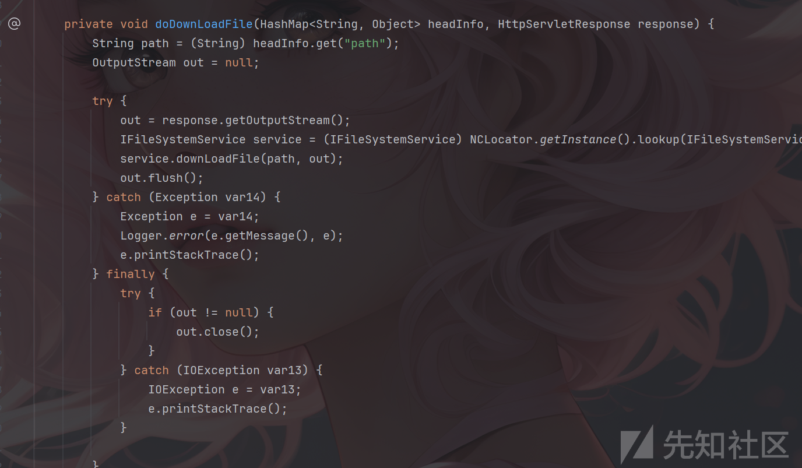

```
//
// Source code recreated from a .class file by IntelliJ IDEA
// (powered by FernFlower decompiler)
//

package nc.impl.pub.filesystem;

import java.io.FileInputStream;
import java.io.IOException;
import java.io.InputStream;
import java.io.ObjectInputStream;
import java.io.ObjectOutputStream;
import java.io.OutputStream;
import java.io.PrintWriter;
import java.util.HashMap;
import javax.servlet.ServletException;
import javax.servlet.http.HttpServlet;
import javax.servlet.http.HttpServletRequest;
import javax.servlet.http.HttpServletResponse;
import nc.bs.framework.common.InvocationInfoProxy;
import nc.bs.framework.common.NCLocator;
import nc.bs.logging.Logger;
import nc.bs.pub.filesystem.IFileSystemService;
import nc.vo.document.EleAllSysFileVO;
import nc.vo.document.FileManageVO;
import nc.vo.pub.filesystem.NCFileNode;
import sun.misc.BASE64Decoder;
import u8c.io.FilteredObjectInputStream;

public class FileManageServlet extends HttpServlet {
    private static final long serialVersionUID = -5398320771480529357L;

    public FileManageServlet() {
    }

    protected void doGet(HttpServletRequest request, HttpServletResponse response) throws ServletException, IOException {
        this.showFileInWeb0(request, response);
    }

    protected void doPost(HttpServletRequest request, HttpServletResponse response) throws ServletException, IOException {
        this.doAction(request, response);
    }

    public void doAction(HttpServletRequest request, HttpServletResponse response) throws ServletException, IOException {
        ObjectInputStream in = null;

        try {
            in = new FilteredObjectInputStream(request.getInputStream(), new Class[]{HashMap.class});
            HashMap<String, Object> headInfo = (HashMap)in.readObject();
            String dsName = (String)headInfo.get("dsName");
            InvocationInfoProxy.getInstance().setUserDataSource(dsName);
            String oper = (String)headInfo.get("operType");
            if ("upload".equals(oper)) {
                this.doUploadFile(headInfo, in, response);
            } else if ("download".equals(oper)) {
                this.doDownLoadFile(headInfo, response);
            } else if ("downloadlocal".equals(oper)) {
                this.doDownLoadFileLocal(headInfo, response);
            }
        } catch (Exception var10) {
            Exception e = var10;
            e.printStackTrace();
        } finally {
            if (in != null) {
                in.close();
            }

        }

    }

    private void showFileInWeb0(HttpServletRequest request, HttpServletResponse response) {
        String dsName = request.getParameter("dsName");
        InvocationInfoProxy.getInstance().setUserDataSource(dsName);
        String path = request.getParameter("path");

        try {
            byte[] bytes = (new BASE64Decoder()).decodeBuffer(path);
            path = new String(bytes, "GBK");
        } catch (Exception var20) {
            Exception e = var20;
            Logger.error(e.getMessage(), e);
        }

        Logger.debug("###############附件管理编码后的URL###############");
        Logger.debug(path);
        Logger.debug("###############附件管理编码后的URL###############");
        OutputStream out = null;

        try {
            int index = path.lastIndexOf(".");
            String name;
            if (index != -1) {
                name = path.substring(index + 1);
                String extContentType = MimeType.getContentType(name);
                if (extContentType != null) {
                    response.setContentType(extContentType);
                }
            }

            name = path.replace('\', '/');
            index = name.lastIndexOf("/");
            if (index != -1) {
                name = name.substring(index + 1);
            }

            name = new String(name.getBytes("GBK"), "ISO-8859-1");
            response.setHeader("Content-Disposition", "attachment;filename="" + name + """);
            response.setHeader("Cache-Control", "max-age=36000");
            out = response.getOutputStream();
            IFileSystemService service = (IFileSystemService)NCLocator.getInstance().lookup(IFileSystemService.class);
            service.showFileInWeb(path, out);
            out.flush();
        } catch (Exception var18) {
            Exception e = var18;
            Logger.error(e.getMessage(), e);
            e.printStackTrace();
            this.sendError(out, e);
        } finally {
            try {
                if (out != null) {
                    out.close();
                }
            } catch (IOException var17) {
                IOException e = var17;
                e.printStackTrace();
            }

        }

    }

    private void sendError(OutputStream out, Exception e) {
        PrintWriter pw = new PrintWriter(out);
        pw.println("发生异常:");
        e.printStackTrace(pw);
    }

    private void doDownLoadFile(HashMap<String, Object> headInfo, HttpServletResponse response) {
        String path = (String)headInfo.get("path");
        OutputStream out = null;

        try {
            out = response.getOutputStream();
            IFileSystemService service = (IFileSystemService)NCLocator.getInstance().lookup(IFileSystemService.class);
            service.downLoadFile(path, out);
            out.flush();
        } catch (Exception var14) {
            Exception e = var14;
            Logger.error(e.getMessage(), e);
            e.printStackTrace();
        } finally {
            try {
                if (out != null) {
                    out.close();
                }
            } catch (IOException var13) {
                IOException e = var13;
                e.printStackTrace();
            }

        }

    }

    private void doDownLoadFileLocal(HashMap<String, Object> headInfo, HttpServletResponse response) {
        String path = (String)headInfo.get("path");
        OutputStream out = null;
        InputStream in = null;

        try {
            out = response.getOutputStream();
            in = new FileInputStream(path);
            byte[] b = new byte[1024];

            int len;
            while((len = in.read(b)) > 0) {
                response.getOutputStream().write(b, 0, len);
            }

            out.flush();
        } catch (Exception var16) {
            Exception e = var16;
            Logger.error(e.getMessage(), e);
            e.printStackTrace();
        } finally {
            try {
                if (out != null) {
                    out.close();
                }

                if (in != null) {
                    in.close();
                }
            } catch (IOException var15) {
                IOException e = var15;
                e.printStackTrace();
            }

        }

    }

    private void doUploadFile(HashMap<String, Object> headInfo, ObjectInputStream in, HttpServletResponse response) {
        String parentPath = (String)headInfo.get("parentPath");
        String fileName = (String)headInfo.get("fileName");
        String billid = (String)headInfo.get("billid");
        String creator = (String)headInfo.get("creator");
        String fileLengthStr = (String)headInfo.get("fileLength");
        long fileLen = -1L;
        if (fileLengthStr != null) {
            try {
                fileLen = Long.parseLong(fileLengthStr.trim());
            } catch (Exception var31) {
            }
        }

        ObjectOutputStream oos = null;
        IFileSystemService service = (IFileSystemService)NCLocator.getInstance().lookup(IFileSystemService.class);

        try {
            oos = new ObjectOutputStream(response.getOutputStream());
            FileManageVO fileVO = new FileManageVO();
            fileVO.setParentPath(parentPath);
            fileVO.setBillid(billid);
            fileVO.setCreator(creator);
            fileVO.setName(fileName);
            fileVO.setIn(in);
            fileVO.setFileLength(fileLen);
            EleAllSysFileVO sysFileVO = (EleAllSysFileVO)headInfo.get("sysFileVO");
            fileVO.setSysFileVO(sysFileVO);
            NCFileNode node = service.createNewFileNodeWithStream(fileVO);
            oos.writeObject(node);
            oos.flush();
        } catch (Exception var29) {
            Exception e = var29;

            try {
                String fullPath = fileName.replace('\', '/');
                if (parentPath != null && parentPath.trim().length() > 0) {
                    parentPath = parentPath.replace('\', '/');
                    if (!parentPath.endsWith("/")) {
                        parentPath = parentPath + "/";
                    }

                    (new StringBuilder()).append(parentPath).append(fileName).toString();
                }
            } catch (Exception var28) {
                Exception e2 = var28;
                Logger.error(e2.getMessage(), e2);
            }

            Logger.error(e.getMessage(), e);
            e.printStackTrace();
            if (oos != null) {
                try {
                    oos.writeObject(e);
                } catch (IOException var27) {
                    IOException e1 = var27;
                    e1.printStackTrace();
                }
            }
        } finally {
            try {
                if (oos != null) {
                    oos.close();
                }
            } catch (IOException var26) {
                IOException e = var26;
                e.printStackTrace();
            }

        }

    }
}

```

在这段代码中，文件读取是要经过`readObject`之后才会触发的，，主要在`Hashmap`中构造`operType`，然后走到`doDownLoadFileLocal`方法中。

​

然后就是修复的代码

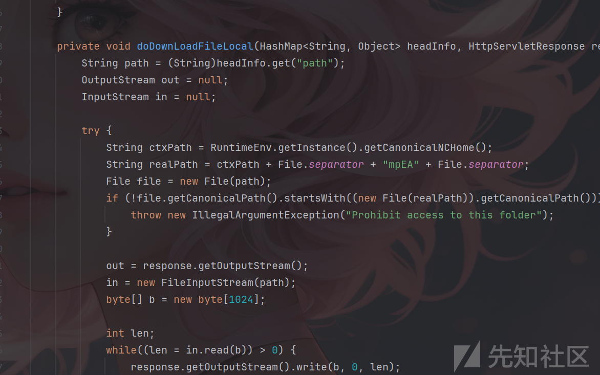

```
    private void doDownLoadFileLocal(HashMap<String, Object> headInfo, HttpServletResponse response) {
        String path = (String)headInfo.get("path");
        OutputStream out = null;
        InputStream in = null;

        try {
            String ctxPath = RuntimeEnv.getInstance().getCanonicalNCHome();
            String realPath = ctxPath + File.separator + "mpEA" + File.separator;
            File file = new File(path);
            if (!file.getCanonicalPath().startsWith((new File(realPath)).getCanonicalPath())) {
                throw new IllegalArgumentException("Prohibit access to this folder");
            }

            out = response.getOutputStream();
            in = new FileInputStream(path);
            byte[] b = new byte[1024];

            int len;
            while((len = in.read(b)) > 0) {
                response.getOutputStream().write(b, 0, len);
            }

            out.flush();
        } catch (Exception var19) {
            Exception e = var19;
            Logger.error(e.getMessage(), e);
            e.printStackTrace();
        } finally {
            try {
                if (out != null) {
                    out.close();
                }

                if (in != null) {
                    in.close();
                }
            } catch (IOException var18) {
                IOException e = var18;
                e.printStackTrace();
            }

        }

    }

```

这个补丁代码也很简单，就是限制了下载路径必须在 `${NCHome}/mpEA/` 目录下，防止了目录穿越，可以绕过这个目录穿越吗？好像不太行呀。但是看到前面的`.readObject`，还在文件读取前面，直接试试打`.readObject`反序列化，并且以前是有历史漏洞的，用友补丁打的都不太好，尝试绕一下。

​

​

## 分析并绕过waf

前面说了，用友补丁只校验了第一个序列化的类，对后面的类没有进行限制，并且后续校验的类也同样继承了这个缺点。

​

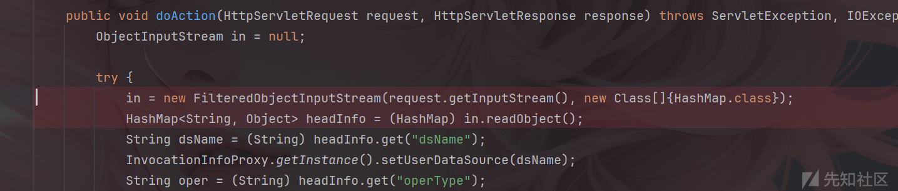

看到5.1的`doAction`，这里采用了用友自定义的一个`FilteredObjectInputStream`来进行反序列化操作，并且和之前的补丁一样还是强制转换为了`HashMap`，跟进`FilteredObjectInputStream`。

​

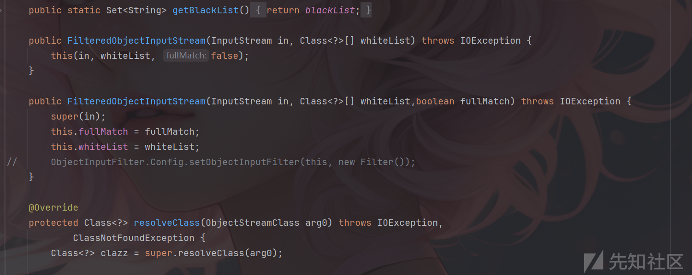

​

```
package u8c.io;

import java.io.File;
import java.io.FileInputStream;
import java.io.IOException;
import java.io.InputStream;
import java.io.ObjectInputStream;
import java.io.ObjectStreamClass;
import java.util.HashMap;
import java.util.HashSet;
import java.util.Map;
import java.util.Properties;
import java.util.Set;

import nc.bs.framework.common.RuntimeEnv;
import nc.bs.logging.Logger;
//import sun.misc.ObjectInputFilter;

/**
 * �����л��Ķ���������
 * �����ֻ��private��  �ͻ��˱���
 * @since U8C 5.0
 * @version 2022��12��27�� ����10:47:26
 * @author luojw
 * @Version 2023-12-12
 * @modifier chengxlk
 */
public class FilteredObjectInputStream extends ObjectInputStream {
	
	/** �Ƿ����˸������� */
	private boolean rootChecked = false;
	
	/**
	 * ȫƥ�䣺ָ�������з����л�Class�İ��������������Ҫ����ȫ�����Ա���������ͣ�ֻҪij���಻��ָ�������о;ܾ������л�
	 * ��ƥ�䣺ֻҪ�������ͶԾ��У���Ա�������ܣ������Map����key��value����Ҳ����
	 */
	private boolean fullMatch = false;
	/**
	 * ������
	 */
	private Class<?>[] whiteList; 
	
	/**
	 * ������
	 */
	private static Set<String> blackList;
	
	static{
		File blacks = new File(RuntimeEnv.getInstance().getNCHome(),
				"/ierp/security/unserializeBlacklist.conf");
		if(blacks.exists()){
			FileInputStream fis = null;
			try {
				Properties prop = new Properties();
				fis = new FileInputStream(blacks);
				prop.load(fis);
				Map tem1 = new HashMap(prop);
				blackList = tem1.keySet();
			} catch (Exception e) {
				Logger.error("read file error:/ierp/security/unserializeBlacklist.conf", e);
			} finally {
				if (fis != null) {
					try {
						fis.close();
					} catch (IOException e) {
						Logger.error(e);
					}
				}
			}
		}
	}
	
	public static Set<String> getBlackList(){
		return blackList;
	}
 
	public FilteredObjectInputStream(InputStream in, Class<?>[] whiteList) throws IOException {
		this(in, whiteList, false);
	}
	
	public FilteredObjectInputStream(InputStream in, Class<?>[] whiteList,boolean fullMatch) throws IOException {
		super(in);
		this.fullMatch = fullMatch;
		this.whiteList = whiteList;
//		ObjectInputFilter.Config.setObjectInputFilter(this, new Filter());
	}
	
	@Override
	protected Class<?> resolveClass(ObjectStreamClass arg0) throws IOException,
			ClassNotFoundException {
		Class<?> clazz = super.resolveClass(arg0);

		if(clazz == null) return clazz;
		//����ȫƥ���߸�������
		if(!fullMatch){
			if(blackList!=null&&blackList.size()>0&&blackList.contains(clazz.getName())){
				throw new IllegalArgumentException("####### class::" + clazz);
			}
			if(rootChecked){
				return clazz;
			}
		}
		if(whiteList!=null){
			for(Class white:whiteList){
				if(white.isAssignableFrom(clazz)){
					rootChecked =true;
					return clazz;
				}
			}
			//Ҫ�����л����಻�ڰ�������  ֱ�Ӿܾ�
			throw new IllegalArgumentException("####### class::" + clazz);
		}
		return clazz;
	
	}

	public Object readNext() throws ClassNotFoundException, IOException{
		rootChecked = false;
		return readObject();
	}

}

```

详细看一下这个类，传入的第二个参数`HashMap`会变成`whiteList`，并且会从`unserializeBlacklist.conf`中获取黑名单。

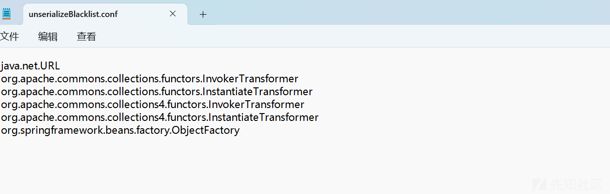

​

然后看看他黑白名单的校验规则，首先是黑名单，黑名单在任何时候都会进行校验，也就是上面截图中的黑名单不能出现在序列化函数中，由于黑名单很少，并且大多都是cc链的，因此很容易绕过。

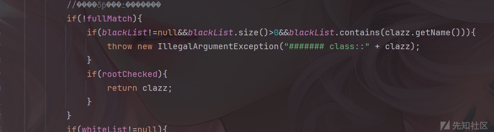

然后再看看白名单，问题其实就是出现在白名单的校验上。

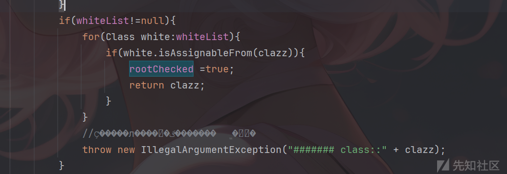

```
	protected Class<?> resolveClass(ObjectStreamClass arg0) throws IOException,
			ClassNotFoundException {
		Class<?> clazz = super.resolveClass(arg0);

		if(clazz == null) return clazz;
		if(!fullMatch){
			if(blackList!=null&&blackList.size()>0&&blackList.contains(clazz.getName())){
				throw new IllegalArgumentException("####### class::" + clazz);
			}
			if(rootChecked){
				return clazz;
			}
		}
		if(whiteList!=null){
			for(Class white:whiteList){
				if(white.isAssignableFrom(clazz)){
					rootChecked =true;
					return clazz;
				}
			}
			throw new IllegalArgumentException("####### class::" + clazz);
		}
		return clazz;
	
	}

```

​

仔细看看代码，发现白名单只要`white.isAssignableFrom(clazz)`匹配成功一次，就会直接`return`，从而结束整个校验逻辑，也就是之前分析补丁的时候说的值校验第一个类。

​

这里给的白名单还是`HashMap`，并且由于黑名单ban的类也不多因此很容易就可以绕过了，链子用`POJOjackson`还有很多链都是可以的。

​

# 验证漏洞

​

这里我用的是pojo改的，最后一个类用HashMap就行。

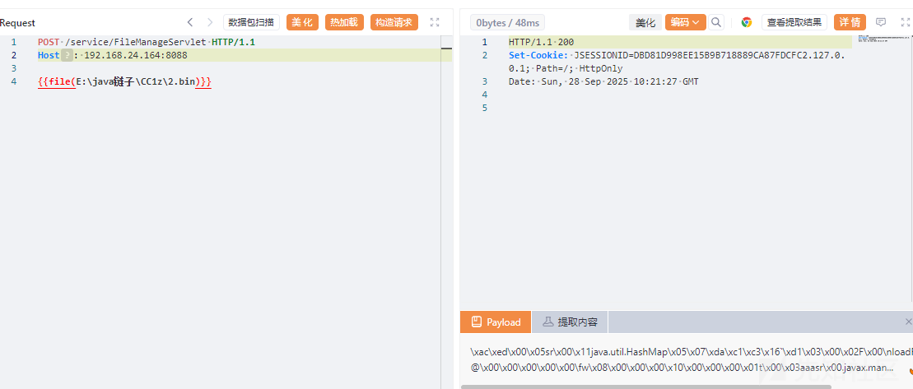

成功弹出计算器。

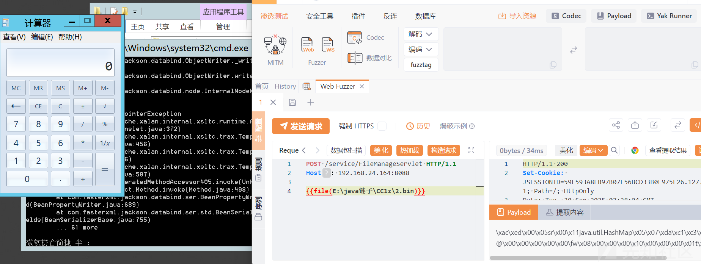

# 总结

最后的最后，我还是要吐槽一下，太伤心了，我的day啊
