# 解密利器：破解SSH加密会话的终极指南！-先知社区

> **来源**: https://xz.aliyun.com/news/19098  
> **文章ID**: 19098

---

## 概述

SSH（Secure Shell）协议，想必大家都不陌生。作为计算机之间加密通信的标杆，SSH广泛应用于远程登录、文件传输、运维自动化等场景。它由芬兰学者Tatu Ylönen于1995年设计推出，通过加密登录信息，极大提升了网络安全，成为Linux系统的标准配置，也被全球广泛采用。

然而，在日常使用SSH时，你是否也曾像笔者一样疑惑：

* 如何从数据包角度判断SSH登录是否成功？
* SSH通信数据包究竟能否被解密？
* 解密后的数据包内容是什么样的？
* 网络中有没有公开的SSH解密工具呢？

为了解开这些谜团，笔者查阅了大量的资料，发现网络中关于SSH解密的文章其实很少，详细剖析SSH加密会话的文章基本没有。

所以，笔者就参考了部分网络资料，进行了一系列深入研究验证，最终成功破解了SSH通信数据包的解密过程。

在本篇文章中，笔者将带着大家一步步揭开SSH协议的神秘面纱，探索密钥提取与会话解密的硬核技术！

## SSH协议通信原理

在对SSH加密会话进行深度剖析前，笔者先提一个问题：当你拿到SSH通信数据包并对其进行分析时，能否识别出SSH协议的各个通信阶段及原理？

在没研究SSH协议前，笔者面对此问题是完全懵的，因为那会分析SSH通信数据包，只是通过会话载荷大小来对比确认SSH登录是否成功。。。

在研究SSH协议后，笔者认为：掌握SSH通信的每个环节，不仅能帮助我们深入理解其加密机制，还为解密会话奠定了关键基础。

接下来，让我们先拆解SSH协议的通信原理，揭开数据包背后的秘密，为破解SSH会话做好准备！

### SSH是如何工作的？

为了深入理解SSH的工作机制，基于网络资料，笔者将SSH协议的工作流程简化为以下几个关键阶段：

* **连接建立**：SSH客户端向服务器指定端口（默认22）发起TCP连接请求，建立可靠的通信通道。
* **版本协商**：客户端与服务器交换支持的SSH版本信息，协商确定最终使用的版本号。
* **算法协商**：双方确定密钥交换、加密、签名和数据完整性保护（HMAC）等算法的具体选择。
* **密钥交换**：通过协商生成共享的会话密钥和会话ID，建立加密通信通道。
* **用户认证**：支持密码认证（客户端加密密码，服务器验证）或密钥认证（客户端用私钥签名，服务器用公钥验证，安全性更高）。
* **会话请求**：客户端向服务器请求特定服务（如远程 shell 或文件传输），服务器响应并建立会话。
* **会话交互**：双方使用会话密钥对数据进行加解密，实现安全通信。

网络中关于SSH协议的工作流程图如下：

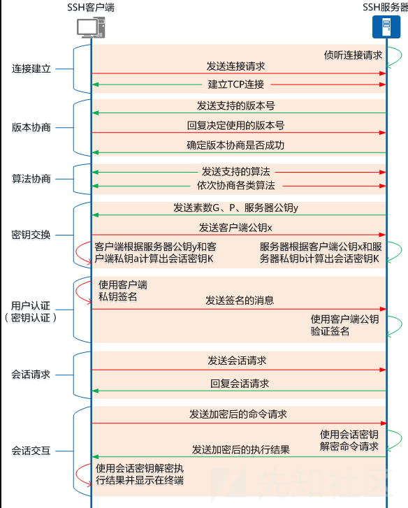

### SSH数据包剖析

刚才我们从原理上对SSH协议进行了梳理，接下来我们基于SSH协议的工作流程对SSH数据包进行详细剖析。

在这里，我们直接使用ssh命令构建了SSH通信，抓取了SSH协议通信数据包，相关截图如下：

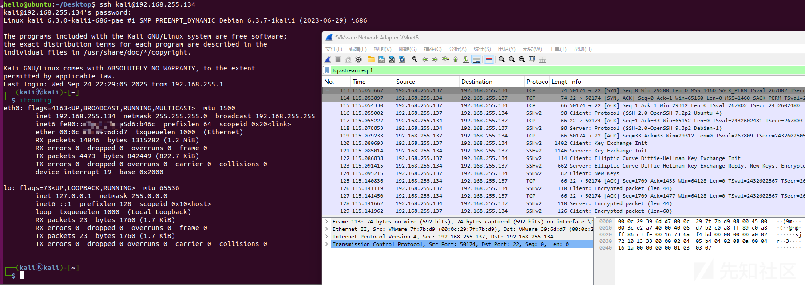

接下来，我们就对SSH协议通信数据包进行详细的剖析（备注：WireShark中过滤ssh即可）：

#### 版本协商

基于版本信息，我们可以提取如下信息：

* Client端：

* 操作系统：Ubuntu
* SSH 版本：SSH-2.0
* SSH 实现：OpenSSH，版本为OpenSSH\_7.2p2

* Server端：

* 操作系统：Debian
* SSH版本：SSH2.0
* SSH实现：OpenSSH，版本为OpenSSH\_9.3p2

相关数据包截图如下：

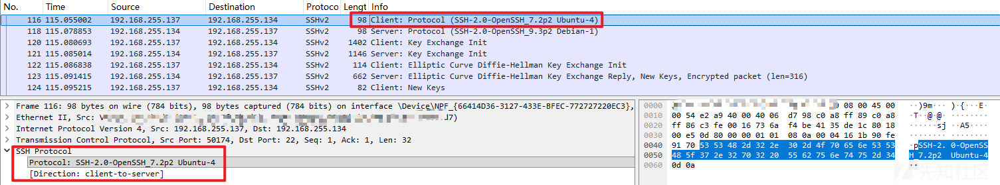

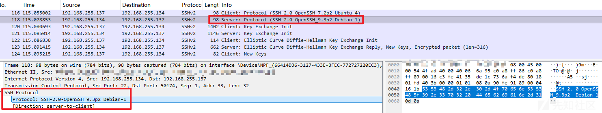

#### 算法协商

基于算法协商过程，提取信息如下：

* 不同主机支持的各类算法是不一样的，最终协商结果为：

* encryption：`chacha20-poly1305@openssh.com`
* mac：
* compression：none

* Client端：SSH消息为：Key Exchange Init (20)

* kex\_algorithms（密钥交换算法）：`curve25519-sha256@libssh.org,ecdh-sha2-nistp256,ecdh-sha2-nistp384,ecdh-sha2-nistp521,diffie-hellman-group-exchange-sha256,diffie-hellman-group-exchange-sha1,diffie-hellman-group14-sha1,ext-info-c`
* server\_host\_key\_algorithms（服务器主机密钥算法）：`ecdsa-sha2-nistp256-cert-v01@openssh.com,ecdsa-sha2-nistp384-cert-v01@openssh.com,ecdsa-sha2-nistp521-cert-v01@openssh.com,ssh-ed25519-cert-v01@openssh.com,ssh-rsa-cert-v01@openssh.com,ecdsa-sha2-nistp256,ecdsa-sha2-nistp384,ecdsa-sha2-nistp521,ssh-ed25519,rsa-sha2-512,rsa-sha2-256,ssh-rsa`
* encryption\_algorithms\_client\_to\_server（加密算法）：`chacha20-poly1305@openssh.com,aes128-ctr,aes192-ctr,aes256-ctr,aes128-gcm@openssh.com,aes256-gcm@openssh.com,aes128-cbc,aes192-cbc,aes256-cbc,3des-cbc`
* encryption\_algorithms\_server\_to\_client（加密算法）：`chacha20-poly1305@openssh.com,aes128-ctr,aes192-ctr,aes256-ctr,aes128-gcm@openssh.com,aes256-gcm@openssh.com,aes128-cbc,aes192-cbc,aes256-cbc,3des-cbc`
* mac\_algorithms\_client\_to\_server（消息认证码算法）：`umac-64-etm@openssh.com,umac-128-etm@openssh.com,hmac-sha2-256-etm@openssh.com,hmac-sha2-512-etm@openssh.com,hmac-sha1-etm@openssh.com,umac-64@openssh.com,umac-128@openssh.com,hmac-sha2-256,hma`
* mac\_algorithms\_server\_to\_client（消息认证码算法）：`umac-64-etm@openssh.com,umac-128-etm@openssh.com,hmac-sha2-256-etm@openssh.com,hmac-sha2-512-etm@openssh.com,hmac-sha1-etm@openssh.com,umac-64@openssh.com,umac-128@openssh.com,hmac-sha2-256,hma`
* compression\_algorithms\_client\_to\_server（数据压缩算法）：`none,zlib@openssh.com,zlib`
* compression\_algorithms\_server\_to\_client（数据压缩算法）：`none,zlib@openssh.com,zlib`

* Server端：SSH消息为：Key Exchange Init (20)

* kex\_algorithms（密钥交换算法）：`sntrup761x25519-sha512@openssh.com,curve25519-sha256,curve25519-sha256@libssh.org,ecdh-sha2-nistp256,ecdh-sha2-nistp384,ecdh-sha2-nistp521,diffie-hellman-group-exchange-sha256,diffie-hellman-group16-sha512,diff`
* server\_host\_key\_algorithms（服务器主机密钥算法）：`rsa-sha2-512,rsa-sha2-256,ecdsa-sha2-nistp256,ssh-ed25519`
* encryption\_algorithms\_client\_to\_server（加密算法）：`chacha20-poly1305@openssh.com,aes128-ctr,aes192-ctr,aes256-ctr,aes128-gcm@openssh.com,aes256-gcm@openssh.com`
* encryption\_algorithms\_server\_to\_client（加密算法）：`chacha20-poly1305@openssh.com,aes128-ctr,aes192-ctr,aes256-ctr,aes128-gcm@openssh.com,aes256-gcm@openssh.com`
* mac\_algorithms\_client\_to\_server（消息认证码算法）：`umac-64-etm@openssh.com,umac-128-etm@openssh.com,hmac-sha2-256-etm@openssh.com,hmac-sha2-512-etm@openssh.com,hmac-sha1-etm@openssh.com,umac-64@openssh.com,umac-128@openssh.com,hmac-sha2-256,hma`
* mac\_algorithms\_server\_to\_client（消息认证码算法）：`umac-64-etm@openssh.com,umac-128-etm@openssh.com,hmac-sha2-256-etm@openssh.com,hmac-sha2-512-etm@openssh.com,hmac-sha1-etm@openssh.com,umac-64@openssh.com,umac-128@openssh.com,hmac-sha2-256,hma`
* compression\_algorithms\_client\_to\_server（数据压缩算法）：`none,zlib@openssh.com`
* compression\_algorithms\_server\_to\_client（数据压缩算法）：`none,zlib@openssh.com`

相关数据包截图如下：

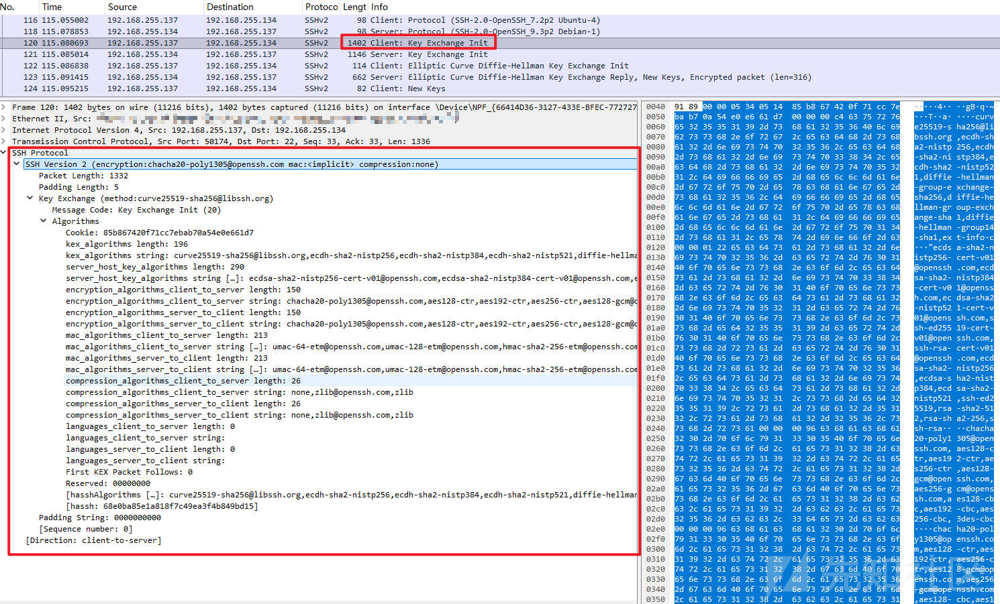

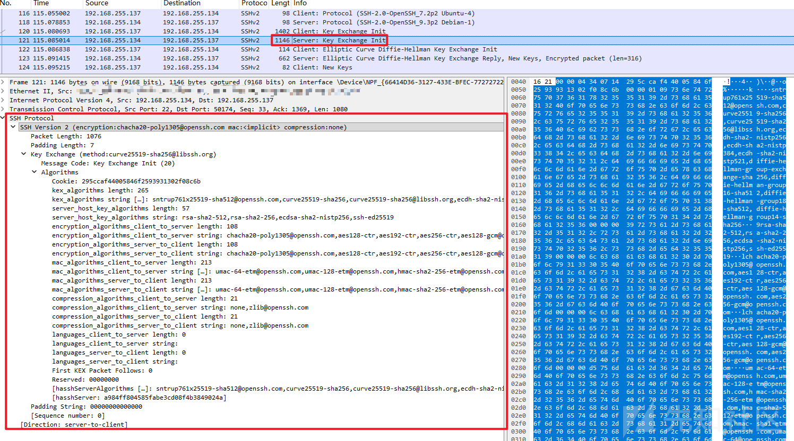

#### 密钥交换

基于密钥交换过程，提取信息如下：

* SSH协议使用Diffie-Hellman算法进行密钥交换
* Client端中包含一段SSH通信载荷

* 第一段SSH通信载荷：使用`curve25519-sha256@libssh.org`算法进行密钥交换，SSH消息为：Elliptic Curve Diffie-Hellman Key Exchange Init (30)

* Server端中包含三段SSH通信载荷

* 第一段SSH通信载荷：使用`curve25519-sha256@libssh.org`算法进行密钥交换，SSH消息为：Elliptic Curve Diffie-Hellman Key Exchange Reply (31)
* 第二段SSH通信载荷：SSH消息为：New Keys (21)，表示密钥交换成功
* 第三段SSH通信载荷：加密数据

* Client中包含一段SSH通信载荷

* 第一段SSH通信载荷：SSH消息为：New Keys (21)，表示密钥交换成功

相关数据包截图如下：

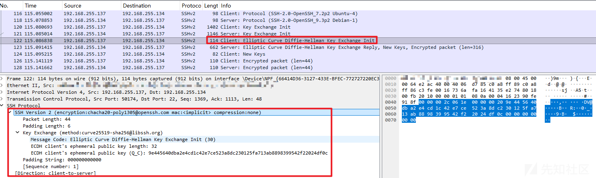

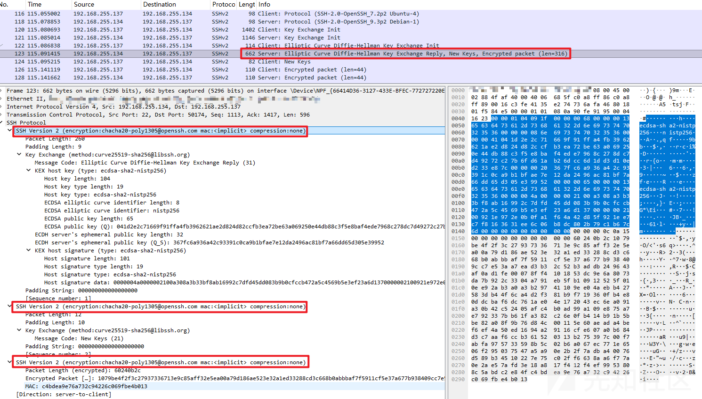

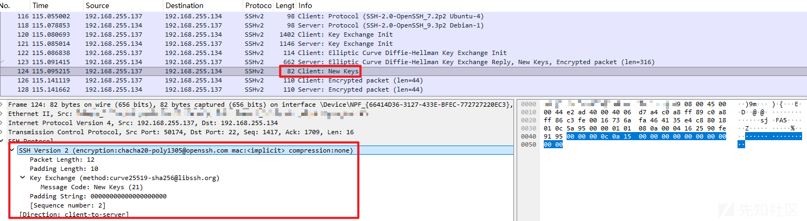

#### 用户认证、会话请求、会话交互

由于Client端与Server端已成功进行密钥交换，生成会话密钥，因此，后续用户认证、会话请求、会话交互过程均以加密数据形式进行呈现。

加密通信使用的算法为：

* encryption：`chacha20-poly1305@openssh.com`
* mac：
* compression：none

相关数据包截图如下：

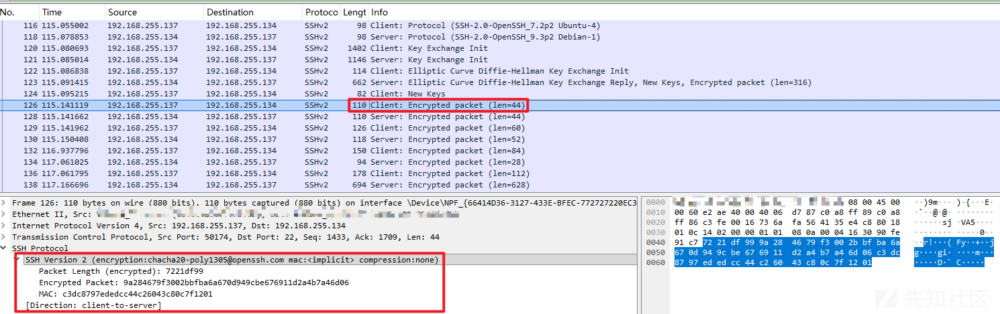

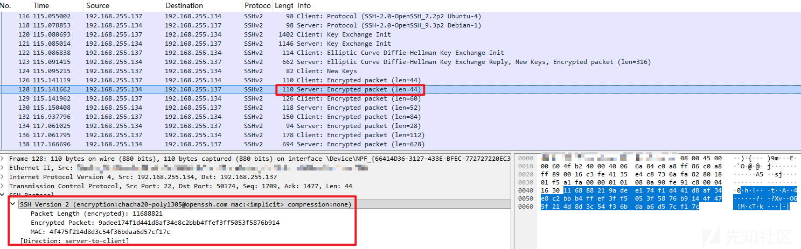

## SSH会话解密思考

通过对SSH协议通信原理进行剖析，我们可知：

* Ubuntu和Debian操作系统的SSH实现使用的是OpenSSH
* SSH通信会话大致可以拆分为两段：生成会话密钥、使用会话密钥进行加密通信

因此，为了实现SSH加密会话的通信数据解密，我们需要从如下角度进行研究：

* 获取OpenSSH通信的会话密钥
* 利用会话密钥对SSH加密数据进行解密

基于维基百科对于OpenSSH的介绍，我们可知，OpenSSH是大量操作系统的默认组件，Ubuntu、CentOS、Debian、Kali等常见操作系统均使用的OpenSSH作为SSH服务，因此，基于此思路的实现可对大多数操作系统的SSH通信进行解密。

维基百科介绍如下：

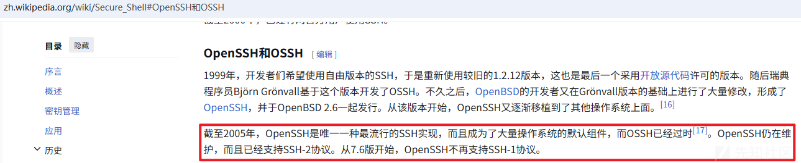

## OpenSSH会话密钥提取

为了实现SSH会话密钥的提取，笔者基于网络资料发现OpenSSH-Session-Key-Recovery（`https://github.com/fox-it/OpenSSH-Session-Key-Recovery`）开源项目可实现此功能，同时Decrypting OpenSSH sessions for fun and profit（`https://blog.fox-it.com/2020/11/11/decrypting-openssh-sessions-for-fun-and-profit/`）博客文章对其原理进行了详细的描述。

OpenSSH-Session-Key-Recovery项目截图如下：

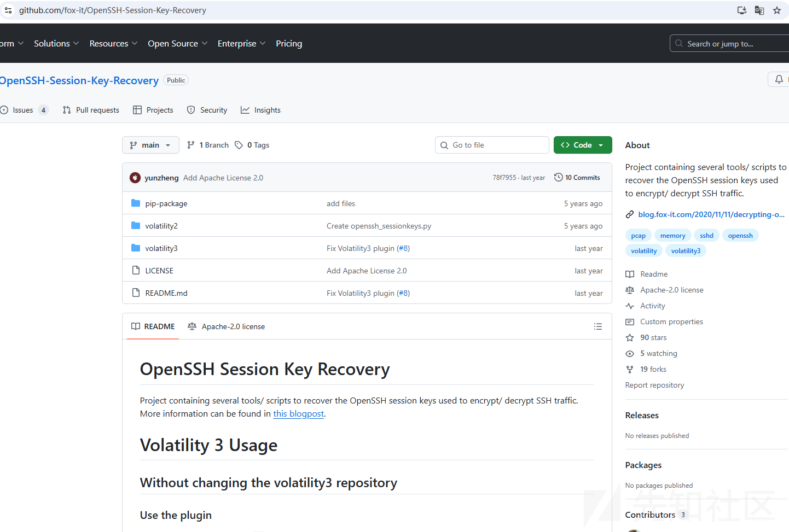

### 工具使用

OpenSSH-Session-Key-Recovery工具的使用比较简单，只需要安装对应的python库后，即可正常使用。

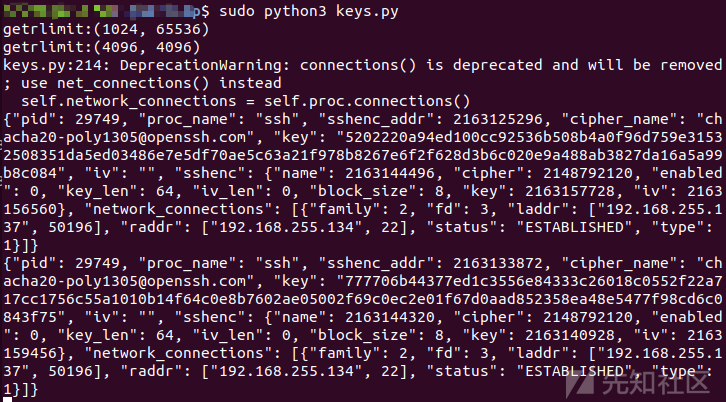

输出结果案例如下：

```
{"pid": 29749, "proc_name": "ssh", "sshenc_addr": 2163125296, "cipher_name": "chacha20-poly1305@openssh.com", "key": "5202220a94ed100cc92536b508b4a0f96d759e31532508351da5ed03486e7e5df70ae5c63a21f978b8267e6f2f628d3b6c020e9a488ab3827da16a5a99b8c084", "iv": "", "sshenc": {"name": 2163144496, "cipher": 2148792120, "enabled": 0, "key_len": 64, "iv_len": 0, "block_size": 8, "key": 2163157728, "iv": 2163156560}, "network_connections": [{"family": 2, "fd": 3, "laddr": ["192.168.255.137", 50196], "raddr": ["192.168.255.134", 22], "status": "ESTABLISHED", "type": 1}]}
{"pid": 29749, "proc_name": "ssh", "sshenc_addr": 2163133872, "cipher_name": "chacha20-poly1305@openssh.com", "key": "777706b44377ed1c3556e84333c26018c0552f22a717cc1756c55a1010b14f64c0e8b7602ae05002f69c0ec2e01f67d0aad852358ea48e5477f98cd6c0843f75", "iv": "", "sshenc": {"name": 2163144320, "cipher": 2148792120, "enabled": 0, "key_len": 64, "iv_len": 0, "block_size": 8, "key": 2163140928, "iv": 2163159456}, "network_connections": [{"family": 2, "fd": 3, "laddr": ["192.168.255.137", 50196], "raddr": ["192.168.255.134", 22], "status": "ESTABLISHED", "type": 1}]}
```

对输出结果进行分析，输出结果中包含两段sshenc结构体数据，分别对应于SSH通信Client端、Server端，sshenc结构体数据中包含了SSH通信最终协商使用的加密算法、key值、IV值信息等。

### 工具原理

通过对博客文章和工具脚本内容进行研究，发现此工具的实现原理其实也比较简单：**使用python脚本在ssh、sshd进程堆栈中匹配sshenc结构体数据，然后从sshenc结构体数据中提取key、iv值等数据**，相关截图如下：

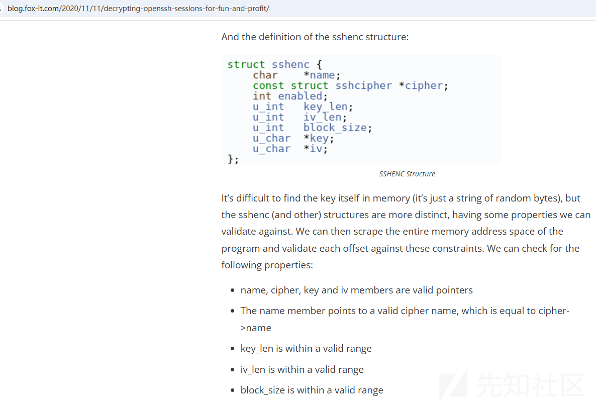

尝试在Github上查看openssh源码（`https://github.com/openssh/openssh-portable`），发现openssh最新版本（V\_10\_0\_P2）的源码中依然存在此结构体，相关截图如下：

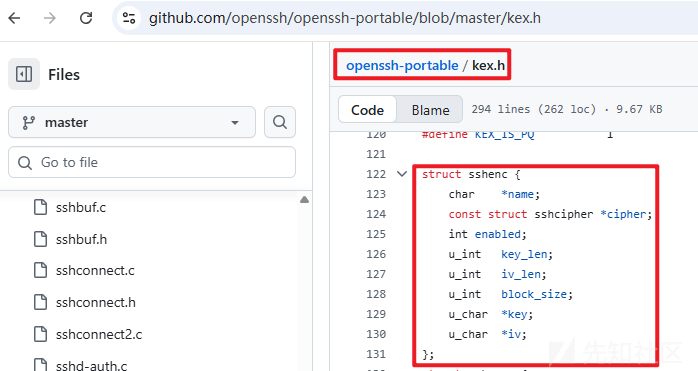

### 工具使用缺陷

为了深入剖析SSH会话解密流程，笔者对OpenSSH-Session-Key-Recovery工具进行了详细的对比使用，使用过程中发现OpenSSH-Session-Key-Recovery工具存在部分使用缺陷，梳理如下：

* 若最终协商的加密算法为流加密算法（例如：aes256-ctr、aes192-ctr、aes128-ctr、aes256-cbc、aes192-cbc、aes128-cbc、des3-cbc、blowfish-cbc、cast128-cbc、arcfour256、arcfour128、arcfour），则SSH通信会配套使用HMAC算法，但OpenSSH-Session-Key-Recovery工具只提取了加密算法的密钥信息，未提取HMAC算法的密钥信息。

例如：以下SSH通信使用的加密算法：`encryption:aes256-ctr mac:umac-64-etm@openssh.com compression:none`

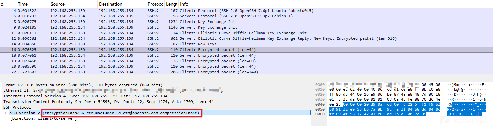

* OpenSSH-Session-Key-Recovery工具脚本中只内置了ssh、sshd进程名，而目前OpenSSH的最新版本为OpenSSH\_10.0p2，对应进程名为sshd-session

此缺陷可直接在工具脚本中增加其他进程名即可解决，相关工具脚本代码截图如下：

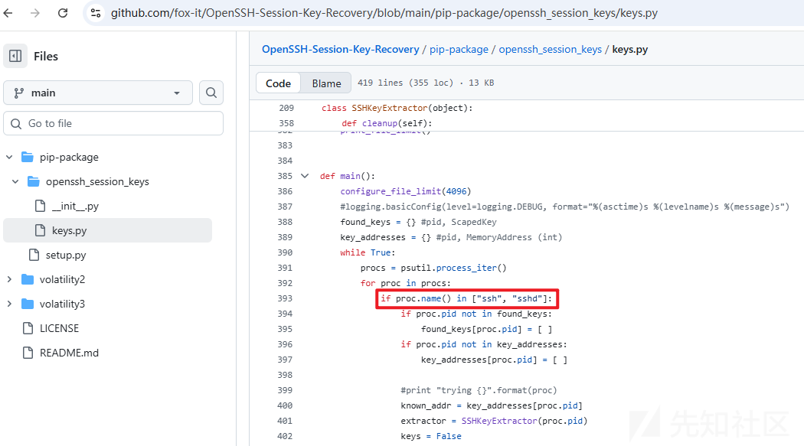

## 手动提取会话密钥

为了能够更直观的理解密钥提取过程和便于从内存中提取其他数据结构，笔者尝试通过手动方式对密钥提取过程进行了复现，复现结果与工具执行结果相同。

为了更好的验证OpenSSH-Session-Key-Recovery工具中的实现思路是否支持最新版本的OpenSSH，笔者选择了OpenSSH的最新版本OpenSSH\_10.0p2作为测试案例，直接使用`ssh kali@192.168.255.134`命令构建SSH通信。

### 提取堆栈数据

为了实现手动提取堆栈数据的效果，我们可直接使用GDB附加sshd-session进程，然后从sshd-session进程中提取堆栈数据。

执行流程如下：

* GDB附加进程：`sudo gdb attach 进程PID`
* 查找堆栈地址：`info proc mappings`
* DUMP堆栈内存：`dump memory heapdump 堆栈首地址 堆栈尾地址`

相关截图如下：

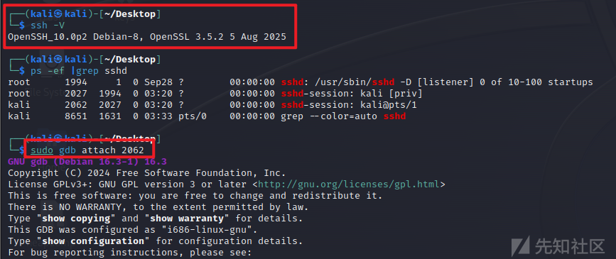

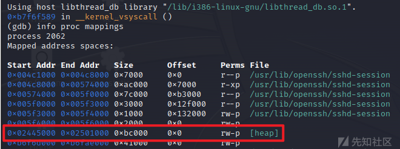

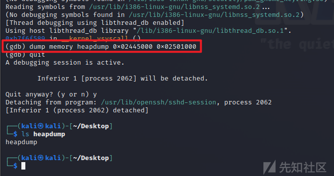

### 提取密钥数据

使用二进制编辑工具可直接查看堆栈数据，通过技术手法可定位至sshenc结构体地址，相关二进制截图如下：

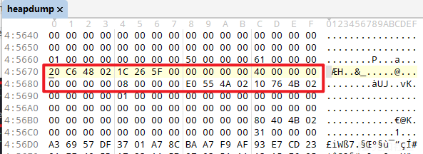

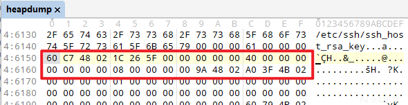

提取内存中第一个sshenc结构体信息如下：

* 堆栈首地址：0x02445000
* sshenc结构体地址：0x02445000 + 0x45670 = 0x248A670
* sshenc结构体数据：

* char \*name：0x248C620，转换为heapdump文件中的偏移：0x248C620 - 0x2445000 = 0x47620
* Cipher \*cipher：0x5f261c
* int enabled：0
* u\_int key\_len：0x40
* u\_int iv\_len：0
* u\_int block\_size：0x08
* u\_char \*key：0x24A55E0，转换为heapdump文件中的偏移：0x24A55E0 - 0x2445000 = 0x605E0
* u\_char \*iv：0x24B7610，转换为heapdump文件中的偏移：0x24B7610 - 0x2445000 = 0x72610

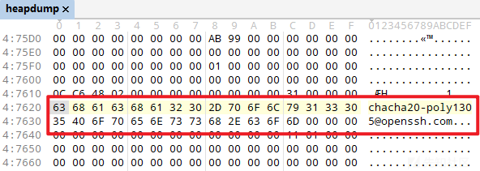

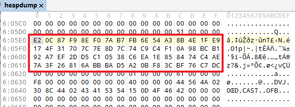

提取内存中第二个sshenc结构体信息如下：

* 堆栈首地址：0x02445000
* sshenc结构体地址：0x02445000 + 0x46150 = 0x248B150
* sshenc结构体数据：

* char \*name：0x248C760，转换为heapdump文件中的偏移：0x248C760 - 0x2445000 = 0x47760
* Cipher \*cipher：0x5F261C
* int enabled：0
* u\_int key\_len：0x40
* u\_int iv\_len：0
* u\_int block\_size：0x08
* u\_char \*key：0x2489A00，转换为heapdump文件中的偏移：0x2489A00 - 0x2445000 = 0x44A00
* u\_char \*iv：0x24B3FA0，转换为heapdump文件中的偏移：0x24B3FA0 - 0x2445000 = 0x6EFA0

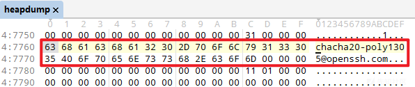

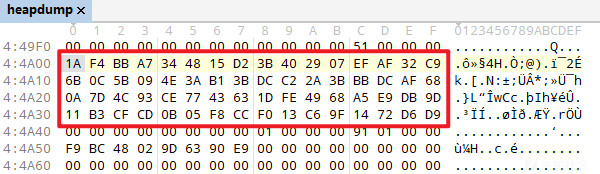

对比OpenSSH-Session-Key-Recovery工具运行效果，发现提取的密钥信息相同。

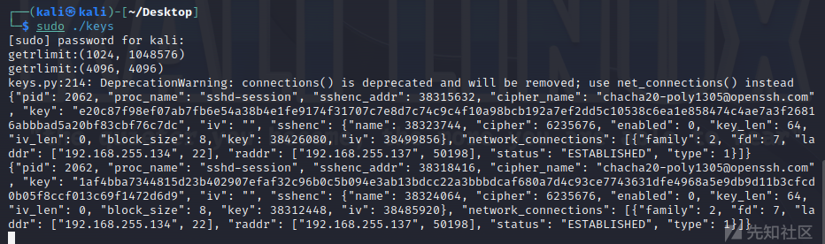

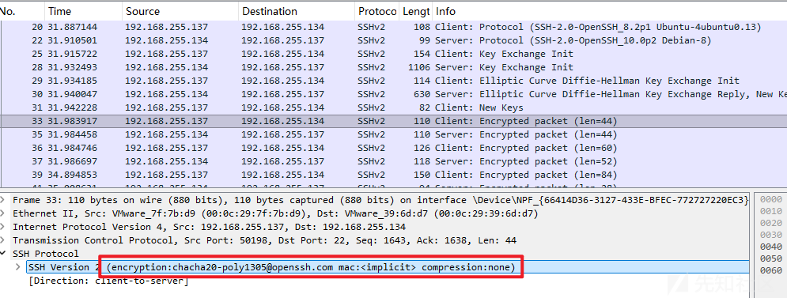

### 辅助脚本实现

基于上述手动提取密钥数据的原理，笔者尝试编写了一个辅助脚本，可自动化的从堆栈内存中提取SSH会话密钥。

脚本运行效果如下：

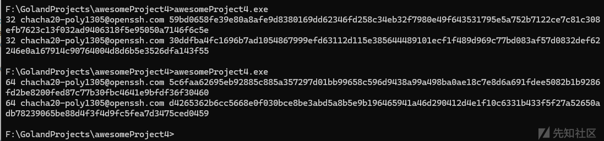

脚本内容如下：

```
package main

import (
    "bytes"
    "encoding/binary"
    "encoding/hex"
    "fmt"
    "io/ioutil"
)

func main() {
    heapaddr_start := 0x000055e4b2718000
    filename := "C:\Users\admin\Desktop\heapdump_64"
    if heapaddr_start < 0xffffffff {
        GetSessionKey(uint32(heapaddr_start), filename)
    } else {
        GetSessionKey(uint64(heapaddr_start), filename)
    }
}

// struct Enc {
// char    *name;
// Cipher  *cipher;
// int enabled;
// u_int   key_len;
// u_int   iv_len;
// u_int   block_size;
// u_char  *key;
// u_char  *iv;
// };

func GetSessionKey[T uint32 | uint64](heapaddr_start T, filename string) {
    type sshenc struct {
        Name       T
        Cipher     T
        Enabled    uint32
        Key_len    uint32
        IV_len     uint32
        Block_size uint32
        Key        T
        IV         T
    }

    heapdata, _ := ioutil.ReadFile(filename)
    file_curr := 0
    sshenc_size := 0

    switch any(heapaddr_start).(type) {
    case uint32:
        sshenc_size = 32
    case uint64:
        sshenc_size = 48
    }

    heapaddr_end := heapaddr_start + T(len(heapdata))

    for {
        if file_curr+sshenc_size > len(heapdata) {
            break
        }

        var enc sshenc
        tmpdata := heapdata[file_curr : file_curr+sshenc_size]
        err := binary.Read(bytes.NewReader(tmpdata), binary.LittleEndian, &enc)
        if err != nil {
            return
        }

        if enc.Name > heapaddr_start && enc.Name < heapaddr_end {
            name := ExtractFirstNullTerminatedString(heapdata[enc.Name-heapaddr_start : enc.Name-heapaddr_start+30])
            labels := []string{
                "3des-cbc", "blowfish-cbc", "cast128-cbc", "arcfour", "arcfour128", "arcfour256",
                "aes128-cbc", "aes192-cbc", "aes256-cbc", "rijndael-cbc@lysator.liu.se",
                "aes128-ctr", "aes192-ctr", "aes256-ctr",
                "aes128-gcm@openssh.com", "aes256-gcm@openssh.com", "chacha20-poly1305@openssh.com",
            }
            if InStringSlice(labels, name) {
                if enc.Key > heapaddr_start && enc.Key < heapaddr_end &&
                    enc.IV > heapaddr_start && enc.IV < heapaddr_end {
                    Keys := heapdata[enc.Key-heapaddr_start : enc.Key-heapaddr_start+T(enc.Key_len)]
                    IVs := heapdata[enc.IV-heapaddr_start : enc.IV-heapaddr_start+T(enc.IV_len)]
                    fmt.Println(fmt.Sprintf("%T", heapaddr_start)[4:], name, hex.EncodeToString(Keys), hex.EncodeToString(IVs))
                }
            }
        }
        file_curr += 4
    }
}

func InStringSlice(slice []string, target string) bool {
    for _, s := range slice {
        if s == target {
            return true
        }
    }
    return false
}

func ExtractFirstNullTerminatedString(data []byte) string {
    idx := bytes.IndexByte(data, 0)
    if idx == -1 {
        return string(data)
    }
    return string(data[:idx])
}
```

## SSH通信会话解密

基于上述SSH会话密钥的提取方法，我们可成功提取SSH通信中使用的加密密钥。

接下来，我们将基于上述“SSH会话解密思考”中的思路，尝试利用会话密钥对SSH加密数据进行解密。

为了实现SSH会话密钥的提取，笔者基于网络资料发现OpenSSH-Network-Parser（`https://github.com/fox-it/OpenSSH-Network-Parser`）开源项目可实现此功能。

OpenSSH-Network-Parser项目截图如下：

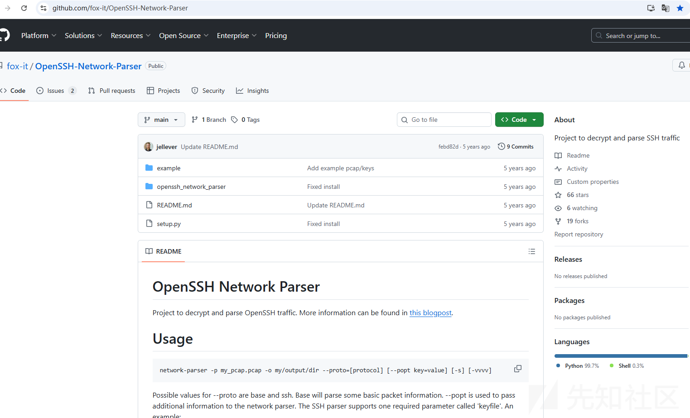

### 工具使用

使用OpenSSH-Network-Parser工具前，需要安装指定的python库，由于此工具使用的是python2运行，因此在安装python库时可能会出现一些异常，不过可以参考setup.py脚本的python库要求进行手动安装，可以便于对安装过程中出现的异常进行逐一排查解决。

setup.py脚本截图如下：

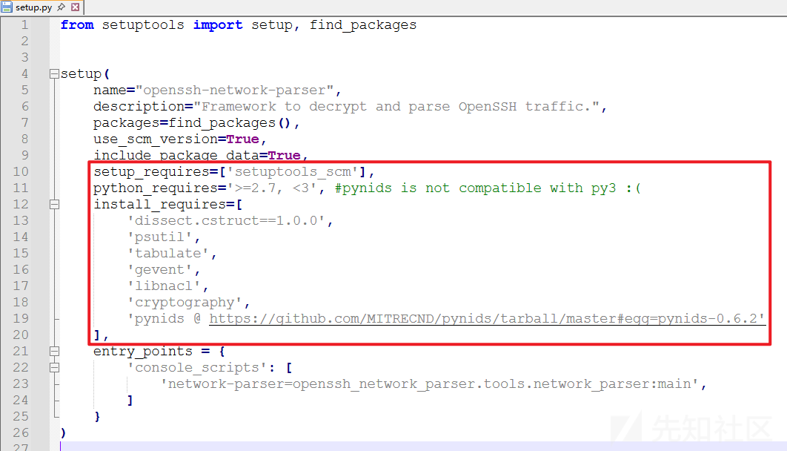

OpenSSH-Network-Parser工具使用截图如下（脚本会自动化提取SSH账号密码及通信数据）：

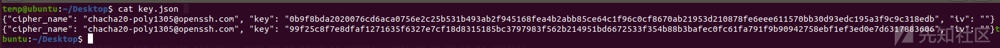

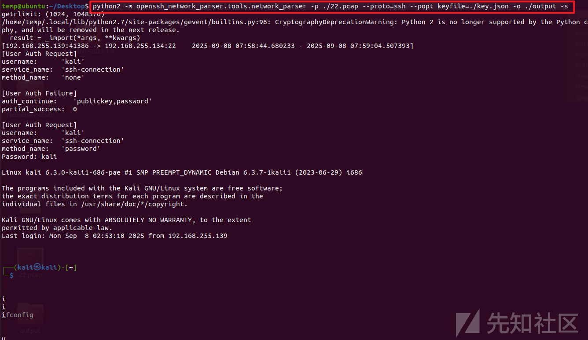

可添加`-v参数`查看解密过程，相关截图如下：

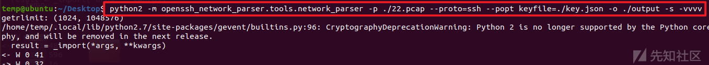

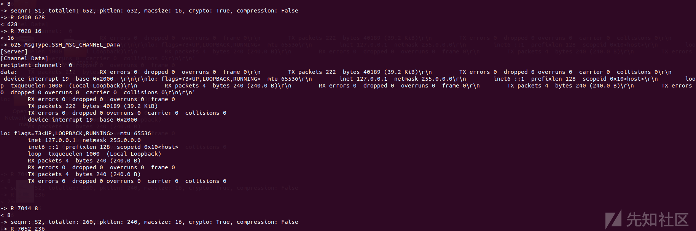

### 工具原理

通过对工具脚本内容进行研究，梳理此工具原理如下：

* 解析pcap数据包，提取SSH数据包载荷；
* 解析SSH数据包载荷，当SSH消息为`New Keys`时，则从key.json文件中提取密钥数据；
* 简单进行解密尝试，识别两段密钥的所属端侧：Client端、Server端；
* 后续通信数据均使用key.json文件中的密钥数据进行解密；

关键函数代码截图如下：

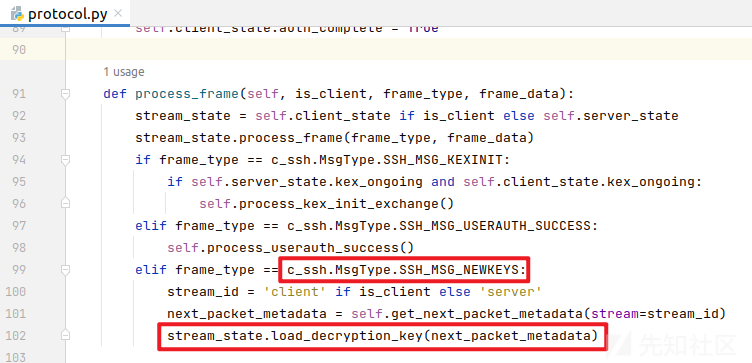

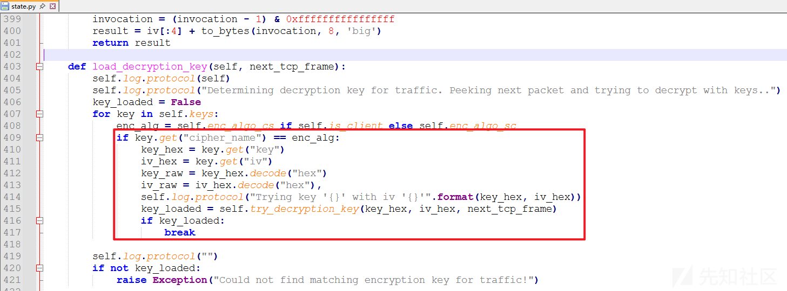

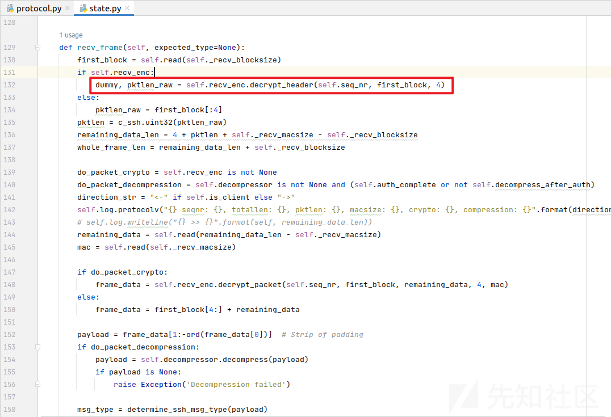

### 工具使用缺陷

为了详细研究SSH会话解密，笔者对OpenSSH-Network-Parser工具的使用效果进行了详细的对比和研究，使用过程中发现OpenSSH-Network-Parser工具与OpenSSH-Session-Key-Recovery工具一样，存在部分使用缺陷，梳理如下：

* 不支持HMAC算法的解密

在OpenSSH-Session-Key-Recovery工具的使用过程中，笔者提到：若SSH通信最终协商的加密算法为流加密算法（例如：aes256-ctr、aes192-ctr、aes128-ctr、aes256-cbc、aes192-cbc、aes128-cbc、des3-cbc、blowfish-cbc、cast128-cbc、arcfour256、arcfour128、arcfour），则SSH通信会配套使用HMAC算法，但OpenSSH-Session-Key-Recovery工具未提取HMAC算法的密钥信息。

在对OpenSSH-Network-Parser工具的剖析过程中，笔者发现，其实此工具是存在HMAC算法实现代码的。因此，笔者尝试修改了此工具代码，并手动提取了HMAC算法密钥并将其内置于工具代码中，在尝试解密SSH会话数据的过程中，笔者发现此工具运行后依然会报错。

好吧，可能这就是工具作者未实现此配套算法解密逻辑的原因吧。。。。

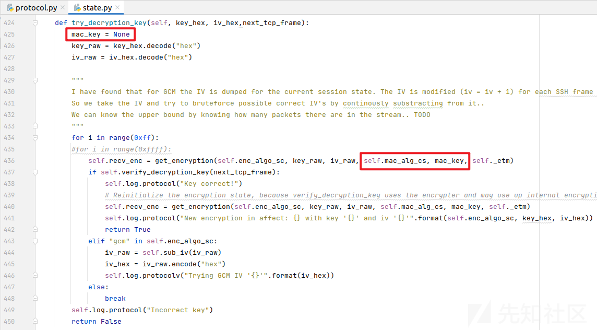

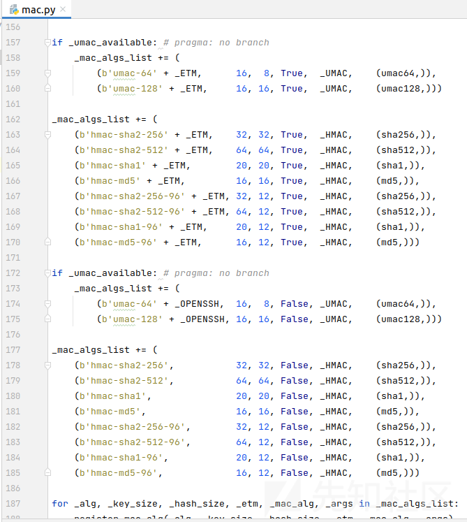

* 无法很清晰的提取并了解从数据包层再到解密后数据的转变过程

笔者在研究过程中，其实主要是为了想详细了解SSH会话解密原理及解密过程的，虽然使用此工具可直接对SSH通信会话数据进行解密，但在整个解密过程中，不采用调试手段的话，我们是不清楚解密数据是如何一步步解密得到的。

因此，为了解决笔者上述疑惑，于是，笔者自己重新构建了一个SSH通信会话解密工具，此解密工具避免了上述工具使用过程中的使用缺陷。

## 定制SSH解密工具

在对SSH通信会话解密的研究过程中，由于笔者使用文章中提到的开源工具无法得到笔者想要的效果，因此，笔者就重新构建了一个SSH通信会话解密工具。

笔者重新定制的SSH解密工具优化了上述OpenSSH-Network-Parser工具无法解密HMAC配套算法的问题，并且将解密前数据和解密后数据进行了对比呈现和结构化解析。

在这里，笔者本来准备使用`encryption:aes256-ctr mac:umac-64-etm@openssh.com compression:none`算法作为分析案例的，但是在笔者的实际对比使用过程中，笔者发现：若非指定加密算法，出现类似`encryption:aes256-ctr mac:umac-64-etm@openssh.com compression:none`算法的情况貌似并没有。

所以，笔者在这里还是以最常见的`encryption:chacha20-poly1305@openssh.com mac:<implicit> compression:none`算法作为解密案例进行SSH加密会话剖析。

备注：由于笔者开发的SSH解密工具的代码量其实还挺多，而且还有一些逻辑未优化完成，因此，笔者在这里将不公开工具代码，而只是基于此工具作SSH通信解密剖析使用。

案例数据包截图如下：

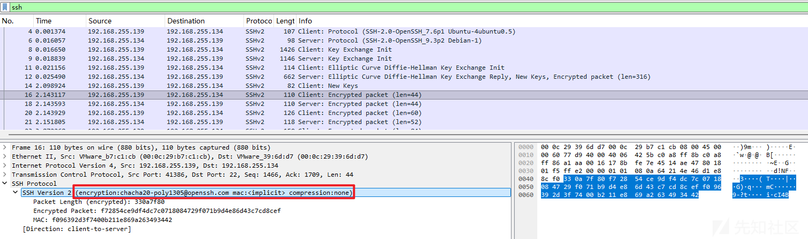

解密工具执行效果如下：

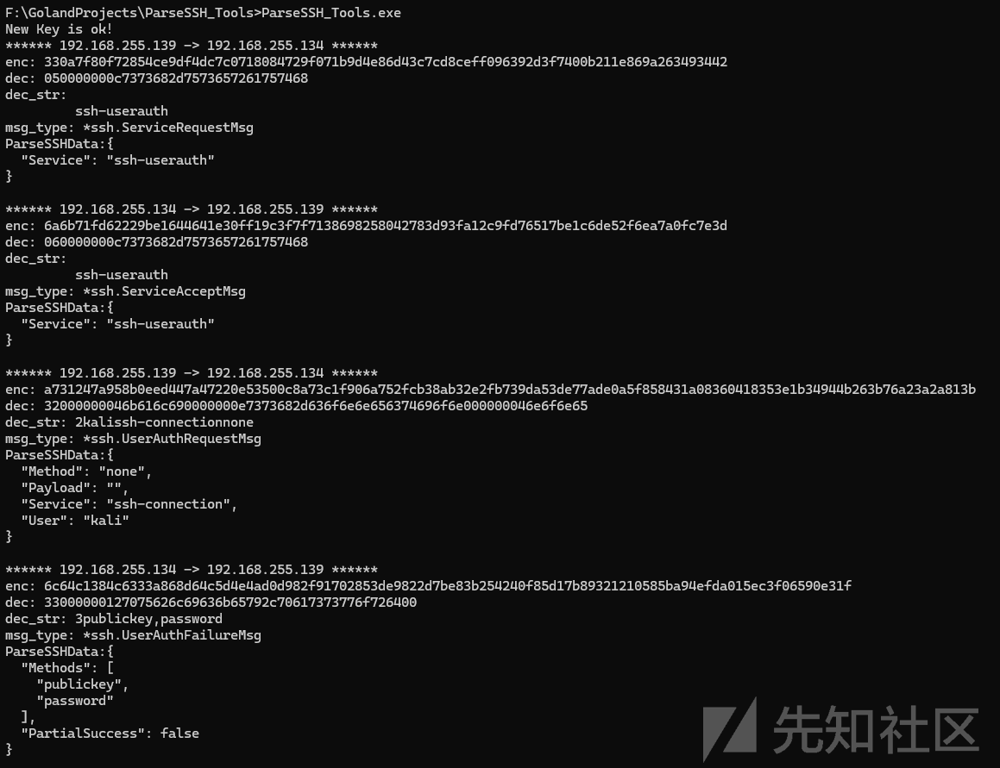

### SSH加密会话解析

在上述“SSH协议通信原理”章节中，我们对SSH数据包的版本协商、算法协商、密钥交换过程进行了剖析，但并未对用户认证、会话请求、会话交互过程进行深入剖析。

现在，基于我们的研究，我们可成功解密SSH通信数据包，结合解密后SSH通信数据，梳理用户认证、会话请求、会话交互过程如下：

|  |  |  |  |  |
| --- | --- | --- | --- | --- |
|  | SSH消息类型 | 消息号 | 关键信息 | 备注 |
| Client | ServiceRequestMsg | 0x05 | ssh-userauth | 请求用户认证服务 |
| Server | ServiceAcceptMsg | 0x06 | ssh-userauth | 接受用户认证服务 |
| Client | UserAuthRequestMsg | 0x32 | ssh-connection | 发起用户认证请求：携带了终端上输入的用户名 |
| Server | UserAuthFailureMsg | 0x33 | "Methods": ["publickey","password"] | 返回后续认证方法 |
| Client | UserAuthRequestMsg | 0x32 | ssh-connection | 发起用户认证请求：携带了终端上输入的用户名和密码 |
| Server | UserAuthSuccessMsg | 0x34 |  | 用户认证成功 |
| Client | ChannelOpenMsg | 0x5A | session | 请求打开会话通道 |
|  | GlobalRequestMsg | 0x50 | `no-more-sessions@openssh.com` | 发送全局请求：“不再有更多会话” |
| Server | GlobalRequestMsg | 0x50 | `hostkeys-00@openssh.com` | 发送全局请求：向客户端传输其支持的所有协议v2主机公钥列表；载荷中携带了/etc/ssh/目录下的ssh\_host\_rsa\_key.pub、ssh\_host\_ecdsa\_key.pub、ssh\_host\_ed25519\_key.pub文件内容 |
|  | ChannelOpenConfirmMsg | 0x5B |  | 确认通道已成功打开，并提供通道参数 |
| Client | ChannelRequestMsg | 0x62 | pty-req | 在已打开的通道上发送特定请求：请求终端 |
|  | ChannelRequestMsg | 0x62 | env | 在已打开的通道上发送特定请求：设置环境变量 |
|  | ChannelRequestMsg | 0x62 | shell | 在已打开的通道上发送特定请求：执行命令 |
| Server | ChannelRequestSuccessMsg | 0x63 |  | 通道请求成功 |
|  | WindowAdjustMsg | 0x5D |  | 用于调整通道的窗口大小，通知对端可以发送更多数据 |
|  | ChannelRequestSuccessMsg | 0x63 |  | 通道请求成功 |
|  | ChannelDataMsg | 0x5E |  | 通过通道传输实际数据：打印shell终端窗口中的字符串 |
| Client | ChannelDataMsg | 0x5E |  | 通过通道传输实际数据：shell终端交互，输入uname -ar、ifconfig命令 |
| Server | ChannelDataMsg | 0x5E |  | 通过通道传输实际数据：shell终端交互 |
|  | ...... |  |  |  |
| Client | ChannelDataMsg | 0x5E |  | 通过通道传输实际数据：输入exit命令 |
| Server | ChannelDataMsg | 0x5E |  |  |
| Server | ChannelEOFMsg | 0x60 |  | 通道的数据传输已结束 |
|  | ChannelRequestMsg | 0x62 | exit-status | 在已打开的通道上发送特定请求：通知退出状态 |
|  | ChannelRequestMsg | 0x62 | `eow@openssh.com` | 通知对端“本地写入已结束，请停止发送数据” |
|  | ChannelCloseMsg | 0x61 |  | 关闭通道 |
| Client | ChannelCloseMsg | 0x61 |  | 关闭通道 |
|  | DisconnectMsg | 0x01 | disconnected by user | 终止 SSH 连接 |

详细解密内容如下：

* 笔者在SSH会话中只执行了三个命令：uname -ar、ifconfig、exit
* Server端向Client端返回的数据，基本形如081b5b346d751b5b32346d1b5b33383b323b3135333b3135333b3135336d6e616d65202d61721b5b33396d1b5b3844二进制格式，将十六进制字节转换为ASCII字符并解析：

* 08: 退格字符 (\b)
* 1b 5b 34 6d: ANSI转义码 \x1b[4m，设置文本为**下划线**格式
* 75: **ASCII字符“u”**
* 1b 5b 32 34 6d: ANSI转义码 \x1b[24m，取消下划线格式
* 1b 5b 33 38 3b 32 3b 31 35 33 3b 31 35 33 3b 31 35 33 6d: ANSI转义码 \x1b[38;2;153;153;153m，设置前景色为RGB颜色(153,153,153)（灰色）
* 6e 61 6d 65 20 2d 61 72: **ASCII字符“name -ar”**
* 1b 5b 33 39 6d: ANSI转义码 \x1b[39m，重置前景色为默认值
* 1b 5b 38 44: ANSI转义码 \x1b[8D，将光标向左移动8个字符位置

```
****** 192.168.255.139 -> 192.168.255.134 ******
enc: 330a7f80f72854ce9df4dc7c0718084729f071b9d4e86d43c7cd8ceff096392d3f7400b211e869a263493442
dec: 050000000c7373682d7573657261757468
dec_str:ssh-userauth
msg_type: ServiceRequestMsg
ParseSSHData:{
  "Service": "ssh-userauth"
}

****** 192.168.255.134 -> 192.168.255.139 ******
enc: 6a6b71fd62229be1644641e30ff19c3f7f7138698258042783d93fa12c9fd76517be1c6de52f6ea7a0fc7e3d
dec: 060000000c7373682d7573657261757468
dec_str:ssh-userauth
msg_type: ServiceAcceptMsg
ParseSSHData:{
  "Service": "ssh-userauth"
}

****** 192.168.255.139 -> 192.168.255.134 ******
enc: a731247a958b0eed447a47220e53500c8a73c1f906a752fcb38ab32e2fb739da53de77ade0a5f858431a08360418353e1b34944b263b76a23a2a813b
dec: 32000000046b616c690000000e7373682d636f6e6e656374696f6e000000046e6f6e65
dec_str: kali ssh-connection  none
msg_type: UserAuthRequestMsg
ParseSSHData:{
  "Method": "none",
  "Payload": "",
  "Service": "ssh-connection",
  "User": "kali"
}

****** 192.168.255.134 -> 192.168.255.139 ******
enc: 6c64c1384c6333a868d64c5d4e4ad0d982f91702853de9822d7be83b254240f85d17b89321210585ba94efda015ec3f06590e31f
dec: 33000000127075626c69636b65792c70617373776f726400
dec_str: publickey,password
msg_type: UserAuthFailureMsg
ParseSSHData:{
  "Methods": [
    "publickey",
    "password"
  ],
  "PartialSuccess": false
}

****** 192.168.255.139 -> 192.168.255.134 ******
enc: dfc588013593f04a84cb5a45a03939e36dd1cbc986434488747e1396088b8d708e9d14fc6468caa8155d12300c8412f323d6379fa1ae0793ca3ebb7528e885fe6747d8f0d5c7ae61bb68b9f7661c1d29809c978f
dec: 32000000046b616c690000000e7373682d636f6e6e656374696f6e0000000870617373776f726400000000046b616c69
dec_str: kali  ssh-connection  password kali
msg_type: UserAuthRequestMsg
ParseSSHData:{
  "Method": "password",
  "Payload": "00000000046b616c69",
  "Service": "ssh-connection",
  "User": "kali"
}

****** 192.168.255.134 -> 192.168.255.139 ******
enc: 4071f140581a78874c4f9138cd7c51e33b057d71f5f2186c67c71606
dec: 34
msg_type: UserAuthSuccessMsg
ParseSSHData:{}

****** 192.168.255.139 -> 192.168.255.134 ******
enc: d537f4fb35750d8ab06216c6bfa822fe551153d3edf73f00190ac7075c2602f638e8734e17cd96d52853c23109909303a9b27e1276c542ae2c528d7f67ec22bac1d02fe78fe8bd8fd6f603f175328057e03ef7e7fb43fce6695efd3bf422794236be455bca918befd95cee248cda233b
dec: 5a0000000773657373696f6e000000000010000000004000
dec_str: session
msg_type: ChannelOpenMsg
ParseSSHData:{
  "ChanType": "session",
  "MaxPacketSize": 16384,
  "PeersID": 0,
  "PeersWindow": 1048576,
  "TypeSpecificData": ""
}

dec: 500000001c6e6f2d6d6f72652d73657373696f6e73406f70656e7373682e636f6d00
dec_str: no-more-sessions@openssh.com
msg_type: GlobalRequestMsg
ParseSSHData:{
  "Data": "",
  "Type": "no-more-sessions@openssh.com",
  "WantReply": false
}

****** 192.168.255.134 -> 192.168.255.139 ******
enc: af74c66b71a789f25eb46162d6e4298f86192dbf7c64493dbc8eb5c610c98c88e13ffe785d1345f1a8459d7970efd1a045f15b4afc0eab60b5b46b99f2f022c433842057ec936874168fed7107b25ab94639a9c3a532ed5b9391b68ba37194da4bb5df495ed3f986c4d420812980d05569a2b7a18203f2fa6b711167145769bcf09d1f583566eada77621c80c877857f3c4070eef3518ef4da88a270246b7e87f0f573d7b4395fbd7fd2fc4221e73a1612789216073cfec30fcb2fbd6dc4d10288e858d3b7beeac7d092058403e1c75c1484edf66bc5ee9aee41c92cfa45aba73326ef006d3ced3be28a87c89aa5e2bb72d805aef8fbfde7a47b652fb5f00005159dff09c9a4c1fe3edb3ba7521f877ff98daa17e85d619d831157422d69ce271d29e2401d5c20c38610b662ad175d9a383df507ab1e5c925a23af35366ed221feb7fe2b25ea29c5a9a2fd4a291e830709c93d5370e416668187c453a32e223cf0df6d600b1e429c6370021b363278d32542aa543e026527d2ee687edda76626459bf593408b4d413dd8b8d3b68a691b93ec302a66841947de95e54ea439972ada386a7a73c825930e08ad7ab2060dd40ba71f8cc15e23eeb65f0bd1d887ce66cb1e21d1ca07a1c5915b550eb2aa409e5b83ce7ea576be6263dbd329760c4975cd04c9d629f85b7babe97443a35c3afcba22a6dc801085c78bf4ccf54bd7f7b4165914b4d57aa0f3d94fddf82e9fb5c405669d50617ca20567963ecf99265ff0be3e8b64610ae13887b982213fab03bee1580fe34f13e384856aecec5f2be6bcf0a41fd3ff153a8a6959617910e8c773ec87e5e6811a7e9a62024deb7f139e41f9ce9f145fc2dddde4de911c911c1f72e2cd0d96
dec: 5000000017686f73746b6579732d3030406f70656e7373682e636f6d0000000197000000077373682d727361000000030100010000018100b273d89965ccf5bb67749eca17a995bd5bb467f742b5c97b240283b44ba3fd813a122572bb9a2cd3bdae1f9511dc37a5d9ab2f83749e8031020ac3da8d6fcbbeeb81b93d6ea703c7b9ded9e88535970e26d470fa05a4528a2f410d8f3a8a09137c04cc6775c1470108b74c74b84758fdb99ecef28f3bb22c1d806c4531211f02731e639634b8f06d716f958a13528d055206e82319d449da90297527fd81bfa23956cef00b347da056608d6f164223a70d772117c8f235ed91b6ebed027327a6aa3c3daa7a27f9fc52a7b7bff2ee7f033c07413b84dd3c8a3f2ea64d19702955536be362e6cc51f7279cf2cd07c3a890be3efe2c2a4ecadd5db01c1fd6993c1d549a62cb73e05dd92bae823a77e9c71efd83596b3592b9e0601f2d5d5c25dd9b6c58364a23a19d44abe89120b7148f530bc6b7ee6ae05e6d76736b5d086aeddac6524609286f2e068b4952c37abb4f7efe06ade20d9026ab99b96b168fdd89d56f2225db02e5d03d88bcb11e5fe015cb95a2a4c1b614026eab2010af0d4081f5000000680000001365636473612d736861322d6e69737470323536000000086e6973747032353600000041041d2e2c71669f91ffa4fb3962621ae2d824d82ccfb3ea72be63a069250e44db88c3f5e8baf4ede7968c278dc7d49272c27b6fd61ab26dcc6d1dd3d10ed233e87c000000330000000b7373682d65643235353139000000201ed7b7d67447f182b0a2b160c814732f97b92ce86b315b4702b8d0ce155a801f
msg_type: GlobalRequestMsg
ParseSSHData:{
  "Data": "00000197000000077373682d727361000000030100010000018100b273d89965ccf5bb67749eca17a995bd5bb467f742b5c97b240283b44ba3fd813a122572bb9a2cd3bdae1f9511dc37a5d9ab2f83749e8031020ac3da8d6fcbbeeb81b93d6ea703c7b9ded9e88535970e26d470fa05a4528a2f410d8f3a8a09137c04cc6775c1470108b74c74b84758fdb99ecef28f3bb22c1d806c4531211f02731e639634b8f06d716f958a13528d055206e82319d449da90297527fd81bfa23956cef00b347da056608d6f164223a70d772117c8f235ed91b6ebed027327a6aa3c3daa7a27f9fc52a7b7bff2ee7f033c07413b84dd3c8a3f2ea64d19702955536be362e6cc51f7279cf2cd07c3a890be3efe2c2a4ecadd5db01c1fd6993c1d549a62cb73e05dd92bae823a77e9c71efd83596b3592b9e0601f2d5d5c25dd9b6c58364a23a19d44abe89120b7148f530bc6b7ee6ae05e6d76736b5d086aeddac6524609286f2e068b4952c37abb4f7efe06ade20d9026ab99b96b168fdd89d56f2225db02e5d03d88bcb11e5fe015cb95a2a4c1b614026eab2010af0d4081f5000000680000001365636473612d736861322d6e69737470323536000000086e6973747032353600000041041d2e2c71669f91ffa4fb3962621ae2d824d82ccfb3ea72be63a069250e44db88c3f5e8baf4ede7968c278dc7d49272c27b6fd61ab26dcc6d1dd3d10ed233e87c000000330000000b7373682d65643235353139000000201ed7b7d67447f182b0a2b160c814732f97b92ce86b315b4702b8d0ce155a801f",
  "Type": "hostkeys-00@openssh.com",
  "WantReply": false
}

****** 192.168.255.134 -> 192.168.255.139 ******
enc: 37c9a9aab05c0110ff90c94830389700cba11230d5c1431e8874e6e6fa558f27403336d7e5452b1b827ca48f
dec: 5b00000000000000000000000000008000
msg_type: ChannelOpenConfirmMsg
ParseSSHData:{
  "MaxPacketSize": 32768,
  "MyID": 0,
  "MyWindow": 0,
  "PeersID": 0,
  "TypeSpecificData": ""
}

****** 192.168.255.139 -> 192.168.255.134 ******
enc: 3cbe468aeae4dbc07d573407f4caabf7c6f8064d6dd83f3c513228221745411d539cfef49b4c05616b52825e023dd530e4c2effbd59a7deeb0f44fcc4b83e83aa9176f9e0963e8dbea81262c6ef7254f6414d564c280ad037896687a25af149d6a415b772cd05471d64fc7b60c751e6fa84af838c5a00d10c1bab9c687365e4955672dba71f54a85014b5f31e4f48005a10769c45a1552026907f3fab59ba6d912611940bbcf95905933cddf314479ba6de56dd86a529ac97da055f3c01d599ded666385340ff0e2cd40297f1473b65e052e4d3d696638c49dd645fb5176944c3bb92ea56cc4aab54b9c4444c921cd5b30e943130d2c5df571458d53e1b4efb9ba9ba387b99d132b3f07c71d1b0c60094436d8dd7b0d658d645e7d395b705dd59b3c6dd017f82032dff66e8e758f4fbb6ee752b0ce053e936e77838134d350cc42b7d710fd760c8624d8e4449d5af479adacbf39c837595e451aa39fa79d792e729e784bdd2c04a01d5bedb49db4e65c49d551f37735f41e423e189b52507461fcf89e6d619265780a101b8cea65fdcadfe7f2f63eba7029fafb13927e68fc2a11144904b4d10f65e1b1817d90a5a786779ff3bbfb1d7862717aa90e8271be86597cd5658a9745f1cfb0130c
dec: 6200000000000000077074792d726571010000000e787465726d2d323536636f6c6f72000000cb0000002d000000000000000000000105810000960080000096000100000003020000001c030000007f0400000015050000000406000000000700000000080000001109000000130a0000001a0c000000120d000000170e00000016120000000f1e000000001f0000000020000000002100000000220000000023000000002400000001250000000026000000012700000000280000000029000000002a00000001320000000133000000013400000000350000000136000000013700000001380000000039000000003a000000003b000000013c000000013d000000013e0000000046000000014700000000480000000149000000004a000000004b000000005a000000015b000000015c000000005d0000000000
dec_str: pty-req  xterm-256color
msg_type: ChannelRequestMsg
ParseSSHData:{
  "PeersID": 0,
  "Request": "pty-req",
  "RequestSpecificData": "0000000e787465726d2d323536636f6c6f72000000cb0000002d000000000000000000000105810000960080000096000100000003020000001c030000007f0400000015050000000406000000000700000000080000001109000000130a0000001a0c000000120d000000170e00000016120000000f1e000000001f0000000020000000002100000000220000000023000000002400000001250000000026000000012700000000280000000029000000002a00000001320000000133000000013400000000350000000136000000013700000001380000000039000000003a000000003b000000013c000000013d000000013e0000000046000000014700000000480000000149000000004a000000004b000000005a000000015b000000015c000000005d0000000000",
  "WantReply": true
}

dec: 620000000000000003656e7600000000044c414e470000000b656e5f55532e5554462d38
dec_str: env  LANG  en_US.UTF-8
msg_type: ChannelRequestMsg
ParseSSHData:{
  "PeersID": 0,
  "Request": "env",
  "RequestSpecificData": "000000044c414e470000000b656e5f55532e5554462d38",
  "WantReply": false
}

dec: 6200000000000000057368656c6c01
dec_str: shell
msg_type: ChannelRequestMsg
ParseSSHData:{
  "PeersID": 0,
  "Request": "shell",
  "RequestSpecificData": "",
  "WantReply": true
}

****** 192.168.255.134 -> 192.168.255.139 ******
enc: 0b5438bffa822e70577e702975f4ff97314c3c157b58c0a56562f148198333b4ff9840fafcf3d480212b741d11e22cb1c13ad1815c89a605c7462cf2eb3fd0698fe53b6cfdcde4260a1cd8d4ffbf9beaeffcc7f87f24c0e2d09d8c06b1bb4859fb3ea1b51d2606a4bc51836d
dec: 6300000000
msg_type: ChannelRequestSuccessMsg
ParseSSHData:{
  "PeersID": 0
}

dec: 5d0000000000200000
msg_type: WindowAdjustMsg
ParseSSHData:{
  "AdditionalBytes": 2097152,
  "PeersID": 0
}

dec: 6300000000
msg_type: ChannelRequestSuccessMsg
ParseSSHData:{
  "PeersID": 0
}

****** 192.168.255.134 -> 192.168.255.139 ******
enc: 9577ddbcb97c1c088af9e77c995d7ecd56dfa1cb9d807de80d123f45fe457e3db880734733d2f96fe4d1c255e142130863ef928be6a0ae5d62e51ec459a0f13d10e9c8038195af0539532706fc94f5b9f32d51f639df68868f017c91414f64839161e729eb386a638b50f9b3fbd8c331ab915ca3f55d7a3b397b2e01b6af8df74f63e59844e668585d3cb455304082575784cf7fd878c314e3914b17e8e33f47fd0caaa506f765d8dd43f0fb0f66715e8a659fef03f4731ee5829f26c29e333b85a0a06d8dbedeb381683f03e53015d4f4e337cc1c00f244d8fc3f7064c0525bc52f1b237c23bec93506d08eba7121bdd0dbe057aaa9850153807aec18544eb7eefb9832ce36b02c5fea030fe3e2eb5b4607356fb3e80d4c3556731ba20a71c3d00f7c88e88df1820a73d836634089db86887bef2159f953e0dbfcf758f0e0a6fb412c960bdd0721807108695f3535d934fe8bccb296ec86704d3b59c00526943059e735b555d91bf52bbb4df4965ca9ab3e9d5819cc8b88539a11632d1b877b6f4618fbc96d394cd8111346103e0e50cdd08e261737f8b875f42174f11a77f8be418a6ad70a1c6c7cea999adc340b4578f64246a7b32b2782bf3ff6fb959a92bc32412550f5dfb8ebd7bfddd3a1a46bb500739af63a3eb682a59322
dec: 5e00000000000001ba4c696e7578206b616c6920362e332e302d6b616c69312d3638362d70616520233120534d5020505245454d50545f44594e414d49432044656269616e20362e332e372d316b616c69312028323032332d30362d32392920693638360d0a0d0a5468652070726f6772616d7320696e636c75646564207769746820746865204b616c6920474e552f4c696e75782073797374656d20617265206672656520736f6674776172653b0d0a74686520657861637420646973747269627574696f6e207465726d7320666f7220656163682070726f6772616d206172652064657363726962656420696e207468650d0a696e646976696475616c2066696c657320696e202f7573722f73686172652f646f632f2a2f636f707972696768742e0d0a0d0a4b616c6920474e552f4c696e757820636f6d65732077697468204142534f4c5554454c59204e4f2057415252414e54592c20746f2074686520657874656e740d0a7065726d6974746564206279206170706c696361626c65206c61772e0d0a4c617374206c6f67696e3a204d6f6e205365702020382030323a35333a313020323032352066726f6d203139322e3136382e3235352e3133390d0d0a
dec_str: Linux kali 6.3.0-kali1-686-pae #1 SMP PREEMPT_DYNAMIC Debian 6.3.7-1kali1 (2023-06-29) i686

The programs included with the Kali GNU/Linux system are free software;
the exact distribution terms for each program are described in the
individual files in /usr/share/doc/*/copyright.

Kali GNU/Linux comes with ABSOLUTELY NO WARRANTY, to the extent
permitted by applicable law.
Last login: Mon Sep  8 02:53:10 2025 from 192.168.255.139

msg_type: ChannelDataMsg
ParseSSHData:{
  "Length": 442,
  "PeersID": 0,
  "Rest": "4c696e7578206b616c6920362e332e302d6b616c69312d3638362d70616520233120534d5020505245454d50545f44594e414d49432044656269616e20362e332e372d316b616c69312028323032332d30362d32392920693638360d0a0d0a5468652070726f6772616d7320696e636c75646564207769746820746865204b616c6920474e552f4c696e75782073797374656d20617265206672656520736f6674776172653b0d0a74686520657861637420646973747269627574696f6e207465726d7320666f7220656163682070726f6772616d206172652064657363726962656420696e207468650d0a696e646976696475616c2066696c657320696e202f7573722f73686172652f646f632f2a2f636f707972696768742e0d0a0d0a4b616c6920474e552f4c696e757820636f6d65732077697468204142534f4c5554454c59204e4f2057415252414e54592c20746f2074686520657874656e740d0a7065726d6974746564206279206170706c696361626c65206c61772e0d0a4c617374206c6f67696e3a204d6f6e205365702020382030323a35333a313020323032352066726f6d203139322e3136382e3235352e3133390d0d0a"
}

****** 192.168.255.134 -> 192.168.255.139 ******
enc: 141c80c5e2719d86092dfd96e09bc322529b5c804ed381bbc76f9607c6cc0d6fbfef103cd6e27694ce47d0aa870646f82f838a698ea0cf53b7b9e49c88df72a7dde6e01328885433154a2a3150322020c653dbf804ea53875934914c0b3c981a73b3e0f0b3dccb74e2c9698b0533018ee394806c7f628f3309d2843ce1b79c6f707bd5a53d8314f5a52dc47a7bd43d9cc58a0b2d319cc6676d3b6ceafc946b470edd7ec0b8963a9c6ad18742062f09f0f64cf8970a0ab8227e5ce0e76abc7d32466afe1bb3aa90ea57b4eaccb442e4d7b1c8c14bd5e28916f77c5afc951628113370914a442a9356ab046a1730de2e92137cd9ff
dec: 5e00000000000000cd20202020202020202020202020202020202020202020202020202020202020202020202020202020202020202020202020202020202020202020202020202020202020202020202020202020202020202020202020202020202020202020202020202020202020202020202020202020202020202020202020202020202020202020202020202020202020202020202020202020202020202020202020202020202020202020202020202020202020202020202020202020202020202020202020202020202020202020200d0d
msg_type: ChannelDataMsg
ParseSSHData:{
  "Length": 205,
  "PeersID": 0,
  "Rest": "20202020202020202020202020202020202020202020202020202020202020202020202020202020202020202020202020202020202020202020202020202020202020202020202020202020202020202020202020202020202020202020202020202020202020202020202020202020202020202020202020202020202020202020202020202020202020202020202020202020202020202020202020202020202020202020202020202020202020202020202020202020202020202020202020202020202020202020200d0d"
}

****** 192.168.255.134 -> 192.168.255.139 ******
enc: 6a2e21b4daf0b4bc892da145be20b1613b4a3111b8cad83b9934d9c9abca2aa2de18efef720e189f387600e8b3d69480a7915f32
dec: 5e00000000000000111b5d303b6b616c69406b616c693a207e07
dec_str:kali@kali: ~
msg_type: ChannelDataMsg
ParseSSHData:{
  "Length": 17,
  "PeersID": 0,
  "Rest": "1b5d303b6b616c69406b616c693a207e07"
}

****** 192.168.255.134 -> 192.168.255.139 ******
enc: 4c02ad360f978cd27df7c996c3746e8b0921b3fd7b05deb0765d281ae8015e24fb91ebfc20bc9e3d1125add445e9cedfaf8489dfa23449c47bcb6eca7b12c42e1567ceef963c1da420edad166c9693554b0ab1773372fed44f87c54ba56ea1e1e67d37f5a3843ca05c4d6b1e6badb8344678a0cea8f89b4c42ac79cd2bce6dd337d60361b910c91cb0ee1f6f9881b9fcdd18ed79b8f6abe36e8a88da600f7e616186d8d73cc2d5d6314a99fa09c46b38603e61af
dec: 5e000000000000008d0d1b5b306d1b5b32376d1b5b32346d1b5b4a1b5b33326de2948ce29480e29480281b5b316d1b5b33326d1b5b33346d6b616c69e389bf6b616c691b5b306d1b5b33346d1b5b33326d292d5b1b5b316d1b5b33326d1b5b33396d7e1b5b306d1b5b33326d5d0d0ae29494e294801b5b316d1b5b33326d1b5b33346d241b5b306d1b5b33346d1b5b33396d201b5b4b
dec_str:
┌──(kali㉿kali)-[~]
└─$
msg_type: ChannelDataMsg
ParseSSHData:{
  "Length": 141,
  "PeersID": 0,
  "Rest": "0d1b5b306d1b5b32376d1b5b32346d1b5b4a1b5b33326de2948ce29480e29480281b5b316d1b5b33326d1b5b33346d6b616c69e389bf6b616c691b5b306d1b5b33346d1b5b33326d292d5b1b5b316d1b5b33326d1b5b33396d7e1b5b306d1b5b33326d5d0d0ae29494e294801b5b316d1b5b33326d1b5b33346d241b5b306d1b5b33346d1b5b33396d201b5b4b"
}

****** 192.168.255.134 -> 192.168.255.139 ******
enc: 4a308a75a890572b89710ab1b3f1a39cb78dff769f435680502df97bd8b8a51f921c4c7bc1d60b8e4b7341b8
dec: 5e00000000000000071b5b3f31681b3d
msg_type: ChannelDataMsg
ParseSSHData:{
  "Length": 7,
  "PeersID": 0,
  "Rest": "1b5b3f31681b3d"
}

****** 192.168.255.134 -> 192.168.255.139 ******
enc: 0a9d4403cbe1fe4ac6ce2080c2dcd5ea8cdcfa32b11fbdce782070ee6438b822d6b06591847567653e79166e
dec: 5e00000000000000081b5b3f3230303468
msg_type: ChannelDataMsg
ParseSSHData:{
  "Length": 8,
  "PeersID": 0,
  "Rest": "1b5b3f3230303468"
}

****** 192.168.255.139 -> 192.168.255.134 ******
enc: 636a262b3dadf2ffc0d129175a162fdfe9cd2a20b40a2258359f2bd74669f4a3d42f4d64
dec: 5e000000000000000169
dec_str: i
msg_type: ChannelDataMsg
ParseSSHData:{
  "Length": 1,
  "PeersID": 0,
  "Rest": "69"
}

****** 192.168.255.134 -> 192.168.255.139 ******
enc: 1359af06a2831d2dc8720e2f793dd6315930161597caa1edd93e09ca5a68f621933f060d173d4b6e74382bd8
dec: 5e000000000000000a1b5b346d691b5b32346d
dec_str: i
msg_type: ChannelDataMsg
ParseSSHData:{
  "Length": 10,
  "PeersID": 0,
  "Rest": "1b5b346d691b5b32346d"
}

****** 192.168.255.134 -> 192.168.255.139 ******
enc: 214af465005ac4ea8a880813ff1d7dfe8735d513b1c78ea14e336f55932ebe640725fc5fd5aa8226138227b98588ad26e7915fe5744b7af4b86d530eba6ecf5b7dba4ee5c137eed6153d63f386b349edbc36e8ce
dec: 5e0000000000000031081b5b346d691b5b32346d1b5b33383b323b3135333b3135333b3135336d66636f6e6669671b5b33396d08080808080808
dec_str: ifconfig
msg_type: ChannelDataMsg
ParseSSHData:{
  "Length": 49,
  "PeersID": 0,
  "Rest": "081b5b346d691b5b32346d1b5b33383b323b3135333b3135333b3135336d66636f6e6669671b5b33396d08080808080808"
}

****** 192.168.255.139 -> 192.168.255.134 ******
enc: 4a06e475298a91edb1d480e4fdf103f15443219b8da6056b44065a77cd8ea28c9abaff1e
dec: 5e00000000000000017f
dec_str: ^
msg_type: ChannelDataMsg
ParseSSHData:{
  "Length": 1,
  "PeersID": 0,
  "Rest": "7f"
}

****** 192.168.255.134 -> 192.168.255.139 ******
enc: f3f3bad8c4878f298c2d19c8d91684d5ec1afd410563b2c4c4c9e8ae7a8ac838599bf95c3af3321729220a260d5e52dd919e0baf12c400e39c7779482e264e81178f2ffd0f7e37355bdf31996c59ed68d2dfd4bf9675ee5e227191f5
dec: 5e0000000000000035081b5b32346d201b5b33396d201b5b33396d201b5b33396d201b5b33396d201b5b33396d201b5b33396d201b5b33396d201b5b3844
dec_str: ^
msg_type: ChannelDataMsg
ParseSSHData:{
  "Length": 53,
  "PeersID": 0,
  "Rest": "081b5b32346d201b5b33396d201b5b33396d201b5b33396d201b5b33396d201b5b33396d201b5b33396d201b5b33396d201b5b3844"
}

****** 192.168.255.139 -> 192.168.255.134 ******
enc: 514bb3d9be166c686057ef52dc72cb75a689841e07f58e496f4ec674901aba27a2f622a0
dec: 5e000000000000000175
dec_str: u
msg_type: ChannelDataMsg
ParseSSHData:{
  "Length": 1,
  "PeersID": 0,
  "Rest": "75"
}

****** 192.168.255.134 -> 192.168.255.139 ******
enc: 087c057039a5a815f7d4f6ae5967368ae4f9992fab2469b706670d10c2696cfb02964c8daf43b911099b807e
dec: 5e000000000000000a1b5b346d751b5b32346d
dec_str: u
msg_type: ChannelDataMsg
ParseSSHData:{
  "Length": 10,
  "PeersID": 0,
  "Rest": "1b5b346d751b5b32346d"
}

****** 192.168.255.134 -> 192.168.255.139 ******
enc: 0626d638d2dfcebddfc56b58cc708268abfed3a386c6dc41d6d66233ee6827434f0cd77e4cfbeb7995d7c2631e210281fbcc1b288d6fd170b493b7af65ad160dec7ceab67771b3e601588bd48dff6bfb6a590c30
dec: 5e000000000000002f081b5b346d751b5b32346d1b5b33383b323b3135333b3135333b3135336d6e616d65202d61721b5b33396d1b5b3844
dec_str: uname -ar
msg_type: ChannelDataMsg
ParseSSHData:{
  "Length": 47,
  "PeersID": 0,
  "Rest": "081b5b346d751b5b32346d1b5b33383b323b3135333b3135333b3135336d6e616d65202d61721b5b33396d1b5b3844"
}

****** 192.168.255.139 -> 192.168.255.134 ******
enc: 293b2e7f3f18f8043147180bbd222f08451475f9187f0ebbf0abf1b5083e57666bd0f5d2
dec: 5e00000000000000016e
dec_str: n
msg_type: ChannelDataMsg
ParseSSHData:{
  "Length": 1,
  "PeersID": 0,
  "Rest": "6e"
}

****** 192.168.255.134 -> 192.168.255.139 ******
enc: 2c56f116f83a5530cfd197803b64d4d303eb9b42dcdea17221523eddae7d5cfcf1a26300add85b098e25c4fe86c3ef8a3e880cc355bdc863e15a2110
dec: 5e0000000000000015081b5b346d751b5b33396d1b5b346d6e1b5b32346d
dec_str: un
msg_type: ChannelDataMsg
ParseSSHData:{
  "Length": 21,
  "PeersID": 0,
  "Rest": "081b5b346d751b5b33396d1b5b346d6e1b5b32346d"
}

****** 192.168.255.139 -> 192.168.255.134 ******
enc: 383c39e2854ff3c160e88eb09bd5ea457449d22b95e35e0196c7f00bd77758e831fdbd5b
dec: 5e000000000000000161
dec_str: a
msg_type: ChannelDataMsg
ParseSSHData:{
  "Length": 1,
  "PeersID": 0,
  "Rest": "61"
}

****** 192.168.255.134 -> 192.168.255.139 ******
enc: c0dae9d1b4962ed803f370cb1a40cd6955f3bac8af363d439d5048e3a3307fc7bbc76d68ab3a4661d8d535166717d1d64f57ebf4cfd9deb4cea81006d7cb9d77cac519d3
dec: 5e000000000000001b08081b5b346d751b5b346d6e1b5b33396d1b5b346d611b5b32346d
dec_str:una
msg_type: ChannelDataMsg
ParseSSHData:{
  "Length": 27,
  "PeersID": 0,
  "Rest": "08081b5b346d751b5b346d6e1b5b33396d1b5b346d611b5b32346d"
}

****** 192.168.255.139 -> 192.168.255.134 ******
enc: 0e3555c94a81a1688079a15e716397c711d512267ff269fa461dcb7e548548f36fc4a7ef
dec: 5e00000000000000016d
dec_str: m
msg_type: ChannelDataMsg
ParseSSHData:{
  "Length": 1,
  "PeersID": 0,
  "Rest": "6d"
}

****** 192.168.255.134 -> 192.168.255.139 ******
enc: 613d9f5a31752f1b6ddc144fc653ab4e14e22e8f8686b3a89b8056b0a0cfab449f6259912d2575e8f55ff589543e35a95ae1c028285773e2e0f44fc0
dec: 5e0000000000000015081b5b346d611b5b33396d1b5b346d6d1b5b32346d
dec_str: am
msg_type: ChannelDataMsg
ParseSSHData:{
  "Length": 21,
  "PeersID": 0,
  "Rest": "081b5b346d611b5b33396d1b5b346d6d1b5b32346d"
}

****** 192.168.255.139 -> 192.168.255.134 ******
enc: 304c225fb37d2df1f5f45412e35bd34fae93ec3bd1c447e17364ce46750024ef4b6cfc31
dec: 5e000000000000000165
dec_str: e
msg_type: ChannelDataMsg
ParseSSHData:{
  "Length": 1,
  "PeersID": 0,
  "Rest": "65"
}

****** 192.168.255.134 -> 192.168.255.139 ******
enc: 7adeb16c5ad5449ea52f4ec3d2c4244f8c073795a949bca1870713fde3b0ad692a82e8615fe28e35a946a1a3c584c482666aa15ac9eec370b94483a67473de71c92c3f0394ae3db097744754e6bb75abd1f270e27b1fb2924f8eb433f87ef9bcb08b9c1a
dec: 5e000000000000003b080808081b5b32346d1b5b33366d751b5b32346d1b5b33366d6e1b5b32346d1b5b33366d611b5b32346d1b5b33366d6d1b5b33366d651b5b33396d
dec_str：uname
msg_type: ChannelDataMsg
ParseSSHData:{
  "Length": 59,
  "PeersID": 0,
  "Rest": "080808081b5b32346d1b5b33366d751b5b32346d1b5b33366d6e1b5b32346d1b5b33366d611b5b32346d1b5b33366d6d1b5b33366d651b5b33396d"
}

****** 192.168.255.139 -> 192.168.255.134 ******
enc: 3a78d6a6eec3c27519b0ddd22f6c63e0d19caf7ff704fe8cbda145efead48321b41ebe33
dec: 5e000000000000000120
msg_type: ChannelDataMsg
ParseSSHData:{
  "Length": 1,
  "PeersID": 0,
  "Rest": "20"
}

****** 192.168.255.134 -> 192.168.255.139 ******
enc: 531d0a9f0be5669584f24d4682eb135436e85a0687a44932f829a63ec007db1dcede1eb7defa356523b29ed0
dec: 5e00000000000000061b5b33396d20
msg_type: ChannelDataMsg
ParseSSHData:{
  "Length": 6,
  "PeersID": 0,
  "Rest": "1b5b33396d20"
}

****** 192.168.255.139 -> 192.168.255.134 ******
enc: df0ce018d148d139191eb10e422e40e87e447d74a4f0eaab873ab9fe29c590e9fe3b7ee588f56b1d485a95f1
dec: 5e00000000000000031b4f43
msg_type: ChannelDataMsg
ParseSSHData:{
  "Length": 3,
  "PeersID": 0,
  "Rest": "1b4f43"
}

****** 192.168.255.134 -> 192.168.255.139 ******
enc: 040267309eb42005b3d0df49a780772175d6dab4c4c5e0f42451417382460802c5ab6376f0fdf02a129d082a534fe522fbf41e9e8b69e832586b5494
dec: 5e00000000000000171b5b33326d2d1b5b33326d611b5b33326d721b5b33396d
dec_str: -ar
msg_type: ChannelDataMsg
ParseSSHData:{
  "Length": 23,
  "PeersID": 0,
  "Rest": "1b5b33326d2d1b5b33326d611b5b33326d721b5b33396d"
}

****** 192.168.255.139 -> 192.168.255.134 ******
enc: 71c88a34908d34ea4f471890ccfed618a5337564519e0e595772aebe2c6a460668f71146
dec: 5e00000000000000010d
dec_str: \r
msg_type: ChannelDataMsg
ParseSSHData:{
  "Length": 1,
  "PeersID": 0,
  "Rest": "0d"
}

****** 192.168.255.134 -> 192.168.255.139 ******
enc: c5e52d0c6f6b774551f72808cb633712880784148a7eee28067c9753e36f272b6f90f9fc9dd031f008ba13c5
dec: 5e00000000000000071b5b3f316c1b3e
msg_type: ChannelDataMsg
ParseSSHData:{
  "Length": 7,
  "PeersID": 0,
  "Rest": "1b5b3f316c1b3e"
}

****** 192.168.255.134 -> 192.168.255.139 ******
enc: 930e76450960a8907be5d5460c5d452d0a6fd7aa03192d58cc2525eca726dd99c104dbd629d0d1a6d1c9c66e510a565e5752dfa1
dec: 5e000000000000000b1b5b3f323030346c0d0d0a
msg_type: ChannelDataMsg
ParseSSHData:{
  "Length": 11,
  "PeersID": 0,
  "Rest": "1b5b3f323030346c0d0d0a"
}

****** 192.168.255.134 -> 192.168.255.139 ******
enc: 9d631e75efa5cf352da2880bb8cd893d45357e98d6de520dc6a0362990d5142809caea893ec915dae3a17ba0ae37eb586d0fc5a65d2b47dd37d13cf527014ea599131b438ca4da52788b76cfb7bec51128161966a334a8c5b44f94fd7e22f6524abba4f76fd5ad4f11e4c92aa984d96421ebb26db21bf43ddd13aaca9b5e3ad0736047466b3461b28f4897a3
dec: 5e00000000000000674c696e7578206b616c6920362e332e302d6b616c69312d3638362d70616520233120534d5020505245454d50545f44594e414d49432044656269616e20362e332e372d316b616c69312028323032332d30362d323929206936383620474e552f4c696e75780d0a
dec_str: Linux kali 6.3.0-kali1-686-pae #1 SMP PREEMPT_DYNAMIC Debian 6.3.7-1kali1 (2023-06-29) i686 GNU/Linux

msg_type: ChannelDataMsg
ParseSSHData:{
  "Length": 103,
  "PeersID": 0,
  "Rest": "4c696e7578206b616c6920362e332e302d6b616c69312d3638362d70616520233120534d5020505245454d50545f44594e414d49432044656269616e20362e332e372d316b616c69312028323032332d30362d323929206936383620474e552f4c696e75780d0a"
}

****** 192.168.255.134 -> 192.168.255.139 ******
enc: 63c48c6749b6f4de25b3339d6008edd943d359935506060fa62cbf02d662eb8459122927ef874b85c21803d46db1f0845dfed0526cfa55288bbee1f0c81b4fb640280e7aafd3e046830e8c4fb3c3a55d43957da8af0058fe241163fd6db63b7b1e93bd07bdfdb7424dc062c4468c9a7be0dea5ae637687cf7adeae63f5b32569d47e4f3b2309955063a60b06cedef3ef3d41d3b19f2822b17291baad71c016114d411ab231480653ae35bd0f0a88de2aed3ff7f54892135faabbad432bc154576b89bdd42fc8fc3e3eed1420e7562cd65700f7e1a502c8ceaf60b949bd8c68103ba42d066ae66a2de0e7850e1c351d0e66aff4d2
dec: 5e00000000000000cd20202020202020202020202020202020202020202020202020202020202020202020202020202020202020202020202020202020202020202020202020202020202020202020202020202020202020202020202020202020202020202020202020202020202020202020202020202020202020202020202020202020202020202020202020202020202020202020202020202020202020202020202020202020202020202020202020202020202020202020202020202020202020202020202020202020202020202020200d0d
msg_type: ChannelDataMsg
ParseSSHData:{
  "Length": 205,
  "PeersID": 0,
  "Rest": "20202020202020202020202020202020202020202020202020202020202020202020202020202020202020202020202020202020202020202020202020202020202020202020202020202020202020202020202020202020202020202020202020202020202020202020202020202020202020202020202020202020202020202020202020202020202020202020202020202020202020202020202020202020202020202020202020202020202020202020202020202020202020202020202020202020202020202020200d0d"
}

****** 192.168.255.134 -> 192.168.255.139 ******
enc: a1a1528b39ccbe25515dd6bdc7cdd7713ed78359a518cae2fe4defb35dcf52e004bc735f1160bc81dea599a0b0df96436568ebbf5528830ac51e15ab
dec: 5e00000000000000131b5d303b6b616c69406b616c693a207e070d0a
msg_type: ChannelDataMsg
ParseSSHData:{
  "Length": 19,
  "PeersID": 0,
  "Rest": "1b5d303b6b616c69406b616c693a207e070d0a"
}

****** 192.168.255.134 -> 192.168.255.139 ******
enc: 8f192b25e8e4f2d9f34081b9ef44ab8de9b126a613ebef360249afcfc12b6733fbe333425f6a6d0d487a48b392337144488ba19bbd36bfc1c776fac8db41b9236334bb26d37ee2cf0ac0e6694ac0feea937c89db4158865dc95c906ceda3433582d81095a4cdddda12821347136d3d36b5e6dc0ef588831ef65dc8fce760ca83e5dddf3811e82ada156efe6296f3a0b53988a708188134ab7d536309e7281f246b367753b21c614459102fa5141c09990d7c5345
dec: 5e000000000000008d0d1b5b306d1b5b32376d1b5b32346d1b5b4a1b5b33326de2948ce29480e29480281b5b316d1b5b33326d1b5b33346d6b616c69e389bf6b616c691b5b306d1b5b33346d1b5b33326d292d5b1b5b316d1b5b33326d1b5b33396d7e1b5b306d1b5b33326d5d0d0ae29494e294801b5b316d1b5b33326d1b5b33346d241b5b306d1b5b33346d1b5b33396d201b5b4b
dec_str：
┌──(kali㉿kali)-[~]
└─$
msg_type: ChannelDataMsg
ParseSSHData:{
  "Length": 141,
  "PeersID": 0,
  "Rest": "0d1b5b306d1b5b32376d1b5b32346d1b5b4a1b5b33326de2948ce29480e29480281b5b316d1b5b33326d1b5b33346d6b616c69e389bf6b616c691b5b306d1b5b33346d1b5b33326d292d5b1b5b316d1b5b33326d1b5b33396d7e1b5b306d1b5b33326d5d0d0ae29494e294801b5b316d1b5b33326d1b5b33346d241b5b306d1b5b33346d1b5b33396d201b5b4b"
}

****** 192.168.255.134 -> 192.168.255.139 ******
enc: 67642ea98481b1dcaeea92ec140b571ce5a19e1eb8d6600460bcfa0550f0f2ac0b5fdd123dd761e3f4917e1b
dec: 5e00000000000000071b5b3f31681b3d
msg_type: ChannelDataMsg
ParseSSHData:{
  "Length": 7,
  "PeersID": 0,
  "Rest": "1b5b3f31681b3d"
}

****** 192.168.255.134 -> 192.168.255.139 ******
enc: 836142b998d14e78efbd4f1028e7101a941da1bbd4d8d8e1c4fcec038b3ce2989f2bbc87b09c561de7a78d57
dec: 5e00000000000000081b5b3f3230303468
dec_str: ^
msg_type: ChannelDataMsg
ParseSSHData:{
  "Length": 8,
  "PeersID": 0,
  "Rest": "1b5b3f3230303468"
}

****** 192.168.255.139 -> 192.168.255.134 ******
enc: 4a056f25e71c58b0f7f6b4f741616fd0d932e96690c7aab28abb7aa81572f6a78065d779
dec: 5e000000000000000169
dec_str: i
msg_type: ChannelDataMsg
ParseSSHData:{
  "Length": 1,
  "PeersID": 0,
  "Rest": "69"
}

****** 192.168.255.134 -> 192.168.255.139 ******
enc: b66c5ba2912041de4fead08638cd9f5c9d0bbebd0a7987a8db0eb7cc7832bf40e2d48e35a3b45ac5e8e1fe64
dec: 5e000000000000000a1b5b346d691b5b32346d
dec_str: i
msg_type: ChannelDataMsg
ParseSSHData:{
  "Length": 10,
  "PeersID": 0,
  "Rest": "1b5b346d691b5b32346d"
}

****** 192.168.255.134 -> 192.168.255.139 ******
enc: 3790d1d4ed5ccb3e9df92c56b83cc19046edcc625fb960528d331cfa0b9340f8bf6848fb5e3f7ee323ca10b7b16977255bcfbbb9436a1905e8f4d23fec1e3dee33cb91e2c55886403fd2b914c4028c82b1eb4bbb
dec: 5e0000000000000031081b5b346d691b5b32346d1b5b33383b323b3135333b3135333b3135336d66636f6e6669671b5b33396d08080808080808
dec_str: ifconfig
msg_type: ChannelDataMsg
ParseSSHData:{
  "Length": 49,
  "PeersID": 0,
  "Rest": "081b5b346d691b5b32346d1b5b33383b323b3135333b3135333b3135336d66636f6e6669671b5b33396d08080808080808"
}

****** 192.168.255.139 -> 192.168.255.134 ******
enc: 7bd9e4497c28c9bc7778edaf2596f166506a8e7d4b252b7fadf0845d7712994534fecdfa
dec: 5e000000000000000166
dec_str: f
msg_type: ChannelDataMsg
ParseSSHData:{
  "Length": 1,
  "PeersID": 0,
  "Rest": "66"
}

****** 192.168.255.134 -> 192.168.255.139 ******
enc: 5878565ebd78d6e3829d41306cece81f90055feb0a748278c2c824d657885e175630950732d05938ff81d6db3ef7f2a3c86cfcb80ced74c180cde49865e80b252fadd46e68679568349d841d
dec: 5e0000000000000023081b5b32346d1b5b316d1b5b33366d691b5b316d1b5b33366d661b5b306d1b5b33396d
dec_str: if
msg_type: ChannelDataMsg
ParseSSHData:{
  "Length": 35,
  "PeersID": 0,
  "Rest": "081b5b32346d1b5b316d1b5b33366d691b5b316d1b5b33366d661b5b306d1b5b33396d"
}

****** 192.168.255.139 -> 192.168.255.134 ******
enc: c9160de89ae7043247284604b853a134b3a06317edcb8e750aaf15aaef0536686eba495c
dec: 5e000000000000000163
dec_str: c
msg_type: ChannelDataMsg
ParseSSHData:{
  "Length": 1,
  "PeersID": 0,
  "Rest": "63"
}

****** 192.168.255.134 -> 192.168.255.139 ******
enc: 8cf90aabffa06cb37c64a098b7eda2a80faf827a0f82fc82b20e5329d90df32794284057a34821a82be6764f5f66733b7a1de2546589860ac4db36830ea2834f15ea4b15cd8e681320620da5972922a9832f2dfc
dec: 5e000000000000002d08081b5b306d1b5b33396d1b5b346d691b5b306d1b5b33396d1b5b346d661b5b33396d1b5b346d631b5b32346d
dec_str: ifc
msg_type: ChannelDataMsg
ParseSSHData:{
  "Length": 45,
  "PeersID": 0,
  "Rest": "08081b5b306d1b5b33396d1b5b346d691b5b306d1b5b33396d1b5b346d661b5b33396d1b5b346d631b5b32346d"
}

****** 192.168.255.139 -> 192.168.255.134 ******
enc: 53f205066cc0cba8e96ca9c539b308a19579e8d2f57a0a50064d059d4828814104bb331a
dec: 5e00000000000000016f
dec_str: o
msg_type: ChannelDataMsg
ParseSSHData:{
  "Length": 1,
  "PeersID": 0,
  "Rest": "6f"
}

****** 192.168.255.134 -> 192.168.255.139 ******
enc: c6fe520f420a1d9f53870b35afab09a2764a0d61b46dd481e63bfa6f4b200d2f52a268e558d21cb2b93ca132caba66a2e56d53fef9dc33edecff8e29
dec: 5e0000000000000015081b5b346d631b5b33396d1b5b346d6f1b5b32346d
dec_str: co
msg_type: ChannelDataMsg
ParseSSHData:{
  "Length": 21,
  "PeersID": 0,
  "Rest": "081b5b346d631b5b33396d1b5b346d6f1b5b32346d"
}

****** 192.168.255.139 -> 192.168.255.134 ******
enc: 9776f4de9c5b2203c4d03e238afc81af27ff03ca20a8f773aa81351971d27eb9c3b53783
dec: 5e00000000000000016e
dec_str: n
msg_type: ChannelDataMsg
ParseSSHData:{
  "Length": 1,
  "PeersID": 0,
  "Rest": "6e"
}

****** 192.168.255.134 -> 192.168.255.139 ******
enc: a79ebe9665b9069495dbf72c4171dd0805de91516e9d45a75a9ac523359a62c5595c11e3cd157a8f773a20bc6cb9f7baed1ee9f454beeb4de5a2d4fd
dec: 5e0000000000000015081b5b346d6f1b5b33396d1b5b346d6e1b5b32346d
dec_str: on
msg_type: ChannelDataMsg
ParseSSHData:{
  "Length": 21,
  "PeersID": 0,
  "Rest": "081b5b346d6f1b5b33396d1b5b346d6e1b5b32346d"
}

****** 192.168.255.139 -> 192.168.255.134 ******
enc: dc810874ff9e92de7232f93bc55f91fa3d4a5763aa5fe17022d1d258e2a2ce2683035631
dec: 5e000000000000000166
dec_str: f
msg_type: ChannelDataMsg
ParseSSHData:{
  "Length": 1,
  "PeersID": 0,
  "Rest": "66"
}

****** 192.168.255.134 -> 192.168.255.139 ******
enc: 99b81a42b3e12966527fc1fa75c0455c4ca333992a1bd79f1786b9d4ab8b3e44615e7fcbdbe8cfb8859f8aeadfd940fd7531a3d14b45d858c4d75a70
dec: 5e0000000000000015081b5b346d6e1b5b33396d1b5b346d661b5b32346d
dec_str: nf
msg_type: ChannelDataMsg
ParseSSHData:{
  "Length": 21,
  "PeersID": 0,
  "Rest": "081b5b346d6e1b5b33396d1b5b346d661b5b32346d"
}

****** 192.168.255.139 -> 192.168.255.134 ******
enc: 211392e22c551178cd7c64d63446a438981eecee1bb791d3fbea45459e1386966ea80eda
dec: 5e000000000000000169
dec_str: i
msg_type: ChannelDataMsg
ParseSSHData:{
  "Length": 1,
  "PeersID": 0,
  "Rest": "69"
}

****** 192.168.255.134 -> 192.168.255.139 ******
enc: 2308369d5b29eeb6c1e976bdfd724222652ccdf9dcf3a189b2f1325465b83462d4e76b2419656164694563c3f71e8b68836025ebdaa1b364c49403d2
dec: 5e0000000000000015081b5b346d661b5b33396d1b5b346d691b5b32346d
dec_str: fi
msg_type: ChannelDataMsg
ParseSSHData:{
  "Length": 21,
  "PeersID": 0,
  "Rest": "081b5b346d661b5b33396d1b5b346d691b5b32346d"
}

****** 192.168.255.139 -> 192.168.255.134 ******
enc: 0b3e05bbb2d0765f6ce4f774026b549a4f58181e4b1a6f382379fb224393bb78646b8401
dec: 5e000000000000000167
dec_str: g
msg_type: ChannelDataMsg
ParseSSHData:{
  "Length": 1,
  "PeersID": 0,
  "Rest": "67"
}

****** 192.168.255.134 -> 192.168.255.139 ******
enc: 71c589bf0faf81ce13def53873c1d78998f0cf871f67e04cfafbb7a39ba8a2bbca2d71e5e15c25839d80ed789255b4df706cd674969fdd7ff354d7a458b6be7e1cf9ce9b94a03aee53658d3be297383d4bb2718fbfd9824a20bef5cadf15ce3dd1b832d10c92d46ccddb2899c3cfa1f3a58b57d05ec3d0f7ac65a96f30799ee9e8ec008c
dec: 5e000000000000005f080808080808081b5b32346d1b5b33366d691b5b32346d1b5b33366d661b5b32346d1b5b33366d631b5b32346d1b5b33366d6f1b5b32346d1b5b33366d6e1b5b32346d1b5b33366d661b5b32346d1b5b33366d691b5b33366d671b5b33396d
dec_str:ifconfig
msg_type: ChannelDataMsg
ParseSSHData:{
  "Length": 95,
  "PeersID": 0,
  "Rest": "080808080808081b5b32346d1b5b33366d691b5b32346d1b5b33366d661b5b32346d1b5b33366d631b5b32346d1b5b33366d6f1b5b32346d1b5b33366d6e1b5b32346d1b5b33366d661b5b32346d1b5b33366d691b5b33366d671b5b33396d"
}

****** 192.168.255.139 -> 192.168.255.134 ******
enc: c1f45f0aaca52b31847bf215fe3510fc7ddc1b78d9b3fa212dc7e97ab690c02d4e4b858f
dec: 5e00000000000000010d
dec_str: \r
msg_type: ChannelDataMsg
ParseSSHData:{
  "Length": 1,
  "PeersID": 0,
  "Rest": "0d"
}

****** 192.168.255.134 -> 192.168.255.139 ******
enc: 4eb44e931fbe3dadeeb5ffa155cd8fc7e8f7b9cbdc580c982209117370a9859db8b4e8ce7a1d507777881711
dec: 5e00000000000000071b5b3f316c1b3e
msg_type: ChannelDataMsg
ParseSSHData:{
  "Length": 7,
  "PeersID": 0,
  "Rest": "1b5b3f316c1b3e"
}

****** 192.168.255.134 -> 192.168.255.139 ******
enc: 7791a4deac81598d881332d7315fdee2022d5ff6e1c5d0880a54c1c1e92ae44f23f2580215632c8d94288eb4b8e93c050a64a0bf
dec: 5e000000000000000b1b5b3f323030346c0d0d0a
msg_type: ChannelDataMsg
ParseSSHData:{
  "Length": 11,
  "PeersID": 0,
  "Rest": "1b5b3f323030346c0d0d0a"
}

****** 192.168.255.134 -> 192.168.255.139 ******
enc: aaefb8d8510b5707614e9d16f53b50eb174c5fadec131af81ab876c0e3b9d948cb86dfbec76fdb9a2c901395d44239c076a53fd1710e0d69dc2d41c5764aebbd8f89924990f5b122792ef4d6416d2b027a470627b9691965928d564e3755719e531bf02811afb1d52251fb32f06e4136fd88cf16bc34de51f59667c772c152e85faec7c8616e4bb882376fd80648d12bb35c3bbb5a1ab8bfda9abb838453ccce8289fcea74de47ce8f49c24d50579f2723201355
dec: 5e000000000000008c657468303a20666c6167733d343136333c55502c42524f4144434153542c52554e4e494e472c4d554c5449434153543e20206d747520313530300d0a2020202020202020696e6574203139322e3136382e3235352e31333420206e65746d61736b203235352e3235352e3235352e30202062726f616463617374203139322e3136382e3235352e3235350d0a
dec_str: eth0: flags=4163<UP,BROADCAST,RUNNING,MULTICAST>  mtu 1500
        inet 192.168.255.134  netmask 255.255.255.0  broadcast 192.168.255.255

msg_type: ChannelDataMsg
ParseSSHData:{
  "Length": 140,
  "PeersID": 0,
  "Rest": "657468303a20666c6167733d343136333c55502c42524f4144434153542c52554e4e494e472c4d554c5449434153543e20206d747520313530300d0a2020202020202020696e6574203139322e3136382e3235352e31333420206e65746d61736b203235352e3235352e3235352e30202062726f616463617374203139322e3136382e3235352e3235350d0a"
}

****** 192.168.255.134 -> 192.168.255.139 ******
enc: 7caa77f280d80fc6aeab76a449d5c95e5ff225bd79c4139d42381d94504d58a5b1ac5f433cf5965529363a85cb6c5f8802370bfa2fa6c174791f76e2ebffab3a9e919d0d7fb50ccab5404dccef823e12de7cd0d2e21a66f7e53085023913414b95c59f7fae53a37b6cb2dd08049d658565a71a2c3faf19144bed338d30f6584f7b8484887ac6e042306f4d72c5b6a08a8f58902e37bb70015aff22b0fad5dac1e4928b6ce22fadd87214430b
dec: 5e00000000000000882020202020202020696e65743620666538303a3a6333333a373233393a613564363a6234366320207072656669786c656e203634202073636f7065696420307832303c6c696e6b3e0d0a202020202020202065746865722030303a30633a32393a33393a36643a64372020747871756575656c656e203130303020202845746865726e6574290d0a
dec_str: inet6 fe80::c33:7239:a5d6:b46c  prefixlen 64  scopeid 0x20<link>
        ether 00:0c:29:39:6d:d7  txqueuelen 1000  (Ethernet)

msg_type: ChannelDataMsg
ParseSSHData:{
  "Length": 136,
  "PeersID": 0,
  "Rest": "2020202020202020696e65743620666538303a3a6333333a373233393a613564363a6234366320207072656669786c656e203634202073636f7065696420307832303c6c696e6b3e0d0a202020202020202065746865722030303a30633a32393a33393a36643a64372020747871756575656c656e203130303020202845746865726e6574290d0a"
}

****** 192.168.255.134 -> 192.168.255.139 ******
enc: fe9aa1170ba5690cbf7f57a570a1cac09ab22a6a0b6d04aa82f4e27b008703f333a6561f547c1a05e5d88f7885e368dc86258d3ec9d74d71e29211c1d936dc54742991a23feaf38c6fcf677db7f1f2ab9710b984
dec: 5e000000000000003120202020202020205258207061636b657473203131333220206279746573203837393135202838352e38204b6942290d0a
dec_str: RX packets 1132  bytes 87915 (85.8 KiB)

msg_type: ChannelDataMsg
ParseSSHData:{
  "Length": 49,
  "PeersID": 0,
  "Rest": "20202020202020205258207061636b657473203131333220206279746573203837393135202838352e38204b6942290d0a"
}

****** 192.168.255.134 -> 192.168.255.139 ******
enc: f32189921c78c79d4bea1813f4c6c4ffeb9cf5f4626e9c24b54e49d987f49b776c42238452abab376bd801b831993f9e46a0d77e3f1e5985c9b451120b46e45a4d21f469d283aa7852261d5fc616c797403b57ae79fad5cbe3b1afec76d27bae53c2a46ba2dfe7121091cd955082d9c73d00a29312cd82191199c375b121f9c781c580c315a8a07d1bef013d4ad5757249ffa71e9b0f3e2630a6d64d5d1985e7f555a8573812258b9a1f005b077a9388d75ca327dc5e1ef0735a3bd90756d9013ee164c388359adaf7e3afb6ecdfe9865c0a12699621a66925f918c62258ddc90f39f217ba7537bb0ee73e929e01e6d41b082060e85fddd7af35153da83281ea1ff21e9f824a23a11e71e5739c62e4c712d405d232a77d6113b1fcc5812f8360a01e3a3039dcda89c256a5707ab1a9a1039d3e2841a69450a383946f39fd2248d95eb67a493abc154b453ee87a0a5e16c8d847074dae2e8c0f9ad845e98d5a561e87666db2514920fdec8fc753b1a1aae646b56e7712988838f88412b6e1734d5cb3c08cc40bb439ee671914cf127f497f32a367f468c010a761b58b3676229cf13bfab0bc9279308de6fb766f1983b771f43c24ab58f2a65acae7eebda05d322ce60e018ef898aa8731602f0138e1ade32beabf57ea165fcef6bc488c9b81d035a93337a70075c93779ff97f6f6b7980b28cce1a775e61adb80aca388e0ba8fdaf57efb8499c121978f011b6733bb550541427809cf69f56f67d66699412d0d7db87dae0ea2b3e9bf9215966214900e82a5cb6dfd827a575b034879b04256b88883cc5b6ecd2aa9a893689c3801c8bc64a9ad4f577156a3b836d2f20b4c9bb92b08e20f5da9b8195d13d3caafeead1f8b75cccbdc07be3b42dd83f0ba681c9c9054529db7384d0eaaa71bd4
dec: 5e000000000000026820202020202020205258206572726f72732030202064726f70706564203020206f76657272756e73203020206672616d6520300d0a20202020202020205458207061636b6574732032323220206279746573203430313839202833392e32204b6942290d0a20202020202020205458206572726f72732030202064726f707065642030206f76657272756e73203020206361727269657220302020636f6c6c6973696f6e7320300d0a202020202020202064657669636520696e746572727570742031392020626173652030783230303020200d0a0d0a6c6f3a20666c6167733d37333c55502c4c4f4f504241434b2c52554e4e494e473e20206d74752036353533360d0a2020202020202020696e6574203132372e302e302e3120206e65746d61736b203235352e302e302e300d0a2020202020202020696e657436203a3a3120207072656669786c656e20313238202073636f7065696420307831303c686f73743e0d0a20202020202020206c6f6f702020747871756575656c656e20313030302020284c6f63616c204c6f6f706261636b290d0a20202020202020205258207061636b6574732034202062797465732032343020283234302e302042290d0a20202020202020205258206572726f72732030202064726f70706564203020206f76657272756e73203020206672616d6520300d0a20202020202020205458207061636b6574732034202062797465732032343020283234302e302042290d0a20202020202020205458206572726f72732030202064726f707065642030206f76657272756e73203020206361727269657220302020636f6c6c6973696f6e7320300d0a0d0a
dec_str: RX errors 0  dropped 0  overruns 0  frame 0
        TX packets 222  bytes 40189 (39.2 KiB)
        TX errors 0  dropped 0 overruns 0  carrier 0  collisions 0
        device interrupt 19  base 0x2000

lo: flags=73<UP,LOOPBACK,RUNNING>  mtu 65536
        inet 127.0.0.1  netmask 255.0.0.0
        inet6 ::1  prefixlen 128  scopeid 0x10<host>
        loop  txqueuelen 1000  (Local Loopback)
        RX packets 4  bytes 240 (240.0 B)
        RX errors 0  dropped 0  overruns 0  frame 0
        TX packets 4  bytes 240 (240.0 B)
        TX errors 0  dropped 0 overruns 0  carrier 0  collisions 0


msg_type: ChannelDataMsg
ParseSSHData:{
  "Length": 616,
  "PeersID": 0,
  "Rest": "20202020202020205258206572726f72732030202064726f70706564203020206f76657272756e73203020206672616d6520300d0a20202020202020205458207061636b6574732032323220206279746573203430313839202833392e32204b6942290d0a20202020202020205458206572726f72732030202064726f707065642030206f76657272756e73203020206361727269657220302020636f6c6c6973696f6e7320300d0a202020202020202064657669636520696e746572727570742031392020626173652030783230303020200d0a0d0a6c6f3a20666c6167733d37333c55502c4c4f4f504241434b2c52554e4e494e473e20206d74752036353533360d0a2020202020202020696e6574203132372e302e302e3120206e65746d61736b203235352e302e302e300d0a2020202020202020696e657436203a3a3120207072656669786c656e20313238202073636f7065696420307831303c686f73743e0d0a20202020202020206c6f6f702020747871756575656c656e20313030302020284c6f63616c204c6f6f706261636b290d0a20202020202020205258207061636b6574732034202062797465732032343020283234302e302042290d0a20202020202020205258206572726f72732030202064726f70706564203020206f76657272756e73203020206672616d6520300d0a20202020202020205458207061636b6574732034202062797465732032343020283234302e302042290d0a20202020202020205458206572726f72732030202064726f707065642030206f76657272756e73203020206361727269657220302020636f6c6c6973696f6e7320300d0a0d0a"
}

****** 192.168.255.134 -> 192.168.255.139 ******
enc: e398d4d2ebaa37a816f18ee4d9d8c8023407185abe7ae804fad33220294609d0a114a50978764c2066b5f71b7678bf29eceafb911146502f9b237f27715bd0806ffc5e973ac8e0cea6028b1eb8e8fe7f510e9a3cac92430d49fe4205ac5ab262b0ab1d8b84dacadd82ea1a9cc3dccf86ef73cda339f7d8ee5c640cce63f8cbb8bf5b362a7d1132dce5486074c7e682eab846c0d01d411c287c0a1ee4422ca34f281f54ab21becf11577a60e7540b7b6b4ea392ab99a4cb9975177a816daa1ad7c5935d490c4afbc08db09d4b91f724826f03ae28b9ba2ed28b868cecc55a070ea407d13cb3e957ee98cd1972100ad1d61e456a027cce8a65fde391eb88951158730db413
dec: 5e00000000000000de20202020202020202020202020202020202020202020202020202020202020202020202020202020202020202020202020202020202020202020202020202020202020202020202020202020202020202020202020202020202020202020202020202020202020202020202020202020202020202020202020202020202020202020202020202020202020202020202020202020202020202020202020202020202020202020202020202020202020202020202020202020202020202020202020202020202020202020200d0d1b5d303b6b616c69406b616c693a207e07
msg_type: ChannelDataMsg
ParseSSHData:{
  "Length": 222,
  "PeersID": 0,
  "Rest": "20202020202020202020202020202020202020202020202020202020202020202020202020202020202020202020202020202020202020202020202020202020202020202020202020202020202020202020202020202020202020202020202020202020202020202020202020202020202020202020202020202020202020202020202020202020202020202020202020202020202020202020202020202020202020202020202020202020202020202020202020202020202020202020202020202020202020202020200d0d1b5d303b6b616c69406b616c693a207e07"
}

****** 192.168.255.134 -> 192.168.255.139 ******
enc: 1ad314745b957cf2bfba361ea77ac5dd490e7ff585735ef4c13ef356682d874fbf30622b
dec: 5e00000000000000020d0a
msg_type: ChannelDataMsg
ParseSSHData:{
  "Length": 2,
  "PeersID": 0,
  "Rest": "0d0a"
}

****** 192.168.255.134 -> 192.168.255.139 ******
enc: 01007e619230d28ac062b83ff9d8ec2b82ed48277ecd9fee84ee1014a4150e932a1cd50911efd58a064e06c5302ee164f64419d525275467570a5936a8ed5b2bec398197c6ea1eb8620eafa9fd9287b28a3f65556a3be551556f3fdb1bc6e12c04b3fbdc9a960c309b297652eeaad0a81de8b732914f209742ed5b333eec1080990bf4fa4b351e5de2ea702d4c9962e389996265b09389dd7e8b6aa7b69f09a903729c3ec764a85e2a2e4b42b7f09a1b26083085
dec: 5e000000000000008d0d1b5b306d1b5b32376d1b5b32346d1b5b4a1b5b33326de2948ce29480e29480281b5b316d1b5b33326d1b5b33346d6b616c69e389bf6b616c691b5b306d1b5b33346d1b5b33326d292d5b1b5b316d1b5b33326d1b5b33396d7e1b5b306d1b5b33326d5d0d0ae29494e294801b5b316d1b5b33326d1b5b33346d241b5b306d1b5b33346d1b5b33396d201b5b4b
dec_str:
┌──(kali㉿kali)-[~]
└─$
msg_type: ChannelDataMsg
ParseSSHData:{
  "Length": 141,
  "PeersID": 0,
  "Rest": "0d1b5b306d1b5b32376d1b5b32346d1b5b4a1b5b33326de2948ce29480e29480281b5b316d1b5b33326d1b5b33346d6b616c69e389bf6b616c691b5b306d1b5b33346d1b5b33326d292d5b1b5b316d1b5b33326d1b5b33396d7e1b5b306d1b5b33326d5d0d0ae29494e294801b5b316d1b5b33326d1b5b33346d241b5b306d1b5b33346d1b5b33396d201b5b4b"
}

****** 192.168.255.134 -> 192.168.255.139 ******
enc: 1a35955f2100cdecdba59c60137c3da645ac4aacd9eec298a8a71aeb76ac9d43345b07b2e994386a18e88c69
dec: 5e00000000000000071b5b3f31681b3d
msg_type: ChannelDataMsg
ParseSSHData:{
  "Length": 7,
  "PeersID": 0,
  "Rest": "1b5b3f31681b3d"
}

****** 192.168.255.134 -> 192.168.255.139 ******
enc: e6f22de0b9d8481b4baf6de08b79aa1e31c310fac159961961ee5e0b23596e2f2e04c0c316c2abfb5add9c94
dec: 5e00000000000000081b5b3f3230303468
msg_type: ChannelDataMsg
ParseSSHData:{
  "Length": 8,
  "PeersID": 0,
  "Rest": "1b5b3f3230303468"
}

****** 192.168.255.139 -> 192.168.255.134 ******
enc: 8dab1006e551370d74592569581eff6a51320f16d986541124676bb09ed361215a4f1bea
dec: 5e000000000000000165
dec_str: e
msg_type: ChannelDataMsg
ParseSSHData:{
  "Length": 1,
  "PeersID": 0,
  "Rest": "65"
}

****** 192.168.255.134 -> 192.168.255.139 ******
enc: 09db7770cf4714db247d7933f27e473471c42ab612c849c1f10f5f079a44c309c14e4495d61efb96715901d6
dec: 5e000000000000000a1b5b346d651b5b32346d
dec_str: e
msg_type: ChannelDataMsg
ParseSSHData:{
  "Length": 10,
  "PeersID": 0,
  "Rest": "1b5b346d651b5b32346d"
}

****** 192.168.255.134 -> 192.168.255.139 ******
enc: 73359340bfbba3cc08ada8e6fa11596285915e3affd3153742bd4b604253d047fe98032a947465a06f38c857c82a774fe9ebac2c792eae899ce437b13f165e229b2700cf3c2099eac467a66e
dec: 5e0000000000000029081b5b346d651b5b32346d1b5b33383b323b3135333b3135333b3135336d7869741b5b33396d080808
dec_str: exit
msg_type: ChannelDataMsg
ParseSSHData:{
  "Length": 41,
  "PeersID": 0,
  "Rest": "081b5b346d651b5b32346d1b5b33383b323b3135333b3135333b3135336d7869741b5b33396d080808"
}

****** 192.168.255.139 -> 192.168.255.134 ******
enc: a9bbedb2afec2616c7f8715a9d9e96d6d8f6b4037c94e864f581d31b3525615dc2315cd2
dec: 5e000000000000000178
dec_str: x
msg_type: ChannelDataMsg
ParseSSHData:{
  "Length": 1,
  "PeersID": 0,
  "Rest": "78"
}

****** 192.168.255.134 -> 192.168.255.139 ******
enc: c43bb9ecfcfcadc8529a848043de748e4255e9239ab2a12cdc7b7361cfc9a8e6d441bd0c2acb939941cde6df887c8dafc5bb1d6ef36e544f7a89a267
dec: 5e0000000000000017081b5b32346d1b5b33366d651b5b33366d781b5b33396d
dec_str: ex
msg_type: ChannelDataMsg
ParseSSHData:{
  "Length": 23,
  "PeersID": 0,
  "Rest": "081b5b32346d1b5b33366d651b5b33366d781b5b33396d"
}

****** 192.168.255.139 -> 192.168.255.134 ******
enc: f4cc588cfaec56e803e90bfbbffa77c5064ed1e1c532d25acdfdd109cf5158f38381aba1
dec: 5e000000000000000169
dec_str: i
msg_type: ChannelDataMsg
ParseSSHData:{
  "Length": 1,
  "PeersID": 0,
  "Rest": "69"
}

****** 192.168.255.134 -> 192.168.255.139 ******
enc: 5cf0de48a7b8f7a86fea3731c75818e2e84b6d493f2d9d6c68c25c823a3b65b3f774a37a1a004667426371b304ced46884af9fe93cd10ccc562d32d21404d53fff5aa52b01066727770cc771
dec: 5e000000000000002508081b5b33396d1b5b346d651b5b33396d1b5b346d781b5b33396d1b5b346d691b5b32346d
dec_str: exi
msg_type: ChannelDataMsg
ParseSSHData:{
  "Length": 37,
  "PeersID": 0,
  "Rest": "08081b5b33396d1b5b346d651b5b33396d1b5b346d781b5b33396d1b5b346d691b5b32346d"
}

****** 192.168.255.139 -> 192.168.255.134 ******
enc: 662787659e1a69b84b658124a8f70e38c96065ee9a110c3c7cd9e87308b6f2a942445e93
dec: 5e000000000000000174
dec_str: t
msg_type: ChannelDataMsg
ParseSSHData:{
  "Length": 1,
  "PeersID": 0,
  "Rest": "74"
}

****** 192.168.255.134 -> 192.168.255.139 ******
enc: 4458240fbeedbb66a7fb279e1b5d649196de168b9784a24d230d089efc7481ad05db21c8877358f0f097cae149b125301ea290f45e40f20e2beb784cf2da62e47a1948008f54d8a282d443a8f62fcb63fbb71d31
dec: 5e000000000000002f0808081b5b32346d1b5b33366d651b5b32346d1b5b33366d781b5b32346d1b5b33366d691b5b33366d741b5b33396d
dec_str:exit
msg_type: ChannelDataMsg
ParseSSHData:{
  "Length": 47,
  "PeersID": 0,
  "Rest": "0808081b5b32346d1b5b33366d651b5b32346d1b5b33366d781b5b32346d1b5b33366d691b5b33366d741b5b33396d"
}

****** 192.168.255.139 -> 192.168.255.134 ******
enc: 11919ad43ffdfc56ce8bce3f2e9d9a9ee0a5c2d781298cafa264e5d689d61cea9132ae1a
dec: 5e00000000000000010d
dec_str: \r
msg_type: ChannelDataMsg
ParseSSHData:{
  "Length": 1,
  "PeersID": 0,
  "Rest": "0d"
}

****** 192.168.255.134 -> 192.168.255.139 ******
enc: 2fe35f6c38204abd164c611ea3004d5898a9a5cf7ffd3ad8a9a561cf79a6a47c595da21da8e975d5c6370de2
dec: 5e00000000000000071b5b3f316c1b3e
msg_type: ChannelDataMsg
ParseSSHData:{
  "Length": 7,
  "PeersID": 0,
  "Rest": "1b5b3f316c1b3e"
}

****** 192.168.255.134 -> 192.168.255.139 ******
enc: 6ece98b8ad15f86225b3364d356db062eef640c0d846462281caa989e23b9f5bb10aa34b2081d4ba208e70016bb7a00a7b5b27f6
dec: 5e000000000000000b1b5b3f323030346c0d0d0a
dec_str: \r\r

msg_type: ChannelDataMsg
ParseSSHData:{
  "Length": 11,
  "PeersID": 0,
  "Rest": "1b5b3f323030346c0d0d0a"
}

****** 192.168.255.134 -> 192.168.255.139 ******
enc: b80cf29f00131586aa8d3622e04e6f8061bef60abe79e56877321281c4701df5522a0f97dc696ddc0271f310675cf6a5bd99b25fdf3df032515e76d5507f6f00ef8a8dba336e47334727a40ff50f278b550b6d914c31c2c5e37f13550c2db2db035e2de9f6286e1bca56e0c5425a97517815af7947636df91471a47749560372a433052bda80654ce7a6ff78ef4e71aa1343f3171de135cf73c55d571cfc06fce2ba596267d246e4bf8b898901c0eca8
dec: 6000000000
msg_type: ChannelEOFMsg
ParseSSHData:{
  "PeersID": 0
}

dec: 62000000000000000b657869742d7374617475730000000000
dec_str: exit-status
msg_type: ChannelRequestMsg
ParseSSHData:{
  "PeersID": 0,
  "Request": "exit-status",
  "RequestSpecificData": "00000000",
  "WantReply": false
}

dec: 62000000000000000f656f77406f70656e7373682e636f6d00
dec_str: eow@openssh.com
msg_type: ChannelRequestMsg
ParseSSHData:{
  "PeersID": 0,
  "Request": "eow@openssh.com",
  "RequestSpecificData": "",
  "WantReply": false
}

dec: 6100000000
msg_type: ChannelCloseMsg
ParseSSHData:{
  "PeersID": 0
}

****** 192.168.255.139 -> 192.168.255.134 ******
enc: b17a09b66c64c0194f2301bbd4880ac4e5e4995d76d298abc1f4725d7de96b1bf376db2b
dec: 6100000000
msg_type: ChannelCloseMsg
ParseSSHData:{
  "PeersID": 0
}

****** 192.168.255.139 -> 192.168.255.134 ******
enc: 8ae1c06f8b18a03734923cefefd2c2293a3678c7fb164be3e8fe377d79b0b5f4e646b01403ea087d5e542a1a862e4925490f3393ee726b6c4ba2ece9
dec: 010000000b00000014646973636f6e6e6563746564206279207573657200000000
dec_str:disconnected by user
msg_type: DisconnectMsg
ParseSSHData:{
  "Language": "",
  "Message": "disconnected by user",
  "Reason": 11
}
```
