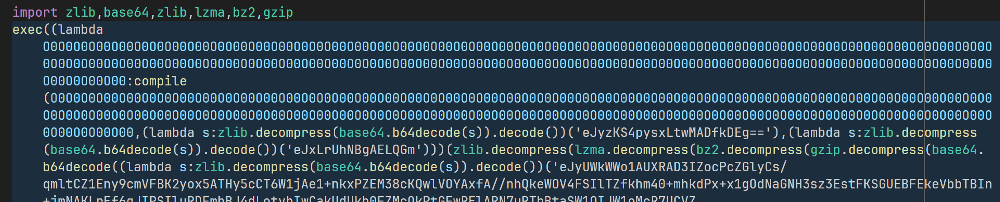
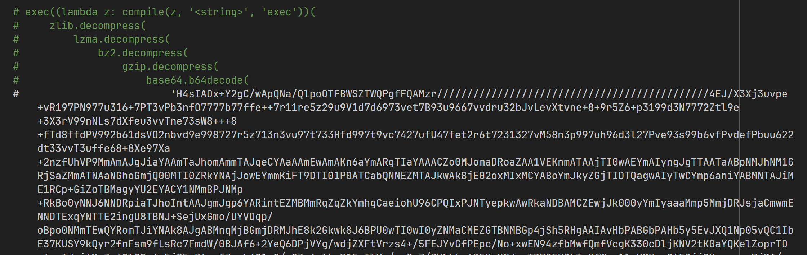
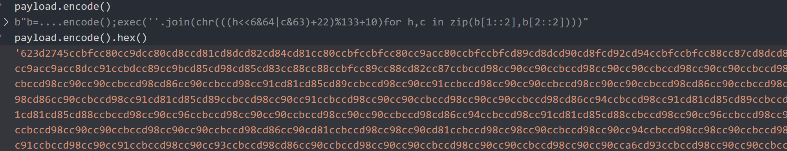
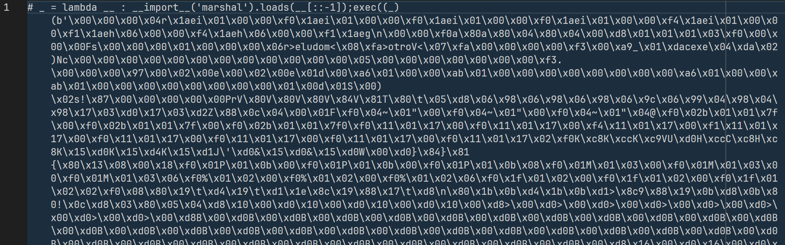
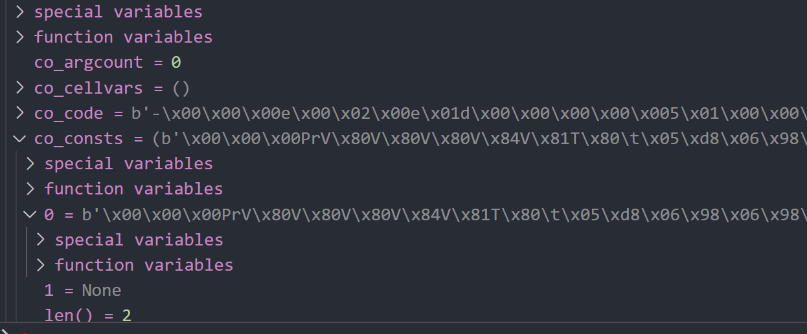
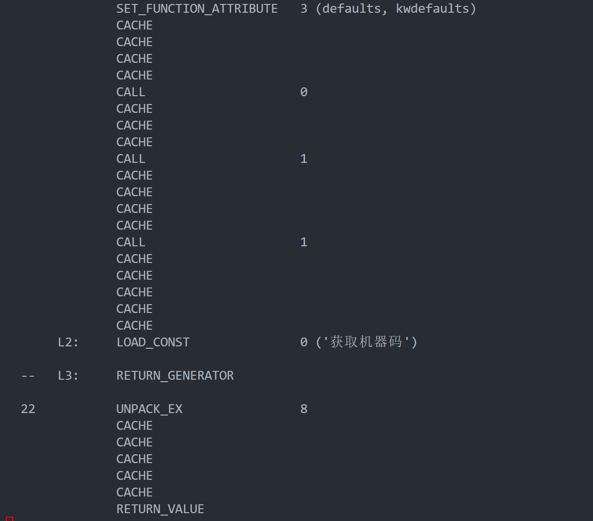
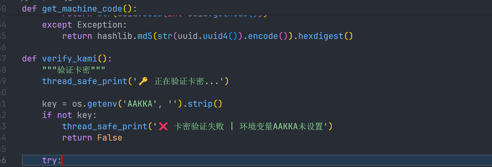

# 记一次py恶意样本分析实战-先知社区

> **来源**: https://xz.aliyun.com/news/19111  
> **文章ID**: 19111

---

打开py文件，发现样本包含了很长一段的payload，经过多层解压后通过exec来执行代码。exec是恶意样本常用的命令，典型搭配是先用compile将字节串/字符串编译成可执行对象，再用exec触发执行；常见变体包括：eval/exec混用、`getattr(__builtins__, 'exec')` 间接调用、通过 `globals()/locals()` 注入命名空间、lambda/闭包中包裹、以及把payload拆分拼接后再 `compile(...,'<string>','exec')` 执行，这些都用于绕过静态特征与简单规则。  


为了更好地观察代码，我们直接将所有0O0O00O00O0O0O相关的变量进行重命名，下一步开始解payload

# Step1-payload初步解析

格式化payload后解构如下：这里关键在于 `compile`与 `exec`的组合。

`compile(source, filename, mode, flags=0, dont_inherit=False, optimize=-1)` 的核心参数是：

* source：源代码字符串或AST；样本中通常是多层解码后的字符串
* filename：源码名，常见为 `'<string>'` 以减少暴露真实路径
* mode：'exec'（执行一段程序）、'eval'（求值单个表达式）、'single'（单条交互式语句）  
  样本先通过多层 `base64/gzip/bz2/lzma/zlib`解码得到纯文本Python代码，再以 `compile(..., '<string>', 'exec')` 编译成code object，最终 `exec(code_obj, globals_dict, locals_dict)`触发执行；部分样本会自定义 `globals()`以污染当前命名空间（如植入自定义 `__import__`或hook内置函数），需要在动态还原时注意隔离执行环境。

对于长的payload，可以发现套入了多层压缩。观察到规律是  
 return zlib.decompress(  
 lzma.decompress(  
 bz2.decompress(  
 gzip.decompress(  
 base64.b64decode(

我们可以写一个一个脚本看看解出来的结果



同样格式化一下代码，发现多层压缩的顺序是相同的，这里相当于多嵌套了一层多层压缩，这时候我们可以写一个简单的脚本，来循环解析payload

```
while
    matches = re.findall(r"base64\.b64decode\('([^']*)'\)", payload)[0]
    payload = deobf(matches)
    pass
```

上述循环脚本的作用是：

* 提取当前payload中下一层 `base64.b64decode('...')`的字面量数据
* 将提取到的字串传入 `deobf`函数做一轮解码/解压（内部通常依次尝试 `gzip/bz2/lzma/zlib`等）
* 用解出的结果覆盖 `payload`，继续下一轮，直到匹配不到为止  
  核心原理是沿着样本构造的“套娃解码链”逐层剥离外壳，直至得到可读的明文源码或下一阶段的字节流（如 `marshal`序列）。

解完后发现payload的规律已经变了，且能发现输出的payload长度明显短于前面的payload，说明这里肯定有问题。

# Step2-隐藏字符处理

下面进入第二部分的分析

​

我们可以通过几种方式验证：输出一下payload的长度；打印hex形式



发现确有问题，很多不正常的字符。在控制台简单的替换即可提出这部分的解密结果



# step3-marshal解析

前置知识：`marshal`是CPython内部用于序列化代码对象等内部结构的模块，主要面向解释器自身，不保证跨版本稳定；与 `pickle`不同，`marshal`不是通用安全序列化格式。`.pyc`文件中代码对象就是 `marshal`序列化后的二进制数据。`marshal.loads(bytes)`可以把字节流还原为 `code`对象，随后可用 `types.FunctionType`绑定环境后执行，或借助 `dis`反汇编。

在这里，样本将payload进行了reverse，然后通过marshal.loads来加载

## 错误的探索

接下来就是喜闻乐见的pyc逆向时刻

我们知道，pyc实际上是由pyc\_header加上python序列化后的二进制流组成的，pyc\_header的格式为

* 4字节 Magic Number（魔数，区分编译器/版本，示例：`ó`  为3.13系列）
* 4字节 Bitfield（标志位，最低位标识是否为哈希校验格式）
* 8字节：

* 若为时间戳格式：4字节mtime + 4字节源文件大小
* 若为哈希格式：8字节哈希前缀

因此常见布局为：`[magic][flags][timestamp+size 或 hash]` 共16字节。样本中构造 `b'ó ' + b' '*12`即写入魔数并将后续12字节清零（伪造时间戳/哈希区），让反编译/反汇编工具能够识别为目标版本的 `.pyc`并继续处理后续的 `marshal`字节流。

下面列出了常见版本的魔术，这里由于样本只能在py3.13跑所以直接选3.13的魔数

同样，先解一层看看

```
data = data[::-1]
pyc_header = b'\xf3\x0d\x0d\x0a' + b'\x00'*12  # 魔数+2个long
with open('dec1.pyc', 'wb') as fp:
    fp.write(pyc_header)
    fp.write(data)
    # pycdc
code_obj = marshal.loads(data)
```

然而由于uncompyle6和pycdc都还不支持py3.13，所以不能直接解出源码出来

## 第二个思路

尽管不能解出源码，我们还是可以看下字节码的。观察发现函数主体很短，而且依然有很长的payload，这可以说明后续可能还有代码需要解析。

观察一下导入的obj，这就引出了一个新的解码思路：提取代码对象中的payload，继续进行循环解密



```
code_obj = marshal.loads(data[::-1])
while True:
    code_obj = marshal.loads(code_obj.co_consts[0][::-1])
    dis.dis(code_obj)
    pass
```

最终报错的时候，我们可以查看下字节码，发现反汇编的结果已经丰富很多了，也说明基本去混淆完成了



# step4-字节码还原

前面说到py3.13我还没找到能直接反编译源码的办法，所以我们只能自己动手了。不过可以借助LLM来协助字节码的还原，这是目前比较好的办法，而且我审计了一下也还算准确，最终也是成功还原源码了



# 总结

本次样本的核心链路可以概括为：多层编码/压缩 → 隐藏字符干扰 → `compile+exec` 触发执行 → `reverse + marshal.loads` 继续多阶段下钻 → 提取 `co_consts` 链式解包 → 以字节码视角完成还原。关键在于打散“套娃”层级，始终保持可观测与可控的还原节奏。

一些易错点与经验总结如下：

* 多层解码链中混入不可见/异常字符，导致解码后长度异常或语法不完整，先做可视化与替换能显著提效。
* `compile(..., '<string>', 'exec')` 常配合自定义 `globals()` 污染命名空间，动态执行务必隔离（沙箱/容器/只读FS）。
* 遇到版本不支持的反编译（如 py3.13），换视角：字节码反汇编 + 局部语义还原 + LLM 辅助校对，是可行的折中路线。
* `marshal` 仅保证 CPython 内部使用语义，不保证跨版本稳定；优先在同版本环境中还原和验证。

对抗面与溯源建议：

* 规则侧：关注 `compile/eval/exec` 组合、`__builtins__` 间接取用、`co_consts` 链式反序列化、异常编码序列与多重压缩拼接的特征。
* 行为侧：沙箱内记录网络、文件、进程与模块加载轨迹；对可疑 `__import__` 重绑定与 `sys.modules` 操作做钩子与审计。
* 供应链侧：锁定运行时 Python 版本指纹与 `.pyc` 魔数；对版本差异进行针对性检测与策略分流。

复现性与自动化：

* 将“正则抽取 → 解码解压 → 结构化判断 → 递归剥离 → 字节码反汇编/再解包”流程脚本化，输出每步产物的长度、哈希与快照，方便回溯。
* 为 `marshal` 与 `co_consts` 的解包写守护与断言（如类型/长度/异常字符），第一时间定位污染点。
