# 记实战下一些不一样的漏洞挖掘经历-先知社区

> **来源**: https://xz.aliyun.com/news/19133  
> **文章ID**: 19133

---

### 越权漏洞

下面的案例是基于不同情景下的越权，希望师傅们可以有所收获

#### **案例一(签名校验绕过导致的越权)**

小程序渗透中有几个小技巧，比如接口的查找、常见越权漏洞的是否存在等等

下面我们由一些真实的案例出发讲述一下渗透的一些思路

对于小程序，我们最开始可以尝试去反编译它，拿到其前端js源码，方便我们后续查找接口，以及查看加密鉴权逻辑

在一次攻防中渗透小程序的经历，最开始我们可以直接抓包查看其一些常见的接口入手，大致判断一下是否可能存在越权漏洞

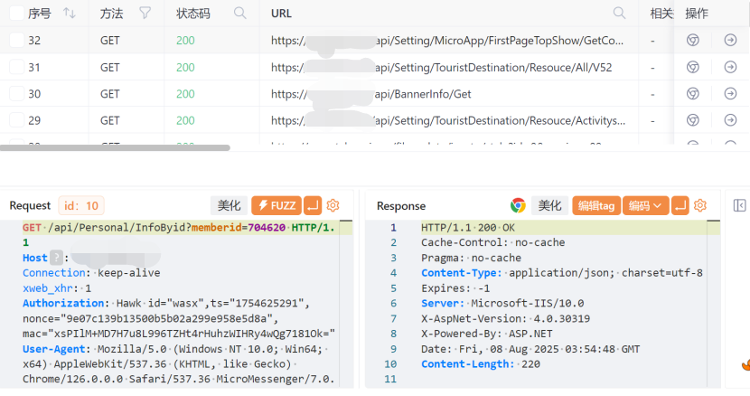

比如上面的memberid，你可以大胆的想是否它是可以遍历的，这里的答案是可能但不一定，因为我们必须结合其鉴权机制来进行判断，请求包里面我们没有看到明显的token，cookie字段的设置，但是当我们正常抓包后重新发包又不行，这个可能就是存在一个安全校验的问题

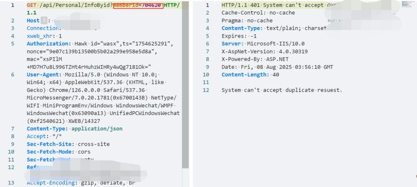

初看请求体，我们可以很快的锁定，下面的字段很可能就是校验的逻辑，下面存在时间戳、nonce、mac还有固定值，下一步我们就得开始逆向一下生成逻辑

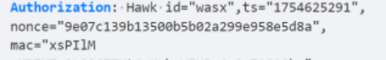

上面的拒绝接收是由于两次相近的提交的nonce值相同导致的，而我们修改nonce发包又是出现了下面的时间戳校验，这个好办，通过python脚本来处理时间戳的问题

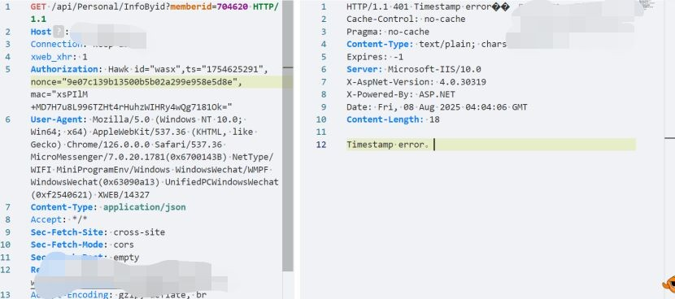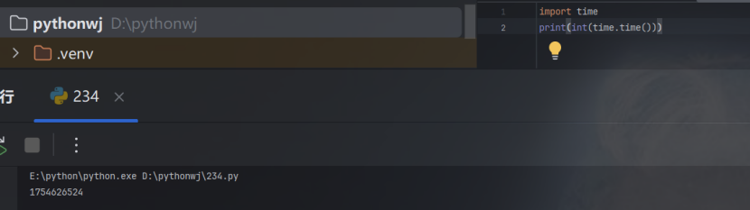

处理完上面的时间戳问题，下面就是关键的签名问题了，mac

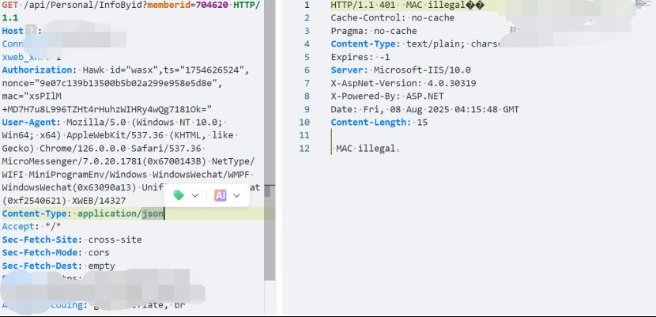

由于此加密是处于请求体里面，我们无法动态去看，更多是静态分析了

分析思路，里面有一些小技巧，如果在反编译的源码中存在app-service.js，我们主要只需要关注其即可，里面会放置接口以及一些请求加密逻辑

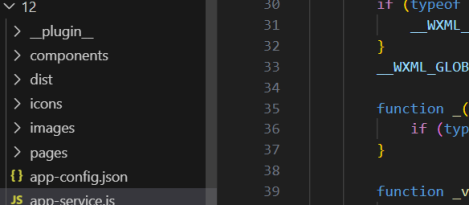

下面我们先全局查找mac，最终可以定位到其加密函数，最后我们只需分析加密所用的参数以及加密逻辑即可，我们发现了我们还需要一个无法伪造的key，但是我们可以大胆的想这个基于前端生成的签名校验，绝对存在一个Key在前端

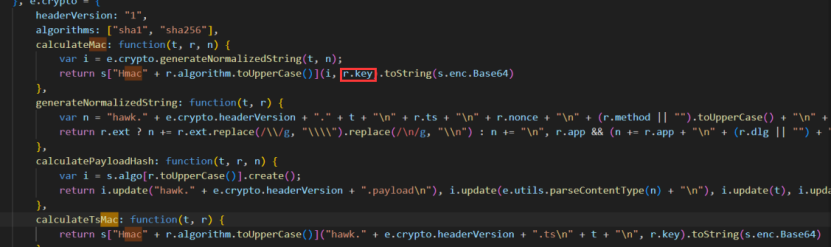

确实存在，知道具体值我们就成功了，最后成功拿下，下面就是找对应接口实现危害扩大了，由于功能单一我们最后只能接管所有用户信息

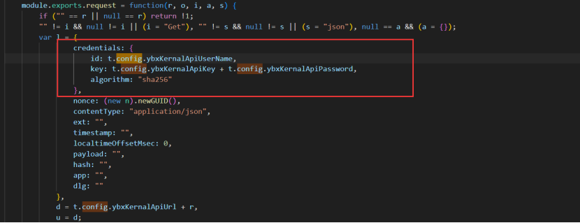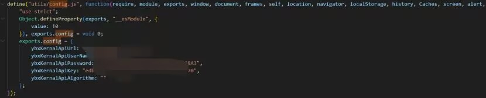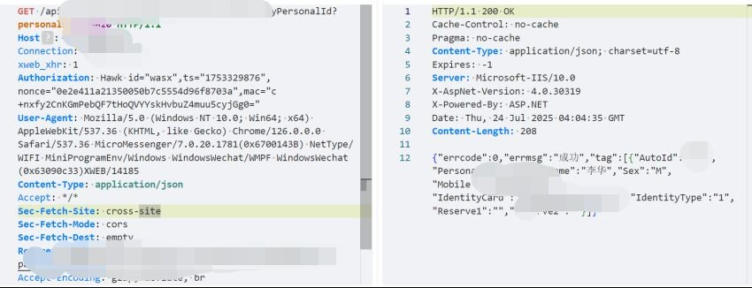

签名校验不等于鉴权，我们只需拿到起加密可能就可以实现越权操作，最后搓出脚本即可实现遍历

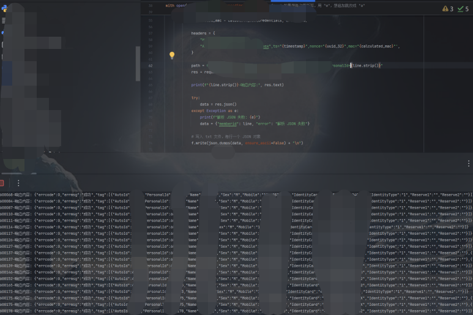

#### **案例二(签名绕过导致的敏感接口泄露越权)**

这个案例与前面不同的是它的校验部分只存在与接口中，下面的复现过程也会有所体会

越权漏洞不一定带了token或者session就不会存在，我们首先对于jwt的鉴权可以先看看解码信息中是否已经带上我们的身份认证信息如手机号，身份证，userId等，如果存在大概率是无法越权了。至于token就很难判断了

开始还是一样先尽可能的多找一些接口，看看是否存在我们还下手或者好判断的，下面我们很快的锁定存在一个名为getUserByPhone的接口，但是当我们是以游客进去就会存在没有信息的获取，而我们比较难判断是否我们可以越权，因为首先回显结果都是无信息，其次就是它存在token，这里我就跳过一些步骤，拿到一个对应部门员工的号码，验证确实存在用户的越权查询功能

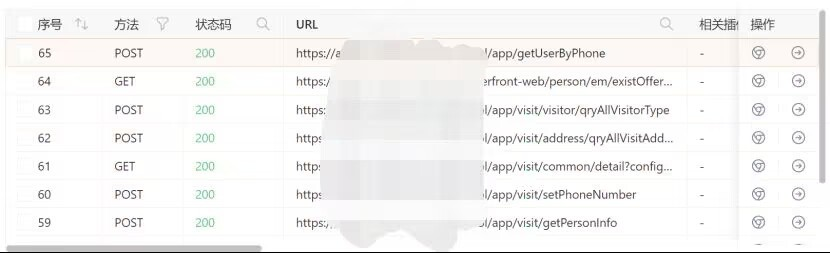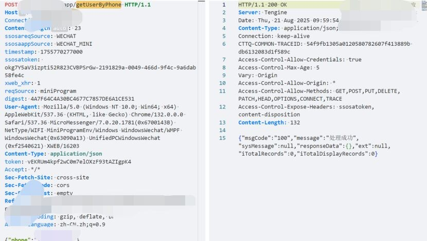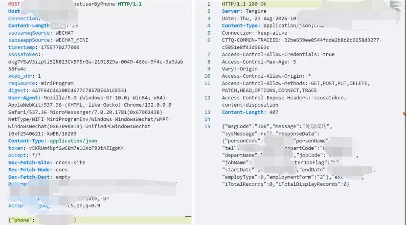

这里存在一个问题，我们无法先获取员工用户号码再获取对应信息，并且这里也并非存在身份证等敏感信息，接下来还是要扩大攻击面，但是我们都点一遍还是无法找到可以获取用户信息的接口，但是当我们换其它接口时就发现存在一个问题，它存在参数校验，排查完后才发现是请求头中的digest签名校验

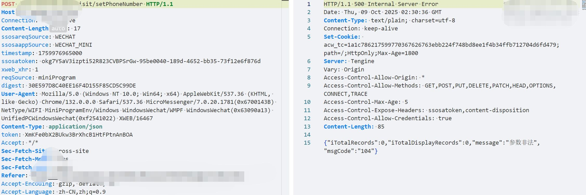回到反编译的源码中我们查找关键词也成功找到了，这里其实加密比较简单，就是按他的格式将接口和特定参数进行md5加密以及改为大写

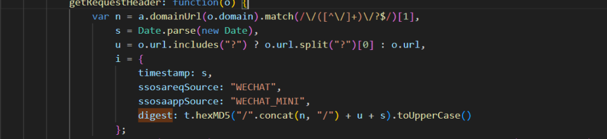逆向出来解密下一步就是实现接口的查找

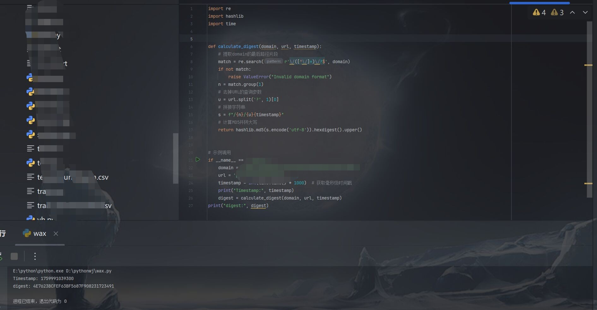

最后实现越权，以及其它敏感接口的进一步利用

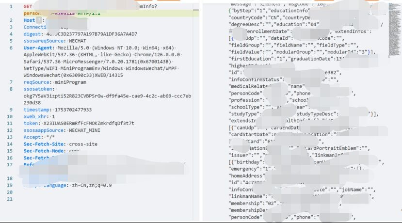

#### **案例三（js逆向实现的越权）**

在测试某个edu证书站时的真实案例，在实现测试注册登入后，我们发现在存放用户的订单位置存在对传入的data参数的加密，由于加密不知道里面存放的数据，通过逆向解密实现还原伪造

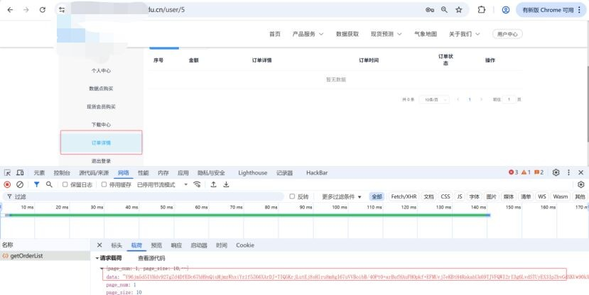

首先第一步我们需要通过先定位接口的位置，通过抓包查看到接口为user/getOrderList，下面通过右键top来进行全局查询

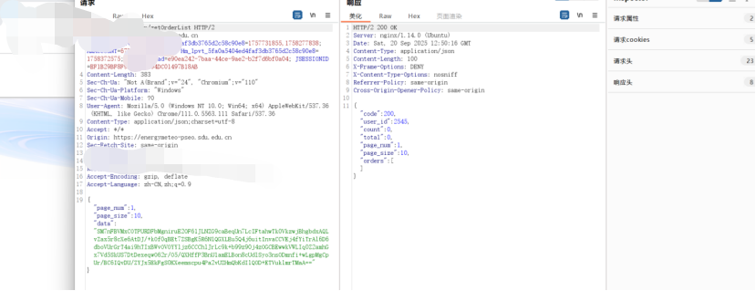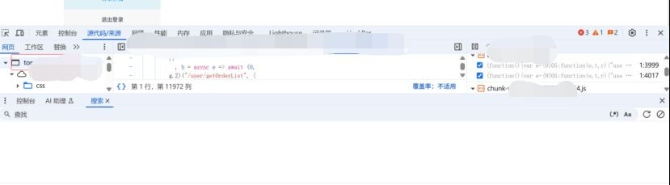

下面定位到发包的位置，初步判断一下加密的是在该断点前还是后

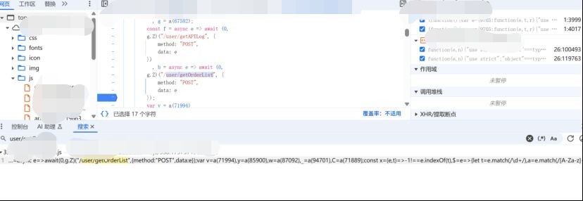

我们断了后发现这里的e已经为加密的数据了，所以我们就需要看右下角的调用堆进行往前找

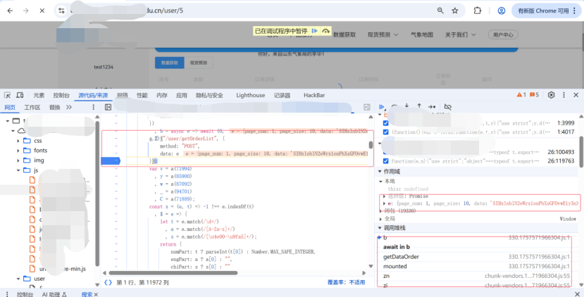

来到getDataOrder方法我们可以看到其发包e的值就是从这里传入，但是当前的data值为我们userId以及\*\*和phone的拼接的加密，但是我们还需要继续往后跟进到(0,\_,KT)里面看加密流程，我们步进就有了新发现

我们来到这段代码，key我隐藏了

```
94701: function(e, t, r) {
            "use strict";
            r.d(t, {
                KT: function() {
                    return i
                },
                mr: function() {
                    return n
                }
            });
            var a = r(66681);
            const n = (e=null, t="{y}-{m}-{d} {h}:{i}:{s}") => {
                if (null === e)
                    return null;
                10 === (e + "").length && (e = 1e3 * +e);
                const r = "object" === typeof e ? e : new Date(e)
                  , a = {
                    y: r.getFullYear(),
                    m: r.getMonth() + 1,
                    d: r.getDate(),
                    h: r.getHours(),
                    i: r.getMinutes(),
                    s: r.getSeconds(),
                    a: r.getDay()
                };
                return t.replace(/{(y|m|d|h|i|s|a)+}/g, ( (e, t) => {
                    let r = a[t];
                    return "a" === t ? ["日", "一", "二", "三", "四", "五", "六"][r] : e.length > 0 && r < 10 ? "0" + r : r || 0
                }
                ))
            }
              , i = e => {
                const t = "-----BEGIN PUBLIC KEY-----xxxxxx-----END PUBLIC KEY-----"
                  , r = new a.Z;
                return r.setPublicKey(t),
                r.encrypt(e)
            }
        }
```

这里首先分析下面的代码的作用是将i函数映射到KT上，n函数映射到mr

```
KT: function() {
      return i
},
mr: function() {
      return n
}
```

```
这段代码
i = e => {
                const t = "-----BEGIN PUBLIC KEY-----sasasasas-----END PUBLIC KEY-----"
                  , r = new a.Z;
                return r.setPublicKey(t),
                r.encrypt(e)
            }
类似

function i(e) { setPublicKey(...); return encrypt(e); }
```

到这里我们就获取了key的值，这个是public key，大致可以知道为rsa加密逻辑，由此我们便可以通过rsa来还原加密从而伪造 下面为加密脚本，实现越权

```
import base64
from Crypto.PublicKey import RSA
from Crypto.Cipher import PKCS1_v1_5


def rsa_encrypt(public_key_str, message):
    """
    使用RSA公钥加密消息

    :param public_key_str: Base64编码的公钥主体字符串（无头尾）
    :param message: 要加密的消息
    :return: 加密后的Base64编码字符串
    """
    try:
        # 拼接成标准PEM格式公钥
        pem_key = f"-----BEGIN PUBLIC KEY-----
{public_key_str}
-----END PUBLIC KEY-----"

        # 导入公钥
        public_key = RSA.import_key(pem_key)

        # 创建加密器（使用 OAEP 填充）
        cipher = PKCS1_v1_5.new(public_key)

        # 加密消息
        encrypted_message = cipher.encrypt(message.encode('utf-8'))

        # 返回Base64编码的加密结果
        return base64.b64encode(encrypted_message).decode('utf-8')

    except Exception as e:
        return f"加密过程中出现错误: {str(e)}"


# 示例使用
if __name__ == "__main__":
    # 你的公钥（主体部分）
    public_key = """xxxxx"""

    # 要加密的消息
    message = "xxx**xxx'"
#'xx**xx'
    # 加密
    encrypted = rsa_encrypt(public_key, message)

    print("原始消息:", message)
    print("加密后的结果(Base64):", encrypted)
```

### **未授权漏洞**

未授权漏洞我认为可以说是另外一种越权，相当于从没有权限变为有权限的垂直越权，主要还是由于未鉴权引起的，如果想遇到它，我想必须在前期做好信息收集的准备，未鉴权接口就是绕过登入限制的一种方法

#### **案例一(未授权接口实现的越权操作)**

下面的案例是在挖掘某证书站时遇到的，利用不难，主要是需要收集好接口信息

在某学校的资产中，我找到几处接口，通过不断摸索发现其就是查看资源状态的一处接口，具体的效果如下，其中包括资源的发布人 发布时间以及对应资源的状态信息如是否上线等

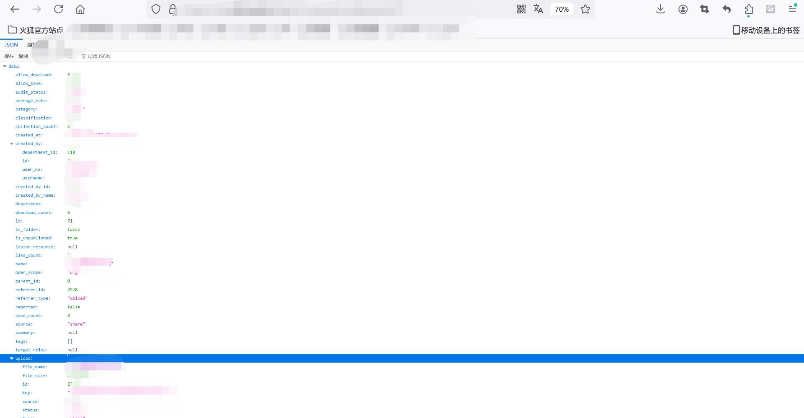

我们查看对应的资源与上面的信息呈现出来是一样的

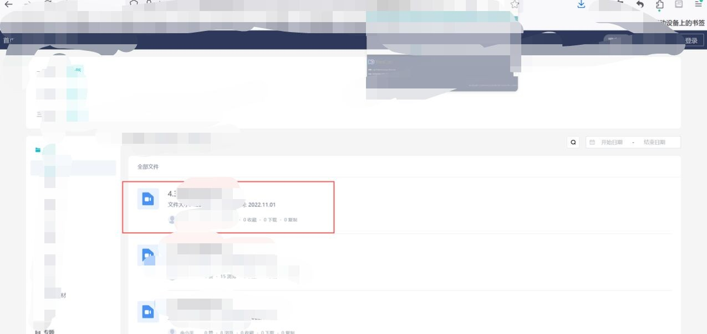上面还不足以实现未授权，真正的突破点就在不同的方法请求时，常见的请求方式有GET/POST以及常用的DELETE/PUT方法，通过返回结果就发现我们是有希望的

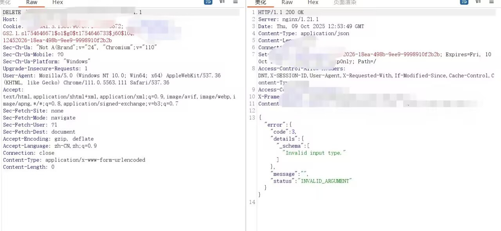

通过不断修改真正实现将对应资源下架，以及通过其它接口实现资源上线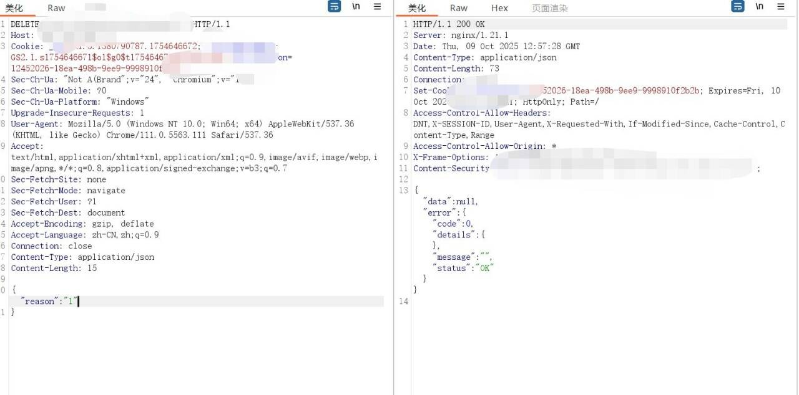

#### **案例二(前端校验导致的认证绕过)**

在对于访问后，后端页面部分一闪而过的情况，我们拦截响应包并修改实现一个欺骗或许会有不错的结果

目标依旧需要登入，但是我们依旧无法获取账号

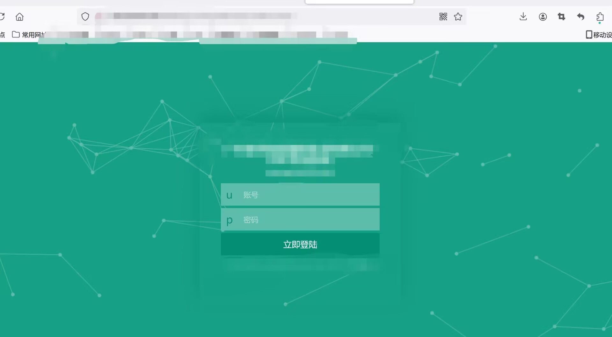开启拦截，拦截返回包

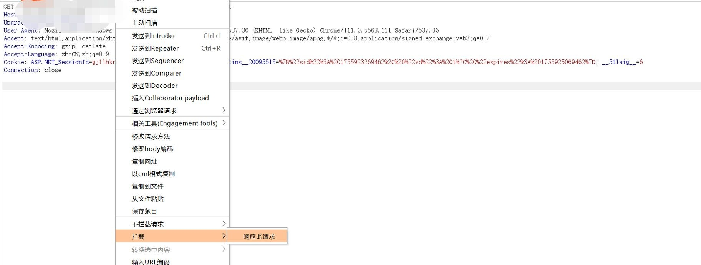 接下来放包即可，找到我们涉及鉴权的地方，这里它的鉴权比较特殊，通过后端返回响应包中的js一部分代码，对一段时间后进行身份认证，如果我们直接去除或者添加延长时间同样可以达到对应效果

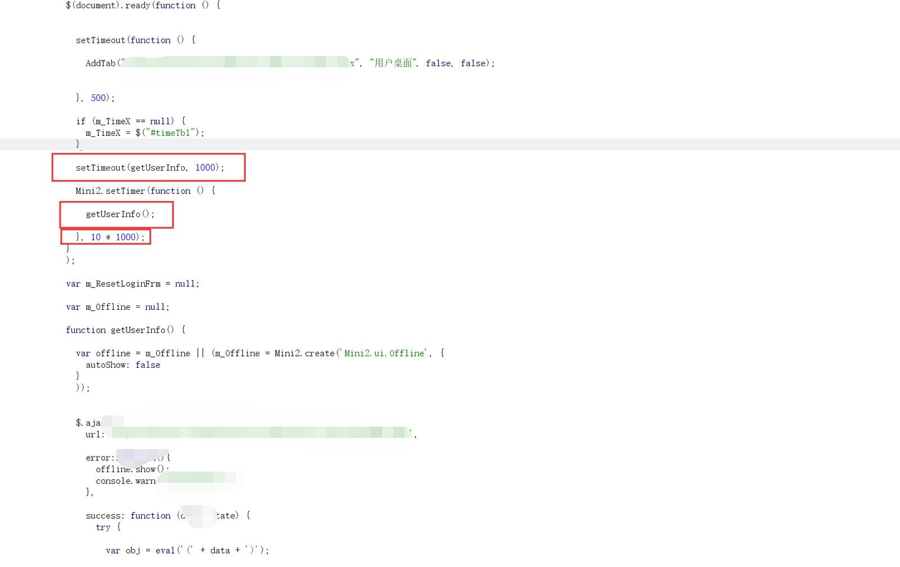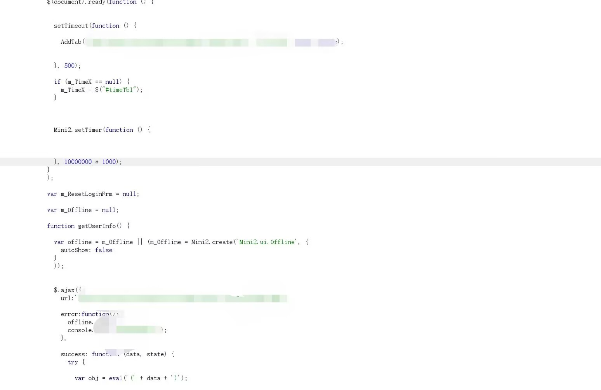 最后放包即可进入系统后台，以管理员身份实现对数据的增删查改等，以及获取近几年所有的订单信息，以及对应的其它漏洞如sql注入与xss等

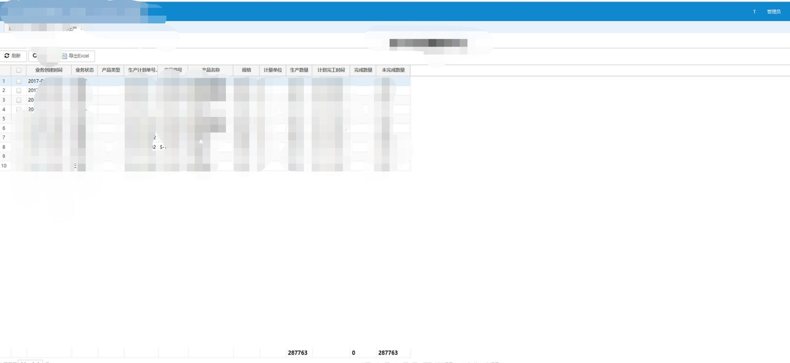

### **SQL注入漏洞**

面试官喜欢面sql server如何注入是有原因的，下面就分享两个实战中的sql server注入

#### **案例一(从注入到rce 回显带出)**

攻防中对于勤劳的人总会有收获，在实现某一政府单位的系统撕口子时，发现存在一个较为新的系统站，并且可以实现注册登入，在一处接口中我们可以添加人员信息，但是对json参数进行单引号闭合时发现报错，后面在不断尝试后发现其为sel server注入，并且可以实现堆叠注入

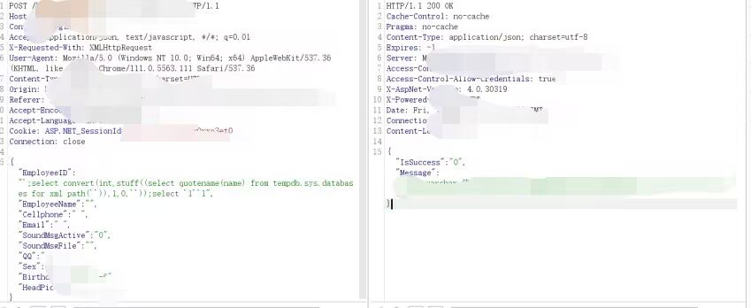下面就是通过xp\_cmdshell实现rce，由于该主机为mysql低权限以及windows主机，许多命令都无法正常调用，curl命令正常回显存在记录

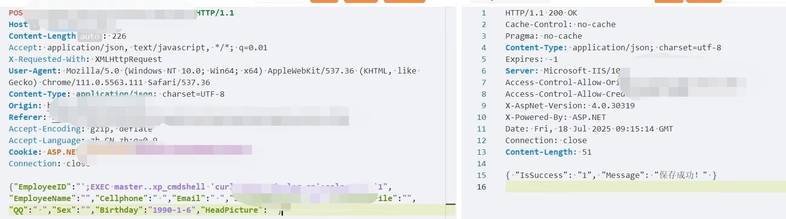最后实现命令外带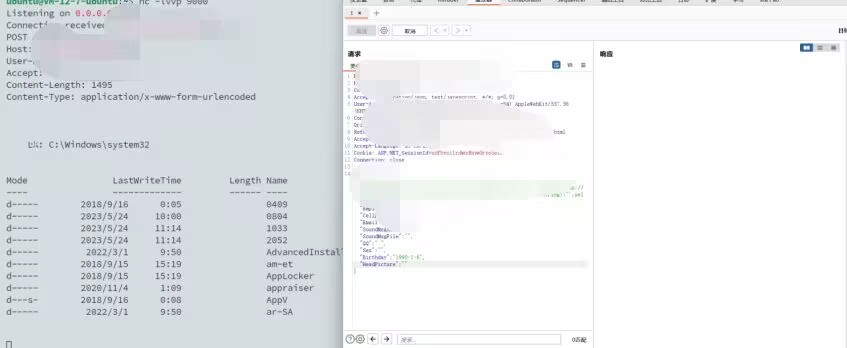

#### **案例二(从响应结果中出来的布尔盲注)**

下面是在渗透测试某一系统时的结果，日常查看拦截记录

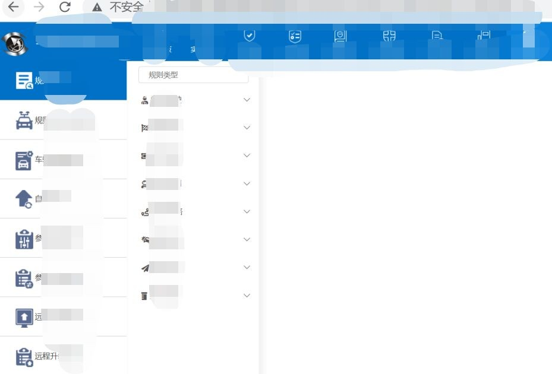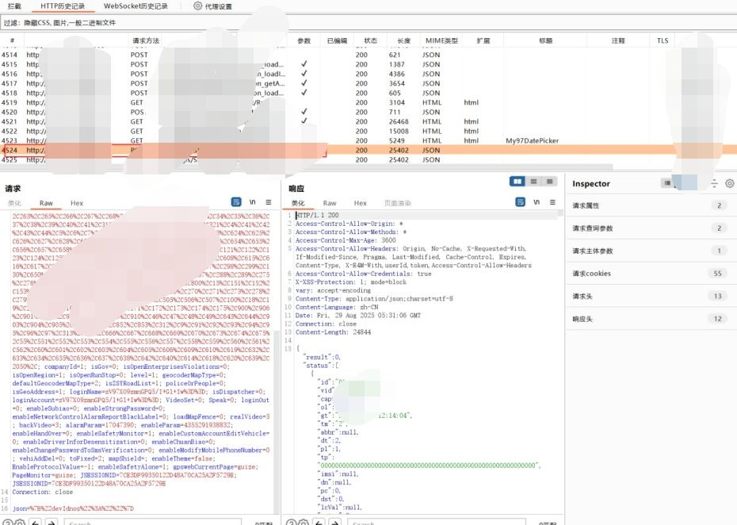

对上面的接口解码后，对传入的参数进行不同个数的单引号测试时，双单和单个回显的结果是不一样的

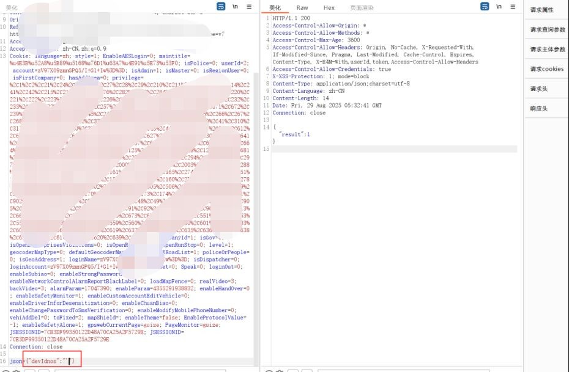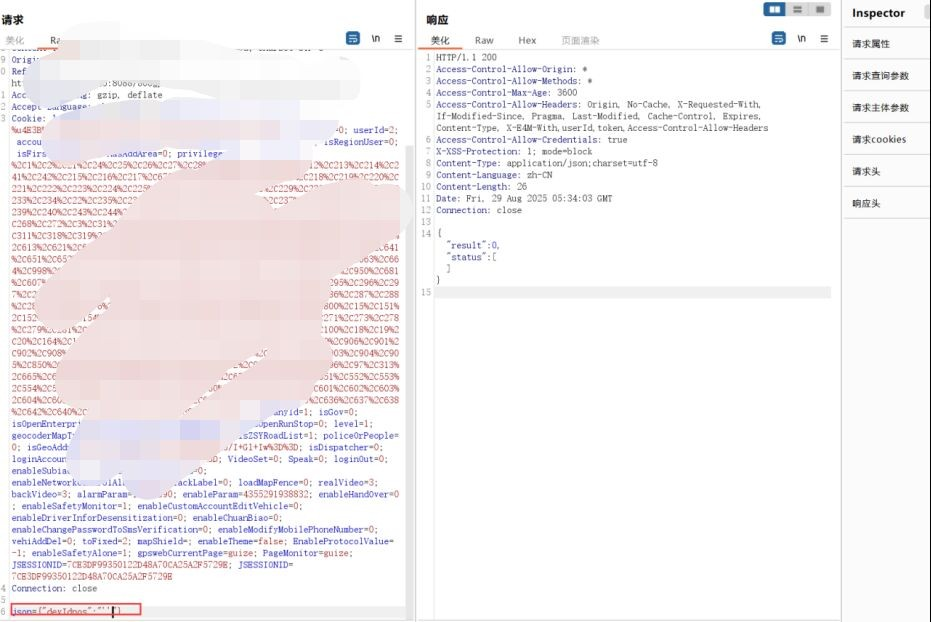

很显然它并不是偶然，可能报错信息被防火墙或者代码层拦截了导致我们无法查看报错回显，下面通过回显不同打一个布尔盲注，好在整形溢出还是能行介于709与710之间，最后打一个模糊匹配实现注入

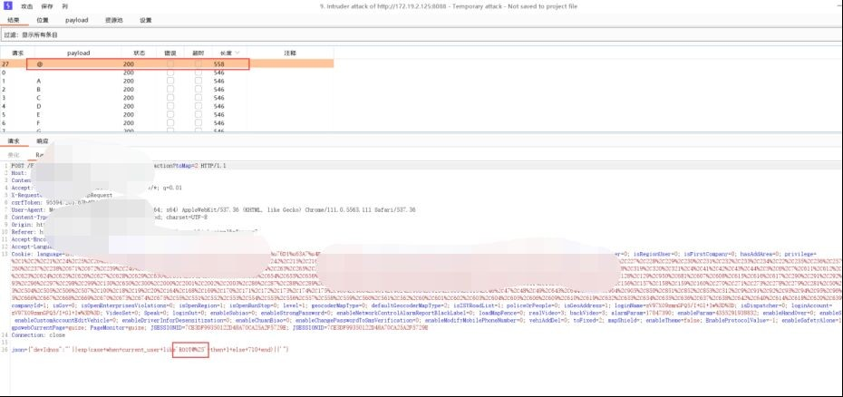

### **XSS漏洞**

xss漏洞是最为简单的，不同的payload对应不同的情景，而漏洞点的挖掘可以是任意可修改的地方以及文件上传导致xss，多试一试总会有的

#### **案例一（通用型多网站下的xss绕过）**

对与最开始的试探最好通过h1标签，它是最温和的，其次才是一些payload，基于不同waf下的检测，下面的案例是通用型edu站的不同形式

最为简单的必然为script标签带来的弹窗，一般是基于没有waf的站点

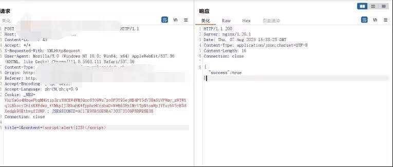

而如果禁用的script，以及一些敏感的字符串可以通过编码优先绕过，或者fuzz加绕黑名单等

​

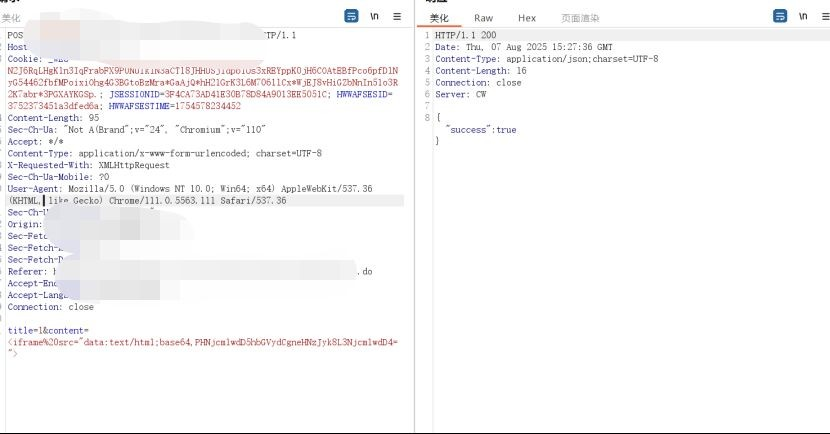

最后是基于waf本身的特性实现绕过，多次尝试后终于通过下面的payload实现绕过

<a %

herf="javascript:alert('a')">aa</a>

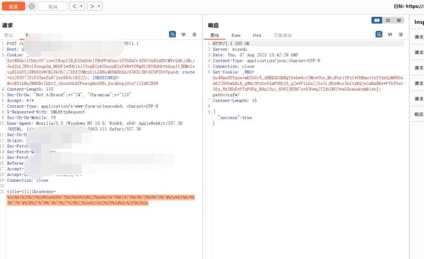

#### **案例二（文件上传导致的XSS）**

一般情况下很多文件是传入特定的存储桶或者特定目录，在无法getshell时可以尝试是否可以上传html svg文件等，下面的案例由于对文件后缀格式校验，所以通过上传xml文件实现的xss

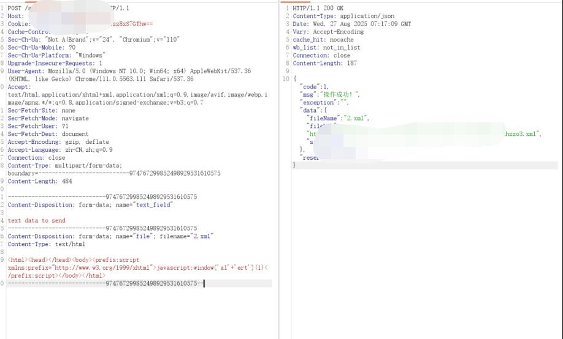页面正常解析，并弹窗

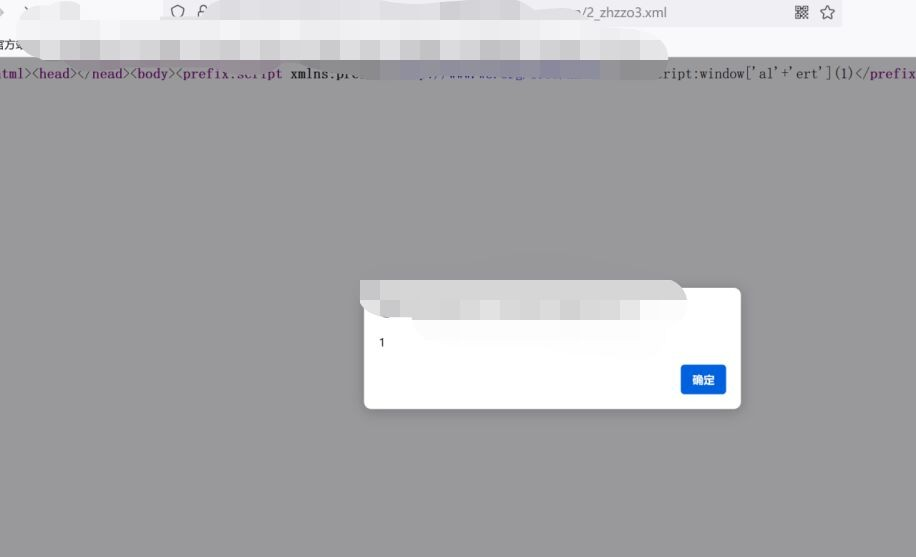

## 总结

漏洞挖掘不是一个一蹴而就的过程，每一次积累、新的思考以及新的尝试可能都是可以破局的关键，一些漏洞开始难挖真正遇到后慢慢在积累中就熟悉了，对于不同的情景、不同的功能点当用心去感悟它将成为你破局的关键，希望师傅们可以每日产高危
