# 某项目管理系统审计-先知社区

> **来源**: https://xz.aliyun.com/news/19134  
> **文章ID**: 19134

---

## 权限绕过

LoginFilterFront过滤器处理jsp、html、do后缀文件

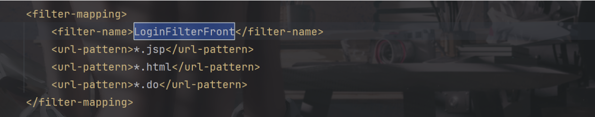

LoginFilterFront中定义了白名单路径

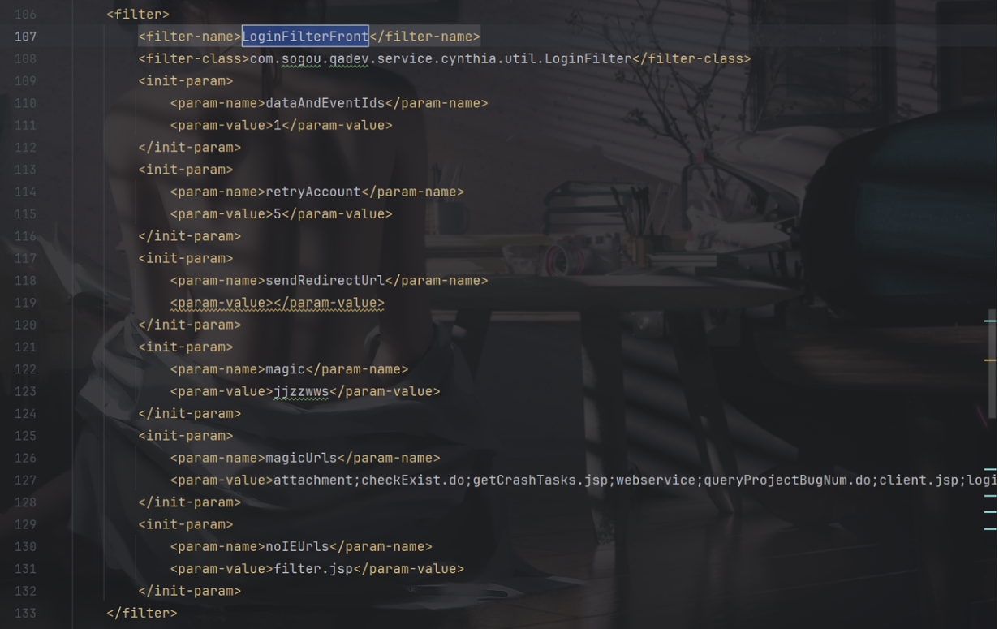

```
## magicUrls
attachment;checkExist.do;getCrashTasks.jsp;webservice;queryProjectBugNum.do;client.jsp;login;cleanSession.do;register;executeFilter.jsp;getCrashTasks.jsp;login.jsp;register.jsp;logout.do;logout.jsp
```

使用getRequestURI获取路径和白名单比对，所以可以轻松绕过权限鉴定

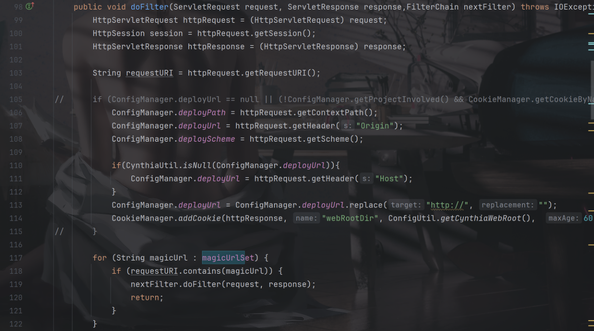

比如：

```
/index.html;login.jsp
/login.jsp/..;/index.html
```

## 邮箱获取用户密码

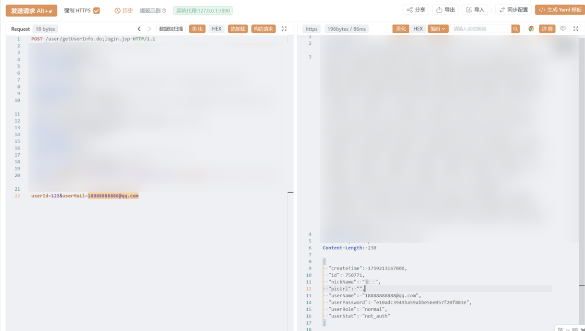

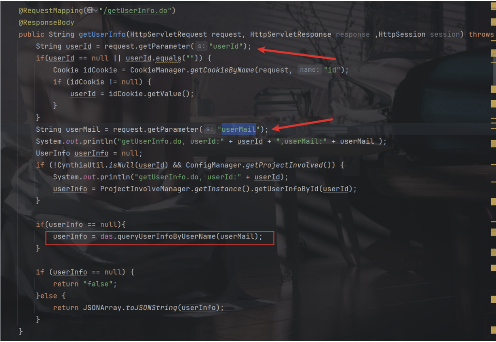

一路跟到queryUserInfoByUserName

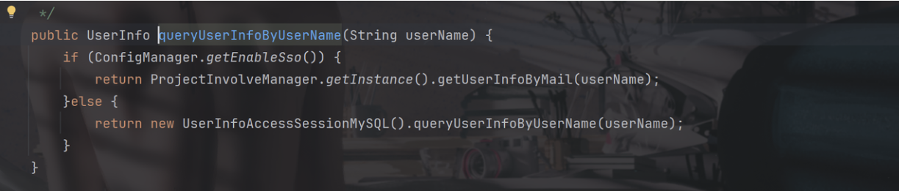

可以sso.enable是flase

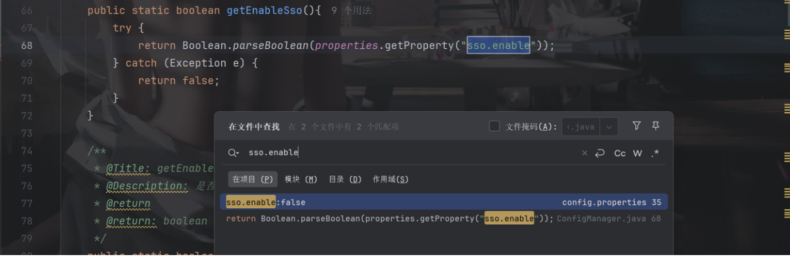

所以，走到UserInfoAccessSessionMySQL().queryUserInfoByUserName(userName)

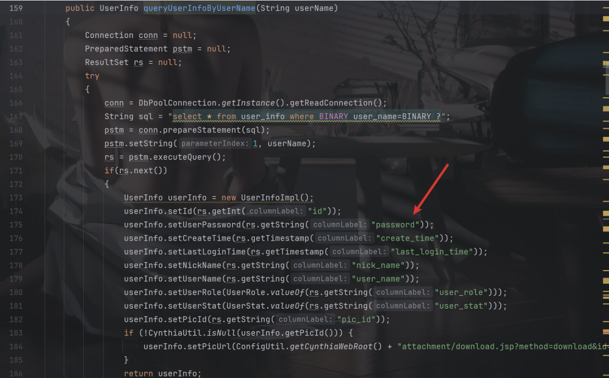

返回的信息包含用户密码

## 修改用户状态

默认注册后的用户无法直接登录


修改用户状态即可登录成功

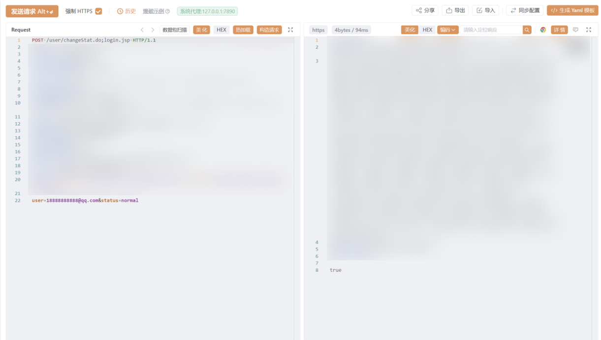

分析

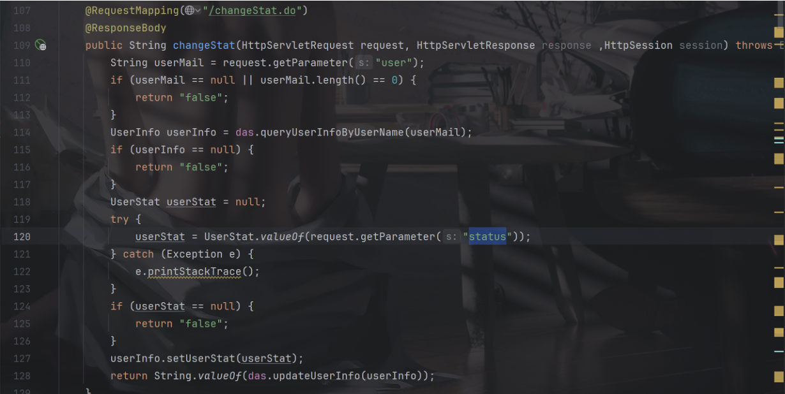

## 越权查询所有用户信息

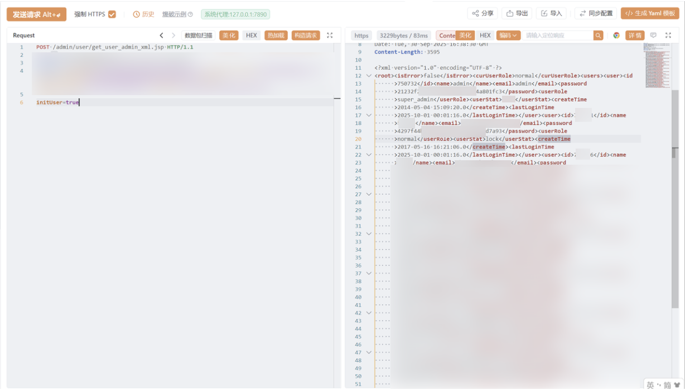

需要cookie，可以注册账号，通过前边的逻辑漏洞直接修改状态即可登录

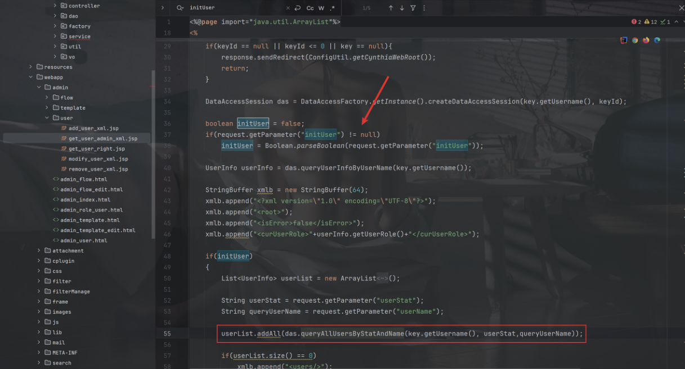

这块回去查询用户信息，不传入userStat和userName参数，这块就可以查询所有用户信息返回

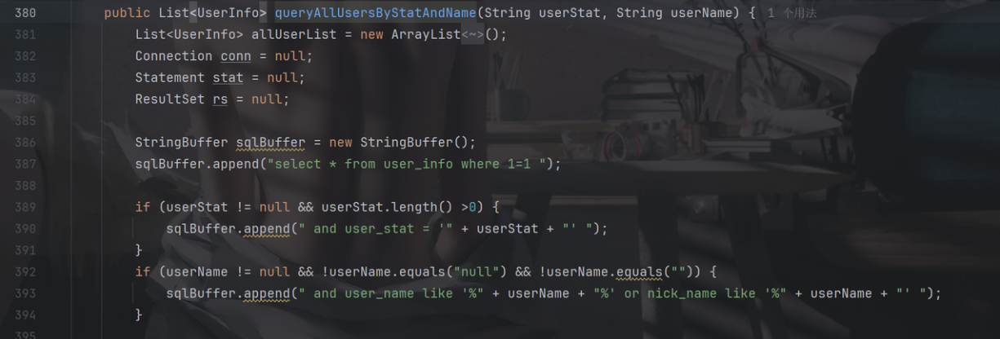

## sql注入

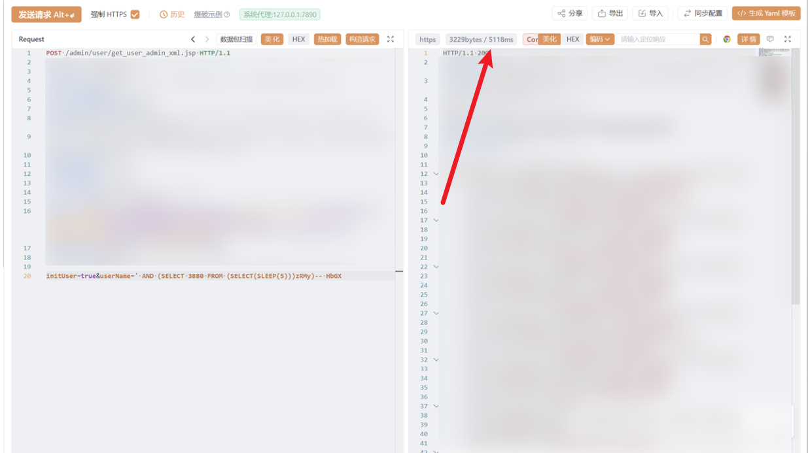

还是上边的点，可以发现有**userName拼接**sql注入

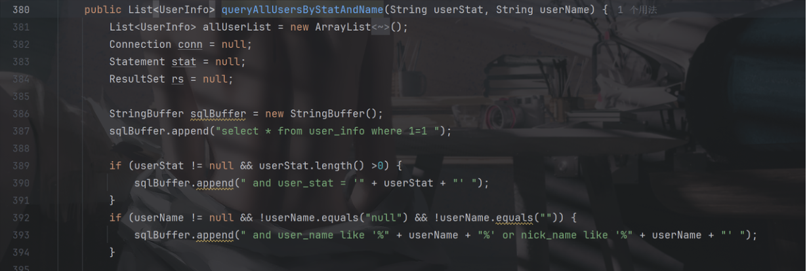
