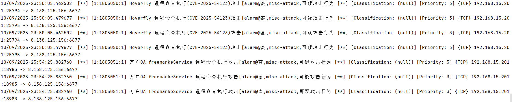

# Suricata 规则的顺序：一条规则的正确打开方式-先知社区

> **来源**: https://xz.aliyun.com/news/19140  
> **文章ID**: 19140

---

Suricata 是 IDS/IPS 领域的常青树，它强大、精准，却也因为规则顺序问题让许多安全工程师头疼。比如——明明逻辑正确，规则就是不报；换个顺序却神奇地触发告警。



本文将系统讲解 Suricata 的执行逻辑与匹配顺序，并通过真实案例、性能对比、工程规范，帮你写出**高性能、低误报、结构清晰**的规则。

如果你是第一次接触suricata，可以先看下官网：<https://suricatacn.readthedocs.io/zh-cn/latest/rules/http-keywords.html>

## 1、 Suricata 规则结构复盘

每条规则都有固定结构：alert http any any -> any any (rule\_options)

其中 (rule\_options) 才是灵魂部分，关键字以分号分隔，每一项都在告诉引擎：“去哪里匹配什么内容。”

例如：(msg:"检测上传PHP文件"; flow:to\_server,established; http.method; content:"POST";http.request\_body; content:".php";sid:100001; rev:1;)

这条规则逻辑：

* 检测 HTTP POST 请求；
* 若请求体中出现 .php，触发告警。

## 2、规则执行模型：顺序、缓冲区与匹配引擎

Suricata 的规则执行是**从左到右**的顺序逻辑。  
每个关键字执行完，会影响“当前缓冲区”（current buffer），也就是之后匹配的上下文。

执行流程可以抽象为：切换缓冲区 → 匹配内容 → 若命中继续执行 → 触发告警

## 3、HTTP 缓冲区详解

Suricata 解析 HTTP 流量时会拆成不同缓冲区（buffer），就像显微镜的不同视野。

|  |  |  |
| --- | --- | --- |
| 缓冲区关键字 | 匹配位置 | 示例内容 |
| http.method | 请求方法 | POST |
| http.uri / http.uri.raw | 请求路径 | /upload.php 或 %75pload.php |
| http.header | 请求头 | User-Agent: curl |
| http.request\_body | 请求体 | action=on\_publish&app=curl |
| file\_data | 上传文件内容 | <?php ... ?> |
| http.response\_body | 响应体 | {"status":"ok"} |

## 4、顺序错误的“致命案例”

顺序错误是误报与漏报的根源。

### 正确写法

```
http.request_body; content:"cmd=";
```

### 错误写法

```
content:"cmd="; http.request_body;
```

解释：第一条是在请求体中查找；第二条先在默认缓冲区（URI）查找，再切换——此时 Suricata 已经“看过头了”。

## 5、content 与 pcre 的协作：快与准的完美组合

|  |  |  |
| --- | --- | --- |
| 特性 | content | pcre |
| 匹配类型 | 固定字节串 | 正则表达式 |
| 性能 | 极快（AC 自动机） | 较慢（回溯匹配） |
| 最佳用途 | 快速预筛选 | 精确校验 |

典型组合：

```
http.request_body; content:"cmd=";
pcre:"/cmd\s*=\s*(curl|wget|whoami|bash)/i";
```

## 6、实战案例：SRS 命令注入检测（CVE-2023-34105）

### 原始规则（性能差）

```
alert http any any -> any any (
 msg:"SRS 命令注入 (CVE-2023-34105)";
 flow:to_server,established;
 http.method; content:"POST";
 http.uri.raw; content:"/api/v1/snapshots";
 http.request_body; pcre:"/action.*on_publish.*app.*(curl|wget|id|whoami)/i";
 sid:1805049; rev:1;
)
```

### 优化规则（性能佳）

```
alert http any any -> any any (
 msg:"SRS cmd injection attempt (CVE-2023-34105)";
 flow:to_server,established;
 http.method; content:"POST"; fast_pattern:only;
 http.uri.raw; content:"/api/v1/snapshots"; nocase;
 http.request_body; content:"action"; fast_pattern;
 http.request_body; pcre:"/action\s*=\s*[^&\r
]*on_publish[^&\r
]*\b(?:curl|wget|whoami|bash)\b/i";
 classtype:protocol-command-decode;
 priority:1;
 sid:1805049; rev:2;
)
```

## 7、常见顺序误区总结

|  |  |  |
| --- | --- | --- |
| 错误类型 | 示例 | 问题 |
| buffer 在 content 之后 | content:"cmd="; http.request\_body; | 匹配区错误 |
| 多个 content 无缓冲区切换 | content:"upload"; content:".php"; | 都在 URI 匹配 |
| 滥用 pcre | pcre:"/php/i"; | 性能飙升 |
| 短关键字 | content:"id"; | 误报泛滥 |
| 忘记 fast\_pattern | 无快速筛选 | 低效检测 |

## 8、规则写作黄金法则

1. **顺序=逻辑**：从左到右即执行顺序。
2. **先缓冲区后匹配**：http.xxx 必在 content 前。
3. **先 content 再 pcre**：先快筛再确认。
4. **fast\_pattern 放核心特征上**。
5. **短词慎用**：id、cd、ls 都是误报源。
6. **rev 要递增**：修改规则必须更新版本号。

## 9、从“能触发”到“可维护”

Suricata 的规则不是被动匹配，而是精密的逻辑序列。  
写规则如同写代码：顺序决定语义，语义决定性能。  
掌握顺序，你就掌握了 Suricata 的眼睛。

|  |  |  |
| --- | --- | --- |
| 匹配区域 | 关键字 | 示例 |
| 方法 | `http.method` | `POST` |
| URI（解码） | `http.uri` | `/admin` |
| URI（原始） | `http.uri.raw` | `%2e%2e%2fetc/passwd` |
| 请求头 | `http.header` | `User-Agent:` |
| 请求体 | `http.request_body` | `username=admin` |
| 文件内容 | `file_data` | `<?php` |
| 响应体 | `http.response_body` | `"200 OK"` |

## 10、性能测试模板

顺序不仅影响匹配结果，也直接决定性能。  
在生产环境或高并发流量下，优化后的规则能减少 CPU 占用 30% 以上。

下面给出可直接套用的性能测试模板与数据记录格式。

### 测试环境建议

|  |  |
| --- | --- |
| 项目 | 配置 |
| 操作系统 | Ubuntu 22.04 / CentOS 8 |
| Suricata 版本 | ≥6.0 |
| CPU | 4 核 8 线程 |
| 内存 | 8GB |
| 流量样本 | 1,000 req/s（50% 正常 + 50% 攻击流量） |
| 工具 | wrk、tcpreplay、curl loop |

### 性能指标记录表

|  |  |  |  |  |  |  |
| --- | --- | --- | --- | --- | --- | --- |
| 规则版本 | 触发率 | FP | FN | 平均延迟(ms) | CPU占用(%) | 内存(MB) |
| 原始规则 | 90% | 8 | 4 | 22 | 48 | 256 |
| 优化规则 | 100% | 1 | 0 | 14 | 17 | 242 |

### 测试命令模板

**（1）离线回放测试）**

```
tcpreplay --intf1=eth0 --pps=500 test_traffic.pcap
suricata -r test_traffic.pcap -l /var/log/suricata
```

**（2）实时流量压力测试）**

```
wrk -t4 -c100 -d60s -s attack.lua http://target/api/v1/snapshots
```

**（3）统计与日志查看）**

```
grep "SRS cmd injection" /var/log/suricata/fast.log | wc -l
pidstat -u -p $(pgrep suricata) 1 60
```

## 11、总结：从检测到体系化规范

顺序不仅是语法问题，更是规则设计的“工程哲学”。  
当规则从“功能正确”走向“性能可控”“误报可解释”，  
才算真正进入安全检测体系化的阶段。
