# Windows剪贴板历史记录逆向分析与数据提取技术研究 -先知社区

> **来源**: https://xz.aliyun.com/news/19143  
> **文章ID**: 19143

---

`太长不看`: 移步至总结及效果

从win10开始windows加入了剪贴板功能 可以通过win+V调出


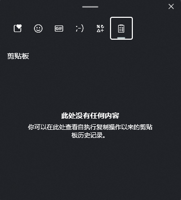

其上限是25个 除非手动固定 不然会按历史删除旧条目, 关机会丢失除外固定的其它条目

该功能是默认禁用的 我们可以通过修改相关注册表来打开`HKEY_CURRENT_USER\Software\Microsoft\Clipboard\EnableClipboardHistory`

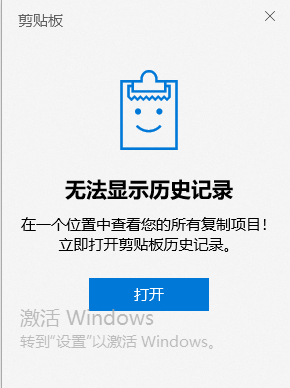

接下来我们尝试逆一下剪贴板 想办法让后渗透的时候可以获取剪贴板历史数据

# 失败的尝试

以下逆向过程环境为win11 22000 和 win10 18362, 调内核的时候是win10 可能看着会比较混乱

`CBDHSvc.dll`该dll负责windows剪贴板历史记录相关信息

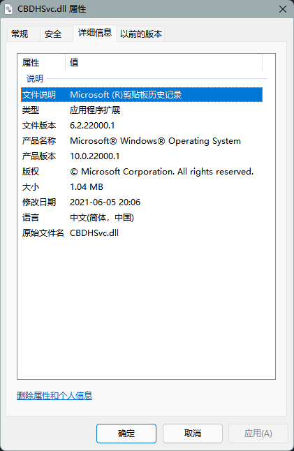

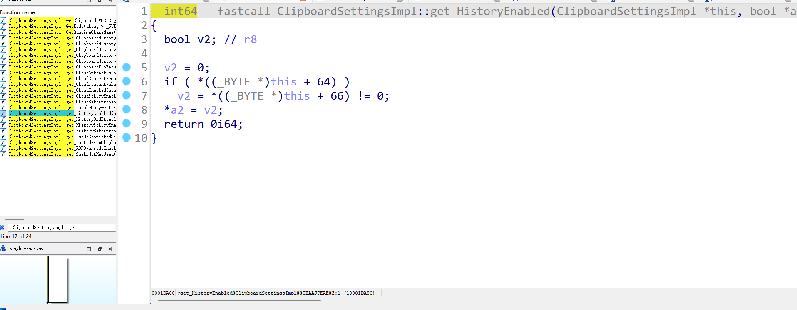

需要同时开启结构的64 和 66才生效

其中64对应的是注册表

`HKEY_CURRENT_USER\Software\Microsoft\Clipboard\EnableClipboardHistory`

​

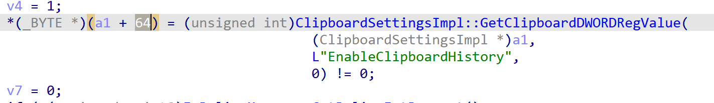

66对应的是组策略 默认是开启的

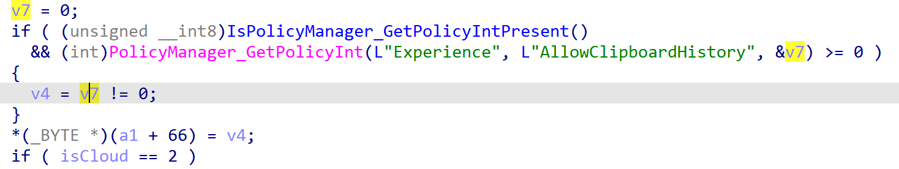

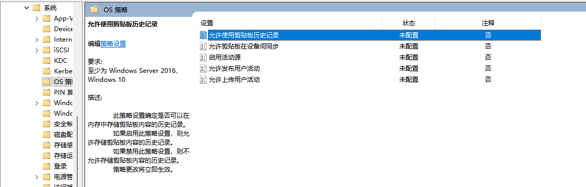

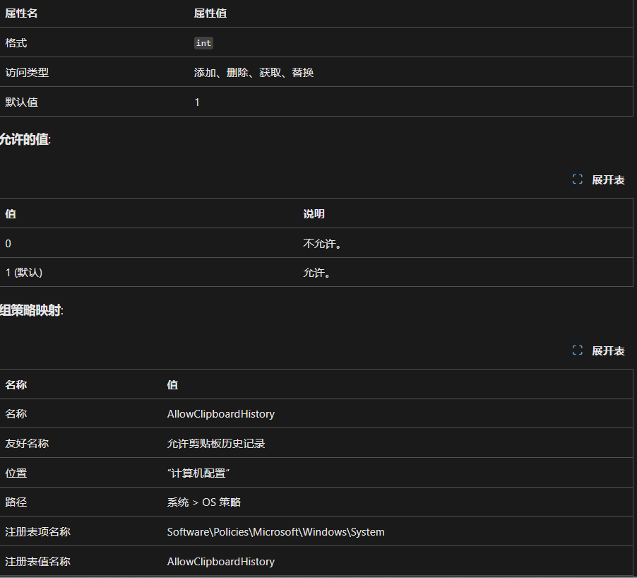

查询剪贴板相关资料可以知道winrt获取剪贴板的功能是在`Windows.ApplicationModel.DataTransfer.dll`中的

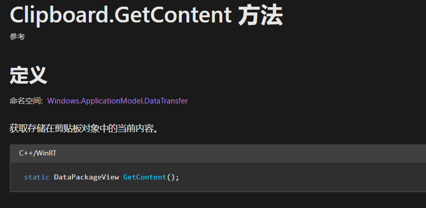

直接ida去搜

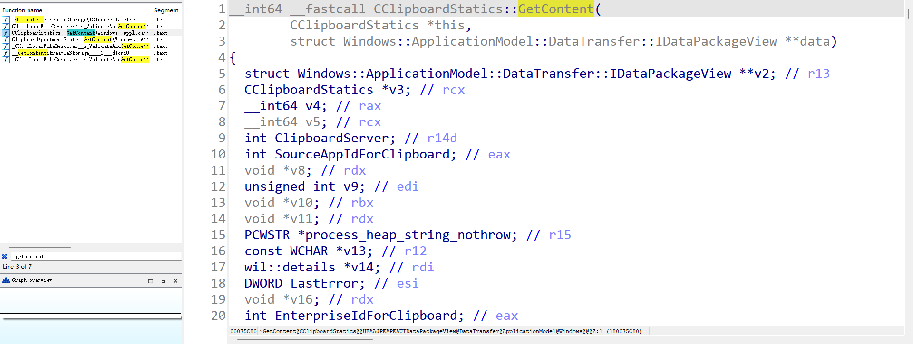

这块没逆出来什么东西 就不多说了

继续跟到ole.dll!`OleGetClipboard`

一路往下跟进win32k

# 进win32k

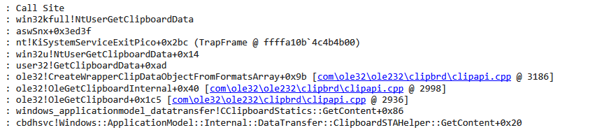

```
WinRT Clipboard::GetContent()
  → OleGetClipboard()
    → OleGetClipboardInternal()
      → CreateWrapperClipDataObjectFromFormatsArray()
        → CClipDataObject::Create()
          → CClipDataObject::GetData()
            → CClipDataObject::OleGetClipboardData()
              → user32.dll!GetClipboardData()  
                  → NtUserGetClipboardData()
```

最终能跟出的链如上 进内核了

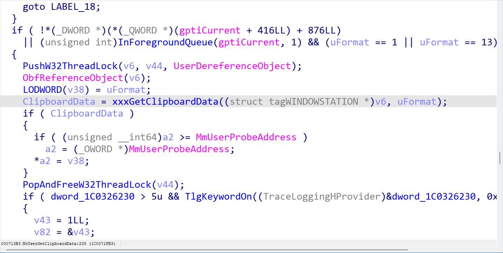

`win32kfull!xxxGetClipboardData`

这块直接看leak的xp源码

```
HANDLE xxxGetClipboardData	( 	PWINDOWSTATION 	pwinsta,
UINT 	fmt,
PGETCLIPBDATA 	gcd
) 	{
    PCLIP  pClip;
    HANDLE hData;

    /*
     * Check the clipboard owner.
     */
    if (pwinsta->ptiClipLock != PtiCurrent()) {
        RIPERR0(ERROR_CLIPBOARD_NOT_OPEN, RIP_VERBOSE, "GetClipboardData: clipboard not open");
        return NULL;
    }

    /*
     * Make sure the format is available.
     */
    if ((pClip = FindClipFormat(pwinsta, fmt)) == NULL) {
        RIPMSG1(RIP_VERBOSE, "Clipboard: Requested format 0x%lX not available", fmt);
        return NULL;
    }

    /*
     * If this is a DUMMY_META*_HANDLE it means that the other
     * metafile format was set in as a delay render format and we should
     * as for that format to get the metafile because the app has not told
     * us they now about this format.
     */
    if (IsMetaDummyHandle(pClip->hData)) {

        if (fmt == CF_ENHMETAFILE) {
            fmt = CF_METAFILEPICT;
        } else if (fmt == CF_METAFILEPICT) {
            fmt = CF_ENHMETAFILE;
        } else {
            RIPMSG0(RIP_WARNING,
                  "Clipboard: Meta Render/Clone expects a metafile type");
        }

        if ((pClip = FindClipFormat(pwinsta, fmt)) == NULL) {
            RIPMSG1(RIP_WARNING,
                  "Clipboard: Meta Render/Clone format 0x%lX not available", fmt);
            return NULL;
        }
    }

    /*
     * This is the data we're returning, unless it's a dummy or
     * render handle.
     */
    hData = pClip->hData;

    /*
     * We are dealing with non-handles.  Retrieve the real data
     * through these inline-routines.  NOTE: these make recursive
     * calls to xxxGetClipboardData().  So care must be taken to
     * assure the pClip is pointing to what we think it's pointing
     * to.
     */
    if ((hData == NULL) || (hData == DUMMY_METARENDER_HANDLE)) {

        hData = xxxGetRenderData(pwinsta, fmt);

    } else if (hData == DUMMY_DIB_HANDLE) {

        switch (fmt) {
        case CF_DIB:
            hData = xxxGetDummyDib(pwinsta, pgcd);
            break;
        case CF_DIBV5:
            hData = xxxGetDummyDibV5(pwinsta, pgcd);
            break;
        case CF_BITMAP:
            hData = xxxGetDummyBitmap(pwinsta, pgcd);
            break;
        case CF_PALETTE:
            hData = xxxGetDummyPalette(pwinsta, pgcd);
            break;
        }

    } else if (hData == DUMMY_TEXT_HANDLE) {

        hData = xxxGetDummyText(pwinsta, fmt, pgcd);
    } else {
        /*
         * This path took no callbacks, so we know pClip is OK.
         */
        if (pgcd)
            pgcd->fGlobalHandle = pClip->fGlobalHandle;

        return hData;
    }

    /*
     * The callbacks for dummy handle resolution have possibly
     * invalidated pClip -- recreate it.
     */

    if ((pClip = FindClipFormat(pwinsta, fmt)) == NULL) {
        RIPMSG1(RIP_VERBOSE, "Clipboard: Requested format 0x%lX not available", fmt);
        return NULL;
    }

    /*
     * Return if this is a global-handle.
     */
    if (pgcd)
        pgcd->fGlobalHandle = pClip->fGlobalHandle;

    return hData;
}
```

我们只关心文本的处理 跟进`xxxGetDummyText`

```
HANDLE xxxGetDummyText(
    PWINDOWSTATION pwinsta,
    UINT           fmt,
    PGETCLIPBDATA  pgcd)
{
    HANDLE hText;
    PCLIP  pClipT;
    UINT   uFmtMain;
    UINT   uFmtAlt;
    BOOL  bMain = TRUE;

    /*
     * Get the handle of the other text format available.
     */
    switch (fmt) {
    case CF_TEXT:
        uFmtMain = CF_UNICODETEXT;
        uFmtAlt  = CF_OEMTEXT;
        goto GetRealText;

    case CF_OEMTEXT:
        uFmtMain = CF_UNICODETEXT;
        uFmtAlt  = CF_TEXT;
        goto GetRealText;

    case CF_UNICODETEXT:
        uFmtMain = CF_TEXT;
        uFmtAlt  = CF_OEMTEXT;

GetRealText:

        if ((pClipT = FindClipFormat(pwinsta, uFmtMain)) == NULL)
            return NULL;

        if (pClipT->hData != DUMMY_TEXT_HANDLE) {

            if (xxxGetClipboardData(pwinsta, uFmtMain, pgcd))
                break;

            return NULL;
        }

        if ((pClipT = FindClipFormat(pwinsta, uFmtAlt)) == NULL)
            return NULL;

        if (pClipT->hData != DUMMY_TEXT_HANDLE) {
            bMain = FALSE;

            if (xxxGetClipboardData(pwinsta, uFmtAlt, pgcd))
                break;
        }

        /*
         * Fall through to return a dummy handle.
         */

    default:
        return NULL;
    }

    /*
     * Since xxxGetClipboardData leaves the critsect, we need to
     * reacquire pClipT.
     */

    pClipT = FindClipFormat(pwinsta, bMain? uFmtMain:uFmtAlt);

    if (pClipT == NULL) {
        RIPMSG1(RIP_WARNING,
              "Clipboard: GetDummyText, format 0x%lX not available", bMain? uFmtMain:uFmtAlt);
        return NULL;
    }

    /*
     * Return the type of the returned data.
     */
    pgcd->uFmtRet = pClipT->fmt;
    hText         = pClipT->hData;

    /*
     * Set the locale, since the text will need to be
     * converted to another format.
     */
    if(pClipT = FindClipFormat(pwinsta, CF_LOCALE)) {
        pgcd->hLocale = pClipT->hData;
    } else {
        pgcd->hLocale = NULL;
    }

    return hText;
}

```

核心调用`FindClipFormat`

```
PCLIP FindClipFormat	( 	PWINDOWSTATION 	pwinsta,
UINT 	format
) 	{
    PCLIP pClip;
    int   iFmt;

    if ((format != 0) && ((pClip = pwinsta->pClipBase) != NULL)) {

        for (iFmt = pwinsta->cNumClipFormats; iFmt-- != 0;) {

            if (pClip->fmt == format)
                return pClip;

            pClip++;
        }
    }

    return NULL;
}
```

跟了这么就终于是看见点东西了 本质是遍历CLIP数组

现在我们回头来看这个结构是哪儿来的

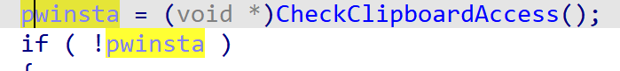

windbg下断看看

下面给的结构除外标注偏移的 其它都是老版本leak的 不一定准

```
typedef struct tagWINDOWSTATION {
    PWINDOWSTATION       rpwinstaNext;
    PDESKTOP             rpdeskList;

    PTERMINAL            pTerm;
    /*
     * Pointer to the currently active desktop for the window station.
     */
    DWORD                dwWSF_Flags;
    struct tagKL         *spklList; // 0x28

    /*
     * Clipboard variables
     */
    PTHREADINFO          ptiClipLock; //0x30 当前打开剪贴板的线程 PTHREADINFO
    PTHREADINFO          ptiDrawingClipboard;
    PWND                 spwndClipOpen; //48  剪贴板是否打开
    PWND                 spwndClipViewer; // 50
    PWND                 spwndClipOwner; // 58 上次调用 EmptyClipboard 的窗口
    struct tagCLIP       *pClipBase; // 60
    int                  cNumClipFormats; // 68
    UINT                 iClipSerialNumber;// 6c
    UINT                 iClipSequenceNumber;
    UINT                 fClipboardChanged : 1;
    UINT                 fInDelayedRendering : 1;

    /*
     * Global Atom table
     */
    PVOID                pGlobalAtomTable;

    LUID                 luidEndSession;
    LUID                 luidUser;
    PSID                 psidUser;
    PQ                   pqDesktop;

    DWORD                dwSessionId;

#if DBG
    PDESKTOP             pdeskCurrent;
#endif // DBG

} WINDOWSTATION;
```

其中tagKL定义

```
/*
* Keyboard Layout object
*/
typedef struct tagKL {   /* kl */
    HEAD          head;
    struct tagKL *pklNext;     // next in layout cycle
    struct tagKL *pklPrev;     // prev in layout cycle
    DWORD         dwKL_Flags;  // KL_* flags
    HKL           hkl;         // (Layout ID | Base Language ID)
    KBDFILE      *spkf;        // Keyboard Layout File
    DWORD         dwFontSigs;  // mask of FS_xxx bits - fonts that layout is good for
    UINT          iBaseCharset;// Charset value (Win95 compat) eg: ANSI_CHARSET
    WORD          CodePage;    // Windows Codepage of kbd layout, eg: 1252, 1250
    WCHAR         wchDiacritic;// Dead key saved here until next keystroke
    PIMEINFOEX    piiex;       // Extended information for IME based layout
} KL, *PKL;
```

`CF_UNICODETEXT`

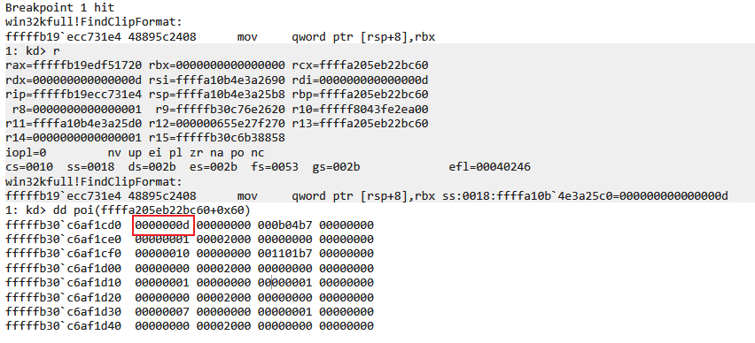

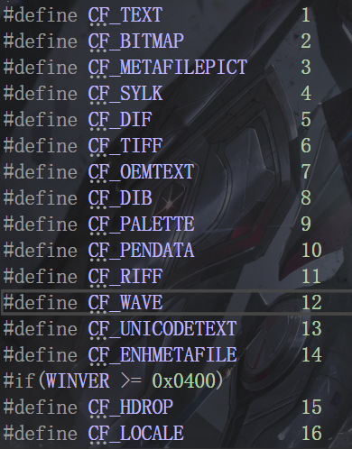

接下来解析数据

```
typedef struct tagCLIP {
    ULONG64    fmt;
    HANDLE  hData;
    BOOL    fGlobalHandle;
    ULONG64 unKnown;
}CLIP, *PCLIP;
```

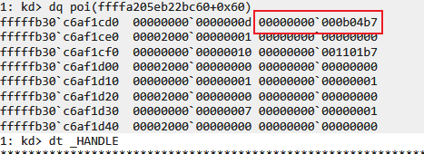

```
typedef struct tagGETCLIPBDATA
{
    UINT uFmtRet;
    BOOL fGlobalHandle;
    union
    {
        HANDLE hLocale;
        HANDLE hPalette;
    };
} GETCLIPBDATA, *PGETCLIPBDATA;
```

接着返回了句柄和uFormat 并且知道了这个是GlobalHandle 至此都没看见读取文本相关的信息 要回三环`GetClipboardData`了

其中调用了CreateLocalMemHandle分配内存 我们跟进去看看NtUserCreateLocalMemHandle的实现

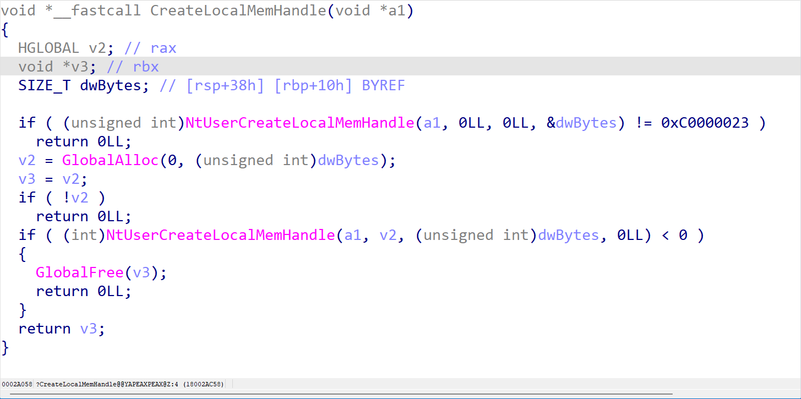

`NtUserCreateLocalMemHandle`

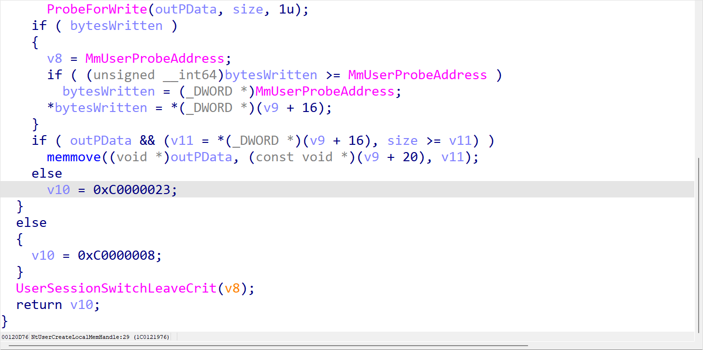

至此我们终于看见了内存复制相关的东西了

于是我们可以写出如下代码

1. 打开剪贴板
2. 直接调用NtUserGetClipboardData获取数据
3. 复制到R3地址

CreateLocalMemHandle的实现抄一下ida就行了

```
#include <windows.h>
#include <iostream>
#include <ole2.h>

typedef struct tagGETCLIPBDATA
{
    UINT uFmtRet;
    BOOL fGlobalHandle;
    union
    {
        HANDLE hLocale;
        HANDLE hPalette;
    };
} GETCLIPBDATA, * PGETCLIPBDATA;

typedef HANDLE(NTAPI* pNtUserGetClipboardData)(
    UINT fmt,
    PGETCLIPBDATA pgcd
    );

typedef NTSTATUS(APIENTRY* pNtUserCreateLocalMemHandle)(
    HANDLE 	hMem,
    LPVOID 	pData,
    DWORD64 cbData,
    DWORD* pcbData
    );


HMODULE win32udll = LoadLibrary(L"win32u.dll");
pNtUserGetClipboardData NtUserGetClipboardData = (pNtUserGetClipboardData)GetProcAddress(win32udll, "NtUserGetClipboardData");
pNtUserCreateLocalMemHandle NtUserCreateLocalMemHandle = (pNtUserCreateLocalMemHandle)GetProcAddress(win32udll, "NtUserCreateLocalMemHandle");


LPVOID CreateLocalMemHandle(HANDLE hMem) {
    DWORD dwBytes;
    // 先报错拿到size
    if (NtUserCreateLocalMemHandle(hMem, NULL, 0, &dwBytes) != 0xC0000023) {
        return 0;
    }
    // 分配内存
    HGLOBAL R3Mem = GlobalAlloc(0, dwBytes);
    if (!R3Mem) return 0;

    // 将hMem复制到R3内存
    if(NtUserCreateLocalMemHandle(hMem, R3Mem, dwBytes,0) < 0) {
        GlobalFree(R3Mem);
        return 0;
    }

    return R3Mem;
}

int wmain()
{
    
    OpenClipboard(NULL);
    GETCLIPBDATA data = { 0 };

    HANDLE hMem = NtUserGetClipboardData(CF_UNICODETEXT, &data);

    // 123456 test copy 123465

    if (data.fGlobalHandle)
    {
        LPVOID r3Mem = CreateLocalMemHandle(hMem);
        CloseClipboard();
        system("pause");

    }


    return 0;
}
```

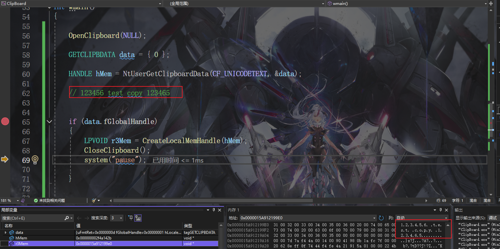

也就是说我们可以拿到当前剪贴板中的文本了 那么`NtUserGetClipboardData`是从哪儿复制来的呢? 如果是三环的话我们就有机会操作了

我们下断`HMValidateHandle` 运行到返回

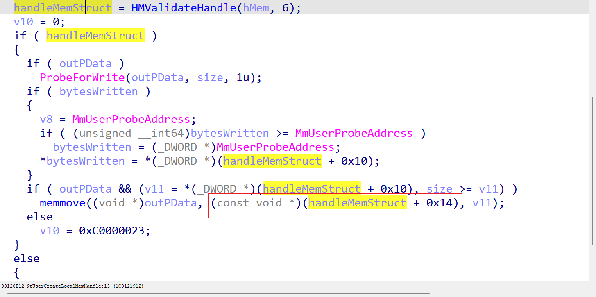

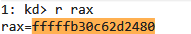

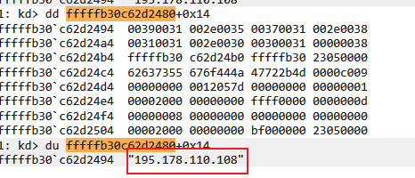

很遗憾是内核地址 并且handle我们没有渠道去拿 (HMValidateHandle有很多交叉引用 找一个参数可控的可以考虑爆破handle)

没辙了 上CE搜吧

# CE

那首先 随便打一串字符串去复制 然后在svchost里搜UNICODE(对应cbdhsvc的)

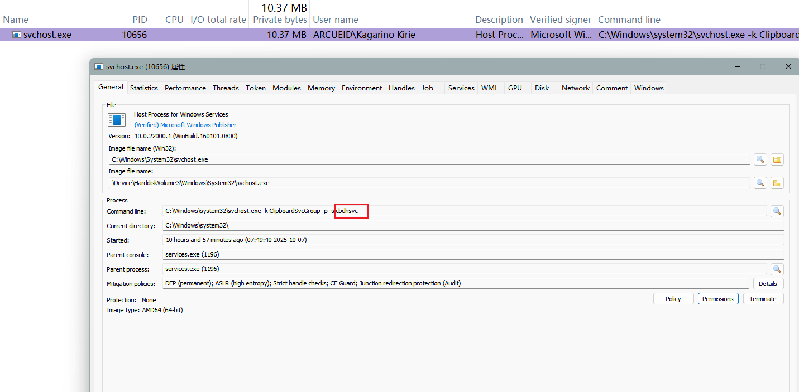

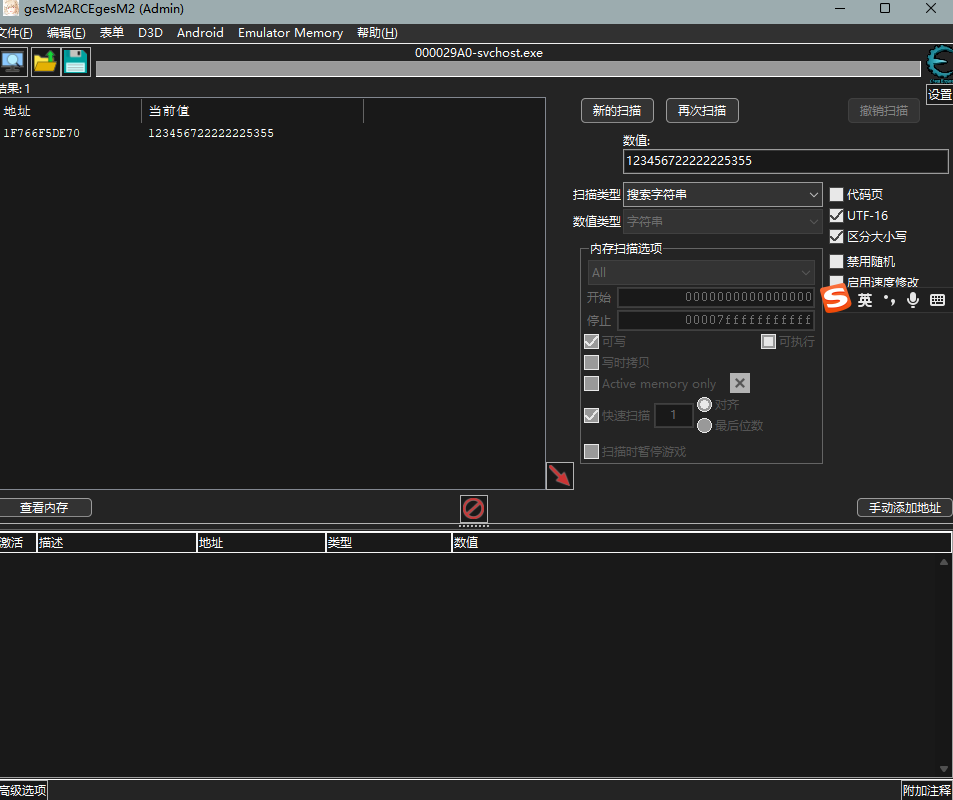

找出是什么访问的地址 然后win+v调出剪贴板

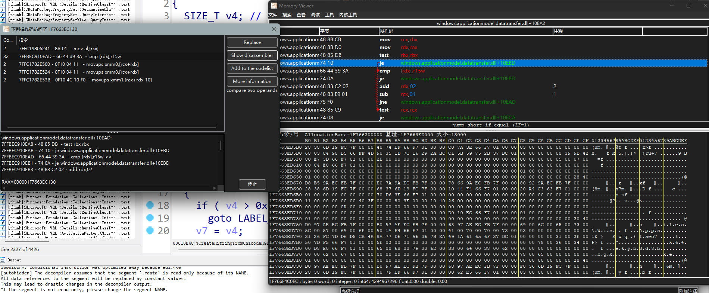

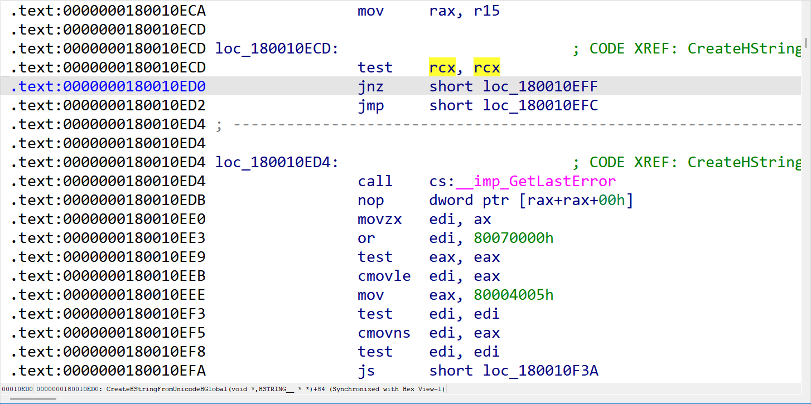

确定了在`CreateHStringFromUnicodeHGlobal`函数中

其中第一个参数hMem就是我们要的东西

如果我们能找到哪儿传过来的这些东西 就完事了(最后也是没逆出来 全是不透明的结构套结构)

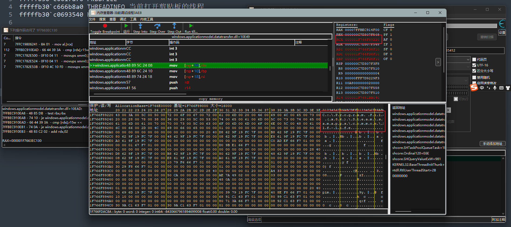

windbg下断开调

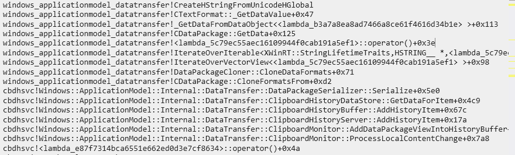

里面有一个`AddHistoryItem` 很容易可以联想到GetHistoryItem

ida一搜发现了

`Windows::ApplicationModel::Internal::DataTransfer::ClipboardHistoryBuffer::GetHistoryItemCount`

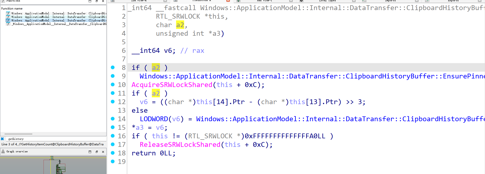

我们可以看见当a2为true时 算size的方式很像数组的起始地址相减除sizeof(LPVOID)

那也就是说我们拿到了这个结构的数组

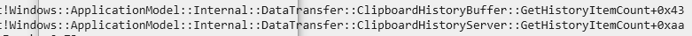

`Windows::ApplicationModel::Internal::DataTransfer::ClipboardHistoryBuffer::GetInMemoryItemsCount` 复制时触发 可以论证上面的逻辑

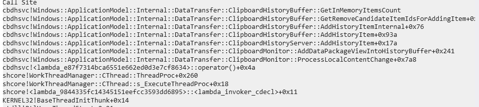

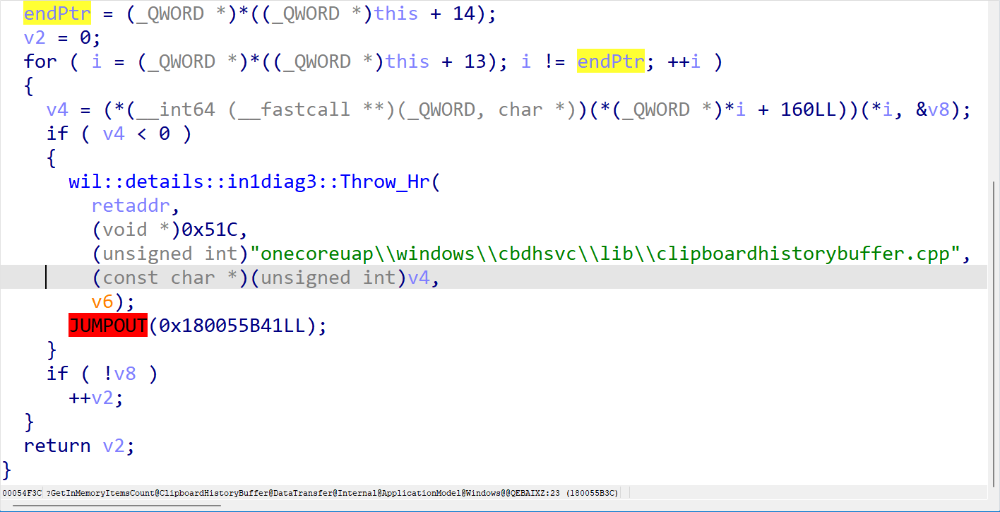

对应的结构指针数组

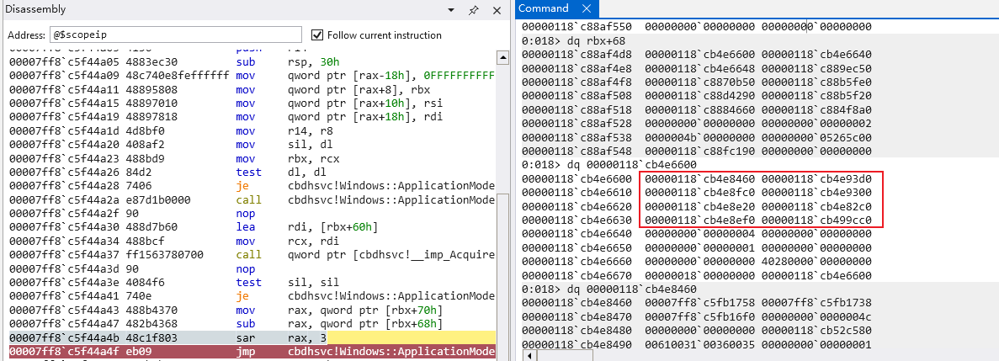

这边后面分析不出来了 摆烂了 全是结构套结构

回ce搜地址 再往上找一层

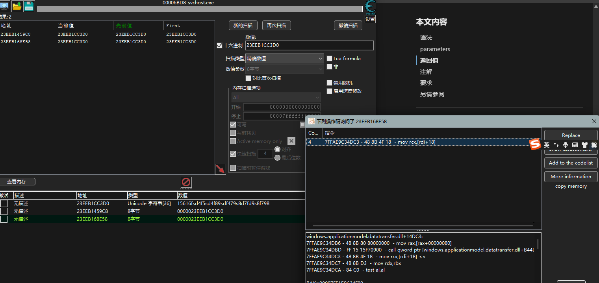

是`CTextFormat::GetText` 没看头 看着看着又回`CreateHStringFromUnicodeHGlobal`去了 看内存的时候发现这似乎是一个结构

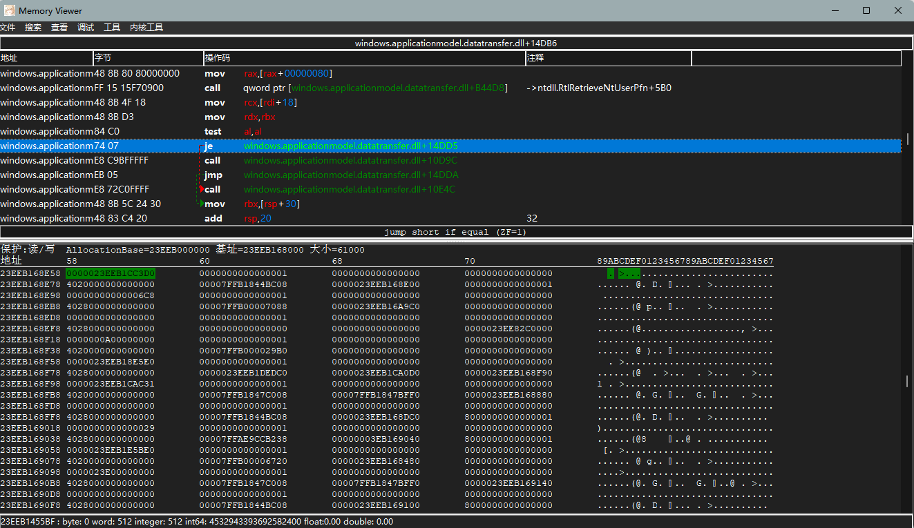

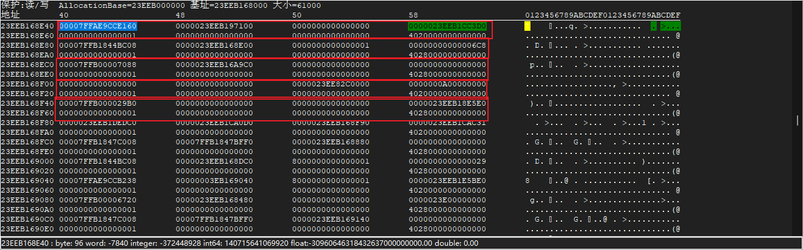

reclass看一手结构 可以发现确实是有一些字符串的

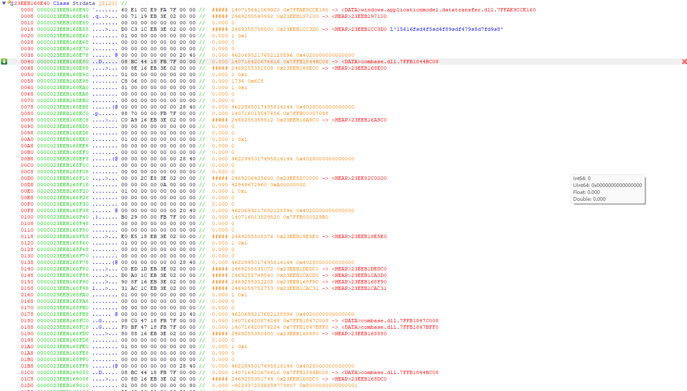

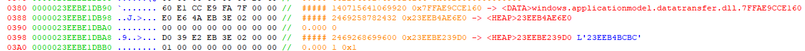

并且我们发现如果是`CUnicodeTextFormat`的虚表 那么一定下面的是UnicodeText 也就是我们找到了

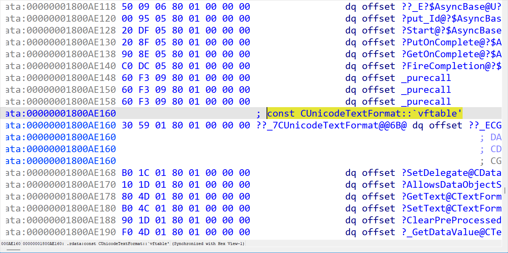

不是很清楚怎么找虚表 所以这里直接判断该地址是否在rdata 然后输出

这样会出现很多乱码 观察发现地址内都是指针 过滤一下即可

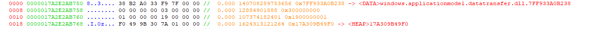

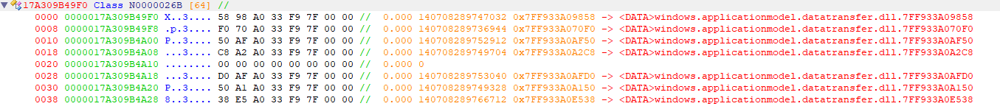

```
if (susAddr != 0 && !((susAddrByte[5] = 0x7f && susAddrByte[6] == 0x00 && susAddrByte[7] == 0x00))) 
```

# 总结及效果

说一下整体步骤吧

1. 获取cbdhsvc所在svchost的pid
2. openprocess 然后 枚举其中的模块 找到`windows.applicationmodel.datatransfer.dll`
3. 获取CUnicodeTextFormat vtable地址
4. 扫整个已提交的私有内存 RW权限, 解析结构

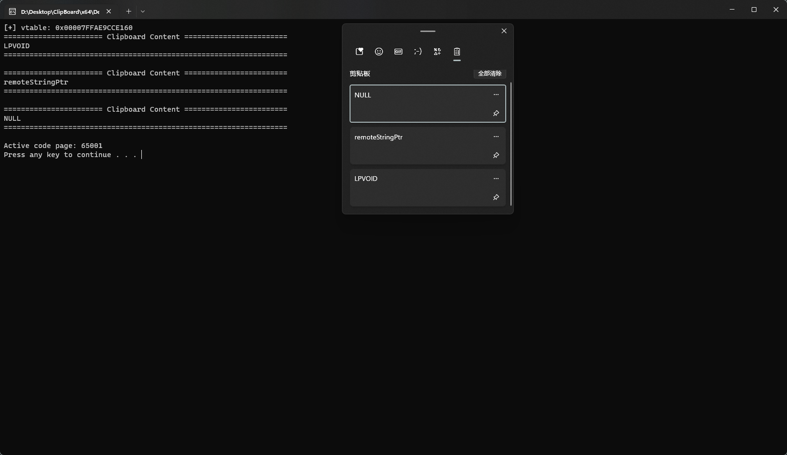

# 源码

<https://github.com/Arcueld/ClipboardStellar>

# 参考

<https://www.sinis.ro/static/ch19c.htm>

reactos

<https://shreklane.github.io/winkrnldocs/>

<https://chaoui-lpb.github.io/posts/clipboard/#unicode-text-format-gcdufmtret--13--cf_unicodetext>
