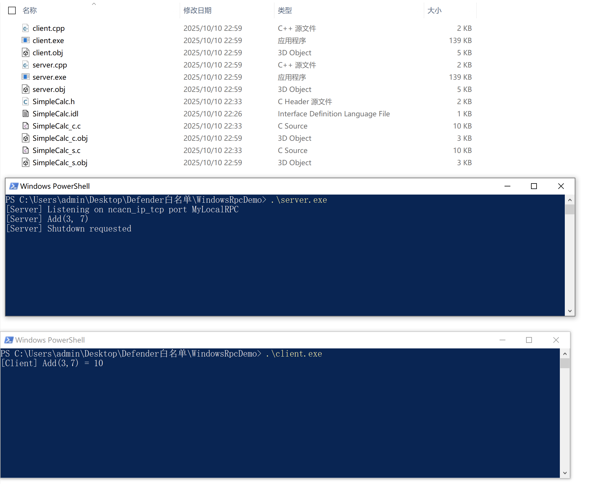

# Windows RPC初探-先知社区

> **来源**: https://xz.aliyun.com/news/19154  
> **文章ID**: 19154

---

# 前言

看到一篇利用RPC实现免杀对抗的文章，不懂RPC的我读起来像天书，恍然大悟，我得先搞懂RPC是什么，本文的目的是掌握RPC的背景、概念、实现

# 背景

随着计算机技术从“单机时代”进入“分布式时代”，传统的IPC（Inter-Process Communication，进程间通信）已经无法满足跨设备、跨网络的协作需求，如大型企业的财务系统，单台计算机的算力、存储、可靠性已经无法满足需求，需要多台计算机协同合作，其中包括负责存储的（数据库服务器）、负责计算的（应用服务器）、负责展示的（前端服务器），各个服务器的进程之间无法再通过传统的IPC（Inter-Process Communication，进程间通信）通信，需要一种新的通信机制

早期程序员们自己实现通信机制，包括自己基于TCP/IP协议编写数据发送/接收逻辑，处理数据序列化反序列化、考虑丢包等等，这些底层细节与“业务逻辑”无关，却占用了开发者大量的时间精力，急需一种全新的标准，这个时候RPC应运而生

RPC最早是由贝尔实验室的Bruce Jay Nelson在1984年的论文中提出的，随后Sun公司实现了自研的ONC RPC，有了这个成熟的机制，大幅降低了跨进程通信的开发门槛，微软在1993年自Windows NT起，在ONC RPC的基础上研发了适用于Windows的RPC机制，我们都知道Windows是组件化架构，典型的组件就是COM，而DCOM就是基于RPC实现的分布式COM组件

# 概念

IPC（Inter-Process Communication，进程间通信）是用于本地的一套机制，RPC（Remote Procedure Call，远程过程调用）相比IPC是一套用于远程的机制，包含客户端和服务端，服务端提供服务（比如计算器服务），客户端发起请求（比如传入1+1，服务端返回结果2），当然这是最简化的场景，实际要复杂的多，RPC机制中涉及4个概念：  
RPC客户端：发起请求的代码  
RPC客户端存根（也叫RPC客户端Stub）：负责将客户端的请求参数打包成网络数据，并通过网络发送给服务端  
RPC服务端存根（也叫RPC服务端Stub）：负责接收并拆解数据包，然后调用本地方法  
RPC服务端：实际处理请求的代码

RPC调用过程：  
1、客户端以本地调用方式调用服务  
2、客户端存根接收到调用后，负责将方法、参数等组装成能够进行网络传输的消息体（将消息对象序列化为二进制）  
3、客户端存根通过socket将网络消息发送到服务端  
4、服务端存根收到消息后进行解码（将消息对象反序列化）  
5、服务端存根根据解码结果调用本地的服务  
6、服务端执行本地过程并将执行结果返回给服务端存根  
7、服务端存根将返回结果打包成网络消息（将结果消息进行发序列）  
8、服务端存根通过socket将网络消息发送到客户端  
9、客户端存根接收到结果消息，并进行解码（将结果消息反序列化）  
10、客户端接收到返回结果

RPC的接口使用了IDL（Interface Description Language，接口描述语言）作为接口语言，熟悉COM的同学应该一眼就能认出来，COM也是用的这个接口语言，这个接口语言使用的编译器是MIDL，在Visual Studio套件中，通过IDL文件定义RPC客户端和RPC服务端之间的通信接口，只有实现了此接口的RPC客户端和RPC服务端才能互相通信

# 实现

下面是一个Demo演示，创建一个文件夹包含下面三个文件

SimpleCalc.idl代码如下

```
[
    uuid(8A4B8C38-6BBD-4A9D-AE8E-1234567890AB),
    version(1.0)
]
interface SimpleCalc
{
    // 两个输入参数，返回它们的和
    int Add([in] int a, [in] int b);

    // 让服务端优雅退出（示例）
    void Shutdown(void);
}
```

server.cpp代码如下

```
#include <windows.h>
#include <stdio.h>
#include "SimpleCalc.h"
#pragma comment(lib, "Rpcrt4.lib")


void* __RPC_USER MIDL_user_allocate(size_t size) { return malloc(size); }
void  __RPC_USER MIDL_user_free(void* p) { free(p); }


extern "C" int Add(handle_t IDL_handle, int a, int b) {
    printf("[Server] Add(%d, %d)
", a, b);
    return a + b;
}
extern "C" void Shutdown(handle_t IDL_handle) {
    printf("[Server] Shutdown requested
");
    RpcMgmtStopServerListening(NULL);
    RpcServerUnregisterIf(NULL, NULL, TRUE);
}


int main()
{
    RPC_STATUS status;
    RPC_CSTR pszProtocolSequence = (RPC_CSTR)"ncalrpc";
    RPC_CSTR pszEndpoint = (RPC_CSTR)"MyLocalRPC";
    status = RpcServerUseProtseqEpA(pszProtocolSequence, RPC_C_PROTSEQ_MAX_REQS_DEFAULT, pszEndpoint, NULL);
    if (status != RPC_S_OK) {
        fprintf(stderr, "RpcServerUseProtseqEpA failed: 0x%lx
", status);
        return 1;
    }

    status = RpcServerRegisterIf(SimpleCalc_v1_0_s_ifspec, NULL, NULL);
    if (status != RPC_S_OK) {
        fprintf(stderr, "RpcServerRegisterIf failed: 0x%lx
", status);
        return 1;
    }

    RpcServerRegisterAuthInfoA(NULL, RPC_C_AUTHN_NONE, NULL, NULL);

    printf("[Server] Listening on ncacn_ip_tcp port %s
", (char*)pszEndpoint);

    status = RpcServerListen(1, RPC_C_LISTEN_MAX_CALLS_DEFAULT, FALSE);
    if (status != RPC_S_OK) {
        fprintf(stderr, "RpcServerListen failed: 0x%lx
", status);
        return 1;
    }

    printf("[Server] RpcServerListen returned, exiting.
");
    return 0;
}
```

client.cpp代码如下

```
#include <windows.h>
#include <stdio.h>
#include "SimpleCalc.h"

#pragma comment(lib, "Rpcrt4.lib")

void* __RPC_USER MIDL_user_allocate(size_t size) { return malloc(size); }
void  __RPC_USER MIDL_user_free(void* p) { free(p); }

int main()
{
    RPC_STATUS status;
    RPC_BINDING_HANDLE binding = NULL;
    RPC_CSTR pszStringBinding = NULL;
    
    /*
    status = RpcStringBindingComposeA(
        NULL,
        (RPC_CSTR)"ncacn_ip_tcp",
        (RPC_CSTR)"127.0.0.1",
        (RPC_CSTR)"50000",
        NULL,
        &pszStringBinding
    );
    */
    
    status = RpcStringBindingComposeA(
        NULL,
        (RPC_CSTR)"ncalrpc",
        NULL,               // LRPC不需要地址
        (RPC_CSTR)"MyLocalRPC",
        NULL,
        &pszStringBinding
    );

    if (status != RPC_S_OK) {
        fprintf(stderr, "RpcStringBindingComposeA failed: 0x%lx
", status);
        return 1;
    }

    status = RpcBindingFromStringBindingA(pszStringBinding, &binding);
    if (status != RPC_S_OK) {
        fprintf(stderr, "RpcBindingFromStringBindingA failed: 0x%lx
", status);
        RpcStringFreeA(&pszStringBinding);
        return 1;
    }

    RpcStringFreeA(&pszStringBinding);

    // ✅ 用 RpcTryExcept 捕获 RPC 异常
    RpcTryExcept
    {
        int sum = Add(binding, 3, 7);
        printf("[Client] Add(3,7) = %d
", sum);

        Shutdown(binding);
    }
    RpcExcept(1)
    {
        printf("[Client] RPC Exception code: 0x%lx
", RpcExceptionCode());
    }
    RpcEndExcept

    RpcBindingFree(&binding);
    return 0;
}
```

安装好VS2022后，打开“x64 Native Tools Command Prompt for VS 2022”，切换到上述目录，先编译idl文件

```
midl SimpleCalc.idl
```

执行后会生成头文件、客户端存根文件、服务端存根文件、等

然后编译服务端

```
cl /EHsc server.cpp SimpleCalc_s.c /link rpcrt4.lib
```

最后编译客户端

```
cl /EHsc client.cpp SimpleCalc_c.c /link rpcrt4.lib
```

成功编译后，先执行服务端，再执行客户端，结果如下图



上图显示成功进行了一次RPC通信，我们对代码进行一下初步讲解

服务端代码中，MIDL\_user\_allocate 与 MIDL\_user\_free是RPC运行时需要调用的分配/释放函数，需要在代码中实现它，所以需要下述2行代码，其实就是把malloc和free包装一下，符合RPC的要求

```
void* __RPC_USER MIDL_user_allocate(size_t size) { return malloc(size); }
void  __RPC_USER MIDL_user_free(void* p) { free(p); }
```

实现函数Add和Shutdown，并将其声明为C语言风格，确保编译后的函数名称不会有额外修饰

```
extern "C" int Add(handle_t IDL_handle, int a, int b) {
    printf("[Server] Add(%d, %d)
", a, b);
    return a + b;
}
extern "C" void Shutdown(handle_t IDL_handle) {
    printf("[Server] Shutdown requested
");
    RpcMgmtStopServerListening(NULL);
    RpcServerUnregisterIf(NULL, NULL, TRUE);
}
```

初始化一些参数，并调用RpcServerUseProtseqEpA注册协议

```
    RPC_STATUS status;
    RPC_CSTR pszProtocolSequence = (RPC_CSTR)"ncalrpc";
    RPC_CSTR pszEndpoint = (RPC_CSTR)"MyLocalRPC";
    status = RpcServerUseProtseqEpA(pszProtocolSequence, RPC_C_PROTSEQ_MAX_REQS_DEFAULT, pszEndpoint, NULL);
    if (status != RPC_S_OK) {
        fprintf(stderr, "RpcServerUseProtseqEpA failed: 0x%lx
", status);
        return 1;
    }
```

调用RpcServerRegisterIf将IDL的接口注册到RPC运行时

```
    status = RpcServerRegisterIf(SimpleCalc_v1_0_s_ifspec, NULL, NULL);
    if (status != RPC_S_OK) {
        fprintf(stderr, "RpcServerRegisterIf failed: 0x%lx
", status);
        return 1;
    }
```

调用RpcServerRegisterAuthInfoA并传入RPC\_C\_AUTHN\_NONE允许匿名访问

```
    RpcServerRegisterAuthInfoA(NULL, RPC_C_AUTHN_NONE, NULL, NULL);
```

调用RpcServerListen监听来自客户端的请求

```
    status = RpcServerListen(1, RPC_C_LISTEN_MAX_CALLS_DEFAULT, FALSE);
    if (status != RPC_S_OK) {
        fprintf(stderr, "RpcServerListen failed: 0x%lx
", status);
        return 1;
    }
```

客户端代码中，MIDL\_user\_allocate 与 MIDL\_user\_free同服务端一样

```
void* __RPC_USER MIDL_user_allocate(size_t size) { return malloc(size); }
void  __RPC_USER MIDL_user_free(void* p) { free(p); }
```

初始化参数，并调用RpcStringBindingComposeA创建一个字符串形式绑定

```
    RPC_STATUS status;
    RPC_BINDING_HANDLE binding = NULL;
    RPC_CSTR pszStringBinding = NULL;
    status = RpcStringBindingComposeA(
        NULL,
        (RPC_CSTR)"ncalrpc",
        NULL,               // LRPC不需要地址
        (RPC_CSTR)"MyLocalRPC",
        NULL,
        &pszStringBinding
    );
    if (status != RPC_S_OK) {
        fprintf(stderr, "RpcStringBindingComposeA failed: 0x%lx
", status);
        return 1;
    }
```

调用RpcBindingFromStringBindingA将字符串绑定转化为RPC绑定句柄

```
    status = RpcBindingFromStringBindingA(pszStringBinding, &binding);
    if (status != RPC_S_OK) {
        fprintf(stderr, "RpcBindingFromStringBindingA failed: 0x%lx
", status);
        RpcStringFreeA(&pszStringBinding);
        return 1;
    }
```

调用服务端提供的功能Add，包含在一个异常处理中

```
    RpcTryExcept {
        int sum = Add(binding, 3, 7);
        printf("[Client] Add(3,7) = %d
", sum);

        Shutdown(binding);
    }
    RpcExcept(1) {
        printf("[Client] RPC Exception code: 0x%lx
", RpcExceptionCode());
    }
    RpcEndExcept
```
