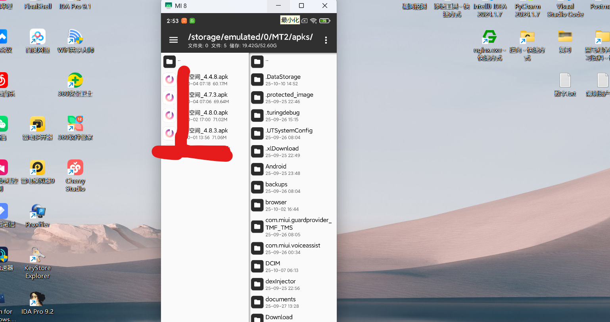
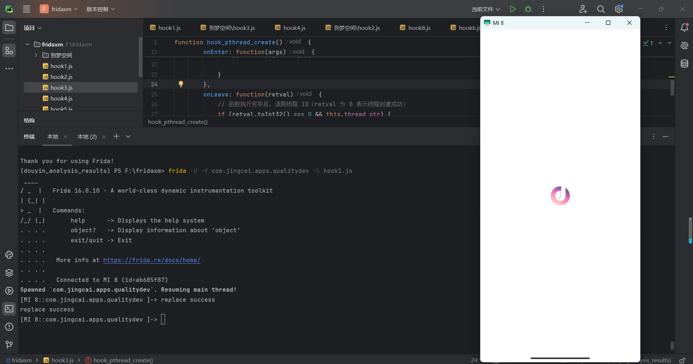

# 以某某空间为例 分析libnesec.so反调试机制-先知社区

> **来源**: https://xz.aliyun.com/news/19158  
> **文章ID**: 19158

---

# Frida与安卓应用反调试绕过实践 前言

由于传播、利用此文所提供的信息而造成的任何直接或者间接的后果及损失，均由使用者本人负责，文章作者不为此承担任何责任。（本文仅用于交流学习），本文仅作技术研究。

## 一、Frida基础与反调试原理

### 1. Frida简介

Frida是一款用于安卓应用的动态插桩工具，它允许开发者在应用程序运行时动态注入代码，监视和修改应用程序的行为，因此被广泛应用于安卓逆向工程。

### 2. Frida反调试原理

攻防一体，既然存在动态调试手段，厂商必然会采用反调试手段。以本次测试的软件为例，其反调试逻辑为：**程序运行前先启动一个线程，扫描当前主进程环境**，若检测到Frida特征则杀死主进程，导致应用闪退或卡在进入阶段。常见检测手段如下：

* **检查映射文件**：扫描`/proc/self/maps`或`/proc/pid/maps`，查找含`frida`、`gadget`字样的库文件（如`libfrida-agent.so`）。
* **检查开放端口**：Frida Server默认监听27047端口，检测`netstat`输出或读取`/proc/net/tcp`等文件查找该端口。
* **检查线程名**：Frida会创建`gmain`、`gdbus`、`frida-*`等特征线程，遍历`/proc/self/task/pid/comm`可查看线程名。
* **检查环境变量**：查找进程环境变量中的Frida相关特征。

## 二、测试环境与整体思路

### 1. 软件版本

本次测试涉及2个版本，反调试手段由浅及深：`4.7.3`、`4.8.3`。



### 2. 核心背景知识：Java层与.so层

* **Java层**：代码可读（如Java/Kotlin），开发效率高，可直接调用Android系统API（控件、网络、存储），但反编译后易被分析。
* **.so层**：全称“Shared Object”，由C/C++编译的二进制文件，代码不可直接读，运行速度快（适合加密、图形渲染），可调用底层硬件接口。**关键特性**：核心安全逻辑（支付加密、反调试）通常放在.so层，二进制格式大幅提高破解难度。

## 三、4.7.3版本：反调试定位与绕过 image.png​

### 1. 初步测试：确认Frida检测行为 image.png​

注入空脚本后，应用正常运行，但Frida进程被杀死。这证明：**应用能检测Frida环境，并主动终止Frida进程**。

### 2. .so文件定位：找到反调试线程的载体

#### （1）定位思路

应用通过线程实现环境检测，而.so层（C/C++）创建线程需依赖系统库`libc.so`的`pthread_create`函数。因此，先监控“.so文件加载行为”，找到加载后触发Frida被杀的目标.so。

#### （2）定位脚本解释

```
// Hook系统加载.so的关键函数dlopen
Interceptor.attach(Module.findExportByName(null, "dlopen"), {
    // 函数被调用前触发
    onEnter: function(args) {
        // args[0] 是要加载的.so文件路径（字符串）
        const soPath = args[0].readUtf8String();
        // 打印加载的.so路径
        console.log("正在加载SO文件：", soPath);
    }
});

console.log("脚本已启动，等待打印SO加载信息...");
```

* `Interceptor.attach`：Frida的拦截API，“挂钩”目标函数（此处为`dlopen`），在函数调用前后执行自定义逻辑。
* `Module.findExportByName(null, "dlopen")`：在所有已加载模块（含系统库）中查找`dlopen`函数地址。
* `args[0].readUtf8String()`：解析`dlopen`第一个参数（.so文件路径指针）为UTF-8字符串，获取具体路径。

#### （3）脚本执行结果与结论 屏幕截图 2025-10-10 161711.png​

应用加载`libc.so`和`libnesec.so`后，Frida进程被杀死。结合背景知识：

* `libc.so`是系统核心库，提供`pthread`系列线程函数，所有.so层创建线程均依赖它，排除其为反调试载体。
* **结论**：`libnesec.so`是创建反调试线程的载体。

### 3. 验证：确认libnesec.so的反调试行为

#### （1）验证思路

反调试线程会访问`/proc/self/maps`等路径，因此监控进程的“路径访问行为”，确认`libnesec.so`是否调用这些路径。

#### （2）验证脚本解释

```
// 简化版Frida脚本：打印进程访问的所有路径
setImmediate(function() {
    // 拦截常见的路径访问系统调用
    const pathFuncs = ['open', 'openat', 'access', 'stat', 'lstat'];

    pathFuncs.forEach(funcName => {
        // 找到系统调用的导出地址
        const funcAddr = Module.findExportByName(null, funcName);
        if (!funcAddr) return;

        Interceptor.attach(funcAddr, {
            onEnter: function(args) {
                try {
                    // 读取访问的路径（不同函数路径参数位置均为第1个）
                    const path = args[0].readUtf8String();
                    // 打印关键信息
                    console.log(`[路径访问] 函数: ${funcName} | 路径: ${path} | 线程ID: ${Process.getCurrentThreadId()}`);
                } catch (e) {
                    // 忽略异常路径（如非UTF8编码路径）
                }
            }
        });
    });
    console.log("脚本已加载，开始打印进程访问的路径...");
});
```

核心功能：拦截`open`、`stat`等路径操作函数，打印进程访问的所有路径及对应线程ID。

#### （3）验证结果 屏幕截图 2025-10-10 170631.png​

发现`libnesec.so`创建的线程（如线程ID=22033）访问了`/proc/self/maps`路径，且该线程执行后Frida进程被杀死。**结论**：`libnesec.so`创建的线程（22033）执行了反调试逻辑。

### 4. 反调试绕过：替换反调试线程

#### （1）绕过思路

`libnesec.so`通过`pthread_create`创建反调试线程，因此“替换该线程的入口函数”，使其无法执行检测逻辑，实现绕过。

#### （2）绕过脚本解释

```
// 定义函数：Hook pthread_create
function hook_pthread_create() {
    // 从libc.so中找到pthread_create函数地址
    var pt_create_func = Module.findExportByName("libc.so", 'pthread_create');

    // 拦截pthread_create函数
    Interceptor.attach(pt_create_func, {
        // 函数被调用时触发（线程刚要创建）
        onEnter: function(args) {
            // pthread_create函数参数说明（C语言定义）：
            // int pthread_create(pthread_t *thread, const pthread_attr_t *attr, void *(*start_routine)(void *), void *arg)
            // args[0]：存储新线程ID的指针；args[1]：线程属性；args[2]：线程入口函数；args[3]：入口函数参数

            // 从args[2]（线程入口函数地址）定位所属.so文件
            var so_name = Process.findModuleByAddress(args[2]).name;

            // 筛选：仅处理libnesec.so创建的线程
            if (so_name.indexOf("libnesec") != -1) {
                try {
                    // 替换线程入口函数：新函数仅打印日志，不执行原检测逻辑
                    Interceptor.replace(args[2], new NativeCallback(function() {
                        console.log('replace success');
                        return null;
                    }, 'void', ["void"]));
                } catch (e) {}
            }
        },
        // 函数执行完触发（暂无需处理）
        onLeave: function(retval) {}
    })
}
hook_pthread_create();
```

#### （3）执行结果 屏幕截图 2025-10-10 172722.png​

应用正常运行，Frida进程未被中断，**绕过成功**。

## 四、4.8.3版本：精准绕过（避免影响核心线程）

### 1. 旧绕过脚本的问题

首先我们先执行4.7.3的反跳式绕过脚本，看看是什么样的情况  
  
我们可以看到应用是没有闪退 他在进入的页面一直卡住 也不能正常运行 然后 frida 进程也没有被杀掉

这是什么原因呢？这其实是因为我们绕过4.7.3反调试的手段太过于简单粗暴了

我们替换了libnesec.so 文件创建的所有线程 而在这之中 有些线程是用于反调试 有些线程是用于核心逻辑的解密 我们将核心逻辑解密的线程替换掉之后，程序就无法解密代码 应用也无法正常运行了

所以我们接下来要做的就是定位这些线程里面到底哪些线程是反调试的，哪些线程是解密核心逻辑的 我们只单独将反调试的线程替换将解密核心逻辑的线程保留  
直接替换`libnesec.so`的所有线程后，应用卡在进入页面（未闪退，Frida未被杀）。原因：`4.8.3`版本中，`libnesec.so`创建的线程不仅有“反调试线程”，还有“核心逻辑解密线程”——替换解密线程会导致程序无法解密代码，进而卡住。

### 2. 关键步骤：定位反调试线程（第一条线程）

#### （1）定位思路

通过日志区分“线程创建”与“线程运行”的时机，找到最先执行的反调试线程。

* **onLeave阶段**：`pthread_create`执行完毕（线程已创建，但未运行），打印临时线程ID。
* **onEnter阶段**：线程被CPU调度（开始运行），打印真实线程ID。

#### （2）定位脚本解释

```
function hook_pthread_create() {
    // 从libc.so中找到pthread_create函数地址
    var pt_create_func = Module.findExportByName("libc.so", 'pthread_create');

    Interceptor.attach(pt_create_func, {
        onEnter: function(args) {
            // 保存线程ID指针和入口函数地址，供onLeave使用
            this.thread_ptr = args[0];
            this.so_name = args[2];

            // 读取临时线程ID（转16进制）
            var thread_id = args[0].readU64().toString(16);
            // 定位线程所属.so文件
            var so_name = Process.findModuleByAddress(args[2]).name;

            // 筛选：仅处理libnesec.so的线程
            if (so_name.indexOf("libnesec") != -1) {
                // 替换入口函数：打印真实线程ID（线程运行时触发）
                Interceptor.replace(args[2], new NativeCallback(() => {
                    console.log(`onEnter阶段线程ID: ${thread_id} | SO: ${so_name}`);
                    return null;
                }, 'void', ["void"]));
            }
        },
        onLeave: function(retval) {
            // 线程创建成功（retval=0）时，打印临时线程ID
            if (retval.toInt32() === 0 && this.thread_ptr) {
                var thread_id = this.thread_ptr.readU64().toString(16);
                var so_name = Process.findModuleByAddress(this.so_name).name
                console.log(`onLeave阶段线程ID: ${thread_id} | SO: ${so_name}`);
            }
        }
    })
}
hook_pthread_create();
```

#### （3）定位结果 屏幕截图 2025-10-10 183137.png​

* `onLeave阶段`：`libnesec.so`创建了多个线程（打印多个临时ID）。
* `onEnter阶段`：仅第一个线程有真实ID（非0），后续线程未运行。**结论**：`libnesec.so`的**第一个线程是反调试线程**——检测到Frida后，终止后续线程创建。

### 3. 精准绕过：仅替换第一条反调试线程

#### （1）绕过脚本解释

```
function hook_pthread_create() {
    // 从libc.so中找到pthread_create函数地址
    var pt_create_func = Module.findExportByName("libc.so", 'pthread_create');

    // 全局变量：存储目标线程（第一条libnesec.so线程）的入口地址
    let target_entry_addr = null;

    Interceptor.attach(pt_create_func, {
        onEnter: function(args) {
            // 保存线程ID指针
            this.thread_ptr = args[0];
            // 当前线程的入口函数地址
            const current_entry_addr = args[2];

            // 定位入口函数所属.so文件
            const so_module = Process.findModuleByAddress(current_entry_addr);
            // 避免空指针异常：未找到.so时用“未知SO”
            const so_name = so_module ? so_module.name : "未知SO";

            // 筛选：仅处理libnesec.so的线程
            if (so_name.indexOf("libnesec") === -1) {
                return;
            }

            // 读取临时线程ID（适配32/64位系统）
            const thread_id = Process.pointerSize === 8
                ? this.thread_ptr.readU64().toString(16)
                : this.thread_ptr.readU32().toString(16);

            // 精准替换：仅处理第一条libnesec.so线程
            if (target_entry_addr === null) {
                // 记录第一条线程的入口地址（目标线程）
                target_entry_addr = current_entry_addr;
                console.log(`🎯 已锁定目标线程：临时ID=${thread_id} | 入口地址=${current_entry_addr} | SO=${so_name}`);

                try {
                    // 替换目标线程入口函数
                    Interceptor.replace(current_entry_addr, new NativeCallback((arg) => {
                        console.log(`✅ 目标线程执行替换逻辑：临时ID=${thread_id} | 入口地址=${current_entry_addr}`);
                        return ptr(0); // 匹配原函数返回值类型（void*）
                    }, 'pointer', ['pointer'])); // 原入口函数类型：void* (*)(void*)
                } catch (e) {
                    console.log(`❌ 替换目标线程失败：${e.message}`);
                }
            } else {
                // 非目标线程（如解密线程），不替换，保留原逻辑
            }
        },

        onLeave: function(retval) {
            // 打印线程创建成功信息（验证用）
            if (retval.toInt32() === 0 && this.thread_ptr) {
                const real_thread_id = Process.pointerSize === 8
                    ? this.thread_ptr.readU64().toString(16)
                    : this.thread_ptr.readU32().toString(16);
                console.log(`☑️ onLeave阶段线程创建成功：真实ID=${real_thread_id}`);
            }
        }
    });
}

hook_pthread_create();
console.log("✅ 脚本启动：只替换第一条 libnesec.so 线程，其他线程正常执行");
```

#### （2）执行结果 屏幕截图 2025-10-10 184405.png​

应用正常运行，无卡顿，Frida进程未被中断，**精准绕过成功**。

## 五、总结与反思

1. **4.7.3版本**：反调试逻辑单一，直接替换`libnesec.so`的所有线程即可绕过，但手段粗暴。
2. **4.8.3版本**：`libnesec.so`线程分工明确（反调试+核心解密），需通过“日志定位第一条反调试线程”，仅替换目标线程，避免影响核心逻辑。
3. 核心思路：反调试绕过的关键是“精准识别目标逻辑载体（线程/.so）”，避免无差别修改导致程序异常。

## 参考文章或其他链接

https://tig3rhu.github.io/2024/01/14/70\_\_%E9%80%86%E5%90%91\_\_%E4%BB%96%E8%B6%A3APP

https://blog.csdn.net/w987333120/article/details/149248139

​
