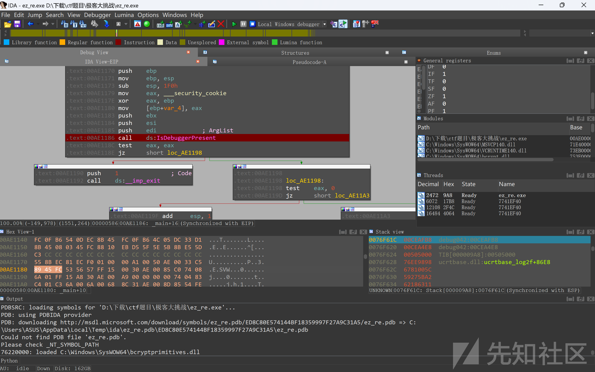
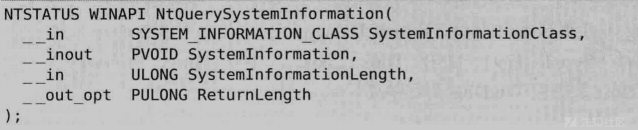
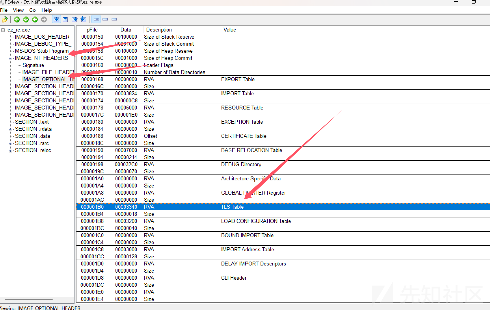
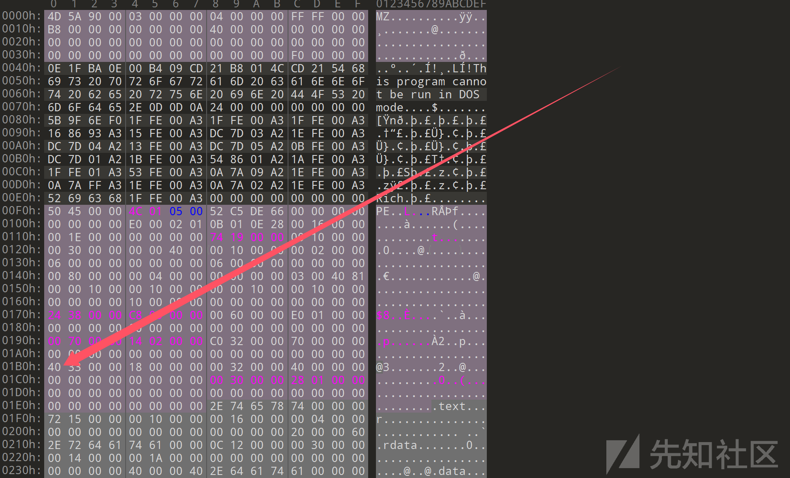
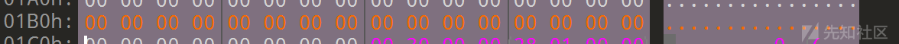
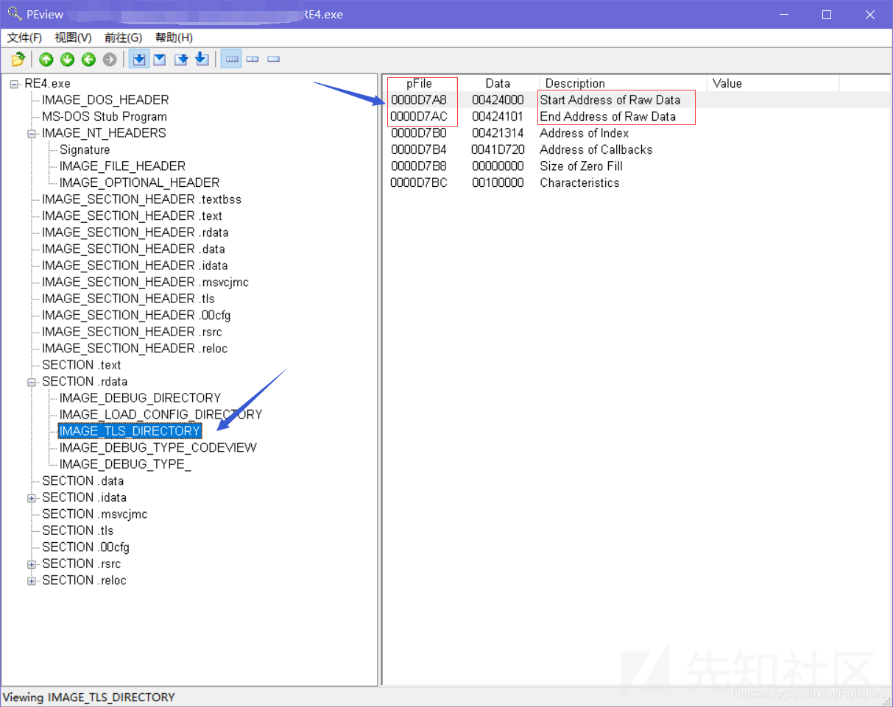
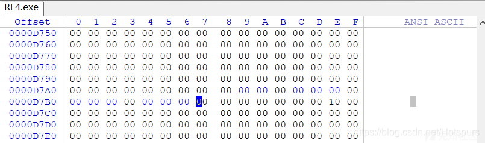

# 常见反调试技术分析与绕过方法详解 -先知社区

> **来源**: https://xz.aliyun.com/news/19162  
> **文章ID**: 19162

---

# 1.静态反调试

## 1.跟PEB有关

### 1.isdebuggerpresent



对于这种最简单说的调用windows API的反调试，可以看到这里有两个分支，一个是直接退出（在检测到调试的情况下），一边是正常运行的代码，这里其实可以现在反调试前下断点，然后运行到判断前面和判断那里，修改零标志位ZF为1，就可以绕过反调试。

​

如果遇到发现不了调试函数的情况的话，也许可以尝试在退出函数那里下断点

比如一般的反调试的退出手段都是调用exit

```
void AntiDebug(){                //反调试函数
    bool IsBeingDebugged=checkIsDebug();//通过某种方式判断当前程序是否正在被调试
    if (IsBeingDebugged){        //如果正在被调试
        exit();                                //退出程序
    }
}

```

可以尝试在这个退出函数下断点，详情见<https://www.52pojie.cn/thread-1432590-1-1.html>

​

### 2.LDR（位于PEB 0x0c）

调试的时候，未使用的堆内存会被全部填充为0xEEFEEEFE,PEB.LDR成员指向\_PEB\_LDR\_DATA结构体，这个结构体在堆里创造的，可以扫描区域就能判断是不是在调试

可以直接把被改变的堆内存直接修改成NULL

​

### 3.ProcessHeap（0x18）

PEB.ProcessHeap成员是指向HEAP结构体的指针

进程处于调试的状态的时候，这个结构体里面的Heap.Flags和Heap.ForceFlags会被改变

**可以把这两个值分别设定为0x2和0x0（即原始状态）**

**方法**

(1) 查找调用堆操作的函数

1. **搜索堆操**​**作函数：** 在 IDA 中，通过 **Shift+F12** 或直接跳转，定位以下函数：

* 高级 API 函数：`HeapAlloc`、`HeapFree`、`HeapCreate`。
* 底层实现函数：`RtlAllocateHeap`、`RtlFreeHeap`、`RtlCreateHeap`。

2. **定位传入的堆指针：**

* 堆操作函数的第一个参数通常是堆的指针（`HEAP*`）。
* IDA 的伪代码中可能显示为：

```
void *allocated = RtlAllocateHeap(heap_pointer, flags, size);
```

* 通过交叉引用（`X` 快捷键）检查 `heap_pointer` 的来源，确定堆的地址。

### 4.NTGlobalFlag(0x68)

调试的时候，同样是PEB的成员会被设置为0x70,所以这里只需要修改为零即可。

## 2.NTqueryInformationProcess

NTqueryInformationProcess（）API探测调试器技术通过NTQueryInformationProcess()API获取各种与进程调试相关的信息

```
__kernel_entry NTSTATUS NtQueryInformationProcess(
  [in]            HANDLE           ProcessHandle,
  [in]            PROCESSINFOCLASS ProcessInformationClass,//检索的进程信息类型
  [out]           PVOID            ProcessInformation,
  [in]            ULONG            ProcessInformationLength,
  [out, optional] PULONG           ReturnLength
);
```

第二个PEOCESSINFOCLASS类型的参数反调试选用的结构体成员：

ProcessDebugPort，//0x7  
ProcessDebugObjectHandle,//0x1E  
PrecessDebugFlags, //0x1F

### ProcessDebugPort

```
 DWORD dwDebugPort = 0;

    // 调用 NtQueryInformationProcess 查询调试端口
    NTSTATUS status = NtQueryInformationProcess(
        GetCurrentProcess(), 
        (PROCESSINFOCLASS)7, // 7 对应 ProcessDebugPort
        &dwDebugPort, 
        sizeof(dwDebugPort), 
        NULL
    );

    if (status == 0) {
        printf("调试端口值: 0x%X
", dwDebugPort);
        if (dwDebugPort != 0) {
            printf("检测到调试器连接
");
        } else {
            printf("未检测到调试器连接
");
        }
    } else {
        printf("NtQueryInformationProcess 调用失败，状态码: 0x%X
", status);
    }
```

### CheckRemoteDebuggerPresent

这个函数不仅可以检测进程是不是在调试状态，而且还可以用来检测其他进程是不是在调试状态

### ProcessDebugObjectHandle(0x1E)

调试时会出现调试对象，进程处于调试状态时候，调试对象句柄的值就存在，处于非调试状态的时候，则为NULL

```
HANDLE hDebugObject=Null;
pNtQuerInformationProcess(GetCurrentProcess(),ProcessDebugObjectHandle,&hDebugObject,sizeof(hDebugObject),NUll)
if(hDebugObject!=0x0)
    printf("Debugging")
    
```

### ProcessDebugFlags(0x1F)

调试标志DebugFlags的值也可以判断进程是不是处于被调试状态，函数的第二个参数为ProcessDebugFlags的时候，调用函数的时候通过第三个参数（&DebugFlags）即可获得值。如果为0就是在调试状态

​

## 3.SystemKernelDebuggerInformation



第一个参数SystemInformationClass传入SystemKernelDebuggerInformation, 第二个参数SystemInformation为结构体SYSTEM\_KERNEL\_DEBUGGER\_INFORMATION的地址, SYSTEM\_KERNEL\_DEBUGGER\_INFORMATION.DebuggerEnabled == 1则表明系统处于调试状态.

## 4.NtQueryObject

调用NtQueryObject函数的时候。会向第二个参数OBJECT\_INFORMATION\_CLASS ObjectInformationClass赋予某个值，调用API后了包含相关信息的结构体指针会被返回到第三个参数PVOID objectInformation里面，

```
__kernel_entry NTSYSCALLAPI NTSTATUS NtQueryObject(
  [in, optional]  HANDLE                   Handle,
  [in]            OBJECT_INFORMATION_CLASS ObjectInformationClass,
  [out, optional] PVOID                    ObjectInformation,
  [in]            ULONG                    ObjectInformationLength,
  [out, optional] PULONG                   ReturnLength
);
```

破解之法就是对第二个参数的值修改为0就可以了

## 5.ZwSetInformationThread

这个函数是强制的把被调试者和调试者分离出来，破解方法是在执行之前把第二个参数的值修改为0继续运行

## 6.TLS回调函数

### 1.TLS

TLS是线程局部存储，解决多线程中变量同步的问题

也就是说，在程序中，多个线程的变量是同步变化的，一个线程里面的变量被赋予了值，另外一个线程也会被赋予同样的值，而TLS技术可以让其他线程无法访问变量

TLS变量的定义是

```
__declspec(thread) int num = 100;//（这里必须在全局变量的位置）
```

### 2.TLS回调函数

```
#include <windows.h>
#include <iostream>
#pragma comment(linker,"/INCLUDE:__tls_used")
HANDLE Event;
HANDLE Thread1, Thread2;
__declspec(thread) int num = 100;//TLS变量
/*
我们定义的TLS回调函数体
*/
VOID NTAPI Tls_CallBack(PVOID DllHandle,DWORD Reason,PVOID Reserved)
{
	if (DLL_PROCESS_ATTACH == Reason)
	{
		printf("进程创建!
");
	}
	if (DLL_PROCESS_DETACH == Reason)
	{
		printf("进程销毁!
");
	}
	if (DLL_THREAD_ATTACH == Reason)
	{
		printf("线程创建!
");
	}
	if (DLL_THREAD_DETACH == Reason)
	{
		printf("线程销毁!
");
	}
}
//首先注册TLS函数，用PIMAGE_TLS_CALLBACK 类型的数组来接受，最后一个参数必须是0
#pragma data_seg(".CRT$XLX")
PIMAGE_TLS_CALLBACK pTlsHeader[] = { Tls_CallBack,0 };
//上面是TLS回调函数的结构体，存储的回调函数的地址
#pragma data_seg()
 
 
DWORD WINAPI ThreadProc1(
	LPVOID lpParam
)
{
	num = 200;
	printf("1. num= %d
",num);
	SetEvent(Event);	
	return 1;
}
 
 
DWORD WINAPI ThreadProc2(
	LPVOID lpParam
)
{
	WaitForSingleObject(Event, INFINITE);
	printf("2. num= %d
", num);
	SetEvent(Event);
	return 1;
}
 
int main()
{
	Event = CreateEvent(NULL, FALSE, FALSE, NULL);	//手动复位，无信号
	Thread1 =  CreateThread(NULL,NULL,ThreadProc1,NULL,NULL,NULL);
	Thread2 = CreateThread(	NULL,	NULL,	ThreadProc2,NULL,	NULL,	NULL);
	WaitForSingleObject(Thread1, INFINITE);
	WaitForSingleObject(Thread2, INFINITE);
 
	system("pause");
	return 0;
}
```

TLS回调函数的程序中，在程序载入内存时候，首先执行TLS回调函数，再进入IMageBase+EntryPoint进入OEP

既然TLS回调函数会先于程序执行，那么在TLS回调函数之中加入反调试的话，就可以直接退出程序了

```
#pragma comment(linker,"/INCLUDE:__tls_used")
 
 
VOID NTAPI tls_callback(
	PVOID DllHandle,
	DWORD Reason,
	PVOID Reserved
	)
{
	BOOL qqql = FALSE;
	HANDLE Process = GetCurrentProcess();
	//如果处于调试，则直接退出
	CheckRemoteDebuggerPresent(Process, &qqql);
	if (qqql)
	{
		MessageBoxA(NULL, "禁止调试!", "警告", MB_OK);
		TerminateProcess(Process,NULL);
	}
	return;
}
 
 
#pragma data_seg(".CRT$XLX")
PIMAGE_TLS_CALLBACK pTlsfun[] = { tls_callback ,0 };
#pragma data_seg()
 
int main()
{
	printf("你好!
");
	system("pause");
	return 0;
}
```

### 3.解决方法



然后去010中找到1B0的位置





这一段都填充为零



然后找到TLS在数据段的位置，并在010里面填充为0既可以了



## 7.ETC

这个就是判断当前系统是不是常规系统，就是从系统中获取各种信息

比如1.检测窗口

2.检测进程

3.检测计算机名称

4.检测程序运行路径

5.检测虚拟即是不是在运行状态

这样的话就可以判断出当前是不是在调试状态

破解方法就是在调试中去找到这些检测的API然后可以有NULL覆盖字符串，这样就无法检测是不是在调试，或者是各种修改跳转的寄存器等等

​

# 2.动态反调试

## 1.异常

异常用于反调试，程序发生异常的时候，SEH机制之下，os会接受到异常，然后调用进程中注册的SEH处理，但是如果在调试运行的时候发生异常，调试器就会接受处理，就无法去处理异常，甚至跳到非正常代码干扰用户。可以这样来判断是不是在调试。

### 一些常见异常

1.

* **EXCEPTION\_ACCESS\_VIOLATION ( 0xC0000005 )**

即非法访问，试图访问不存在或不具有访问权限的内存区域

2.

* **EXCEPTION\_BREAKPOINT ( 0x80000003 )**

就是遇到了断点

3.

* **EXCEPTION\_ILLEGAL\_INSTRUCTION ( 0xC000001D )**

就是遇到了无法解析的指令

4.

* **EXCEPTION\_INT\_DIVIDE\_BY\_ZERO ( 0xC0000094 )**

除法的时候分母为零

5.

* **EXCEPTION\_SINGLE\_STEP ( 0x80000004 )**

执行一条指令然后暂停，就是单步模式

​

```
__try
{
    //可能出现的异常
}
__except(/*异常代码*/)
{
    //异常处理代码
}
```

### SetUnhandledExceptionFilter

如果程序发生异常的时候，但是没有注册SEH或则和没有处理异常的话，就会调用**kernel32!UnhandledExceptionFilter(）API**，这个函数内部会运行系统的最后一个异常处理器，也就是弹出错误提示并终止运行（**异常处理器是一个结构体，第一个元素的指针，指向下一个异常处理器，第二个元素是异常处理函数，如果不能处理异常就给下一个异常处理器，直到最后一个终止运行的异常处理器**）

kernel32!UnhandledExceptionFilter(）内部调用了ntdll！NtQueryInformationProcess判断进程是不是在调试

如果不是调试就正常处理，是调试的话就讲异常给调试器SetUnhandledExceptionFilter(）API会修改最后的异常处理器

这个函数的参数是新的最后的异常处理函数的指针

**综上**：就可以在新注册的最后一个异常处理器中判断是不是在调试，然后根据结果可以改变EIP。总之，这个反调试的手段就是添加一个最后的异常处理里面加反调试，调试的时候遇到未注册的SEH什么的就给这个SetUnhandledExceptionFilter函数然后交给添加的异常处理函数

破解方法：我认为可以让NTQueryInformationProcess失效，不过要跟踪运行到这个注册的异常处理函数，然后跳转到正常的运行代码。

## 2.Timing Check

就是判断时间差，因为正常运行的代码时间差很短，而调试的话时间差很大，操作方法是直接操作获取时间信息的语句

clock(）

time(NULL)获取当前时间

QueryPerformanceCounter（） 计时数据，在实际应用中，程序通过测量微小的时间差来检测调试器的干预。

### RDTSC

x86CPU里面一个64位的寄存器，CPU对每个时钟周期计数然后保存在TSC中，RDTSC是一条汇编指令，读取TSC的值到EDX：EAX寄存器里面，两次调用RDTSC指令会存在时间间隔，通过时间差值课判断进程是不是在调试状态，

破解方法

1.不使用跟踪命令，直接run过相关代码

2.操作第二个RDTSC的值

3.操作jz/jnz

​

```
#include <stdio.h>
#include <windows.h>

int main() {
    int a = 10;

    __try {
        // 触发一个异常中断，模拟非法操作
        __asm {
            int 3; // 触发调试异常
        }
    }
    __except (EXCEPTION_EXECUTE_HANDLER) {
        // 异常处理部分
        printf("Exception caught! Code: %x
", GetExceptionCode());
    }

    printf("Program continues normally.
");
    return 0;
}

```

上面这个实验说明了当调试的时候，程序不会走异常处理部分，不调试的时候会走异常处理部分

## 3.陷阱标志

这个就是在EFLAGS寄存器的第8位，如果TF值被修改为1，那么CPU进入单步执行模式，单步执行中，CPU执行一条指令之后就会触发异常，然后陷阱标志被自动清零，可以这样和SEH结合，不调试的时候遇到异常进入SEH，调试的时候就会继续执行，陷入陷阱，可能花很久去调试一些无用的代码。

破解方法就是在注册SEH处设置一个断点，再在去新的EIP地址设置一个断点，然后到正常运行的代码

## 4.INT 2D

这是一个中断指令，作用是让下一个字节被忽略，后一个字节会被识别出新的指令继续执行。

在OLlydbg里面，执行到INT 2D的时候程序不会暂停，而是一直运行，知道遇到断点。

如果在调试的时候，执行INT 2D不会触发异常进入SEH，而是继续执行（跳过一个字节）

如果没有调试的时候，就会触发异常进入SEH

**破解方法**就是修改判断代码，跟踪进入SEH程序，或者运行到SEH程序，也可以设置OLLYDBG调试器选项，使之忽视EXCEPTION\_SINGLE\_STEP异常

## 6357b945a3c0dfc1e1a5a7364bc1e9af.jpg

## 5.0xcc

其实就是检测你是不是下了断点

还有一个就是API反调试，其实就是在API前设置断点来进行反反调试

### 6.比较校验和

这个反调试就是在这个区域设置了断点之后，这个地方的校验和肯定不一样，这样可以判断是不是在调试

破解方法就是修改CRC比较语句，让校验失效。或者不在这个校验的地方下断点。
