# mimikatz高版本windows适配改造-先知社区

> **来源**: https://xz.aliyun.com/news/19163  
> **文章ID**: 19163

---

### 前言

最前面：这里只包含解决Mimikatz解析windows 24H2凭据的格式与偏移问题，不包括如何绕过PPL/Credential Guard/VBS/杀软等内容。

Mimikatz，神器不必多言，但它不支持win11，之后换用 [gentilkiwi/mimikatz: A little tool to play with Windows security](https://github.com/gentilkiwi/mimikatz) 在win11 23H相关版本可以正常使用，但在某一次升级到24H2后就一直会报错

`ERROR kuhl_m_sekurlsa_acquireLSA ; Logon list`

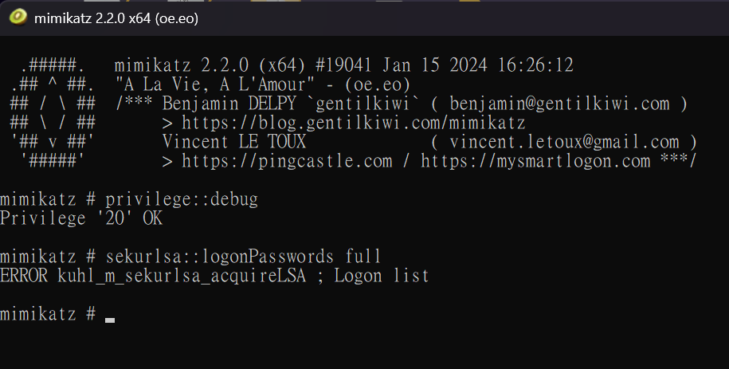

而hash传递利用则是

`ERROR kuhl_m_sekurlsa_acquireLSA ; Logon list  
ERROR kuhl_m_sekurlsa_pth_luid ; memory handle is not KULL_M_MEMORY_TYPE_PROCESS`

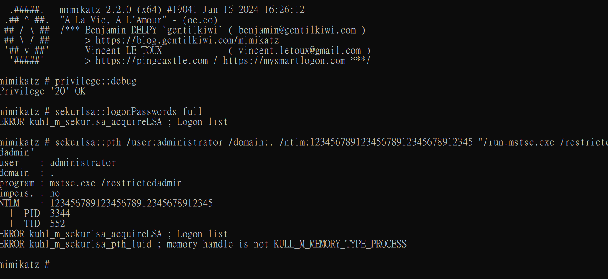

虽然`impacket pypykatz`  等项目也可以做到提取hash和hash传递，但。。。它们没法将凭据注入自身某个进程，就像上面的免密远程桌面一样（FreeRDP也许可以做到，但不如原生的好用，如果有其他的工具可以推荐下）。

当时在打攻防所以就直接开个低版本的虚拟机先用着，虽然很麻烦但也只能这样。直到最近实在受不了了研究下到底怎么回事。

首先要确定是不是windows的PPL、 Credential Guard以及VBS等神奇的安全措施导致的。dump lsass.exe 然后离线解密，也是报错，说明不是/至少不仅是安全防护的问题。

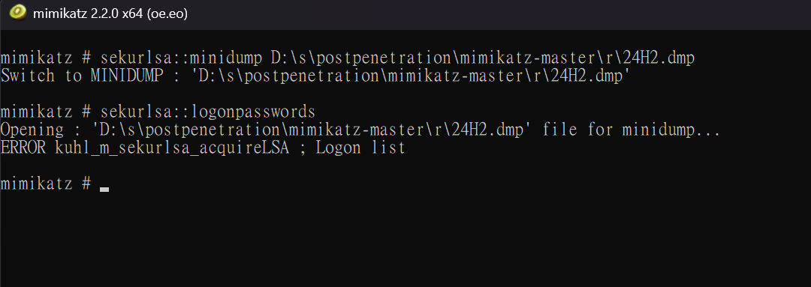

而[skelsec/pypykatz: Mimikatz implementation in pure Python](https://github.com/skelsec/pypykatz) 项目成功的解析了24H2的dump文件，所以就根据`pypykatz`项目来修改`mimikatz`

### 签名与偏移

总之所周知，Mimikatz dump hash首先要通过签名和偏移量在`lsasrv.dll`里找到`LogonSessionList LogonSessionListCount` 这两个全局变量，然后从`LogonSessionList`的链表里遍历凭据。

本来打算直接抄`pypykatz`，但进入相关功能点一看，它专门给24H2加了个单独的偏移`template.first_entry_offset_correction = 34`然后计算

[windows 24H2 support, many fixes · skelsec/pypykatz@1d9d69d](https://github.com/skelsec/pypykatz/commit/1d9d69d87fc527a7ff75ecb0aa97eedf55649045#diff-77a1301b624925c8bf87af00880e64b4eb3e8ed6d60407a1ef7d31e1830e3152)

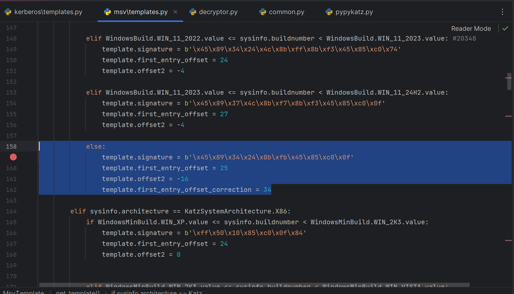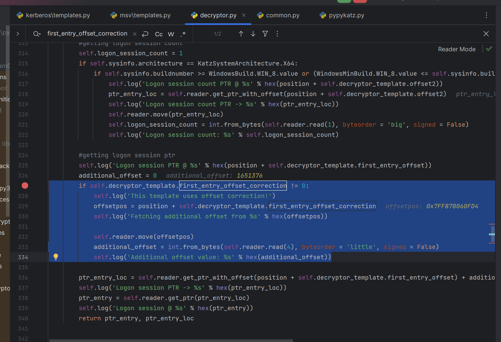

为什么要这么写呢？因为之前的是类似于这样rip + 偏移量，所以只需要 `当前地址 + 指令长度（计算rip） + 偏移 = 目标地址`

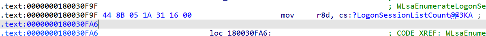

```
0:  44 8b 05 1a 31 16 00    mov    r8d,DWORD PTR [rip+0x16311a]        # 0x163121
```

但现在不再是直接使用rip，而是使用r13寄存器，所以之前的算法就没用了

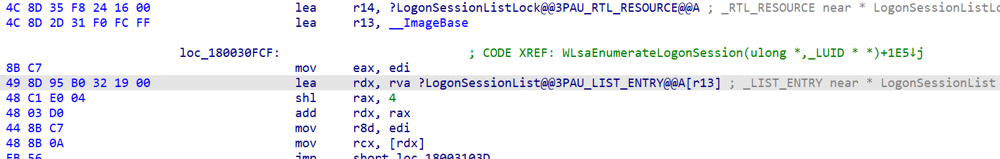

```
0:  49 8d 95 b0 32 19 00    lea    rdx,[r13+0x1932b0]
```

`pypykatz`的实现就是先去找到这个r13寄存器从谁赋值的，然后再加上偏移，所以多了一个字段和部分逻辑。

要改mimikatz的话，尝试不加逻辑，先找找看有没有其他地方还使用了这两个全局变量并且好计算的。

于是找到了这个位置，都是使用`rip`，可以使用

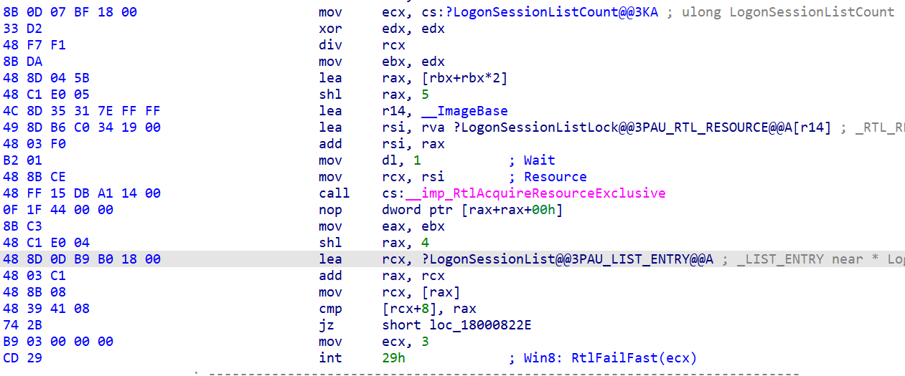

```
0:  8b 0d 07 bf 18 00       mov    ecx,DWORD PTR [rip+0x18bf07]        # 0x18bf0d
6:  48 8d 0d b9 b0 18 00    lea    rcx,[rip+0x18b0b9]        # 0x18b0c6
```

提取签名和偏移

```
#define KULL_M_WIN_BUILD_11_24H2	26100

BYTE PTRN_WN11_24H2_LogonSessionList[]  = { 0x33, 0xD2, 0x48, 0xF7, 0xF1, 0x8B, 0xDA, 0x48, 0x8D, 0x04, 0x5B, 0x48, 0xC1, 0xE0, 0x05};

{KULL_M_WIN_BUILD_11_24H2,	{sizeof(PTRN_WN11_24H2_LogonSessionList), PTRN_WN11_24H2_LogonSessionList},	{0, NULL}, {58,  -4}},
```

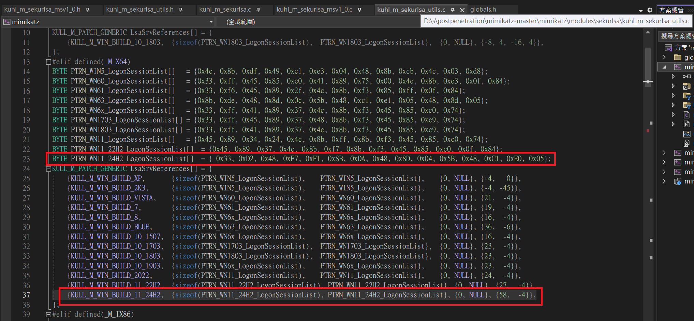

编译运行

然后失败了，是不报错了但疯狂输出`n.e. (KIWI_MSV1_0_CREDENTIALS KO)`

### 结构体

#### 一

但是调试的时候确实是正确找到`LogonSessionList` ，在经过漫长的调试后，发现解析有问题，以最好判断的`UserName`来看，似乎偏移差了些，但开头的链表确实是正确的。

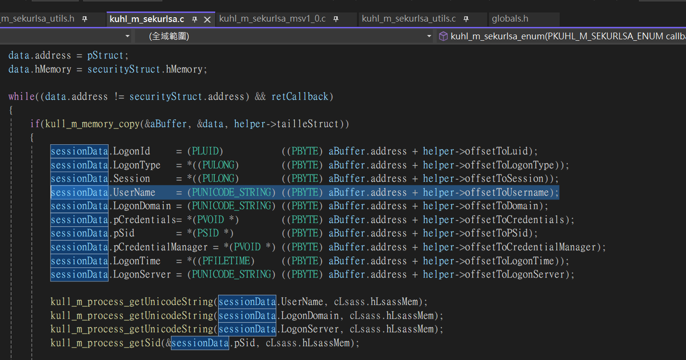

猜测是`KIWI_MSV1_0_LIST`这个结构体变了，查看`pypykatz` 项目，发现确实不同了，作者还贴心的添加上了注释

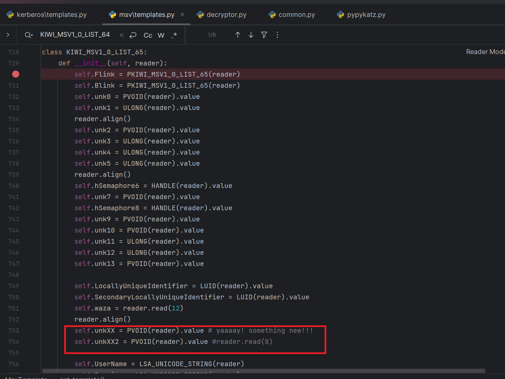

回到Mimikatz项目，找到定义结构体的地方添加一个类似的

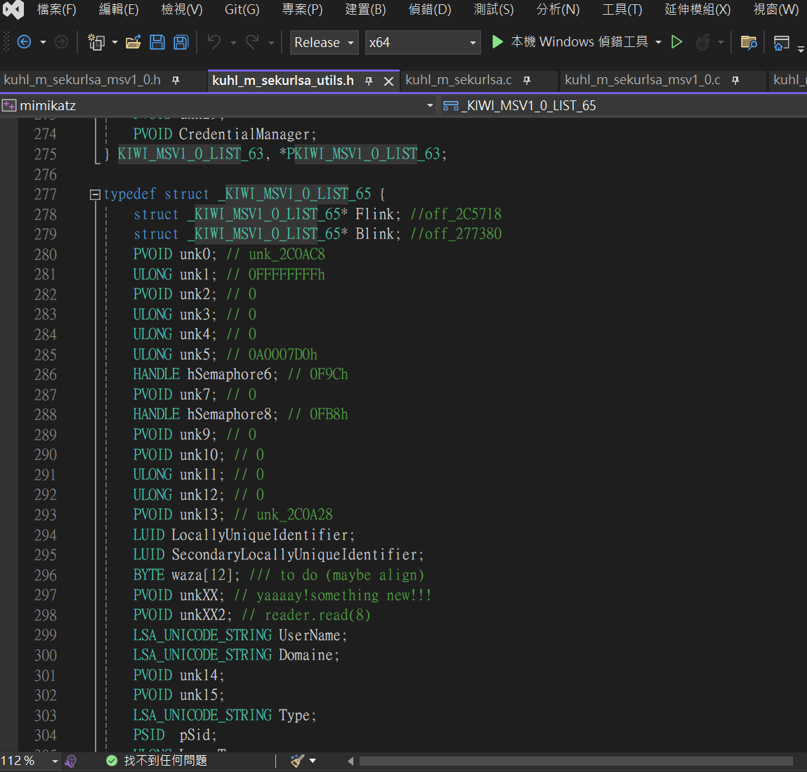

然后加上相关的版本选择逻辑

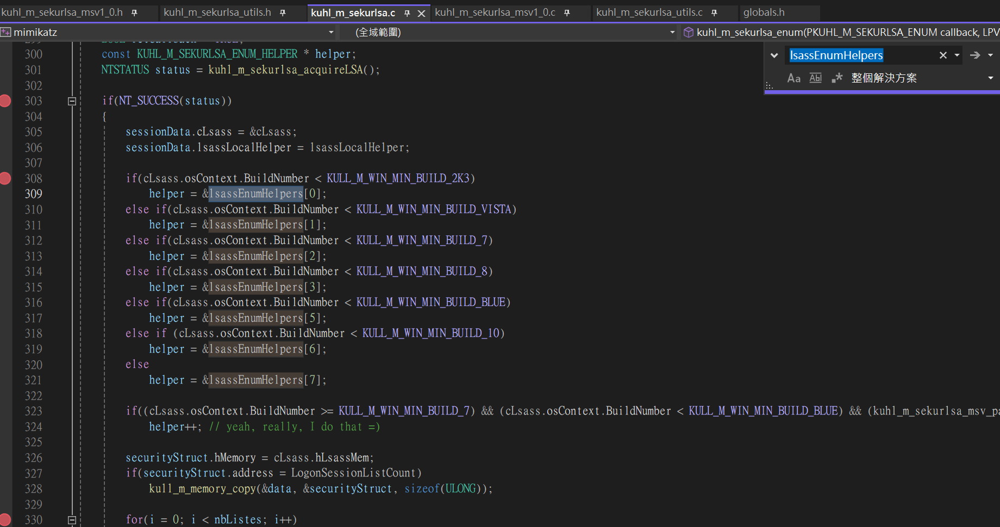

再编译运行

。。。输出了但凭据不正确，这次直接去调试`pypykatz`项目，顺便祈祷千万别是加解密方法变了，不然就要大改代码。

#### 二

很幸运并不是加解密方法大修，还是简单的结构体问题，`MSV1_0_PRIMARY_CREDENTIAL`凭据相关的结构体也变了下。原样抄过来，添加版本选择逻辑

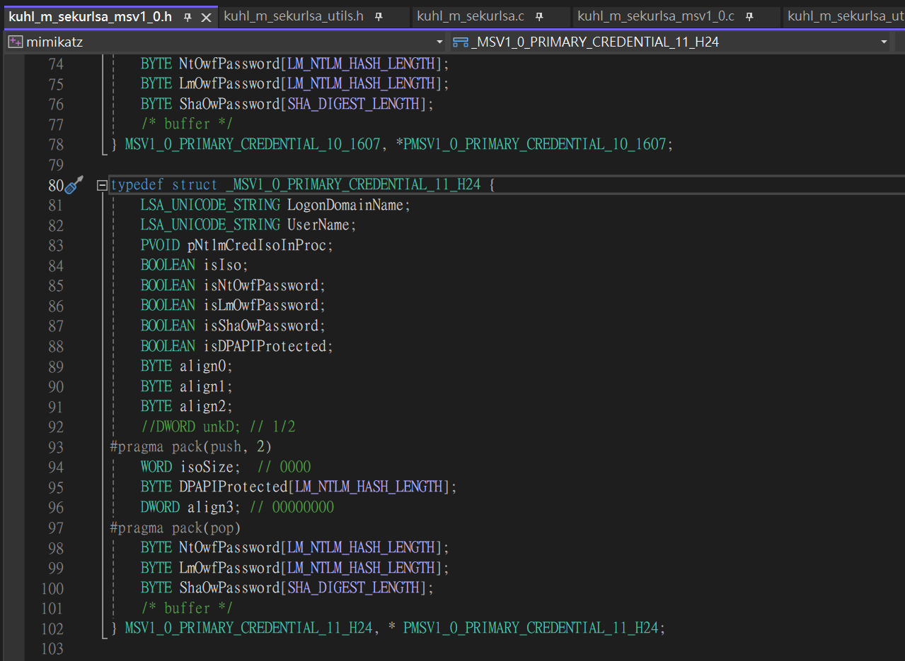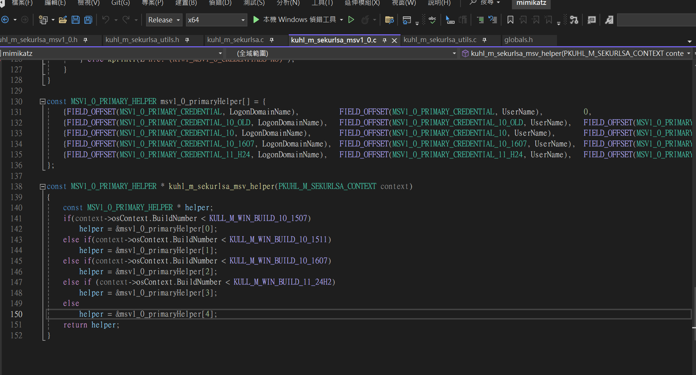

ok，提取与注入凭证正常

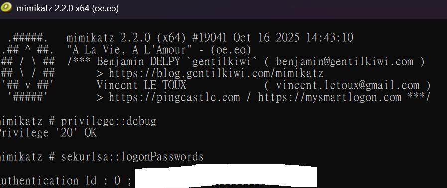

源码：

[LDAx2012/mimikatz: A little tool to play with Windows security](https://github.com/LDAx2012/mimikatz)

### 参考

[gentilkiwi/mimikatz: A little tool to play with Windows security](https://github.com/gentilkiwi/mimikatz)

[skelsec/pypykatz: Mimikatz implementation in pure Python](https://github.com/skelsec/pypykatz)
