# QnQSec CTF 2025部分wp-先知社区

> **来源**: https://xz.aliyun.com/news/19164  
> **文章ID**: 19164

---

# Misc

## Echoes of the Unknown

题目给了一个音频，是音频隐写，传统隐写工具试一遍发现是波形图：

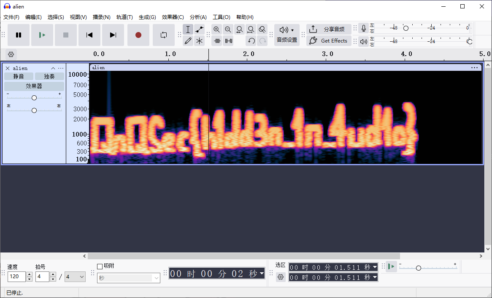

故答案：**QnQSec{h1dd3n\_1n\_4ud1o}**

## Catch Me

给了gif图片，分帧得到一堆二维码，写脚本批量扫：

```
import os
import cv2
from pyzbar.pyzbar import decode
from PIL import Image
import glob

def scan_qr_code(image_path):
    """扫描单个QR码并返回结果"""
    try:
        # 使用OpenCV读取图像
        img = cv2.imread(image_path)
        if img is None:
            # 如果OpenCV无法读取，尝试使用PIL
            pil_img = Image.open(image_path)
            img = cv2.cvtColor(np.array(pil_img), cv2.COLOR_RGB2BGR)
        
        # 解码QR码
        decoded_objects = decode(img)
        
        if decoded_objects:
            results = []
            for obj in decoded_objects:
                data = obj.data.decode('utf-8')
                results.append(data)
            return results
        else:
            return None
    except Exception as e:
        print(f"扫描 {image_path} 时出错: {e}")
        return None

def batch_scan_qr_codes(folder_path):
    """批量扫描文件夹中的所有QR码"""
    # 支持的图片格式
    extensions = ['*.png', '*.jpg', '*.jpeg', '*.bmp', '*.tiff']
    image_files = []
    
    for ext in extensions:
        image_files.extend(glob.glob(os.path.join(folder_path, ext)))
    
    # 按数字排序（假设文件名是数字.png）
    image_files.sort(key=lambda x: int(os.path.splitext(os.path.basename(x))[0]))
    
    print(f"找到 {len(image_files)} 个图片文件")
    print("开始扫描QR码...")
    
    all_results = {}
    
    for image_file in image_files:
        filename = os.path.basename(image_file)
        print(f"扫描: {filename}")
        
        results = scan_qr_code(image_file)
        
        if results:
            all_results[filename] = results
            print(f"  ✓ 找到QR码: {results}")
        else:
            print(f"  ✗ 未找到QR码")
    
    return all_results

def main():
    folder_path = "gifframe"  # 修改为你的文件夹路径
    
    if not os.path.exists(folder_path):
        print(f"文件夹 {folder_path} 不存在")
        return
    
    results = batch_scan_qr_codes(folder_path)
    
    print("
" + "="*50)
    print("扫描结果汇总:")
    print("="*50)
    
    if results:
        for filename, qr_data in results.items():
            print(f"{filename}: {qr_data}")
        
        # 将所有QR码数据合并
        all_data = []
        for filename in sorted(results.keys()):
            all_data.extend(results[filename])
        
        print("
所有QR码数据合并:")
        print("".join(all_data))
    else:
        print("未在任何图片中找到QR码")

if __name__ == "__main__":
    # 安装所需库:
    # pip install opencv-python pyzbar pillow
    main()
```


完善脚本：

```
#!/usr/bin/env python3
"""
scan_qr_base64.py
扫描 gifframe/0.png ... gifframe/340.png 中的二维码，解码 base64 并输出 results.csv 和 results.txt
依赖: pip install opencv-python pyzbar pillow numpy
"""

import os
import csv
import base64
from pathlib import Path
from PIL import Image
import cv2
from pyzbar import pyzbar
import numpy as np

INPUT_DIR = Path("gifframe")
OUT_CSV = Path("results.csv")
OUT_TXT = Path("results.txt")
START = 0
END = 340  # inclusive

def decode_with_pyzbar(pil_image):
    decoded = pyzbar.decode(pil_image)
    return [d.data.decode('utf-8', errors='replace') for d in decoded]

def decode_with_opencv(img_bgr):
    detector = cv2.QRCodeDetector()
    try:
        retval, decoded_info, points, straight_qrcode = detector.detectAndDecodeMulti(img_bgr)
        if retval and decoded_info:
            return [s for s in decoded_info if s]
    except Exception:
        pass
    # fallback
    data, points, straight = detector.detectAndDecode(img_bgr)
    if data:
        return [data]
    return []

def try_decode(path):
    try:
        pil = Image.open(path).convert("RGB")
    except Exception as e:
        return [], f"open_error: {e}"

    try:
        res = decode_with_pyzbar(pil)
        if res:
            return res, None
    except Exception:
        pass

    try:
        img = cv2.cvtColor(np.array(pil), cv2.COLOR_RGB2BGR)
    except Exception:
        try:
            img = cv2.imread(str(path))
        except Exception as e:
            return [], f"cv_read_error: {e}"

    try:
        res2 = decode_with_opencv(img)
        if res2:
            return res2, None
    except Exception as e:
        return [], f"opencv_error: {e}"

    # 尝试旋转
    for angle in (90, 180, 270):
        rot = pil.rotate(angle, expand=True)
        try:
            r = decode_with_pyzbar(rot)
            if r:
                return r, None
        except Exception:
            pass
        try:
            rot_bgr = cv2.cvtColor(np.array(rot), cv2.COLOR_RGB2BGR)
            r2 = decode_with_opencv(rot_bgr)
            if r2:
                return r2, None
        except Exception:
            pass

    return [], None

def decode_base64_safe(s):
    """尝试 base64 解码，失败则返回原字符串"""
    try:
        decoded_bytes = base64.b64decode(s, validate=True)
        return decoded_bytes.decode('utf-8', errors='replace')
    except Exception:
        return s

def main():
    rows = []
    txt_lines = []

    for i in range(START, END + 1):
        fname = INPUT_DIR / f"{i}.png"
        if not fname.exists():
            rows.append([f"{i}.png", 0, "", "", "missing"])
            txt_lines.append(f"{i}.png\tMISSING")
            continue

        decoded, err = try_decode(fname)
        if err:
            rows.append([f"{i}.png", 0, "", "", err])
            txt_lines.append(f"{i}.png\tERROR\t{err}")
            continue

        if decoded:
            joined = " ||| ".join(decoded)
            decoded_b64 = " ||| ".join([decode_base64_safe(d) for d in decoded])
            rows.append([f"{i}.png", len(decoded), joined, decoded_b64, "ok"])
            txt_lines.append(f"{i}.png\t{len(decoded)}\t{decoded_b64}")
        else:
            rows.append([f"{i}.png", 0, "", "", "no_qr"])
            txt_lines.append(f"{i}.png\tNO_QR")

    # 写 CSV
    with OUT_CSV.open("w", newline="", encoding="utf-8") as f:
        writer = csv.writer(f)
        writer.writerow(["filename", "count", "raw_data", "decoded_base64", "status"])
        writer.writerows(rows)

    # 写 TXT
    with OUT_TXT.open("w", encoding="utf-8") as f:
        f.write("
".join(txt_lines))

    print(f"完成。已写 {OUT_CSV} 和 {OUT_TXT}。")

if __name__ == "__main__":
    main()
```


**QnQSec{C4TCH\_M3\_1F\_Y0U\_C4N}**

## John Cena

给了一个gif，分帧，发现最后一帧是全白


然后stegslove发现flag

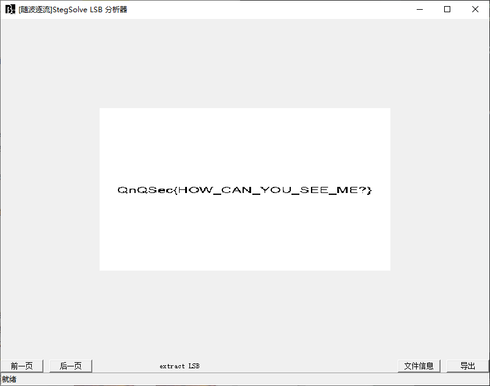

**QnQSec{HOW\_CAN\_YOU\_SEE\_ME?}**

## HeartBroken

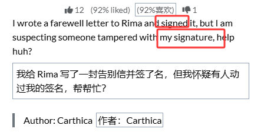

题目说是签名

“提取 PDF 里的签名”，我脑子里直接跑出 **最常用方法**：PyMuPDF 的 `page.get_images(full=True)` + `Pixmap.save()`，因为这是 PDF 图像提取的标准套路

本质上，这是**常见的 PDF 图像操作模板**：

1. `fitz.open()` 打开 PDF
2. `for page in doc:` 遍历每页
3. `page.get_images(full=True)` 获取所有内嵌图片
4. `fitz.Pixmap(doc, xref)` 生成像素图
5. `.save()` 保存成 PNG

```
import fitz  # PyMuPDF
doc = fitz.open("HeartBroken.pdf")
for i, page in enumerate(doc):
    for img_index, img in enumerate(page.get_images(full=True)):
        xref = img[0]
        pix = fitz.Pixmap(doc, xref)
        pix.save(f"page{i}_img{img_index}.png")
```

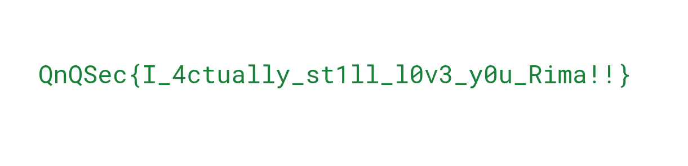

故答案：**QnQSec{I\_4ctually\_st1ll\_l0v3\_y0u\_Rima!!}**

# Hardware

## SmartCoffee

**挑战描述**

对 SmartCoffee 固件 / EEPROM 镜像进行静态分析，寻找隐藏的秘密（flag）。日志显示设备版本为 SmartCoffee v1.2，固件构建于 2025-10-15。目标是从固件/EEPROM 数据中恢复隐藏字符串。

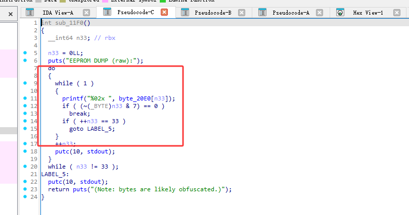

在固件反汇编中发现一个 33‑字节的 EEPROM 数据区（`byte_20E0[33]`），程序会把这些字节以十六进制打印出来并提示“bytes are likely obfuscated”。

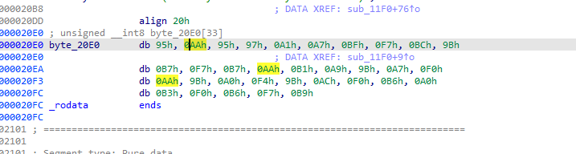

通过对该 33 字节做系统化的常见变换（单字节 XOR / 加 / 减；可选位循环移位 ROL/ROR；可选按位取反 NOT；以及有限的两字节重复密钥模式）进行暴力尝试，找到了可读且符合给定 flag 格式的明文

爆破代码：

```
#!/usr/bin/env python3
# bruteforce_eeprom.py
# 对 SmartCoffee EEPROM 33 字节做大量常见变换，找可能的 flag/QnQSec{}

from itertools import product
from collections import namedtuple

data = [
    0x95, 0xAA, 0x95, 0x97, 0xA1, 0xA7, 0xBF, 0xF7, 0xBC, 0x9B,
    0xB7, 0xF7, 0xB7, 0xAA, 0xB1, 0xA9, 0x9B, 0xA7, 0xF0,
    0xAA, 0x9B, 0xA0, 0xF4, 0x9B, 0xAC, 0xF0, 0xB6, 0xA0,
    0xB3, 0xF0, 0xB6, 0xF7, 0xB9
]

Result = namedtuple("Result", ["desc", "key", "rot", "pre_not", "post_not", "s", "print_ratio"])

def rol_byte(b, n):
    return ((b << n) | (b >> (8-n))) & 0xFF

def ror_byte(b, n):
    return ((b >> n) | ((b << (8-n)) & 0xFF)) & 0xFF

def to_printable_ratio(bs):
    printable = sum(1 for c in bs if 32 <= c <= 126)
    return printable / len(bs)

def bytes_to_str(bs):
    try:
        return bytes(bs).decode('utf-8', errors='replace')
    except Exception:
        return ''.join(chr(b) if 32 <= b <= 126 else '?' for b in bs)

def transform(data, op, key, rot, pre_not, post_not, use_rol):
    out = []
    for b in data:
        x = b
        if pre_not:
            x = (~x) & 0xFF
        if rot:
            if use_rol:
                x = rol_byte(x, rot)
            else:
                x = ror_byte(x, rot)
        if op == 'xor':
            x = x ^ key
        elif op == 'add':
            x = (x + key) & 0xFF
        elif op == 'sub':
            x = (x - key) & 0xFF
        if post_not:
            x = (~x) & 0xFF
        out.append(x)
    return out

def looks_promising(s):
    # 一些简单启发式：包含 flag 格式、关键子串或高可打印比率
    lower = s.lower()
    if "qnqsec{" in lower or "qnq" in lower:
        return True
    if "{" in s and "}" in s and (lower.count("q")>0 or "sec" in lower or "flag" in lower):
        return True
    # 高可打印率也可能是文本（阈值可调）
    return False

def main():
    candidates = []
    # ops to try
    ops = ['xor', 'add', 'sub']
    # try keys 0..255 (single-byte)
    keys = range(0, 256)
    # rotations 0..7 (0 means no rotation)
    rots = range(0, 8)
    # pre/post not boolean
    not_opts = [False, True]
    # use rol or ror for rotations
    rol_opts = [True, False]

    # We'll do it in phases to allow early findings and not produce too many outputs:
    # Phase 1: xor only, rol/ror 0..7, pre/post not combos
    print("Phase 1: XOR single-byte keys with rotations and NOTs...")
    for key in keys:
        for rot in rots:
            for pre_not, post_not, use_rol in product(not_opts, not_opts, rol_opts):
                out = transform(data, 'xor', key, rot, pre_not, post_not, use_rol)
                pr = to_printable_ratio(out)
                s = bytes_to_str(out)
                desc = f"xor key=0x{key:02X} rot={rot} {'ROL' if use_rol else 'ROR'} pre_not={pre_not} post_not={post_not}"
                if looks_promising(s) or pr > 0.9:
                    candidates.append(Result(desc, key, rot, pre_not, post_not, s, pr))
        # light progress feedback
        if key % 64 == 0:
            print(f" keys tried: {key}")

    # Phase 2: add/sub (in case encoding used +-)
    print("Phase 2: ADD / SUB single-byte keys with rotations and NOTs...")
    for op in ('add', 'sub'):
        for key in keys:
            for rot in rots:
                for pre_not, post_not, use_rol in product(not_opts, not_opts, rol_opts):
                    out = transform(data, op, key, rot, pre_not, post_not, use_rol)
                    pr = to_printable_ratio(out)
                    s = bytes_to_str(out)
                    desc = f"{op} key=0x{key:02X} rot={rot} {'ROL' if use_rol else 'ROR'} pre_not={pre_not} post_not={post_not}"
                    if looks_promising(s) or pr > 0.95:
                        candidates.append(Result(desc, key, rot, pre_not, post_not, s, pr)
                                         )

    # Phase 3: NOT-only, and pure rotations
    print("Phase 3: pure NOT / pure rotations...")
    for pre_not, post_not, use_rol in product(not_opts, not_opts, rol_opts):
        for rot in rots:
            out = transform(data, 'xor', 0x00, rot, pre_not, post_not, use_rol)
            pr = to_printable_ratio(out)
            s = bytes_to_str(out)
            desc = f"pure rot={rot} {'ROL' if use_rol else 'ROR'} pre_not={pre_not} post_not={post_not}"
            if looks_promising(s) or pr > 0.95:
                candidates.append(Result(desc, 0x00, rot, pre_not, post_not, s, pr))

    # Sort candidates by print_ratio desc
    candidates.sort(key=lambda r: r.print_ratio, reverse=True)

    outpath = "candidates.txt"
    with open(outpath, "w", encoding="utf-8") as f:
        f.write("desc\tkey\trot\tpre_not\tpost_not\tprint_ratio\tstring
")
        for c in candidates:
            line = f"{c.desc}\t0x{c.key:02X}\t{c.rot}\t{c.pre_not}\t{c.post_not}\t{c.print_ratio:.3f}\t{c.s}
"
            f.write(line)

    # Print top 20 to console
    print(f"Found {len(candidates)} candidate(s). Top 20:")
    for c in candidates[:20]:
        print(f"[{c.print_ratio:.3f}] {c.desc} -> {c.s}")

    print(f"
All candidates written to {outpath}
If nothing obvious, we can extend to repeating multi-byte keys or try base64/shift-xor combos.")

if __name__ == "__main__":
    main()
```

最后在0x3B找到答案  
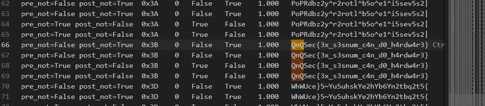

**QnQSec{3x\_s3snum\_c4n\_d0\_h4rdw4r3}**

# Crypto

## myLFSR?

利用已知明文（gift）恢复流生成器的初始状态和掩码（mask，系数），然后生成与 flag 加密时对应的密钥流并还原明文

LFSR 在 **GF(3)**（模 3）上工作，状态向量长度就是 `KEY` 的长度，本题 `len(KEY)=40`（题目第一行给了 `40`）。

LFSR 的每次输出是 `state[0]`（取最低位），然后状态右移并在末尾追加 `b = sum(state[i]*mask[i]) mod 3`。

加密流程把明文先转换为 **base-3 展开（LSB-first）** 的一串 trits（取 `expand(int.from_bytes(msg,"big"))`），然后逐位用 stream 做异或（这里异或是按整数位 `^`，但注意 stream 与 pt 的元素都在 {0,1,2}，在 Python 中 `^` 对小整数也可用以模拟题里实现的按位操作 —— 题中直接用了 `a ^ b`）。

程序给了两段密文：`gift`（是已知明文 `b'\xff'*k` 的加密输出）和 `ct`（flag 的密文）。

* 先把 `gift` 的明文 `b'\xff' * (len(KEY)//3 + 3)` 转为 base-3 展开 `pt_gift`（题里 `len(KEY)=40`，因此 `len(gift_pt)=40//3+3=16` 字节展开后是 81 个 trit —— 实际运行得到 81）。
* 因为 `ct = pt ^ stream`（逐位置异或），所以可以直接得到对应位置的 stream 输出： stream[i]=pt\_gift[i]⊕gift\_ct[i] ext{stream}[i] = ext{ptgift}[i] \oplus ext{giftct}[i]stream[i]=pt\_gift[i]⊕gift\_ct[i]
* 得到一段连续的 stream 输出（题中可观测到 81 个输出）。注意 LFSR 的状态长度是 40，我们需要至少 80 个输出来建立方程（40 输出用于初始状态，另 40 用来建立关于 mask 的线性方程）。本题 gift 给出足够数量的输出（81 >= 80）。
* 事实很简单：LFSR 的第 `t` 次输出就是状态中下标 0 的值；如果我们把时间从 0 开始，前 40 次输出就等于初始状态的 40 个分量（按定义 `output = state[0]`，随后状态右移）

给出exp：

```
# Advance by L steps by simulating the LFSR using recovered initial_state and mask.
from typing import List

def expand(n:int, base=3) -> List[int]:
    if n == 0:
        return [0]
    res = []
    while n:
        res.append(n % base)
        n //= base
    return res

def solve_mod3(A, b):
    n = len(A)
    m = len(A[0])
    M = [row[:] + [bval] for row, bval in zip(A, b)]
    r = 0
    for c in range(m):
        pivot = None
        for i in range(r, n):
            if M[i][c] % 3 != 0:
                pivot = i
                break
        if pivot is None:
            continue
        M[r], M[pivot] = M[pivot], M[r]
        inv = {1:1, 2:2}
        factor = M[r][c] % 3
        if factor != 1:
            mul = inv[factor]
            M[r] = [(val*mul) % 3 for val in M[r]]
        for i in range(n):
            if i != r and M[i][c] % 3 != 0:
                factor = M[i][c] % 3
                M[i] = [ (M[i][j] - factor * M[r][j]) % 3 for j in range(m+1) ]
        r += 1
        if r == n:
            break
    x = [0]*m
    for i in range(n):
        row = M[i]
        lead = None
        for j in range(m):
            if row[j] % 3 != 0:
                lead = j
                break
        if lead is None:
            if row[-1] % 3 != 0:
                raise ValueError("No solution")
            continue
        x[lead] = row[-1] % 3
    return x

gift_hex = "020000030303020100010000020302000001000100000301030302000001010301010300000002000301030300000200000301020100030302000000020100000001030100010300020203010103000102"
ct_hex = "01010002000003000002010000000203030201000000030100030003010103030001020200010301000202000202030302020103030002030100030002020000010200010000010100000200000103010103030302010301010100000000030000020203030300020103010002020100020201000100000000030003010301010101000101010002000203000102020002000000000102030303000000000301010102030002030100010002000203000000010200000000030001030003020303000300000302010303000301020302000003020003030102010102020000030201000103000100"

gift_ct = bytes.fromhex(gift_hex)
flag_ct = bytes.fromhex(ct_hex)

gift_msg = b'\xff' * 16
gift_pt = expand(int.from_bytes(gift_msg, "big"), base=3)

L = min(len(gift_pt), len(gift_ct))
gift_pt = gift_pt[:L]
gift_ct = gift_ct[:L]

stream = [ (gift_pt[i] ^ gift_ct[i]) for i in range(len(gift_pt)) ]

n = 40
initial_state = stream[:n]

# build A and b using observed stream
A = []
b = []
for t in range(n):
    row = [ stream[t + i] % 3 for i in range(n) ]
    A.append(row)
    b.append(stream[n + t] % 3)

mask = solve_mod3(A,b)

# simulate from initial_state to advance by L steps
state = initial_state.copy()
def lfsr_step(state, mask):
    b = sum((s*m) for s,m in zip(state, mask)) % 3
    out = state[0]
    state = state[1:] + [b]
    return out, state

for _ in range(L):
    _, state = lfsr_step(state, mask)

# now produce stream for flag
flag_len = len(flag_ct)
stream_for_flag = []
for _ in range(flag_len):
    out, state = lfsr_step(state, mask)
    stream_for_flag.append(out)

flag_pt_digits = [ (stream_for_flag[i] ^ flag_ct[i]) for i in range(flag_len) ]

flag_int = 0
pow3 = 1
for d in flag_pt_digits:
    flag_int += d * pow3
    pow3 *= 3

flag_bytes_len = (flag_int.bit_length() + 7) // 8
flag_bytes = flag_int.to_bytes(flag_bytes_len, "big")

print("Flag bytes:", flag_bytes)
try:
    print("Flag:", flag_bytes.decode())
except:
    print("Flag (hex):", flag_bytes.hex())
```

**QnQSec{i\_L1K3\_B3RleK4mP\_m4Ss3y\_0n\_m0d\_3\_f1elD}**

## Mandatory RSA

题目给了n,e,c  
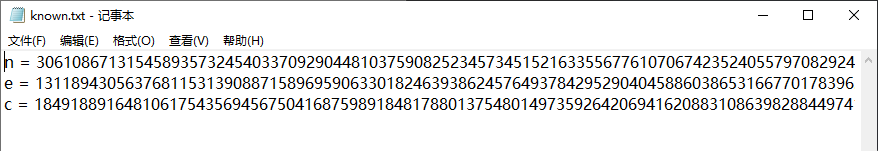

其中e很大  
恢复RSA私钥通过Wiener攻击

```
# Wiener's attack implementation
from math import isqrt
n = int("306108671315458935732454033709290448103759082523457345152163355677610706742352405579708292453566140304819558258743765655241261722502954792868290049961051221064746274149322783948807272076872471065359644517365244236760622279179390947556013126199389744637671052538170305904146469005438883478055445119898163929013473413387379068378960700237510312608157829732507346003006830949493045096923217535344352647945962967805865390851302321066498766600295066992445678668167569043643963785466707350172780598896323473386730552590536992466228096209090223297494640601320714648844846821125348133436
```

```
Found! k= 3 d= 7
p= 176853761228816649333788690878497264575352920554026422800747793118095154357968009833476319896190458655552043866116312357447653436646759560106384864907006010692243358536106106723598497967140667505512294857262423906296888616636856340197073186078570666701722848610246170360171276865123307180185294714754610802029 q= 173085756948878178625788829036396979643547050814457793814341331148766605789187283002068464155352993630741657411008958073160401373772644204592064419349682187445616327397431720300744099788959758958414956292259257567371905493030763155605895732442741621427538435428840044425754108589205232981712545393799037538201
```

然后就是常规rsa了  
**QnQSec{I\_l0v3\_Wi3n3r5\_@nD\_i\_l0v3\_Nut5!!!!}**

## myPrime

**目标**：基于以下程序片段的输出（`gift`, `mod`, AES-CTR 密文 `c` 与 `nonce`），恢复私有素数 `p`（或至少恢复用于 AES 的前 16 字节），并解出文件 `flag.txt`。

提供的值：

```
gift = 104626099582187045570705577706101323352247199453649888318511354500730812437522
mod = 107578905392932488325145874221470901714112119784815153190138107307251816686441
c = b"V\xab\xe0\xd0\x0c]\x88\xc0\xffw\xc3\rFw\xc3I\xe9\x15(j\xb3\xaey\xe3\xcf\x80u\x0e\x90\x14\x1d\x1a`n!\x03\x88:\xfa/R(1p\x9fr
Ry\x0f\xa5'\xf6\r\xdf\xc9\xdd\x05\xfb\xdd\x02\x08N7\x84\x05g"
nonce = b'Ot\xa1\xdf\x93H\xbe\xa3'
```

一、背景与脆弱点概述

目标程序使用了一个**结构化素数**：

```
p = pp^2 + pp + 3
```

其中 `pp` 是一个 256-bit 的随机数（`randbits(bits//2)`），因此 `p` 大约 512-bit。程序把某个经 isogeny 后的曲线阶 `E_.order()` 对一个 256-bit 的 `mod` 取余并输出为 `gift`：

```
gift = int(E_.order()) % mod
```

同时用 `p` 的字节作为 AES key（取 `long_to_bytes(p)[:16]`）对 `flag.txt` 做了 AES‑CTR 加密并打印密文与 nonce。

脆弱点在于：

* `p` 有明确代数结构 `pp^2+pp+3`；
* `gift` 将 `E_.order`（和 `p` 密切相关，参见 Hasse 关系）在模 `mod` 下暴露了一些信息；
* `mod` 大小（256-bit）与 `sqrt(p)` 的量级相近，故通过模方程可以把 `s ≈ sqrt(p)` 在模 `mod` 上求残类，从而把实数区间内的候选数压缩到很小的 t 范围。

综上，结合代数结构与 `gift (mod mod)` 的信息，可以通过解模方程并枚举少量平移倍数来恢复 `s`，从而得到 `p` 并解密 AES。

二、数学推导（关键恒等与约束）

设目标素数 `p = pp^2 + pp + 3`。令 `s = pp`，则

```
p = s(s+1) + 3
```

由题意我们知道 `E_.order ≡ gift (mod mod)`。经验上，`E_.order` 近似 `p`（Hasse：`#E(F_p) = p + 1 - t`, |t| ≤ 2√p），因此我们可以把 `p` 近似等同于一个满足 `p ≡ gift (mod mod)` 的整数。

把方程变形：令 `candidate = p`，则

```
candidate - 3 = s(s+1)
```

两边对模 `mod` 考虑：

```
R ≡ (gift - 3) (mod mod)
```

于是我们在模 `mod` 上得到二次方程：

```
s^2 + s - R ≡ 0 (mod mod).
```

构造判别式 `D = 1 + 4R (mod mod)`，若 `sqrt(D)` 在模 `mod` 中存在，则

```
s ≡ (-1 ± sqrt(D)) / 2 (mod mod)
```

这给出了 `s` 在模 `mod` 上的两个残类 `s0`, `s1`。

真实的 `s` 约等于 `sqrt(p)`，位宽大约为 256 位。故真实的 `s` 必满足

```
s = s_res + t * mod
```

其中 `t` 为整数，我们只需在使 `s` 落在合适位宽（例如 `[2^255, 2^257)`）的极少几个 `t` 值上枚举。对每个候选 `s`，计算 `p = s(s+1)+3` 并检查：

* `p` 与 `gift (mod mod)` 是否一致（形式上会一致，因为构造使然）；
* `p` 是否为素数（或至少作 probable-prime 测试）；
* 用 `long_to_bytes(p)[:16]` 构造 AES key 并对密文尝试解密，观察是否获得可读 flag（匹配 `QnQSec{}`）。

这种方法的关键是：由于 `mod` 大小 ~256 位，`t` 的取值范围在现实中通常非常小（比如 0..几），因此问题可以变得可解。

三、实现细节（核心代码片段）

下面给出我用于复现的关键 Python 代码段（已在会话中运行并验证）：

```
# tonelli_shanks 用于模素数求平方根
def tonelli_shanks(n, p):
    n %= p
    if n == 0:
        return 0
    if p % 4 == 3:
        x = pow(n, (p+1)//4, p)
        return x if (x*x) % p == n else None
    # 否则通用实现（见前文）

# 计算 R = (gift - 3) mod mod
R = (gift - 3) % mod
D = (1 + 4*R) % mod
sqrtD = tonelli_shanks(D, mod)

s0 = ((-1 + sqrtD) * inv2) % mod
s1 = ((-1 - sqrtD) * inv2) % mod

# 枚举 t 使得 s = s_res + t*mod 落在期望的位宽内
low = 1 << 255
high = 1 << 257
for s_res in (s0, s1):
    t_min = (low - s_res) // mod
    t_max = (high - s_res) // mod + 1
    for t in range(t_min, t_max+1):
        s = s_res + t * mod
        p_candidate = s*(s+1) + 3
        # 可选：primality test
        # 如果是素数或解密后得到可读文本，则成功
```

四、会话中运行结果（关键中间值）

* 计算得到的两个模残类（省略超大整数全文，已在会话中计算）记为 `s0`, `s1`。
* 对每个残类选取合适的 t 范围（在 `[2^255, 2^257)` 区间内），具体得到的 t 范围非常小（例如 0..2 等），共生成了 6 个候选 `s`/`p`。
* 对这些候选 `p` 的前 16 字节作为 AES key 解密密文后，得到了一个可读字符串，完全匹配 flag 格式：

```
QnQSec{H1lb3rt_cl4sS_p0lynOmiAl_w1tH_DiScR1m1nANt_5pEc1al_d3s1gn3D}
```

exp:

```
from math import isqrt
from Crypto.Util.number import long_to_bytes, isPrime
from Crypto.Cipher import AES

gift = 104626099582187045570705577706101323352247199453649888318511354500730812437522
mod = 107578905392932488325145874221470901714112119784815153190138107307251816686441
c = b"V\xab\xe0\xd0\x0c]\x88\xc0\xffw\xc3\rFw\xc3I\xe9\x15(j\xb3\xaey\xe3\xcf\x80u\x0e\x90\x14\x1d\x1a`n!\x03\x88:\xfa/R(1p\x9fr
Ry\x0f\xa5'\xf6\r\xdf\xc9\xdd\x05\xfb\xdd\x02\x08N7\x84\x05g"
nonce = b'Ot\xa1\xdf\x93H\xbe\xa3'

# Tonelli-Shanks 实现（略）
# 见上文代码块

R = (gift - 3) % mod
D = (1 + 4*R) % mod
sqrtD = tonelli_shanks(D, mod)
if sqrtD is None:
    raise Exception("D 没有平方根，无法继续")

inv2 = pow(2, -1, mod)
s0 = ((-1 + sqrtD) * inv2) % mod
s1 = ((-1 - sqrtD) * inv2) % mod

low = 1 << 255
high = 1 << 257
for s_res in (s0, s1):
    t_min = (low - s_res) // mod
    t_max = (high - s_res) // mod + 1
    for t in range(t_min, t_max+1):
        s = s_res + t*mod
        if s <= 0: continue
        p_candidate = s*(s+1) + 3
        # 位长筛选
        if p_candidate.bit_length() < 400 or p_candidate.bit_length() > 600:
            continue
        # 可选素性检测
        # if not isPrime(p_candidate): continue
        key = long_to_bytes(p_candidate)[:16]
        cipher = AES.new(key, AES.MODE_CTR, nonce=nonce)
        pt = cipher.decrypt(c)
        if b"QnQSec{" in pt:
            print("FOUND:", pt)
            raise SystemExit
```

**QnQSec{H1lb3rt\_cl4sS\_p0lynOmiAl\_w1tH\_DiScR1m1nANt\_5pEc1al\_d3s1gn3D}**

# Reverse

## baby\_baby\_reverse

ida打开：  
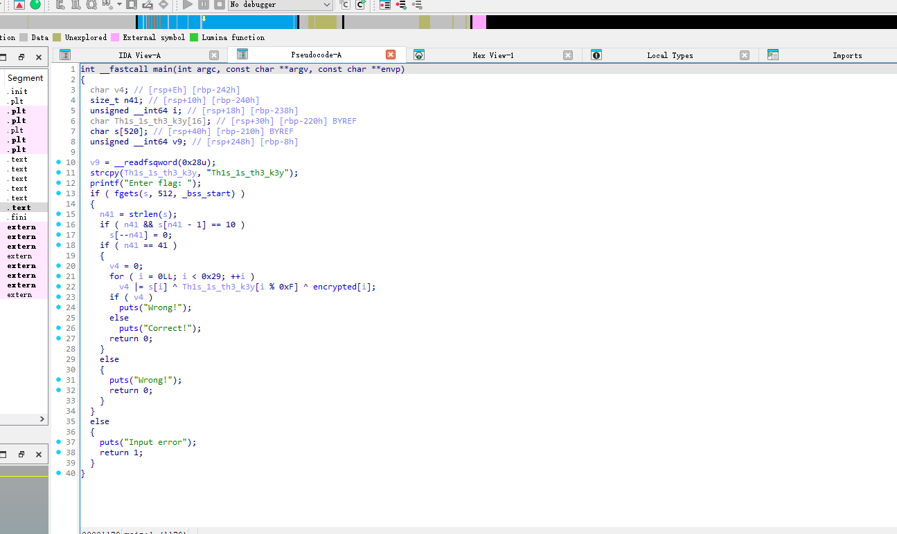

每个加密字节与常量密钥按位置异或就能得到明文。

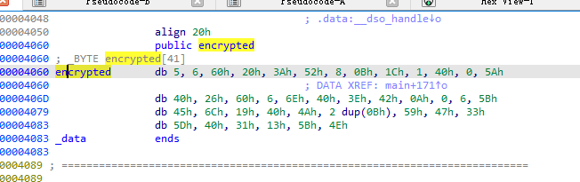

程序要求输入长度为 41（0x29）；  
密钥字符串是 `"Th1s_1s_th3_k3y"`（长度 15），索引用 `i % 0xF`；  
所以 `s[i] = encrypted[i] ^ key[i % 15]`。

```
key = b"Th1s_1s_th3_k3y"  # length?
len(key), key
enc = [5,6,0x60,0x20,0x3A,0x52,8,0x0B,0x1C,1,0x40,0,0x5A,
64,38,96,6,110,64,62,66,10,0,6,91,
69,108,25,64,74,0x0B,0x0B,89,71,51,
0x5D,0x40,0x31,0x13,0x5B,0x4E]
len(enc)
```

**QnQSec{This\_1s\_4n\_3asy\_r3v3rs3\_ch4ll3ng3}**

## Baby\_Reverse\_Revenge\_From\_NHNC

本题是一个加密程序，使用 AES-256-CBC 模式加密 flag。程序通过嵌入的 shellcode 动态生成 AES 密钥，我们需要逆向分析 shellcode 来获取密钥，然后解密 `flag.enc` 文件。

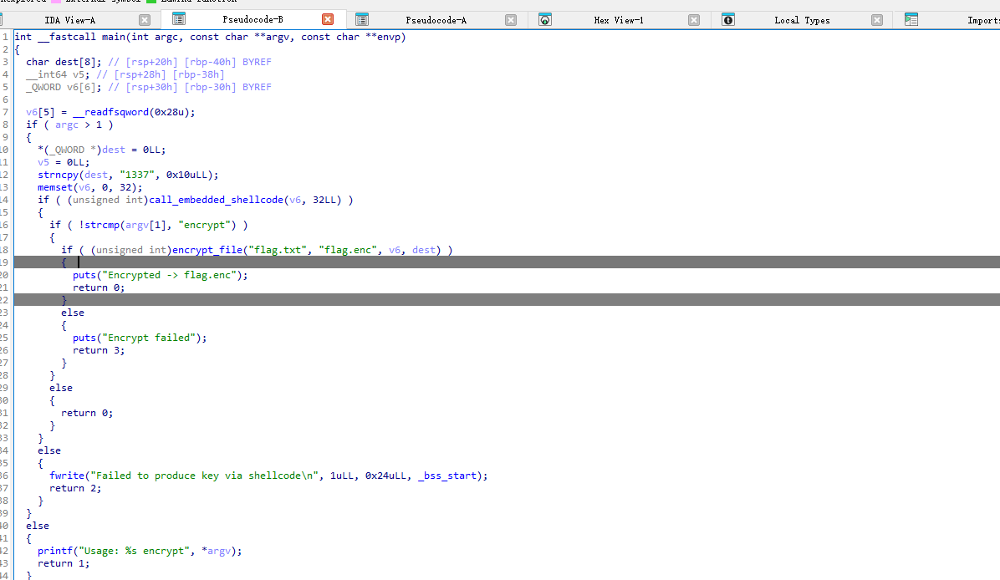

AES-256 密钥是 `th1_1s_th3_valu3_0f_k3y` 后面补 9 个空字节

Shellcode 分析：

关键函数 `call_embedded_shellcode` 负责执行嵌入的机器码来生成密钥。通过分析 `.rodata` 段的 shellcode 数据：

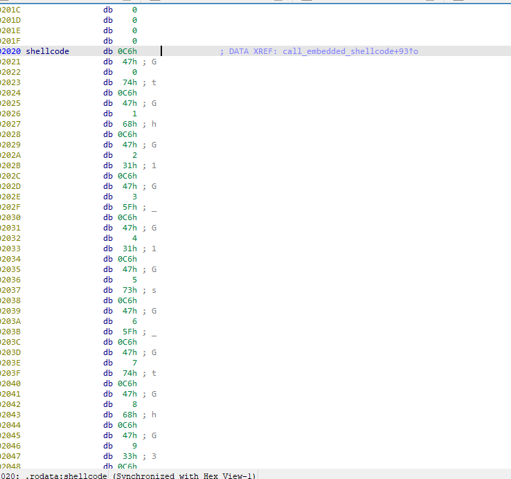

这段 shellcode 实际上是在直接构造密钥，将 32 字节的缓冲区填充为固定值。

将 shellcode 中设置的字节值转换为 ASCII：得到密钥字符串：`th1_1s_th3_valu3_0f_k3y` + 9 个空字节

故exp:

```
from Crypto.Cipher import AES

# AES 密钥
key_str = "th1_1s_th3_valu3_0f_k3y" + "\x00" * 9
key = key_str.encode('latin-1')

# IV
iv_str = "1337" + "\x00" * 12
iv = iv_str.encode('latin-1')

# 读取加密的 flag.enc
with open('flag.enc', 'rb') as f:
    ciphertext = f.read()

# 解密
cipher = AES.new(key, AES.MODE_CBC, iv)
plaintext = cipher.decrypt(ciphertext)

# 去除可能的填充
try:
    padding_len = plaintext[-1]
    if padding_len <= 16 and all(b == padding_len for b in plaintext[-padding_len:]):
        plaintext = plaintext[:-padding_len]
except:
    pass

# 输出结果
print("Decrypted:")
print(plaintext.decode('latin-1', errors='ignore'))

# 保存到文件
with open('flag_decrypted.txt', 'wb') as f:
    f.write(plaintext)
```

**QnQSec{a\_s1mpl3\_fil3\_3ncrypt3d\_r3v3rs3}**
