# Go模糊测试实战：原理解剖+CVE漏洞挖掘过程复现-先知社区

> **来源**: https://xz.aliyun.com/news/19178  
> **文章ID**: 19178

---

## 概述

近期，由于一些原因，笔者接触了多篇关于模糊测试的技术文章，由于此前缺乏模糊测试的实践经验，因此，在理解部分技术细节时遇到了一定困难。

为了能够深入理解相关技术，于是，笔者决定对模糊测试技术进行一系列梳理及研究，便于笔者及道友们一起共勉学习。

## 基础概念及工具生态

在开始对模糊测试技术进行研究前，我们先对模糊测试技术的基本概念及工具生态进行简单的梳理。

### 什么是模糊测试？

根据维基百科的描述，我们可知，模糊测试是一种常用的软件安全测试技术，目的是寻找软件系统或给定目标程序的漏洞。其核心思想就是通过向目标程序提供大量随机、半随机或变异的恶意输入，并监控程序的运行状态（如崩溃、内存泄漏、断言失败等），从而发现潜在的安全缺陷。

在网络安全领域，模糊测试被广泛应用于挖掘发现可能导致远程代码执行、拒绝服务、权限提升、信息泄露等严重后果的漏洞。

维基百科介绍截图如下：


### 模糊测试工具生态

其实在接触模糊测试前，笔者就曾听过好几个名词：LLVM、LibFuzzer、AFL......虽然听过，并却是了解不深。

为了便于笔者选择一款合适的模糊测试工具用于模糊测试技术研究，在这里，笔者尝试基于网络资料梳理了常见编程语言的模糊测试工具代表，梳理如下：

* C/C++

* LibFuzzer：基于LLVM的in-process（进程内）模糊测试引擎，与Clang编译器紧密集成，通过sanitizers（如AddressSanitizer）检测错误。
* AFL (American Fuzzy Lop)：经典的黑盒/灰盒模糊测试工具，通过变异输入（如 bitflip）探索代码路径，支持二进制文件fuzzing，2024停止维护。
* AFL++：AFL 的社区增强版，性能更强，添加了更多mutation技术（如字典-based）和优化。
* LLVM：开源编译器基础设施项目。

* Golang

* go-fuzz：Go生态中最早且最成熟的覆盖率引导式模糊测试工具，从2024.3至今未更新。
* gofuzz：Google开源库，主要用于生成随机结构体数据，常用于单元测试和fuzzing辅助，2024停止维护。
* go test -fuzz：Go 1.18+ 内置命令（go test -fuzz），基于覆盖率引导的fuzzing，支持种子语料和并行执行。

* Rust

* cargo fuzz：Cargo 子命令（rust-fuzz/cargo-fuzz），使用libFuzzer作为后端，自动化生成fuzz目标和集成sanitizers，支持Rust项目fuzzing。

* Python

* hypothesis：Property-based测试库，通过定义属性生成结构化输入，支持fuzzing模式（如 HypoFuzz 扩展），适用于API和逻辑验证。
* python-afl：AFL的Python包装器，通过QEMU或unicorn模拟执行Python脚本，进行mutational fuzzing，检测崩溃和异常。，从2020至今未更新。

在对各类模糊测试代表工具对比了解后，笔者最终决定使用go test -fuzz作为模糊测试工具开展后续模糊测试技术研究，原因如下：

* GO语言是第一个将原生模糊测试内置并集成到其标准工具链中的主流编程语言；
* Go内置模糊测试（fuzzing）内部实现了类似libFuzzer的核心功能，而libFuzzer目前是模糊测试领域中比较热门的技术之一；
* 模糊测试技术还是比较复杂，选择笔者熟悉的GO语言可能更易上手。

## CVE-2024-44337

由于笔者也是初次接触模糊测试技术，因此，在第一次尝试漏洞挖掘复现时，笔者决定先基于网络中的fuzz教程进行漏洞挖掘复现。

在这里，笔者参考了看雪论坛上Brinmon作者的《[原创]CVE-2024-44337--手把手教你go-fuzz模糊测试引擎如何进行漏洞挖掘》（`https://bbs.kanxue.com/thread-284029.htm`）文章内容，在此文章中，Brinmon作者主要是使用go-fuzz工具进行的漏洞挖掘复现。

笔者在对比了go官方fuzz方法和go-fuzz工具的使用方法后，决定基于Brinmon作者的文章逻辑，换一个fuzz工具，采用go官方fuzz方法对CVE-2024-44337漏洞进行漏洞挖掘复现。

### 漏洞原理

在阿里云漏洞库中可查看CVE-2024-44337漏洞的漏洞描述信息，漏洞描述中指出：github.com/gomarkdown/markdown库存在漏洞，攻击者可通过定制输入导致程序无限循环。相关漏洞描述信息如下：

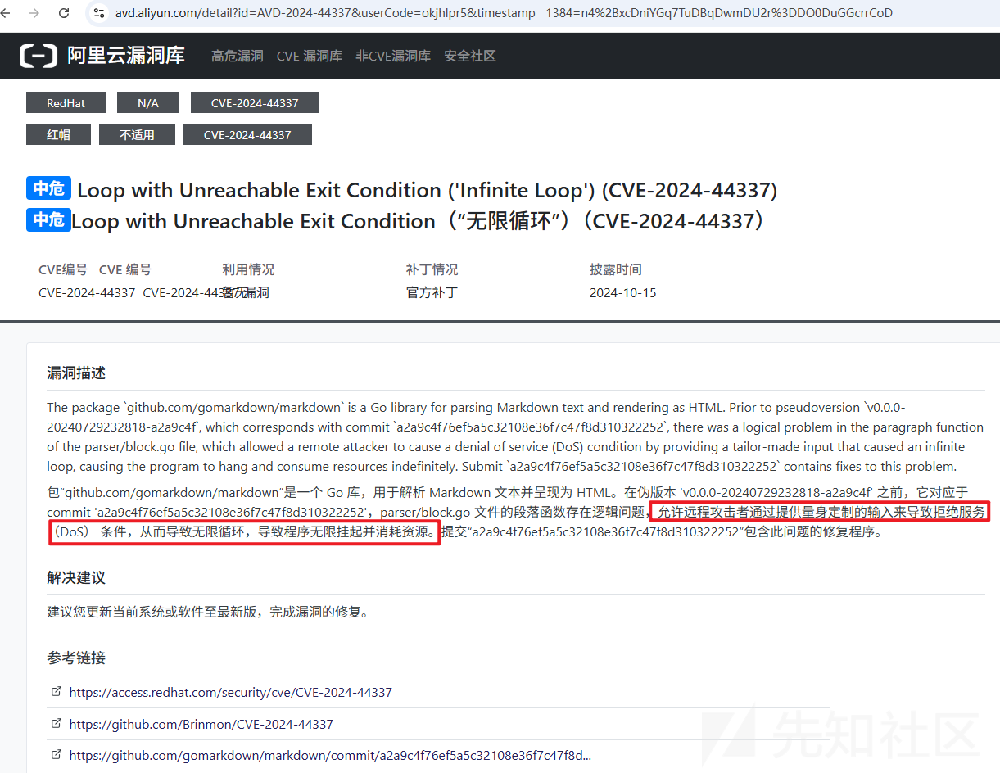

### 获取存在漏洞的库代码

根据阿里云漏洞库中CVE-2024-44337漏洞的参考链接（`https://github.com/gomarkdown/markdown/commit/a2a9c4f76ef5a5c32108e36f7c47f8d310322252`），我们可知CVE-2024-44337漏洞对应的修复commit为a2a9c4f。因此，我们使用git回退到漏洞修复commit的前一个commit，即可获取存在漏洞的markdown库代码。

相关命令如下：

* `git clone https://github.com/gomarkdown/markdown.git`
* `git reset --hard afa4a46`

相关截图如下：

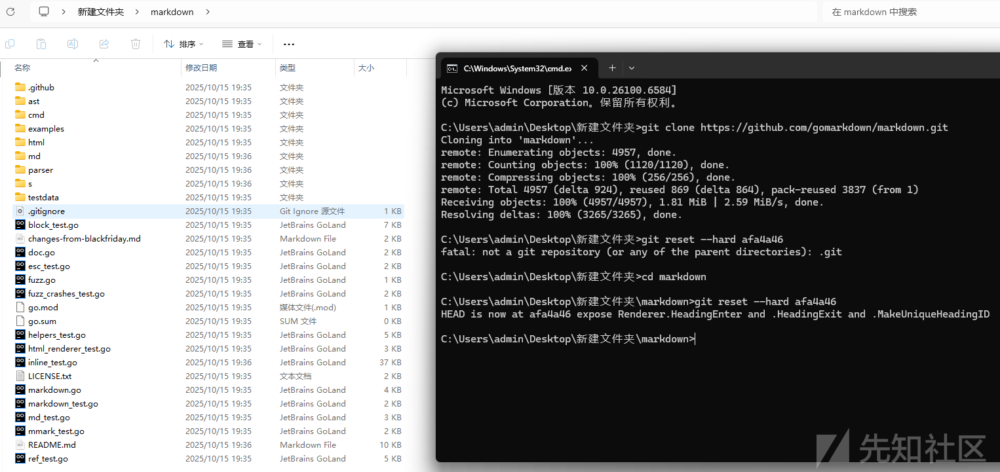

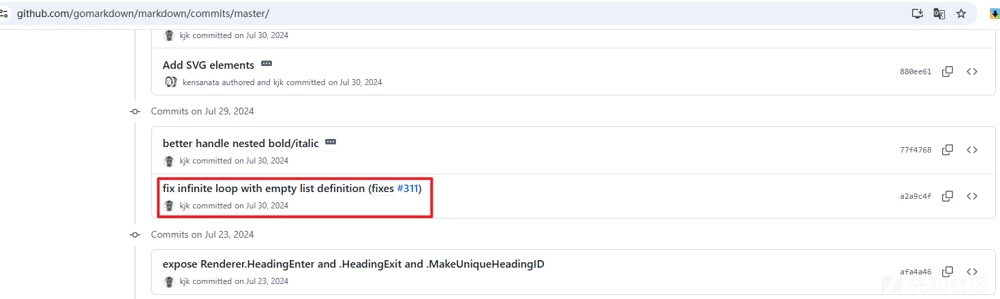

### 构建漏洞环境并触发漏洞

有了存在漏洞的markdown库代码，我们即可构建漏洞环境了：

* 将存在漏洞的markdown库代码中的`github.com/gomarkdown`字符串替换为`Test_CVE-2024-44337`（实际工程名），用于避免使用本地包时加载最新markdown库代码；
* 删除markdown库代码中的go.mod、go.sum文件，否则Go项目无法识别本地包；
* 使用`https://github.com/gomarkdown/markdown`项目介绍中的Demo代码作为测试代码一；
* 修改Demo代码作为测试代码二，将main函数中mds变量修改为`“~~~~\xb4~\x94~\x94~\xd1
  :\xb4\x94\x94~\x9f~\xb4~\x94~\x94\x94”`字符串，用于触发漏洞；

测试代码一中，正常运行截图如下：

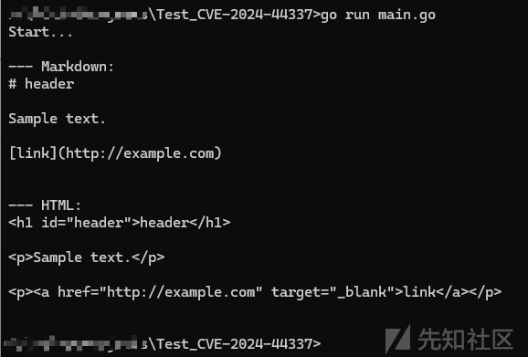

测试代码二中，定制化输入导致程序无限循环的漏洞触发运行截图如下：

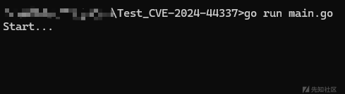

Go项目截图如下：

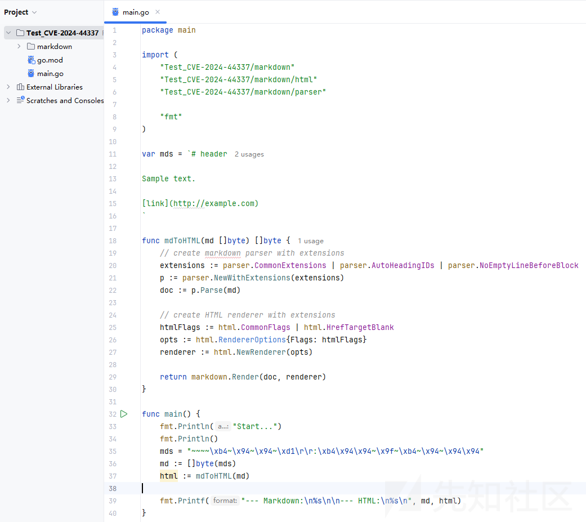

### 使用GO模糊测试挖掘漏洞

接下来，我们就尝试使用GO模糊测试挖掘漏洞：

* 下载语料库：`https://github.com/PMunch/markdown-corpus`

* 使用Brinmon作者文章中的相同语料库
* 多次测试发现，此漏洞不使用语料库也能成功挖掘漏洞

* 构建Fuzz代码，由于此漏洞触发后会导致程序无线循环，因此需要在代码中设置一个超时时间
* 执行`go test -fuzz=FuzzBug311 -v`开启GO模糊测试

开启GO模糊测试运行一段时间后，程序即会中断并提示：`~~~\
:` 字符串输入运行超时，字符串数据已写入testdata\fuzz\FuzzBug311\90d72208508b3e09文件中。相关截图如下：

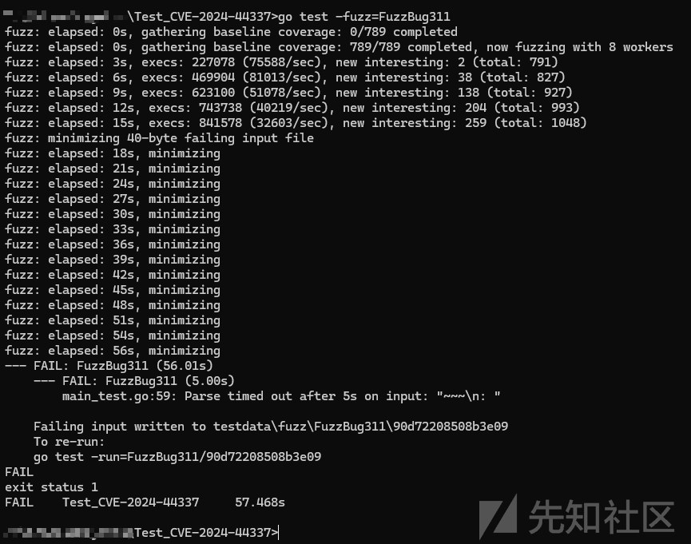

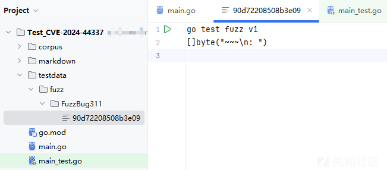

测试文件内容如下：

```
package main

import (
    "Test_CVE-2024-44337/markdown/parser"
    "context"
    "os"
    "path/filepath"
    "strings"
    "testing"
    "time"
)

func WalkDir(dirPth, suffix string) (files []string, err error) {
    files = make([]string, 0, 30)
    suffix = strings.ToUpper(suffix)
    err = filepath.Walk(dirPth, func(filename string, fi os.FileInfo, err error) error {
        if fi.IsDir() {
            return nil
        }
        if strings.HasSuffix(strings.ToUpper(fi.Name()), suffix) {
            files = append(files, filename)
        }
        return nil
    })
    return files, err
}

func FuzzBug311(f *testing.F) {
    files, _ := WalkDir("corpus", "")
    for _, onefile := range files {
        data, _ := os.ReadFile(onefile)
        f.Add(data)
    }

    f.Fuzz(func(t *testing.T, data []byte) {
        //基本检查：输入过长可能超时，跳过
        if len(data) > 1000 {
            t.Skip()
        }

        p := parser.New()

        // 创建带超时的上下文（5秒）
        ctx, cancel := context.WithTimeout(context.Background(), 5*time.Second)
        defer cancel()

        // 用 goroutine 隔离 Parse，避免阻塞
        done := make(chan bool)
        go func() {
            defer func() { done <- true }()
            p.Parse(data)
        }()

        select {
        case <-done:
        case <-ctx.Done():
            t.Errorf("Parse timed out after 5s on input: %q", data)
        }
    })
}

```

尝试使用`"~~~\
:"` 字符串触发漏洞，发现`"~~~\
:"` 字符串与`“~~~~\xb4~\x94~\x94~\xd1
:\xb4\x94\x94~\x9f~\xb4~\x94~\x94\x94”`字符串效果相同，均可成功触发漏洞，导致程序无限循环。相关截图如下：

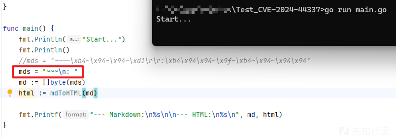

## CVE-2025-22865

在有了上述CVE-2024-44337漏洞的挖掘经验后，于是，笔者决定再重新找一个新漏洞进行模糊测试漏洞挖掘尝试。

基于`www.cve.org`网站中的漏洞记录，笔者选择了GO语言标准库crypto/x509组件的一个漏洞，漏洞编号为CVE-2025-22865。

### 漏洞原理

同样在阿里云漏洞库中可查看CVE-2025-22865漏洞的漏洞描述信息，漏洞描述中指出：go1.24.0-rc2及以下版本的crypto/x509组件在解析缺少CRT值的RSA密钥时，会导致程序崩溃。相关漏洞描述信息如下：

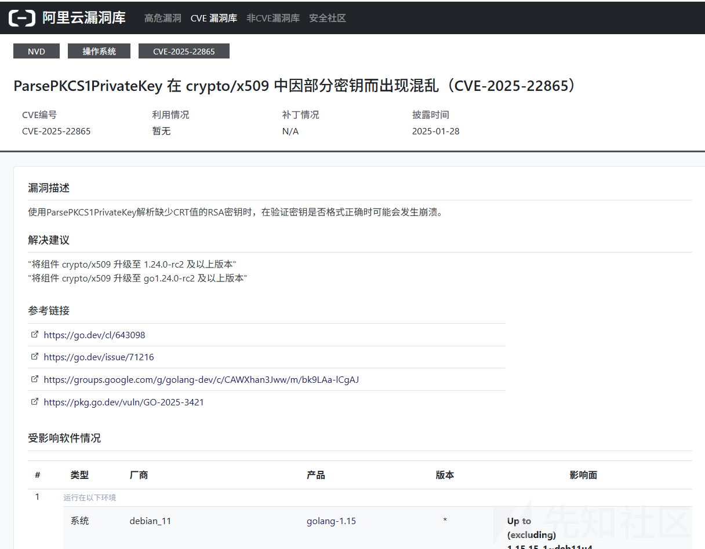

### 获取存在漏洞的库代码

按照上述思路，我们可找到对应漏洞的修复commit为6a4effa08ba5c7b182d319a2a8ddd782274c2f74，我们虽然可采用上述相同方法获取存在漏洞的库代码，但在这里，笔者将直接通过下载对应版本（go1.24.0-rc1）的GO安装包来达到获取存在漏洞的库代码的效果。

漏洞修复commit截图如下：


从官方下载对应版本GO安装包的截图如下：

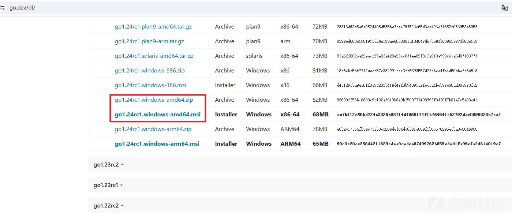

### 构建漏洞环境并触发漏洞

成功下载对应版本的GO安装包后，我们即可构建漏洞环境了：

* 首先，在Linux环境中，使用`openssl genrsa -traditional -out key.pem 2048`、`openssl req -new -x509 -key key.pem -out cert.pem -days 365 -subj "/CN=localhost"`命令生成key.pem、cert.pem文件
* 其次，为了便于对比漏洞触发效果，笔者尝试构建了一个程序，用于基于RSA密钥生成缺少CRT值的新RSA密钥

* 备注：直接使用openssl命令是无法生成缺少CRT值的RSA密钥的

Linux环境中，生成key.pem、cert.pem文件的截图如下：

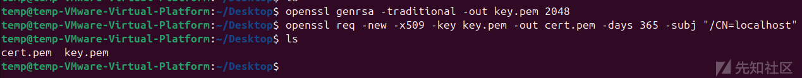

基于RSA密钥生成缺少CRT值的新RSA密钥的程序代码如下：

```
package main

import (
    "crypto/x509"
    "encoding/asn1"
    "encoding/hex"
    "encoding/pem"
    "fmt"
    "io/ioutil"
    "math/big"
    "os"
    "path/filepath"
    "strings"
)

func main() {
    filename := "key.pem"
    pemPrivateKey, _ := os.ReadFile(filename)
    block, _ := pem.Decode(pemPrivateKey)
    fmt.Println(hex.EncodeToString(block.Bytes))
    priv, err := x509.ParsePKCS1PrivateKey(block.Bytes)
    if err != nil {
        return
    }

    //从/crypto/x509/x509_test.go代码中复制

    // A partial key without CRT values should still parse.
    b, _ := asn1.Marshal(struct {
        Version int
        N       *big.Int
        E       int
        D       *big.Int
        P       *big.Int
        Q       *big.Int
    }{
        N: priv.N,
        E: priv.PublicKey.E,
        D: priv.D,
        P: priv.Primes[0],
        Q: priv.Primes[1],
    })

    fmt.Println(hex.EncodeToString(b))

    pemBytes := pem.EncodeToMemory(&pem.Block{
        Type:  "RSA PRIVATE KEY", // 根据内容调整，如 "PUBLIC KEY" 等
        Bytes: b,                 // DER 数据
    }) // EncodeToMemory 返回 []byte
    if pemBytes == nil {
        panic("PEM 编码失败")
    }
    fmt.Printf("NEW PEM 内容:
%s
", string(pemBytes))

    p2, err := x509.ParsePKCS1PrivateKey(b)
    if err != nil {
        fmt.Println("parsing partial private key resulted in an error: %v", err)
    }
    if !p2.Equal(priv) {
        fmt.Println("partial private key did not match original key")
    }
    if p2.Precomputed.Dp == nil || p2.Precomputed.Dq == nil || p2.Precomputed.Qinv == nil {
        fmt.Println("precomputed values not recomputed")
    }

    newfile := strings.TrimSuffix(filepath.Base(filename), filepath.Ext(filename)) + "_noCRT" + filepath.Ext(filename)
    err = ioutil.WriteFile(newfile, pemBytes, 0600) // 0600 为文件权限（仅所有者读写）
    if err != nil {
        panic(err)
    }
    fmt.Println("PEM 文件已保存为", newfile)
}
```

然后，笔者尝试使用gin构建了一个正常HTTPS网站，然后在不同GO版本下运行，用于对比并触发漏洞：

* go1.24.5

* 在HTTPS网站代码中使用key.pem、cert.pem文件，可正常开启HTTPS网站
* 在HTTPS网站代码中使用key\_noCRT.pem、cert.pem文件，可正常开启HTTPS网站

* go1.24rc1

* 在HTTPS网站代码中使用key.pem、cert.pem文件，可正常开启HTTPS网站
* 在HTTPS网站代码中使用key\_noCRT.pem、cert.pem文件，**程序运行过程中将触发漏洞，并直接奔溃退出**

go1.24.5版本，使用key.pem、cert.pem文件，可正常开启HTTPS网站，相关截图如下：

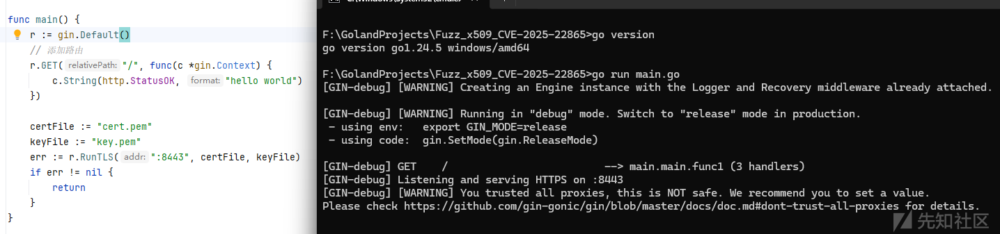

go1.24.5版本，使用key\_noCRT.pem、cert.pem文件，也可正常开启HTTPS网站，相关截图如下：

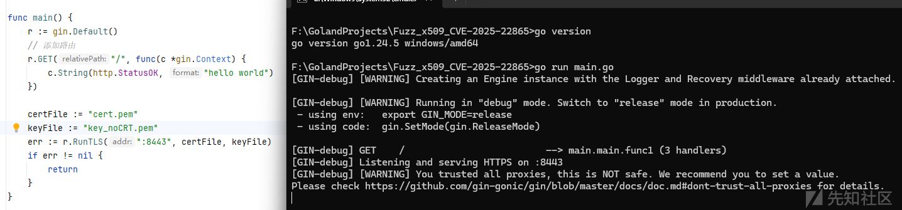

go1.24rc1版本，使用key.pem、cert.pem文件，可正常开启HTTPS网站，相关截图如下：

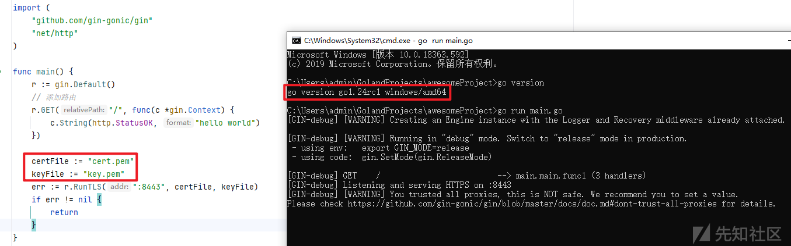

**go1.24rc1版本，使用key\_noCRT.pem、cert.pem文件，程序运行过程中将触发漏洞，并直接奔溃退出**，相关截图如下：

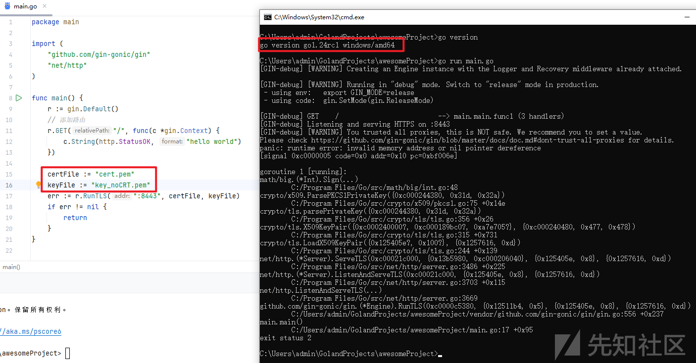

### 使用GO模糊测试挖掘漏洞

接下来，使用相同思路，尝试使用GO模糊测试挖掘漏洞：

* 语料文件：由于笔者未能在网络中找到合适的公开语料库，所以，笔者就直接将上述RSA密钥文件作为语料文件；
* 构建Fuzz代码，直接调用漏洞函数，程序奔溃后，fuzz会自动保存输入数据；
* 执行`go test -fuzz=FuzzParsePKCS1PrivateKey`开启GO模糊测试；

开启GO模糊测试运行一段时间后，程序即会中断并提示：程序奔溃，模糊测试失败输入已写入testdata\fuzz\FuzzParsePKCS1PrivateKey\b7daa7fa4ba519bc文件中。相关截图如下：

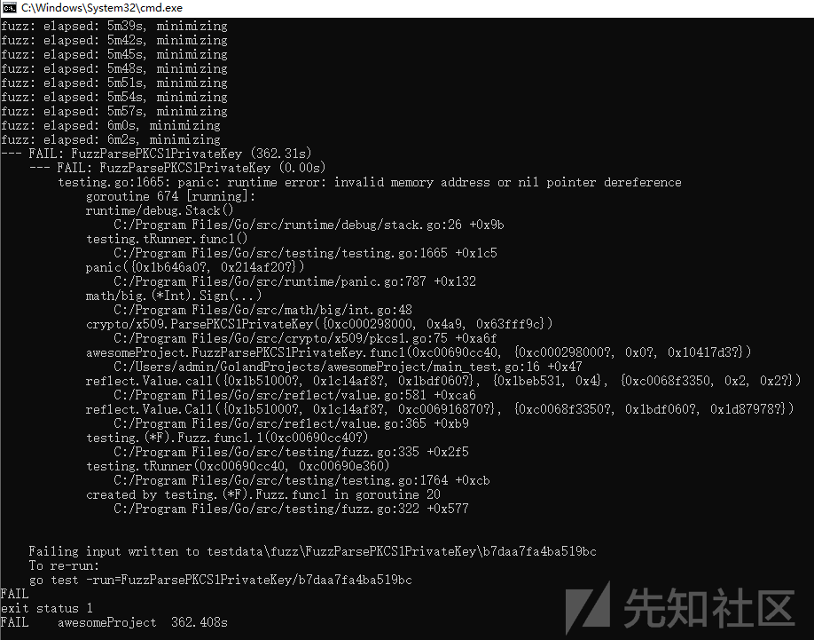

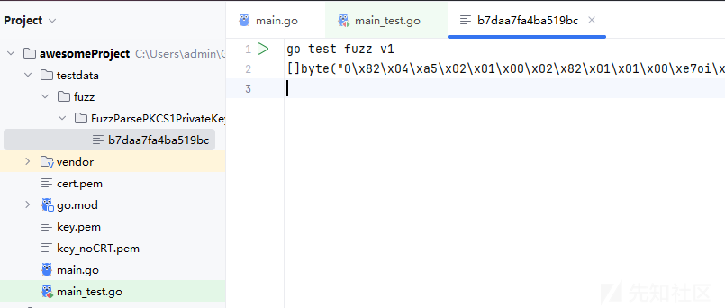

测试文件内容如下：

```
package main

import (
    "crypto/x509"
    "encoding/pem"
    "os"
    "testing"
)

func FuzzParsePKCS1PrivateKey(f *testing.F) {
    pemPrivateKey1, _ := os.ReadFile("key.pem")
    block1, _ := pem.Decode(pemPrivateKey1)
    f.Add(block1.Bytes)

    f.Fuzz(func(t *testing.T, data []byte) {
        _, err := x509.ParsePKCS1PrivateKey(data)
        if err != nil {
            t.Skip()
        }
    })
}
```

尝试通过调试手段对异常输入数据进行剖析，发现此异常RSA密钥文件解析后，RSA密钥中的Qinv值（CRT值包含：Dp、Dq、Qinv）为空，从而触发漏洞，引发程序奔溃。相关截图如下：

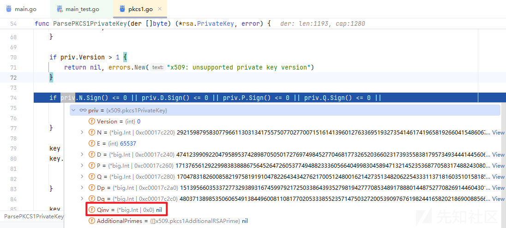

## 疑惑-fuzz如何对语料文件进行突变的？

基于此，我们已经成功基于GO模糊测试技术对CVE-2024-44337、CVE-2025-22865漏洞进行挖掘复现了。

虽然成功漏洞挖掘复现了，但是笔者却比较疑惑：**我输入的语料文件是一个具有特定格式的RSA密钥文件，fuzz到底是怎么对语料文件进行突变，怎么触发漏洞的呢？**

为了解决笔者的疑惑，笔者查阅了大量资料，梳理网络中描述如下：

* Go 语言从1.18版本开始内置了go test -fuzz功能，它是一个独立的、原生Go实现的覆盖率引导式模糊测试引擎，受libFuzzer等工具启发，采用了Go工具链的自定义逻辑，包括输入突变、覆盖率收集和语料管理等核心机制。
* 在输入突变环节中，fuzzer使用libFuzzer风格的mutation operators对种子字节进行随机修改，目标是增加新代码路径覆盖率，**常见突变操作包括：位/字节翻转、字节插入/删除、字节替换、交叉等。**

原理上我们大致理解了，接下来我们基于原理对比一下实际情况：

* 笔者使用二进制对比工具，将突变前数据与突变后数据进行了对比，发现fuzzer在输入突变环节中，对输入数据进行了多个字节的修改；
* 由于笔者的输入数据是一个ASN.1格式的RSA密钥文件，因此，笔者尝试对突变前数据和突变后数据进行了ASN.1格式解析，发现突变后数据刚好破坏了ASN.1格式的Dq和Qinv值，从而导致ASN.1格式解析后，Qinv值为空。

突变前数据与突变后数据二进制对比截图如下：

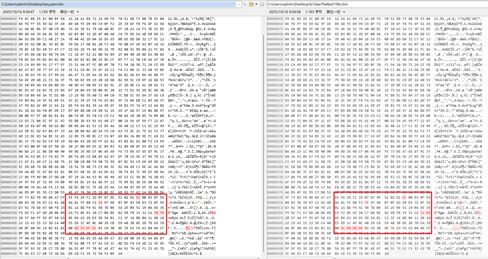

突变前数据格式解析如下：

```
#key.pem
308204a50201000282010100e76f699440f93ed5f88f281096c3aad5b5996a93107ebe72ac141f7451ed86b2957444721c6042fbb7ce3466898d7f4205234094c1109952882ed8f3f96c0525ec00bfe41a24a1b4722a6bfdf05188f3807b93044efdff5559823fa98968fed999c90ff22e396ffbf64f41e8a1440cb65f40cb4d7a26365179a040bcef10a31af33d52b5094da439d64c5e0582030e322d8f00a8c47eb5eaabebd8cc0a92d8d9c2ab271a7b40422d0426e6e50b6eddd832c75c126beed2d08c398e0c59d617ab0120f368fd8067ae63071832390c18036b5747c7cdd21d75869d3a7dd28091890421fc8a2785d8a0829876d4c11d6fe2210b56b92f0440208dea9002f802d495020301000102820100258ecf8ff7215bc0a6a738c5c469b99217f7ef33319497fc8d0f70f154105b7124ceeb02a7b739779723181ee1c8bc33af18c2f4c1061c13a8350e113dd3795c6799d18a4771d56a2eb2d2b6b1a6d1b64e8dff544e2b6b21e3363f75986e9919201b6082995cc9df1660535e58b96de4b4bd93a09da790de15025c2f2d0ec2a12082720c83af16037e25bad71b04e9580b9c202273d15e5d9cd830b5c0b6685a7cd28b13259d7da07104c07cb8ec938a37e6c8e589ba145f9105913c2c342ff8fa6303af7206ddc103ad371ffd02ac091ce622def4e602391aeb6f39b2fe7a672264d6b13d2a9af00fd917b7b988d0cbe05119a51f6d571e0a8d97d00b97ef8b02818100f40c5ef8c9c9c250662830857ab90b12937104ec5f1c4755bb3d63916148270016e6af59f71247501982070e58d20ddbb68481e1ced54a3d4021c7c15c1999a25becd2d7baef33aa20b4baad5af6c8a37e9c217e62f2776d23dc8354be32432289799dbcc7c60769ba3abd9efca9e2011f7542d2c45919ad0a432bedff62424302818100f2c4e937b3008fe0d7503d202f0d89ee2cb9b35186608fe54513a90aba231c06eb4090999d359dcf0645a9fe73b5a765879c37e03a5305e7f4827f09fa89ced88e6297df7bc65e27957dc1c147e169cf2198752cd0c08bf950755907bc93c9a9695d22ece8d8798bbb668819527d4b73c5b63c92d4a9c3dcac66d669a40e7c4702818100d798362e42d5623bf4837c99ee989a1786f9490827ddab87292a4a539c45496ee2cc580c7a2043af97592f329574bb9965dc19818a5f127e99b13deeab96520b047a6aa8fa1366e8dc8bcc7e68e5aaca0487996f35aa4da6b50f9155c3d0534ea77430cd1d0eec6d927f621499d0da3f73b2fb9d86a7cfeef629f11d07879e510281810083bf5509833d34d7c241ab4a81fe88f2169798b70f83ebd3728f5ed79178684760f823011a8df45c5b7d06ea2e0551190a653ef592f1676d200689c6f28e4310c704be82ebfb1531ca30fb2b5744ff550758638eb4a329d35d54b1c23f16bd041148182215a315233dca40e5ed1c4e0c4029cbe9ab3b8e2d7dea39460f60451502818100b632afacb2cb308e7663f6630446cf0fb43055b2ab5e6b8c04fb7045612b7559727564944168a67f40a55b8b0e3bf21e5eba65e5a885a783608b399154b6b7b9d44419decc0b3a7b62b0735742c81c8dd2f4c4ad123e955f5f933e1bc7788056910fff7b9cae674a917462f133427d7c9ae3c76b7238dad5c8f2357254f20524

#key.pem格式解析
308204a50201000282010100
#N
e76f699440f93ed5f88f281096c3aad5b5996a93107ebe72ac141f7451ed86b2957444721c6042fbb7ce3466898d7f4205234094c1109952882ed8f3f96c0525ec00bfe41a24a1b4722a6bfdf05188f3807b93044efdff5559823fa98968fed999c90ff22e396ffbf64f41e8a1440cb65f40cb4d7a26365179a040bcef10a31af33d52b5094da439d64c5e0582030e322d8f00a8c47eb5eaabebd8cc0a92d8d9c2ab271a7b40422d0426e6e50b6eddd832c75c126beed2d08c398e0c59d617ab0120f368fd8067ae63071832390c18036b5747c7cdd21d75869d3a7dd28091890421fc8a2785d8a0829876d4c11d6fe2210b56b92f0440208dea9002f802d495
0203
#E
010001
02820100
#D
258ecf8ff7215bc0a6a738c5c469b99217f7ef33319497fc8d0f70f154105b7124ceeb02a7b739779723181ee1c8bc33af18c2f4c1061c13a8350e113dd3795c6799d18a4771d56a2eb2d2b6b1a6d1b64e8dff544e2b6b21e3363f75986e9919201b6082995cc9df1660535e58b96de4b4bd93a09da790de15025c2f2d0ec2a12082720c83af16037e25bad71b04e9580b9c202273d15e5d9cd830b5c0b6685a7cd28b13259d7da07104c07cb8ec938a37e6c8e589ba145f9105913c2c342ff8fa6303af7206ddc103ad371ffd02ac091ce622def4e602391aeb6f39b2fe7a672264d6b13d2a9af00fd917b7b988d0cbe05119a51f6d571e0a8d97d00b97ef8b
02818100
#P
f40c5ef8c9c9c250662830857ab90b12937104ec5f1c4755bb3d63916148270016e6af59f71247501982070e58d20ddbb68481e1ced54a3d4021c7c15c1999a25becd2d7baef33aa20b4baad5af6c8a37e9c217e62f2776d23dc8354be32432289799dbcc7c60769ba3abd9efca9e2011f7542d2c45919ad0a432bedff624243
02818100
#Q
f2c4e937b3008fe0d7503d202f0d89ee2cb9b35186608fe54513a90aba231c06eb4090999d359dcf0645a9fe73b5a765879c37e03a5305e7f4827f09fa89ced88e6297df7bc65e27957dc1c147e169cf2198752cd0c08bf950755907bc93c9a9695d22ece8d8798bbb668819527d4b73c5b63c92d4a9c3dcac66d669a40e7c47
02818100
#Dp
d798362e42d5623bf4837c99ee989a1786f9490827ddab87292a4a539c45496ee2cc580c7a2043af97592f329574bb9965dc19818a5f127e99b13deeab96520b047a6aa8fa1366e8dc8bcc7e68e5aaca0487996f35aa4da6b50f9155c3d0534ea77430cd1d0eec6d927f621499d0da3f73b2fb9d86a7cfeef629f11d07879e51
02818100
#Dq
83bf5509833d34d7c241ab4a81fe88f2169798b70f83ebd3728f5ed79178684760f823011a8df45c5b7d06ea2e0551190a653ef592f1676d200689c6f28e4310c704be82ebfb1531ca30fb2b5744ff550758638eb4a329d35d54b1c23f16bd041148182215a315233dca40e5ed1c4e0c4029cbe9ab3b8e2d7dea39460f604515
02818100
#Qinv
b632afacb2cb308e7663f6630446cf0fb43055b2ab5e6b8c04fb7045612b7559727564944168a67f40a55b8b0e3bf21e5eba65e5a885a783608b399154b6b7b9d44419decc0b3a7b62b0735742c81c8dd2f4c4ad123e955f5f933e1bc7788056910fff7b9cae674a917462f133427d7c9ae3c76b7238dad5c8f2357254f20524
```

突变后数据格式解析如下：

```
#b7daa7fa4ba519bc
308204a50201000282010100e76f699440f93ed5f88f281096c3aad5b5996a93107ebe72ac141f7451ed86b2957444721c6042fbb7ce3466898d7f4205234094c1109952882ed8f3f96c0525ec00bfe41a24a1b4722a6bfdf05188f3807b93044efdff5559823fa98968fed999c90ff22e396ffbf64f41e8a1440cb65f40cb4d7a26365179a040bcef10a31af33d52b5094da439d64c5e0582030e322d8f00a8c47eb5eaabebd8cc0a92d8d9c2ab271a7b40422d0426e6e50b6eddd832c75c126beed2d08c398e0c59d617ab0120f368fd8067ae63071832390c18036b5747c7cdd21d75869d3a7dd28091890421fc8a2785d8a0829876d4c11d6fe2210b56b92f0440208dea9002f802d495020301000102820100258ecf8ff7215bc0a6a738c5c469b99217f7ef33319497fc8d0f70f154105b7124ceeb02a7b739779723181ee1c8bc33af18c2f4c1061c13a8350e113dd3795c6799d18a4771d56a2eb2d2b6b1a6d1b64e8dff544e2b6b21e3363f75986e9919201b6082995cc9df1660535e58b96de4b4bd93a09da790de15025c2f2d0ec2a12082720c83af16037e25bad71b04e9580b9c202273d15e5d9cd830b5c0b6685a7cd28b13259d7da07104c07cb8ec938a37e6c8e589ba145f9105913c2c342ff8fa6303af7206ddc103ad371ffd02ac091ce622def4e602391aeb6f39b2fe7a672264d6b13d2a9af00fd917b7b988d0cbe05119a51f6d571e0a8d97d00b97ef8b02818100f40c5ef8c9c9c250662830857ab90b12937104ec5f1c4755bb3d63916148270016e6af59f71247501982070e58d20ddbb68481e1ced54a3d4021c7c15c1999a25becd2d7baef33aa20b4baad5af6c8a37e9c217e62f2776d23dc8354be32432289799dbcc7c60769ba3abd9efca9e2011f7542d2c45919ad0a432bedff62424302818100f2c4e937b3008fe0d7503d202f0d89ee2cb9b35186608fe54513a90aba231c06eb4090999d359dcf0645a9fe73b5a765879c37e03a5305e7f4827f09fa89ced88e6297df7bc65e27957dc1c147e169cf2198752cd0c08bf950755907bc93c9a9695d22ece8d8798bbb668819527d4b73c5b63c92d4a9c3dcac66d669a40e7c4702818100d798362e42d5623bf4837c99ee989a1786f9490827ddab87292a4a539c45496ee2cc580c7a2043af97592f329574bb9965dc19818a5f127e99b13deeab96520b047a6aa8fa1366e8dc8bcc7e68e5aaca0487996f35aa4da6b50f9155c3d0534ea77430cd1d0eec6d927f621499d0da3f73b2fb9d86a7cfeef629f11d07879e5102818f0083bf5509833d34d7c241ab4a81fe88f2fe9798b70f83ebd3728f5ed79178684760f823011a8df45c5b7d06ea2e0551190a653ef592f1676d200689c6f28e4310c704be82ebfb1531ca31082b5744ff550758638eb4a329d35d54b1c23f16bd041148182215a315233dca40e5ed1c4e0c4029cbe9ab3b8e2d7dea39460f6045150281810001000000b2cb308e7663f6630446cf0fb43055b2ab5e6b8c04fb7045612b7559727564944168a67f40a55b8b0e3bf21e5eba65e5a885a783608b399154b6b7b9d44419decc0b3a7b62b0735742c81c8dd2f4c4ad123e955f5f933e1bc7788056910fff7b9cae674a917462f133427d7c9ae3c76b7238dad5c8f2357254f20524

#b7daa7fa4ba519bc格式解析
308204a50201000282010100
#N
e76f699440f93ed5f88f281096c3aad5b5996a93107ebe72ac141f7451ed86b2957444721c6042fbb7ce3466898d7f4205234094c1109952882ed8f3f96c0525ec00bfe41a24a1b4722a6bfdf05188f3807b93044efdff5559823fa98968fed999c90ff22e396ffbf64f41e8a1440cb65f40cb4d7a26365179a040bcef10a31af33d52b5094da439d64c5e0582030e322d8f00a8c47eb5eaabebd8cc0a92d8d9c2ab271a7b40422d0426e6e50b6eddd832c75c126beed2d08c398e0c59d617ab0120f368fd8067ae63071832390c18036b5747c7cdd21d75869d3a7dd28091890421fc8a2785d8a0829876d4c11d6fe2210b56b92f0440208dea9002f802d495
0203
#E
010001
02820100
#D
258ecf8ff7215bc0a6a738c5c469b99217f7ef33319497fc8d0f70f154105b7124ceeb02a7b739779723181ee1c8bc33af18c2f4c1061c13a8350e113dd3795c6799d18a4771d56a2eb2d2b6b1a6d1b64e8dff544e2b6b21e3363f75986e9919201b6082995cc9df1660535e58b96de4b4bd93a09da790de15025c2f2d0ec2a12082720c83af16037e25bad71b04e9580b9c202273d15e5d9cd830b5c0b6685a7cd28b13259d7da07104c07cb8ec938a37e6c8e589ba145f9105913c2c342ff8fa6303af7206ddc103ad371ffd02ac091ce622def4e602391aeb6f39b2fe7a672264d6b13d2a9af00fd917b7b988d0cbe05119a51f6d571e0a8d97d00b97ef8b
02818100
#P
f40c5ef8c9c9c250662830857ab90b12937104ec5f1c4755bb3d63916148270016e6af59f71247501982070e58d20ddbb68481e1ced54a3d4021c7c15c1999a25becd2d7baef33aa20b4baad5af6c8a37e9c217e62f2776d23dc8354be32432289799dbcc7c60769ba3abd9efca9e2011f7542d2c45919ad0a432bedff624243
02818100
#Q
f2c4e937b3008fe0d7503d202f0d89ee2cb9b35186608fe54513a90aba231c06eb4090999d359dcf0645a9fe73b5a765879c37e03a5305e7f4827f09fa89ced88e6297df7bc65e27957dc1c147e169cf2198752cd0c08bf950755907bc93c9a9695d22ece8d8798bbb668819527d4b73c5b63c92d4a9c3dcac66d669a40e7c47
02818100
#Dp
d798362e42d5623bf4837c99ee989a1786f9490827ddab87292a4a539c45496ee2cc580c7a2043af97592f329574bb9965dc19818a5f127e99b13deeab96520b047a6aa8fa1366e8dc8bcc7e68e5aaca0487996f35aa4da6b50f9155c3d0534ea77430cd1d0eec6d927f621499d0da3f73b2fb9d86a7cfeef629f11d07879e51

#Dq长度=0x8f
02818f00
#Dq
83bf5509833d34d7c241ab4a81fe88f2fe9798b70f83ebd3728f5ed79178684760f823011a8df45c5b7d06ea2e0551190a653ef592f1676d200689c6f28e4310c704be82ebfb1531ca31082b5744ff550758638eb4a329d35d54b1c23f16bd041148182215a315233dca40e5ed1c4e0c4029cbe9ab3b8e2d7dea39460f6045150281810001000000b2cb308e7663

f6630446cf0fb43055b2ab5e6b8c04fb7045612b7559727564944168a67f40a55b8b0e3bf21e5eba65e5a885a783608b399154b6b7b9d44419decc0b3a7b62b0735742c81c8dd2f4c4ad123e955f5f933e1bc7788056910fff7b9cae674a917462f133427d7c9ae3c76b7238dad5c8f2357254f20524
```

## go模糊测试原理剖析

到这里，其实我们已经对整个GO模糊测试有了一个很直观的认识，实操对比了GO模糊测试的漏洞挖掘过程和漏洞挖掘原理。

于是，笔者就尝试查看了一下GO语言标准库中的测试文件，查看后发现：

* 测试文件中的函数名除了以Fuzz开头，还存在以Test、Benchmark、Example开头的测试函数；

为了能够更全面的掌握并理解GO模糊测试的功能及区别，笔者尝试构建了不同的测试函数，并从代码层面对其进行了剖析。

相关截图如下：

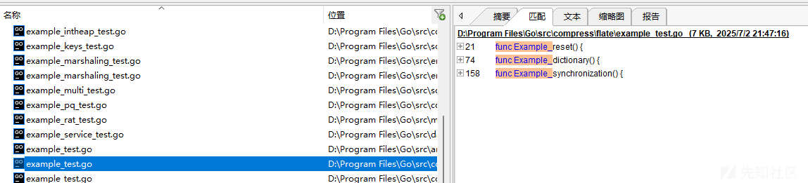

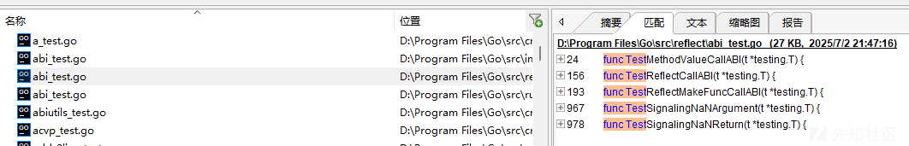

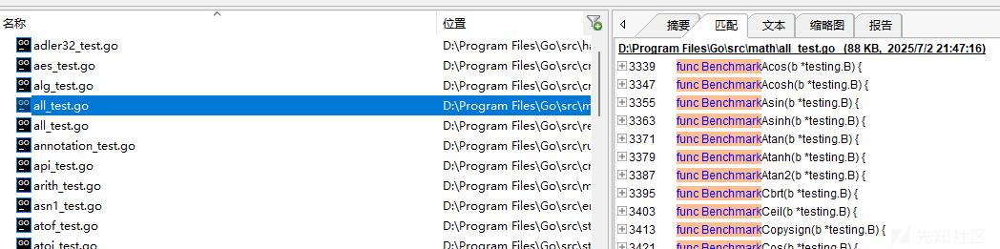

### GO测试函数约定

基于GO语言标准库中的测试文件中的测试函数名，笔者查阅了GO官方文档介绍（`https://pkg.go.dev/testing`），梳理了GO测试函数约定如下：

|  |  |  |  |
| --- | --- | --- | --- |
| 函数前缀 | 函数示例 | 功能 | 执行方式 |
| **Test** | `func TestXxx(*testing.T)` | 标准单元测试，用于验证包行为。 | `go test -run` |
| **Benchmark** 或 **Bench** | `func BenchmarkXxx(*testing.B)` | 性能基准测试，测量执行时间和内存分配 | `go test -bench` |
| **Example** | `func ExampleXxx()` | 可执行示例，输出与注释中的 "Output:" 比较 | `go test -run=Example` |
| **Fuzz** | `func FuzzXxx(*testing.F)` | 模糊测试，基于种子语料生成变异 | `go test -fuzz` |
| **TestMain** | `func TestMain(m *testing.M)` | 特殊函数，用于测试套件的整体设置/清理 | 自动调用（如果存在） |

### 运行原理剖析

为了详细对比并剖析不同测试函数的实现原理，笔者尝试构建了不同的测试函数，并对其进行调试对比，梳理其实现原理如下：

* TestMain函数包含了测试运行的控制逻辑，默认情况下，代码中将调用m.Run()函数，则go test运行逻辑如下：

* Run()函数中将调用runTests、runFuzzTests、runExamples、runBenchmarks、runFuzzing函数，用于执行所有匹配的TestXxx、BenchmarkXxx、ExampleXxx和FuzzXxx函数；

* 若测试文件中不存在TestMain函数，则go test运行逻辑如下：

* 调用Go\src esting esting.go文件中的Main函数；
* Main函数中将调用MainStart、Run()函数；
* Run()函数中将调用runTests、runFuzzTests、runExamples、runBenchmarks、runFuzzing函数，用于执行所有匹配的TestXxx、BenchmarkXxx、ExampleXxx和FuzzXxx函数；

* Run()函数是M结构体的内部函数

* M结构体中的`tests []InternalTest、benchmarks []InternalBenchmark、fuzzTargets []InternalFuzzTarget、examples []InternalExample`字段中分别存放了对应匹配的测试函数名；
* 若`tests []InternalTest、benchmarks []InternalBenchmark、fuzzTargets []InternalFuzzTarget、examples []InternalExample`字段中存在匹配的测试函数名，则Run()函数将按顺序调用runTests、runFuzzTests、runExamples、runBenchmarks、runFuzzing函数；
* runTests函数：执行TestXxx函数；
* runFuzzTests函数：基于种子语料库执行FuzzXxx函数；
* runExamples函数：执行ExampleXxx函数；
* runBenchmarks函数：执行BenchmarkXxx函数；
* runFuzzing函数：基于种子语料库生成突变数据执行FuzzXxx函数；

M结构体代码（Go\src esting esting.go文件）截图如下：

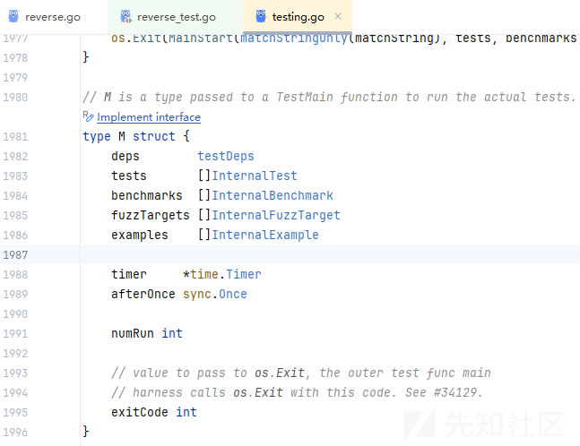

调试过程中M结构体截图如下：

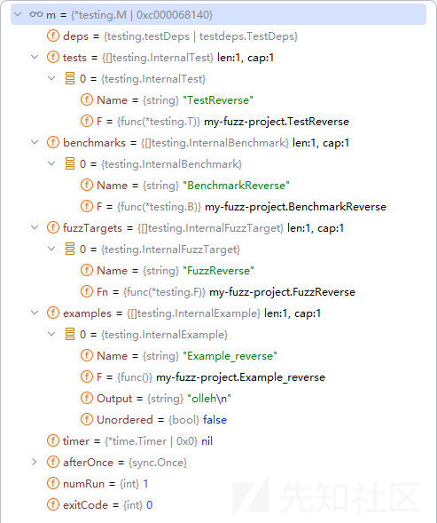

Main函数（Go\src esting esting.go文件）代码截图如下：

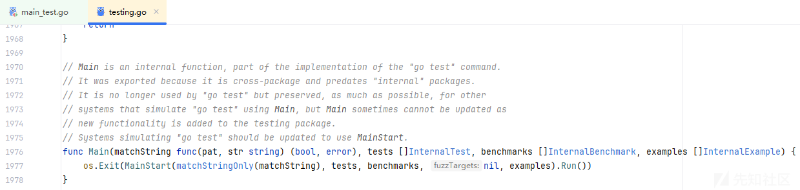

MainStart函数（Go\src esting esting.go文件）代码截图如下：

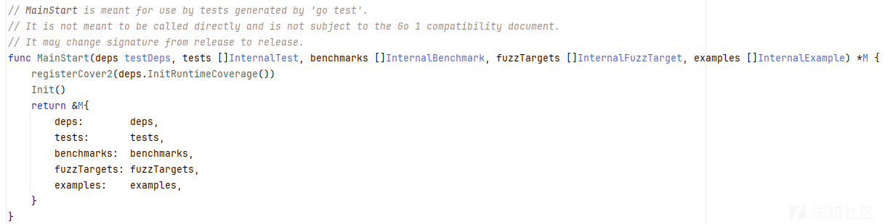

Run函数（Go\src esting esting.go文件）代码截图如下：

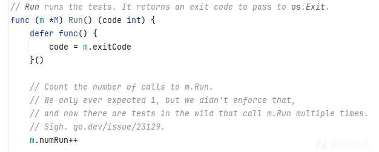

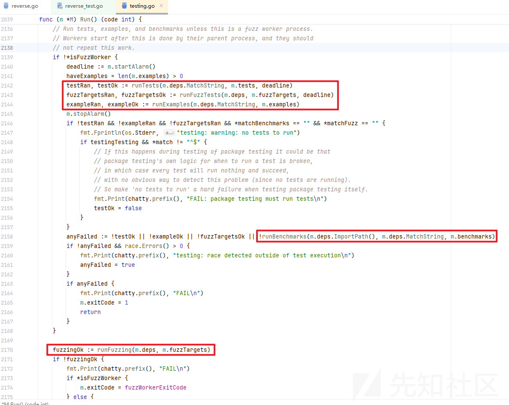

Demo代码运行效果如下：

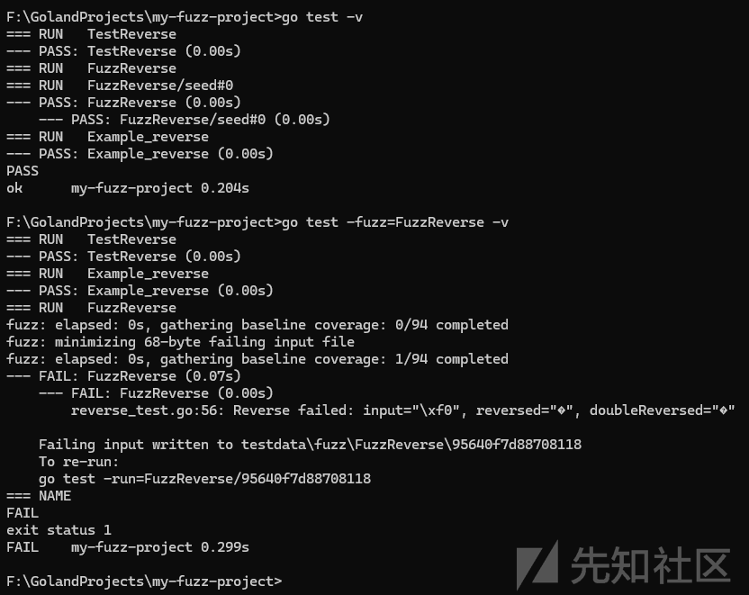

Demo代码如下：

* main.go

```
package main

import "fmt"

// reverse 返回字符串的反转版本。
func reverse(s string) string {
    runes := []rune(s)
    for i, j := 0, len(runes)-1; i < j; i, j = i+1, j-1 {
        runes[i], runes[j] = runes[j], runes[i]
    }
    return string(runes)
}

func main() {
    fmt.Println(reverse("你好"))
}
```

* main\_test.go

```
package main

import (
    "fmt"
    "testing"
)

// TestMain 函数
//func TestMain(m *testing.M) {
//	// 初始化：测试开始前执行的代码，例如设置日志或环境
//	println("开始运行 reverse 函数的测试套件...")
//
//	// 运行所有测试（包括 Test、Benchmark 等）
//	code := m.Run()
//
//	// 清理：测试结束后执行的代码，例如关闭文件或报告总结
//	println("测试套件结束，退出码：", code)
//
//	// 必须使用 os.Exit 返回退出码
//	os.Exit(code)
//}

func Example_reverse() {
    fmt.Println(reverse("hello"))
    // Output: olleh
}

func TestReverse(t *testing.T) {
    result := reverse("abc")
    if result != "cba" {
        t.Errorf("result should be nihao but is %s", result)
    }
}

func BenchmarkReverse(b *testing.B) {
    inputs := []string{"a", "hello", "a very long string with unicode 你好世界 repeated many times..."}
    for _, input := range inputs {
        b.Run(fmt.Sprintf("len=%d", len(input)), func(b *testing.B) {
            b.ResetTimer()
            for i := 0; i < b.N; i++ {
                _ = reverse(input)
            }
        })
    }
}

func FuzzReverse(f *testing.F) {
    f.Add([]byte("abc123!@#")) // 特殊字符

    f.Fuzz(func(t *testing.T, data []byte) {
        s := string(data)
        // 测试逻辑：双重反转应恢复原字符串
        reversed := reverse(s)
        doubleReversed := reverse(reversed)
        if s != doubleReversed {
            t.Errorf("Reverse failed: input=%q, reversed=%q, doubleReversed=%q", s, reversed, doubleReversed)
        }
    })
}
```
