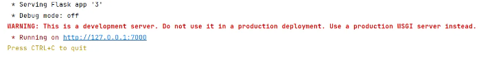
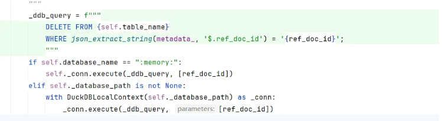
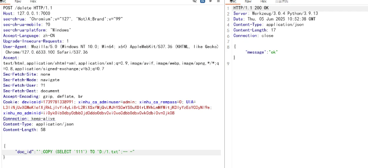
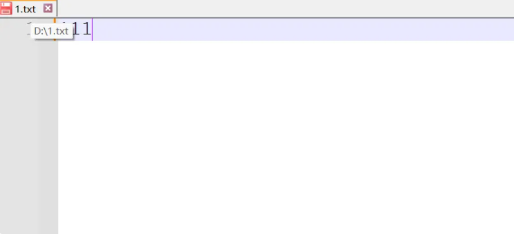
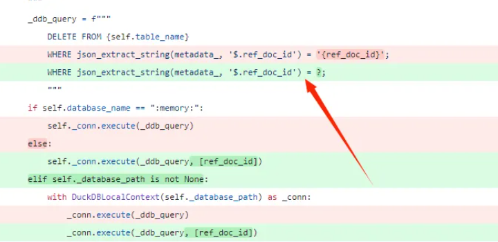

# llama_index DuckDBVectorStore SQL注入（CVE-2025-1750）-先知社区

> **来源**: https://xz.aliyun.com/news/19188  
> **文章ID**: 19188

---

# 漏洞描述

该漏洞是 **LlamaIndex** `DuckDBVectorStore` **组件中的一个 SQL 注入漏洞**。它存在于该组件的 `delete` 函数中。攻击者可以通过精心构造并传递恶意的 `ref_doc_id` 参数来利用此漏洞。可以利用此漏洞将允许攻击者在运行 LlamaIndex 应用的服务器上执行恶意的 SQL 命令。包括**读取服务器上的任意文件、写入任意文件，甚至可以升级至远程代码执行 (RCE)**。该漏洞的严重性被评为Critical，CVSS 评分为 9.8

# 影响版本

**LlamaIndex 版本** `v0.12.19` **以及在此之前的一系列版本**均受到此漏洞的影响

# 环境搭建

装几个库就行了

```
pip install llama-index-vector-stores-duckdb
pip install llama-index-core
pip install llama-index-llms-openai
pip install llama-index-llms-replicate
pip install llama-index-embeddings-huggingface
```

```
from flask import Flask, request, jsonify, render_template
import os
import numpy as np
from llama_index.vector_stores.duckdb import DuckDBVectorStore
from llama_index.core.schema import TextNode

app = Flask(__name__)
persist_dir = "./persist"
os.makedirs(persist_dir, exist_ok=True)

vector_store = DuckDBVectorStore("chatbot.duckdb", persist_dir=persist_dir, recreate_table=True)


def add_document(doc_id, text, category):
    embedding = np.random.rand(1536).tolist()
    text_node = TextNode(id_=doc_id, text=text, embedding=embedding, metadata={"category": category})
    vector_store.add([text_node])


add_document("doc_1", "Machine learning is amazing!", "AI")
add_document("doc_2", "Deep learning improves natural language processing.", "NLP")
add_document("doc_3", "DuckDB is great for handling large datasets.", "Database")


@app.route('/delete', methods=['POST'])
def ask():
    data = request.get_json()
    doc_id = data.get('doc_id')

    vector_store.delete(ref_doc_id=doc_id)

    return jsonify({'message': "ok"})


if __name__ == '__main__':
    app.run(port=7000)
```

`vector_store.delete(ref_doc_id=doc_id)`: **这是漏洞触发点，**它调用 `DuckDBVectorStore` 的 `delete` 方法，并传入从用户请求中获取的 `doc_id` 作为 `ref_doc_id` 参数。



# 漏洞分析



* `_ddb_query = f"""..."""`:这是一个 Python f-string (格式化字符串字面量)。f-string 允许通过在字符串中嵌入用花括号 `{}` 包围的表达式来创建字符串。这些表达式在运行时会被它们的值替换。所以传入参数使用的是json格式
* `json_extract_string(metadata_, '$.ref_doc_id') = '{ref_doc_id}'`: **这是漏洞的关键，**它将前面提取的 `ref_doc_id` 值与 `'{ref_doc_id}'` 进行比较。`{ref_doc_id}` 是 f-string 中的另一个占位符。它会被 `delete` 方法接收到的 `ref_doc_id` 参数的实际值**直接替换**到 SQL 查询字符串中。**由于它是直接拼接的，攻击者可以闭合这个单引号并注入额外的 SQL 命令。**

# 漏洞复现



这里以写入文件内容为例，我向D盘1.txt文件写入111字符串



# 漏洞修复

修复代码：

**查询字符串中的占位符** `?`:在 SQL 查询语句中，原来直接插入 `ref_doc_id` 变量的位置被替换成了一个占位符，**将用户输入作为独立参数传递**:`ref_doc_id` 的值不再直接嵌入到 SQL 查询字符串本身。

**为什么这种方式能修复漏洞：**

* **自动处理特殊字符**: 当 `ref_doc_id` 作为参数传递时，数据库驱动程序会负责对其进行适当的处理（例如，转义特殊字符，如单引号 `'`、分号 `;` 等，或者根据其预期类型进行检查）。这意味着即使用户输入包含 SQL 特殊字符，这些字符也会被当作普通数据处理，而不会被解释为 SQL 命令的一部分。
* **预编译**: 很多数据库系统会对参数化查询的 SQL 命令结构部分进行预编译。之后，每次执行时只是替换占位符的值。这不仅提高了效率，也从根本上防止了注入，因为SQL的结构已经固定，用户输入只能填充指定的数据槽位。
