# jdk17-springboot原生链分析-先知社区

> **来源**: https://xz.aliyun.com/news/19198  
> **文章ID**: 19198

---

# jdk17-springboot原生链分析

## 1. JPMS是什么

* JPMS（又称 Jigsaw）是 Java 9 引入的模块系统，目标是给 Java 平台**真正的运行时模块化**：把 JDK 和应用按模块（module）划分，明确依赖与可见性，减少类冲突、提升封装、支持小镜像打包（jlink）。这在 JEP 261 中有总览和设计目标说明。
* 一个模块由 `module-info.java` 声明，例如：Jdk17 import com.sun.org.apache.xalan.internal.xsltc.trax.TemplatesImpl; 会报错就是这个原因。没有在java.xml导出。

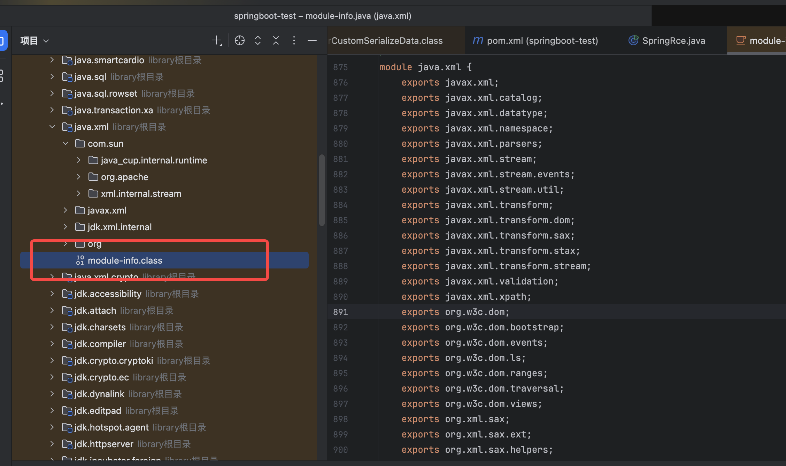

* 这样设定可以访问。jdk17 setAccessible也是会报错。需要--add-opens

```
--add-opens=java.base/sun.nio.ch=ALL-UNNAMED
--add-opens=java.base/java.lang=ALL-UNNAMED
--add-opens=java.base/java.io=ALL-UNNAMED
--add-opens=jdk.unsupported/sun.misc=ALL-UNNAMED
--add-opens
java.xml/com.sun.org.apache.xalan.internal.xsltc.trax=ALL-UNNAMED
--add-opens=java.base/java.lang.reflect=ALL-UNNAMED
```

下面这段代码通过反射拿到 `sun.misc.Unsafe`，再利用 `Unsafe` 直接写入 `java.lang.Class` 的私有 `module` 字段，把当前类所属的 `Module` 替换为别的类的 `Module`，从而试图绕过 Java 9+ 的模块边界检查（例如访问被封装的内部包）。

```
    private static Method getMethod(Class clazz, String methodName, Class[]
            params) {
        Method method = null;
        while (clazz!=null){
            try {
                method = clazz.getDeclaredMethod(methodName,params);
                break;
            }catch (NoSuchMethodException e){
                clazz = clazz.getSuperclass();
            }
        }
        return method;
    }
    private static Unsafe getUnsafe() {
        Unsafe unsafe = null;
        try {
            Field field = Unsafe.class.getDeclaredField("theUnsafe");
            field.setAccessible(true);
            unsafe = (Unsafe) field.get(null);
        } catch (Exception e) {
            throw new AssertionError(e);
        }
        return unsafe;
    }
    public void bypassModule(ArrayList<Class> classes){
        try {
            Unsafe unsafe = getUnsafe();
            Class currentClass = this.getClass();
            try {
                Method getModuleMethod = getMethod(Class.class, "getModule", new
                        Class[0]);
                if (getModuleMethod != null) {
                    for (Class aClass : classes) {
                        Object targetModule = getModuleMethod.invoke(aClass, new Object[]{});
                        unsafe.getAndSetObject(currentClass,
                                unsafe.objectFieldOffset(Class.class.getDeclaredField("module")), targetModule);
                    }
                }
            }catch (Exception e) {
            }
        }catch (Exception e){
            e.printStackTrace();
        }
    }
```

## 利用链分析

Jdk17的BadAttributeValueExpException不能调用任意类的tostring方法。

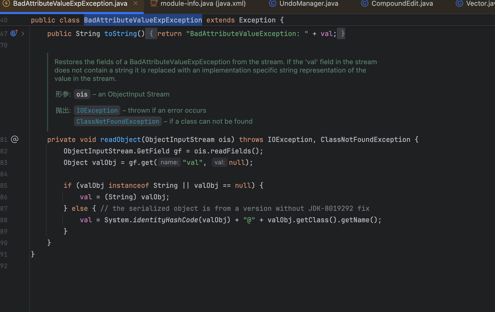

所以使用EventListenerList调用任意类的tostring方法。

EventListenerList#readobject ----> add方法(类做了拼接) ----> UndoManager的父类CompoundEdit 的tostring方法 ---->  Vector的tostring方法 ---->  append方法 ----> valueOf方法调用任意类的tostring方法

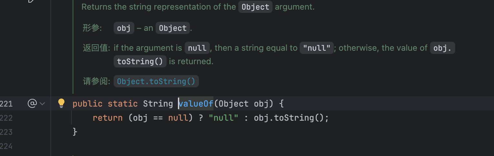

后面就是jackson原生反序列化的利用

new POJONode(恶意类)，更改this.\_value为恶意类

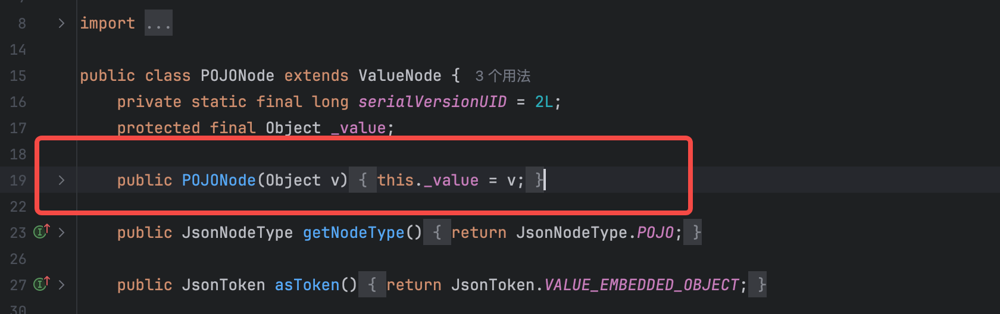

EventListenerList调用POJONode的tostring方法。(超类BaseJsonNode的tostring)

InternalNodeMapper#nodeToString ----> ObjectWriter#writeValueAsString ----> ObjectWriter#\_writeValueAndClose ----> ObjectWriter#\_serialize ----> DefaultSerializerProvider#serializeValue ----> DefaultSerializerProvider#\_serialize ----> SerializableSerializer#serialize ----> InternalNodeMapper#serialize ----> InternalNodeMapper#serializeNonRecursive ----> POJONode#serialize ----> SerializerProvider#defaultSerializeValue ----> BeanSerializer#serialize ----> BeanSerializerBase#serializeFields

此处就是最初版本的jackson链不稳定的原因。在Jackson依次触发getter时,其获取所有getter的顺序是使用java的getDeclaredMethods方法,而根据Java官方文档,这个方法获取的的顺序是不确定的,如果获取到非预期的getter就会直接报错退出了。

所以使用JdkDynamicAopProxy做代理类。保证获取的getter只有TemplatesImpl的getOutputProperties方法。

***JdkDynamicAopProxy还有一个更加重要的作用，如果没有aop的话，jackson没法为TemplatesImpl创建一个新的类。直接传入 TemplatesImpl 对象的话，com.sun.org.apache.xalan.internal.xsltc.trax 没有 export 给外部，所以会出现报错。但是经过 AOP 代理之后，对外暴露的接口是 javax.xml.transform.Templates，在 java.xml 模块中是公开 exports 的，所以能正常反序列化。***

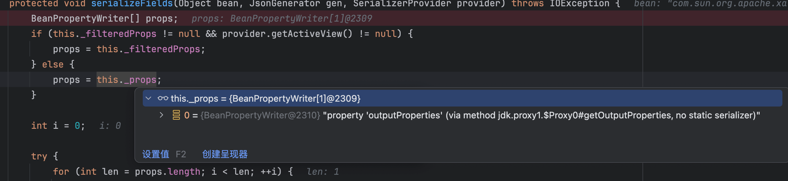

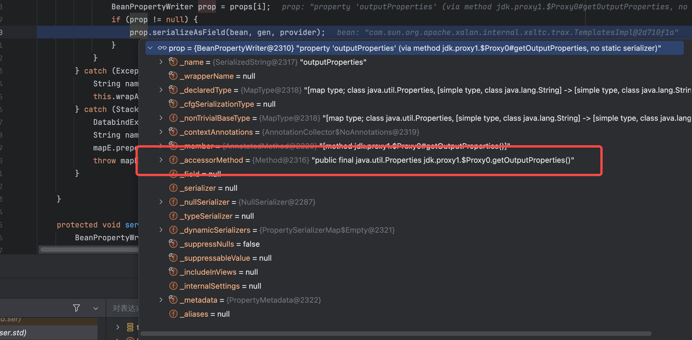

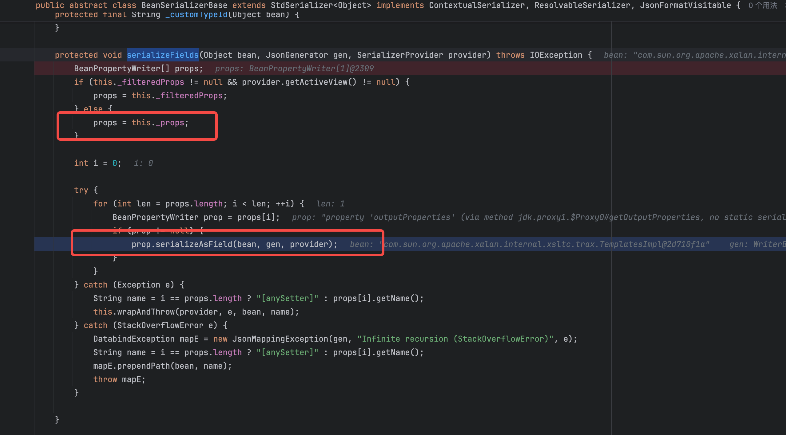

最后是BeanPropertyWriter#serializeAsField方法

\_accessorMethod是prop里的getOutputProperties。bean是POJONode的\_\_value属性，即通过反射修改的恶意类。最后就进入了TemplatesImpl的getOutputProperties方法。

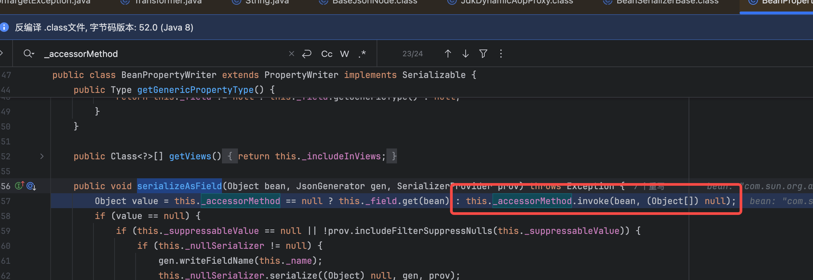

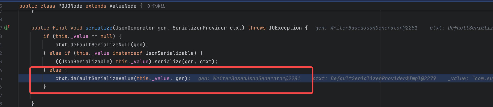

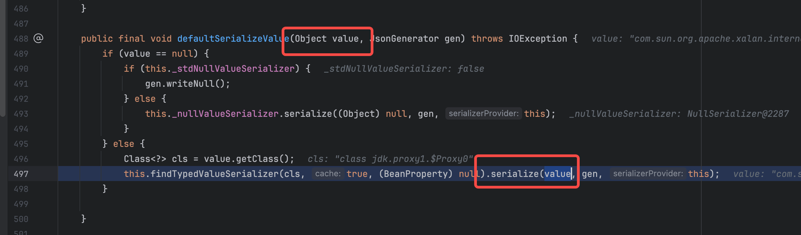

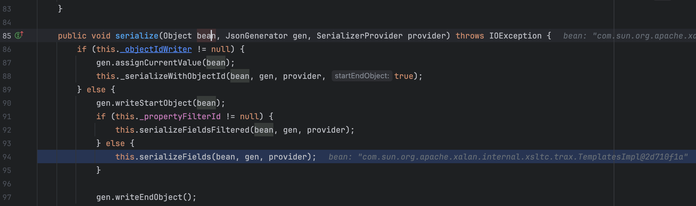

## 序列化报错，需要删除writereplace方法

writeobject0序列化过程中会检查writereplace方法。所以需要删除它。

```
try {
            ClassPool pool = ClassPool.getDefault();
            CtClass jsonNode = pool.get("com.fasterxml.jackson.databind.node.BaseJsonNode");
            CtMethod writeReplace = jsonNode.getDeclaredMethod("writeReplace");
            jsonNode.removeMethod(writeReplace);
            ClassLoader classLoader = Thread.currentThread().getContextClassLoader();
            jsonNode.toClass(classLoader, null);
       } catch (Exception e) {
        }
```

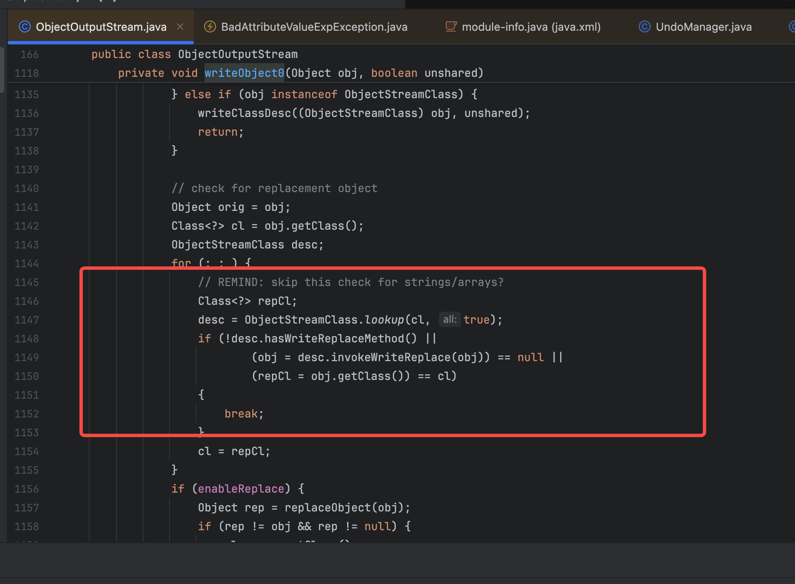

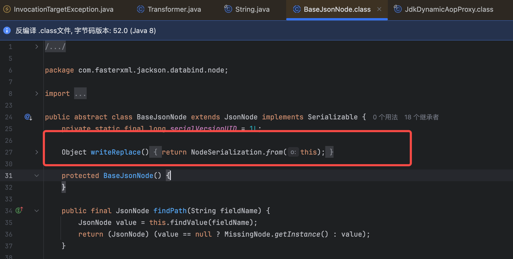
