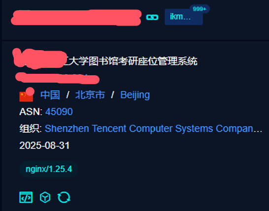
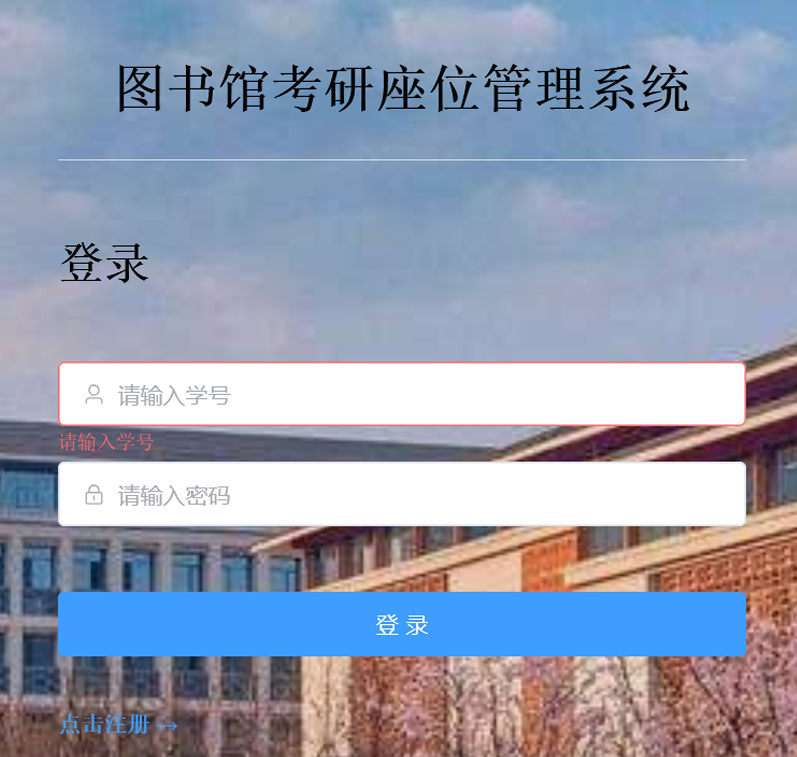
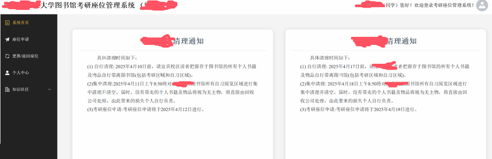
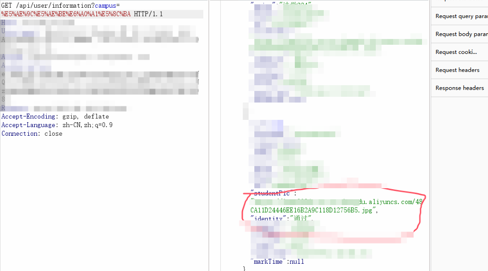
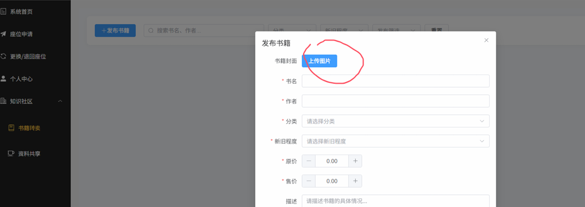
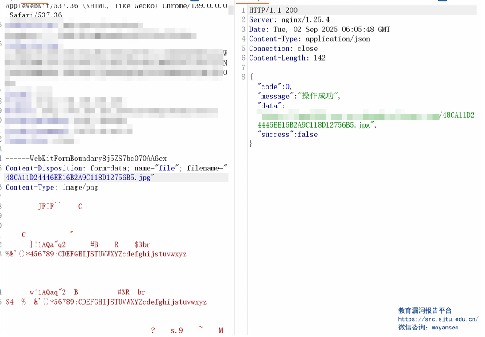
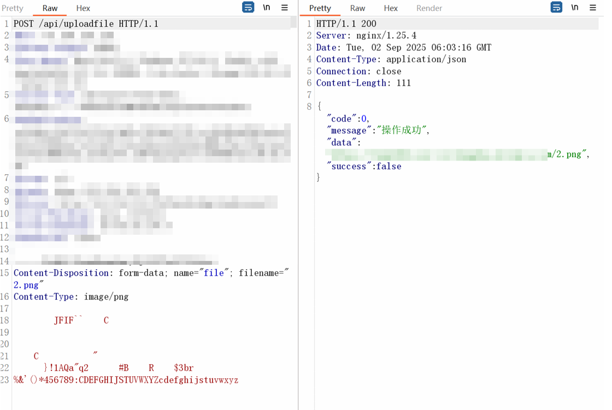
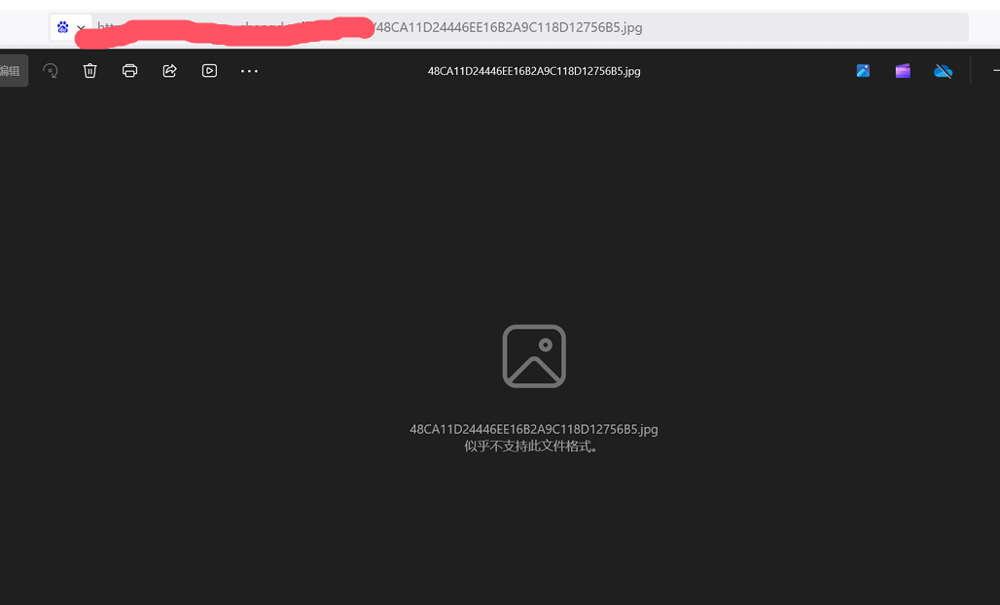

# 记一次别样的文件上传-先知社区

> **来源**: https://xz.aliyun.com/news/19205  
> **文章ID**: 19205

---

## 文件上传

对于经常挖洞的师傅们 文件上传肯定是必测的点​

但是大多数情况下 文件上传对于后缀名 内容 等等都有做限制

本人遇到没法直接上传的话 只会试一些简单的绕过手法

当然大部分也都是没啥用的 这个时候就直接下一个了

但是受存储桶覆盖的启发 便有了本文的别样的文件上传

## 资产收集

首先通过fofa找到了某大学的考研座位管理系统

点进去是一个登录框

通过网络搜索找到学校学生的信息

然后注册一个账号

## 测试功能点

这个站点其实有挺多洞

但是绝大部分都已经被找到了

也是喜提3个重复

**(本文的重点不在于接口的搜集 在于下面的文件上传)**

但是其中的一个接口泄露了用户的个人信息

这个接口泄露的用户的姓名 学号 手机号 还有上传的图片地址

地址是一个存储桶

## 文件上传

回到首页

点击书籍转卖

有个上传点

我们随便上传一个图片

成功上传了

这里记得我测过xss

貌似是不行的(有点忘记了)

但是请注意这个时候上传的图片的名字

**传到存储桶的图片名字居然和我本地图片的名字是相同的**

按理来说 上传的图片的名字是会经过一定的处理的

但是这里却没有做处理

那么一个正常的思路就是上传一个图片然后名字就是已经在存储桶里面的图片的名字

按理来说这个时候可以做到一个覆盖

我们这个时候先访问一下刚刚那个学生的图片

里面是一些个人信息 比较敏感

## 文件覆盖

我们这个时候就拿一个和他一样名字的图片拿去上传

成功上传了

这个时候去访问刚刚那个学生图片的url

可以发现这个时候上传的图片已经没法再正常显示了

成功覆盖了存储桶中的相同图片

其实这里的原理和存储桶覆盖是没有什么区别的

但是存储桶覆盖还要知道存储桶的ak和临时sk

本文这里的洞不需要这些

在平时测试的时候各位师傅可以注意一下这个地方

如果没有对上传的图片的名字做处理的话那就可以试试这个思路

这个洞也是本人第一个证书站的洞

## 叠甲环节

文章来自作者日常积累，未经许可严禁转载，转载需联系本人。文中内容仅限学习交流，严禁用于商业及非法用途，涉及网络安全相关未经授权不得测试，违规使用后果自负，与作者及本文无关 。（都别乱搞哈）
