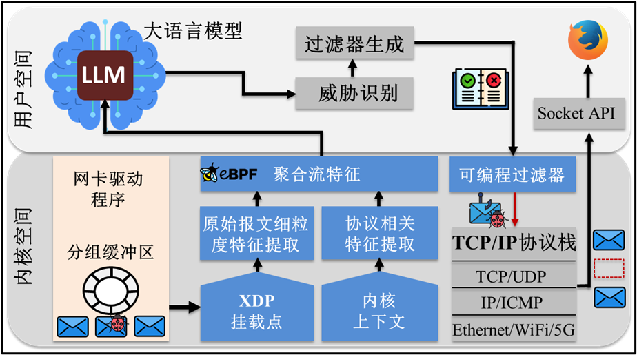
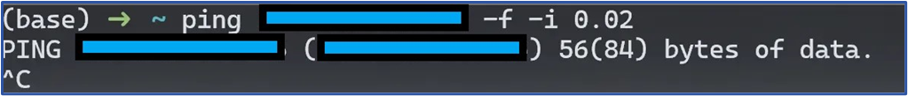
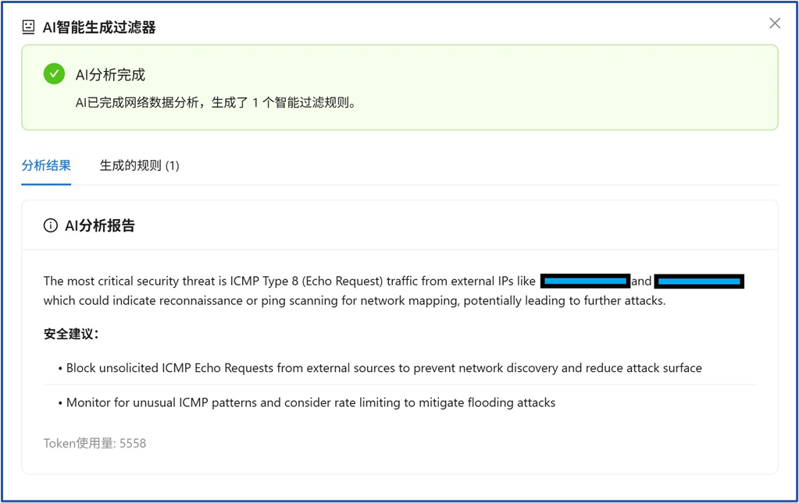
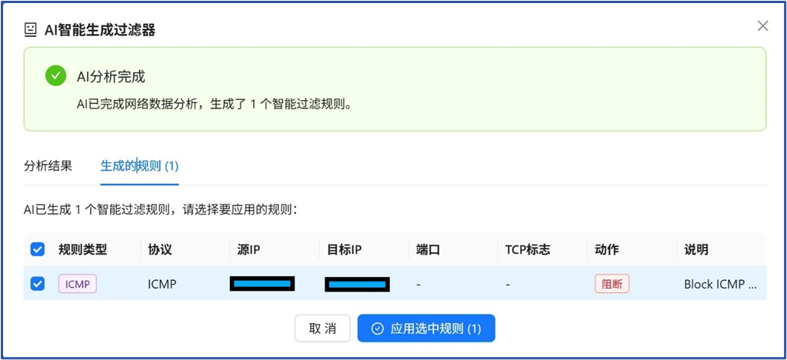
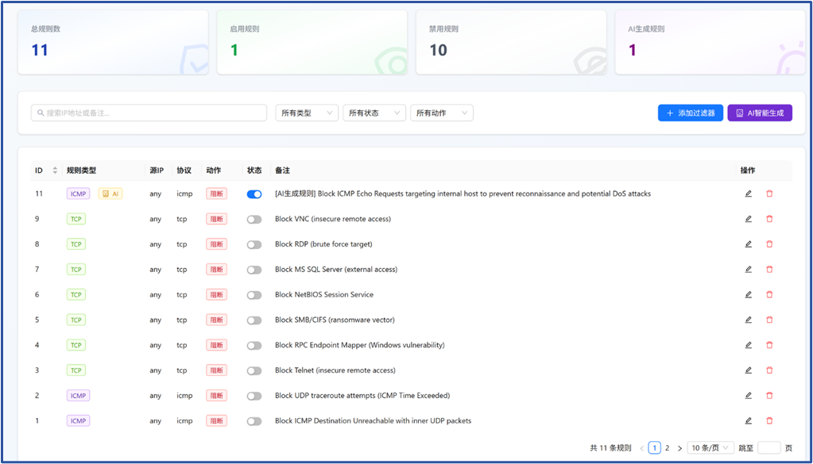
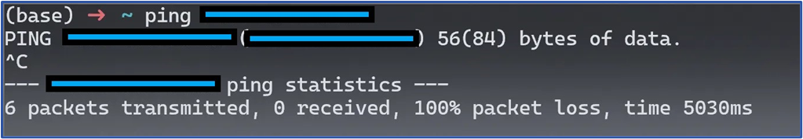

# 张力拉满、丝滑对接：大模型LLM赋能eBPF重塑网络攻击防御新范式-先知社区

> **来源**: https://xz.aliyun.com/news/19217  
> **文章ID**: 19217

---

PacketScope是一种基于eBPF的TCP/IP协议栈通用防御框架。通过在协议栈处理路径上动态观测、实时感知每一个分组单元在系统内的处理轨迹，绘制协议交互全景图，再辅助以大模型分析，PacketScope实现了协议栈内核级别的分组可视化、安全性分析与零延迟防御。

* 项目介绍：<https://internet-architecture-and-security.github.io/packetScope-website/>
* 项目地址：<https://github.com/Internet-Architecture-and-Security/PacketScope>

大家好啊！今天我们为大家继续介绍PacketScope项目的Guarder功能，即大模型赋能的网络攻击栈内智能识别与防御篇。

## 网络攻击的达摩克利斯之剑

**你想象过吗，网络攻击会给互联网发展、甚至人类经济社会造成多大危害和影响？** 我们直观的给出一组数字：根据Cybercrime Magazine统计，2025年网络攻击相关犯罪活动将给全球造成10.5万亿美元的损失。损害规模远超一年内的自然灾害总和，甚至比全球所有主要非法毒品贸易的利润还要高。因此，如何有效防御网络攻击、减少危害损失，不论是国家政府、还是企业及个人用户，各个层面都非常关注。

（注：该图由AI生成）

那么网络攻击为什么难以防御，它的防御痛点是什么呢？我们认为可以简单的总结为2个关键痛点，供读者们参考指正：**一是网络攻击的识别发现难；二是网络攻击的拦截阻断难。**

* **识别发现难：** 现在的网络攻击，已经不同于早些年针对单协议或者单漏洞的显式利用，取而代之的往往是利用端到端（End-to-End）复杂协议交互过程中出现的语义缺陷，进行跨协议渗透突破。网络攻击呈现出跨域跨层、步骤多、分布式、隐匿性等特征，静态的特征匹配和对比检测方法难以识别出这类的复杂攻击，往往需要语义层面长上下文的推理和关联分析。
* **拦截阻断难：** 攻击的识别和拦截之间存在鸿沟。即使一个隐蔽网络攻击被成功识别出，要对这个攻击进行实时的拦截和防御，往往需要复杂的网络配置或者规则编写。安全管理人员要能够理解和提取出攻击的关键步骤和特征，然后编写出准确的安全策略或规则，并且将规则部署下发到合适的网络位置，才能有效拦截攻击，这一过程亟需自动化来实现。

针对上述问题，**PacketScope项目将大模型赋能的协议交互长上下文推理能力与基于eBPF的内核级协议栈可编程能力，丝滑结合联动在一起，实现了隐蔽网络攻击的智能识别及栈内自动阻断。**

## LLM赋能的网络攻击内核级栈内防御原理

PacketScope对网络攻击的栈内防御主要由Guarder模块完成。Guarder的实现依赖于两项关键技术的结合：Linux内核的eBPF/XDP技术和外部的大语言模型（LLM）分析能力。这套机制形成了一个从感知到决策再到执行的完整闭环。

如下图所示，其工作流程可以分解为几个步骤：

基于eBPF的协议交互追踪与交互图绘制

1. 首先，在数据采集阶段，Guarder利用eBPF程序直接挂载在网卡的XDP（eXpress Data Path）钩子上。XDP是Linux内核中处理网络数据包的最早位置，甚至在数据包进入主协议栈之前。这意味着Guarder可以进行“零拷贝”的高效数据包捕获，几乎不会对系统本身造成性能负担。此时，它会收集TCP/UDP连接的元数据、ICMP流量特征等信息。
2. 接着，这些在内核态收集到的原始数据，通过BPF Maps这一高效的内核-用户空间通信桥梁，被安全地传递到运行在用户空间的Guarder主程序。
3. 进入用户空间后，AI分析模块开始工作。它会整理、汇总这些实时流量数据，并根据预设的分析目标（例如“寻找异常出站连接”），将这些信息结构化后，通过API提交给一个大语言模型LLM。Guarder支持灵活配置，可以使用ChatGPT、DeepSeek、TrafficLLM等云端模型，也支持连接到本地部署的vLLM或Ollama等模型，以满足不同场景下的数据隐私和成本需求。
4. 大语言模型在接收到数据和分析指令后，会利用其强大的模式识别和推理能力，对流量行为进行研判。如果判断出存在恶意攻击或异常行为，它会根据威胁的特征，自动生成一条或多条用于阻断该行为的eBPF过滤规则。
5. 最后，这些由AI生成的防御规则会被Guarder程序接收，并立即下发、更新到内核的XDP钩子上。由于规则直接在内核网络路径的最前端生效，恶意的网络流量在消耗任何系统资源之前就被直接丢弃，从而实现了高效且及时的拦截。

## 安装及演示

PacketScope 1.5 版本已在Ubuntu 24.04 （Linux内核环境 6.8）中完成了相关模块的测试部署。Guarder模块经测试分析已经可以实现对常见典型攻击威胁的智能识别和栈内实时阻断。

**划重点！！！PacketScope现在已经支持全系统的Docker环境部署和安装，轻松无忧、便捷用户一键安装和使用。此外，我们在VPS上部署了安装好的PacketScope，供用户点击试玩，直接进入URL（**<http://82.156.141.213:4173/> **）即可访问，欢迎大家体验试玩！**

下面，我们以现实中最常见的ICMP Ping Flooding洪泛攻击为例，直观展示PacketScope的Guarder模块如何自动的识别和防御网络攻击的：

* 首先，假设有一个远程攻击者向部署了PacketScope的服务器洪泛发送大量的ICMP Ping报文（攻击者可通过ping工具等指定报文发送速率及报文大小等），企图消耗目标服务器的带宽资源：

* 管理员在PacketScope的Guarder页面中，过滤器管理选项卡下，点击AI智能生成，对服务器的流量进行在线的实时分析：

* Guarder大模型会读取服务器的流量摘要，对服务器流量进行自动的分析识别，成功锁定和识别出刚才攻击者发送的ICMP攻击报文，输出安全分析报告：

* Guarder大模型自动生成相应的eBPF过滤器规则：

* 管理员点击激活该规则，实时下发到服务器内核协议栈：

* 规则下发后，可以看到攻击者发送的ICMP报文会被PacketScope丢弃，无法继续实施攻击：

## 未来展望

PacketScope项目逐步揭开了端侧协议栈复杂交互的“黑盒”，推动终端安全从隔离检测向内部认知与智能化防御演进。作为其中的关键模块，Guarder尝试将大模型的分析决策能力与eBPF的高效内核执行机制结合，把复杂网络攻击的识别与实时阻断下沉至协议栈内部，从而引领主机安全迈向新阶段。

* 未来，PacketScope项目将继续扩展相关功能模块，包括实现应用级协议的分析追踪、构建跨主机协同分析能力实现管理域内多主机内核协议栈的分布式追踪、开放更为灵活的编程接口便于专业人员自定义函数观测点及监控参数等。
* 下一篇推送我们将继续通过攻防实例，展示如何利用PacketScope的交互图分析能力，检测隐蔽的TCP DoS攻击，敬请关注！
* 我们期待与安全社区和互联网研究者一起携手交流，共同打造面向未来的协议栈安全基石。

**P.S.** 大家在安装或使用的过程中有任何问题，欢迎在Issues里面提问留言（项目介绍网站：<https://internet-architecture-and-security.github.io/packetScope-website/> ，项目Github开源地址：<https://github.com/Internet-Architecture-and-Security/PacketScope> ），作者们将在第一时间回复解答。
