# 【揭秘】好靶场的应急响应靶场制作的坑-先知社区

> **来源**: https://xz.aliyun.com/news/19227  
> **文章ID**: 19227

---

# 0x00 前言

本文不是为了非要打广告，只是希望可以帮到一些设计应急响应靶场的师傅。提供一星半点的思路就好。我们也是在摸石头过河，有兴趣的师傅可以一起交流。

就在2025年10月29日的时候，我们收到了一个问题。问我们是否有应急响应的靶场吗，


我们的回答是没有。

在当天下午的时候，我们的回答是:快做

​


​

当然这一路踩了很多的坑，我们来一一道来。

# 0x01 问题1：应急靶场怎么做

这个是我们遇到的第一个问题，应急靶场应该做，由于我们架构的问题，没有办法直接采用22端口开放的方式。

本着我们是为了让学习安全的朋友们了解到应急，以及应急上机应该怎么做，我们根据Linux应急排查手册进行靶场的设计。这样就可以达到练习的目的。

我们启用了传统的开放22端口的方式，采用了gotty。总结下来非常好用。也非常流畅，大家制作靶场的时候可以进行尝试。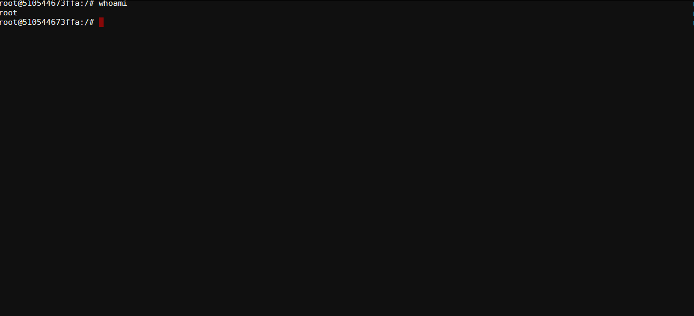

接下来就是靶场设计了，我们参考的是：<https://github.com/Bypass007/Emergency-Response-Notes/blob/master/%E7%AC%AC01%E7%AB%A0%EF%BC%9A%E5%85%A5%E4%BE%B5%E6%8E%92%E6%9F%A5%E7%AF%87/%E7%AC%AC2%E7%AF%87%EF%BC%9ALinux%20%E5%85%A5%E4%BE%B5%E6%8E%92%E6%9F%A5.md>

​

虽然资料比较老，但是里面的资料真材实料，值得一学，所以我们有了第一个靶场。

我们创建了一个名为hacker的用户，然后再/home/hacker/目录下留了一个文件，里面包含了一个flag。

主要的考点是，需要查看/etc/passwd发现多了一个后门用户，然后排查home文件有什么残留。

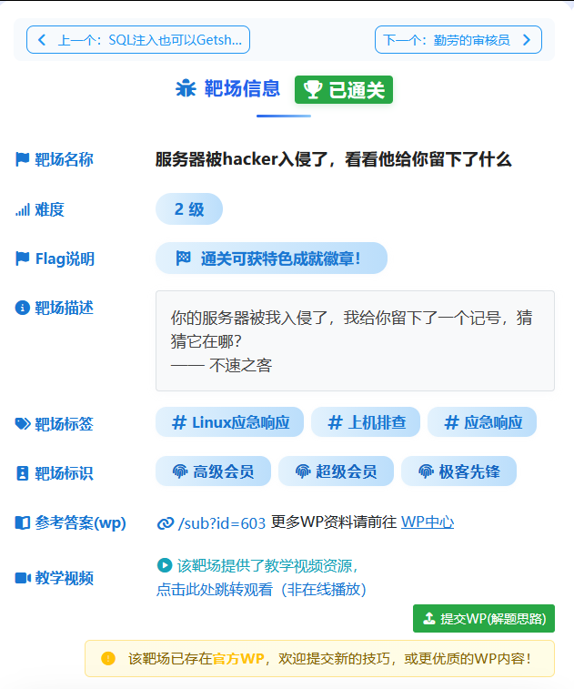我们还录制了简单的视频。

<https://www.bilibili.com/video/BV1Wpy4BtEEZ/>

可以看到hacker用户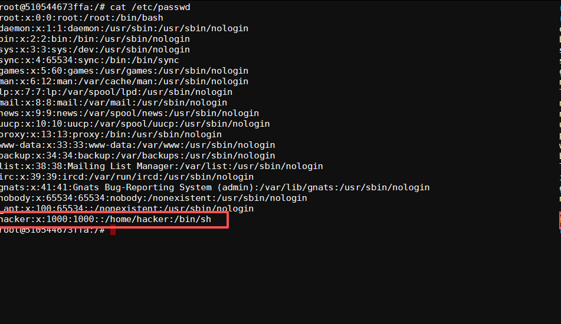然后查看目录

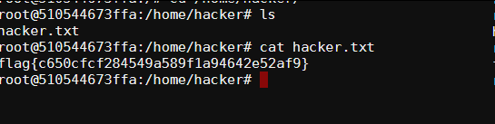

你以为到这里问题都解决了，不不不，问题远不止这些。

​

# 0x02 问题2：flag通杀

有师傅体验了靶场之后，发现一个问题，直接搜索flag不就好了，根本不需要理解题目，有很多学习安全的师傅在打靶场的时候会有一个习惯，通杀，目的不一样所以思路不一样。但是一但学习安全人意志不坚定，且学习意思不够，就会选择学习通杀，所以我们要遏制他。这个是我们要解决的问题。

下面这个命令可以通杀flag

​

```
grep -r "flag{" / 2>/dev/null
```

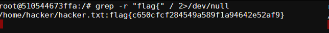

机智的我们采用了base64，后续的poc使用了base64。这样就解决了通杀问题。

​

# 0x03 问题三：Zmxh 通杀

踩了一个坑，虽然base64了之后，但是Zmxh依旧可以搜索到。

​

Sherry师傅反馈，让我们赶快修复

​

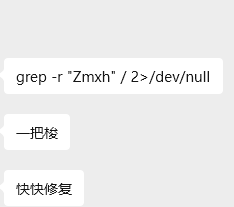

其实本来已经不想修复了

​

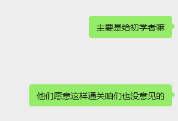

​

但是为了能让我们的初学者没有办法使用邪修秘技，所以我们又去修复，我们直接去除了flag{}。改为了提示，这下没办法了吧

​

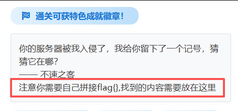

# 0x04 问题四：文件时间问题

由于我们的操作文件和其他的文件，时间不一样，那么就可以通过如下命令将近期修改的文件筛选出来。

​

```
sudo find / -type f -mtime -1 -not \( -path "/proc/*" -o -path "/sys/*" -o -path "/dev/*" -o -path "/run/*" -o -path "/tmp/*" -o -path "/var/log/*" \) -exec ls -lh --time-style=+"%Y-%m-%d %H:%M:%S" {} \; | sort -k6,7
```

我们通过touch命令直接复制一个文件的事件，这下子就没有办法通过近期时间来进行溯源了

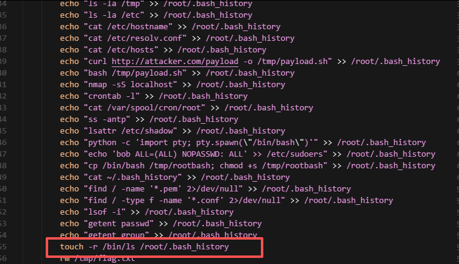

# 0x05 问题5 启动文件

因为启动文件是必须在服务器上的，所以我们遗留在了服务器上，所以有师傅直接ps让后读到了文件，题目答案一览无余。

​

我们通过在执行我们想要执行的命令的时候，删除掉这个文件即可。

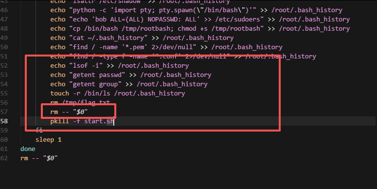

修复效果如下图所示，这下好了，读取不到了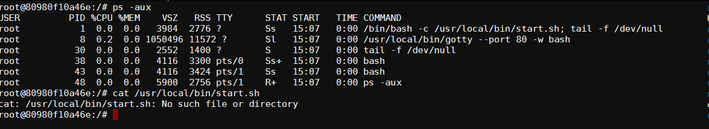

# 0x06 问题6 内存读取

大白龙师傅反馈，说可以通过内存读取sh文件。。。。。。犹豫start.sh进程无法直接杀死，所以我们需要一个新的方案

好，我们内部又小小的讨论了一下，最终拍了一个方案，start文件给留着。我们额外写一个sh不就好了。

​

用strat.sh调起来，然后执行完进行一个自删除，完美。

​

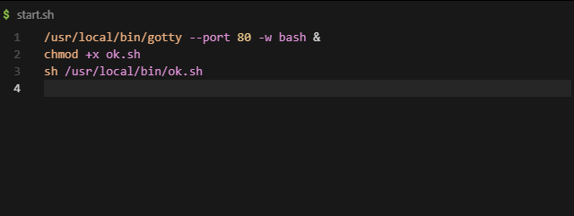

然后真实的在ok.sh里

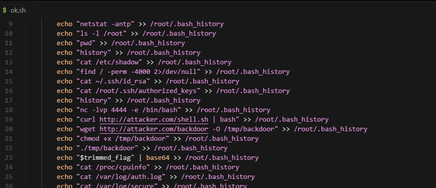

这样子目前就解决了我们能想到的一些坑了。

​

# 0x07 End

犹豫技能能力有限，以及经验有限，各位大佬路过轻喷，我们会继续努力。

​

最后，有兴趣的师傅可以体验一下我们的应急靶场：<http://www.loveli.com.cn/findbug?keyword=%E4%B8%8A%E6%9C%BA%E6%8E%92%E6%9F%A5>

​

以上，谢谢各位。

​
