# 数据安全及数据安全CTF题目解题方法的总结-先知社区

> **来源**: https://xz.aliyun.com/news/19235  
> **文章ID**: 19235

---

# 数据安全

在安全领域中，“数据安全”通常不是一个抽象的概念，而是**一系列需要你通过黑客技术去发现、利用或修复的具体漏洞和挑战**。它主要聚焦于 **“攻击视角”** 下的数据安全，即数据是如何因为不安全的实践而泄露或被篡改的。

一般有数据识别与审计，数据清洗，数据删除与恢复，数据脱敏等

## 基础知识掌握

### 常见数据特征

#### 个人身份与标识类

**1.手机号**：11位数字且第一位数字是1

( 第二位和第三位数字代表了不同的运营商和归属地，目前已经开放到 `3-9`）

**2.身份证号** ：

* **格式**：18位（15位已基本淘汰）。
* **规则**：前6位为地址码，中间8位为出生日期，后4位为顺序码和校验码。
* **正则示例**：`\d{17}[\dXx]`

**3.姓名**：

* **格式**：通常为2-4个汉字。
* **注意**：也有少数民族或特殊情况包含间隔点 `·`。
* **正则示例**：`[一-龥]{2,4}` 或 `[一-龥·]{2,5}`

3.**用户名/账号**：

* **格式**：通常为数字、字母、下划线的组合，长度在4-20位之间。
* **正则示例**：`[a-zA-Z0-9_]{4,20}`

#### 网络与通信类

**1.IP地址**：

* **IPv4**：`192.168.1.1`，四个0-255的数字用点分隔。 `^(25[0-5]|2[0-4]\d|1\d\d|[1-9]?\d)(\.(25[0-5]|2[0-4]\d|1\d\d|[1-9]?\d)){3}$`
* **IPv6**：`2001:0db8::ff00:0042:8329`，更复杂，由冒号分隔的十六进制块组成。 `\b(?:25[0-5]|2[0-4]\d|1\d\d|[1-9]?\d)(?:\.(?:25[0-5]|2[0-4]\d|1\d\d|[1-9]?\d)){3}\b`

**2.Mac地址**：

XX:XX:XX:XX:XX:XX

* **长度固定：** 48位（6个字节）的二进制数，通常用12个十六进制字符表示。
* **格式：** 最常见的表示方法是用分隔符（冒号 `:` 或连字符 `-`）将12个字符每两个一组分开，形成 `XX:XX:XX:XX:XX:XX` 的格式。
* **字符范围：** 十六进制数字，即 `0-9` 和 `A-F`（不区分大小写）。

3.**邮箱地址**：

* **格式**：`用户名@域名.顶级域名`。
* **规则**：用户名部分通常允许数字、字母、点、下划线等；域名部分遵循主机名规则。
* **正则示例**：`[a-zA-Z0-9._%+-]+@[a-zA-Z0-9.-]+\.[a-zA-Z]{2,}`

4.**URL**：

* **格式**：包含协议、域名、路径、参数等。
* **正则示例**：`https?://[a-zA-Z0-9.-]+\.[a-zA-Z]{2,}(/\S*)?`

#### 时间与日期类

1.**日期**：

* **常见格式**：`YYYY-MM-DD`, `YYYY/MM/DD`, `YYYY年MM月DD日`。
* **正则示例 (YYYY-MM-DD)**：`\d{4}-\d{1,2}-\d{1,2}`

2.**时间**：

* **常见格式**：`HH:MM:SS` 或 `HH:MM`。
* **正则示例**：`\d{1,2}:\d{2}(:\d{2})?`

#### 地理与位置类

1.**邮政编码**：

* **中国**：6位数字。
* **正则示例**：`\d{6}`

2.**车牌号**：

* **中国**：汉字(省份) + 字母(城市) + 数字和字母混合。
* **正则示例 (简化)**：`[一-龥][A-Z][A-Z0-9]{4,5}`

#### 代码与序列类

* **MD5哈希值**

* **格式**：32个十六进制字符。
* **正则示例**：`[a-fA-F0-9]{32}`

* **SHA1哈希值**

* **格式**：40个十六进制字符。
* **正则示例**：`[a-fA-F0-9]{40}`

* **Base64编码**

* **格式**：由大小写字母、数字、`+`、`/` 和 `=` 组成。
* **正则示例**：`[A-Za-z0-9+/]{20,}={0,2}`

### 正则表达式

**正则表达式**是一种用于**匹配和处理文本**的强大工具。它使用一种特殊的字符序列来描述、检查一个字符串是否满足某种复杂的**模式**。

简单来说，它就是一套“**文本匹配规则**”，在数据安全里面常用于数据提取方面

**正则表达式及示例：**

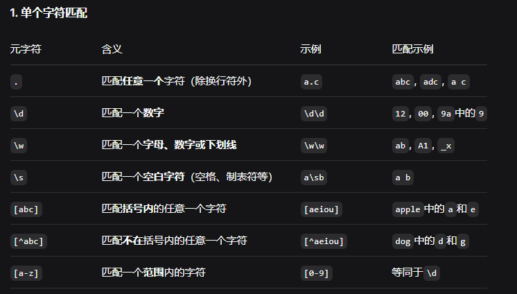

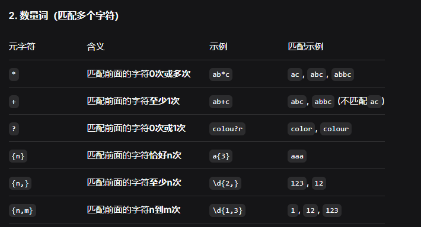

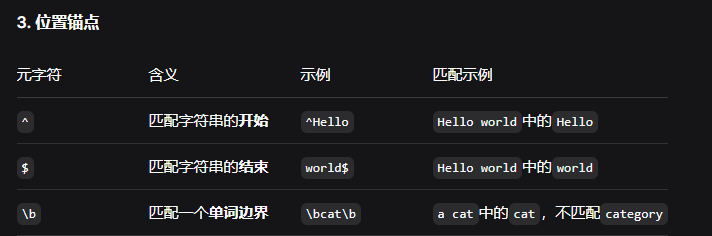

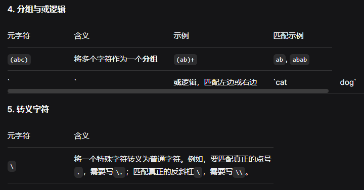

**1.手机号**

```
^1[3-9]\d{9}$
```

* `^`：匹配字符串的开始。
* `1`：第一位必须是1。
* `[3-9]`：第二位必须是3-9之间的一个数字。
* `\d{9}`：后面跟着任意9个数字。
* `$`：匹配字符串的结束。

**2.mac地址**

```
^([0-9A-Fa-f]{2}[:-]){5}([0-9A-Fa-f]{2})$
```

* `^`：匹配字符串的开始。
* `([0-9A-Fa-f]{2}[:-]){5}`：匹配一个“两个十六进制字符 + 一个冒号或连字符”的单元，并重复5次。
* `([0-9A-Fa-f]{2})`：匹配最后两个十六进制字符。
* `$`：匹配字符串的结束。

正则表达式在数据安全中的应用\*\*

**1. 数据识别与提取**

这是最常见的用途。当你从内存镜像、网络流量或日志文件中拿到一大段杂乱无章的文本时，可以用正则表达式快速定位关键信息。

* **查找Flag**： `flag{[^}]+}` 或 `CTF{[^}]+}`

* 解释：匹配以`flag{`开头，后面跟着一个或多个`}`以外的字符`[^}]+`，直到遇到`}`为止。

* **查找邮箱**： `\w+@\w+\.\w+`

* 解释：匹配`单词字符@单词字符.单词字符`。

* **查找IP地址**： `\d{1,3}\.\d{1,3}\.\d{1,3}\.\d{1,3}`
* **查找SQL注入痕迹**： 在日志中搜索 `UNION.*SELECT`, `OR.1=1` 等模式。

**2. Web应用防火墙规则**

WAF经常使用正则表达式来检测和拦截恶意流量。

* 规则 `/(union.*select)/i` 可以拦截大多数简单的`UNION SELECT`注入攻击。
* 规则 `/<script.*?>/i` 可以用于检测反射型XSS攻击的初步特征。

**正则表达基础代码**

```
import re

# 基本元字符
pattern = r"正则表达式"

# 常用模式
r"\d+"           # 一个或多个数字
r"\w+"           # 字母、数字、下划线
r"[a-zA-Z]+"     # 英文字母
r".*"            # 任意字符（贪婪）
r".*?"           # 任意字符（非贪婪）
r"(\d{4})-(\d{2})"  # 分组捕获
```

### 一些常见文件特性

#### **1. PDF文件 - XSS和代码注入**

**常见攻击向量：**

```
// PDF中的JavaScript执行
/JavaScript <</JS (app.alert('XSS'))>>

// 利用PDF表单漏洞
/AA <</O <</JS (app.alert(1))>>>

// URI动作注入
/A << /S /URI /URI (javascript:alert('XSS')) >>
```

**检测方法：**

```
def detect_pdf_xss(pdf_content):
    patterns = [
        r"/JavaScript.*?<<.*?JS.*?\(.*?alert",
        r"javascript:",
        r"app\.alert",
        r"/AA.*?<<.*?JS"
    ]
    for pattern in patterns:
        if re.search(pattern, pdf_content, re.IGNORECASE | re.DOTALL):
            return True
    return False
```

例子：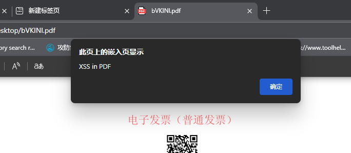

打开出现弹窗

#### **2. PNG文件 - CRC校验攻击**

**PNG文件结构：**

```
PNG签名 (89 50 4E 47 0D 0A 1A 0A)
└── IHDR块 (图像头信息)
    ├── 长度 (4字节)
    ├── 类型 (4字节: "IHDR")
    ├── 数据 (13字节)
    └── CRC (4字节: 校验前面数据)
```

例子：

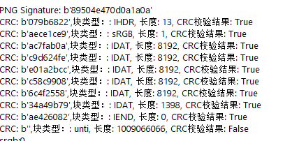

发现png最后一个块错误，在末尾发现恶意代码  
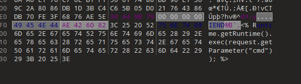

#### **3. 压缩文件 - 重复数据压缩**

**原理：**

* **重复数据**：`00 00 00 00...` 压缩后很小
* **实际案例**：42.zip (42KB → 解压后4.5PB)
* **利用DEFLATE算法**：重复模式高效压缩

#### ​*4. JPEG - 注释和EXIF注入*

```
# JPEG文件结构利用
FF FE - 注释段
- 可插入恶意脚本
- EXIF数据注入

# 检测代码
def check_jpeg_comments(jpeg_data):
    markers = [b'\xFF\xFE', b'EXIF', b'Comment']
    return any(marker in jpeg_data for marker in markers)
```

## 数据识别与审计

数据识别与审计是数据安全的第一道防线，旨在**系统性地发现、分类和评估组织内的敏感数据**。在攻击视角下，这也是攻击者进行信息收集和敏感数据定位的关键阶段。

这一块主要运用的是对数据的熟悉程度和技巧

例如常见文件头文件尾，编码和正则表达式，为此给出两个例题进行讲解和拓展

### 文件格式题

**例题1**：2025轩辕杯数据安全（改编自2025数字中国[数据安全]）

题目给了pdf，txt，png，wav四种文件类型，让找出信息泄露或者隐藏恶意代码的文件(每一个五个)  
pdf根据之前讲的，可以注入代码，写个识别的就行

```
import os
import re
import csv
def contains_script(text):
    return b'alert' in text
def process_directory(directory, output_csv):
    """遍历目录中的所有pdf文件"""
    with open(output_csv, mode='w', newline='', encoding='utf-8') as csvfile:
        csvwriter = csv.writer(csvfile)
        # 写入CSV文件的表头
        csvwriter.writerow(['Filename', 'Content'])
        for root, dirs, files in os.walk(directory):
            for file in files: 
                if file.endswith('.pdf'):
                    file_path = os.path.join(root, file)
                    with open(file_path, mode='rb') as f:
                        content = f.read()
                        # 检查文件内容是否包含数字
                        if contains_script(content):
                            csvwriter.writerow([file])
if __name__ == "__main__":
    directory_to_search = 'pdf'  # 替换为你要搜索的目录路径
    output_csv_file = 'outputpdf.csv'  # 输出CSV文件的名称
    process_directory(directory_to_search, output_csv_file)
```

对于png：

png尾部插入了一句话木马（这里是这样，通常也只能改尾部，改其他地方图片会损坏）

```
import os
def has_extra_data(file_path):
    with open(file_path, 'rb') as f:
        content = f.read()
    # PNG 文件的尾部应该是 IEND 部分，长度为 12 字节
    end_pos = len(content) - 8
    if content[end_pos:end_pos + 8] == b'IEND\xaeB`\x82':
        return None
    else:
        return content[end_pos-40:end_pos + 8]
def process_directory(directory):
    for root, dirs, files in os.walk(directory):
        for file in files:
            if file.lower().endswith('.png'):
                file_path = os.path.join(root, file)
                extra_data = has_extra_data(file_path)
                if extra_data:
                    # print(f"文件: {file_path}, 尾部额外数据: {extra_data}")
                    print(f"{file}")
                    
if __name__ == "__main__":
    directory_to_search = 'png'  # 替换为你要搜索的目录路径
    process_directory(directory_to_search)
```

而对于txt，可以看到大部分都是文字评论，根据我们知道的敏感信息，基本上都是带数字字母的，写个脚本先筛一下这些，筛出来就是答案

```
import os
import re
import csv
def contains_digit(text):
    """检查文本是否包含数字"""
    return bool(re.search(r'\d', text))
def contains_zimu(text):
    return bool(re.search(r'[a-zA-Z]', text))
def process_directory(directory, output_csv):
    """遍历目录中的所有txt文件，并将包含数字或字母的文件名和内容写入CSV文件"""
    with open(output_csv, mode='w', newline='', encoding='utf-8') as csvfile:
        csvwriter = csv.writer(csvfile)
        # 写入CSV文件的表头
        csvwriter.writerow(['Filename', 'Content'])
        for root, dirs, files in os.walk(directory):
            for file in files:
                if file.endswith('.txt'):
                    file_path = os.path.join(root, file)
                    with open(file_path, mode='r', encoding='utf-8') as f:
                        content = f.read()
                        # 检查文件内容是否包含数字
                        if contains_digit(content):
                            csvwriter.writerow([file, content])
                        elif contains_zimu(content):
                            csvwriter.writerow([file, content])
if __name__ == "__main__":
    directory_to_search = 'txt'  # 替换为你要搜索的目录路径
    output_csv_file = 'output.csv'  # 输出CSV文件的名称
    process_directory(directory_to_search, output_csv_file)
```

wav部分

1.用openai的whisper功能读取

```
import os
import whisper
from tqdm import tqdm  # 用于显示进度条

def transcribe_wav_files(folder_path, model_size="base", output_file="transcriptions.txt"):
    """
    使用Whisper转录文件夹中的所有WAV文件
    
    参数:
        folder_path (str): 包含WAV文件的文件夹路径
        model_size (str): Whisper模型大小 (tiny, base, small, medium, large)
        output_file (str): 保存转录结果的文本文件路径
    """
    # 加载Whisper模型
    print(f"Loading Whisper {model_size} model...")
    model = whisper.load_model(model_size)
    
    # 获取文件夹中的所有WAV文件
    wav_files = [f for f in os.listdir(folder_path) if f.lower().endswith('.wav')]
    
    if not wav_files:
        print("No WAV files found in the specified folder.")
        return
    
    print(f"Found {len(wav_files)} WAV files to process.")
    
    # 打开输出文件准备写入
    with open(output_file, 'w', encoding='utf-8') as f_out:
        # 处理每个WAV文件
        for wav_file in tqdm(wav_files, desc="Processing WAV files"):
            file_path = os.path.join(folder_path, wav_file)
            
            try:
                # 使用Whisper进行转录
                result = model.transcribe(file_path)
                
                # 写入结果到文件
                f_out.write(f"File: {wav_file}
")
                f_out.write(f"Transcription: {result['text']}

")
                
            except Exception as e:
                print(f"
Error processing {wav_file}: {str(e)}")
                f_out.write(f"File: {wav_file}
")
                f_out.write(f"Error: {str(e)}

")
    
    print(f"
Transcription complete. Results saved to {output_file}")

if __name__ == "__main__":
    # 使用示例
    folder_path = input("Enter the path to the folder containing WAV files: ")
    
    # 可选：让用户选择模型大小
    model_size = input("Choose model size (tiny/base/small/medium/large, default=base): ").strip().lower()
    if model_size not in ['tiny', 'base', 'small', 'medium', 'large']:
        model_size = "base"
    
    transcribe_wav_files(folder_path, model_size)
```

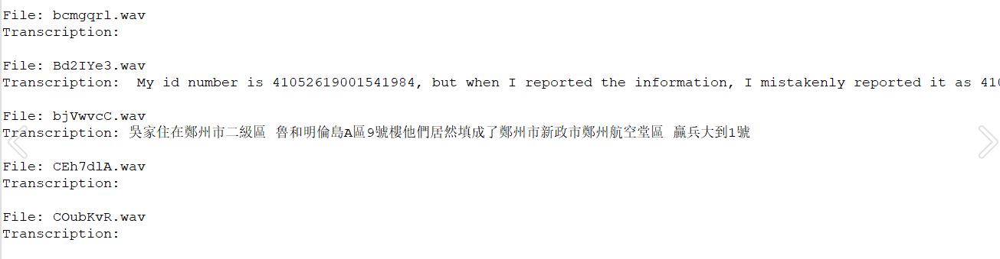

**法二**  
发现大部分音频是空音频（00 00 00 00....)  
zip里面查看  
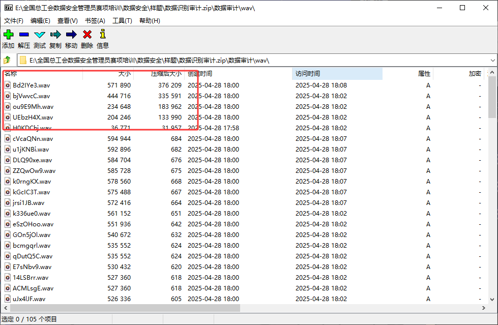

按压缩后大小排序，前五个就是答案，可以去听一下验证

这道题就是典型的识别文件格式的数据识别题目，写这种题，对文件的特性要熟悉

**例题2**：数字中国2025 模型环境安全题目1

```
题目： 根据公司内部的规定，在使用AI时，员工必须严格遵守不上传涉及公司敏感信息的要求。这些敏感信息 可能包括但不限于：用户的个人资料、财务报表、员工的个人信息、研发中的技术⽅案、内部通讯记 录、合同文件、商业机密、市场营销策略等任何可能对公司造成不利影响的机密数据。管理员在服务器 当中搭建了本地AI模型来帮助其办公，但在某次操作时违反了公司规定，管理员想要利用AI批量对包含 了用户隐私信息的图片进行批量格式转换。请选手访问文件服务器。获取""upload.zip""文件，分析 附件还原上传的数据、统计用户的隐私数据数量，将隐私数据数量，作为标准答案提交。 文件服务器账号密码:ftpuser/ftpuser  
```

他是模型安全里面的数据安全，正常解法应该是OCR识别，但这个可以用他的特性  
题目给的是upload文件  
使用foremost-e提取,得到若干png图片,即为敏感信息

观察发现同样行数的png高度相同，所以可以统计png高度对应的图片数，和图片上的表项数，相乘即可算出答案

```
import os
from PIL import Image

def count_pngs_by_height(directory):
    """Count PNG files grouped by their height in pixels."""
    height_count = {}
    for root, dirs, files in os.walk(directory):
        for file in files:
            if file.lower().endswith('.png'):
                file_path = os.path.join(root, file)
                try:
                    with Image.open(file_path) as img:
                        height = img.height
                        height_count[height] = height_count.get(height, 0) + 1
                except Exception as e:
                    print(f"无法打开文件 {file_path}: {e}")
    return height_count

def calculate_expression(height_counts):
    """Calculate the expression based on height counts."""
    # Create a mapping from height to multiplier
    height_multiplier = {
        672: 10,
        733: 11,
        794: 12,
        855: 13,
        916: 14,
        977: 15,
        1038: 16,
        1099: 17,
        1160: 18,
        1221: 19,
        1282: 20
    }
    
    total = 0
    calculation_parts = []
    
    for height, count in sorted(height_counts.items()):
        if height in height_multiplier:
            product = count * height_multiplier[height]
            total += product
            calculation_parts.append(f"{count} × {height_multiplier[height]}")
    
    calculation_str = " + ".join(calculation_parts) + f" = {total}"
    return total, calculation_str

def main():
    directory_path = 'foremost_output/png'
    
    # Count PNGs by height
    height_counts = count_pngs_by_height(directory_path)
    
    # Print height counts
    print("PNG图片高度统计:")
    for height, count in sorted(height_counts.items()):
        print(f"像素高度 {height}: {count} 张图片")
    
    # Calculate and print the expression
    total, calculation = calculate_expression(height_counts)
    print("
计算结果:")
    print(calculation)

if __name__ == "__main__":
    main()
#像素高度 672: 48 张图片
#像素高度 733: 39 张图片
#像素高度 794: 50 张图片
#像素高度 855: 53 张图片
#像素高度 916: 51 张图片
#像素高度 977: 60 张图片
#像素高度 1038: 51 张图片
#像素高度 1099: 38 张图片
#像素高度 1160: 33 张图片
#像素高度 1221: 34 张图片
#像素高度 1282: 43 张图片
    
# 表达式为 43 × 20 + 34 × 19 + 33 × 18 + 38 × 17 + 51 × 16 + 60 × 15 + 51 × 14 + 53 × 13 + 50 × 12 + 39 × 11 + 48 × 10 = 7,374
```

### 数据提取题

对于数据提取，之前提到过，是需要利用好正则表达式和一些便捷工具的，这类题目是可以靠积累来提升解题速度的，下面按常见文件的格式进行例题讲解

#### txt格式

**例题：2025陇剑杯线下数据安全3**  
题目描述：

```
敏感数据识别，小明发现了一段乱序文本中混杂了PhoneNo，IMEI，IPv4，email四种数据类型。请你对其进行数据清洗。按照从上往下，从左往右的顺序分别提取PhoneNo，IMEI，IPv4，email四种数据类型，并分别拼接为字符串。将其分别md5后的值进行再次拼接后进行md5，作为flag提交。

例子：

PhoneNo:18500000000，18523130201

IMEI：535209652769093 535209652761243

IPv4：1.1.1.1 8.8.8.8

Email:1111@qq.com 2222@qq.com

分别进行拼接

PhoneNo-->md5(1850000000018523130201)-->6d2c199df697d35bc656c951dfcd4a33
IMEI-->md5(535209652769093535209652761243)-->b398caf154d248f56996fac704bd2a32
IPv4-->md5(1.1.1.18.8.8.8)-->be11df755d003e1401f5831a5d1440ad
Email-->md5(1111@qq.com2222@qq.com)10dfd7f442eedc5b33cb26f5927b7ce3

最终拼接
flag-->md5(6d2c199df697d35bc656c951dfcd4a33b398caf154d248f56996fac704bd2a32be11df755d003e1401f5831a5d1440ad10dfd7f442eedc5b33cb26f5927b7ce3)--->320e15d80e1944424a109312f2aefb13
flag{320e15d80e1944424a109312f2aefb13}
```

也就是提取这四种类型的数据  
这里是对txt进行提取，txt最佳方法就是正则匹配  
这里也就是之前讲的  
**1.手机号**

```
^1[3-9]\d{9}$
```

**2..邮箱地址：**

```
[a-zA-Z0-9._%+-]+@[a-zA-Z0-9.-]+\.[a-zA-Z]{2,}
```

**3.IMEI（国际移动设备识别码）**

```
^\d{15}$
```

**4.IPv4**

```
^(25[0-5]|2[0-4]\d|1\d\d|[1-9]?\d)(\.(25[0-5]|2[0-4]\d|1\d\d|[1-9]?\d)){3}$
```

这里只给出提取数据的代码：

```
import re

# 读取文件内容
with open("mixed_sensitive_data.txt", "r", encoding="utf-8") as f:
    text = f.read()

# 正则定义
phone_pattern = re.compile(r'\b1[3-9]\d{9}\b')
imei_pattern = re.compile(r'\b\d{15}\b')
ipv4_pattern = re.compile(r'\b(?:25[0-5]|2[0-4]\d|1\d\d|[1-9]?\d)(?:\.(?:25[0-5]|2[0-4]\d|1\d\d|[1-9]?\d)){3}\b')
email_pattern = re.compile(r'[a-zA-Z0-9._%+-]+@[a-zA-Z0-9.-]+\.[a-zA-Z]{2,}')

# 提取匹配项
phones = phone_pattern.findall(text)
imeis = imei_pattern.findall(text)
ipv4s = ipv4_pattern.findall(text)
emails = email_pattern.findall(text)

# 拼接字符串
phone_str = ''.join(phones)
imei_str = ''.join(imeis)
ipv4_str = ''.join(ipv4s)
email_str = ''.join(emails)

# 输出检查
print(f"PhoneNo: {phones}")
print(f"IMEI: {imeis}")
print(f"IPv4: {ipv4s}")
print(f"Email: {emails}")
```

#### csv/xlsx格式

数据分析流程

* **数据读取**：使用**pandas**读取Excel/CSV
* **数据提取**：从复杂字段中提取关键信息

例题：2025数证杯 数据分析赛道 04

```
通过对检材“04-涉诈案件信息表“分析，统计每个分局2024-2025年每月被骗总额环比大于30%的月份个数（环比定义：（这个月的数据-上个月的数据）/上个月数据。特殊情况，例如某分局2025年1月被骗金额总和为100，若该分局2024年12月没有被骗金额，则该分局2025年1月也符合题目要求，应增加一个月份。2024年1月不需要计算与上个月的环比情况），请写出环比大于30%的月份个数最多的分局ID名称为？（答案格式：按照实际情况填写）（ ）
```

提取的精妙之处：

```
def extract_imsi(suyuan_text):
    match = re.search(r'=\[(\d+)->', str(suyuan_text))
    if match:
        return match.group(1)
    return None
```

**正则表达式** `r'=\[(\d+)->'` **的精妙之处：**

* `=\[` → 匹配"=["这个固定前缀
* `(\d+)` → 捕获一个或多个数字（这就是我们要的IMSI）
* `->` → 匹配"->"这个固定后缀

故完整解题脚本：

```
import pandas as pd
import re
from collections import Counter

# 读取Excel文件
df = pd.read_excel('/mnt/user-data/uploads/1761969765214_03-案件卡串号数据.xlsx')

# 提取真实卡串号的函数
def extract_imsi(suyuan_text):
    # 匹配格式: =[卡串号->
    # 使用正则表达式提取
    match = re.search(r'=\[(\d+)->', str(suyuan_text))
    if match:
        return match.group(1)
    return None

# 提取所有真实卡串号
df['真实卡串号'] = df['溯源'].apply(extract_imsi)

# 查看提取结果
print("提取的真实卡串号示例:")
print(df[['溯源', '真实卡串号']].head(10))
print("
"+"="*80+"
")

# 统计每个卡串号出现的次数
imsi_counts = df['真实卡串号'].value_counts()

print("所有卡串号出现次数统计:")
print(imsi_counts)
print("
"+"="*80+"
")

# 找出出现次数最多的卡串号
most_common_imsi = imsi_counts.idxmax()
most_common_count = imsi_counts.max()

print(f"出现次数最多的真实卡串号是: {most_common_imsi}")
print(f"出现次数: {most_common_count}")
```

#### pcap/pcapng/json文件

对于流量包，一般都是有http文件上传导出成可读文本（txt/json）等  
一些是ftp，这些都是流量包内部知识，提取方法wireshark/tshark都可  
然后进行分析，有时用的是scapy  
这里用几个例题讲解

**例题1：数字中国数据识别赛题2**  
题目说明：  
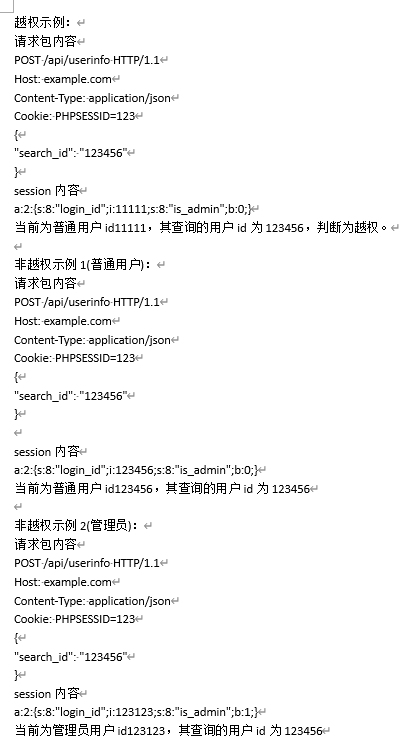

给了对应的session和流量包  
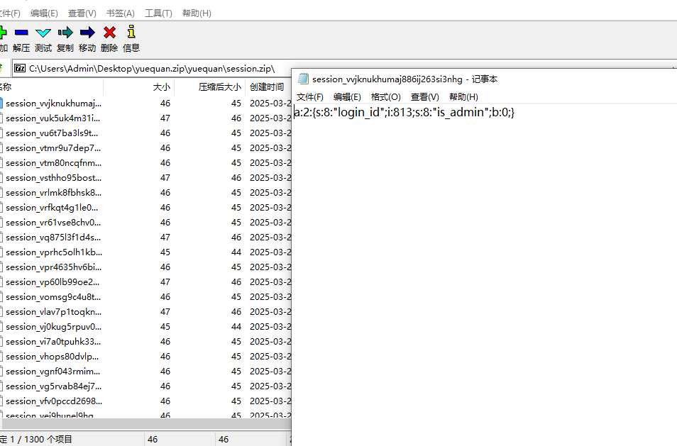

大体思路：通过wireshark 导出所有http报文)编写脚本匹配那些id被多个session访问，然后在从session文件中看看访问的用户是不是管理员即可

第一步过滤**http.request.method == "POST"**

第二步导出json

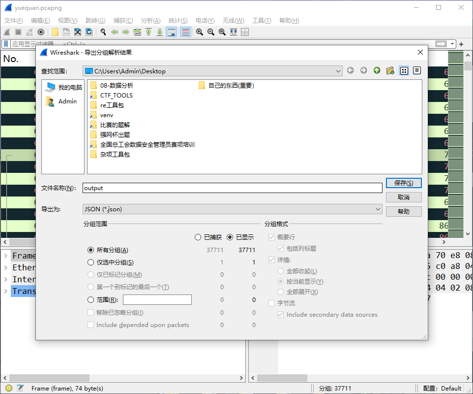

第三步理解数据结构

```
import json

with open("output.json", "r", encoding="utf-8") as f:
    data = json.load(f)
# 您的数据是列表，包含1301个数据包
print(f"数据包数量: {len(data)}")  # 1301

# 每个数据包的结构
first_packet = data[0]
print("第一包键:", first_packet.keys())  
# 输出: ['_source', ...]

print("layers键:", first_packet['_source']['layers'].keys())
# 输出: ['frame', 'eth', 'ip', 'tcp', 'http', 'json', ...]

# Session数据路径：
session = data[i]['_source']['layers']['http']['http.cookie']

# 请求体数据路径：  
request_data = data[i]['_source']['layers']['http']['http.file_data']
```

第四步提取具体数值

```
results = []
for packet in data:
    layers = packet['_source']['layers']
    
    # 提取session
    session = ""
    if 'http' in layers and 'http.cookie' in layers['http']:
        session = layers['http']['http.cookie']  # "PHPSESSID=abc123"
    
    # 提取请求体（十六进制格式）
    hex_data = ""
    if 'http' in layers and 'http.file_data' in layers['http']:
        hex_data = layers['http']['http.file_data']  # "6a:30:49:54:70..."
    
    if session and hex_data:
        results.append({'session': session, 'hex_data': hex_data})
```

第五步数据处理和后续转换

完整解题代码：

```
import json
import base64

with open("output.json", "r", encoding="utf-8") as f:
    data = json.load(f)

print("数据包数量:", len(data))
print("
第一个数据包的详细结构:")

# 详细分析第一个数据包的结构
first_packet = data[0]['_source']['layers']
print("http层中的键:", first_packet['http'].keys())

# 检查cookie信息
print("
检查cookie:")
if 'http.cookie' in first_packet['http']:
    print("http.cookie:", first_packet['http']['http.cookie'])
else:
    print("没有找到http.cookie，http层包含:")
    for key in first_packet['http']:
        if 'cookie' in key.lower():
            print(f"  {key}: {first_packet['http'][key]}")

# 检查请求体数据
print("
检查请求体:")
if 'http.file_data' in first_packet['http']:
    hex_data = first_packet['http']['http.file_data']
    print(f"http.file_data长度: {len(hex_data)}")
    print(f"http.file_data前100字符: {hex_data[:100]}")
    
    # 尝试解码
    try:
        # 去除冒号和换行，转换为字节
        clean_hex = hex_data.replace(':', '').replace('
', '')
        raw_data = bytes.fromhex(clean_hex)
        print(f"原始数据长度: {len(raw_data)} bytes")
        
        # 尝试直接显示可打印字符
        printable = ''.join(chr(b) if 32 <= b <= 126 else '.' for b in raw_data[:200])
        print(f"可打印字符: {printable}")
        
        # 检查是否包含search_id
        if b'search_id' in raw_data:
            print("找到 'search_id' 在请求体中!")
            # 提取search_id值
            import re
            text = raw_data.decode('utf-8', errors='ignore')
            matches = re.findall(r'"search_id"\s*:\s*"(\d+)"', text)
            if matches:
                print(f"找到search_id: {matches}")
        
    except Exception as e:
        print(f"解码错误: {e}")

# 检查其他可能包含数据的字段
print("
检查其他字段:")
for layer in ['json', 'data-text-lines']:
    if layer in first_packet:
        print(f"{layer}: {first_packet[layer]}")

# 现在重新尝试提取所有数据
print("
" + "="*50)
print("开始提取所有数据...")

res = []
for i, packet in enumerate(data):
    layers = packet['_source']['layers']
    
    # 提取session (多种可能的位置)
    ses = ""
    if 'http' in layers:
        http_layer = layers['http']
        # 尝试不同的cookie键名
        for key in http_layer:
            if 'cookie' in key.lower():
                ses = http_layer[key]
                break
    
    # 提取search_id
    search_id = ''
    if 'http' in layers and 'http.file_data' in layers['http']:
        hex_data = layers['http']['http.file_data']
        try:
            clean_hex = hex_data.replace(':', '').replace('
', '')
            raw_data = bytes.fromhex(clean_hex)
            
            # 尝试作为文本解析
            text = raw_data.decode('utf-8', errors='ignore')
            import re
            matches = re.findall(r'"search_id"\s*:\s*"(\d+)"', text)
            if matches:
                search_id = matches[0]
            else:
                # 尝试其他格式
                matches = re.findall(r'search_id=(\d+)', text)
                if matches:
                    search_id = matches[0]
                    
        except Exception as e:
            pass
    
    if ses and search_id:
        res.append([search_id, ses])
        if len(res) <= 5:  # 显示前5个成功提取的
            print(f"成功提取: search_id={search_id}, session={ses}")

print(f"
总共提取到 {len(res)} 条数据")

if res:
    # 统计可疑访问
    from collections import defaultdict
    id_sessions = defaultdict(set)
    
    for search_id, session in res:
        id_sessions[search_id].add(session)
    
    print("
ID访问统计:")
    for search_id, sessions in id_sessions.items():
        if len(sessions) > 1:
            print(f"可疑: ID {search_id} 被 {len(sessions)} 个不同session访问: {sessions}")
    
    # 检查越权
    print("
开始检查越权...")
    for search_id, sessions in id_sessions.items():
        if len(sessions) > 1:
            for session in sessions:
                phpsessid = session.replace('PHPSESSID=', '')
                filename = f'session_{phpsessid}'
                
                try:
                    with open(filename, 'r', encoding="utf-8") as f:
                        content = f.read().strip()
                        print(f"Session {phpsessid} 内容: {content}")
                        
                        # 解析session
                        if '"login_id";i:' in content and '"is_admin";b:' in content:
                            login_id = content.split('"login_id";i:')[1].split(';')[0]
                            is_admin = content.split('"is_admin";b:')[1].split('}')[0]
                            
                            if login_id != search_id and is_admin == '0':
                                print(f"*** 越权发现! 用户 {login_id} 查询了用户 {search_id} ***")
                                
                except FileNotFoundError:
                    print(f"找不到session文件: {filename}")
                except Exception as e:
                    print(f"解析session文件错误: {e}")
```

**例题2** **绿盟CTF 内部赛数据安全赛道**

```
请参赛选手对于给定的网络流量数据包，利用适当的工具和技术，准确获取数据接口查询的内容。该网络流
量数据包将记录多个API接口的访问记录，API形如：
http://www.test.com/api/search/name/?page=1
http://www.test.com/api/search/name/?page=2
http://www.test.com/api/search/name/?page=3
http://www.test.com/api/search/phone/?page=1
调用APl后将获取相关数据，其中前三条api均为获取name数据，为同一api。根据该调用数据的原理，请获取可查询到的
数据量最多的api接口，和该api获取到的数据量作为答案提交。最终答案格式为md5(信息量最多的api_该ap获取到的数
据量)。
正确答案示例：http://www.test.com/api/search/name/共保存数据量10000条，为数据量最多的api
提交结果示例:flag{md5(http://www.test.com/api/search/name/_10000)}
```

题目给了流量包pcap

导出http上传的文件  
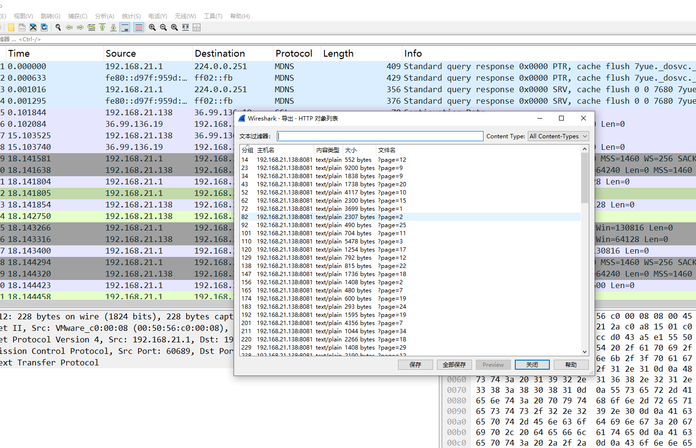

这些都是敏感信息数据（json格式）  
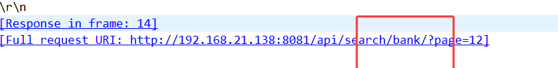

有bank，phone，等四种  
写个脚本写题即可（导出文件我这里放到了ggg文件夹）

```
import os
import ast
from collections import defaultdict

folder = "ggg"
api_data_count = defaultdict(int)

def detect_api_type(data_list):
    if not data_list:
        return None
    
    first_item = str(data_list[0])
    
    # 邮箱特征
    if '@' in first_item and ('.com' in first_item or '.net' in first_item or '.org' in first_item):
        return "email"
    
    # 身份证号特征：18位，数字或最后一位为X
    if len(first_item) == 18:
        if first_item[:-1].isdigit() and (first_item[-1].isdigit() or first_item[-1].upper() == 'X'):
            return "id"
    
    # 数字类型
    if first_item.isdigit():
        length = len(first_item)
        if length == 11:  # 手机号
            return "phone"
        elif 15 <= length <= 19:  # 银行卡号或其他长数字
            return "bank"

for filename in os.listdir(folder):
    filepath = os.path.join(folder, filename)
    with open(filepath, "r", encoding="utf-8") as f:
        content = f.read().strip()
    
    try:
        data_list = ast.literal_eval(content)
    except:
        continue
    
    api_type = detect_api_type(data_list)
    api_data_count[api_type] += len(data_list)

print("各接口数据量统计:", dict(api_data_count))

# 找出数据量最多的接口
if api_data_count:
    max_api = max(api_data_count, key=api_data_count.get)
    max_count = api_data_count[max_api]
    
    # 构造 URL
    url = f"http://192.168.21.138:8081/api/search/{max_api}/"
    answer_str = f"{url}_{max_count}"
    
    import hashlib
    md5_hash = hashlib.md5(answer_str.encode()).hexdigest()
    
    print("最多的接口:", max_api)
    print("总数据量:", max_count)
    print("答案字符串:", answer_str)
    print("MD5:", md5_hash)
else:
    print("没有数据")
```

对于数据提取我给大家分享个我自己写的工具

<https://github.com/rlyhtpzzu/DataExtractorGUI>

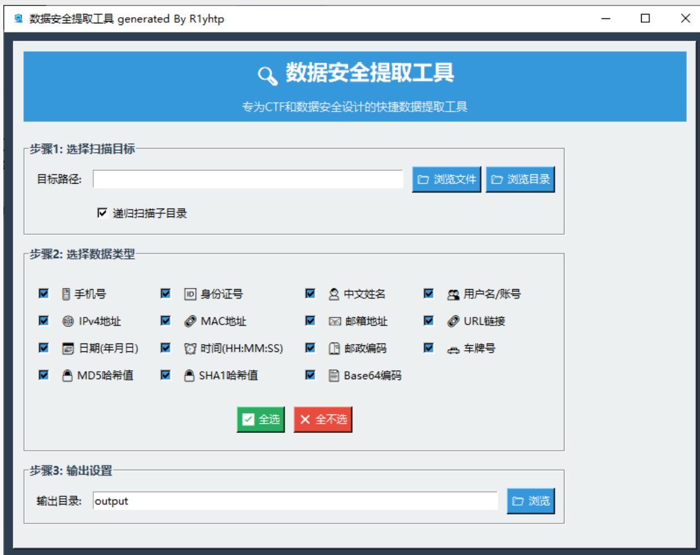

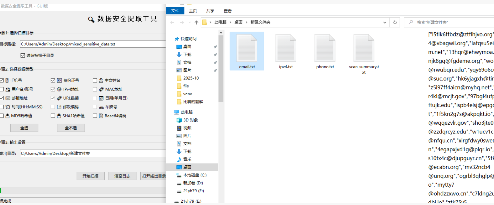

## 数据清洗

### 一、什么是数据清洗

数据清洗（Data Cleaning，又称 Data Cleansing 或 Data Scrubbing）是数据预处理中的核心环节。它的目标是识别并修正数据中的错误、不一致或缺失部分，以提高数据质量，从而为后续的数据分析、建模和机器学习提供可靠基础。

在真实场景中，原始数据往往存在以下问题：

* **缺失值**：例如某些用户没有填写邮箱或年龄。
* **异常值**：某条记录的年龄为 200 岁，或工资为负数。
* **重复数据**：同一用户被录入多次。
* **不一致数据**：如性别字段中同时出现 M、male、男。
* **格式问题**：日期格式混乱，如 2025/08/18 与 18-08-2025 混用。

如果不进行清洗，分析结果可能会严重偏差。

### 二、数据清洗的常见步骤

1. **缺失值处理**

缺失值是最常见问题。处理方式包括：

* **删除法**：直接删除包含缺失值的行或列（适合缺失率高的情况）
* **填充法**：用均值、中位数、众数或插值方法补全
* **模型预测**：使用机器学习算法预测缺失值

**方法对比表**

|  |  |  |  |
| --- | --- | --- | --- |
| 方法 | 说明 | 适用场景 | 优缺点 |
| **删除法** | 直接删除包含缺失值的行或列 | 当缺失值比例较高，且该行/列对整体分析影响不大时 | ✅ 简单快速；❌ 可能丢失有用信息 |
| **填充法** | 用均值、中位数、众数或插值方法补全 | 当缺失值比例较小，且数据分布规律明显时 | ✅ 保留更多数据；❌ 可能引入偏差 |
| **模型预测** | 使用机器学习模型（如 KNN、回归）预测缺失值（将其他完整的列作为特征，缺失值的列作为标签，进行训练预测） | 当数据复杂、缺失值对结果影响较大时 | ✅ 填充值更合理；❌ 计算复杂度高，需额外建模 |

示例（Pandas）：

```
import pandas as pd
import numpy as np

# 构造样例数据
df = pd.DataFrame({
    "姓名": ["张三", "李四", "王五", "赵六"],
    "年龄": [25, np.nan, 30, 28],
    "工资": [5000, 6000, None, 8000]
})

# 缺失值填充
df["年龄"].fillna(df["年龄"].mean(), inplace=True)   # 用均值填充
df["工资"].fillna(df["工资"].median(), inplace=True) # 用中位数填充
```

`fillna()` 函数详解

**函数作用**：在 Pandas 中，`fillna()` 用于填充缺失值 (NaN)。常见于 DataFrame 或 Series 对象，用来替换空值，使数据更加完整。

**基本语法**：

```
DataFrame.fillna(value=None, method=None, axis=None, inplace=False, limit=None, downcast=None)
```

**参数解析**：

|  |  |
| --- | --- |
| 参数 | 说明 |
| `value` | 用于替换缺失值的值，可以是标量、字典或 Series。例如 `df.fillna(0)`，所有 NaN 填充为 0。 |
| `method` | 采用插值法填充： - `ffill` (前向填充)：用前一个非 NaN 值填充 - `bfill` (后向填充)：用后一个非 NaN 值填充 |
| `axis` | 填充方向： - `0` 或 `'index'`（按列填充） - `1` 或 `'columns'`（按行填充） |
| `inplace` | 是否在原对象上直接修改： - `False`（默认，返回新对象） - `True`（直接修改原对象，不返回） |
| `limit` | 限制填充的次数。例如 `limit=1` 只填充一次缺失值，剩下的保留 NaN。 |
| `downcast` | 尝试将填充值转换为合适的更小的数据类型，比如从 float64 转成 int32。 |

1. **异常值检测与处理**

异常值会严重影响模型。常见方法：

* **箱线图法（IQR）**：利用四分位距检测异常值
* **Z-Score 方法**：根据数据分布的标准差判断
* **逻辑规则**：如年龄不能小于 0，工资不可能为负数

示例（Z-Score）：

```
from scipy import stats

# 检测工资异常值
z_scores = stats.zscore(df["工资"])
df = df[(abs(z_scores) < 3)]  # 保留 |Z|<3 的数据
```

1. 重复数据处理

重复记录会影响统计和建模，常用方法：

```
# 删除重复行
df = df.drop_duplicates()
```

1. 数据标准化与一致化

实际数据可能存在不同的表示方法：

* 性别字段：M/F、男/女、1/0
* 日期字段：2025-08-18、2025/8/18

处理方式：

```
# 性别字段统一
df["性别"] = df["性别"].replace({"男": "M", "女": "F"})
```

1. **数据格式规范化**

确保数据类型正确：

```
# 转换日期字段
df["日期"] = pd.to_datetime(df["日期"], errors="coerce")

# 转换数值字段
df["工资"] = pd.to_numeric(df["工资"], errors="coerce")
```

### 三、数据清洗在项目中的意义

* **提升数据质量**：减少噪声和偏差
* **增强模型性能**：机器学习模型对"脏数据"很敏感
* **节省分析成本**：避免在错误数据上浪费计算和决策
* **确保结果可靠**：让分析结论更符合业务逻辑

### 四、案例：员工数据清洗

假设我们有一份员工数据，部分字段存在缺失、重复、异常情况。

```
import pandas as pd
import numpy as np

data = {
    "姓名": ["张三", "李四", "王五", "李四"],
    "性别": ["男", "女", "M", "male"],
    "年龄": [25, 200, 30, 29],
    "工资": [5000, 6000, None, -1000],
    "入职日期": ["2022-01-05", "20220110", "2022/01/15", "2022-01-20"]
}

df = pd.DataFrame(data)
print("数据清洗前：
", df)

# 1. 缺失值处理
df["工资"].fillna(df["工资"].median(), inplace=True)

# 2. 异常值处理（逻辑规则）
df.loc[df["年龄"] > 100, "年龄"] = df["年龄"].median()
df.loc[df["工资"] < 0, "工资"] = df["工资"].median()

# 3. 重复数据去重
df = df.drop_duplicates()

# 4. 一致化
df["性别"] = df["性别"].replace({"男": "M", "女": "F", "male": "M"})

# 5. 日期规范化
df["入职日期"] = pd.to_datetime(df["入职日期"], errors="coerce")

print("数据清洗后：
", df)
```

清洗后，数据更干净，适合后续分析。

### 五、总结

数据清洗是数据科学和机器学习流程中至关重要的一步。主要目标是**去除噪声、修正错误、统一格式、处理缺失与异常**。

在数据安全比赛中，可以结合 Pandas、NumPy、正则表达式、机器学习算法等工具，构建自动化的数据清洗流程。

补充：数据质量评估指标

在开始清洗前，建议先评估数据质量：

```
def assess_data_quality(df):
    print("数据质量报告:")
    print(f"总记录数: {len(df)}")
    print(f"总列数: {len(df.columns)}")
    print("
缺失值统计:")
    missing_stats = df.isnull().sum()
    print(missing_stats[missing_stats > 0])
    print(f"
重复记录数: {df.duplicated().sum()}")
    print(f"
数据类型:
{df.dtypes}")

# 使用示例
assess_data_quality(df)
```

## 数据删除与恢复

取证  
以数字中国2025的一道题讲解

```
题目： 管理员利用AI模型设计了一个结合redis和mysql的交易数据查询系统，但是未对代码的安全性进行充 分验证，导致mysql中的用户虽然被删除但仍可以利用redis中的JWT信息，登录交易数据查询系统。请 选手下载平台提供的附件(用户表.xlsx)，根据用户表（其中1个用户为管理员测试账号，可进行数据库 管理）及数据库中存在的用户,判断哪些用户在被删除后仍可以利用JWT进行登录，将用户名按照用户表 中的先后排序，并使用“_”拼接后，通过md5处理后进行提交
```

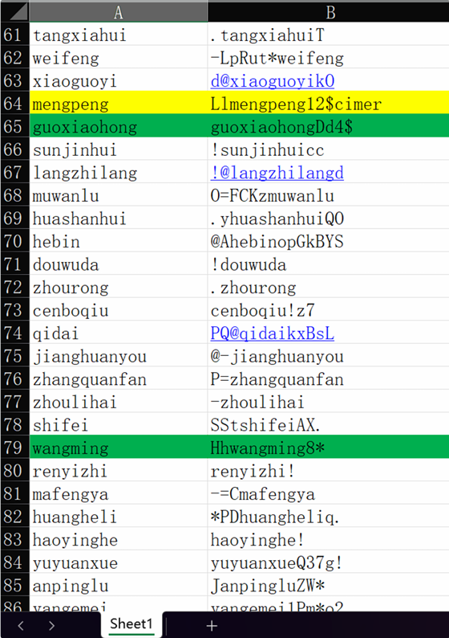

对给出的账号密码尝试逐一登录，发现大部分无法登录，直接跳转首页；有些账号能正常登录（绿色标记）；有些账号登录后功能异常（ 黄色标记 ）

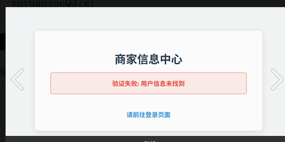

猜测异常但能登陆的账号即为删除但仍缓存的用户

```
import hashlib

# 要计算 MD5 的字符串或数据
data = "wangguizhi_ningxiurong_zhanglihua_mengpeng_gantingting"

# 创建一个 md5 哈希对象
md5_hash = hashlib.md5()

# 更新哈希对象的摘要信息
md5_hash.update(data.encode('utf-8'))

# 获取十六进制表示的 MD5 值
md5_hex_digest = md5_hash.hexdigest()

print("MD5:", md5_hex_digest)
# MD5: 8429e825242b4e9063862b78da1e46dd
```

同时发现管理员账号：

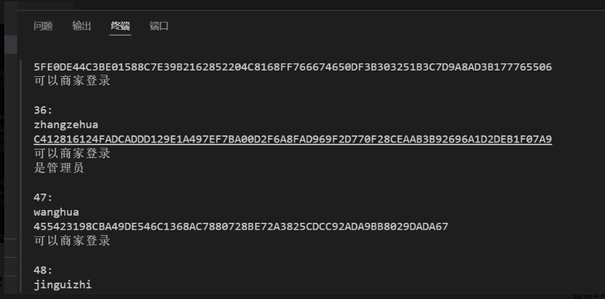

## 数据脱敏

讲解一些**脱敏算法**，数据脱敏算法可以分为两大类别：**不可逆脱敏**和**可逆脱敏**。在大多数涉及隐私保护的场景下，我们主要使用不可逆脱敏。

### 一、不可逆脱敏

一旦处理，原始数据无法恢复。适用于数据分析、测试、共享等无需追溯源值的场景。

#### 1. 替换

用伪造的、但格式一致的数据替换真实数据。

* **随机替换**：从一个符合规则的字典中随机选取值替换。
* **基于规则的替换**：如根据姓氏和性别生成符合文化习惯的假名。

**示例（Python）：**

```
import pandas as pd
import random
from faker import Faker

fake = Faker('zh_CN')
df = pd.DataFrame({
    '真实姓名': ['张三', '李四', '王五'],
    '真实手机号': ['13900123000', '15812345678', '13711112222']
})

# 使用Faker库进行替换脱敏
df['脱敏姓名'] = [fake.name() for _ in range(len(df))]
df['脱敏手机号'] = [fake.phone_number() for _ in range(len(df))]

print(df)
```

**输出：**

```
  真实姓名    真实手机号 脱敏姓名    脱敏手机号
0   张三  13900123000   刘伟  162-7894-1234
1   李四  15812345678   赵强  145-1234-5678
2   王五  13711112222   陈静  158-9876-5432
```

#### 2. 遮蔽/打码

保留部分信息，隐藏敏感部分。这是一种非常常见且直观的方法。

* **保留前后，遮蔽中间**：常用于姓名、身份证号、信用卡号。

* `张三` -> `张*`
* `110101199001011234` -> `110101********1234`
* `13900123000` -> `139****3000`

**示例（Python）：**

```
def mask_name(name):
    if len(name) <= 1:
        return name
    return name[0] + '*' * (len(name) - 1)

def mask_id_number(id_number, visible_front=6, visible_back=4):
    if len(id_number) < (visible_front + visible_back):
        return id_number # 或者处理错误
    front = id_number[:visible_front]
    back = id_number[-visible_back:]
    stars = '*' * (len(id_number) - visible_front - visible_back)
    return front + stars + back

df['遮蔽姓名'] = df['真实姓名'].apply(mask_name)
df['遮蔽身份证'] = '110101199001011234'
df['遮蔽身份证'] = df['遮蔽身份证'].apply(lambda x: mask_id_number(x))

print(df[['真实姓名', '遮蔽姓名', '遮蔽身份证']])
```

**输出：**

```
  真实姓名 遮蔽姓名           遮蔽身份证
0   张三    张*   110101********1234
1   李四    李*   110101********1234
2   王五    王*   110101********1234
```

#### 3. 泛化

将精确值转换为一个范围或一个更粗的粒度，降低数据的辨识度。

* 年龄：`28` -> `20-30`
* 工资：`12500` -> `10000-15000`
* 日期：`2023-08-18` -> `2023-Q3`
* 地区：`北京市海淀区中关村街道` -> `北京市`

**示例（Python）：**

```
import math

def generalize_age(age):
    # 按10岁为一个区间进行泛化
    lower = (age // 10) * 10
    upper = lower + 9
    return f"{lower}-{upper}"

def generalize_salary(salary):
    # 按5000为一个区间进行泛化
    bin_width = 5000
    lower = math.floor(salary / bin_width) * bin_width
    upper = lower + bin_width - 1
    return f"{lower}-{upper}"

df['年龄'] = [28, 35, 42]
df['工资'] = [12500, 8300, 21000]

df['泛化年龄'] = df['年龄'].apply(generalize_age)
df['泛化工资'] = df['工资'].apply(generalize_salary)

print(df[['年龄', '泛化年龄', '工资', '泛化工资']])
```

**输出：**

```
   年龄 泛化年龄     工资    泛化工资
0  28  20-29  12500  10000-14999
1  35  30-39   8300   8000-12999
2  42  40-49  21000  20000-24999
```

#### 4. 置乱

对某一列的数据进行随机排序，从而打破该列数据与其他列的关联性。**注意：这会破坏数据行内的业务逻辑，需谨慎使用。**

**示例（Python）：**

```
df = pd.DataFrame({
    '姓名': ['张三', '李四', '王五'],
    '部门': ['技术部', '销售部', '市场部'],
    '工资': [20000, 15000, 18000]
})

print("置乱前:")
print(df)

# 对“工资”列进行置乱
df['置乱工资'] = df['工资'].sample(frac=1, random_state=42).reset_index(drop=True)

print("
置乱后:")
print(df)
```

**输出：**

```
置乱前:
  姓名   部门     工资
0  张三  技术部  20000
1  李四  销售部  15000
2  王五  市场部  18000

置乱后:
  姓名   部门     工资  置乱工资
0  张三  技术部  20000  18000
1  李四  销售部  15000  20000
2  王五  市场部  18000  15000
```

*可以看到，张三的工资不再是20000，而是被置乱成了18000。*

#### 5. 加噪

对数值型数据加入一个随机噪声，使数据近似真实但并非原值。常用于保护统计特征的同时隐藏个体精确值。

* **加法噪声**：`新值 = 原值 + 随机噪声`
* **乘法噪声**：`新值 = 原值 * (1 + 随机噪声)`

**示例（Python）：**

```
import numpy as np

np.random.seed(42) # 保证结果可重现
df = pd.DataFrame({'真实工资': [20000, 15000, 18000]})

# 添加±10%的乘法噪声
noise = np.random.uniform(-0.1, 0.1, size=len(df))
df['加噪工资'] = df['真实工资'] * (1 + noise)
df['加噪工资'] = df['加噪工资'].round(2)

print(df)
```

**输出：**

```
   真实工资     加噪工资
0  20000  21405.48
1  15000  13801.50
2  18000  19204.38
```

### 二、可逆脱敏

处理后数据可通过特定密钥或方法恢复为原始数据。适用于系统间安全传输或受控环境下的数据处理。

#### 1. 加密算法

使用对称加密（如AES）或非对称加密（如RSA）对数据进行加密。拥有密钥才能解密。

**示例（使用**`cryptography`**库）：**

```
# 注意：这是一个简化示例，生产环境需要安全地管理密钥
from cryptography.fernet import Fernet

# 生成密钥
key = Fernet.generate_key()
cipher_suite = Fernet(key)

df = pd.DataFrame({'信用卡号': ['1234567890123456', '9876543210987654']})

# 加密
df['加密卡号'] = df['信用卡号'].apply(lambda x: cipher_suite.encrypt(x.encode()).decode())
# 解密 (仅用于演示)
df['解密卡号'] = df['加密卡号'].apply(lambda x: cipher_suite.decrypt(x.encode()).decode())

print(df[['信用卡号', '加密卡号']])
print(f"
密钥 (请妥善保管): {key.decode()}")
```

**输出：**

```
            信用卡号                                          加密卡号
0  1234567890123456  gAAAAABmY...（很长一串密文）
1  9876543210987654  gAAAAABmY...（另一串很长密文）
```

#### 2. 令牌化

用一个无意义的随机令牌（Token）替换敏感数据。原始数据被安全地存储在独立的“令牌库”中，只有授权系统才能通过令牌查询到原始值。

* **场景**：支付系统。商家存储的是令牌而非你的真实信用卡号，当需要扣款时，支付网关通过令牌从令牌库中换取真实卡号。

### 三、如何选择脱敏算法？

|  |  |  |  |
| --- | --- | --- | --- |
| 算法 | 适用场景 | 优点 | 缺点 |
| **替换** | 测试环境、UI展示 | 数据看起来真实，保持格式 | 需要维护数据字典，可能碰撞 |
| **遮蔽** | 日志记录、内部报表 | 实现简单，直观，部分信息可用 | 信息有损失，不适合分析 |
| **泛化** | 数据分析、统计、BI报表 | 保留数据分布和统计特性 | 失去精确性 |
| **置乱** | 破坏关联性的测试数据 | 保留列的总体分布 | **完全破坏行内业务逻辑** |
| **加噪** | 保护个体精确值的数值分析 | 保留统计特征（如均值、方差） | 引入微小误差 |
| **加密** | 安全数据传输、受控环境 | 安全，可逆 | 计算开销大，需要管理密钥 |
| **令牌化** | 支付系统、核心系统交互 | 高性能，高安全性 | 架构复杂，需要维护令牌库 |

**核心原则：**

1. **目的决定手段**：先明确数据用途（开发测试？数据分析？），再选择最合适的算法。
2. **最小化原则**：只对必要的敏感字段进行脱敏，并使用刚好满足安全需求的算法。
3. **保持关联性**：确保脱敏后，不同表、不同字段间的关联关系不被破坏（例如，用户ID脱敏后要保持一致）。
4. **保留业务逻辑**：确保脱敏后的数据在业务上是合理的（例如，年龄不能出现负数，城市名必须是真实存在的）。

例如下面这张图片中`数据脱敏`的例子

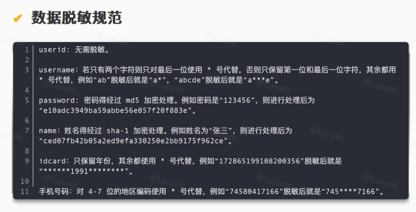

### 从xlsx**中读取数据并实现脱敏**

```
import pandas as pd
import hashlib

def desensitize_name(name):
    length = len(name)
    if length == 2:
        return name[0] + '*'
    elif length == 3:
        return name[0] + '*' + name[2]
    elif length == 4:
        return name[0] + '**' + name[3]
    else:
        return name  # 对于非2-4字姓名，原样返回（可根据需求修改）

def desensitize_phone(phone):
    if len(phone) == 11:
        return phone[:3] + '*****' + phone[8:]
    return phone  # 对于非11位手机号，原样返回

def desensitize_id(id_num):
    if len(id_num) >= 6:
        return id_num[:6] + '*' * (len(id_num) - 6)
    return id_num  # 对于不足6位的身份证号，原样返回

def desensitize_bank_card(card):
    card_str = str(card).strip()  # 转换为字符串并去除空白
    length = len(card_str)
    
    if length < 14:
        return '*' * length
    else:
        # 计算需要保留的中间部分
        keep_length = max(0, length - 14)  # 总长度-14=中间保留位数
        middle = card_str[4:4+keep_length] if keep_length > 0 else ''
        return '****' + middle + '*' * 10

def desensitize_email(email):
    parts = email.split('@')
    if len(parts) == 2:
        local_part = parts[0]
        # 找到最后一个.的位置
        last_dot = local_part.rfind('.')
        if last_dot != -1:
            # 保留.及其前面的字符
            to_keep = local_part[:last_dot+1]
            to_mask = local_part[last_dot+1:]
        else:
            to_keep = ''
            to_mask = local_part
        masked = to_keep + '*' * len(to_mask)
        return masked + '@' + parts[1]
    return email  # 对于不包含@的email，原样返回

def desensitize_gender(gender):
    return '未知'

def desensitize_wechat(wechat):
    if wechat:
        return '*' * len(wechat)
    return wechat
    
def concatenate_and_hash(file_path):
    # 读取Excel文件
    df = pd.read_excel(file_path)
    # 移除标题行（第一行）
    data_rows = df.iloc[1:] if len(df) > 1 else df
    # 按照先行后列的顺序拼接所有单元格内容
    concatenated_str = ''
    for _, row in data_rows.iterrows():
        for value in row:
            concatenated_str += str(value) if pd.notna(value) else ''
    # 计算MD5哈希值
    md5_hash = hashlib.md5(concatenated_str.encode('utf-8')).hexdigest()
    return md5_hash

if __name__ == "__main__":
    # 读取Excel文件
    df = pd.read_excel('data.xlsx')

    # 应用脱敏函数
    df['姓名'] = df['姓名'].apply(desensitize_name)
    df['手机号'] = df['手机号'].astype(str).apply(desensitize_phone)
    df['身份证号'] = df['身份证号'].astype(str).apply(desensitize_id)
    df['银行卡号'] = df['银行卡号'].astype(str).apply(desensitize_bank_card)
    df['Email'] = df['Email'].apply(desensitize_email)
    df['性别'] = df['性别'].apply(desensitize_gender)
    df['微信号'] = df['微信号'].apply(desensitize_wechat)

    # 保存脱敏后的数据到新文件
    df.to_excel('desensitized_data.xlsx', index=False)

    print("[+] 数据脱敏完成，结果已保存到 desensitized_data.xlsx")

    file_path = 'desensitized_data.xlsx'  # 替换为你的Excel文件路径
    result = concatenate_and_hash(file_path)
    print(f"[+] 拼接后的字符串的MD5值为: {result}")
```

### 从csv中读取数据并实现脱敏

```
import csv
import hashlib
import base64

data_list = []
res_list = []

def basedecode(line):
    try:
        if line[-1] == "Base32":
            for i in range(1,6):
                line[i] = base64.b32decode(line[i]).decode()
        elif line[-1] == "Base64":
            for i in range(1,6):
                line[i] = base64.b64decode(line[i]).decode()
        elif line[-1] == "Base85":
            for i in range(1,6):
                line[i] = base64.b85decode(line[i]).decode()
    except:
        pass

def username_solve(username):
    res = ''
    if len(username) == 2:
        res = username[0] + '*'
    else:
        res = username[0] + "*"*(len(username)-2)+username[-1]
    return res

def password_solve(pwd):
    md5_hash = hashlib.md5()
    md5_hash.update(pwd.encode('utf-8'))
    res = md5_hash.hexdigest()
    return res

def name_solve(name):
    sha1_hash = hashlib.sha1()
    sha1_hash.update(name.encode('utf-8'))
    res = sha1_hash.hexdigest()
    return res

def id_solve(id):
    res = "*"*6 + id[6:10] + "*"*8
    return res

def phone_solve(phone):
    res = phone[:3] + "*"*4 + phone[7:]
    return res

if __name__ == "__main__":
    with open("data.csv", "r", encoding='utf-8') as f:
        reader = csv.reader(f)
    for row in reader:
        data_list.append(row)
    data_list[0].remove(data_list[0][6])
    res_list.append(data_list[0])

    for line in data_list[1:]:
        basedecode(line)
        line[1] = username_solve(line[1])
        line[2] = password_solve(line[2])
        line[3] = name_solve(line[3])
        line[4] = id_solve(line[4])
        line[5] = phone_solve(line[5])
        line.remove(line[6])
        res_list.append(line)
        
    with open('out.csv',"w",newline='',encoding='utf-8') as f:
        writer = csv.writer(f)
        writer.writerows(res_list)
```

### 从json中读取数据并实现脱敏

```
import json
from scapy.all import *

# 解析JSON文件，建立IP到域名的映射
ip_domain = {}
with open('国外敏感域名清单.json', 'r') as f:
    data = json.load(f)
    for category in data['categories'].values():
        domains = category['domains']
        for domain, ip in domains.items():
            ip_domain[ip] = domain

# 解析PCAP文件，统计目标IP访问次数
ip_count = {}
packets = rdpcap('某流量审计平台导出的镜像流量.pcap')
for pkt in packets:
    if IP in pkt:
        dst_ip = pkt[IP].dst
        if dst_ip in ip_domain:
            ip_count[dst_ip] = ip_count.get(dst_ip, 0) + 1

# 找出访问次数最多的IP
max_ip = None
max_count = 0
for ip, count in ip_count.items():
    if count > max_count:
        max_count = count
        max_ip = ip

# 生成结果
if max_ip:
    domain = ip_domain[max_ip]
    print(f"{domain}:{max_ip}:{max_count}")
else:
    print("无访问记录")
```
