# HackingTeam Soldier分析（带VMP壳如何分析）-先知社区

> **来源**: https://xz.aliyun.com/news/19237  
> **文章ID**: 19237

---

# 一、介绍

**Soldier** 是意大利公司 Hacking Team 的远控套件 RCS中的**第二阶段载荷**。常见链路是先投放轻量级Scout进行环境侦测与自检，再下发 **Soldier**执行全面监控与数据窃取。本文主要是针对 **Soldier 进行分析，提取其中的配置文件。**

# **二、本文重点**

**为什么选择** **Soldier** **进行分析呢？一方面是因为它****采用VMP进行加壳保护****，另一方面是从围绕着** **“提取载荷配置文件”的目的****来进行聚焦化展示分析能力和分析技巧。**

# **三、逆向**

## **3.1 VMP壳分析**

**样本：ccb3c0462bb50d2c3c5c80ff828f75ec7997e66b4c8096de0f98fa019de6a002**

样本伪造的是java.exe程序，可以看到这种偏工程化的远控，一般细节都处理的很好，对于软件详细信息、图标伪造的都很统一。同时它采用了一个合法的数字证书来绕过一些杀软的检测。

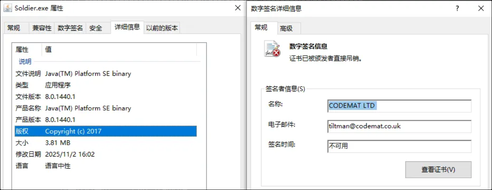

样本依旧使用 vmp来进行添加保护：

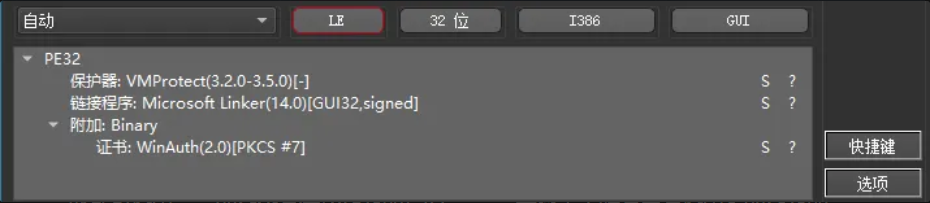

VMP一般都会使用VMP加壳或者虚拟化功能，从Pe-bear工具中不难看出它使用了加壳功能：

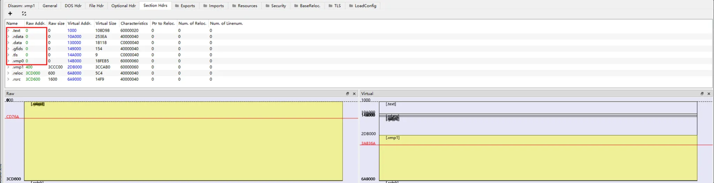

有很多节区，Raw addr=0，但是Virtual addr不为0，说明很有可能是在动态执行过程中回填回去的代码。

在IDA中打开也可以验证同样的结论：

text段为空：

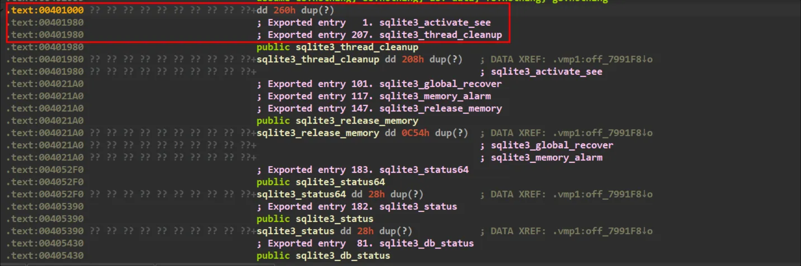

典型的VMP特征：

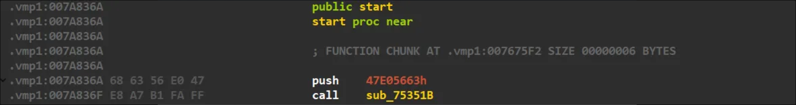

此时可以参考一下沙箱的对这个样本一些分析结果，来进行寻找一些关键API调用的特征。为什么要选择关键API呢？这是因为既然加壳（VMP都是采用lzma压缩方式）了，那它的过程肯定存在一个在text段回写代码的过程，然后再去执行具体的恶意代码段，此时肯定会调用各种API。

从沙箱中不难看出，程序会调用 NtCreateFile：

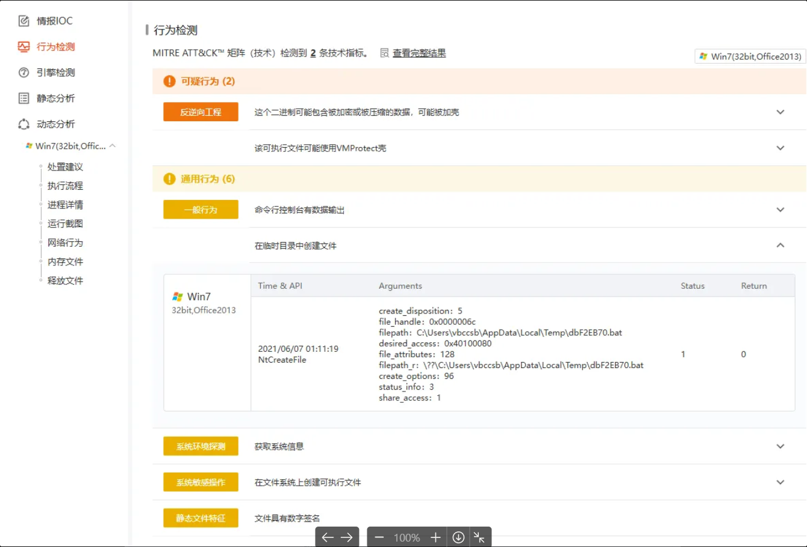

此时在此处API出来进行下断点，来验证上述过程中的论证：

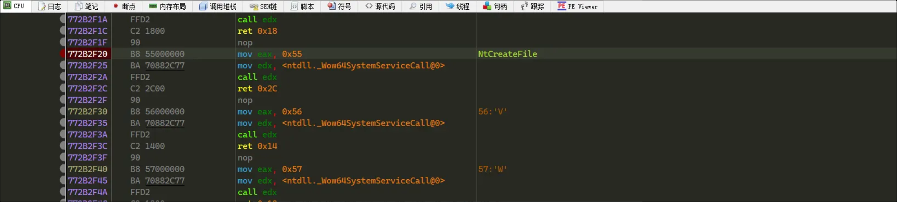

在系统断点的时候，查看text段：

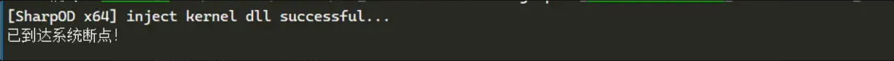

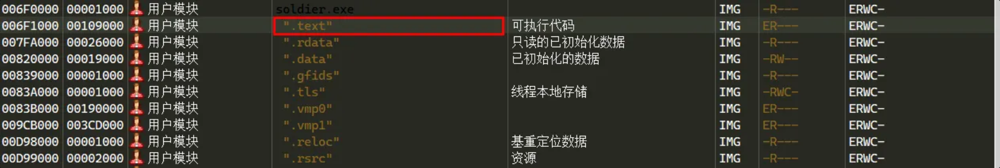

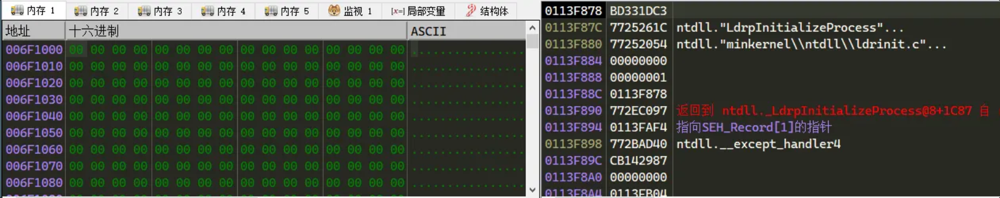

在NtCreateFile断点，断下的时候，此时不难发现 text段依旧回写进去：

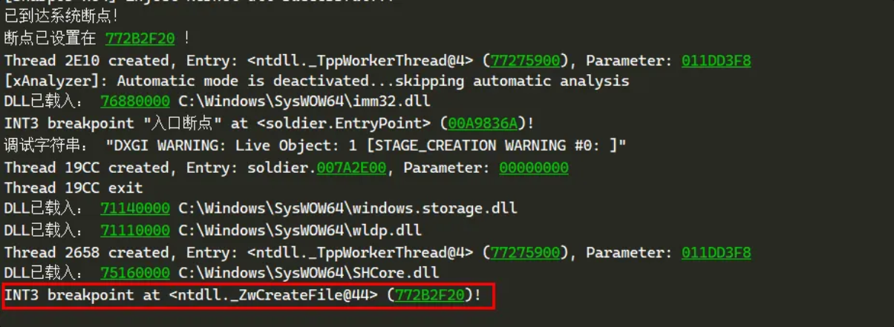

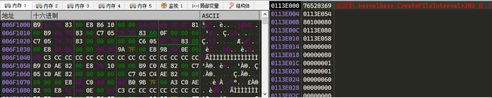

如果没有沙箱参考或者参考的无法断下怎么办？

比如我查看沙箱报告中调用了NtReadFile函数，我想下断点却无法断下。

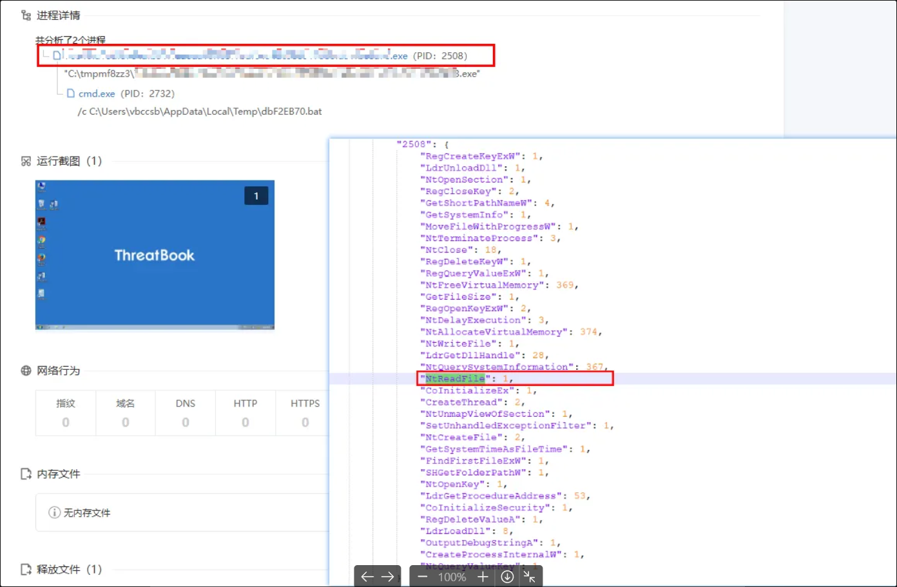

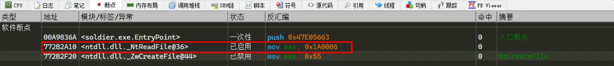

针对这个**Soldier**有一个特殊的必会断下来的函数，就是sleep，为什么呢？这是因为在翻看源码的时候看到了一个实现的VmpotectDump，项目地址为：[scout-win/VMProtectDumper/VMProtectDumper/VMProtectDumper.cpp at master · hackedteam/scout-win · GitHub](https://github.com/hackedteam/scout-win/blob/master/VMProtectDumper/VMProtectDumper/VMProtectDumper.cpp)，自己实现了一个sleep断点来进行dump，可能是用于调试吧。

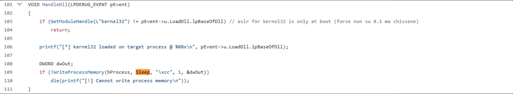

验证一下：确实在 sleep 函数处每次都可以断下

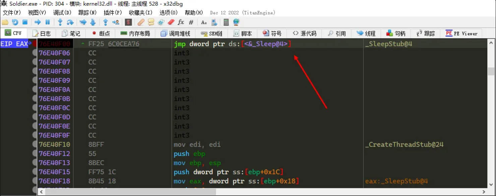

## 3.2 VMP壳DUMP

步骤1：寻找解包后的入口位置

因为是使用了VMP压缩壳的方式，因此需要我们找到解壳后的程序入口点处。如何确定呢？此时我们可以想到MSVC编译的程序都有一个cookie，而且这个cookie最接近函数的入口处，那么是一个关键点。

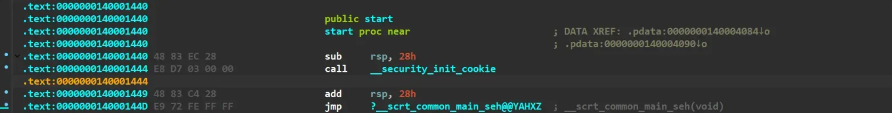

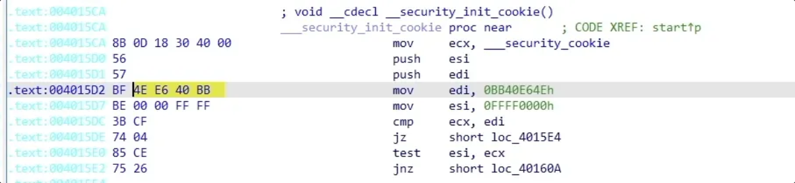 当断点（Sleep或NtCreateFile或其他）断住的时候，开始在.text段搜索特征码：4E E6 40 BB

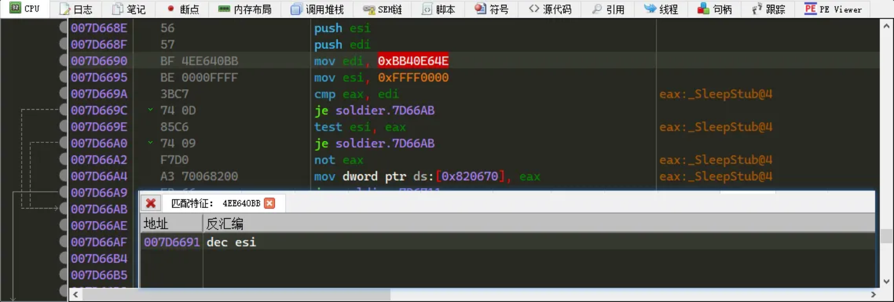

找到相关位置后，下断点，重新运行程序，开始查看堆栈，寻找调用位置（记得关闭程序的基址随机化）：

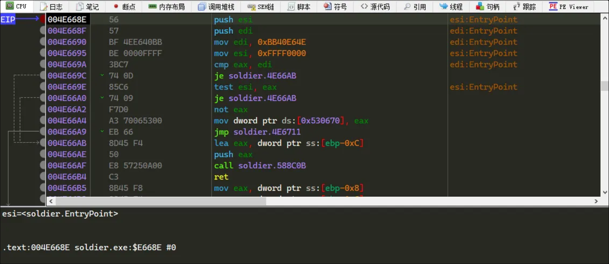

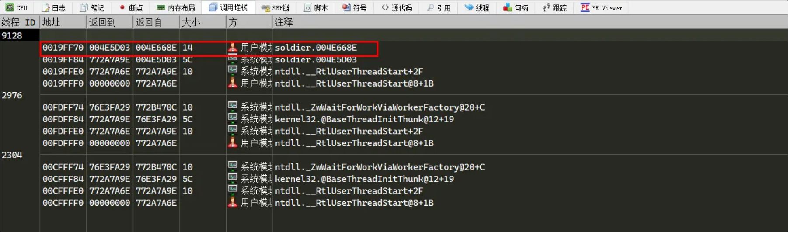

此时入口位置就依旧查找到了。

步骤2：使用vmpimportfixer进行Dump

因为所有的程序API都是被保护的，所以我们需要进行内存Dump修复API，方便我们进行静态分析。这里我们采用的是https://github.com/mike1k/VMPImportFixer，但是这里需要注意一个时机，我们在入口时机越早那么dump的程序就越完整，时机越迟，程序运行被更改的东西就越多，这就是为什么我们需要寻找入口点。

使用方式为：VMPImportFixer.exe" -p pid

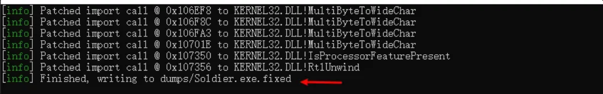

打开dump的Soldier.exe.fixed文件，可以查看已经修复了很多。

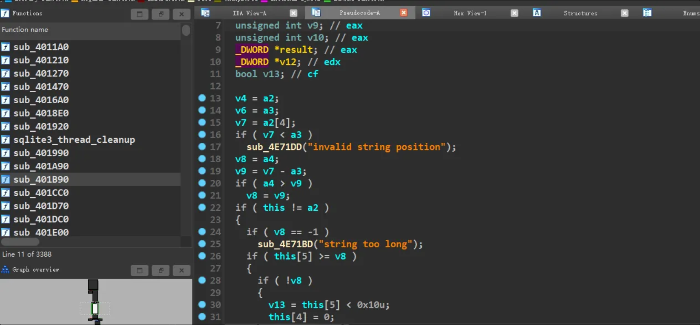

缺点分析：

入口点没有恢复，需要自己进行恢复：

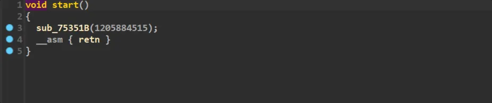

后续我再尝试一下其他的工具来进行修复，此处我们只需要静态分析，所以不会太在这些瑕疵。

存在一些API并没有修复：

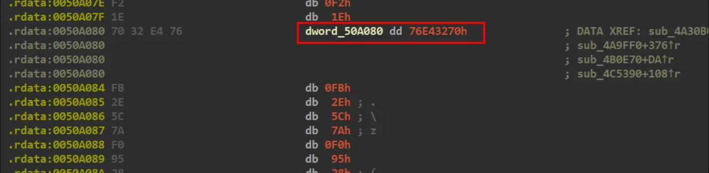

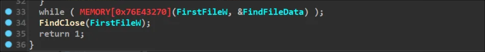

这里问题不是很大，因为没有恢复的API，我们可以动态调试分析确定API是什么。

## 3.3 配置文件提取

对于这种加密的配置文件提取，我们都是使用capa来定位一些关键点，然后逐个突破。

capa介绍：<https://github.com/mandiant/capa>

capa安装：<https://github.com/mandiant/capa/tree/master/capa/ida/plugin>

步骤1：

ida python安装 flare-capa 库：pip install flare-capa

步骤2：

将https://raw.githubusercontent.com/mandiant/capa/master/capa/ida/plugin/capa\_explorer.py文件拷贝到插件目录中

步骤3：

下载指定的版本的规则库库，这里一点要注意，下载的规则库要和 flare-capa版本一致，否则的话就会报错。

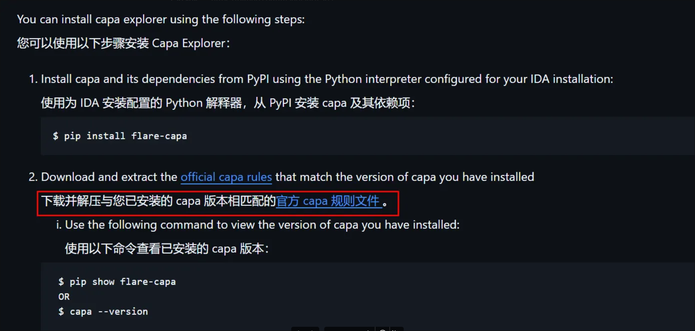

安装成功后效果如下：

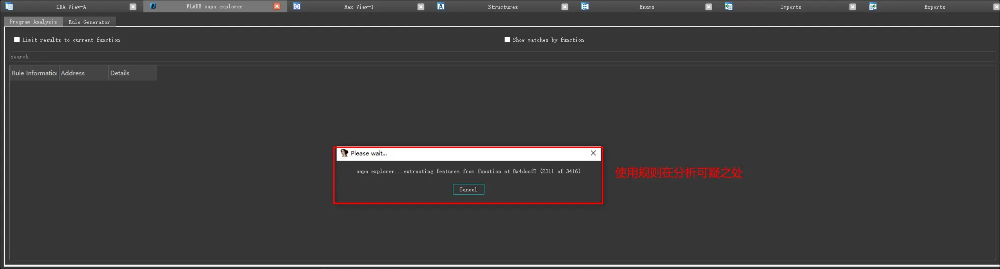

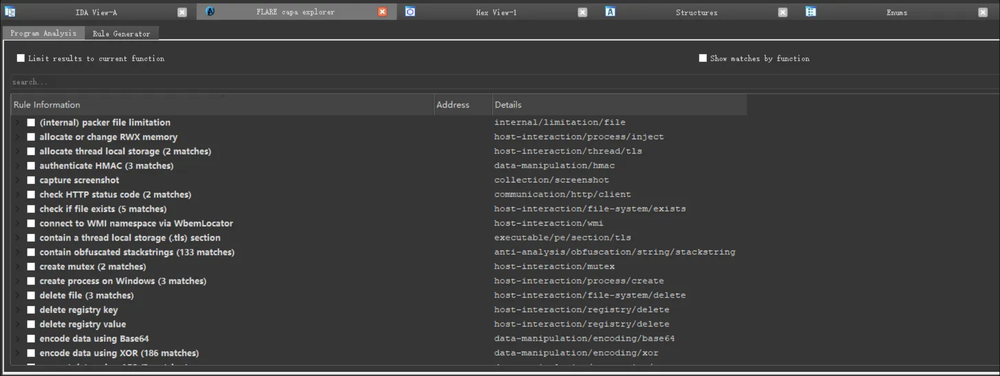

配置文件一般都是采用加密算法进行加密（经验值），所以我们重点需要放在分析加密算法的周围，这边就是很长时间的枯燥分析时间…..（这里跳过）。

这里重点来看 AES算法的周围部分：

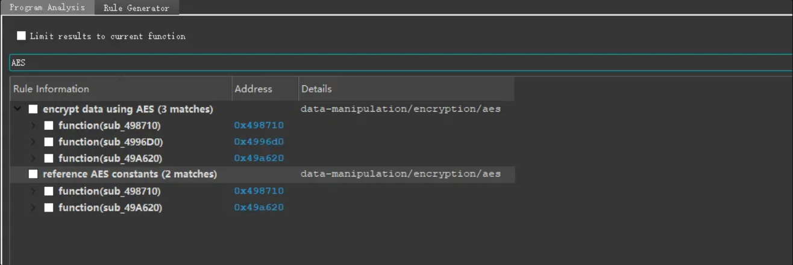

查找方式是：先跳转到函数处，然后一直搜索调用链条，也就是交叉引用的部分。

举例：以sub\_4996D0函数为例子，我们查看其交叉引用

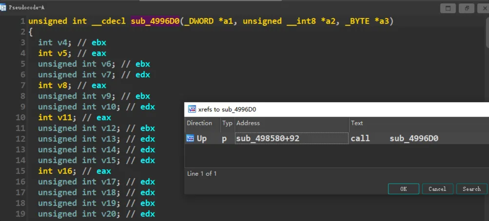

来到sub\_498580函数，然后查看参数，继续就往上交叉引用：

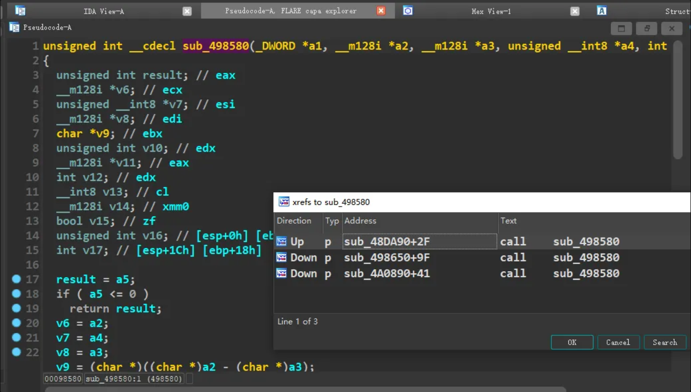

重点是查找参数存在疑似加密串的部分，最终，找到了一个有用的链条：

第一层，由 sub\_498710 来到 sub\_4984E0 函数：

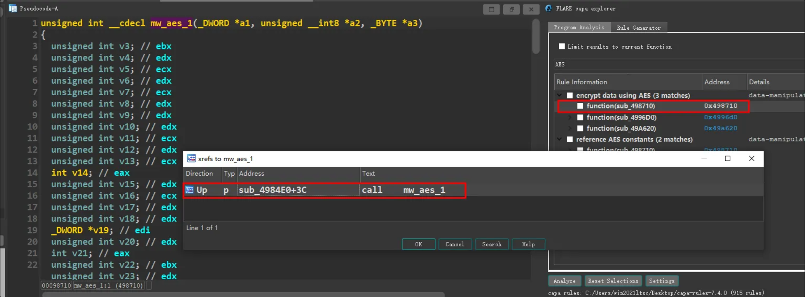

第二层，由sub\_4984E0 来到 sub\_4A0840 函数：

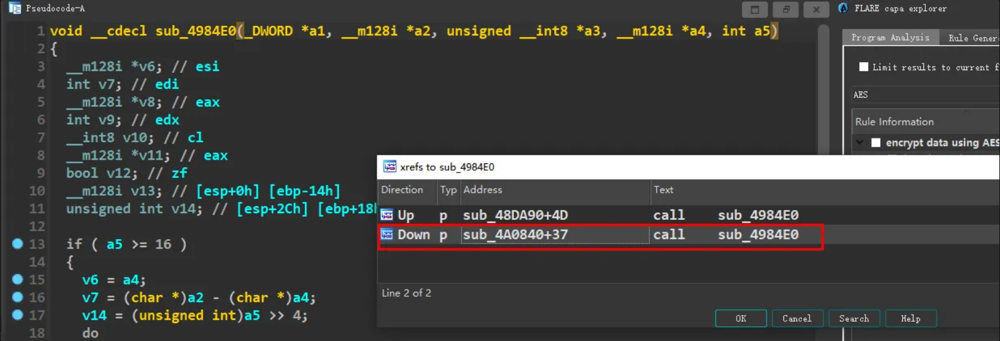

第三层，由sub\_4A0840 来到 sub\_49F390函数：

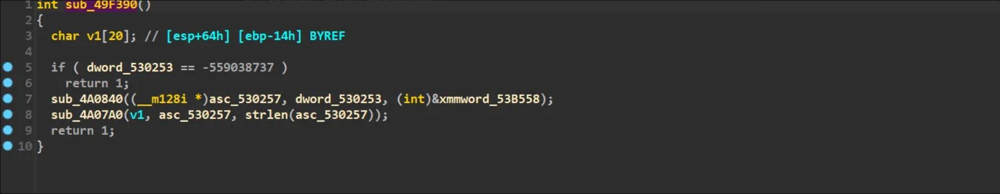

此时查看参数存在加密的字符串，极其可疑，因此我们需要追踪和解密一下：

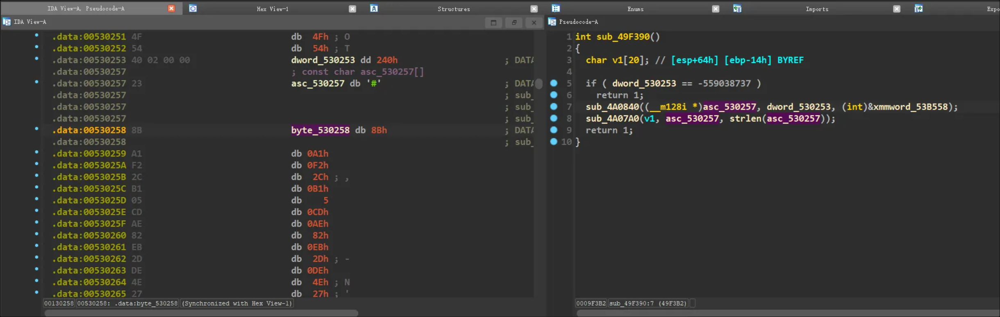

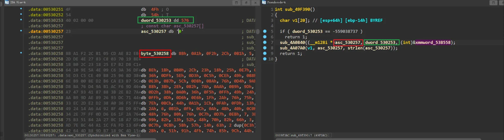

这里可以猜到，第一个参数是加密的密文，第二个是密文的长度，第三个大概率就是密钥了，因此，针对第三个参数继续寻找，直到找到密钥。

查看其交叉引用，只有一处写的地方：

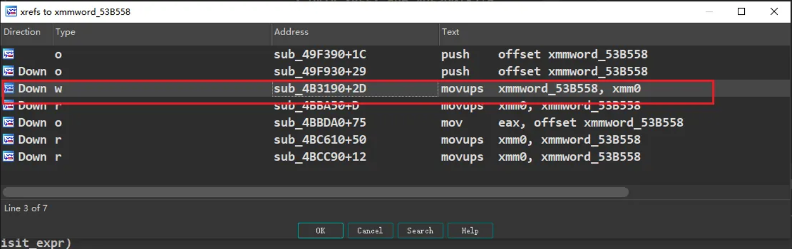

密钥为：

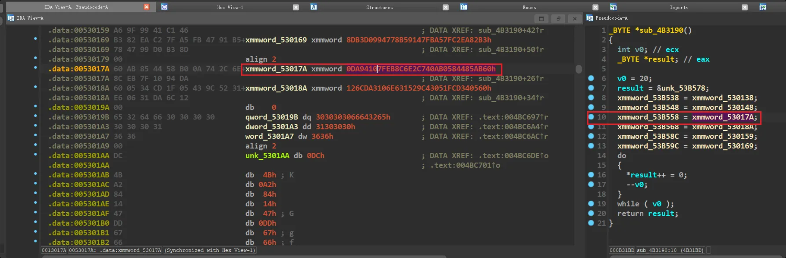

此时尝试解密：使用 <https://gchq.github.io/CyberChef/>的AES模块，直接找到关键位置提取出来了配置。

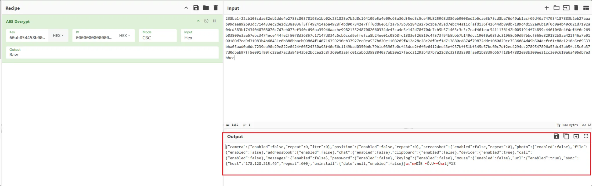

此时分析就到此结束，哪里存在不对的地方，恳请大佬斧正！

# 四、参考

Soldier泄露的源码分析：<https://cloud.tencent.com/developer/article/1038027>

Hacked Team泄露的仓库：<https://github.com/hackedteam/>
